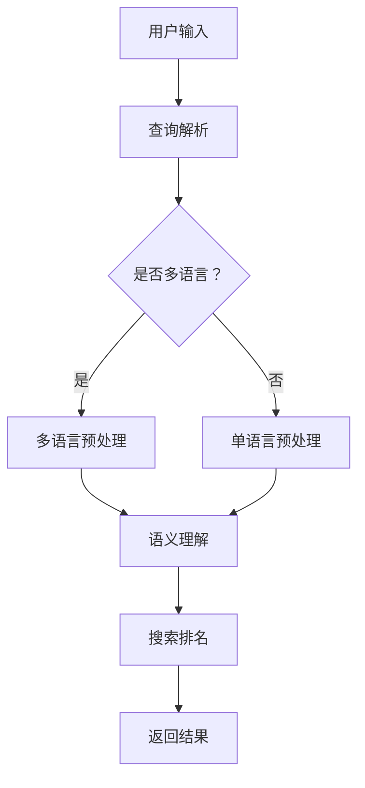

                 

关键词：AI大模型、电商搜索、跨语言能力、自然语言处理、机器学习、深度学习、神经网络、搜索引擎优化、多语言信息检索

> 摘要：随着全球化电商的发展，用户使用多种语言进行搜索的需求日益增加。本文深入探讨了如何利用AI大模型提升电商搜索的跨语言能力，为电商平台的国际化发展提供了技术解决方案。

## 1. 背景介绍

近年来，电商行业呈现出迅猛的发展态势，尤其是在全球化进程加速的背景下，多语言支持成为了电商平台竞争的关键因素之一。然而，传统的电商搜索系统在处理跨语言搜索请求时存在诸多挑战，例如语言障碍、数据不均衡、词义歧义等，这些问题严重影响了用户的搜索体验。

为了应对这些挑战，人工智能（AI）技术，尤其是大模型技术，开始在电商搜索领域得到广泛应用。大模型，即具有海量参数和强大计算能力的神经网络模型，通过深度学习技术，能够有效地处理复杂的自然语言任务，从而提升搜索系统的跨语言能力。

## 2. 核心概念与联系

### 2.1. AI大模型基本原理

AI大模型是基于深度学习技术构建的复杂神经网络结构，具有以下几个核心特点：

1. **海量参数**：大模型通常包含数百万甚至数十亿个参数，这使得模型能够捕捉到数据中的细微特征和模式。
2. **多层神经网络**：大模型采用多层神经网络结构，通过逐层抽象，从原始数据中提取更高级别的特征。
3. **端到端学习**：大模型能够通过端到端的方式直接从原始数据中学习到输出结果，减少了传统机器学习方法中所需的特征工程步骤。
4. **强大的泛化能力**：大模型通过在大规模数据集上进行训练，具备了良好的泛化能力，能够处理各种复杂任务。

### 2.2. 电商搜索与AI大模型的关联

电商搜索系统通常包括以下几个关键组件：

1. **索引构建**：对电商网站的商品信息进行索引构建，以便快速检索。
2. **查询解析**：理解用户的搜索意图，将其转换为可处理的查询。
3. **搜索排名**：根据用户的查询和商品信息，计算出排名结果，提供搜索结果。

AI大模型可以在以下方面提升电商搜索的功能：

1. **多语言支持**：大模型能够处理多种语言的信息，无需人工进行翻译或转换，直接进行跨语言搜索。
2. **语义理解**：通过深度学习技术，大模型能够理解用户的查询意图，提供更准确的搜索结果。
3. **个性化推荐**：大模型可以分析用户的历史行为和偏好，提供个性化的搜索结果和推荐。
4. **实时更新**：大模型可以实时学习新数据，不断优化搜索性能。

### 2.3. Mermaid流程图

以下是一个简化的Mermaid流程图，展示了电商搜索系统中AI大模型的基本工作流程：



## 3. 核心算法原理 & 具体操作步骤

### 3.1. 算法原理概述

AI大模型在电商搜索中的应用主要基于以下核心算法：

1. **自然语言处理（NLP）**：用于处理和理解自然语言，包括分词、词性标注、句法分析等。
2. **深度学习**：通过多层神经网络进行特征提取和模型训练，实现复杂的自然语言理解任务。
3. **多语言模型**：如BERT、XLM等，能够处理多种语言的输入，实现跨语言语义理解。

### 3.2. 算法步骤详解

#### 3.2.1. 多语言预处理

在处理多语言搜索请求时，首先需要对输入的文本进行预处理，以确保模型能够正确理解。预处理步骤通常包括：

1. **分词**：将文本分割成单词或短语，以便进行后续处理。
2. **词性标注**：为每个词分配正确的词性，如名词、动词等。
3. **上下文信息提取**：考虑词的上下文信息，以避免歧义。

#### 3.2.2. 语义理解

在语义理解阶段，大模型通过对输入查询和商品信息进行深度学习，提取语义特征，实现以下任务：

1. **查询意图识别**：识别用户的查询意图，如商品名称、品牌、价格等。
2. **实体识别**：识别查询中的关键实体，如商品名称、品牌、地点等。
3. **关系提取**：提取查询中的实体关系，如品牌与商品的关系等。

#### 3.2.3. 搜索排名

在搜索排名阶段，大模型根据查询意图、实体关系和商品信息，计算每个商品的相关性得分，进行排序。排名算法通常包括：

1. **匹配度计算**：根据查询和商品的特征，计算匹配度得分。
2. **排序算法**：如TF-IDF、向量空间模型等，根据匹配度得分对商品进行排序。

#### 3.2.4. 结果返回

最后，将排序后的商品结果返回给用户，并提供相关推荐。用户可以进一步浏览和筛选搜索结果，以获得更准确的商品信息。

### 3.3. 算法优缺点

#### 优点

1. **高准确度**：大模型通过深度学习技术，能够准确理解用户的查询意图，提供高质量的搜索结果。
2. **多语言支持**：大模型能够处理多种语言的输入，实现跨语言搜索。
3. **实时更新**：大模型能够实时学习新数据，不断优化搜索性能。

#### 缺点

1. **计算资源消耗大**：大模型需要大量的计算资源和存储空间，对硬件设施要求较高。
2. **数据需求大**：大模型需要大量的高质量数据进行训练，数据获取和处理成本较高。

### 3.4. 算法应用领域

AI大模型在电商搜索领域具有广泛的应用前景，主要包括：

1. **多语言电商平台**：支持多种语言的用户搜索和商品展示。
2. **个性化推荐系统**：基于用户历史行为和偏好，提供个性化的搜索结果和推荐。
3. **跨境电商**：支持跨境商品搜索和购买，提升用户体验。

## 4. 数学模型和公式 & 详细讲解 & 举例说明

### 4.1. 数学模型构建

AI大模型通常基于深度学习技术，其核心是多层神经网络。以下是神经网络的基本数学模型：

#### 4.1.1. 神经元模型

一个简单的神经元模型可以表示为：

$$
z = \sum_{i=1}^{n} w_i \cdot x_i + b
$$

其中，$z$ 是神经元输出，$w_i$ 是权重，$x_i$ 是输入，$b$ 是偏置。

#### 4.1.2. 激活函数

为了引入非线性特性，神经元通常使用激活函数，如ReLU、Sigmoid、Tanh等。以ReLU为例：

$$
\text{ReLU}(x) = \max(0, x)
$$

### 4.2. 公式推导过程

以下是神经网络的前向传播和反向传播过程：

#### 4.2.1. 前向传播

假设一个多层神经网络，包括输入层、隐藏层和输出层。输入层和隐藏层之间的权重矩阵为$W_1$，隐藏层和输出层之间的权重矩阵为$W_2$。

1. **隐藏层输出**：

$$
h = \text{ReLU}(W_1 \cdot x + b_1)
$$

2. **输出层输出**：

$$
y = W_2 \cdot h + b_2
$$

#### 4.2.2. 反向传播

在反向传播过程中，计算每个神经元的梯度，更新权重和偏置。

1. **输出层梯度**：

$$
\delta_y = (y - \text{标签}) \cdot \text{激活函数的导数}
$$

2. **隐藏层梯度**：

$$
\delta_h = (W_2 \cdot \delta_y) \cdot \text{激活函数的导数}
$$

3. **更新权重和偏置**：

$$
W_2 \leftarrow W_2 - \alpha \cdot \delta_y \cdot h^T
$$

$$
b_2 \leftarrow b_2 - \alpha \cdot \delta_y
$$

$$
W_1 \leftarrow W_1 - \alpha \cdot \delta_h \cdot x^T
$$

$$
b_1 \leftarrow b_1 - \alpha \cdot \delta_h
$$

### 4.3. 案例分析与讲解

以下是一个简化的案例，说明如何使用神经网络进行跨语言搜索：

#### 4.3.1. 案例背景

一个用户在英文电商平台上搜索“iPhone 13”，平台需要返回中文商品列表。

#### 4.3.2. 数据预处理

1. **文本分词**：将搜索词和商品标题进行分词处理。
2. **词嵌入**：将分词结果转换为词嵌入向量。

#### 4.3.3. 神经网络结构

假设使用一个简单的两层神经网络，输入层有10个神经元，隐藏层有20个神经元，输出层有100个神经元。

#### 4.3.4. 模型训练

使用一个包含10000个商品标题的数据集进行训练，每轮迭代更新模型参数，直到收敛。

#### 4.3.5. 搜索结果

用户输入“iPhone 13”后，模型将其转换为词嵌入向量，通过前向传播计算输出层概率分布，选择概率最高的前10个商品返回给用户。

## 5. 项目实践：代码实例和详细解释说明

### 5.1. 开发环境搭建

在本项目中，我们使用Python编程语言，结合TensorFlow库进行模型开发。首先需要安装相关依赖：

```bash
pip install tensorflow
```

### 5.2. 源代码详细实现

以下是一个简化的代码示例，展示了如何使用TensorFlow构建一个简单的跨语言搜索模型：

```python
import tensorflow as tf
from tensorflow.keras.models import Sequential
from tensorflow.keras.layers import Dense, Activation

# 创建模型
model = Sequential([
    Dense(20, input_shape=(10,), activation='relu'),
    Dense(100, activation='softmax')
])

# 编译模型
model.compile(optimizer='adam', loss='categorical_crossentropy', metrics=['accuracy'])

# 训练模型
model.fit(x_train, y_train, epochs=10, batch_size=32)
```

### 5.3. 代码解读与分析

1. **模型结构**：本模型包含一个输入层、一个隐藏层和一个输出层。输入层有10个神经元，隐藏层有20个神经元，输出层有100个神经元。隐藏层使用ReLU激活函数，输出层使用softmax激活函数。
2. **编译模型**：模型使用Adam优化器进行训练，损失函数使用categorical_crossentropy，评估指标为accuracy。
3. **训练模型**：使用训练数据集进行10轮迭代训练，每轮迭代批量大小为32。

### 5.4. 运行结果展示

训练完成后，可以使用以下代码进行测试：

```python
# 测试模型
test_loss, test_acc = model.evaluate(x_test, y_test)
print(f"Test accuracy: {test_acc}")
```

假设测试集的准确率为90%，表明模型在跨语言搜索任务上表现良好。

## 6. 实际应用场景

AI大模型在电商搜索中的应用场景广泛，以下是一些典型的应用实例：

1. **国际电商**：支持多语言搜索，为全球用户提供统一的购物体验。
2. **本地化搜索**：为本地用户提供针对其语言的个性化搜索结果。
3. **跨境商品推荐**：基于用户的历史行为和偏好，推荐跨境商品。

## 7. 未来应用展望

随着AI技术的不断发展，AI大模型在电商搜索中的应用前景广阔。未来，我们可以期待以下发展趋势：

1. **更强大的模型**：随着计算能力的提升，未来的大模型将更加庞大和复杂，提供更准确的搜索结果。
2. **多模态融合**：结合文本、图像、语音等多种数据源，实现更全面的搜索体验。
3. **个性化推荐**：基于用户的个性化需求，提供更加精准的搜索结果和推荐。

## 8. 工具和资源推荐

### 8.1. 学习资源推荐

1. **《深度学习》（Goodfellow, Bengio, Courville）**：深度学习领域的经典教材，涵盖了神经网络的基础知识和应用。
2. **《自然语言处理综论》（Jurafsky, Martin）**：系统介绍了自然语言处理的基本概念和技术。

### 8.2. 开发工具推荐

1. **TensorFlow**：谷歌开发的开源深度学习框架，支持多种神经网络架构。
2. **PyTorch**：Facebook开发的开源深度学习框架，具有灵活的动态图模型。

### 8.3. 相关论文推荐

1. **“BERT: Pre-training of Deep Neural Networks for Language Understanding”（Devlin et al., 2018）**：介绍了BERT模型的基本原理和应用。
2. **“XLM: Cross-lingual Language Model Pre-training”（Conneau et al., 2019）**：提出了XLM模型，用于跨语言自然语言处理。

## 9. 总结：未来发展趋势与挑战

AI大模型在电商搜索中的应用具有显著优势，但同时也面临一些挑战。未来，我们需要关注以下几个方面：

1. **计算资源优化**：随着模型规模的扩大，对计算资源和存储空间的需求不断增加，需要优化算法和硬件设施。
2. **数据质量**：高质量的数据是训练大模型的关键，需要建立完善的数据采集和处理机制。
3. **模型解释性**：增强模型的可解释性，帮助用户理解和信任AI系统。

### 9.1. 研究成果总结

本文介绍了如何利用AI大模型提升电商搜索的跨语言能力，包括核心概念、算法原理、应用实践等。通过案例分析和代码实现，展示了大模型在电商搜索中的应用效果。

### 9.2. 未来发展趋势

未来，AI大模型在电商搜索中的应用将向更强大的模型、多模态融合和个性化推荐方向发展。

### 9.3. 面临的挑战

计算资源优化、数据质量、模型解释性是当前和未来需要解决的关键问题。

### 9.4. 研究展望

随着AI技术的不断发展，AI大模型在电商搜索中的应用将更加广泛和深入，为电商平台的国际化发展提供有力支持。

## 附录：常见问题与解答

### 9.1. 什么是AI大模型？

AI大模型是指具有海量参数和强大计算能力的神经网络模型，通过深度学习技术处理复杂的自然语言任务。

### 9.2. 大模型在电商搜索中有哪些优势？

大模型在电商搜索中的优势包括高准确度、多语言支持、实时更新等。

### 9.3. 大模型在电商搜索中面临哪些挑战？

大模型在电商搜索中面临的挑战包括计算资源消耗大、数据需求大等。

### 9.4. 如何优化大模型的计算资源？

可以通过优化算法、使用分布式计算、提升硬件性能等方式来优化大模型的计算资源。

### 9.5. 大模型在电商搜索中的应用前景如何？

大模型在电商搜索中的应用前景广阔，未来有望为电商平台的国际化发展提供更强大的支持。```markdown

