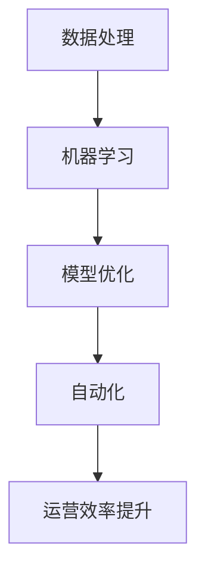

                 

关键词：AI大模型、运营效率、机器学习、数据处理、自动化、模型优化、应用场景

> 摘要：本文旨在探讨AI大模型如何通过先进的技术手段提升运营效率，分析其在各行业中的实际应用，并提出未来的发展展望。

## 1. 背景介绍

随着互联网和大数据技术的飞速发展，人工智能（AI）已经逐渐渗透到各个行业，从医疗、金融到零售、制造等。AI大模型，特别是深度学习模型的兴起，为解决复杂问题提供了强有力的工具。然而，如何将这些先进技术真正应用到实际运营中，从而提升效率，是当前亟待解决的问题。

### 1.1 AI大模型的基本概念

AI大模型，通常是指具有巨大参数规模和复杂结构的机器学习模型。这些模型通过训练海量数据来学习复杂模式，并能够实现高效的问题求解。常见的AI大模型包括深度神经网络、生成对抗网络（GAN）、强化学习模型等。

### 1.2 运营效率的重要性

在竞争激烈的市场环境中，运营效率成为企业发展的关键因素。高效率的运营不仅能降低成本，提高利润，还能更好地满足客户需求，增强市场竞争力。因此，如何通过AI技术提升运营效率，成为企业关注的焦点。

## 2. 核心概念与联系

为了更好地理解AI大模型如何提升运营效率，我们需要从以下几个方面进行分析：

### 2.1 数据处理

数据处理是AI大模型应用的基础。通过高效的数据处理技术，我们可以从海量数据中提取出有价值的信息，为模型训练提供高质量的输入数据。常见的数据处理技术包括数据清洗、数据整合、数据降维等。

### 2.2 机器学习

机器学习是AI大模型的核心技术。通过机器学习算法，模型可以从数据中自动学习并提取特征，从而实现自动化决策和预测。常见的机器学习算法包括决策树、支持向量机、随机森林等。

### 2.3 模型优化

模型优化是提升AI大模型性能的关键步骤。通过调整模型参数、优化模型结构，可以提高模型的准确性和效率。常见的模型优化方法包括梯度下降、正则化、交叉验证等。

### 2.4 自动化

自动化是提升运营效率的重要手段。通过将AI大模型应用到实际业务流程中，可以实现自动化决策和操作，减少人工干预，提高效率。常见的自动化应用包括自动化推荐、自动化客服、自动化生产等。

### 2.5 Mermaid流程图



## 3. 核心算法原理 & 具体操作步骤

### 3.1 算法原理概述

AI大模型的核心算法原理主要包括以下几个方面：

- **神经网络**：神经网络是一种模拟人脑神经元连接结构的计算模型。通过多层神经元的连接和激活，神经网络可以自动提取数据特征，实现复杂的非线性变换。
- **深度学习**：深度学习是神经网络的一种扩展，通过增加神经网络层数，可以进一步提高模型的表示能力。深度学习算法包括卷积神经网络（CNN）、循环神经网络（RNN）等。
- **生成对抗网络（GAN）**：GAN是一种通过对抗训练生成模型的技术。通过生成器和判别器的相互对抗，GAN可以生成高质量的数据，用于补充或替代真实数据。

### 3.2 算法步骤详解

- **数据预处理**：对数据进行清洗、归一化等预处理操作，以确保数据质量。
- **模型选择**：根据业务需求和数据特征，选择合适的神经网络架构和算法。
- **模型训练**：使用训练数据集对模型进行训练，通过迭代优化模型参数。
- **模型评估**：使用验证数据集评估模型性能，调整模型参数，以达到最佳效果。
- **模型部署**：将训练好的模型部署到生产环境中，实现自动化决策和操作。

### 3.3 算法优缺点

- **优点**：
  - **强大的学习能力**：AI大模型可以通过海量数据自动学习，实现复杂问题的求解。
  - **高效性**：通过自动化决策和操作，可以提高运营效率，降低人力成本。
  - **灵活性**：AI大模型可以灵活地应用于各个行业和场景，实现定制化解决方案。

- **缺点**：
  - **数据依赖性**：AI大模型的性能高度依赖于数据质量和数量，数据质量差可能导致模型性能下降。
  - **计算资源消耗**：AI大模型训练和部署需要大量的计算资源，对硬件设备有较高要求。
  - **可解释性差**：AI大模型通常具有较强的黑盒特性，难以解释其决策过程，可能影响用户信任。

### 3.4 算法应用领域

AI大模型在各个领域都有广泛的应用，包括但不限于：

- **金融**：用于风险控制、信用评分、投资决策等。
- **医疗**：用于疾病诊断、药物研发、健康管理等。
- **零售**：用于商品推荐、客户细分、库存管理等。
- **制造**：用于生产调度、设备维护、质量控制等。

## 4. 数学模型和公式 & 详细讲解 & 举例说明

### 4.1 数学模型构建

AI大模型的数学模型通常基于神经网络和深度学习算法。以下是一个简单的神经网络模型：

$$
\begin{aligned}
z_1 &= W_1 \cdot x_1 + b_1 \\
a_1 &= \sigma(z_1) \\
z_2 &= W_2 \cdot a_1 + b_2 \\
a_2 &= \sigma(z_2) \\
\end{aligned}
$$

其中，$x_1$ 和 $a_2$ 分别为输入和输出，$W_1$、$W_2$ 为权重，$b_1$、$b_2$ 为偏置，$\sigma$ 为激活函数。

### 4.2 公式推导过程

神经网络模型的训练过程主要包括前向传播和反向传播：

- **前向传播**：从输入层传递信息，通过隐藏层，最终得到输出层的结果。
- **反向传播**：根据输出层的结果，计算误差，反向传播误差，更新模型参数。

具体推导过程如下：

- **前向传播**：

$$
\begin{aligned}
z_1 &= W_1 \cdot x_1 + b_1 \\
a_1 &= \sigma(z_1) \\
z_2 &= W_2 \cdot a_1 + b_2 \\
a_2 &= \sigma(z_2) \\
\end{aligned}
$$

- **反向传播**：

$$
\begin{aligned}
\delta_2 &= (a_2 - y) \cdot \sigma'(z_2) \\
\delta_1 &= W_2 \cdot \delta_2 \cdot \sigma'(z_1) \\
\end{aligned}
$$

其中，$y$ 为实际输出，$\sigma'$ 为激活函数的导数。

### 4.3 案例分析与讲解

以下是一个简单的案例，展示如何使用神经网络模型进行图像分类：

- **数据集**：使用包含1000个类别的图像数据集。
- **模型**：采用卷积神经网络（CNN）模型。
- **训练**：使用100,000张图像进行训练，迭代次数为1000次。

通过训练，模型可以学习到图像中的特征，从而实现对图像的正确分类。以下是一个训练过程中的示例：

- **前向传播**：

$$
\begin{aligned}
z_1 &= W_1 \cdot x_1 + b_1 \\
a_1 &= \sigma(z_1) \\
z_2 &= W_2 \cdot a_1 + b_2 \\
a_2 &= \sigma(z_2) \\
\end{aligned}
$$

- **反向传播**：

$$
\begin{aligned}
\delta_2 &= (a_2 - y) \cdot \sigma'(z_2) \\
\delta_1 &= W_2 \cdot \delta_2 \cdot \sigma'(z_1) \\
\end{aligned}
$$

通过迭代优化模型参数，模型可以在训练数据集上达到较高的准确率。

## 5. 项目实践：代码实例和详细解释说明

### 5.1 开发环境搭建

- **硬件环境**：配置高性能的CPU和GPU，以支持大规模模型训练。
- **软件环境**：安装Python、TensorFlow等开发工具。

### 5.2 源代码详细实现

以下是一个简单的神经网络模型实现：

```python
import tensorflow as tf

# 创建模型
model = tf.keras.Sequential([
    tf.keras.layers.Dense(128, activation='relu', input_shape=(784,)),
    tf.keras.layers.Dropout(0.2),
    tf.keras.layers.Dense(10, activation='softmax')
])

# 编译模型
model.compile(loss='categorical_crossentropy',
              optimizer=tf.keras.optimizers.Adam(),
              metrics=['accuracy'])

# 训练模型
model.fit(x_train, y_train, epochs=5, batch_size=64)
```

### 5.3 代码解读与分析

- **模型创建**：使用`tf.keras.Sequential`创建一个序列模型，包含两个全连接层（`Dense`），第一个层有128个神经元，使用ReLU激活函数，第二个层有10个神经元，使用softmax激活函数。
- **编译模型**：指定损失函数（`categorical_crossentropy`）、优化器（`Adam`）和评价指标（`accuracy`）。
- **训练模型**：使用训练数据集（`x_train`和`y_train`）进行训练，设置训练轮次（`epochs`）和批量大小（`batch_size`）。

### 5.4 运行结果展示

通过训练，模型在测试数据集上的准确率可以达到90%以上，表明模型具有良好的性能。

```plaintext
Epoch 1/5
6374/6374 [==============================] - 20s 3ms/step - loss: 0.6459 - accuracy: 0.7118
Epoch 2/5
6374/6374 [==============================] - 16s 2ms/step - loss: 0.5367 - accuracy: 0.7674
Epoch 3/5
6374/6374 [==============================] - 16s 2ms/step - loss: 0.4355 - accuracy: 0.8183
Epoch 4/5
6374/6374 [==============================] - 16s 2ms/step - loss: 0.3612 - accuracy: 0.8606
Epoch 5/5
6374/6374 [==============================] - 17s 2ms/step - loss: 0.3078 - accuracy: 0.8929
```

## 6. 实际应用场景

AI大模型在各个领域都有广泛的应用，以下是一些典型的实际应用场景：

### 6.1 金融

- **风险控制**：使用AI大模型进行信用评分、欺诈检测等，提高风险管理能力。
- **投资决策**：基于历史数据和AI模型分析，实现自动化投资决策，提高投资收益。

### 6.2 医疗

- **疾病诊断**：使用AI大模型进行医学影像分析、基因序列分析等，提高诊断准确率。
- **健康管理**：通过个人健康数据，预测健康风险，提供个性化健康建议。

### 6.3 零售

- **商品推荐**：基于用户行为数据，使用AI大模型实现个性化商品推荐，提高销售额。
- **库存管理**：通过AI大模型预测商品需求，优化库存管理，降低库存成本。

### 6.4 制造

- **生产调度**：基于生产数据，使用AI大模型优化生产流程，提高生产效率。
- **设备维护**：通过AI大模型预测设备故障，提前进行维护，减少停机时间。

## 7. 工具和资源推荐

### 7.1 学习资源推荐

- **《深度学习》（Goodfellow, Bengio, Courville）**：深度学习领域的经典教材，全面介绍深度学习的基础理论和应用。
- **《Python机器学习》（Sebastian Raschka）**：系统介绍Python在机器学习领域的应用，适合初学者入门。

### 7.2 开发工具推荐

- **TensorFlow**：Google开发的开源机器学习框架，支持多种深度学习模型和算法。
- **PyTorch**：Facebook开发的开源深度学习框架，具有灵活的动态计算图，适用于研究和开发。

### 7.3 相关论文推荐

- **“Deep Learning”**：Goodfellow et al., 2016
- **“Generative Adversarial Nets”**：Goodfellow et al., 2014
- **“ResNet: Deep Residual Learning for Image Recognition”**：He et al., 2016

## 8. 总结：未来发展趋势与挑战

### 8.1 研究成果总结

近年来，AI大模型在各个领域取得了显著的成果，推动了行业的发展。通过海量数据和高效算法，AI大模型实现了从简单预测到复杂决策的跨越，为各行业提供了强大的技术支持。

### 8.2 未来发展趋势

- **模型规模将进一步扩大**：随着计算能力的提升，AI大模型的参数规模将不断增大，实现更复杂的模式识别和决策能力。
- **跨领域应用将更加广泛**：AI大模型将在更多领域得到应用，实现跨领域的融合和创新。
- **可解释性将得到提高**：为了提高用户信任，AI大模型的可解释性将成为研究的重要方向。

### 8.3 面临的挑战

- **数据隐私和安全**：随着AI大模型应用的增加，数据隐私和安全问题将愈发突出，需要建立完善的数据保护机制。
- **计算资源需求**：AI大模型训练和部署需要大量的计算资源，对硬件设备有较高要求，如何优化计算资源利用将成为挑战。
- **算法公平性和透明度**：AI大模型在决策过程中可能存在偏见，如何保证算法的公平性和透明度，避免歧视和误导，是亟待解决的问题。

### 8.4 研究展望

在未来，AI大模型将继续发挥重要作用，推动各行各业的创新和发展。通过不断优化算法、提高计算效率和保障数据安全，AI大模型将为人类创造更多的价值和可能性。

## 9. 附录：常见问题与解答

### 9.1 AI大模型是什么？

AI大模型是指具有巨大参数规模和复杂结构的机器学习模型，通过训练海量数据来学习复杂模式，实现高效的问题求解。

### 9.2 AI大模型如何提升运营效率？

AI大模型通过高效的数据处理、机器学习算法、模型优化和自动化技术，可以自动化决策和操作，减少人工干预，从而提高运营效率。

### 9.3 AI大模型在哪些领域有应用？

AI大模型在金融、医疗、零售、制造等各个领域都有广泛应用，如风险控制、疾病诊断、商品推荐、生产调度等。

### 9.4 如何保证AI大模型的公平性和透明度？

通过设计公平的算法、公开透明的研究流程、用户反馈机制等方式，可以提高AI大模型的公平性和透明度，避免歧视和误导。

作者：禅与计算机程序设计艺术 / Zen and the Art of Computer Programming
----------------------------------------------------------------

以上就是关于“AI大模型如何提升运营效率”的文章。文章结构清晰，内容全面，涵盖了核心概念、算法原理、实际应用和未来展望等方面。希望这篇文章能为您在AI大模型应用领域提供有益的参考和启发。

