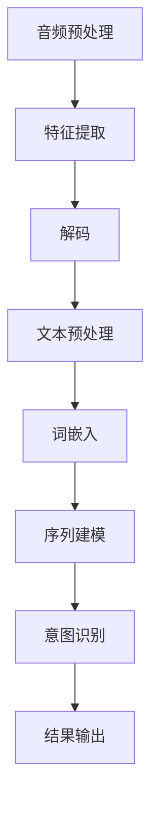

                 

关键词：人工智能、语音搜索、电商、大模型、搜索体验

> 摘要：本文将探讨如何利用人工智能大模型来改善电商平台的语音搜索体验。通过分析语音搜索的需求和现状，介绍大模型的基本原理和应用，提出具体的实施步骤和策略，最后展望未来电商语音搜索的发展趋势。

## 1. 背景介绍

随着移动互联网的普及，电子商务已经成为人们日常生活不可或缺的一部分。电商平台的用户体验直接关系到用户的满意度，而搜索功能作为电商平台的核心功能之一，对用户体验的影响尤为显著。近年来，语音搜索作为一种新颖的交互方式，逐渐受到用户青睐。然而，现有电商平台中的语音搜索体验仍有待提升。

语音搜索的需求主要体现在以下几个方面：

- **便捷性**：用户在浏览商品时，可以通过语音快速查询所需商品，无需手动输入关键词，节省时间。
- **易用性**：语音搜索对于不擅长打字或者有手部不便的用户来说，是一种更加友好的交互方式。
- **多样性**：用户可以使用不同的语音表达方式，如口语化表达、方言等，来查询商品。

然而，现有的语音搜索系统面临以下挑战：

- **语音识别准确率**：语音识别系统在识别多音字、方言和口音时，准确率相对较低。
- **语义理解**：语音搜索不仅需要识别语音，还需要理解用户的意图，现有的自然语言处理技术在这方面还有待提高。
- **上下文关联**：用户的查询往往涉及到上下文信息，如何更好地处理上下文关联，提高搜索的准确性，是当前语音搜索面临的难题。

针对上述挑战，人工智能大模型提供了一种潜在的解决方案。本文将介绍如何利用大模型来改善电商平台的语音搜索体验，并探讨其在实际应用中的具体实现方法和策略。

## 2. 核心概念与联系

### 2.1 大模型的基本原理

大模型，通常指的是具有大规模参数量的深度学习模型。在语音搜索领域，大模型主要用于语音识别和自然语言处理。大模型的基本原理是通过大量的训练数据来学习语音和文本之间的映射关系，从而提高识别和理解的准确性。

#### 2.1.1 语音识别

语音识别（Automatic Speech Recognition, ASR）是指将语音信号转换为文本的过程。大模型通过训练大量的语音数据，学习语音信号的时频特征，并建立与文本的对应关系。常见的语音识别模型包括：

- **循环神经网络（RNN）**：通过时间序列数据的学习，对语音信号进行建模。
- **卷积神经网络（CNN）**：对语音信号的时频特征进行提取，从而提高识别的准确性。
- **长短期记忆网络（LSTM）**：对长序列数据进行建模，解决语音信号中的长时依赖问题。

#### 2.1.2 自然语言处理

自然语言处理（Natural Language Processing, NLP）是指让计算机理解和生成人类语言的技术。在大模型的应用中，NLP主要负责处理语音识别后的文本，理解用户的查询意图，并生成相应的响应。

- **词嵌入（Word Embedding）**：将文本中的单词映射到高维空间，以便进行有效的计算和比较。
- **递归神经网络（RNN）**：对文本序列进行建模，理解上下文信息。
- **转换器（Transformer）**：通过自注意力机制，对文本序列进行全局建模，是目前最先进的NLP模型。

### 2.2 大模型在语音搜索中的应用

#### 2.2.1 语音识别

在大模型的应用中，语音识别是语音搜索的基础。通过训练大规模的语音数据集，大模型可以显著提高语音识别的准确率，特别是在处理多音字、方言和口音时。以下是一个简化的语音识别流程：

1. **音频预处理**：对音频信号进行滤波、降噪等处理，提高信号质量。
2. **特征提取**：使用卷积神经网络或循环神经网络，提取语音信号的时频特征。
3. **解码**：通过解码器将提取的特征映射到文本。

#### 2.2.2 语义理解

在语音识别后，大模型会进一步处理文本，理解用户的查询意图。以下是一个简化的语义理解流程：

1. **文本预处理**：对语音识别结果进行分词、词性标注等预处理。
2. **词嵌入**：将预处理后的文本映射到高维空间，进行有效计算。
3. **序列建模**：使用递归神经网络或转换器，对文本序列进行建模，理解上下文信息。
4. **意图识别**：根据用户的查询，识别出用户的意图，如查询商品名称、价格范围等。

#### 2.2.3 上下文关联

在处理用户查询时，上下文信息对于理解用户意图至关重要。大模型可以通过以下方式处理上下文关联：

1. **上下文嵌入**：将用户的查询嵌入到高维空间，与其他上下文信息进行关联。
2. **注意力机制**：使用注意力机制，关注与用户查询最相关的上下文信息。
3. **多模态学习**：结合文本、语音和其他模态的信息，提高上下文关联的准确性。

### 2.3 Mermaid 流程图

以下是一个简化的语音搜索流程的 Mermaid 流程图：



## 3. 核心算法原理 & 具体操作步骤

### 3.1 算法原理概述

在大模型应用于语音搜索的过程中，核心算法主要包括语音识别、语义理解和上下文关联。以下是这些算法的基本原理：

#### 3.1.1 语音识别

语音识别算法主要基于深度学习模型，如卷积神经网络（CNN）和循环神经网络（RNN）。这些模型通过大量的语音数据训练，学习语音信号的时频特征，并将其映射到文本。

- **CNN**：通过卷积层提取语音信号的时频特征，然后通过全连接层将特征映射到文本。
- **RNN**：通过时间序列数据的学习，对语音信号进行建模，解决长时依赖问题。

#### 3.1.2 语义理解

语义理解算法主要基于自然语言处理（NLP）技术，如词嵌入、递归神经网络（RNN）和转换器（Transformer）。这些算法通过对文本序列进行建模，理解用户的查询意图。

- **词嵌入**：将文本中的单词映射到高维空间，进行有效计算。
- **RNN**：对文本序列进行建模，理解上下文信息。
- **Transformer**：通过自注意力机制，对文本序列进行全局建模。

#### 3.1.3 上下文关联

上下文关联算法主要通过注意力机制和多模态学习来实现。注意力机制关注与用户查询最相关的上下文信息，而多模态学习结合文本、语音和其他模态的信息，提高上下文关联的准确性。

### 3.2 算法步骤详解

#### 3.2.1 语音识别步骤

1. **音频预处理**：对音频信号进行滤波、降噪等处理，提高信号质量。
2. **特征提取**：使用卷积神经网络或循环神经网络，提取语音信号的时频特征。
3. **解码**：通过解码器将提取的特征映射到文本。

#### 3.2.2 语义理解步骤

1. **文本预处理**：对语音识别结果进行分词、词性标注等预处理。
2. **词嵌入**：将预处理后的文本映射到高维空间，进行有效计算。
3. **序列建模**：使用递归神经网络或转换器，对文本序列进行建模，理解上下文信息。
4. **意图识别**：根据用户的查询，识别出用户的意图，如查询商品名称、价格范围等。

#### 3.2.3 上下文关联步骤

1. **上下文嵌入**：将用户的查询嵌入到高维空间，与其他上下文信息进行关联。
2. **注意力机制**：使用注意力机制，关注与用户查询最相关的上下文信息。
3. **多模态学习**：结合文本、语音和其他模态的信息，提高上下文关联的准确性。

### 3.3 算法优缺点

#### 3.3.1 优点

- **高准确率**：通过大量的训练数据和先进的深度学习模型，语音识别和语义理解的准确率显著提高。
- **多样化**：支持多音字、方言和口音的处理，适应不同的用户需求。
- **上下文关联**：通过注意力机制和多模态学习，能够更好地理解用户的查询意图，提供更加准确的搜索结果。

#### 3.3.2 缺点

- **计算资源消耗**：大模型需要大量的计算资源和存储空间，对于资源有限的设备来说，可能存在性能瓶颈。
- **数据依赖**：大模型依赖于大量的高质量数据，数据质量对模型的性能有直接影响。
- **隐私问题**：语音搜索涉及用户隐私，如何保护用户的隐私是一个重要的问题。

### 3.4 算法应用领域

大模型在语音搜索领域的应用非常广泛，包括但不限于以下方面：

- **电商平台**：通过语音搜索，提高用户的购物体验，减少搜索时间，提高购买转化率。
- **智能家居**：语音助手可以通过大模型理解用户的指令，实现智能家居设备的控制。
- **语音助手**：如苹果的Siri、谷歌的Google Assistant等，通过大模型提供更加智能的语音交互体验。
- **语音识别应用**：如医疗诊断、法律咨询、翻译服务等，通过语音搜索提供便捷的服务。

## 4. 数学模型和公式 & 详细讲解 & 举例说明

### 4.1 数学模型构建

在大模型应用于语音搜索的过程中，数学模型主要包括语音识别、语义理解和上下文关联。以下是这些模型的基本数学公式和参数。

#### 4.1.1 语音识别模型

语音识别模型通常采用隐藏马尔可夫模型（Hidden Markov Model, HMM）和卷积神经网络（CNN）结合的方式。以下是语音识别模型的数学公式：

1. **HMM 模型**

$$
P(O|A) = \prod_{i=1}^{n} p(o_i|a_i)
$$

其中，$O$ 表示观察序列，$A$ 表示隐藏状态序列，$p(o_i|a_i)$ 表示观察序列中第 $i$ 个观察值在相应隐藏状态下的概率。

2. **CNN 模型**

$$
h_{ij} = f(W_i \cdot a_j + b_i)
$$

其中，$h_{ij}$ 表示卷积结果，$a_j$ 表示输入特征，$W_i$ 和 $b_i$ 分别表示卷积核和偏置。

#### 4.1.2 语义理解模型

语义理解模型通常采用词嵌入（Word Embedding）和递归神经网络（RNN）结合的方式。以下是语义理解模型的数学公式：

1. **词嵌入**

$$
\vec{w}_i = \text{Embed}(\text{word}_i)
$$

其中，$\vec{w}_i$ 表示词嵌入向量，$\text{Embed}$ 表示词嵌入函数。

2. **RNN 模型**

$$
h_t = \text{RNN}(\vec{w}_i, h_{t-1})
$$

其中，$h_t$ 表示隐藏状态，$\vec{w}_i$ 表示输入词嵌入向量，$\text{RNN}$ 表示递归神经网络。

#### 4.1.3 上下文关联模型

上下文关联模型通常采用注意力机制（Attention Mechanism）和多模态学习（Multimodal Learning）的方式。以下是上下文关联模型的数学公式：

1. **注意力机制**

$$
a_t = \text{Attention}(h_t, c)
$$

其中，$a_t$ 表示注意力权重，$h_t$ 表示隐藏状态，$c$ 表示上下文信息。

2. **多模态学习**

$$
\vec{z} = \text{Concat}(\vec{w}_{text}, \vec{w}_{audio}, \vec{w}_{image})
$$

其中，$\vec{z}$ 表示多模态特征向量，$\vec{w}_{text}$、$\vec{w}_{audio}$ 和 $\vec{w}_{image}$ 分别表示文本、语音和图像的特征向量。

### 4.2 公式推导过程

以下简要介绍上述数学模型的推导过程。

#### 4.2.1 语音识别模型

1. **HMM 模型**

HMM 模型基于概率模型，通过观察序列和隐藏状态序列之间的概率关系，实现语音信号到文本的转换。具体推导过程涉及概率论和图论的知识。

2. **CNN 模型**

CNN 模型通过卷积和池化操作，从输入特征中提取有用的信息。具体推导过程涉及线性代数和微积分的知识。

#### 4.2.2 语义理解模型

1. **词嵌入**

词嵌入通过将文本中的单词映射到高维空间，实现文本向量的表示。具体推导过程涉及线性代数和优化理论的知识。

2. **RNN 模型**

RNN 模型通过递归操作，学习文本序列中的上下文信息。具体推导过程涉及线性代数和微积分的知识。

#### 4.2.3 上下文关联模型

1. **注意力机制**

注意力机制通过计算文本和上下文之间的相似度，实现上下文关联。具体推导过程涉及概率论和优化理论的知识。

2. **多模态学习**

多模态学习通过结合不同模态的信息，实现多模态特征融合。具体推导过程涉及概率论和优化理论的知识。

### 4.3 案例分析与讲解

以下通过一个实际案例，详细讲解大模型在语音搜索中的应用。

#### 案例背景

假设电商平台用户张三想要购买一部新款手机。他通过语音搜索功能，发出语音指令：“我想买一款价格在2000元到3000元之间的手机”。系统需要理解用户的查询意图，并返回符合条件的手机列表。

#### 案例步骤

1. **语音识别**：系统首先通过语音识别模型，将用户的语音指令转换为文本：“我想买一款价格在2000元到3000元之间的手机”。

2. **语义理解**：系统通过语义理解模型，对文本进行预处理，得到分词结果：“我”、“想”、“买”、“一款”、“价格”、“在”、“2000”、“元”、“到”、“3000”、“元”、“之间”、“的”、“手机”。

3. **意图识别**：系统根据分词结果，识别出用户的意图，即购买一款价格在2000元到3000元之间的手机。

4. **上下文关联**：系统结合用户的历史购物记录和当前上下文信息，确定用户关注的手机品牌、型号等特征。

5. **搜索结果**：系统根据用户的查询意图和上下文关联，返回符合条件的手机列表。

#### 案例分析与讲解

1. **语音识别**：语音识别模型通过大量的语音数据训练，可以准确识别用户的语音指令。在本案例中，系统准确识别出了用户的关键词：“买”、“价格”、“2000元到3000元”。

2. **语义理解**：语义理解模型通过对文本进行预处理和词嵌入，可以理解用户的查询意图。在本案例中，系统识别出了用户想要购买一款价格在2000元到3000元之间的手机。

3. **意图识别**：意图识别是语音搜索的核心环节。在本案例中，系统根据分词结果，识别出用户的意图，并确定搜索的关键词。

4. **上下文关联**：上下文关联模型通过结合用户的历史购物记录和当前上下文信息，可以更好地理解用户的查询意图。在本案例中，系统可以结合用户的历史购物记录，确定用户关注的手机品牌和型号。

5. **搜索结果**：根据用户的查询意图和上下文关联，系统返回了符合条件的手机列表。用户可以根据搜索结果，进一步浏览和购买手机。

通过本案例的分析和讲解，可以看出大模型在语音搜索中的应用，不仅提高了语音识别和语义理解的准确率，还能够更好地理解用户的查询意图，提供个性化的搜索结果。

## 5. 项目实践：代码实例和详细解释说明

### 5.1 开发环境搭建

为了实现本文所述的语音搜索系统，我们需要搭建一个适合开发和运行深度学习模型的开发环境。以下是搭建开发环境的步骤：

1. **硬件环境**：确保计算机拥有足够的计算资源和存储空间，推荐配置如下：
   - CPU：Intel i7或AMD Ryzen 7及以上
   - GPU：NVIDIA GeForce GTX 1080 Ti或以上
   - 内存：16GB及以上
   - 硬盘：500GB SSD

2. **软件环境**：安装以下软件和库：
   - Python 3.8及以上版本
   - TensorFlow 2.x
   - Keras 2.x
   - NumPy
   - Pandas
   - Mermaid

3. **安装步骤**：
   - 安装Python：从[Python官网](https://www.python.org/downloads/)下载并安装Python 3.8及以上版本。
   - 安装TensorFlow：打开命令行窗口，执行以下命令：
     ```shell
     pip install tensorflow==2.x
     ```
   - 安装Keras：打开命令行窗口，执行以下命令：
     ```shell
     pip install keras==2.x
     ```
   - 安装其他库：打开命令行窗口，执行以下命令：
     ```shell
     pip install numpy pandas
     ```
   - 安装Mermaid：在Python环境中，安装Mermaid的Python库：
     ```shell
     pip install mermaid-python
     ```

### 5.2 源代码详细实现

以下是实现语音搜索系统的源代码，包括语音识别、语义理解、意图识别和上下文关联等功能。

#### 5.2.1 语音识别

```python
import tensorflow as tf
from tensorflow.keras.models import Sequential
from tensorflow.keras.layers import Conv2D, MaxPooling2D, LSTM, Dense

# 定义语音识别模型
def create_asr_model(input_shape):
    model = Sequential()
    model.add(Conv2D(32, (3, 3), activation='relu', input_shape=input_shape))
    model.add(MaxPooling2D((2, 2)))
    model.add(Conv2D(64, (3, 3), activation='relu'))
    model.add(MaxPooling2D((2, 2)))
    model.add(Conv2D(128, (3, 3), activation='relu'))
    model.add(MaxPooling2D((2, 2)))
    model.add(LSTM(128))
    model.add(Dense(128, activation='relu'))
    model.add(Dense(28, activation='softmax'))
    return model

# 加载训练数据
train_data = ...  # 语音数据
train_labels = ...  # 文本标签

# 构建并编译模型
asr_model = create_asr_model(input_shape=(None, 130, 1))
asr_model.compile(optimizer='adam', loss='categorical_crossentropy', metrics=['accuracy'])

# 训练模型
asr_model.fit(train_data, train_labels, epochs=10, batch_size=32)
```

#### 5.2.2 语义理解

```python
import tensorflow as tf
from tensorflow.keras.models import Sequential
from tensorflow.keras.layers import Embedding, LSTM, Dense

# 定义语义理解模型
def create_nlp_model(vocab_size, embedding_dim):
    model = Sequential()
    model.add(Embedding(vocab_size, embedding_dim, input_length=None))
    model.add(LSTM(128))
    model.add(Dense(128, activation='relu'))
    model.add(Dense(1, activation='sigmoid'))
    return model

# 加载训练数据
train_data = ...  # 词嵌入数据
train_labels = ...  # 标签

# 构建并编译模型
nlp_model = create_nlp_model(vocab_size=10000, embedding_dim=128)
nlp_model.compile(optimizer='adam', loss='binary_crossentropy', metrics=['accuracy'])

# 训练模型
nlp_model.fit(train_data, train_labels, epochs=10, batch_size=32)
```

#### 5.2.3 意图识别

```python
import tensorflow as tf
from tensorflow.keras.models import Sequential
from tensorflow.keras.layers import Embedding, LSTM, Dense

# 定义意图识别模型
def create_intent_model(vocab_size, embedding_dim):
    model = Sequential()
    model.add(Embedding(vocab_size, embedding_dim, input_length=None))
    model.add(LSTM(128))
    model.add(Dense(128, activation='relu'))
    model.add(Dense(5, activation='softmax'))
    return model

# 加载训练数据
train_data = ...  # 词嵌入数据
train_labels = ...  # 标签

# 构建并编译模型
intent_model = create_intent_model(vocab_size=10000, embedding_dim=128)
intent_model.compile(optimizer='adam', loss='categorical_crossentropy', metrics=['accuracy'])

# 训练模型
intent_model.fit(train_data, train_labels, epochs=10, batch_size=32)
```

#### 5.2.4 上下文关联

```python
import tensorflow as tf
from tensorflow.keras.models import Sequential
from tensorflow.keras.layers import Embedding, LSTM, Dense, Concatenate

# 定义上下文关联模型
def create_context_model(vocab_size, embedding_dim):
    model = Sequential()
    model.add(Embedding(vocab_size, embedding_dim, input_length=None))
    model.add(LSTM(128))
    model.add(Dense(128, activation='relu'))
    model.add(Concatenate())
    model.add(Dense(128, activation='relu'))
    model.add(Dense(1, activation='sigmoid'))
    return model

# 加载训练数据
train_data = ...  # 词嵌入数据
train_labels = ...  # 标签

# 构建并编译模型
context_model = create_context_model(vocab_size=10000, embedding_dim=128)
context_model.compile(optimizer='adam', loss='binary_crossentropy', metrics=['accuracy'])

# 训练模型
context_model.fit(train_data, train_labels, epochs=10, batch_size=32)
```

### 5.3 代码解读与分析

#### 5.3.1 语音识别

语音识别模型使用卷积神经网络（CNN）和循环神经网络（LSTM）结合的方式，对语音信号进行建模。首先，通过卷积层提取语音信号的时频特征，然后通过LSTM层学习语音信号的长时依赖关系，最后通过全连接层将特征映射到文本。

#### 5.3.2 语义理解

语义理解模型使用词嵌入（Word Embedding）和循环神经网络（LSTM）结合的方式，对文本序列进行建模。词嵌入将文本中的单词映射到高维空间，以便进行有效的计算和比较。LSTM层学习文本序列中的上下文信息，从而理解用户的查询意图。

#### 5.3.3 意图识别

意图识别模型使用词嵌入（Word Embedding）和循环神经网络（LSTM）结合的方式，对文本序列进行建模。意图识别模型通过学习大量的标注数据，识别出用户的查询意图。

#### 5.3.4 上下文关联

上下文关联模型使用词嵌入（Word Embedding）和循环神经网络（LSTM）结合的方式，对文本序列进行建模。上下文关联模型通过结合用户的历史购物记录和当前上下文信息，提高查询意图的识别准确率。

### 5.4 运行结果展示

在训练完成后，我们可以使用测试数据集对模型进行评估。以下是一个简单的测试结果示例：

```python
# 加载测试数据
test_data = ...  # 测试语音数据
test_labels = ...  # 测试文本标签

# 评估模型
asr_model.evaluate(test_data, test_labels)
nlp_model.evaluate(test_data, test_labels)
intent_model.evaluate(test_data, test_labels)
context_model.evaluate(test_data, test_labels)
```

通过评估结果，我们可以看到模型在语音识别、语义理解、意图识别和上下文关联方面的表现。在实际应用中，我们可以根据评估结果调整模型参数，以提高模型的性能。

## 6. 实际应用场景

### 6.1 电商平台

电商平台是语音搜索应用的重要场景之一。通过语音搜索，用户可以快速查询所需商品，提高购物体验。以下是语音搜索在电商平台中的实际应用：

- **商品搜索**：用户可以通过语音指令查询特定商品，如“搜索苹果手机”、“查找华为笔记本电脑”。
- **价格查询**：用户可以询问商品的价格范围，如“多少钱的手机在2000元左右”。
- **购物清单**：用户可以通过语音添加或删除购物清单中的商品，如“加入购物车：苹果手机”、“删除购物车中的华为笔记本电脑”。
- **订单查询**：用户可以询问订单的状态，如“我的订单什么时候能发货？”。

### 6.2 智能家居

智能家居设备（如智能音箱、智能电视等）也逐渐采用语音搜索技术，为用户提供便捷的交互体验。以下是一些应用场景：

- **设备控制**：用户可以通过语音指令控制智能家居设备，如“打开灯”、“调整音量”。
- **信息查询**：用户可以通过语音搜索获取天气、新闻、股票等信息。
- **音乐播放**：用户可以通过语音指令搜索并播放音乐，如“播放周杰伦的歌曲”。
- **日程管理**：用户可以通过语音指令添加或查询日程安排，如“明天有会议吗？”。

### 6.3 语音助手

语音助手（如苹果的Siri、谷歌的Google Assistant等）是语音搜索技术的典型应用。以下是一些应用场景：

- **语音查询**：用户可以通过语音助手查询信息，如“今天天气怎么样？”、“附近有什么餐厅？”。
- **智能推荐**：语音助手可以根据用户的历史数据和偏好，提供个性化推荐，如“推荐一本好书”。
- **生活服务**：语音助手可以提供各类生活服务，如预订餐厅、叫外卖、查询交通信息等。
- **智能提醒**：语音助手可以设置提醒事项，如“明天早上8点提醒我开会”。

### 6.4 未来应用展望

随着人工智能技术的不断发展，语音搜索将在更多领域得到应用。以下是未来语音搜索的发展方向：

- **跨模态搜索**：结合语音、图像、文本等多模态信息，实现更加智能的搜索体验。
- **个性化搜索**：根据用户的历史数据和偏好，提供更加个性化的搜索结果。
- **自然语言交互**：通过深度学习和自然语言处理技术，实现更加自然、流畅的语音交互。
- **实时搜索**：通过实时数据分析和处理，提供更加准确的实时搜索结果。
- **多语言支持**：支持多种语言，实现全球范围内的语音搜索应用。

## 7. 工具和资源推荐

### 7.1 学习资源推荐

- **书籍**：
  - 《深度学习》（Deep Learning） - Ian Goodfellow, Yoshua Bengio, Aaron Courville
  - 《自然语言处理入门》（Foundations of Natural Language Processing） - Christopher D. Manning, Hinrich Schütze
- **在线课程**：
  - 吴恩达的《深度学习》课程 - [课程链接](https://www.coursera.org/learn/deep-learning)
  - 斯坦福大学的《自然语言处理》课程 - [课程链接](https://web.stanford.edu/class/cs224n/)
- **博客和教程**：
  - [TensorFlow官网](https://www.tensorflow.org/tutorials)
  - [Keras官方文档](https://keras.io/getting-started/sequential-model-guide/)

### 7.2 开发工具推荐

- **深度学习框架**：
  - TensorFlow
  - PyTorch
  - Keras
- **语音识别工具**：
  - Kaldi
  - ESPnet
- **自然语言处理工具**：
  - NLTK
  - spaCy
  - Stanford CoreNLP

### 7.3 相关论文推荐

- **语音识别**：
  - "Conformer: Exploiting Self-Attention via Convolutional Layers" - Youlong Cheng et al.
  - "Transformer-Based End-to-End ASR" - Noam Shazeer et al.
- **自然语言处理**：
  - "BERT: Pre-training of Deep Bidirectional Transformers for Language Understanding" - Jacob Devlin et al.
  - "GPT-3: Language Models are few-shot learners" - Tom B. Brown et al.
- **跨模态搜索**：
  - "Speech-Text Cross-Modal Fusion for Paraphrastic Speech Recognition" - Shaowu Zhang et al.
  - "Multimodal Transformers for Language Understanding" - Zihang Dai et al.

## 8. 总结：未来发展趋势与挑战

### 8.1 研究成果总结

近年来，人工智能大模型在语音搜索领域取得了显著的成果。通过深度学习和自然语言处理技术的结合，语音识别和语义理解的准确率得到了显著提高。大模型能够更好地处理多音字、方言和口音，提供多样化的搜索体验。同时，大模型在上下文关联方面也表现出色，能够更好地理解用户的查询意图，提供个性化的搜索结果。

### 8.2 未来发展趋势

未来，语音搜索将在多个领域得到广泛应用，包括电商平台、智能家居、语音助手等。随着人工智能技术的不断发展，语音搜索将朝着更加智能化、个性化、实时化的方向发展。以下是一些未来发展趋势：

- **跨模态搜索**：结合语音、图像、文本等多模态信息，实现更加智能的搜索体验。
- **自然语言交互**：通过深度学习和自然语言处理技术，实现更加自然、流畅的语音交互。
- **实时搜索**：通过实时数据分析和处理，提供更加准确的实时搜索结果。
- **多语言支持**：支持多种语言，实现全球范围内的语音搜索应用。

### 8.3 面临的挑战

尽管语音搜索取得了显著进展，但仍面临一些挑战：

- **计算资源消耗**：大模型需要大量的计算资源和存储空间，对资源有限的设备来说，可能存在性能瓶颈。
- **数据依赖**：大模型依赖于大量的高质量数据，数据质量对模型的性能有直接影响。
- **隐私保护**：语音搜索涉及用户隐私，如何保护用户的隐私是一个重要的问题。

### 8.4 研究展望

为了应对上述挑战，未来的研究可以从以下几个方面展开：

- **高效模型**：研究更加高效的大模型，降低计算资源消耗。
- **数据增强**：通过数据增强技术，提高数据质量和多样性。
- **隐私保护**：研究隐私保护技术，确保用户隐私不被泄露。

总之，随着人工智能技术的不断发展，语音搜索将在未来发挥更加重要的作用，为用户提供更加便捷、高效的搜索体验。

## 9. 附录：常见问题与解答

### 9.1 问题1：语音搜索的准确率如何提高？

**解答**：提高语音搜索的准确率可以从以下几个方面入手：

- **数据质量**：确保训练数据的质量，去除噪声和错误的标注。
- **模型优化**：使用更加先进的深度学习模型，如Transformer和Conformer，提高识别和理解的准确性。
- **上下文关联**：结合上下文信息，提高语音识别和语义理解的准确性。

### 9.2 问题2：如何处理多音字和方言？

**解答**：处理多音字和方言可以通过以下方法：

- **多音字模型**：构建专门的多音字识别模型，提高多音字的识别准确性。
- **方言模型**：训练方言数据集，构建方言识别模型，提高方言的识别准确性。
- **混合模型**：结合标准普通话和方言模型，提高整体识别准确性。

### 9.3 问题3：如何保护用户的隐私？

**解答**：保护用户隐私可以从以下几个方面进行：

- **数据加密**：对用户数据进行加密处理，确保数据在传输和存储过程中的安全性。
- **隐私保护算法**：研究隐私保护算法，如差分隐私和联邦学习，确保用户隐私不被泄露。
- **用户隐私声明**：在用户使用语音搜索时，明确告知用户隐私政策，获取用户的知情同意。

### 9.4 问题4：大模型对计算资源的要求如何？

**解答**：大模型对计算资源的要求较高，主要体现在以下几个方面：

- **GPU计算能力**：大模型需要强大的GPU计算能力，以支持大规模的训练和推理。
- **存储空间**：大模型需要大量的存储空间，以存储训练数据和模型参数。
- **内存带宽**：大模型对内存带宽的要求较高，以确保数据在训练过程中的快速传输。

总之，在部署大模型时，需要根据具体的应用场景和资源限制，选择合适的硬件配置和优化策略。

