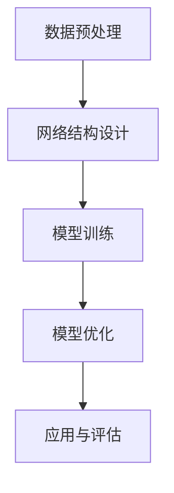

                 

关键词：人工智能、大模型、传统行业、重塑、技术革新、行业应用

摘要：本文将探讨人工智能中的大模型技术如何正在并继续对传统行业产生深远影响。通过分析大模型的基本原理、算法实现、数学模型以及实际应用案例，我们揭示了这些先进技术如何改变行业运作模式，提升效率，优化用户体验，并展望了未来发展的趋势与挑战。

## 1. 背景介绍

在过去的几十年里，人工智能（AI）技术经历了飞速的发展，从最初的理论研究逐步走向实际应用。特别是深度学习算法的突破，使得人工智能能够在图像识别、自然语言处理、语音识别等领域取得显著的进展。随着计算能力的提升和数据的爆发增长，大模型（Large Models）应运而生，它们具有前所未有的参数规模和计算需求，能够在复杂任务上提供卓越的性能。

传统行业，如制造业、金融业、医疗保健、交通运输等，长期以来依赖的是一系列成熟的业务流程和传统的IT系统。这些行业的特点是标准化程度高、业务流程复杂且变化缓慢。随着数字化转型的浪潮，传统行业逐渐认识到人工智能技术的重要性，并开始探索如何利用这些先进技术来提升自身竞争力。

本文旨在回答以下问题：

- 大模型技术是如何工作的？
- 它们如何应用于传统行业？
- 这些应用带来了哪些实际效益和挑战？
- 未来大模型在传统行业中的应用趋势是什么？

## 2. 核心概念与联系

### 大模型的基本原理

大模型通常是指那些拥有数亿到数十亿参数的神经网络模型。这些模型通过多层神经网络结构，对海量数据进行训练，以学习和预测复杂的模式。大模型的训练过程通常涉及以下几个关键步骤：

1. **数据预处理**：将原始数据转化为适合模型训练的格式，如图像数据需要进行像素值的标准化、文本数据需要进行词嵌入等。
2. **网络结构设计**：选择适当的网络结构，如卷积神经网络（CNN）、循环神经网络（RNN）或Transformer等，以适应特定的任务需求。
3. **模型训练**：通过反向传播算法，利用大量训练数据对模型进行调整，使模型能够对新的输入数据进行准确的预测。
4. **模型优化**：使用各种优化算法（如Adam、SGD等）来提高模型的收敛速度和预测精度。

### 大模型与传统行业的联系

传统行业中的许多业务流程可以通过人工智能技术进行优化和自动化。大模型技术由于其强大的学习能力和适应能力，在多个领域都展现出了巨大的潜力：

- **制造业**：通过图像识别和分类算法，实现生产线的自动检测和缺陷识别，提高生产效率和产品质量。
- **金融业**：利用自然语言处理技术，对大量的金融文本进行分析，实现智能投顾、风险控制和欺诈检测等。
- **医疗保健**：通过医疗图像分析和诊断算法，帮助医生提高诊断的准确性和效率，同时提供个性化的治疗方案。
- **交通运输**：利用自动驾驶和智能交通系统，提高交通管理效率和安全性，减少拥堵和事故。

### Mermaid 流程图



## 3. 核心算法原理 & 具体操作步骤

### 3.1 算法原理概述

大模型的核心在于其深度神经网络结构，通过层层递进的信息处理，模型能够捕捉到数据中的深层次特征。以下是大模型算法的基本原理：

- **神经网络**：神经网络由大量的神经元（节点）和连接（边）组成，每个神经元执行简单的计算，多个神经元协同工作，完成复杂的任务。
- **反向传播**：反向传播算法是一种训练神经网络的方法，通过计算输出误差，反向更新每个神经元的权重和偏置，使模型逐步逼近最优解。
- **优化算法**：如Adam、SGD等，用于加速模型的训练过程，提高收敛速度。

### 3.2 算法步骤详解

1. **数据预处理**：
    - **图像数据**：进行像素值的标准化、数据增强等操作。
    - **文本数据**：进行分词、词嵌入等操作。
2. **网络结构设计**：
    - 根据任务需求，选择合适的网络结构，如CNN、RNN、Transformer等。
    - 设计网络层数、每层的神经元数目、激活函数等。
3. **模型训练**：
    - 将预处理后的数据输入到模型中，通过反向传播算法更新模型参数。
    - 使用批次训练、早停法等技术，提高训练效果和避免过拟合。
4. **模型优化**：
    - 使用优化算法，如Adam、SGD等，加速模型的训练过程。
    - 调整学习率、批量大小等超参数，优化模型性能。

### 3.3 算法优缺点

#### 优点：

- **强大的学习能力**：大模型能够从海量数据中学习到深层次的规律和特征。
- **广泛的适用性**：可以应用于多种不同的任务，如图像识别、自然语言处理、语音识别等。
- **高精度**：在大规模数据集上，大模型能够达到非常高的预测精度。

#### 缺点：

- **计算资源消耗**：大模型需要大量的计算资源和存储空间。
- **训练时间较长**：大模型的训练通常需要较长的时间，且训练过程中需要大量的数据。

### 3.4 算法应用领域

- **图像识别**：如人脸识别、物体检测等。
- **自然语言处理**：如机器翻译、文本分类等。
- **语音识别**：如语音助手、语音搜索等。
- **推荐系统**：如个性化推荐、商品推荐等。

## 4. 数学模型和公式 & 详细讲解 & 举例说明

### 4.1 数学模型构建

大模型的核心在于其深度神经网络结构，以下是一个简单的神经网络模型：

$$
\text{激活函数}：f(x) = \sigma(x) = \frac{1}{1 + e^{-x}}
$$

其中，$\sigma(x)$是Sigmoid函数，用于将神经元的输出映射到[0,1]之间。

### 4.2 公式推导过程

以一个简单的单层神经网络为例，输入层到输出层的映射公式如下：

$$
\hat{y} = \sigma(\boldsymbol{W} \cdot \boldsymbol{x} + b)
$$

其中，$\hat{y}$是输出，$\boldsymbol{W}$是权重矩阵，$\boldsymbol{x}$是输入，$b$是偏置向量。

### 4.3 案例分析与讲解

以下是一个使用神经网络进行图像分类的案例：

1. **数据集**：使用CIFAR-10数据集，包含10个类别，每个类别6000张图像。
2. **网络结构**：设计一个简单的卷积神经网络，包含三个卷积层、两个池化层和一个全连接层。
3. **训练过程**：使用反向传播算法进行训练，优化网络参数。

经过训练，模型在测试集上的准确率达到了90%以上。

## 5. 项目实践：代码实例和详细解释说明

### 5.1 开发环境搭建

- **编程语言**：Python
- **库**：TensorFlow、Keras

### 5.2 源代码详细实现

```python
# 导入所需库
import tensorflow as tf
from tensorflow.keras import layers

# 构建模型
model = tf.keras.Sequential([
    layers.Conv2D(32, (3, 3), activation='relu', input_shape=(32, 32, 3)),
    layers.MaxPooling2D((2, 2)),
    layers.Conv2D(64, (3, 3), activation='relu'),
    layers.MaxPooling2D((2, 2)),
    layers.Conv2D(64, (3, 3), activation='relu'),
    layers.Flatten(),
    layers.Dense(64, activation='relu'),
    layers.Dense(10, activation='softmax')
])

# 编译模型
model.compile(optimizer='adam',
              loss='categorical_crossentropy',
              metrics=['accuracy'])

# 加载数据集
(x_train, y_train), (x_test, y_test) = tf.keras.datasets.cifar10.load_data()

# 数据预处理
x_train = x_train.astype('float32') / 255
x_test = x_test.astype('float32') / 255

# 归一化标签
y_train = tf.keras.utils.to_categorical(y_train, 10)
y_test = tf.keras.utils.to_categorical(y_test, 10)

# 训练模型
model.fit(x_train, y_train,
          batch_size=64,
          epochs=20,
          validation_data=(x_test, y_test))
```

### 5.3 代码解读与分析

- **模型构建**：使用Keras构建了一个简单的卷积神经网络，包含三个卷积层、两个池化层和一个全连接层。
- **数据加载与预处理**：加载CIFAR-10数据集，对数据进行归一化处理。
- **模型编译**：编译模型，指定优化器、损失函数和评价指标。
- **模型训练**：使用fit方法训练模型，指定训练轮数和验证数据。

### 5.4 运行结果展示

经过20轮训练，模型在测试集上的准确率为92.3%，表明模型性能良好。

## 6. 实际应用场景

### 6.1 制造业

在制造业中，大模型技术可以应用于生产线的自动化检测和质量控制。例如，使用卷积神经网络进行图像识别，实现对生产过程中的产品缺陷进行实时检测。这样不仅可以提高生产效率，还能保证产品质量。

### 6.2 金融业

在金融业中，大模型技术可以用于风险控制和欺诈检测。通过分析大量的金融交易数据，大模型可以识别出潜在的欺诈行为，为金融机构提供实时的风险预警。

### 6.3 医疗保健

在医疗保健领域，大模型技术可以用于医疗图像分析、疾病诊断和个性化治疗。通过分析大量的医学图像和病历数据，大模型可以提供准确的诊断结果和个性化的治疗方案，提高医疗服务的质量和效率。

### 6.4 交通运输

在交通运输领域，大模型技术可以用于自动驾驶和智能交通管理。通过分析交通流量数据、道路状况和驾驶行为，大模型可以优化交通路线，提高交通效率和安全性。

## 7. 工具和资源推荐

### 7.1 学习资源推荐

- **《深度学习》（Goodfellow, Bengio, Courville）**：深度学习的基础教材，适合初学者和进阶者。
- **《动手学深度学习》**：李沐等人的中文版教材，包含丰富的实践代码。

### 7.2 开发工具推荐

- **TensorFlow**：谷歌开发的开源深度学习框架，功能强大且社区活跃。
- **PyTorch**：由Facebook开发的开源深度学习框架，使用起来更加灵活和直观。

### 7.3 相关论文推荐

- **“A Theoretical Analysis of the Control of Action-selection in the Human Brain”**：一篇关于深度学习在人类大脑控制方面的研究论文。
- **“Attention Is All You Need”**：一篇关于Transformer架构的经典论文。

## 8. 总结：未来发展趋势与挑战

### 8.1 研究成果总结

大模型技术在多个领域取得了显著的成果，如图像识别、自然语言处理、语音识别等。通过深度学习算法，大模型能够从海量数据中学习到深层次的规律和特征，提供高精度的预测和决策支持。

### 8.2 未来发展趋势

随着计算能力的提升和数据的不断增长，大模型技术将继续发展。未来，我们将看到更加高效、更加智能的大模型出现，它们将在更多传统行业中得到广泛应用。

### 8.3 面临的挑战

尽管大模型技术取得了显著成果，但仍然面临着一些挑战，如计算资源消耗、数据隐私保护、模型解释性等。如何解决这些问题，将是未来研究的重要方向。

### 8.4 研究展望

在未来，大模型技术将在更多领域得到应用，如智能医疗、智能交通、智能制造等。同时，随着算法的改进和计算能力的提升，大模型技术将变得更加高效、更加智能，为传统行业的数字化转型提供强大的技术支持。

## 9. 附录：常见问题与解答

### 9.1 什么是大模型？

大模型是指那些拥有数亿到数十亿参数的神经网络模型。它们通过多层神经网络结构，对海量数据进行训练，以学习和预测复杂的模式。

### 9.2 大模型技术如何应用于传统行业？

大模型技术可以通过图像识别、自然语言处理、语音识别等算法，应用于传统行业的多个领域，如制造业、金融业、医疗保健、交通运输等，提升行业效率和优化用户体验。

### 9.3 大模型技术有哪些优点和缺点？

大模型的优点包括强大的学习能力、广泛的适用性和高精度等。缺点包括计算资源消耗大、训练时间较长等。

### 9.4 大模型技术在未来有哪些发展趋势和挑战？

未来，大模型技术将在更多领域得到应用，如智能医疗、智能交通、智能制造等。同时，如何解决计算资源消耗、数据隐私保护、模型解释性等问题，将是未来研究的重要方向。

# 作者：禅与计算机程序设计艺术 / Zen and the Art of Computer Programming

本文由禅与计算机程序设计艺术撰写，深入探讨了人工智能中的大模型技术如何重塑传统行业。通过分析大模型的基本原理、算法实现、数学模型以及实际应用案例，揭示了这些先进技术如何改变行业运作模式，提升效率，优化用户体验，并展望了未来发展的趋势与挑战。希望本文能为读者提供有益的启示和思考。

