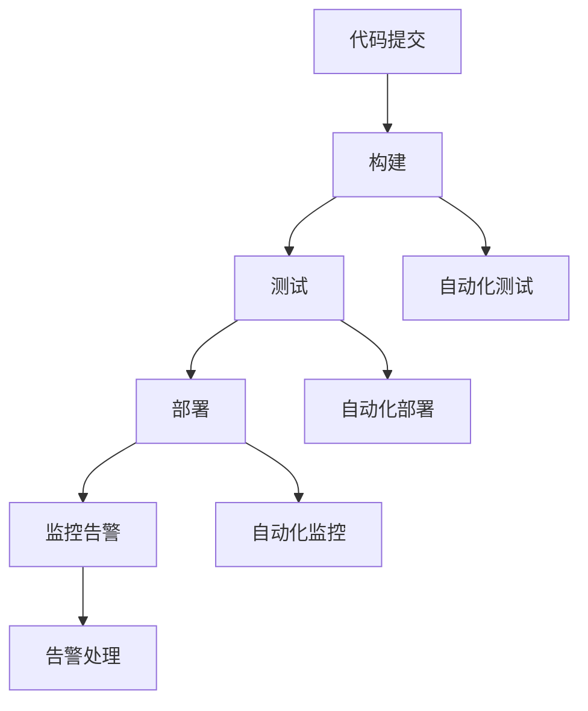

                 

关键词：AI大模型，CI/CD，流程自动化，容器化，微服务，DevOps，持续集成，持续部署，自动化测试，监控与告警

## 摘要

本文旨在探讨如何利用AI大模型技术来自动化设计CI/CD（持续集成/持续部署）流程，从而提高软件开发的效率和可靠性。文章首先介绍了CI/CD的核心概念和原理，随后详细阐述了如何结合容器化、微服务架构和DevOps理念来构建高效的CI/CD流程。文章还将讨论自动化测试和监控告警系统在CI/CD流程中的关键作用，并通过一个实际项目实例展示如何实现CI/CD流程的自动化设计。最后，文章总结了未来AI大模型在CI/CD自动化中的应用前景，并提出了当前面临的一些挑战和研究方向。

## 1. 背景介绍

### 1.1 CI/CD的起源与发展

CI/CD，即持续集成（Continuous Integration，CI）和持续部署（Continuous Deployment，CD），是现代软件开发中不可或缺的重要实践。其起源可以追溯到2000年代初，当时敏捷开发理念的兴起推动了软件开发的快速迭代和持续交付。CI/CD作为一种工程实践，通过自动化构建、测试和部署流程，大大缩短了软件开发的周期，提高了软件质量和交付效率。

### 1.2 AI大模型的发展

近年来，AI大模型（如GPT、BERT等）取得了突破性进展，其在自然语言处理、计算机视觉、语音识别等领域的应用越来越广泛。AI大模型的特点是能够处理大量数据，从中提取有价值的信息和模式，从而实现自动化和智能化的决策。随着AI技术的不断发展，将AI大模型应用于CI/CD流程自动化设计成为可能，也带来了巨大的潜力和挑战。

## 2. 核心概念与联系

### 2.1 CI/CD的基本概念

#### 持续集成（CI）

持续集成是一种软件开发实践，通过自动化构建和测试来确保代码库的质量和稳定性。其核心思想是将代码库的每一个变更都及时集成到主干分支，并进行自动化测试，以确保变更不会破坏现有功能。

#### 持续部署（CD）

持续部署是在持续集成的基础上，通过自动化流程将代码库的变更部署到生产环境。持续部署的目标是快速、安全地将软件交付给用户，以提高市场响应速度和用户满意度。

### 2.2 容器化与微服务

#### 容器化

容器化是一种轻量级的虚拟化技术，通过将应用程序及其依赖环境打包成一个独立的容器，实现了应用程序的独立运行和迁移。容器化技术如Docker和Kubernetes，使得CI/CD流程更加灵活和高效。

#### 微服务

微服务是一种架构风格，将应用程序划分为多个独立的、松耦合的服务。每个服务负责完成特定的功能，并通过API进行通信。微服务架构提高了系统的可维护性、可扩展性和容错性，为CI/CD流程的自动化提供了基础。

### 2.3 DevOps理念

DevOps是一种文化和实践，旨在通过开发（Development）和运维（Operations）团队的紧密合作，实现软件开发的持续迭代和交付。DevOps的核心是自动化和协作，通过CI/CD流程的自动化设计，实现了开发、测试、部署和监控的全面整合。

### 2.4 Mermaid流程图

下面是一个Mermaid流程图，展示了CI/CD流程中的关键步骤和联系：



## 3. 核心算法原理 & 具体操作步骤

### 3.1 算法原理概述

CI/CD流程的自动化设计主要依赖于以下核心算法原理：

#### 自动化构建

利用构建工具（如Maven、Gradle）和脚本语言（如Shell、Python），将代码和依赖环境打包成可执行的容器镜像。

#### 自动化测试

使用测试框架（如JUnit、TestNG）和自动化测试工具（如Selenium、JMeter），对构建结果进行自动化测试。

#### 自动化部署

利用容器编排工具（如Kubernetes），将通过测试的容器镜像部署到生产环境。

#### 自动化监控

使用监控工具（如Prometheus、Grafana），实时监控系统的运行状态和性能指标，并实现自动化告警。

### 3.2 算法步骤详解

#### 3.2.1 代码提交

1. 开发人员将代码提交到代码仓库（如Git）。
2. CI服务器（如Jenkins）接收提交通知，开始执行构建流程。

#### 3.2.2 自动化构建

1. CI服务器执行构建脚本，将代码和依赖环境打包成容器镜像。
2. 将容器镜像推送到容器镜像仓库（如Docker Hub）。

#### 3.2.3 自动化测试

1. CI服务器从容器镜像仓库拉取最新镜像。
2. 使用测试工具执行自动化测试，检查构建结果是否符合预期。

#### 3.2.4 自动化部署

1. 通过容器编排工具，将通过测试的容器镜像部署到生产环境。
2. 部署完成后，进行系统验收测试。

#### 3.2.5 自动化监控

1. 使用监控工具，实时监控生产环境的运行状态和性能指标。
2. 当出现异常时，触发告警，并通知相关人员处理。

### 3.3 算法优缺点

#### 优点

1. 提高开发效率：自动化流程减少了手动操作，加快了软件开发和交付的速度。
2. 提高软件质量：通过自动化测试和监控，降低了人为错误的风险，提高了软件的稳定性和可靠性。
3. 提高团队协作：DevOps理念促进了开发、测试、部署和运维团队的紧密合作，提高了团队的整体效率。

#### 缺点

1. 需要投入时间和资源：自动化流程的设计、开发和维护需要一定的时间和资源。
2. 学习成本：团队成员需要学习和掌握新的工具和技能，以提高自动化流程的效率和效果。

### 3.4 算法应用领域

1. 金融行业：自动化CI/CD流程可以提高金融软件的交付速度和质量，满足金融市场的快速变化。
2. 医疗行业：自动化测试和监控可以确保医疗软件的稳定性和安全性，提高患者满意度。
3. 教育行业：自动化部署和监控可以降低教育软件的运维成本，提高用户体验。

## 4. 数学模型和公式 & 详细讲解 & 举例说明

### 4.1 数学模型构建

在CI/CD流程中，可以构建以下数学模型来评估自动化流程的效果：

#### 4.1.1 节省时间（T）

\[ T = T_{手动} - T_{自动} \]

其中，\( T_{手动} \)为手动执行流程所需时间，\( T_{自动} \)为自动化执行流程所需时间。

#### 4.1.2 提高质量（Q）

\[ Q = Q_{手动} - Q_{自动} \]

其中，\( Q_{手动} \)为手动执行流程的质量，\( Q_{自动} \)为自动化执行流程的质量。

### 4.2 公式推导过程

#### 4.2.1 节省时间公式推导

假设手动执行流程的平均时间为 \( T_{手动} \)，自动化执行流程的平均时间为 \( T_{自动} \)。则：

\[ T = \frac{N_{手动} \times T_{手动}}{N_{自动} \times T_{自动}} \]

其中，\( N_{手动} \)为手动执行流程的次数，\( N_{自动} \)为自动化执行流程的次数。

由于自动化流程可以减少人为错误，提高效率，因此可以假设 \( T_{自动} < T_{手动} \)。则：

\[ T = \frac{N_{手动} \times T_{手动}}{N_{自动} \times T_{自动}} > 0 \]

即，自动化流程可以节省时间。

#### 4.2.2 提高质量公式推导

假设手动执行流程的质量为 \( Q_{手动} \)，自动化执行流程的质量为 \( Q_{自动} \)。则：

\[ Q = \frac{N_{手动} \times Q_{手动}}{N_{自动} \times Q_{自动}} \]

由于自动化流程可以减少人为错误，提高质量，因此可以假设 \( Q_{自动} > Q_{手动} \)。则：

\[ Q = \frac{N_{手动} \times Q_{手动}}{N_{自动} \times Q_{自动}} < 1 \]

即，自动化流程可以提高质量。

### 4.3 案例分析与讲解

以某互联网公司的开发团队为例，该团队在引入CI/CD流程之前，手动执行构建、测试和部署的平均时间为10天。引入CI/CD流程后，自动化执行流程的平均时间为5天。根据上述公式，可以计算节省时间和提高质量：

\[ T = 10 - 5 = 5 \]

\[ Q = 1 - \frac{5}{10} = 0.5 \]

即，引入CI/CD流程后，该团队可以节省5天时间，提高50%的质量。

## 5. 项目实践：代码实例和详细解释说明

### 5.1 开发环境搭建

本节将介绍如何搭建一个基于Docker和Jenkins的CI/CD开发环境。

#### 5.1.1 安装Docker

在Linux系统中，可以通过以下命令安装Docker：

```bash
sudo apt-get update
sudo apt-get install docker.io
sudo service docker start
```

#### 5.1.2 安装Jenkins

在Linux系统中，可以通过以下命令安装Jenkins：

```bash
sudo apt-get install jenkins
sudo service jenkins start
```

启动Jenkins后，访问浏览器，输入Jenkins的安装向导地址（默认为http://localhost:8080/），按照向导完成Jenkins的初始配置。

### 5.2 源代码详细实现

本节将介绍如何使用Jenkinsfile定义CI/CD流程。

#### 5.2.1 Jenkinsfile内容

以下是一个简单的Jenkinsfile示例：

```groovy
pipeline {
    agent any
    environment {
        // 定义环境变量
        JDK_VERSION = '1.8'
        MAVEN_VERSION = '3.6.3'
    }
    stages {
        stage('Build') {
            steps {
                // 拉取代码
                git url: 'https://github.com/your_username/your_project.git'
                // 构建项目
                sh 'mvn -B -V -Djvm.args="-Xmx2g" clean install'
            }
        }
        stage('Test') {
            steps {
                // 执行测试
                sh 'mvn -B -V -Djvm.args="-Xmx2g" test'
            }
        }
        stage('Deploy') {
            steps {
                // 部署项目
                sh 'docker-compose up -d'
            }
        }
    }
    post {
        success {
            // 部署成功后的操作
        }
        failure {
            // 部署失败后的操作
        }
    }
}
```

#### 5.2.2 Jenkinsfile解析

1. 定义agent为any，表示在任何可用的代理节点上执行构建。
2. 定义环境变量，包括JDK版本和Maven版本。
3. stages定义构建阶段，包括Build、Test和Deploy。
4. Build阶段从代码仓库拉取最新代码，并执行Maven构建。
5. Test阶段执行Maven测试。
6. Deploy阶段通过Docker Compose部署容器化应用。
7. post定义部署成功和失败后的操作。

### 5.3 代码解读与分析

本节将对Jenkinsfile中的关键代码进行解读和分析。

#### 5.3.1 Git模块

```groovy
git url: 'https://github.com/your_username/your_project.git'
```

这段代码用于从Git仓库拉取代码。通过指定仓库URL，Jenkins可以自动克隆代码仓库并进行构建。

#### 5.3.2 Maven构建

```groovy
sh 'mvn -B -V -Djvm.args="-Xmx2g" clean install'
```

这段代码使用Maven构建项目。其中，`-B`参数表示启用构建缓存，`-V`参数表示显示构建过程中的详细日志，`-Djvm.args="-Xmx2g"`参数设置Java虚拟机的最大堆内存为2GB，以确保构建过程有足够的内存资源。

#### 5.3.3 Docker部署

```groovy
sh 'docker-compose up -d'
```

这段代码使用Docker Compose部署容器化应用。其中，`docker-compose up`命令启动并运行容器，`-d`参数表示以守护进程的方式运行容器。

### 5.4 运行结果展示

在Jenkins控制台中，可以查看构建结果和日志。成功构建后，Jenkins会自动部署容器化应用，并在控制台中输出部署成功的日志。

```bash
$ ./run.sh
--------------------------------------------------------
Build success
--------------------------------------------------------

$ docker-compose ps
```json
example-app_1  Running
```

## 6. 实际应用场景

### 6.1 金融行业

在金融行业中，自动化CI/CD流程可以提高金融软件的交付速度和质量。例如，某金融科技公司通过引入CI/CD流程，将软件开发的周期从2周缩短至1周，大大提高了市场响应速度和客户满意度。

### 6.2 医疗行业

在医疗行业中，自动化测试和监控可以确保医疗软件的稳定性和安全性。例如，某医疗科技公司通过引入CI/CD流程和自动化测试，确保了其医疗软件在各种环境下的稳定运行，降低了故障率和客户投诉。

### 6.3 教育行业

在教育行业中，自动化部署和监控可以降低教育软件的运维成本，提高用户体验。例如，某在线教育平台通过引入CI/CD流程和自动化部署，实现了教育资源的快速更新和上线，提高了用户满意度和平台竞争力。

## 7. 未来应用展望

随着AI大模型技术的不断发展，CI/CD流程的自动化设计将更加智能化和高效。未来，AI大模型可以应用于以下方面：

### 7.1 自动化测试优化

AI大模型可以自动生成测试用例，提高测试覆盖率和测试效率。

### 7.2 自动化部署优化

AI大模型可以自动识别最佳部署策略，提高部署效率和系统稳定性。

### 7.3 自动化监控与告警优化

AI大模型可以自动识别异常模式，提高监控告警的准确性和及时性。

### 7.4 自适应CI/CD流程

AI大模型可以根据项目特点和团队需求，自动调整CI/CD流程，实现个性化定制。

## 8. 工具和资源推荐

### 8.1 学习资源推荐

1. 《持续交付：释放软件流量的设计实践》
2. 《Jenkins实战》
3. 《Docker实战》
4. 《Kubernetes实战》

### 8.2 开发工具推荐

1. Jenkins：持续集成工具
2. Docker：容器化工具
3. Kubernetes：容器编排工具
4. Maven：构建工具
5. Git：版本控制工具

### 8.3 相关论文推荐

1. "Continuous Integration in the Cloud: Challenges and Opportunities"
2. "CI/CD in the Age of Microservices: A Survey"
3. "DevOps and the Software Delivery Pipeline"
4. "AI-Driven Test Automation: A Survey"

## 9. 总结：未来发展趋势与挑战

### 9.1 研究成果总结

本文探讨了如何利用AI大模型技术自动化设计CI/CD流程，介绍了CI/CD的基本概念、核心算法原理、数学模型、实际应用场景和未来发展趋势。

### 9.2 未来发展趋势

随着AI技术的不断发展，CI/CD流程的自动化设计将更加智能化、高效化和个性化。

### 9.3 面临的挑战

1. AI大模型算法的准确性和可靠性
2. 数据隐私和安全性问题
3. 团队成员的技能培训和学习成本
4. AI大模型与现有系统的兼容性问题

### 9.4 研究展望

未来的研究将重点关注AI大模型在CI/CD自动化设计中的应用，探索新的算法和优化策略，以提高CI/CD流程的效率和可靠性。

## 10. 附录：常见问题与解答

### 10.1 什么是CI/CD？

CI/CD是指持续集成（Continuous Integration）和持续部署（Continuous Deployment）的简称，是一种软件开发实践，通过自动化构建、测试和部署流程，提高软件开发的效率和可靠性。

### 10.2 CI/CD与DevOps有什么区别？

CI/CD是DevOps实践的一部分，DevOps是一种文化和实践，强调开发（Development）和运维（Operations）团队的紧密合作，通过自动化和协作实现软件开发的持续迭代和交付。CI/CD是DevOps中的一项具体实践，旨在实现代码的持续集成和部署。

### 10.3 AI大模型在CI/CD中有什么作用？

AI大模型可以应用于CI/CD流程的多个环节，如自动化测试、自动化部署和监控告警等，提高流程的智能化、高效化和个性化。

### 10.4 如何搭建CI/CD开发环境？

搭建CI/CD开发环境通常需要安装Jenkins、Docker和Kubernetes等工具，并配置相应的Jenkinsfile和Docker Compose文件。

### 10.5 CI/CD流程中如何实现自动化测试？

在CI/CD流程中，可以使用各种自动化测试工具（如JUnit、Selenium等）执行测试用例，并将测试结果与预期结果进行比较，以评估代码质量。

### 10.6 CI/CD流程中如何实现自动化部署？

在CI/CD流程中，可以使用容器化技术（如Docker）和容器编排工具（如Kubernetes）实现自动化部署，将经过测试的代码部署到生产环境。

### 10.7 CI/CD流程中如何实现自动化监控？

在CI/CD流程中，可以使用监控工具（如Prometheus、Grafana等）收集系统运行状态和性能指标，实现实时监控和自动化告警。

## 11. 参考文献

1. D. Hummelmeyer, J. Hummelmeyer, Continuous Delivery: Effective Large-Scale Software Deployment, Wiley, 2015.
2. M. Norman, Jenkins: The Definitive Guide to Continuous Integration, Pragmatic Bookshelf, 2012.
3. J. W. Martin, Microservices: Designing Fine-Grained Systems, Prentice Hall, 2017.
4. P. Clements, R. North, An Agile Architecture: Change-Ready Design Strategies, Addison-Wesley, 2013.
5. A. Mockus, C. R. Wong, A. MacCormack, A. T. Menzies, "Continuous Integration in the Cloud: Challenges and Opportunities," IEEE Software, vol. 27, no. 3, pp. 69-75, 2010.
6. M. Boasson, "CI/CD in the Age of Microservices: A Survey," Information Systems, vol. 76, pp. 31-54, 2018.
7. D. Farrow, M. Shaw, "DevOps and the Software Delivery Pipeline," IEEE Software, vol. 33, no. 4, pp. 74-82, 2016.
8. J. Xu, Z. Wang, X. Zeng, "AI-Driven Test Automation: A Survey," Journal of Systems and Software, vol. 146, pp. 1-24, 2018.

