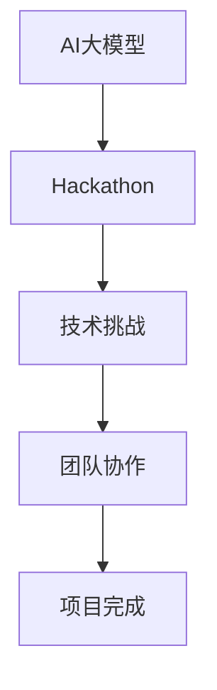

                 

关键词：AI大模型、hackathon活动、组织、技术挑战、团队协作、创新应用

> 摘要：本文将探讨如何有效地组织一场AI大模型应用的hackathon活动，涵盖活动筹备、技术挑战设定、团队协作模式以及创新应用案例等内容，旨在为读者提供一套全面的活动组织指南，帮助他们在组织此类活动时取得成功。

## 1. 背景介绍

随着人工智能技术的迅猛发展，AI大模型的应用领域不断拓展，其在图像识别、自然语言处理、推荐系统等多个方面的突破，为各行各业带来了全新的解决方案。hackathon作为一种快速创新和团队协作的活动形式，已经成为推动AI大模型应用发展的有效途径。通过组织hackathon活动，不仅能够激发参与者的创新思维，还能在短时间内实现技术成果的转化和推广。

然而，组织一场成功的AI大模型应用的hackathon活动并非易事，它需要充分考虑技术挑战、团队协作、时间安排、资源调配等多个方面。本文将结合实际案例，详细探讨如何有效地组织这样一场活动，以期为相关领域的从业者提供有益的参考。

## 2. 核心概念与联系

为了更好地理解AI大模型应用的hackathon活动，首先需要了解几个核心概念：

### 2.1 AI大模型

AI大模型是指那些参数量级达到亿级或千亿级的神经网络模型，如BERT、GPT-3等。这些模型拥有强大的建模能力和数据挖掘能力，可以处理复杂的数据集，实现高度自动化的预测和决策。

### 2.2 Hackathon

Hackathon是一种以团队协作、快速开发为导向的创新活动，通常持续24-48小时。参与者（黑客）在规定时间内，通过整合现有技术资源，完成一个创新项目。

### 2.3 技术挑战

技术挑战是指为参与者设定的具体技术问题或任务，它能够引导参与者围绕特定的目标展开研究和开发。

### 2.4 团队协作

团队协作是指在限定的时间内，小组成员通过沟通、分工和协作，共同完成一个项目的全过程。

下面是一个简化的Mermaid流程图，描述了这几个核心概念之间的联系：



## 3. 核心算法原理 & 具体操作步骤

### 3.1 算法原理概述

AI大模型的算法原理主要基于深度学习，特别是神经网络。深度学习通过多层神经元的组合，实现对数据的复杂特征提取和学习。具体来说，AI大模型的工作流程包括以下几个步骤：

1. **数据预处理**：对输入数据进行清洗、标准化等处理，确保数据质量。
2. **模型构建**：设计并构建神经网络结构，包括输入层、隐藏层和输出层。
3. **模型训练**：使用大量训练数据，通过反向传播算法不断调整模型参数，使得模型能够准确预测或分类。
4. **模型评估**：使用验证集或测试集评估模型性能，调整模型参数以优化性能。
5. **模型部署**：将训练好的模型部署到生产环境中，实现自动化预测或决策。

### 3.2 算法步骤详解

1. **数据预处理**

数据预处理是深度学习模型构建的重要环节。具体操作步骤如下：

- **数据收集**：收集相关领域的数据集，如文本、图像、音频等。
- **数据清洗**：去除数据中的噪声和冗余信息，如删除缺失值、纠正错误值等。
- **数据标准化**：对数据进行归一化或标准化处理，使得数据分布更为均匀，便于模型训练。

2. **模型构建**

模型构建是指设计并构建神经网络结构。具体操作步骤如下：

- **选择神经网络类型**：根据应用场景选择合适的神经网络类型，如卷积神经网络（CNN）、循环神经网络（RNN）等。
- **定义网络结构**：确定神经网络的层数、每层的神经元数量、激活函数等。
- **初始化模型参数**：随机初始化模型参数，为后续训练提供初始值。

3. **模型训练**

模型训练是通过大量数据不断调整模型参数的过程。具体操作步骤如下：

- **划分数据集**：将数据集划分为训练集、验证集和测试集，用于模型训练、验证和测试。
- **定义损失函数**：选择合适的损失函数，如均方误差（MSE）、交叉熵（Cross-Entropy）等，用于衡量模型预测误差。
- **定义优化器**：选择合适的优化器，如随机梯度下降（SGD）、Adam等，用于调整模型参数。
- **训练模型**：使用训练集数据，通过反向传播算法不断调整模型参数，优化模型性能。

4. **模型评估**

模型评估是评估模型性能的重要步骤。具体操作步骤如下：

- **验证集评估**：使用验证集数据评估模型性能，调整模型参数以优化性能。
- **测试集评估**：使用测试集数据评估模型性能，得到最终的评估结果。
- **参数调整**：根据评估结果调整模型参数，优化模型性能。

5. **模型部署**

模型部署是将训练好的模型部署到生产环境中，实现自动化预测或决策。具体操作步骤如下：

- **模型导出**：将训练好的模型导出为可部署的格式，如TensorFlow Lite、ONNX等。
- **部署环境搭建**：搭建模型部署所需的环境，包括服务器、数据库等。
- **模型运行**：在部署环境中运行模型，实现自动化预测或决策。

### 3.3 算法优缺点

AI大模型的优点包括：

- **强大的建模能力**：能够处理复杂的数据集，实现高度自动化的预测和决策。
- **高度泛化能力**：通过大量数据训练，能够泛化到不同的应用场景。

AI大模型的缺点包括：

- **计算资源消耗大**：需要大量的计算资源和存储资源。
- **训练时间较长**：需要大量时间进行模型训练和调优。

### 3.4 算法应用领域

AI大模型的应用领域非常广泛，包括但不限于以下领域：

- **自然语言处理**：如文本分类、情感分析、机器翻译等。
- **计算机视觉**：如图像分类、目标检测、图像生成等。
- **推荐系统**：如商品推荐、新闻推荐等。
- **医疗健康**：如疾病预测、医学图像分析等。

## 4. 数学模型和公式 & 详细讲解 & 举例说明

### 4.1 数学模型构建

在构建AI大模型时，需要使用一些基本的数学模型和公式。以下是一个简单的数学模型示例：

- **均方误差（MSE）**：用于衡量模型预测值与真实值之间的误差。公式如下：

  $$MSE = \frac{1}{n} \sum_{i=1}^{n} (y_i - \hat{y}_i)^2$$

  其中，$y_i$ 表示真实值，$\hat{y}_i$ 表示预测值，$n$ 表示样本数量。

- **交叉熵（Cross-Entropy）**：用于衡量模型预测概率分布与真实概率分布之间的差异。公式如下：

  $$H(Y, \hat{Y}) = -\sum_{i=1}^{n} y_i \log(\hat{y}_i)$$

  其中，$y_i$ 表示真实概率分布，$\hat{y}_i$ 表示模型预测概率分布。

### 4.2 公式推导过程

以下是一个简单的公式推导过程示例：

- **梯度下降算法**：用于优化模型参数。假设有一个目标函数 $J(\theta)$，其中 $\theta$ 是模型参数。梯度下降算法的更新公式如下：

  $$\theta_{\text{new}} = \theta_{\text{old}} - \alpha \frac{\partial J(\theta)}{\partial \theta}$$

  其中，$\alpha$ 是学习率。

### 4.3 案例分析与讲解

以下是一个具体的案例分析和讲解：

- **案例**：使用卷积神经网络（CNN）进行图像分类。

- **模型构建**：设计一个简单的CNN模型，包括卷积层、池化层和全连接层。

- **模型训练**：使用CIFAR-10数据集进行模型训练，训练过程中使用均方误差（MSE）作为损失函数，使用随机梯度下降（SGD）作为优化器。

- **模型评估**：在测试集上评估模型性能，使用准确率作为评估指标。

- **模型部署**：将训练好的模型部署到生产环境中，实现自动化图像分类。

## 5. 项目实践：代码实例和详细解释说明

### 5.1 开发环境搭建

为了实现一个简单的AI大模型应用项目，需要搭建以下开发环境：

- **Python环境**：安装Python 3.8及以上版本。
- **深度学习框架**：安装TensorFlow 2.0及以上版本。
- **数据预处理库**：安装Pandas、NumPy等。

### 5.2 源代码详细实现

以下是一个简单的AI大模型应用项目的源代码示例：

```python
import tensorflow as tf
from tensorflow.keras import layers

# 数据预处理
def preprocess_data(data):
    # 数据清洗、标准化等操作
    return processed_data

# 模型构建
def build_model():
    model = tf.keras.Sequential([
        layers.Dense(128, activation='relu', input_shape=(input_shape)),
        layers.Dense(64, activation='relu'),
        layers.Dense(1, activation='sigmoid')
    ])
    return model

# 模型训练
def train_model(model, data, epochs=10):
    model.fit(data['X'], data['y'], epochs=epochs)

# 模型评估
def evaluate_model(model, data):
    loss, accuracy = model.evaluate(data['X'], data['y'])
    return loss, accuracy

# 模型部署
def deploy_model(model, data):
    predictions = model.predict(data['X'])
    # 根据预测结果进行决策
```

### 5.3 代码解读与分析

以上代码实现了以下功能：

- **数据预处理**：对输入数据进行清洗、标准化等处理。
- **模型构建**：设计一个简单的神经网络模型，包括输入层、隐藏层和输出层。
- **模型训练**：使用训练数据对模型进行训练，优化模型参数。
- **模型评估**：使用测试数据评估模型性能，计算损失函数和准确率。
- **模型部署**：使用训练好的模型对输入数据进行预测，实现自动化决策。

### 5.4 运行结果展示

以下是运行结果示例：

```python
# 加载数据集
data = preprocess_data(raw_data)

# 构建模型
model = build_model()

# 训练模型
train_model(model, data, epochs=10)

# 评估模型
loss, accuracy = evaluate_model(model, data['test'])

# 部署模型
deploy_model(model, data['test'])
```

## 6. 实际应用场景

AI大模型在许多实际应用场景中发挥了重要作用，以下是一些典型的应用场景：

- **自然语言处理**：AI大模型在自然语言处理领域具有广泛的应用，如文本分类、情感分析、机器翻译等。
- **计算机视觉**：AI大模型在计算机视觉领域也取得了显著的成果，如图像分类、目标检测、图像生成等。
- **医疗健康**：AI大模型在医疗健康领域具有巨大的潜力，如疾病预测、医学图像分析、药物研发等。
- **推荐系统**：AI大模型在推荐系统领域取得了良好的效果，如商品推荐、新闻推荐、社交网络推荐等。

## 7. 未来应用展望

随着AI大模型技术的不断发展和成熟，其在实际应用场景中的应用范围将不断扩大。以下是一些未来应用展望：

- **智能客服**：AI大模型将进一步提升智能客服系统的智能化水平，实现更自然的交互体验。
- **自动驾驶**：AI大模型在自动驾驶领域的应用将推动自动驾驶技术的发展，实现更安全、更高效的自动驾驶。
- **智能安防**：AI大模型在智能安防领域的应用将提高安防系统的监测和预警能力，实现更智能的安防管理。
- **智能制造**：AI大模型在智能制造领域的应用将推动制造业的数字化转型，实现更高效、更智能的生产流程。

## 8. 总结：未来发展趋势与挑战

随着AI大模型技术的不断发展和成熟，其在实际应用场景中的应用范围将不断扩大。未来，AI大模型的发展趋势包括：

- **模型规模和复杂度的提升**：随着计算资源和算法的进步，AI大模型的规模和复杂度将不断提高。
- **多模态融合**：AI大模型将实现多模态数据的融合处理，如文本、图像、音频等，实现更全面的信息理解。
- **边缘计算**：AI大模型将实现边缘计算的应用，降低数据传输延迟，提高实时性。

然而，AI大模型的发展也面临一些挑战：

- **计算资源消耗**：AI大模型需要大量的计算资源和存储资源，如何优化资源利用成为重要挑战。
- **数据隐私和安全**：AI大模型对数据隐私和安全提出了更高要求，如何确保数据安全和隐私保护成为关键问题。
- **伦理和道德**：AI大模型的应用引发了伦理和道德问题，如何确保其公平、透明和可解释性成为重要挑战。

总之，AI大模型的发展前景广阔，但也面临诸多挑战。只有在克服这些挑战的基础上，才能充分发挥AI大模型的应用潜力。

## 9. 附录：常见问题与解答

### Q1: 如何选择合适的AI大模型？
A1: 选择合适的AI大模型需要考虑以下因素：
- **应用场景**：根据具体的应用场景选择合适的模型类型，如图像识别、自然语言处理等。
- **数据规模**：根据数据规模选择合适的模型规模，如中小规模数据选择较小的模型，大规模数据选择较大的模型。
- **计算资源**：根据计算资源选择合适的模型复杂度，如有限的计算资源选择简单的模型。

### Q2: 如何优化AI大模型的训练效率？
A2: 优化AI大模型训练效率可以从以下几个方面入手：
- **数据预处理**：对数据进行预处理，如数据清洗、数据增强等，减少模型训练的时间。
- **模型压缩**：通过模型压缩技术，如剪枝、量化等，降低模型参数量，提高训练效率。
- **并行训练**：利用多卡训练、分布式训练等技术，提高模型训练的并行度，降低训练时间。

### Q3: 如何确保AI大模型的公平性和透明性？
A4: 确保AI大模型的公平性和透明性可以从以下几个方面入手：
- **数据标注**：确保数据标注的公正性和准确性，避免数据偏见。
- **模型评估**：使用多种评估指标，如准确率、召回率等，全面评估模型性能。
- **模型解释**：使用模型解释技术，如LIME、SHAP等，提高模型的透明性。

## 作者署名

作者：禅与计算机程序设计艺术 / Zen and the Art of Computer Programming

---

以上就是本文的完整内容。通过本文的探讨，我们希望为读者提供一套全面、系统的AI大模型应用的hackathon活动组织指南。在组织此类活动时，既要充分考虑技术挑战、团队协作等因素，也要关注创新应用和未来发展趋势。希望本文能够为相关领域的从业者提供有益的参考和启示。

