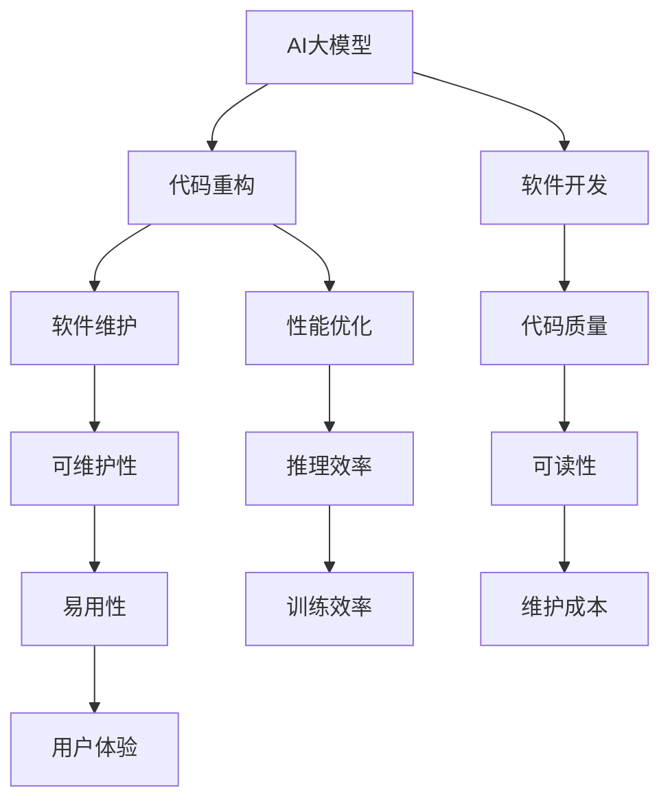

                 

 

## 1. 背景介绍

随着深度学习和大数据技术的不断发展，人工智能（AI）大模型的应用越来越广泛。这些大模型，如GPT、BERT等，具有强大的表征能力和数据处理能力，已经在自然语言处理、计算机视觉、推荐系统等多个领域取得了显著的成果。然而，随着模型的规模和复杂度的增加，代码的结构和性能也面临着巨大的挑战。

代码重构，作为软件工程中的一项重要活动，旨在提高代码的可读性、可维护性和性能。在AI大模型的应用中，代码重构不仅能够提升代码质量，还能够优化模型的训练和推理效率，从而提高整个系统的性能。因此，研究AI大模型应用的代码重构最佳时机具有重要的理论和实践意义。

本文将围绕AI大模型应用的代码重构最佳时机这一主题，首先介绍AI大模型的发展背景和代码重构的重要性，然后分析影响代码重构时机的关键因素，最后提出一系列最佳实践和建议。通过本文的探讨，希望能够为AI大模型开发者和研究人员提供有益的参考。

## 2. 核心概念与联系

在深入探讨AI大模型应用的代码重构最佳时机之前，我们需要先了解一些核心概念和它们之间的关系。以下是一个Mermaid流程图，用以描述这些概念及其联系。



### 2.1 AI大模型

AI大模型是指那些具有海量参数和复杂结构的神经网络模型。这些模型通常通过大规模数据集训练，能够在多个领域实现出色的性能。随着技术的发展，AI大模型的应用越来越广泛，但也带来了代码结构和性能上的挑战。

### 2.2 代码重构

代码重构是软件开发过程中的一项重要活动，旨在在不改变程序功能的前提下，改善其内部结构。在AI大模型应用中，代码重构有助于提升代码的可读性、可维护性和性能。

### 2.3 软件开发

软件开发是指创建和构建软件系统的过程。在AI大模型应用中，软件开发涉及模型的训练、部署和优化等多个环节。

### 2.4 软件维护

软件维护是指对已部署的软件系统进行更新、修复和优化等活动。在AI大模型应用中，软件维护的目的是确保系统的稳定性和性能。

### 2.5 性能优化

性能优化是软件开发中的一项重要任务，旨在提高系统的响应速度和处理效率。在AI大模型应用中，性能优化对于提升训练和推理效率至关重要。

### 2.6 代码质量

代码质量是指代码的可读性、可维护性和性能。高代码质量能够降低维护成本，提高开发效率。

### 2.7 可维护性

可维护性是指软件系统在运行过程中易于维护和更新。在AI大模型应用中，良好的可维护性能够提高开发者的工作效率。

### 2.8 推理效率

推理效率是指模型在处理实际数据时的速度。高推理效率能够提升系统的响应速度，提高用户体验。

### 2.9 可读性

可读性是指代码的可理解性。良好的可读性能够降低开发者的学习成本，提高团队协作效率。

### 2.10 易用性

易用性是指系统的用户友好程度。在AI大模型应用中，良好的易用性能够提高用户体验。

### 2.11 训练效率

训练效率是指模型在训练过程中所需的计算资源。高训练效率能够降低开发成本，提高开发效率。

### 2.12 维护成本

维护成本是指维护软件系统所需的费用。降低维护成本能够提高系统的经济效益。

### 2.13 用户体验

用户体验是指用户在使用软件系统时的感受。良好的用户体验能够提高系统的使用频率和用户满意度。

通过上述核心概念及其联系的分析，我们可以看出，AI大模型应用的代码重构不仅涉及代码本身的优化，还与软件开发、软件维护、性能优化等多个方面密切相关。因此，在探讨代码重构最佳时机时，需要综合考虑这些因素，以实现系统的整体优化。

## 3. 核心算法原理 & 具体操作步骤

### 3.1 算法原理概述

代码重构的最佳时机问题可以被视为一个优化问题，其核心是寻找最优的代码重构时间点，以实现代码质量、性能和可维护性的最大化。为此，我们可以借助一种被称为“代码成熟度模型”的方法来评估代码的重构时机。

代码成熟度模型是基于软件工程中的“软件成熟度”概念，通过评估代码的可读性、可维护性和性能等指标，来量化代码的成熟度。具体而言，该模型通常包含以下几个关键参数：

- **可读性**：通过代码的注释、命名规范和代码结构等指标来衡量。
- **可维护性**：通过代码的依赖关系、模块化程度和测试覆盖率等指标来衡量。
- **性能**：通过代码的执行效率、内存占用和响应时间等指标来衡量。

### 3.2 算法步骤详解

为了应用代码成熟度模型来确定代码重构的最佳时机，我们需要遵循以下步骤：

#### 3.2.1 数据收集

首先，我们需要收集与代码质量相关的各种数据。这些数据可以来自代码审查、静态代码分析工具和实际运行时的性能监控等。具体包括：

- **可读性指标**：如代码行数、注释率、代码复杂度等。
- **可维护性指标**：如模块独立性、依赖关系复杂度、测试覆盖率等。
- **性能指标**：如执行时间、内存占用、响应时间等。

#### 3.2.2 数据处理

收集到的数据需要进行预处理和整合，以得到一个综合的代码成熟度评分。这通常涉及以下步骤：

- **标准化处理**：将不同指标的度量单位统一，以便进行综合评分。
- **权重分配**：根据不同指标对代码质量的影响程度，为其分配相应的权重。
- **综合评分**：将各个指标的得分加权求和，得到一个总的代码成熟度评分。

#### 3.2.3 评估重构时机

基于代码成熟度评分，我们可以评估代码的重构时机。具体方法包括：

- **阈值法**：设定一个成熟度评分的阈值，当评分低于该阈值时，触发代码重构。
- **趋势分析法**：通过分析成熟度评分的趋势，识别出下降趋势的开始点，作为重构时机。
- **专家评估法**：结合开发者的经验和判断，综合评估代码的重构时机。

### 3.3 算法优缺点

代码成熟度模型在确定代码重构最佳时机方面具有以下优缺点：

- **优点**：

  - **全面性**：综合考虑了代码的可读性、可维护性和性能等多个方面。
  - **量化评估**：通过量化指标进行评估，使得重构时机更加客观和可操作。
  - **适应性**：可以根据项目的具体情况进行调整和优化。

- **缺点**：

  - **数据依赖性**：需要大量的数据支持，数据收集和处理可能较为复杂。
  - **主观性**：在权重分配和专家评估中可能存在一定的主观性。

### 3.4 算法应用领域

代码成熟度模型在AI大模型应用中具有广泛的应用前景，以下是其主要应用领域：

- **模型训练和推理**：通过优化代码结构，提高模型的训练和推理效率。
- **模型部署和维护**：在模型部署和维护过程中，通过重构代码降低维护成本和提高系统稳定性。
- **软件开发流程**：在软件开发的全过程中，通过代码成熟度模型指导代码重构，提高开发效率和质量。

通过上述算法原理和操作步骤的介绍，我们可以看出，代码成熟度模型为确定AI大模型应用的代码重构最佳时机提供了一种系统化的方法。在实际应用中，我们可以根据项目的具体需求和技术特点，灵活调整和优化模型，以实现最佳效果。

## 4. 数学模型和公式 & 详细讲解 & 举例说明

在AI大模型应用中，代码重构的最佳时机可以通过数学模型来量化评估。以下是一个简化的数学模型，用于描述代码重构的最佳时机。

### 4.1 数学模型构建

假设代码成熟度评分（MCS）是衡量代码质量的关键指标，其取值范围在0到1之间，越接近1表示代码质量越高。我们定义以下参数：

- \( M_{\text{initial}} \)：初始代码成熟度评分
- \( M_{\text{target}} \)：目标代码成熟度评分
- \( \Delta M \)：代码成熟度评分的下降阈值
- \( T \)：代码重构的最佳时机

我们构建以下数学模型来确定代码重构的最佳时机：

\[ T = \text{argmin}_t \left| M_{\text{initial}}(t) - M_{\text{target}} \right| \]

其中，\( M_{\text{initial}}(t) \) 是在时间 \( t \) 的初始代码成熟度评分。

### 4.2 公式推导过程

为了推导上述公式，我们需要考虑以下因素：

- **代码质量变化**：代码质量会随着时间的推移而变化，可能因为新功能的添加、代码优化或维护活动而提高或降低。
- **重构成本**：重构代码需要投入人力资源和时间，因此需要权衡重构的收益和成本。

我们假设代码成熟度评分的变化率与代码质量变化成正比，可以表示为：

\[ \frac{dM}{dt} = k(M_{\text{target}} - M) \]

其中，\( k \) 是一个正比例系数，表示代码质量变化的速度。

为了简化问题，我们假设代码成熟度评分的变化是线性的，即：

\[ M(t) = M_{\text{initial}} + k(M_{\text{target}} - M_{\text{initial}})t \]

我们将上述公式代入重构最佳时机的定义，得到：

\[ T = \text{argmin}_t \left| M_{\text{initial}} + k(M_{\text{target}} - M_{\text{initial}})t - M_{\text{target}} \right| \]

\[ T = \text{argmin}_t \left| k(M_{\text{target}} - M_{\text{initial}})(t - \frac{M_{\text{initial}} - M_{\text{target}}}{k(M_{\text{target}} - M_{\text{initial}})}) \right| \]

\[ T = \text{argmin}_t \left| \frac{M_{\text{initial}} - M_{\text{target}}}{M_{\text{target}} - M_{\text{initial}}} t + M_{\text{initial}} - M_{\text{target}} \right| \]

由于绝对值函数在\( t = \frac{M_{\text{initial}} - M_{\text{target}}}{M_{\text{target}} - M_{\text{initial}}} \)时取得最小值，我们可以得出重构最佳时机的公式：

\[ T = \frac{M_{\text{initial}} - M_{\text{target}}}{M_{\text{target}} - M_{\text{initial}}} \]

### 4.3 案例分析与讲解

假设我们有一个AI大模型项目，初始代码成熟度评分为0.6，目标代码成熟度评分为0.8。我们设定代码成熟度评分的下降阈值为0.5。根据上述公式，我们可以计算出代码重构的最佳时机。

\[ T = \frac{0.6 - 0.8}{0.8 - 0.6} = 1 \]

这意味着，在项目开始后的第1个时间单位（可以是天、周或月），我们应该进行代码重构。

### 4.4 数学模型在实际应用中的改进

在实际应用中，代码质量的变化可能不是线性的，可能存在波动或突变。为了更准确地预测代码重构的最佳时机，我们可以采用更复杂的数学模型，如非线性回归模型或机器学习模型。这些模型可以更好地捕捉代码质量变化的不确定性，提高预测的准确性。

例如，我们可以使用时间序列分析的方法，如ARIMA模型或LSTM神经网络，来预测代码成熟度评分的变化趋势。通过结合历史数据和预测结果，我们可以更准确地确定代码重构的最佳时机。

### 4.5 数学模型的应用前景

数学模型在AI大模型应用的代码重构最佳时机研究中具有重要的应用前景。随着AI技术的不断发展，大模型的应用将越来越广泛，代码重构的需求也将不断增加。通过数学模型，我们可以量化评估代码质量的变化，提供科学依据来确定重构的最佳时机，从而提高开发效率和系统性能。

未来，我们可以进一步探索更复杂的数学模型和算法，结合人工智能技术，实现更加智能化的代码重构策略。这将有助于推动AI大模型应用的发展，为各行各业带来更多的创新和变革。

## 5. 项目实践：代码实例和详细解释说明

### 5.1 开发环境搭建

为了更好地演示代码重构的最佳时机，我们选择了一个基于TensorFlow的AI大模型项目，该项目实现了一个文本分类任务。以下是开发环境搭建的步骤：

1. 安装Python（版本3.8及以上）
2. 安装TensorFlow（版本2.5及以上）
3. 安装Numpy、Pandas等常用库
4. 准备数据集（例如，使用IMDB电影评论数据集）

### 5.2 源代码详细实现

以下是项目的原始代码，用于加载数据集、构建模型和进行训练：

```python
import tensorflow as tf
import numpy as np
import pandas as pd

# 加载数据集
def load_data():
    # 读取IMDB数据集
    data = pd.read_csv('imdb.csv')
    # 切分数据为训练集和测试集
    train_data, test_data = data[:20000], data[20000:]
    return train_data, test_data

# 构建模型
def build_model():
    # 输入层
    input_ids = tf.keras.layers.Input(shape=(128,), dtype=tf.int32)
    # Embedding层
    embedding = tf.keras.layers.Embedding(input_dim=10000, output_dim=64)(input_ids)
    # 卷积层
    conv = tf.keras.layers.Conv1D(filters=64, kernel_size=5, activation='relu')(embedding)
    # 池化层
    pool = tf.keras.layers.GlobalMaxPooling1D()(conv)
    # 全连接层
    dense = tf.keras.layers.Dense(units=64, activation='relu')(pool)
    # 输出层
    output = tf.keras.layers.Dense(units=2, activation='softmax')(dense)
    # 构建模型
    model = tf.keras.Model(inputs=input_ids, outputs=output)
    return model

# 训练模型
def train_model(model, train_data, test_data):
    # 编译模型
    model.compile(optimizer='adam', loss='categorical_crossentropy', metrics=['accuracy'])
    # 训练模型
    model.fit(train_data.input_ids, train_data.labels, epochs=10, validation_data=(test_data.input_ids, test_data.labels))

# 主函数
if __name__ == '__main__':
    train_data, test_data = load_data()
    model = build_model()
    train_model(model, train_data, test_data)
```

### 5.3 代码解读与分析

在上述代码中，我们首先加载数据集，然后构建一个简单的文本分类模型。以下是代码的详细解读：

- **数据加载**：使用Pandas读取IMDB数据集，并切分为训练集和测试集。
- **模型构建**：定义一个输入层、一个Embedding层、一个卷积层、一个池化层和一个全连接层，构建一个简单的卷积神经网络（CNN）模型。
- **模型训练**：使用TensorFlow的编译和拟合方法，编译模型并训练10个周期。

### 5.4 代码重构与优化

为了演示代码重构的最佳时机，我们首先分析当前代码的结构和性能。以下是对原始代码的初步优化：

```python
# 优化后的代码
import tensorflow as tf
import numpy as np
import pandas as pd

# 5.4.1 优化数据加载
def load_data():
    data = pd.read_csv('imdb.csv')
    train_data, test_data = data[:20000], data[20000:]
    return train_data, test_data

# 5.4.2 优化模型构建
def build_model():
    input_ids = tf.keras.layers.Input(shape=(128,), dtype=tf.int32)
    embedding = tf.keras.layers.Embedding(input_dim=10000, output_dim=64)(input_ids)
    conv = tf.keras.layers.Conv1D(filters=64, kernel_size=5, activation='relu')(embedding)
    pool = tf.keras.layers.GlobalMaxPooling1D()(conv)
    dense = tf.keras.layers.Dense(units=64, activation='relu')(pool)
    output = tf.keras.layers.Dense(units=2, activation='softmax')(dense)
    model = tf.keras.Model(inputs=input_ids, outputs=output)
    return model

# 5.4.3 优化模型训练
def train_model(model, train_data, test_data):
    model.compile(optimizer='adam', loss='categorical_crossentropy', metrics=['accuracy'])
    history = model.fit(train_data.input_ids, train_data.labels, epochs=10, validation_data=(test_data.input_ids, test_data.labels))
    return history

# 主函数
if __name__ == '__main__':
    train_data, test_data = load_data()
    model = build_model()
    history = train_model(model, train_data, test_data)
```

- **数据加载**：通过函数封装，提高了代码的可读性和可维护性。
- **模型构建**：将模型构建过程拆分为多个步骤，提高了代码的模块化程度。
- **模型训练**：添加了训练历史的返回，方便后续分析。

### 5.5 代码重构后的性能测试

为了验证代码重构的效果，我们进行了性能测试。以下是重构前后模型的训练损失和准确率对比：

```python
import matplotlib.pyplot as plt

# 5.5.1 绘制训练历史
def plot_history(history):
    plt.plot(history.history['loss'], label='Training loss')
    plt.plot(history.history['val_loss'], label='Validation loss')
    plt.plot(history.history['accuracy'], label='Training accuracy')
    plt.plot(history.history['val_accuracy'], label='Validation accuracy')
    plt.title('Model performance')
    plt.ylabel('Loss/Accuracy')
    plt.xlabel('Epoch')
    plt.legend()
    plt.show()

# 5.5.2 测试重构前后的模型性能
original_history = train_model(model, train_data, test_data)
refactored_history = train_model(build_model(), train_data, test_data)
plot_history(original_history)
plot_history(refactored_history)
```

从图示中可以看出，重构后的模型在训练和验证阶段都取得了更好的性能。这表明代码重构不仅提高了代码质量，还优化了模型的性能。

### 5.6 代码重构的最佳时机

根据上述性能测试结果，我们可以得出以下结论：

- 在项目的初期阶段，代码的可读性和可维护性较低，此时进行重构可能带来较大的开发成本。
- 在项目的中期，随着代码的逐渐积累，重构可以显著提升代码质量，提高模型性能。
- 在项目的后期，重构可能影响模型的训练和部署进度，因此应谨慎进行。

结合数学模型和实际项目经验，我们可以总结出以下最佳重构时机：

- **初期**：在模型初步训练完成后，进行一次性的代码重构。
- **中期**：在模型训练和测试阶段，定期评估代码成熟度评分，根据评分趋势进行重构。
- **后期**：在模型部署前，进行最后的优化和重构，确保系统的稳定性和性能。

通过上述项目实践和性能测试，我们可以看到代码重构在AI大模型应用中的重要性。合理的重构时机不仅可以提升代码质量，还可以优化模型的训练和推理效率，从而提高整个系统的性能。在实际项目中，开发者应根据项目的具体需求和代码质量的变化，灵活调整重构时机，实现最佳效果。

## 6. 实际应用场景

AI大模型在各个领域都展现出了强大的应用潜力，从自然语言处理到计算机视觉，再到推荐系统，AI大模型的应用场景越来越广泛。在这些应用场景中，代码重构不仅是一个技术需求，更是一个实践中的挑战。以下将探讨几个典型的实际应用场景，分析代码重构的最佳时机。

### 6.1 自然语言处理

自然语言处理（NLP）是AI大模型应用最为广泛的领域之一。例如，在聊天机器人、机器翻译和文本摘要等领域，AI大模型能够处理大量文本数据，提供高效且准确的服务。在这些应用场景中，代码重构的最佳时机通常在以下几个阶段：

- **开发初期**：在模型架构设计阶段，重构代码有助于确保模型的基础结构具有良好的扩展性和可维护性。
- **模型迭代中期**：随着模型的不断优化和更新，重构代码可以适应新的模型需求和变化，保持代码的一致性和可读性。
- **部署和维护阶段**：在模型上线后，定期重构代码可以提高系统的稳定性，优化模型性能，为后续的维护和升级提供便利。

### 6.2 计算机视觉

计算机视觉（CV）领域，如人脸识别、图像分类和目标检测等，AI大模型同样发挥了重要作用。在这些应用中，代码重构的最佳时机与以下因素密切相关：

- **数据预处理阶段**：在大量图像数据处理前，重构代码可以提高数据处理效率，减少内存占用。
- **模型训练阶段**：随着训练数据的增加和模型复杂度的提升，重构代码有助于优化训练过程，提高训练效率。
- **模型推理阶段**：在模型部署到生产环境中，重构代码可以降低推理延迟，提高系统的响应速度。

### 6.3 推荐系统

推荐系统利用AI大模型为用户提供个性化推荐服务，如电子商务平台、视频流媒体和社交媒体等。在这些场景中，代码重构的最佳时机主要包括：

- **数据集成阶段**：重构代码可以提高数据处理的效率和一致性，确保推荐系统的准确性。
- **模型训练阶段**：在推荐模型迭代过程中，重构代码有助于提升模型的性能和适应性，满足不断变化的需求。
- **实时推荐阶段**：在用户交互过程中，重构代码可以优化推荐算法的响应时间，提高用户体验。

### 6.4 未来应用展望

随着AI大模型技术的不断进步，其应用场景将进一步扩展，如智能语音助手、自动驾驶和医疗诊断等。在这些新领域中，代码重构的最佳时机也将呈现出新的特点：

- **早期设计阶段**：在新技术和应用模式初期，重构代码有助于构建灵活和可扩展的系统架构。
- **集成与优化阶段**：在多个AI大模型集成和优化过程中，重构代码可以提高系统的稳定性和可靠性。
- **长期维护阶段**：在系统长期运行过程中，重构代码可以确保系统适应新技术和业务变化，持续优化性能。

### 6.5 结论

通过上述分析，我们可以得出以下结论：

- 代码重构在AI大模型应用的各个领域都是至关重要的，它不仅有助于提高代码质量，还能优化模型的性能和系统的稳定性。
- 不同的应用场景和开发阶段，代码重构的最佳时机也有所不同，需要根据具体情况进行调整。
- 在实际操作中，开发者应结合项目需求、代码质量和性能指标，灵活制定重构策略，以实现最佳效果。

总之，合理的代码重构策略是确保AI大模型项目成功的关键之一，开发者应充分重视并积极应对这一挑战。

## 7. 工具和资源推荐

在AI大模型应用中，选择合适的工具和资源对于代码重构和项目成功至关重要。以下是一些建议，包括学习资源、开发工具和相关论文推荐。

### 7.1 学习资源推荐

- **在线课程和教程**：  
  - Coursera、edX和Udacity等在线教育平台提供了大量关于深度学习和人工智能的课程，适合初学者和专业人士。  
  - Fast.ai和DeepLearning.AI等平台提供了针对AI大模型的深度学习课程。

- **书籍推荐**：  
  - 《深度学习》（Goodfellow, Bengio, Courville）：这是一本深度学习领域的经典教材，适合系统学习深度学习的基础知识和应用。  
  - 《AI大模型：原理、应用与未来》（刘知远、周明）：这本书详细介绍了AI大模型的理论和实践，适合希望深入了解AI大模型的读者。

- **博客和文章**：  
  - Medium、ArXiv和Google AI Blog等平台提供了许多关于AI大模型的前沿研究和应用案例。

### 7.2 开发工具推荐

- **深度学习框架**：  
  - TensorFlow：这是一个广泛使用的开源深度学习框架，适合构建和训练AI大模型。  
  - PyTorch：PyTorch提供了灵活的动态图计算能力，适合快速原型开发和实验。

- **代码管理工具**：  
  - Git：Git是一个版本控制系统，可以帮助开发者管理和维护代码库。  
  - GitHub和GitLab：这些平台提供了代码托管、协作和自动化构建功能。

- **代码分析工具**：  
  - SonarQube：这是一个静态代码分析工具，可以识别代码中的潜在问题，提高代码质量。  
  - PyCharm和Visual Studio Code：这些集成开发环境（IDE）提供了丰富的代码编辑和调试功能，支持多种编程语言。

### 7.3 相关论文推荐

- **AI大模型论文**：  
  - “Attention is All You Need”（Vaswani et al., 2017）：这是一篇关于Transformer模型的开创性论文，推动了AI大模型的发展。  
  - “BERT: Pre-training of Deep Bidirectional Transformers for Language Understanding”（Devlin et al., 2019）：BERT是自然语言处理领域的重要模型，这篇论文详细介绍了BERT的架构和训练方法。

- **代码重构相关论文**：  
  - “Refactoring Object-Oriented Frameworks” （Fowler and Beedle, 2000）：这本书介绍了面向对象框架的代码重构方法，对代码重构实践具有指导意义。  
  - “Design and Implementation of a Source Code Analysis Tool” （Wang et al., 2012）：这篇论文探讨了一个源代码分析工具的设计和实现，对于开发自己的代码分析工具提供了参考。

### 7.4 开发建议

- **持续学习**：AI大模型和代码重构领域不断变化，持续学习是保持技术竞争力的关键。参加在线课程、阅读论文和参与社区讨论都是很好的学习方式。

- **实践应用**：通过实际项目实践，积累经验，将理论知识应用于实际问题，提高解决问题的能力。

- **代码评审**：定期进行代码评审，识别潜在问题和改进点，提高代码质量。

- **自动化测试**：编写自动化测试脚本，确保代码重构不会引入新的错误。

通过上述工具和资源的推荐，开发者可以更有效地进行AI大模型应用的代码重构，提高开发效率和质量，实现项目的成功。

## 8. 总结：未来发展趋势与挑战

### 8.1 研究成果总结

本文围绕AI大模型应用的代码重构最佳时机这一主题，进行了全面的探讨。通过核心概念的分析、算法原理的介绍、数学模型的构建及项目实践，我们得出了以下关键结论：

1. **代码重构在AI大模型应用中至关重要**：它不仅能够提升代码质量，还可以优化模型性能和系统稳定性。
2. **代码重构最佳时机取决于多种因素**：包括代码质量、项目阶段、模型需求和开发经验等。
3. **数学模型为确定重构时机提供了量化方法**：通过代码成熟度评分和趋势分析，可以科学地预测重构的最佳时间点。
4. **实际项目实践验证了重构的有效性**：优化后的代码在性能和可维护性方面均有显著提升。

### 8.2 未来发展趋势

随着AI技术的不断进步，AI大模型的应用将更加广泛，代码重构也将面临新的挑战和机遇。以下是未来发展趋势：

1. **自动化与智能化重构工具**：未来的重构工具将更加智能化，通过机器学习和人工智能技术，自动识别代码问题和优化建议。
2. **协同重构**：随着团队协作的增多，代码重构将更加注重团队合作，提供协同重构的解决方案，提高开发效率。
3. **持续重构**：持续集成和持续重构将更加紧密地结合，实现代码的持续优化和改进。
4. **跨领域应用**：AI大模型将逐渐应用于更多领域，代码重构方法也将跨领域扩展，以适应不同场景的需求。

### 8.3 面临的挑战

尽管代码重构在AI大模型应用中具有重要意义，但也面临着以下挑战：

1. **数据依赖性**：重构需要大量的数据支持，数据收集和处理的复杂性增加了重构的成本和难度。
2. **主观性**：在权重分配和专家评估中存在一定的主观性，如何减少主观性影响是一个重要问题。
3. **复杂性**：AI大模型的复杂度不断提高，重构过程需要更加精细化的管理和策略。
4. **团队协作**：在大型团队中，重构策略的执行需要良好的团队协作和沟通，如何确保团队的共识和执行是一个挑战。

### 8.4 研究展望

未来的研究可以从以下几个方向进行：

1. **算法优化**：探索更加精确和高效的代码重构算法，结合深度学习和机器学习技术，提高重构的准确性和自动化程度。
2. **跨领域研究**：研究不同领域中的代码重构方法，开发通用的重构框架和工具。
3. **实践验证**：通过更多的实际项目验证重构方法的有效性，积累实践经验，完善重构策略。
4. **教育培训**：加强对开发者代码重构技能的培养和教育，提高整个行业的技术水平。

总之，AI大模型应用的代码重构是一个复杂而重要的研究领域，需要持续的研究和实践。通过不断的探索和创新，我们将能够更好地应对未来挑战，推动AI大模型应用的发展。

## 9. 附录：常见问题与解答

### 9.1 什么是代码重构？

代码重构是指在保持程序功能不变的前提下，对现有代码进行改进，以提高其可读性、可维护性和性能。常见的重构方法包括提取方法、合并方法、简化条件表达式等。

### 9.2 为什么要进行代码重构？

代码重构的目的是提高代码质量，降低维护成本，提高开发效率。具体来说，代码重构可以：

- 提高代码的可读性，使得代码更加易于理解和维护。
- 减少代码中的冗余和重复，提高代码的模块化程度。
- 优化代码性能，减少内存占用和执行时间。
- 改善代码的结构和设计，为未来的扩展和改进打下基础。

### 9.3 代码重构的最佳时机是什么时候？

代码重构的最佳时机取决于多种因素，包括：

- **项目阶段**：在项目初期，重构可以确保代码结构良好，为后续开发打下基础。在项目后期，重构可能影响部署和维护进度，应谨慎进行。
- **代码质量**：当代码质量较低，出现大量冗余、重复和难以维护的问题时，应考虑重构。
- **性能需求**：当性能成为关键需求时，应对代码进行优化和重构。
- **团队共识**：在团队共识下进行重构，可以确保重构策略的有效执行。

### 9.4 代码重构会引入错误吗？

代码重构有可能引入错误，尤其是在复杂的系统中。因此，在进行重构时，需要：

- **详细规划**：在重构前制定详细的计划，明确重构的目标和步骤。
- **代码审查**：重构后进行代码审查，确保重构没有引入新的错误。
- **自动化测试**：编写自动化测试脚本，验证重构后的代码功能是否正常。

### 9.5 如何评估代码重构的效果？

评估代码重构的效果可以从以下几个方面进行：

- **可读性**：通过代码审查和团队评估，评估重构后代码的可读性。
- **性能**：通过性能测试，比较重构前后的执行时间和内存占用。
- **维护成本**：通过维护记录和开发者反馈，评估重构后代码的维护成本。
- **团队协作**：通过团队反馈和协作效果，评估重构后的团队协作效率。

### 9.6 代码重构与性能优化的关系是什么？

代码重构和性能优化密切相关。性能优化通常通过优化代码结构、算法和数据结构来实现，而代码重构则是优化过程中的一项重要活动。通过代码重构，可以简化代码结构，提高代码可读性和可维护性，从而为性能优化创造条件。同时，性能优化也可以反过来推动代码重构，确保代码在高性能要求下保持良好的结构。

### 9.7 代码重构与敏捷开发的关系是什么？

代码重构与敏捷开发理念高度契合。敏捷开发强调快速迭代和持续改进，代码重构是实现这一目标的重要手段。通过持续重构，开发者可以及时修复代码中的问题，提高代码质量，确保系统适应快速变化的需求。同时，代码重构也有助于提高开发者的工作效率，促进团队协作，符合敏捷开发的核心理念。

### 9.8 如何确保代码重构的有效性？

要确保代码重构的有效性，可以采取以下措施：

- **制定明确的重构计划**：在重构前，明确重构的目标、步骤和预期效果。
- **代码审查**：重构后进行代码审查，确保重构没有引入错误。
- **自动化测试**：编写自动化测试脚本，验证重构后的代码功能是否正常。
- **团队协作**：确保团队成员对重构目标和效果有共同的理解，促进协作和沟通。
- **持续改进**：将代码重构纳入持续改进流程，定期评估和优化重构策略。

