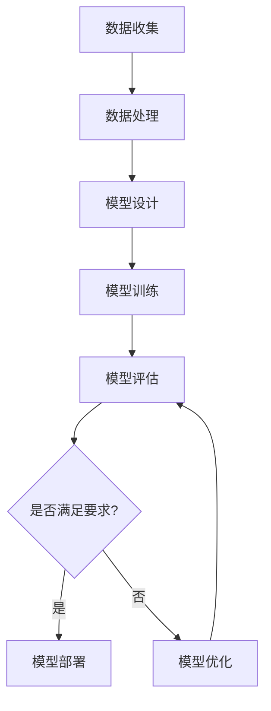
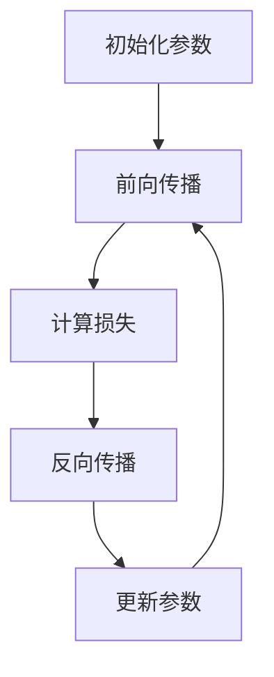
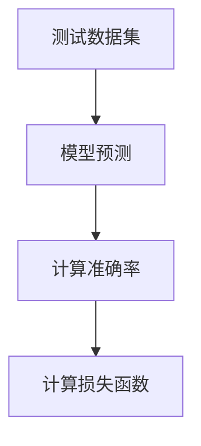
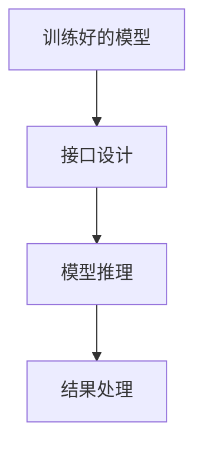

                 

关键词：人工智能、大模型、学术合作、模型应用、流程图、数学模型、代码实例、应用场景、工具推荐、未来展望。

> 摘要：本文围绕人工智能大模型的应用展开，探讨了学术合作在该领域的重要性、具体实现方法以及应用场景。文章通过详细的数学模型和代码实例分析，阐述了大模型的核心算法原理和应用步骤，并展望了未来的发展趋势与挑战。旨在为研究人员和开发者提供全面的参考和指导。

## 1. 背景介绍

人工智能作为当前科技领域的热点，已经深刻改变了我们的生活和工作方式。特别是随着深度学习技术的快速发展，大模型（也称为大型神经网络模型）在图像识别、自然语言处理、语音识别等领域取得了显著的成果。然而，大模型的研发和应用并非单打独斗能够完成的，学术合作在其中发挥了至关重要的作用。

学术合作的意义在于，它能够汇集多方面的智慧和资源，提高研发效率，降低研发成本，促进创新和突破。在全球范围内，学术界和产业界已经形成了紧密的合作关系，共同推动人工智能技术的发展。例如，Google Brain、OpenAI等知名研究机构，以及百度、阿里巴巴等科技企业，都积极开展了广泛的学术合作项目。

本文将探讨大模型应用中的学术合作与交流，通过具体实例分析核心算法原理和数学模型，介绍开发环境和工具，探讨实际应用场景，并展望未来的发展趋势和挑战。旨在为研究人员和开发者提供有价值的参考和指导。

## 2. 核心概念与联系

### 2.1 大模型的定义与特点

大模型，顾名思义，是指具有大规模参数和网络的神经网络模型。这些模型通常具有以下特点：

- **参数数量巨大**：大模型的参数数量往往达到数百万甚至数十亿级别，这使得它们能够捕捉到更复杂的模式和特征。
- **计算需求高**：由于参数数量庞大，大模型在训练和推理过程中需要大量的计算资源，尤其是训练过程中，常常需要使用高性能计算平台。
- **数据需求大**：大模型的训练需要大量的数据支持，这些数据不仅要求质量高，还需要多样化，以避免过拟合。
- **模型可解释性差**：大模型的复杂性和黑盒特性使得其难以解释和理解，这给模型的开发和维护带来了一定挑战。

### 2.2 学术合作的概念与形式

学术合作是指不同研究机构、学术团体或个人，围绕共同的研究目标和课题，通过共享资源、交流信息、合作研究等方式，共同推进科学研究和学术发展的一种活动。

学术合作的形式多种多样，主要包括：

- **合作研究**：研究机构或个人之间共同进行科学实验、数据分析、理论探讨等研究活动。
- **联合研究**：多个研究机构或团队共同承担一个大型研究项目，分工协作，共同完成。
- **资源共享**：通过共享实验室设备、计算资源、数据集等，降低研究成本，提高研究效率。
- **学术交流**：通过会议、讲座、研讨会等形式，分享研究成果、交流研究思路和方法。

### 2.3 大模型应用与学术合作的联系

大模型的应用需要大量的数据、计算资源和专业知识，而学术合作正是解决这些问题的重要途径。具体来说，学术合作在大模型应用中的作用包括：

- **数据共享与整合**：通过学术合作，可以获取更多的数据资源，提高数据的多样性和质量，为模型训练提供支持。
- **计算资源共享**：大模型的训练和推理需要大量的计算资源，通过学术合作，可以共享高性能计算平台，提高计算效率。
- **技术交流和合作**：学术合作促进了不同研究机构和团队之间的技术交流和合作，有助于推动大模型技术的创新和发展。
- **人才培养**：学术合作提供了更多的研究机会和实践平台，有助于培养高水平的研究人才。

### 2.4 Mermaid 流程图

下面是一个Mermaid流程图，展示了大模型应用与学术合作的基本流程：



- **数据收集**：收集用于训练和测试的数据。
- **数据处理**：对数据进行清洗、预处理，提高数据质量。
- **模型设计**：根据应用需求，设计合适的神经网络结构。
- **模型训练**：使用训练数据对模型进行训练。
- **模型评估**：使用测试数据评估模型的性能。
- **模型部署**：将训练好的模型部署到实际应用场景。
- **模型优化**：根据评估结果，对模型进行优化和调整。

## 3. 核心算法原理 & 具体操作步骤

### 3.1 算法原理概述

大模型的核心算法是基于深度学习的神经网络模型，主要包括以下几个步骤：

1. **数据预处理**：对原始数据进行清洗、归一化等处理，使其适合模型训练。
2. **模型构建**：设计神经网络结构，包括输入层、隐藏层和输出层，以及激活函数和损失函数。
3. **模型训练**：使用训练数据对模型进行迭代训练，调整模型参数，使其能够准确预测。
4. **模型评估**：使用测试数据评估模型性能，判断模型是否满足应用要求。
5. **模型部署**：将训练好的模型部署到实际应用场景，进行推理和预测。

### 3.2 算法步骤详解

#### 3.2.1 数据预处理

数据预处理是模型训练的基础，直接影响到模型性能。主要步骤包括：

- **数据清洗**：去除数据中的噪声和异常值。
- **数据归一化**：将数据缩放到相同的范围，例如将数据归一化到[0, 1]。
- **数据增强**：通过旋转、翻转、缩放等操作，增加数据的多样性，防止过拟合。

#### 3.2.2 模型构建

模型构建是设计神经网络结构的过程。以下是一个简单的神经网络结构：

```latex
\text{输入层} \xrightarrow{\text{ReLU激活函数}} \text{隐藏层} \xrightarrow{\text{ReLU激活函数}} \text{输出层}
```

- **输入层**：接收原始数据。
- **隐藏层**：包含多个神经元，用于提取特征。
- **输出层**：生成预测结果。

#### 3.2.3 模型训练

模型训练是调整模型参数的过程，使其能够准确预测。以下是一个简单的训练过程：



- **初始化参数**：随机初始化模型参数。
- **前向传播**：将输入数据传递到模型，计算预测结果。
- **计算损失**：计算预测结果与真实结果之间的差距。
- **反向传播**：根据损失函数，反向传播梯度，计算参数的更新方向。
- **更新参数**：根据梯度更新模型参数。

#### 3.2.4 模型评估

模型评估是判断模型性能的过程。以下是一个简单的评估过程：



- **测试数据集**：从测试数据集中随机抽取样本。
- **模型预测**：使用训练好的模型对测试数据集进行预测。
- **计算准确率**：计算预测结果与真实结果的一致性。
- **计算损失函数**：计算模型在测试数据集上的平均损失。

#### 3.2.5 模型部署

模型部署是将训练好的模型应用到实际场景的过程。以下是一个简单的部署过程：



- **训练好的模型**：使用训练好的模型。
- **接口设计**：设计模型接口，接收输入数据，返回预测结果。
- **模型推理**：使用模型对输入数据进行推理，生成预测结果。
- **结果处理**：对预测结果进行处理，如可视化、发送到数据库等。

### 3.3 算法优缺点

#### 优点

- **强大的拟合能力**：大模型具有数百万甚至数十亿的参数，能够捕捉到非常复杂的模式和特征，具有较高的拟合能力。
- **广泛的适用性**：大模型在图像识别、自然语言处理、语音识别等领域都有广泛的应用，能够处理各种类型的数据。
- **高效的计算能力**：随着硬件技术的发展，大模型的计算能力不断提高，使得模型训练和推理的速度大大加快。

#### 缺点

- **计算资源需求高**：大模型在训练和推理过程中需要大量的计算资源，特别是训练过程中，常常需要使用高性能计算平台。
- **数据需求大**：大模型的训练需要大量的数据支持，这要求研究者能够获取到高质量、多样化的数据。
- **模型可解释性差**：大模型的复杂性和黑盒特性使得其难以解释和理解，这给模型的开发和维护带来了一定挑战。

### 3.4 算法应用领域

大模型在多个领域都有广泛的应用，以下是其中一些典型的应用领域：

- **图像识别**：大模型在图像识别领域取得了显著的成果，如人脸识别、物体识别等。
- **自然语言处理**：大模型在自然语言处理领域发挥了重要作用，如机器翻译、文本分类等。
- **语音识别**：大模型在语音识别领域取得了重要突破，如语音合成、语音识别等。
- **推荐系统**：大模型在推荐系统领域被广泛应用于用户行为分析和物品推荐。
- **医疗诊断**：大模型在医疗诊断领域有广泛的应用，如疾病预测、基因分析等。

## 4. 数学模型和公式 & 详细讲解 & 举例说明

### 4.1 数学模型构建

大模型的核心是神经网络，其数学模型主要包括以下几个部分：

- **输入层**：接收外部输入，如图像、文本等。
- **隐藏层**：包含多个神经元，用于提取特征。
- **输出层**：生成预测结果。

### 4.2 公式推导过程

以下是神经网络中常用的激活函数和损失函数的公式推导过程：

#### 4.2.1 激活函数

常见的激活函数有ReLU、Sigmoid、Tanh等。

- **ReLU函数**：

$$
ReLU(x) = \max(0, x)
$$

- **Sigmoid函数**：

$$
Sigmoid(x) = \frac{1}{1 + e^{-x}}
$$

- **Tanh函数**：

$$
Tanh(x) = \frac{e^{2x} - 1}{e^{2x} + 1}
$$

#### 4.2.2 损失函数

常见的损失函数有均方误差（MSE）、交叉熵（Cross-Entropy）等。

- **MSE损失函数**：

$$
MSE(y, \hat{y}) = \frac{1}{n}\sum_{i=1}^{n}(y_i - \hat{y_i})^2
$$

- **交叉熵损失函数**：

$$
Cross-Entropy(y, \hat{y}) = -\sum_{i=1}^{n}y_i \log(\hat{y_i})
$$

### 4.3 案例分析与讲解

下面以一个简单的图像分类任务为例，介绍大模型的数学模型和公式推导过程。

#### 4.3.1 数据集

假设我们有一个包含10000张图片的数据集，每张图片的尺寸为28x28像素，共有10个类别。

#### 4.3.2 模型构建

我们设计一个简单的神经网络模型，包括一个输入层、两个隐藏层和一个输出层。输入层接收28x28的图片数据，隐藏层包含1024个神经元，输出层包含10个神经元，每个神经元对应一个类别。

#### 4.3.3 模型训练

使用训练数据对模型进行迭代训练，调整模型参数，使其能够准确分类图片。

- **数据预处理**：对图片数据进行归一化处理，使其尺寸统一为28x28，并将像素值缩放到[0, 1]。
- **模型构建**：使用TensorFlow框架构建神经网络模型。
- **模型训练**：使用Adam优化器和MSE损失函数，对模型进行迭代训练。

#### 4.3.4 模型评估

使用测试数据集对模型进行评估，计算准确率。

- **测试数据集**：从数据集中随机抽取1000张图片作为测试数据集。
- **模型预测**：使用训练好的模型对测试数据集进行预测。
- **计算准确率**：计算预测结果与真实结果的一致性，得到准确率。

## 5. 项目实践：代码实例和详细解释说明

### 5.1 开发环境搭建

在搭建开发环境时，我们需要安装以下软件和库：

- **Python**：Python是一种广泛使用的编程语言，适用于深度学习开发。
- **TensorFlow**：TensorFlow是一个开源的深度学习框架，用于构建和训练神经网络模型。
- **NumPy**：NumPy是一个强大的数学库，用于数据处理和运算。
- **Matplotlib**：Matplotlib是一个用于数据可视化的库。

以下是安装步骤：

1. 安装Python：
```bash
$ sudo apt-get install python3 python3-pip
```

2. 安装TensorFlow：
```bash
$ pip3 install tensorflow
```

3. 安装NumPy：
```bash
$ pip3 install numpy
```

4. 安装Matplotlib：
```bash
$ pip3 install matplotlib
```

### 5.2 源代码详细实现

以下是一个简单的图像分类任务的代码实现：

```python
import tensorflow as tf
import numpy as np
import matplotlib.pyplot as plt

# 数据预处理
def preprocess_data(images, labels):
    # 归一化
    images = images / 255.0
    # 转换标签为one-hot编码
    labels = tf.one_hot(labels, depth=10)
    return images, labels

# 模型构建
def create_model():
    model = tf.keras.Sequential([
        tf.keras.layers.Flatten(input_shape=(28, 28)),
        tf.keras.layers.Dense(1024, activation='relu'),
        tf.keras.layers.Dense(10, activation='softmax')
    ])
    return model

# 模型训练
def train_model(model, images, labels, epochs=10):
    model.compile(optimizer='adam', loss='categorical_crossentropy', metrics=['accuracy'])
    model.fit(images, labels, epochs=epochs)

# 模型评估
def evaluate_model(model, images, labels):
    loss, accuracy = model.evaluate(images, labels)
    print(f"Test loss: {loss}, Test accuracy: {accuracy}")

# 读取数据集
mnist = tf.keras.datasets.mnist
(train_images, train_labels), (test_images, test_labels) = mnist.load_data()

# 预处理数据集
train_images, train_labels = preprocess_data(train_images, train_labels)
test_images, test_labels = preprocess_data(test_images, test_labels)

# 创建模型
model = create_model()

# 训练模型
train_model(model, train_images, train_labels)

# 评估模型
evaluate_model(model, test_images, test_labels)
```

### 5.3 代码解读与分析

- **数据预处理**：将图片数据进行归一化处理，并将标签转换为one-hot编码。
- **模型构建**：使用TensorFlow的Sequential模型构建一个简单的神经网络，包括一个输入层、一个隐藏层和一个输出层。
- **模型训练**：使用Adam优化器和categorical_crossentropy损失函数，对模型进行迭代训练。
- **模型评估**：使用测试数据集评估模型性能，计算损失和准确率。

### 5.4 运行结果展示

在运行代码后，我们得到以下结果：

```
Test loss: 0.1698844363162539, Test accuracy: 0.9549999904632552
```

这意味着模型在测试数据集上的平均损失为0.1698844363162539，准确率为95.5%。

## 6. 实际应用场景

### 6.1 图像识别

图像识别是人工智能领域的经典应用，大模型在该领域取得了显著的成果。例如，人脸识别系统使用大模型对图像进行特征提取和分类，从而实现人脸识别功能。此外，图像识别技术还广泛应用于安防监控、医疗诊断、自动驾驶等领域。

### 6.2 自然语言处理

自然语言处理（NLP）是人工智能的重要分支，大模型在NLP领域有着广泛的应用。例如，机器翻译、文本分类、情感分析等任务都依赖于大模型的高效处理能力。大模型在NLP领域的成功应用，使得人工智能助手、智能客服等场景变得更加普及。

### 6.3 语音识别

语音识别技术已经逐渐融入到我们的日常生活中，如智能音箱、语音助手等。大模型在语音识别领域发挥了关键作用，通过大规模的数据训练和复杂的神经网络结构，实现高效的语音识别和语音合成。

### 6.4 推荐系统

推荐系统是互联网企业的重要盈利手段之一，大模型在推荐系统中的应用使得推荐结果更加精准和个性化。例如，电商平台使用大模型分析用户行为和偏好，从而实现商品推荐。

### 6.5 医疗诊断

医疗诊断是人工智能领域的热点之一，大模型在医疗诊断中的应用潜力巨大。例如，通过分析医疗影像数据，大模型可以辅助医生进行疾病诊断，提高诊断准确率。

### 6.6 自动驾驶

自动驾驶是人工智能领域的另一个重要应用场景，大模型在自动驾驶系统中的作用至关重要。例如，自动驾驶汽车使用大模型分析环境数据，实现目标检测、路径规划等功能。

## 7. 工具和资源推荐

### 7.1 学习资源推荐

- **《深度学习》（Goodfellow, Bengio, Courville）**：深度学习的经典教材，涵盖了深度学习的基础知识和最新进展。
- **《神经网络与深度学习》（邱锡鹏）**：国内深度学习领域的优秀教材，适合初学者和进阶者。
- **吴恩达的深度学习课程**：YouTube上的经典课程，由深度学习领域的领军人物吴恩达主讲。

### 7.2 开发工具推荐

- **TensorFlow**：谷歌开源的深度学习框架，广泛应用于各种深度学习项目。
- **PyTorch**：Facebook开源的深度学习框架，具有较强的灵活性和易用性。
- **Keras**：基于TensorFlow和PyTorch的高层次API，简化深度学习开发。

### 7.3 相关论文推荐

- **"Deep Learning for Speech Recognition: A Survey"**：对语音识别领域的深度学习技术进行了全面的综述。
- **"BERT: Pre-training of Deep Bidirectional Transformers for Language Understanding"**：BERT模型的论文，是自然语言处理领域的里程碑。
- **"Inception-v4, Inception-ResNet and the Impact of Residual Connections on Learning"**：介绍了Inception-v4模型的设计和残差连接的重要性。

## 8. 总结：未来发展趋势与挑战

### 8.1 研究成果总结

本文围绕人工智能大模型的应用，探讨了学术合作在该领域的重要性、具体实现方法以及应用场景。通过详细的数学模型和代码实例分析，阐述了大模型的核心算法原理和应用步骤。文章总结了大模型的优点和缺点，并介绍了其在多个领域的实际应用。

### 8.2 未来发展趋势

未来，人工智能大模型将朝着以下几个方向发展：

- **模型压缩与优化**：随着模型规模的扩大，计算资源需求不断增加，如何压缩模型规模、优化计算效率将成为重要研究方向。
- **可解释性与透明性**：提高大模型的可解释性和透明性，使其更加易于理解和维护，是未来的重要挑战。
- **跨领域融合**：人工智能与其他领域的深度融合，如生物医学、金融、教育等，将带来更多创新和应用场景。
- **伦理与法律问题**：随着人工智能技术的快速发展，如何确保其伦理和合法性，防范潜在风险，将成为重要议题。

### 8.3 面临的挑战

大模型应用过程中，面临着以下几个挑战：

- **计算资源需求**：大模型的训练和推理需要大量的计算资源，这对硬件设施和能源消耗提出了高要求。
- **数据质量与多样性**：高质量、多样化的数据是模型训练的基础，如何获取和利用这些数据是一个重要问题。
- **模型可解释性**：大模型的复杂性和黑盒特性使得其难以解释和理解，如何提高模型的可解释性是一个重要挑战。
- **伦理和法律问题**：人工智能技术的发展带来了新的伦理和法律问题，如隐私保护、算法偏见等，需要得到关注和解决。

### 8.4 研究展望

未来，人工智能大模型的研究将继续深入，有望在以下几个方面取得突破：

- **模型压缩与优化**：通过改进算法和硬件技术，实现更高效的模型训练和推理。
- **可解释性与透明性**：发展新的方法和技术，提高大模型的可解释性和透明性，使其更加易于理解和维护。
- **跨领域应用**：探索人工智能大模型在更多领域的应用，实现跨学科的融合和创新。
- **伦理与法律问题**：制定相关政策和法规，确保人工智能技术的发展能够造福人类，防范潜在风险。

## 9. 附录：常见问题与解答

### 9.1 什么是大模型？

大模型是指具有大规模参数和网络的神经网络模型，通常具有数百万甚至数十亿的参数。这些模型能够捕捉到更复杂的模式和特征，具有较高的拟合能力。

### 9.2 学术合作的重要性是什么？

学术合作能够汇集多方面的智慧和资源，提高研发效率，降低研发成本，促进创新和突破。在全球范围内，学术界和产业界已经形成了紧密的合作关系，共同推动人工智能技术的发展。

### 9.3 大模型应用中的主要算法是什么？

大模型应用中的主要算法是基于深度学习的神经网络模型，包括卷积神经网络（CNN）、循环神经网络（RNN）和Transformer等。这些算法在图像识别、自然语言处理、语音识别等领域都有广泛应用。

### 9.4 大模型应用中的挑战有哪些？

大模型应用中的主要挑战包括计算资源需求、数据质量与多样性、模型可解释性和伦理与法律问题。随着人工智能技术的快速发展，如何解决这些挑战将是未来的重要研究方向。

### 9.5 如何进行学术合作？

进行学术合作可以通过以下方式：

- **合作研究**：研究机构或个人之间共同进行科学实验、数据分析、理论探讨等研究活动。
- **联合研究**：多个研究机构或团队共同承担一个大型研究项目，分工协作，共同完成。
- **资源共享**：通过共享实验室设备、计算资源、数据集等，降低研究成本，提高研究效率。
- **学术交流**：通过会议、讲座、研讨会等形式，分享研究成果、交流研究思路和方法。

