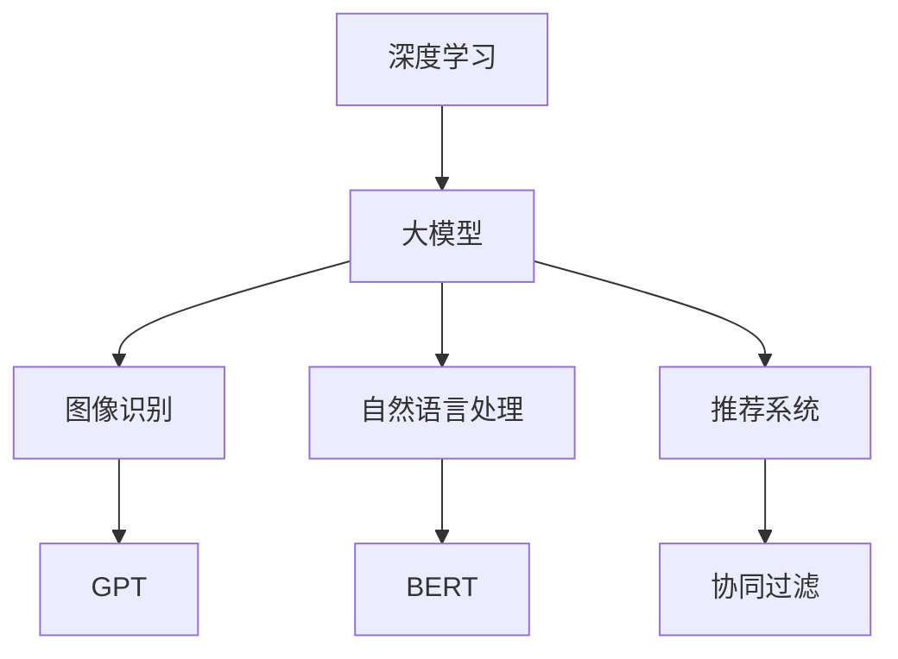

                 

关键词：AI大模型、学术合作、交流策略、人工智能、机器学习、深度学习、应用场景、研究趋势

> 摘要：本文从AI大模型的背景介绍出发，探讨了其在学术研究中的应用现状和挑战。通过分析核心概念与联系，深入探讨了AI大模型的算法原理、数学模型及其在实际应用中的项目实践。同时，本文还从工具和资源推荐的角度，提出了AI大模型应用的未来发展趋势与面临的挑战。

## 1. 背景介绍

随着人工智能技术的快速发展，大模型（Large Models）逐渐成为研究的热点。大模型通常是指参数规模达到百万甚至千万级别的深度学习模型，如GPT、BERT等。这些模型在图像识别、自然语言处理、推荐系统等众多领域取得了显著的成果，极大地推动了人工智能的应用与发展。

然而，AI大模型的应用也面临着一系列挑战。首先是计算资源的限制，大模型的训练和推理需要大量的计算资源，这对实验室的硬件设施提出了很高的要求。其次是数据隐私和伦理问题，大模型的训练依赖于大量数据，这些数据的收集和处理可能涉及到隐私和伦理问题。此外，大模型的解释性和可解释性也是一个亟待解决的难题，由于模型参数数量巨大，传统的解释方法难以应用于大模型。

在学术合作与交流方面，AI大模型的应用也带来了新的机遇和挑战。合作研究可以整合各方的资源和优势，共同推进大模型的研究与应用。然而，如何有效地进行合作研究，如何共享数据和模型，如何协调不同团队的研发进度等，都是需要解决的问题。

## 2. 核心概念与联系

### 2.1 AI大模型的基本概念

AI大模型是指那些拥有百万甚至千万参数级别的深度学习模型。这些模型通常通过大量的数据进行训练，从而能够实现高精度的预测和分类。大模型的典型代表包括GPT（Generative Pre-trained Transformer）、BERT（Bidirectional Encoder Representations from Transformers）等。

### 2.2 大模型与深度学习的关系

大模型是深度学习的一个重要分支。深度学习是指通过多层神经网络对数据进行特征提取和学习，从而实现复杂的预测和分类任务。大模型的引入使得深度学习在处理大规模数据时能够取得更好的性能。

### 2.3 大模型与其他AI技术的联系

大模型不仅与深度学习密切相关，还与其他AI技术如强化学习、迁移学习等有着紧密的联系。通过与其他技术的结合，大模型可以更好地应对复杂的AI任务。

### 2.4 Mermaid流程图

下面是一个简单的Mermaid流程图，展示了大模型的基本概念和联系：



## 3. 核心算法原理 & 具体操作步骤

### 3.1 算法原理概述

AI大模型的训练主要依赖于深度学习和神经网络。深度学习通过多层神经网络对数据进行特征提取和学习，从而实现高精度的预测和分类。神经网络则是由多个神经元组成的计算模型，通过调整神经元之间的权重，实现对输入数据的处理和分类。

### 3.2 算法步骤详解

AI大模型的训练通常包括以下几个步骤：

1. **数据预处理**：对输入数据进行清洗、归一化等预处理操作，使其满足模型训练的要求。
2. **模型构建**：根据任务需求，构建合适的神经网络模型。常见的模型结构包括卷积神经网络（CNN）、循环神经网络（RNN）、Transformer等。
3. **模型训练**：使用大量训练数据，通过反向传播算法，不断调整模型参数，使模型达到预定的训练目标。
4. **模型评估**：使用验证集或测试集，评估模型在未知数据上的表现，以确定模型的泛化能力。
5. **模型部署**：将训练好的模型部署到实际应用场景中，进行推理和预测。

### 3.3 算法优缺点

AI大模型具有以下优点：

- **高精度**：通过大量的训练数据和学习，大模型能够实现高精度的预测和分类。
- **泛化能力强**：大模型通常具有较好的泛化能力，能够应对各种复杂的AI任务。

然而，AI大模型也存在一些缺点：

- **计算资源消耗大**：大模型的训练和推理需要大量的计算资源，这对实验室的硬件设施提出了很高的要求。
- **数据隐私和伦理问题**：大模型的训练依赖于大量数据，这些数据的收集和处理可能涉及到隐私和伦理问题。
- **解释性差**：由于模型参数数量巨大，传统的解释方法难以应用于大模型。

### 3.4 算法应用领域

AI大模型在多个领域都有广泛的应用，包括但不限于：

- **图像识别**：通过大模型，可以实现高精度的图像分类、目标检测等任务。
- **自然语言处理**：大模型在自然语言处理领域有着广泛的应用，如文本分类、机器翻译、情感分析等。
- **推荐系统**：大模型可以用于构建高效的推荐系统，实现个性化推荐。

## 4. 数学模型和公式 & 详细讲解 & 举例说明

### 4.1 数学模型构建

AI大模型的数学模型通常是基于神经网络。神经网络由多个神经元组成，每个神经元都接收多个输入，并通过激活函数产生输出。神经元的输出再作为其他神经元的输入，形成一个复杂的计算网络。

### 4.2 公式推导过程

以卷积神经网络（CNN）为例，其数学模型可以表示为：

$$
Z^{(l)} = \sigma(W^{(l)} \cdot A^{(l-1)} + b^{(l)})
$$

其中，$Z^{(l)}$表示第$l$层的输出，$\sigma$表示激活函数，$W^{(l)}$和$b^{(l)}$分别表示第$l$层的权重和偏置。

### 4.3 案例分析与讲解

以下是一个简单的CNN模型的例子，用于图像分类：

```python
import tensorflow as tf

# 构建模型
model = tf.keras.Sequential([
    tf.keras.layers.Conv2D(32, (3, 3), activation='relu', input_shape=(28, 28, 1)),
    tf.keras.layers.MaxPooling2D((2, 2)),
    tf.keras.layers.Conv2D(64, (3, 3), activation='relu'),
    tf.keras.layers.MaxPooling2D((2, 2)),
    tf.keras.layers.Flatten(),
    tf.keras.layers.Dense(128, activation='relu'),
    tf.keras.layers.Dense(10, activation='softmax')
])

# 编译模型
model.compile(optimizer='adam', loss='categorical_crossentropy', metrics=['accuracy'])

# 训练模型
model.fit(x_train, y_train, epochs=10, batch_size=32, validation_data=(x_val, y_val))
```

在这个例子中，我们构建了一个简单的CNN模型，用于对28x28的图像进行分类。模型包括两个卷积层、两个池化层、一个平坦层和一个全连接层。通过训练，模型能够实现对图像的高精度分类。

## 5. 项目实践：代码实例和详细解释说明

### 5.1 开发环境搭建

在开始项目实践之前，我们需要搭建一个合适的开发环境。以下是搭建Python开发环境的基本步骤：

1. 安装Python：从[Python官网](https://www.python.org/)下载并安装Python。
2. 安装Jupyter Notebook：在命令行中运行`pip install notebook`。
3. 安装TensorFlow：在命令行中运行`pip install tensorflow`。

### 5.2 源代码详细实现

以下是一个简单的AI大模型项目实例，用于图像分类：

```python
import tensorflow as tf
from tensorflow.keras import datasets, layers, models

# 加载和分割数据集
(train_images, train_labels), (test_images, test_labels) = datasets.cifar10.load_data()

# 预处理数据
train_images = train_images / 255.0
test_images = test_images / 255.0

# 构建模型
model = models.Sequential()
model.add(layers.Conv2D(32, (3, 3), activation='relu', input_shape=(32, 32, 3)))
model.add(layers.MaxPooling2D((2, 2)))
model.add(layers.Conv2D(64, (3, 3), activation='relu'))
model.add(layers.MaxPooling2D((2, 2)))
model.add(layers.Conv2D(64, (3, 3), activation='relu'))
model.add(layers.Flatten())
model.add(layers.Dense(64, activation='relu'))
model.add(layers.Dense(10))

# 编译模型
model.compile(optimizer='rmsprop', loss=tf.keras.losses.SparseCategoricalCrossentropy(from_logits=True), metrics=['accuracy'])

# 训练模型
model.fit(train_images, train_labels, epochs=10, validation_data=(test_images, test_labels))

# 评估模型
test_loss, test_acc = model.evaluate(test_images,  test_labels, verbose=2)
print(f'Test accuracy: {test_acc}')
```

在这个实例中，我们使用CIFAR-10数据集进行图像分类。我们首先加载和预处理数据，然后构建一个简单的CNN模型，并使用rmsprop优化器和SparseCategoricalCrossentropy损失函数进行编译和训练。最后，我们评估模型在测试集上的表现。

### 5.3 代码解读与分析

在这个代码实例中，我们首先导入了TensorFlow库，并加载了CIFAR-10数据集。CIFAR-10是一个常用的图像分类数据集，包含10个类别，每个类别有6000张图片。我们使用`datasets.cifar10.load_data()`函数加载数据，并使用`/255.0`进行归一化处理。

接下来，我们构建了一个简单的CNN模型。模型包括三个卷积层，每个卷积层后跟一个最大池化层。最后一个卷积层后跟一个平坦层和一个全连接层。我们使用`models.Sequential()`构建模型，并使用`layers.Conv2D()`和`layers.MaxPooling2D()`添加卷积层和池化层。

在模型编译阶段，我们使用`compile()`函数设置优化器和损失函数。我们选择rmsprop优化器和SparseCategoricalCrossentropy损失函数，并添加了accuracy作为评价指标。

最后，我们使用`fit()`函数训练模型，并使用`evaluate()`函数评估模型在测试集上的表现。通过打印测试精度，我们可以了解模型的性能。

## 6. 实际应用场景

AI大模型在实际应用中有着广泛的应用，以下是一些典型的应用场景：

### 6.1 图像识别

图像识别是AI大模型的一个重要应用领域。通过大模型，我们可以实现高精度的图像分类、目标检测等任务。例如，在医疗领域，AI大模型可以帮助医生进行疾病诊断，通过分析医学影像，实现疾病的早期发现和诊断。

### 6.2 自然语言处理

自然语言处理（NLP）是AI大模型的另一个重要应用领域。大模型在文本分类、机器翻译、情感分析等方面有着出色的表现。例如，在客服领域，AI大模型可以帮助企业实现智能客服，通过自然语言处理技术，实现与用户的自然对话。

### 6.3 推荐系统

推荐系统是AI大模型在商业领域的应用之一。通过大模型，我们可以实现高效的个性化推荐，提高用户的满意度和粘性。例如，在电商领域，AI大模型可以帮助企业实现精准推荐，提高销售额。

### 6.4 自动驾驶

自动驾驶是AI大模型在交通领域的应用之一。通过大模型，我们可以实现高精度的环境感知和决策，提高自动驾驶的稳定性和安全性。例如，在自动驾驶汽车中，AI大模型可以用于识别道路标志、行人检测等任务。

### 6.5 未来应用展望

随着AI大模型技术的不断发展，未来其在更多领域的应用将更加广泛。例如，在金融领域，AI大模型可以帮助银行和金融机构实现风险控制和智能投顾；在农业领域，AI大模型可以帮助农民实现精准农业，提高农作物的产量和质量。

## 7. 工具和资源推荐

### 7.1 学习资源推荐

1. **书籍**：《深度学习》（Goodfellow, Bengio, Courville著）：这是一本经典的深度学习教材，适合初学者和进阶者。
2. **在线课程**：Coursera、edX等平台上的深度学习和人工智能相关课程，如“深度学习专项课程”等。

### 7.2 开发工具推荐

1. **TensorFlow**：一款开源的深度学习框架，适用于各种深度学习和机器学习任务。
2. **PyTorch**：另一款流行的深度学习框架，具有灵活的动态图计算能力。

### 7.3 相关论文推荐

1. **"Attention Is All You Need"**：介绍了Transformer模型，这是一种基于自注意力机制的深度学习模型。
2. **"BERT: Pre-training of Deep Bidirectional Transformers for Language Understanding"**：介绍了BERT模型，这是一种预训练的深度学习模型，在自然语言处理领域取得了显著成果。

## 8. 总结：未来发展趋势与挑战

### 8.1 研究成果总结

AI大模型在图像识别、自然语言处理、推荐系统等多个领域取得了显著的成果，极大地推动了人工智能的应用与发展。大模型的高精度、泛化能力等特点，使其在众多任务中表现出色。

### 8.2 未来发展趋势

随着计算资源和数据量的不断增长，AI大模型将迎来更广阔的发展空间。未来，大模型将在更多领域得到应用，如医疗、金融、农业等。同时，大模型的优化和压缩技术也将成为研究的热点，以解决计算资源和数据隐私等问题。

### 8.3 面临的挑战

尽管AI大模型取得了显著成果，但仍然面临一系列挑战。首先是计算资源的限制，大模型的训练和推理需要大量的计算资源，这对实验室的硬件设施提出了很高的要求。其次是数据隐私和伦理问题，大模型的训练依赖于大量数据，这些数据的收集和处理可能涉及到隐私和伦理问题。此外，大模型的解释性和可解释性也是一个亟待解决的难题。

### 8.4 研究展望

未来，AI大模型的研究将继续深入，探索如何优化和压缩大模型，提高其计算效率；同时，研究如何保护数据隐私，实现大模型的可靠和安全；此外，研究如何提高大模型的解释性和可解释性，使其在复杂任务中更好地发挥作用，也将是未来的重要研究方向。

## 9. 附录：常见问题与解答

### 9.1 什么是AI大模型？

AI大模型是指那些参数规模达到百万甚至千万级别的深度学习模型。这些模型通过大量的数据进行训练，从而能够实现高精度的预测和分类。

### 9.2 AI大模型的优势是什么？

AI大模型的优势主要体现在以下几个方面：

1. **高精度**：通过大量的训练数据和学习，大模型能够实现高精度的预测和分类。
2. **泛化能力强**：大模型通常具有较好的泛化能力，能够应对各种复杂的AI任务。
3. **广泛的应用领域**：大模型在图像识别、自然语言处理、推荐系统等多个领域都有广泛的应用。

### 9.3 AI大模型面临的主要挑战是什么？

AI大模型面临的主要挑战包括：

1. **计算资源消耗大**：大模型的训练和推理需要大量的计算资源，这对实验室的硬件设施提出了很高的要求。
2. **数据隐私和伦理问题**：大模型的训练依赖于大量数据，这些数据的收集和处理可能涉及到隐私和伦理问题。
3. **解释性差**：由于模型参数数量巨大，传统的解释方法难以应用于大模型。

### 9.4 如何优化AI大模型？

优化AI大模型的方法包括：

1. **模型压缩**：通过模型压缩技术，如剪枝、量化等，降低模型的计算复杂度，提高计算效率。
2. **分布式训练**：通过分布式训练技术，利用多台机器进行模型训练，提高训练速度。
3. **迁移学习**：通过迁移学习技术，利用预训练的大模型在新任务上进行微调，提高模型的泛化能力。

## 参考文献

1. Goodfellow, I., Bengio, Y., & Courville, A. (2016). *Deep Learning*.
2. Devlin, J., Chang, M. W., Lee, K., & Toutanova, K. (2019). *BERT: Pre-training of Deep Bidirectional Transformers for Language Understanding*. arXiv preprint arXiv:1810.04805.
3. Vaswani, A., Shazeer, N., Parmar, N., Uszkoreit, J., Jones, L., Gomez, A. N., ... & Polosukhin, I. (2017). *Attention is All You Need*. Advances in Neural Information Processing Systems, 30, 5998-6008.

