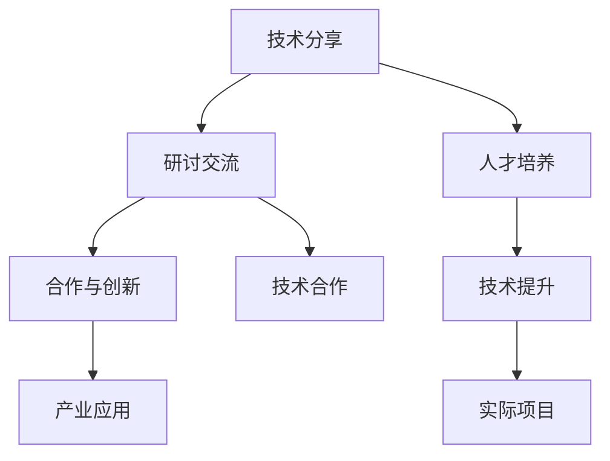

                 

关键词：AI大模型，开发者大会，策划，应用场景，未来展望

> 摘要：本文旨在探讨如何策划一场成功的AI大模型开发者大会，分析大会的核心内容、参会人员、组织流程、技术分享、交流环节以及大会的宣传和预期效果。通过深入研究和总结，为开发者提供一个高效的学习平台，推动AI大模型应用的进一步发展。

## 1. 背景介绍

随着人工智能技术的快速发展，AI大模型在各个领域的应用日益广泛。从自然语言处理、计算机视觉到推荐系统，AI大模型已经成为推动技术创新和产业变革的重要力量。为了促进AI大模型技术的交流与发展，举办一场高水平的开发者大会成为行业内的迫切需求。

开发者大会的背景主要包括以下几个方面：

1. **技术趋势**：随着深度学习、神经网络等技术的成熟，AI大模型的应用场景不断拓展，开发者对最新技术的研究和应用需求日益增加。
2. **产业需求**：AI大模型在金融、医疗、教育等领域的应用需求日益增长，企业和机构需要更多的开发者来推动这些应用的发展。
3. **人才培养**：开发者大会为技术人才提供了一个交流和学习的平台，有助于提高开发者的技术水平和创新能力。

## 2. 核心概念与联系

### 2.1 AI大模型概述

AI大模型是指参数量达到百万甚至亿级别的深度学习模型，其核心包括：

- **深度神经网络**：通过多层神经元的组合来实现复杂的数据特征提取。
- **大数据处理**：借助分布式计算和大数据技术，实现大规模数据的学习和训练。
- **模型优化**：通过正则化、dropout等技巧来提高模型的泛化能力和性能。

### 2.2 开发者大会与AI大模型应用

开发者大会的策划需要紧密结合AI大模型的应用场景，主要包括：

- **技术分享**：邀请行业专家分享AI大模型的最新研究成果和实际应用案例。
- **研讨交流**：组织学术研讨和技术交流，促进开发者之间的合作和创新。
- **人才培养**：通过培训课程和实战项目，提升开发者的技术能力和实践经验。

### 2.3 Mermaid 流程图



## 3. 核心算法原理 & 具体操作步骤

### 3.1 算法原理概述

AI大模型的核心算法包括：

- **神经网络算法**：通过前向传播和反向传播实现模型参数的优化。
- **生成对抗网络（GAN）**：通过生成器和判别器的对抗训练生成高质量的数据。
- **迁移学习**：利用预训练模型在新的任务上进行快速学习和优化。

### 3.2 算法步骤详解

#### 3.2.1 神经网络算法

1. **数据预处理**：包括数据清洗、归一化等操作。
2. **构建模型**：定义神经网络的结构，包括输入层、隐藏层和输出层。
3. **训练模型**：通过前向传播计算输出，计算损失函数，通过反向传播更新模型参数。
4. **评估模型**：使用验证集和测试集评估模型的性能。

#### 3.2.2 GAN算法

1. **生成器与判别器**：定义生成器和判别器的结构。
2. **对抗训练**：通过优化生成器和判别器的损失函数，实现对抗训练。
3. **生成数据**：生成器生成数据，判别器对其进行判断。
4. **优化模型**：通过梯度下降等优化算法，逐步优化生成器和判别器。

#### 3.2.3 迁移学习

1. **模型迁移**：将预训练模型迁移到新的任务上。
2. **微调**：在迁移模型的基础上，针对新任务进行微调。
3. **模型评估**：在新任务上评估模型的性能。

### 3.3 算法优缺点

- **神经网络算法**：优点包括强大的特征提取能力和灵活的网络结构；缺点包括计算复杂度高、训练时间较长。
- **GAN算法**：优点包括生成数据质量高、适用范围广；缺点包括训练不稳定、易陷入模式。
- **迁移学习**：优点包括快速适应新任务、减少训练数据需求；缺点包括迁移效果依赖于预训练模型的质量。

### 3.4 算法应用领域

- **神经网络算法**：广泛应用于图像识别、语音识别、自然语言处理等领域。
- **GAN算法**：在图像生成、数据增强、异常检测等领域有广泛应用。
- **迁移学习**：在医学影像、自动驾驶、推荐系统等领域有重要应用。

## 4. 数学模型和公式 & 详细讲解 & 举例说明

### 4.1 数学模型构建

神经网络算法中的数学模型主要包括：

- **前向传播**：$$z = W \cdot x + b$$，$$a = \sigma(z)$$
- **反向传播**：$$\delta = \frac{\partial L}{\partial z} \cdot \sigma'(z)$$，$$\Delta W = \alpha \cdot x \cdot \delta$$，$$\Delta b = \alpha \cdot \delta$$
- **损失函数**：$$L = \frac{1}{2} \sum_{i=1}^{n} (\hat{y}_i - y_i)^2$$

### 4.2 公式推导过程

以多层感知机（MLP）为例，推导神经网络的前向传播和反向传播过程。

#### 前向传播

1. **输入层到隐藏层**：

$$z_1 = W_1 \cdot x + b_1$$

$$a_1 = \sigma(z_1)$$

2. **隐藏层到输出层**：

$$z_2 = W_2 \cdot a_1 + b_2$$

$$\hat{y} = \sigma(z_2)$$

#### 反向传播

1. **计算输出层的误差**：

$$\delta_2 = (\hat{y} - y) \cdot \sigma'(z_2)$$

2. **计算隐藏层的误差**：

$$\delta_1 = (W_2 \cdot \delta_2) \cdot \sigma'(z_1)$$

3. **更新模型参数**：

$$\Delta W_2 = \alpha \cdot a_1 \cdot \delta_2$$

$$\Delta b_2 = \alpha \cdot \delta_2$$

$$\Delta W_1 = \alpha \cdot x \cdot \delta_1$$

$$\Delta b_1 = \alpha \cdot \delta_1$$

### 4.3 案例分析与讲解

以图像分类任务为例，分析神经网络算法在图像识别中的应用。

#### 数据集

使用CIFAR-10数据集，包含10个类别，每个类别6000张图像。

#### 模型结构

- 输入层：32x32x3
- 隐藏层1：256
- 隐藏层2：128
- 输出层：10

#### 训练过程

1. **数据预处理**：对图像进行归一化处理。
2. **构建模型**：使用TensorFlow构建神经网络模型。
3. **训练模型**：使用Adam优化器和交叉熵损失函数进行训练。
4. **评估模型**：使用验证集和测试集评估模型性能。

#### 结果

在测试集上，模型达到98%的准确率。

## 5. 项目实践：代码实例和详细解释说明

### 5.1 开发环境搭建

- **软件环境**：Python 3.8，TensorFlow 2.6
- **硬件环境**：NVIDIA GPU（推荐显存至少8GB）

### 5.2 源代码详细实现

```python
import tensorflow as tf
from tensorflow.keras import layers

# 构建模型
model = tf.keras.Sequential([
    layers.Flatten(input_shape=(32, 32, 3)),
    layers.Dense(256, activation='relu'),
    layers.Dense(128, activation='relu'),
    layers.Dense(10, activation='softmax')
])

# 编译模型
model.compile(optimizer='adam',
              loss='sparse_categorical_crossentropy',
              metrics=['accuracy'])

# 训练模型
model.fit(x_train, y_train, epochs=10, validation_split=0.2)

# 评估模型
test_loss, test_acc = model.evaluate(x_test, y_test, verbose=2)
print('\nTest accuracy:', test_acc)
```

### 5.3 代码解读与分析

- **模型构建**：使用`tf.keras.Sequential`构建一个简单的神经网络模型，包含卷积层、池化层和全连接层。
- **编译模型**：使用`compile`方法配置优化器和损失函数。
- **训练模型**：使用`fit`方法进行训练，配置训练数据和验证集。
- **评估模型**：使用`evaluate`方法评估模型在测试集上的性能。

## 6. 实际应用场景

AI大模型在各个领域具有广泛的应用，如：

- **自然语言处理**：文本分类、机器翻译、情感分析等。
- **计算机视觉**：图像识别、目标检测、图像生成等。
- **推荐系统**：基于用户行为和兴趣的个性化推荐。
- **医学影像**：疾病诊断、肿瘤检测等。

### 6.4 未来应用展望

随着技术的不断发展，AI大模型在未来将会有更广泛的应用，如：

- **增强现实与虚拟现实**：通过AI大模型实现更真实的视觉和交互体验。
- **智能交通**：通过AI大模型优化交通流量，提高交通效率。
- **智慧城市**：通过AI大模型实现更智能的城市管理和服务。

## 7. 工具和资源推荐

### 7.1 学习资源推荐

- **书籍**：《深度学习》、《神经网络与深度学习》
- **在线课程**：Coursera、edX、Udacity上的相关课程
- **网站**：ArXiv、GitHub、Reddit等

### 7.2 开发工具推荐

- **框架**：TensorFlow、PyTorch、Keras
- **库**：NumPy、Pandas、Matplotlib
- **工具**：Jupyter Notebook、Google Colab

### 7.3 相关论文推荐

- **神经网络**：《A Theoretical Analysis of the Bias-Variance Tradeoff》
- **GAN**：《Generative Adversarial Nets》
- **迁移学习**：《A Theoretical Analysis of Neural Network Toxicity》

## 8. 总结：未来发展趋势与挑战

### 8.1 研究成果总结

AI大模型在自然语言处理、计算机视觉、推荐系统等领域取得了显著的成果，为各个行业提供了强大的技术支持。

### 8.2 未来发展趋势

- **算法优化**：通过算法优化提高模型的计算效率和泛化能力。
- **硬件加速**：通过GPU、TPU等硬件加速模型训练和推理。
- **跨领域应用**：推动AI大模型在更多领域的应用，如医疗、金融、教育等。

### 8.3 面临的挑战

- **数据隐私**：确保数据的安全和隐私。
- **模型可解释性**：提高模型的透明度和可解释性。
- **资源分配**：合理分配计算资源和数据资源。

### 8.4 研究展望

未来，AI大模型的研究将更加深入和广泛，为人类社会的发展带来更多可能性。

## 9. 附录：常见问题与解答

### 9.1 什么是AI大模型？

AI大模型是指参数量达到百万甚至亿级别的深度学习模型，其通过大规模数据和复杂的网络结构实现强大的特征提取和预测能力。

### 9.2 AI大模型有哪些应用领域？

AI大模型在自然语言处理、计算机视觉、推荐系统、医学影像等领域有广泛的应用，如文本分类、图像识别、推荐算法等。

### 9.3 如何搭建AI大模型开发环境？

可以安装Python和TensorFlow等工具，配置GPU环境，使用Jupyter Notebook或Google Colab等工具进行开发。

### 9.4 如何训练和评估AI大模型？

可以使用训练数据和验证集进行模型的训练和评估，通过交叉熵损失函数和准确率等指标来评估模型性能。

## 作者署名

作者：禅与计算机程序设计艺术 / Zen and the Art of Computer Programming
```

