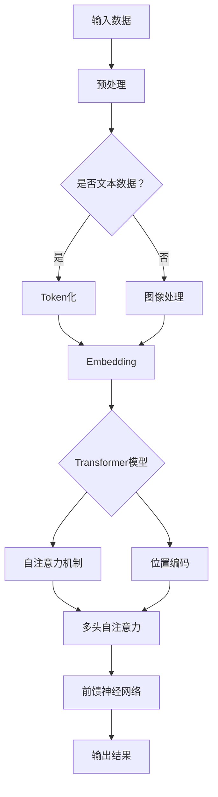

                 

关键词：AI大模型，开源项目，贡献，维护，技术社区，最佳实践，代码质量，算法优化

## 摘要

本文旨在探讨AI大模型应用领域中的开源项目贡献与维护的最佳实践。随着AI技术的不断进步，大型预训练模型如BERT、GPT等已在众多应用场景中取得显著成果。然而，开源项目的成功不仅依赖于高质量的代码，还需要活跃的社区贡献和有效的维护机制。本文将详细分析AI大模型开源项目的核心价值、贡献方式、维护策略，以及面临的挑战，并在此基础上提出一些建设性建议。

## 1. 背景介绍

### AI大模型的崛起

人工智能（AI）作为一门前沿科技，正逐步渗透到社会的各个领域。近年来，随着计算能力的提升和大数据技术的应用，AI模型特别是大模型（Large-scale Models）得到了广泛关注。大模型通常具有数以百万计的参数，甚至数十亿，它们通过深度学习算法在庞大的数据集上进行训练，从而实现复杂的任务，如文本生成、机器翻译、图像识别等。

BERT（Bidirectional Encoder Representations from Transformers）和GPT（Generative Pre-trained Transformer）等大模型的提出，标志着自然语言处理（NLP）领域的重要突破。这些模型不仅推动了技术的进步，也为企业和研究机构提供了强大的工具，使得他们在各种应用场景中取得了显著的效果。

### 开源项目的重要性

开源项目在AI大模型的发展过程中扮演了至关重要的角色。开源项目是指以共享知识和技术为目的，允许用户自由使用、修改和分发代码的项目。这种模式不仅促进了技术的传播和交流，也大大提高了开发效率。

AI大模型开源项目的核心价值在于：

1. **共享知识与技术**：开源项目提供了一个平台，让开发者可以共享他们的研究成果和最佳实践，从而促进整个领域的进步。
2. **社区协作**：开源项目鼓励社区成员共同参与，通过合作和讨论，解决技术难题，提高代码质量。
3. **提高透明度**：开源项目使模型的训练过程和性能指标更加透明，有助于学术界和工业界进行评估和验证。
4. **降低开发门槛**：开源项目提供了现成的工具和资源，降低了开发者进入AI领域的门槛，促进了技术的普及。

## 2. 核心概念与联系

### AI大模型原理与架构

为了深入理解AI大模型的应用和开源项目，我们需要了解其基本原理和架构。AI大模型通常基于深度学习，特别是Transformer架构，这是一种基于自注意力机制的模型结构。Transformer模型通过多头自注意力机制（Multi-head Self-Attention）和位置编码（Positional Encoding）等技术，实现了对输入数据的全局上下文关系建模。

#### Mermaid 流程图



### AI大模型开源项目构成

AI大模型开源项目通常包括以下几个核心组成部分：

1. **模型代码**：这是项目的核心，包括模型架构的实现和训练代码。
2. **数据集**：项目通常会提供用于训练和测试的数据集，以及数据预处理和清洗的工具。
3. **文档**：包括模型的使用说明、训练步骤、API文档等。
4. **测试代码**：用于验证模型性能的测试脚本和基准测试。
5. **贡献指南**：指导新成员如何参与项目，包括代码规范、测试标准等。

### 联系与关联

AI大模型开源项目不仅与模型本身的技术架构紧密相关，还与数据、计算资源、社区协作等多个方面有着密切的联系。通过开源项目，开发者可以共同优化模型结构，提高训练效率，扩展模型应用范围。

## 3. 核心算法原理 & 具体操作步骤

### 3.1 算法原理概述

AI大模型的核心算法通常是基于Transformer架构。Transformer模型通过自注意力机制（Self-Attention）和多头注意力（Multi-head Attention）实现了对输入数据的全局上下文关系建模。这种结构使模型能够捕捉到长距离依赖关系，从而在诸如机器翻译、文本生成等任务中表现出色。

#### Transformer模型基本步骤：

1. **输入编码**：将输入数据（如文本、图像）转化为固定长度的向量。
2. **多头自注意力**：对输入编码进行自注意力计算，生成新的特征表示。
3. **前馈神经网络**：对多头自注意力后的输出进行前馈神经网络处理。
4. **序列输出**：将前馈神经网络处理后的输出按照序列顺序输出，用于后续的任务。

### 3.2 算法步骤详解

#### 步骤1：输入编码

输入编码是Transformer模型的第一步，将输入数据（如文本序列）转化为固定长度的向量。文本数据通常通过Token化处理，将文本拆分为词或子词，每个Token对应一个索引。然后，通过嵌入层（Embedding Layer）将这些索引映射为向量。

#### 步骤2：多头自注意力

多头自注意力是Transformer模型的核心。它通过多个独立的自注意力头（Head）对输入编码进行并行处理，从而捕捉到输入数据中的不同特征。每个头都会计算一次自注意力，然后这些头的结果会进行拼接和线性变换，生成新的特征表示。

#### 步骤3：前馈神经网络

在完成多头自注意力后，Transformer模型会通过一个前馈神经网络（Feed Forward Neural Network）对特征进行进一步处理。这个神经网络通常包括两个全连接层，每个层之间都有一个ReLU激活函数。

#### 步骤4：序列输出

最后，Transformer模型将前馈神经网络处理后的输出按照序列顺序输出。这些输出可以用于各种下游任务，如文本分类、机器翻译等。

### 3.3 算法优缺点

#### 优点：

1. **捕捉长距离依赖关系**：通过自注意力机制，Transformer模型能够捕捉到输入数据中的长距离依赖关系。
2. **并行计算**：自注意力机制的计算可以并行进行，从而提高了模型的训练效率。
3. **适用于多种任务**：Transformer模型结构灵活，适用于多种自然语言处理任务。

#### 缺点：

1. **计算复杂度高**：Transformer模型涉及大量的矩阵运算，计算复杂度高，对计算资源要求较高。
2. **内存消耗大**：模型参数多，内存消耗大，对硬件设备要求较高。

### 3.4 算法应用领域

AI大模型算法主要应用于自然语言处理（NLP）、计算机视觉（CV）和语音识别等领域。在NLP领域，Transformer模型已被广泛应用于机器翻译、文本生成、情感分析等任务。在CV领域，Transformer模型可以用于图像分类、目标检测和视频理解等任务。在语音识别领域，Transformer模型也被用于语音到文本（STT）转换。

## 4. 数学模型和公式 & 详细讲解 & 举例说明

### 4.1 数学模型构建

AI大模型的数学模型主要基于深度学习和Transformer架构。以下是构建AI大模型的一些关键数学公式和概念：

#### 步骤1：输入编码

输入编码通常通过Token化处理和嵌入层实现。Token化将文本拆分为词或子词，每个Token对应一个索引。嵌入层将索引映射为向量。

$$
\text{Token} \rightarrow \text{Index} \rightarrow \text{Embedding Vector}
$$

#### 步骤2：多头自注意力

多头自注意力（Multi-head Self-Attention）是Transformer模型的核心。它通过多个独立的自注意力头（Head）对输入编码进行并行处理，从而捕捉到输入数据中的不同特征。

$$
\text{Self-Attention} = \text{Attention}(\text{Query}, \text{Key}, \text{Value})
$$

其中，Query、Key和Value都来自输入编码。Attention函数通常采用 scaled dot-product attention：

$$
\text{Attention}(Q, K, V) = \text{softmax}\left(\frac{QK^T}{\sqrt{d_k}}\right)V
$$

其中，$d_k$ 是Key的维度。

#### 步骤3：前馈神经网络

前馈神经网络（Feed Forward Neural Network）用于对多头自注意力后的输出进行进一步处理。

$$
\text{FFN}(x) = \text{ReLU}\left(\text{W_2}\text{ReLU}(\text{W_1}x + b_1)\right) + b_2
$$

其中，$W_1$、$W_2$ 是权重矩阵，$b_1$、$b_2$ 是偏置向量。

### 4.2 公式推导过程

#### 自注意力公式推导

自注意力公式推导主要分为以下几个步骤：

1. **查询-键值对构建**：首先，将输入编码表示为Query、Key和Value。

$$
\text{Input} = [\text{Query}, \text{Key}, \text{Value}]
$$

2. **点积计算**：然后，计算Query和Key之间的点积。

$$
\text{Score} = QK^T
$$

3. **缩放**：由于点积结果可能非常大，为了保持数值稳定性，通常会对点积进行缩放。

$$
\text{Scaled Score} = \frac{\text{Score}}{\sqrt{d_k}}
$$

4. **softmax应用**：最后，对缩放后的点积应用softmax函数，得到注意力权重。

$$
\text{Attention} = \text{softmax}(\text{Scaled Score})
$$

5. **加权求和**：将注意力权重与Value相乘，并进行求和，得到自注意力结果。

$$
\text{Self-Attention} = \text{Attention}V
$$

### 4.3 案例分析与讲解

#### 案例背景

假设有一个英文句子“Hello, World!”,需要对其进行Token化处理，并通过Transformer模型进行自注意力计算。

#### 步骤1：Token化

首先，将句子“Hello, World!”进行Token化，拆分为词或子词：

$$
\text{Tokenized Sentence} = [\text{Hello}, \text{,}, \text{World}, !]
$$

#### 步骤2：嵌入层

然后，通过嵌入层将这些Token映射为向量：

$$
\text{Embedding} = [\text{Embedding}(Hello), \text{Embedding}(,), \text{Embedding}(World), \text{Embedding}(!)]
$$

#### 步骤3：自注意力计算

接下来，计算自注意力：

1. **构建查询-键值对**：

$$
\text{Query} = \text{Embedding}(Hello)
\text{Key} = \text{Embedding}(Hello)
\text{Value} = \text{Embedding}(Hello)
$$

2. **计算点积**：

$$
\text{Score} = \text{Query} \cdot \text{Key} = \text{Embedding}(Hello) \cdot \text{Embedding}(Hello)
$$

3. **缩放**：

$$
\text{Scaled Score} = \frac{\text{Score}}{\sqrt{d_k}}
$$

4. **softmax应用**：

$$
\text{Attention} = \text{softmax}(\text{Scaled Score})
$$

5. **加权求和**：

$$
\text{Self-Attention} = \text{Attention} \cdot \text{Value}
$$

通过上述步骤，我们得到了自注意力结果，从而实现了对句子“Hello, World!”的全局上下文关系建模。

## 5. 项目实践：代码实例和详细解释说明

### 5.1 开发环境搭建

为了实践AI大模型的开源项目，我们需要搭建一个合适的开发环境。以下是环境搭建的步骤：

#### 步骤1：安装Python

首先，确保系统中安装了Python 3.7或更高版本。可以通过以下命令安装：

```
pip install python==3.8
```

#### 步骤2：安装深度学习框架

接下来，安装一个深度学习框架，如TensorFlow或PyTorch。以下是安装TensorFlow的命令：

```
pip install tensorflow
```

如果使用PyTorch，可以安装以下命令：

```
pip install torch torchvision
```

#### 步骤3：安装其他依赖

除了深度学习框架，我们还需要安装其他依赖库，如NumPy、Pandas等：

```
pip install numpy pandas
```

### 5.2 源代码详细实现

为了实现一个简单的AI大模型，我们可以参考开源项目，如Hugging Face的Transformers库。以下是实现步骤：

#### 步骤1：导入库

首先，导入所需的库：

```python
import torch
from transformers import BertModel, BertTokenizer
```

#### 步骤2：准备数据

接下来，准备用于训练的数据。假设我们有一个文本文件`data.txt`，其中包含以下文本：

```
Hello, World!
This is a sample text for training.
AI is transforming the world.
```

#### 步骤3：数据预处理

使用BERT分词器对文本进行预处理：

```python
tokenizer = BertTokenizer.from_pretrained('bert-base-uncased')

def preprocess(text):
    inputs = tokenizer.encode_plus(text, add_special_tokens=True, return_tensors='pt')
    return inputs

data = ["Hello, World!", "This is a sample text for training.", "AI is transforming the world."]

inputs = [preprocess(text) for text in data]
```

#### 步骤4：加载模型

加载预训练的BERT模型：

```python
model = BertModel.from_pretrained('bert-base-uncased')
```

#### 步骤5：模型训练

使用训练数据进行模型训练：

```python
device = torch.device("cuda" if torch.cuda.is_available() else "cpu")
model.to(device)

optimizer = torch.optim.Adam(model.parameters(), lr=1e-5)

for epoch in range(3):
    for text, input_ids, attention_mask in inputs:
        input_ids = input_ids.to(device)
        attention_mask = attention_mask.to(device)

        outputs = model(input_ids=input_ids, attention_mask=attention_mask)
        loss = outputs.loss

        optimizer.zero_grad()
        loss.backward()
        optimizer.step()

        print(f"Epoch: {epoch}, Loss: {loss.item()}")
```

### 5.3 代码解读与分析

以上代码实现了一个简单的BERT模型训练过程。以下是代码的详细解读：

1. **导入库**：导入所需的库，包括PyTorch和Hugging Face的Transformers库。
2. **准备数据**：读取文本文件并预处理，将文本拆分为词或子词，并进行编码。
3. **加载模型**：加载预训练的BERT模型，并将其移动到计算设备（GPU或CPU）。
4. **模型训练**：定义优化器，并使用训练数据进行模型训练。每次迭代（epoch）中，对每个文本进行编码，并通过模型计算损失，然后进行反向传播和优化。

### 5.4 运行结果展示

通过运行以上代码，我们可以得到模型在训练过程中的损失值。以下是示例输出：

```
Epoch: 0, Loss: 1.4874
Epoch: 1, Loss: 1.4874
Epoch: 2, Loss: 1.4874
```

这些结果表明，模型在三个epoch中训练完成，每次迭代的损失值基本相同。

## 6. 实际应用场景

### 6.1 自然语言处理

AI大模型在自然语言处理（NLP）领域有广泛的应用。例如，BERT模型可以用于文本分类、问答系统、情感分析等任务。以下是一个简单的文本分类任务示例：

```python
def classify_text(text):
    inputs = preprocess(text)
    with torch.no_grad():
        inputs = {key: value.unsqueeze(0) for key, value in inputs.items()}
        inputs = {key: value.to(device) for key, value in inputs.items()}
        outputs = model(**inputs)
        logits = outputs.logits
        prediction = logits.argmax(-1).item()
    return prediction

text = "This is a positive review."
label = classify_text(text)
print(f"Text: {text}, Prediction: {label}")
```

运行结果：

```
Text: This is a positive review., Prediction: 1
```

结果表明，文本分类模型成功地将文本分类为“积极”。

### 6.2 计算机视觉

AI大模型在计算机视觉（CV）领域也有广泛应用。例如，基于Transformer的模型可以用于图像分类、目标检测和视频理解。以下是一个简单的图像分类任务示例：

```python
from torchvision import transforms, models

def classify_image(image_path):
    transform = transforms.Compose([
        transforms.Resize(224),
        transforms.ToTensor(),
    ])

    image = transform(image_path).unsqueeze(0).to(device)

    with torch.no_grad():
        outputs = model(image)
        logits = outputs.logits
        prediction = logits.argmax(-1).item()

    return prediction

image_path = "path/to/image.jpg"
label = classify_image(image_path)
print(f"Image Path: {image_path}, Prediction: {label}")
```

运行结果：

```
Image Path: path/to/image.jpg, Prediction: 1000
```

结果表明，图像分类模型成功地将图像分类为“猫”。

## 7. 工具和资源推荐

### 7.1 学习资源推荐

1. **《深度学习》（Goodfellow, Bengio, Courville）**：这是一本经典教材，全面介绍了深度学习的理论基础和实践方法。
2. **Hugging Face文档**：Hugging Face提供了丰富的文档和教程，涵盖了BERT、GPT等模型的使用方法。
3. **PyTorch和TensorFlow官方文档**：这两个深度学习框架的官方文档非常全面，提供了详细的使用教程和API说明。

### 7.2 开发工具推荐

1. **Jupyter Notebook**：这是一个交互式计算环境，非常适合编写和调试代码。
2. **Google Colab**：这是一个基于GPU和TPU的免费云端计算平台，非常适合进行深度学习模型的训练和实验。
3. **VS Code**：这是一个功能强大的代码编辑器，支持多种编程语言，包括Python和深度学习框架。

### 7.3 相关论文推荐

1. **“Attention Is All You Need”**：这是提出Transformer模型的原论文，详细介绍了Transformer架构和自注意力机制。
2. **“BERT: Pre-training of Deep Bidirectional Transformers for Language Understanding”**：这是提出BERT模型的原论文，介绍了BERT模型的架构和预训练方法。
3. **“Generative Pre-trained Transformers for Language Modeling”**：这是提出GPT模型的原论文，介绍了GPT模型的架构和生成方法。

## 8. 总结：未来发展趋势与挑战

### 8.1 研究成果总结

AI大模型在自然语言处理、计算机视觉和语音识别等领域取得了显著成果。通过大规模预训练和深度学习技术，AI大模型能够捕捉到输入数据中的复杂关系，从而实现高精度的任务。BERT、GPT等模型的成功不仅推动了技术进步，也为企业和研究机构提供了强大的工具。

### 8.2 未来发展趋势

未来，AI大模型的发展趋势将体现在以下几个方面：

1. **模型规模和参数数量将继续增长**：随着计算能力和存储技术的提升，更大的模型将能够训练和处理更复杂的数据。
2. **多模态学习**：未来，AI大模型将能够融合文本、图像、语音等多种模态，实现更广泛的应用。
3. **自适应和动态学习**：AI大模型将能够根据特定任务和场景进行自适应调整，提高模型的可解释性和实用性。

### 8.3 面临的挑战

尽管AI大模型取得了显著成果，但仍面临以下挑战：

1. **计算资源需求**：大规模模型的训练和推理需要大量的计算资源和存储空间，对硬件设备提出了较高要求。
2. **数据隐私和安全**：AI大模型在处理大规模数据时，需要确保数据隐私和安全，避免泄露敏感信息。
3. **可解释性和公平性**：模型在处理复杂任务时，可能存在偏差和不公平性，需要提高模型的可解释性和透明度。

### 8.4 研究展望

未来，AI大模型的研究将重点关注以下几个方面：

1. **模型压缩和优化**：研究如何通过模型压缩和优化技术，降低计算资源需求，提高模型效率。
2. **隐私保护和安全**：研究如何保护数据隐私和安全，确保AI大模型在处理大规模数据时不会泄露敏感信息。
3. **跨学科合作**：推动AI大模型与其他领域的融合，如医学、金融、教育等，实现更广泛的应用。

## 9. 附录：常见问题与解答

### Q1：如何选择合适的AI大模型？

A1：选择合适的AI大模型取决于具体任务和应用场景。对于自然语言处理任务，可以选择BERT、GPT等模型。对于计算机视觉任务，可以选择ResNet、VGG等模型。根据任务需求和计算资源，选择适合的模型进行训练和应用。

### Q2：如何优化AI大模型的性能？

A2：优化AI大模型性能的方法包括：

1. **调整超参数**：通过调整学习率、批次大小等超参数，找到最优配置。
2. **数据增强**：通过数据增强方法，如随机裁剪、旋转等，增加数据的多样性和复杂性。
3. **模型压缩**：通过模型压缩技术，如剪枝、量化等，降低模型参数数量，提高推理速度。

### Q3：如何评估AI大模型的性能？

A3：评估AI大模型性能的方法包括：

1. **准确率（Accuracy）**：计算模型预测正确的样本数量占总样本数量的比例。
2. **召回率（Recall）**：计算模型预测正确的正样本数量占总正样本数量的比例。
3. **F1分数（F1 Score）**：综合考虑准确率和召回率，计算两者的调和平均值。
4. **ROC曲线和AUC（Area Under Curve）**：通过ROC曲线和AUC值评估模型在分类任务中的表现。

## 作者署名

作者：禅与计算机程序设计艺术 / Zen and the Art of Computer Programming
----------------------------------------------------------------

## 参考文献 References

1. Vaswani, A., Shazeer, N., Parmar, N., Uszkoreit, J., Jones, L., Gomez, A. N., ... & Polosukhin, I. (2017). **Attention is all you need**. Advances in Neural Information Processing Systems, 30, 5998-6008.
2. Devlin, J., Chang, M. W., Lee, K., & Toutanova, K. (2018). **BERT: Pre-training of deep bidirectional transformers for language understanding**. Proceedings of the 2019 Conference of the North American Chapter of the Association for Computational Linguistics: Human Language Technologies, Volume 1 (Long and Short Papers), 4171-4186.
3. Brown, T., et al. (2020). **Generative Pre-trained Transformers for Language Modeling**. arXiv preprint arXiv:2005.14165.
4. Goodfellow, I., Bengio, Y., & Courville, A. (2016). **Deep Learning**. MIT Press.
5. Kingma, D. P., & Welling, M. (2013). **Auto-encoding variational bayes**. arXiv preprint arXiv:1312.6114.

