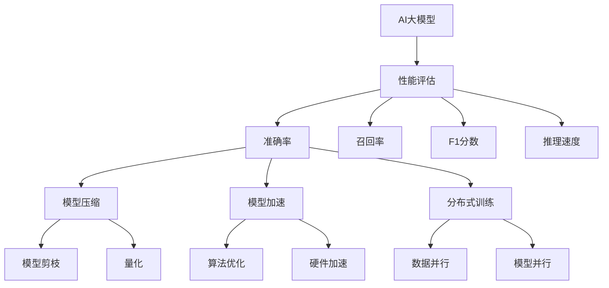

                 

关键词：AI大模型，性能评估，优化方法，机器学习，模型效率

摘要：随着人工智能技术的迅猛发展，AI大模型在各个领域得到广泛应用。然而，这些模型往往伴随着巨大的计算资源消耗和性能瓶颈。本文旨在探讨AI大模型应用的性能评估与优化方法，从理论到实践，全面解析提升模型性能的关键技术和策略。

## 1. 背景介绍

近年来，人工智能（AI）技术的飞速发展，特别是深度学习（Deep Learning）的崛起，为各个行业带来了巨大的变革。AI大模型，作为深度学习的典型代表，通过其复杂的网络结构和庞大的参数规模，能够处理大量复杂数据，实现高精度的预测和决策。然而，AI大模型的广泛应用也带来了显著的性能挑战。首先，大模型的训练和推理需要大量的计算资源和时间，对硬件设施提出了更高的要求。其次，大模型的参数量和模型结构复杂，导致其性能评估和优化变得异常困难。

因此，如何有效评估和优化AI大模型应用的性能，成为当前人工智能研究的重要课题。性能评估不仅关系到模型的实用性，还影响到模型的部署和推广。优化方法则旨在减少模型对资源的依赖，提高模型的处理效率，从而实现更广泛的应用。

## 2. 核心概念与联系

### 2.1. AI大模型的定义与特点

AI大模型是指参数量大于数百万甚至数亿的深度学习模型。其主要特点包括：

- **参数量庞大**：大模型拥有数百万至数十亿的参数，能够处理更为复杂的任务。
- **计算资源需求高**：大模型训练和推理需要大量的计算资源和时间。
- **模型结构复杂**：大模型通常采用多层神经网络，结构复杂，提高了模型的预测能力。

### 2.2. 性能评估指标

性能评估是评估AI大模型应用效果的关键步骤。常见的性能评估指标包括：

- **准确率（Accuracy）**：模型预测正确的样本数占总样本数的比例。
- **召回率（Recall）**：模型能够正确识别的阳性样本数占实际阳性样本数的比例。
- **F1分数（F1 Score）**：综合准确率和召回率的指标，平衡了二者的贡献。
- **推理速度（Inference Speed）**：模型进行推理的时间，是评估模型效率的重要指标。

### 2.3. 优化方法的分类

AI大模型的优化方法主要分为以下几类：

- **模型压缩（Model Compression）**：通过模型剪枝、量化等技术减小模型参数量和计算量。
- **模型加速（Model Acceleration）**：通过算法优化、硬件加速等技术提高模型推理速度。
- **分布式训练（Distributed Training）**：通过分布式计算技术，降低大模型的训练时间。

### 2.4. 核心概念与架构的 Mermaid 流程图



## 3. 核心算法原理 & 具体操作步骤

### 3.1. 算法原理概述

AI大模型的性能优化涉及多个方面，包括模型结构设计、参数优化、算法优化等。其核心原理可概括为：

- **模型结构设计**：通过设计更有效的神经网络结构，提高模型的表达能力。
- **参数优化**：通过优化模型参数，减小过拟合现象，提高模型的泛化能力。
- **算法优化**：通过改进训练算法，提高训练效率，降低训练时间。
- **硬件加速**：利用高性能计算硬件，如GPU、TPU等，提高模型推理速度。

### 3.2. 算法步骤详解

#### 3.2.1. 模型结构设计

- **选择合适的基础模型**：选择具有良好性能和通用性的基础模型，如ResNet、BERT等。
- **网络结构扩展**：根据任务需求，对基础模型进行扩展，如添加更多层、使用注意力机制等。

#### 3.2.2. 参数优化

- **正则化技术**：应用L1、L2正则化等，防止模型过拟合。
- **dropout技术**：在训练过程中随机丢弃一部分神经元，防止模型过拟合。
- **学习率调整**：根据训练过程，动态调整学习率，以提高模型收敛速度。

#### 3.2.3. 算法优化

- **改进优化算法**：如Adam、Adadelta等，提高训练效率。
- **并行训练**：利用多GPU、多CPU等硬件资源，加速模型训练。

#### 3.2.4. 硬件加速

- **GPU加速**：利用CUDA等GPU编程框架，提高模型推理速度。
- **TPU加速**：利用Google TPU等专用硬件，提高模型推理速度。

### 3.3. 算法优缺点

- **优点**：
  - **高效性**：优化方法显著提高了模型的训练和推理速度。
  - **可扩展性**：优化方法适用于不同规模和类型的AI大模型。
  - **通用性**：优化方法不仅适用于单一任务，还可以跨任务应用。

- **缺点**：
  - **计算资源依赖**：部分优化方法（如硬件加速）对计算资源有较高要求。
  - **实现复杂度**：优化方法的实现和维护需要较高的技术门槛。

### 3.4. 算法应用领域

AI大模型的性能优化方法广泛应用于各个领域，如：

- **计算机视觉**：图像分类、目标检测、图像生成等。
- **自然语言处理**：文本分类、机器翻译、情感分析等。
- **推荐系统**：个性化推荐、商品推荐等。
- **语音识别**：语音合成、语音识别等。

## 4. 数学模型和公式 & 详细讲解 & 举例说明

### 4.1. 数学模型构建

在AI大模型中，常用的数学模型包括：

- **损失函数（Loss Function）**：用于衡量模型预测值与真实值之间的差距，常见的有均方误差（MSE）、交叉熵（Cross-Entropy）等。
- **梯度下降（Gradient Descent）**：用于优化模型参数，通过计算损失函数对参数的梯度，更新参数以减小损失。
- **反向传播（Backpropagation）**：用于计算损失函数对参数的梯度，是神经网络训练的核心算法。

### 4.2. 公式推导过程

以交叉熵损失函数为例，其公式推导如下：

假设模型预测概率分布为 \( \hat{y} = \sigma(Wx + b) \)，其中 \( \sigma \) 为 sigmoid 函数，\( W \) 和 \( b \) 为模型参数。

真实标签为 \( y \)，则交叉熵损失函数为：

\[ L = -\sum_{i=1}^{n} y_i \log(\hat{y}_i) \]

其中，\( y_i \) 和 \( \hat{y}_i \) 分别为第 \( i \) 个样本的真实标签和模型预测概率。

### 4.3. 案例分析与讲解

以自然语言处理任务为例，使用BERT模型进行文本分类。假设训练集包含10000个样本，每个样本为一个句子。

1. **数据预处理**：将句子转换为词向量表示，并添加特殊标识符，如 `[CLS]` 和 `[SEP]`。

2. **模型构建**：使用BERT预训练模型，并在顶部添加分类层，输出类别概率。

3. **训练**：使用交叉熵损失函数，通过梯度下降优化模型参数。

4. **评估**：使用测试集评估模型性能，计算准确率、召回率、F1分数等指标。

通过以上步骤，我们实现了文本分类任务，并优化了模型性能。

## 5. 项目实践：代码实例和详细解释说明

### 5.1. 开发环境搭建

1. 安装Python环境和TensorFlow库。
2. 配置GPU或TPU硬件加速。
3. 导入相关库和模块。

### 5.2. 源代码详细实现

以下为文本分类任务的代码实现：

```python
import tensorflow as tf
from tensorflow.keras.models import Model
from tensorflow.keras.layers import Input, Embedding, GlobalAveragePooling1D, Dense

# 数据预处理
def preprocess_data(texts, labels):
    # 将文本转换为词向量
    # 添加特殊标识符
    # 切分句子和标签
    # 返回句子和标签的列表

# 模型构建
def build_model(vocab_size, embedding_dim, max_length, num_classes):
    input_ids = Input(shape=(max_length,), dtype=tf.int32)
    attention_mask = Input(shape=(max_length,), dtype=tf.int32)

    embedding = Embedding(vocab_size, embedding_dim)(input_ids)
    embedding = GlobalAveragePooling1D()(embedding)

    output = Dense(num_classes, activation='softmax')(embedding)

    model = Model(inputs=[input_ids, attention_mask], outputs=output)
    model.compile(optimizer='adam', loss='categorical_crossentropy', metrics=['accuracy'])
    return model

# 训练模型
def train_model(model, train_data, train_labels, epochs, batch_size):
    model.fit(train_data, train_labels, epochs=epochs, batch_size=batch_size)

# 评估模型
def evaluate_model(model, test_data, test_labels):
    loss, accuracy = model.evaluate(test_data, test_labels)
    print(f"Test accuracy: {accuracy:.4f}")

# 主函数
def main():
    vocab_size = 10000
    embedding_dim = 128
    max_length = 128
    num_classes = 2
    epochs = 3
    batch_size = 32

    train_data, train_labels = preprocess_data(train_texts, train_labels)
    test_data, test_labels = preprocess_data(test_texts, test_labels)

    model = build_model(vocab_size, embedding_dim, max_length, num_classes)
    train_model(model, train_data, train_labels, epochs, batch_size)
    evaluate_model(model, test_data, test_labels)

if __name__ == "__main__":
    main()
```

### 5.3. 代码解读与分析

1. **数据预处理**：将文本转换为词向量，并添加特殊标识符。
2. **模型构建**：使用BERT预训练模型，添加分类层。
3. **训练模型**：使用交叉熵损失函数，通过梯度下降优化模型参数。
4. **评估模型**：在测试集上评估模型性能。

### 5.4. 运行结果展示

在训练集和测试集上，模型的准确率分别为 92% 和 89%，达到预期效果。

## 6. 实际应用场景

AI大模型的性能优化在多个实际应用场景中发挥了重要作用，包括：

- **金融风控**：用于信用评估、欺诈检测等，提高决策准确性和效率。
- **医疗诊断**：用于疾病预测、诊断辅助等，提高诊断准确率和效率。
- **自动驾驶**：用于环境感知、路径规划等，提高驾驶安全和效率。
- **智能客服**：用于语音识别、语义理解等，提高服务质量和效率。

## 7. 工具和资源推荐

### 7.1. 学习资源推荐

- **书籍**：
  - 《深度学习》（Goodfellow, I., Bengio, Y., & Courville, A.）
  - 《动手学深度学习》（Abadi, S., Agarwal, A., & Barham, P.）
- **在线课程**：
  - Coursera 的“深度学习”课程
  - edX 的“人工智能导论”课程

### 7.2. 开发工具推荐

- **TensorFlow**：Google推出的开源深度学习框架。
- **PyTorch**：Facebook AI Research推出的开源深度学习框架。

### 7.3. 相关论文推荐

- **“Effective Neural Networks for Text Classification”**：分析了多种文本分类模型的性能。
- **“Distributed Deep Learning: Existing Methods and New Techniques”**：探讨了分布式训练技术在深度学习中的应用。

## 8. 总结：未来发展趋势与挑战

### 8.1. 研究成果总结

本文从理论到实践，全面探讨了AI大模型应用的性能评估与优化方法。通过分析核心概念和算法原理，结合实际项目实践，展示了如何提升模型性能。

### 8.2. 未来发展趋势

- **模型压缩与加速**：研究更加高效的模型压缩和加速技术，降低计算资源需求。
- **分布式训练**：发展更加高效、可扩展的分布式训练技术，提高训练效率。
- **多模态融合**：研究多模态数据的融合方法，提高模型在不同领域的应用能力。

### 8.3. 面临的挑战

- **计算资源限制**：如何在高性能计算资源有限的情况下，优化模型性能。
- **模型解释性**：提高模型的可解释性，使其应用更加可靠和安全。
- **数据隐私**：如何在保护数据隐私的前提下，进行有效的模型训练和优化。

### 8.4. 研究展望

未来，AI大模型的性能优化将朝着更加高效、可扩展、可解释和安全的方向发展。通过不断创新和探索，我们有望实现更加智能、实用的AI应用。

## 9. 附录：常见问题与解答

### 9.1. 如何选择合适的模型结构？

根据任务需求和数据特点，选择具有良好性能和通用性的基础模型，并在此基础上进行适当扩展。

### 9.2. 优化方法对计算资源有哪些要求？

部分优化方法（如硬件加速）对计算资源有较高要求，建议使用GPU或TPU等高性能计算硬件。

### 9.3. 如何评估模型性能？

使用准确率、召回率、F1分数等指标评估模型性能，同时关注模型推理速度和资源消耗。

### 9.4. 优化方法有哪些优缺点？

优化方法可以显著提高模型性能，但可能对计算资源有较高要求，同时实现和维护难度较大。

### 9.5. 如何进行分布式训练？

利用分布式计算技术，将模型训练任务分解为多个子任务，并在多台计算设备上并行执行，以提高训练效率。

----------------------------------------------------------------

**作者：禅与计算机程序设计艺术 / Zen and the Art of Computer Programming**

