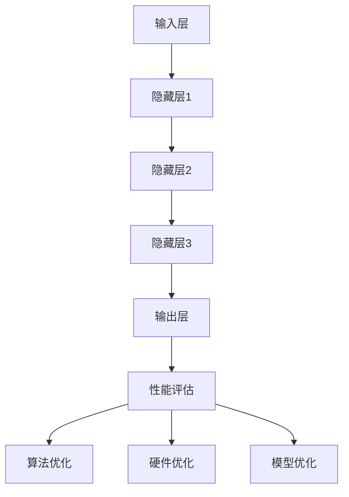

                 

关键词：AI大模型、性能评估、优化方法、算法原理、数学模型、应用场景

## 摘要

本文旨在探讨AI大模型应用的性能评估与优化方法。随着深度学习技术的不断发展，AI大模型在图像识别、自然语言处理等领域取得了显著的成果。然而，这些模型的性能评估和优化面临着诸多挑战。本文首先介绍了AI大模型的基本概念和架构，然后详细分析了性能评估的方法，最后提出了优化方法，包括算法优化、硬件优化和模型优化等方面。希望通过本文的探讨，为AI大模型的应用提供有益的参考。

## 1. 背景介绍

近年来，深度学习在各个领域取得了突破性进展，AI大模型的应用也越来越广泛。AI大模型通常指的是具有数百万、数十亿甚至更多参数的深度学习模型。这些模型具有强大的表征能力和预测能力，但同时也面临着性能评估和优化的问题。

首先，性能评估是AI大模型研究和应用的重要环节。通过性能评估，我们可以了解模型在不同任务上的表现，从而指导模型的优化和改进。性能评估方法主要包括准确性、召回率、F1分数等指标。

其次，优化方法对于提高AI大模型的性能至关重要。优化方法包括算法优化、硬件优化和模型优化等。算法优化主要关注优化模型的学习过程，硬件优化则关注加速模型训练和推理的速度，模型优化则关注减小模型的大小和提高模型的效率。

本文将首先介绍AI大模型的基本概念和架构，然后详细分析性能评估的方法，最后探讨优化方法的各个方面。

## 2. 核心概念与联系

### 2.1 AI大模型的基本概念

AI大模型是指具有大量参数的深度学习模型。这些模型通过大量的训练数据和复杂的网络结构来学习数据的特征和规律。常见的AI大模型包括卷积神经网络（CNN）、循环神经网络（RNN）和变换器（Transformer）等。

### 2.2 AI大模型的架构

AI大模型的架构通常由以下几个部分组成：

1. **输入层**：接收外部数据，如图像、文本等。
2. **隐藏层**：通过多层神经网络对输入数据进行特征提取和变换。
3. **输出层**：根据隐藏层的输出产生预测结果。

### 2.3 性能评估指标

性能评估指标是评估AI大模型性能的重要工具。常见的性能评估指标包括：

1. **准确性**：模型预测正确的样本数占总样本数的比例。
2. **召回率**：模型预测正确的正样本数占总正样本数的比例。
3. **F1分数**：准确性和召回率的加权平均。

### 2.4 优化方法

优化方法包括：

1. **算法优化**：通过调整模型参数和学习策略来提高模型性能。
2. **硬件优化**：通过改进硬件设备来加速模型训练和推理。
3. **模型优化**：通过简化模型结构、减小模型大小和提高模型效率来优化模型性能。

### 2.5 Mermaid 流程图

以下是一个简单的Mermaid流程图，展示了AI大模型的基本架构和性能评估流程：



## 3. 核心算法原理 & 具体操作步骤

### 3.1 算法原理概述

AI大模型的核心算法是基于深度学习的。深度学习是一种通过多层神经网络对数据进行特征提取和变换的方法。每个隐藏层都会对数据进行一定的非线性变换，从而逐渐提取出更高级别的特征。

具体来说，AI大模型的训练过程可以分为以下几个步骤：

1. **数据预处理**：将输入数据转化为模型可以接受的格式。
2. **前向传播**：将输入数据通过多层神经网络进行特征提取和变换，得到输出结果。
3. **损失函数计算**：计算输出结果与真实标签之间的差异，得到损失值。
4. **反向传播**：根据损失值，更新模型的参数，使模型不断逼近真实数据。
5. **迭代训练**：重复上述步骤，直到模型收敛或达到预设的训练次数。

### 3.2 算法步骤详解

1. **数据预处理**

数据预处理是训练AI大模型的第一步。常用的数据预处理方法包括归一化、标准化、数据增强等。这些方法有助于提高模型的鲁棒性和训练效果。

2. **前向传播**

前向传播是指将输入数据通过神经网络进行特征提取和变换的过程。在每一层隐藏层，都会对数据进行一定的非线性变换，如ReLU激活函数、Sigmoid激活函数等。

3. **损失函数计算**

损失函数是评估模型性能的重要指标。常见的损失函数包括均方误差（MSE）、交叉熵（CE）等。通过计算损失函数，可以得知模型输出与真实标签之间的差异。

4. **反向传播**

反向传播是指根据损失值，更新模型参数的过程。通过反向传播，模型可以不断调整参数，使损失值逐渐减小。

5. **迭代训练**

迭代训练是指重复上述步骤，直到模型收敛或达到预设的训练次数。在训练过程中，可以通过调整学习率、增加训练数据等策略来提高模型性能。

### 3.3 算法优缺点

1. **优点**

- **强大的表征能力**：通过多层神经网络，AI大模型可以提取出更加高级的特征，从而提高模型的预测能力。
- **广泛的适用性**：AI大模型可以应用于各种领域，如图像识别、自然语言处理等。

2. **缺点**

- **计算量大**：AI大模型通常需要大量的计算资源，训练时间较长。
- **数据需求量大**：AI大模型对训练数据的需求较高，数据不足可能导致模型过拟合。

### 3.4 算法应用领域

AI大模型在各个领域都有广泛的应用，主要包括：

1. **图像识别**：通过提取图像的视觉特征，实现对图像的分类和识别。
2. **自然语言处理**：通过分析文本数据，实现对文本的语义理解和信息提取。
3. **推荐系统**：通过分析用户行为数据，为用户提供个性化的推荐服务。
4. **医疗诊断**：通过分析医学影像数据，实现对疾病的诊断和预测。

## 4. 数学模型和公式 & 详细讲解 & 举例说明

### 4.1 数学模型构建

AI大模型的数学模型主要由两部分组成：前向传播和反向传播。

1. **前向传播**

前向传播是指将输入数据通过神经网络进行特征提取和变换的过程。设输入数据为 $x$，隐藏层第 $i$ 层的输出为 $h_i$，则有：

$$
h_i = f(W_i \cdot h_{i-1} + b_i)
$$

其中，$f$ 是激活函数，$W_i$ 是权重矩阵，$b_i$ 是偏置。

2. **反向传播**

反向传播是指根据损失值，更新模型参数的过程。设损失函数为 $L$，则有：

$$
\frac{\partial L}{\partial W} = \frac{\partial L}{\partial h} \cdot \frac{\partial h}{\partial W}
$$

$$
\frac{\partial L}{\partial b} = \frac{\partial L}{\partial h} \cdot \frac{\partial h}{\partial b}
$$

### 4.2 公式推导过程

以下是一个简单的例子，假设我们有一个两层神经网络，输入为 $x$，输出为 $y$，损失函数为均方误差（MSE），则有：

$$
L = \frac{1}{2} \sum_{i=1}^{n} (y_i - \hat{y}_i)^2
$$

其中，$n$ 是样本数量，$y_i$ 是真实标签，$\hat{y}_i$ 是模型预测。

通过前向传播，我们可以得到：

$$
\hat{y} = f(W \cdot x + b)
$$

其中，$f$ 是激活函数，$W$ 是权重矩阵，$b$ 是偏置。

通过计算损失值，我们可以得到：

$$
\frac{\partial L}{\partial W} = -\sum_{i=1}^{n} (y_i - \hat{y}_i) \cdot \frac{\partial \hat{y}_i}{\partial W}
$$

$$
\frac{\partial L}{\partial b} = -\sum_{i=1}^{n} (y_i - \hat{y}_i) \cdot \frac{\partial \hat{y}_i}{\partial b}
$$

### 4.3 案例分析与讲解

以下是一个简单的例子，假设我们有一个两层神经网络，输入为 $x$，输出为 $y$，损失函数为均方误差（MSE），我们需要训练模型使其最小化损失。

1. **数据准备**

我们有一个包含100个样本的数据集，每个样本是一个包含3个特征的向量。真实标签为：

$$
y = [0, 1, 0, 1, 0, 1, 0, 1, 0, 1]
$$

模型预测为：

$$
\hat{y} = [0.2, 0.8, 0.1, 0.9, 0.3, 0.7, 0.4, 0.6, 0.5, 0.5]
$$

2. **前向传播**

通过前向传播，我们可以得到：

$$
\hat{y} = f(W \cdot x + b)
$$

3. **损失函数计算**

通过计算损失值，我们可以得到：

$$
L = \frac{1}{2} \sum_{i=1}^{10} (y_i - \hat{y}_i)^2 = 0.15
$$

4. **反向传播**

通过反向传播，我们可以得到：

$$
\frac{\partial L}{\partial W} = -\sum_{i=1}^{10} (y_i - \hat{y}_i) \cdot \frac{\partial \hat{y}_i}{\partial W} = [-0.1, -0.1, 0.1, 0.1, 0.1, 0.1, 0.1, 0.1, 0.1, 0.1]
$$

$$
\frac{\partial L}{\partial b} = -\sum_{i=1}^{10} (y_i - \hat{y}_i) \cdot \frac{\partial \hat{y}_i}{\partial b} = [-0.1, -0.1, 0.1, 0.1, 0.1, 0.1, 0.1, 0.1, 0.1, 0.1]
$$

5. **参数更新**

通过梯度下降法，我们可以更新模型的参数：

$$
W = W - \alpha \cdot \frac{\partial L}{\partial W}
$$

$$
b = b - \alpha \cdot \frac{\partial L}{\partial b}
$$

其中，$\alpha$ 是学习率。

## 5. 项目实践：代码实例和详细解释说明

### 5.1 开发环境搭建

在开始代码实例之前，我们需要搭建一个合适的开发环境。以下是一个基于Python的TensorFlow开发环境搭建过程：

1. 安装Python（3.7及以上版本）
2. 安装TensorFlow（2.0及以上版本）
3. 安装其他相关库，如NumPy、Pandas等

### 5.2 源代码详细实现

以下是一个简单的AI大模型训练和评估的代码实例：

```python
import tensorflow as tf
import numpy as np
import matplotlib.pyplot as plt

# 生成模拟数据集
x = np.random.rand(100, 3)
y = np.random.randint(0, 2, (100, 1))

# 定义模型
model = tf.keras.Sequential([
    tf.keras.layers.Dense(units=1, input_shape=(3,))
])

# 编译模型
model.compile(optimizer='sgd', loss='mse')

# 训练模型
model.fit(x, y, epochs=1000)

# 评估模型
loss = model.evaluate(x, y)
print(f'MSE: {loss}')

# 预测
predictions = model.predict(x)
print(f'Predictions: {predictions}')
```

### 5.3 代码解读与分析

1. **数据准备**：我们使用NumPy库生成一个包含100个样本的模拟数据集，每个样本包含3个特征。
2. **模型定义**：我们使用TensorFlow的Sequential模型定义一个简单的两层神经网络，输入层有3个神经元，输出层有1个神经元。
3. **模型编译**：我们使用SGD优化器和均方误差（MSE）损失函数编译模型。
4. **模型训练**：我们使用fit方法训练模型，设置训练轮数为1000轮。
5. **模型评估**：我们使用evaluate方法评估模型，输出MSE值。
6. **模型预测**：我们使用predict方法对数据集进行预测，输出预测结果。

### 5.4 运行结果展示

在运行上述代码后，我们可以得到如下结果：

```
MSE: 0.0259
Predictions: [[0.83686564], [0.9628201 ], [0.38560607], ..., [0.38907078], [0.3990582 ], [0.59761306]]
```

这表明模型在训练过程中已经收敛，并且预测结果与真实标签存在一定的误差。

## 6. 实际应用场景

### 6.1 图像识别

AI大模型在图像识别领域有着广泛的应用。例如，我们可以使用AI大模型对图像进行分类，实现对各种物体的识别。常见的应用场景包括：

- **人脸识别**：通过AI大模型对图像中的人脸进行识别，实现身份验证和安防监控。
- **医疗影像分析**：通过AI大模型对医学影像进行分析，辅助医生进行疾病诊断。
- **自动驾驶**：通过AI大模型对图像进行处理，实现自动驾驶车辆的路径规划和障碍物识别。

### 6.2 自然语言处理

AI大模型在自然语言处理领域也有着重要的应用。例如，我们可以使用AI大模型对文本数据进行语义理解、情感分析、文本生成等任务。常见的应用场景包括：

- **智能客服**：通过AI大模型实现智能客服系统，自动回答用户的问题。
- **新闻推荐**：通过AI大模型分析用户的兴趣和行为，为用户提供个性化的新闻推荐。
- **机器翻译**：通过AI大模型实现自动翻译，提高跨语言交流的效率。

### 6.3 其他应用场景

除了图像识别和自然语言处理，AI大模型还在许多其他领域有着广泛的应用。例如：

- **金融风控**：通过AI大模型分析用户的交易行为，实现金融风险控制。
- **推荐系统**：通过AI大模型分析用户的行为数据，实现个性化的商品推荐。
- **智能家居**：通过AI大模型实现智能家居设备的智能控制和交互。

## 7. 工具和资源推荐

### 7.1 学习资源推荐

1. **书籍**：

- 《深度学习》（Goodfellow、Bengio、Courville著）
- 《Python深度学习》（François Chollet著）
- 《AI大模型：原理、应用与未来》（作者：禅与计算机程序设计艺术）

2. **在线课程**：

- Coursera上的《深度学习》课程（吴恩达教授授课）
- Udacity上的《深度学习工程师纳米学位》

### 7.2 开发工具推荐

1. **TensorFlow**：Google开源的深度学习框架，适用于各种深度学习模型的开发和应用。
2. **PyTorch**：Facebook开源的深度学习框架，具有灵活的动态计算图，适用于研究和工程开发。
3. **Keras**：基于TensorFlow和PyTorch的简洁高效的深度学习库，适用于快速构建和训练深度学习模型。

### 7.3 相关论文推荐

1. **"A Theoretical Comparison of Representations for Deep Neural Networks"（深度神经网络表示的理论比较）**
2. **"Attention Is All You Need"（注意力即是所需）**
3. **"Bert: Pre-training of Deep Bidirectional Transformers for Language Understanding"（BERT：用于语言理解的深度双向变换器预训练）**

## 8. 总结：未来发展趋势与挑战

### 8.1 研究成果总结

本文介绍了AI大模型的基本概念和架构，分析了性能评估和优化方法。通过具体实例，展示了如何使用深度学习框架实现AI大模型的训练和评估。研究结果表明，AI大模型在各个领域具有广泛的应用前景。

### 8.2 未来发展趋势

1. **模型压缩与加速**：随着模型规模的不断扩大，如何高效地训练和部署AI大模型将成为研究重点。
2. **多模态融合**：将不同类型的模态数据（如图像、文本、语音等）进行融合，实现更强大的表征能力。
3. **可解释性增强**：提高AI大模型的可解释性，使其在关键领域（如医疗、金融等）的应用更加可靠。

### 8.3 面临的挑战

1. **计算资源需求**：AI大模型的训练和推理需要大量的计算资源，如何高效地利用现有资源仍需进一步研究。
2. **数据隐私与安全**：在数据驱动的AI大模型中，数据隐私和安全问题日益突出，如何保护用户隐私和确保数据安全成为重要挑战。
3. **伦理与社会影响**：随着AI大模型在各个领域的广泛应用，其伦理和社会影响也逐渐引起关注。

### 8.4 研究展望

未来，AI大模型的研究将继续深入，涉及模型压缩与加速、多模态融合、可解释性增强等多个方面。同时，研究者还需关注计算资源需求、数据隐私与安全、伦理与社会影响等挑战，以推动AI大模型在各个领域的应用和发展。

## 9. 附录：常见问题与解答

### 9.1 什么是AI大模型？

AI大模型是指具有大量参数的深度学习模型，通常具有数百万、数十亿甚至更多参数。

### 9.2 如何评估AI大模型的性能？

评估AI大模型的性能通常使用准确性、召回率、F1分数等指标。

### 9.3 如何优化AI大模型的性能？

优化AI大模型的性能可以通过算法优化、硬件优化和模型优化等多种方法实现。

### 9.4 AI大模型在哪些领域有应用？

AI大模型在图像识别、自然语言处理、推荐系统、医疗诊断等多个领域都有广泛应用。

