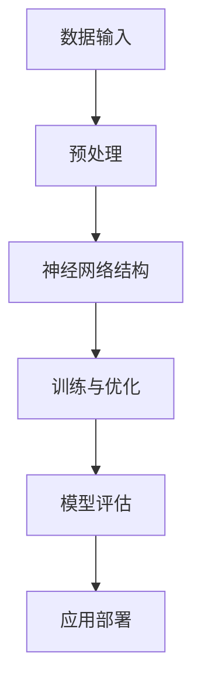

                 

关键词：AI大模型，技术培训，认证体系，人工智能，模型应用，技术语言，专业IT领域，深度学习，神经网络，应用场景，未来展望。

> 摘要：本文旨在探讨人工智能（AI）大模型应用的技术培训与认证体系。通过对AI大模型的基本概念、核心算法、数学模型、实际应用案例以及未来发展趋势的深入分析，为AI领域的技术人才提供系统的学习路径和认证方案。

## 1. 背景介绍

### 1.1 AI大模型的兴起

随着深度学习技术的飞速发展，AI大模型逐渐成为人工智能领域的核心驱动力。从早期的神经网络模型到如今的Transformer模型，大模型的应用范围涵盖了自然语言处理、计算机视觉、语音识别等多个领域。大模型的出现，极大地推动了AI技术在各个行业中的实际应用，但也对从业人员的技术水平提出了更高的要求。

### 1.2 培训与认证的重要性

为了跟上AI大模型的发展步伐，培养更多具备专业素养的技术人才变得尤为重要。而一套完善的培训与认证体系，不仅能够提高从业人员的技能水平，还能为企业和行业提供人才评估的标准。本文将围绕AI大模型应用的技术培训与认证体系，探讨其构建的必要性和可行性。

## 2. 核心概念与联系

### 2.1 AI大模型的基本概念

AI大模型指的是具备大规模参数和复杂结构的机器学习模型，通常采用深度神经网络作为基础架构。这类模型能够通过大量数据进行训练，从而实现高度复杂的任务处理能力。

### 2.2 核心算法原理

大模型的核心算法主要包括神经网络、生成对抗网络（GAN）、递归神经网络（RNN）等。这些算法在训练过程中采用了大量的优化技巧，如批量归一化、dropout、注意力机制等，以提升模型的性能。

### 2.3 架构与联系

下图展示了AI大模型的基本架构及其相互关系：



## 3. 核心算法原理 & 具体操作步骤

### 3.1 算法原理概述

AI大模型的核心算法主要基于深度学习，其基本原理是通过多层神经网络对输入数据进行特征提取和变换，最终实现预测或分类任务。其中，神经网络由多个层次组成，包括输入层、隐藏层和输出层。

### 3.2 算法步骤详解

1. **数据收集与预处理**：收集大规模数据集，并进行数据清洗、归一化等预处理操作。

2. **模型构建**：根据任务需求，设计合适的神经网络结构，包括输入层、隐藏层和输出层。

3. **模型训练**：使用优化算法（如随机梯度下降、Adam等）对模型参数进行训练，不断调整参数以降低损失函数。

4. **模型评估**：在验证集上评估模型性能，选择最优模型。

5. **模型部署**：将训练好的模型部署到实际应用环境中，进行预测或分类任务。

### 3.3 算法优缺点

**优点**：

- 高度自动化的特征提取和表示学习，能够处理复杂任务。
- 鲁棒性强，对噪声数据和异常值具有较强的抗干扰能力。

**缺点**：

- 训练过程复杂且耗时，对计算资源要求较高。
- 模型解释性较差，难以理解其内部决策过程。

### 3.4 算法应用领域

AI大模型广泛应用于自然语言处理、计算机视觉、语音识别等领域，如自动翻译、图像识别、语音合成等。

## 4. 数学模型和公式 & 详细讲解 & 举例说明

### 4.1 数学模型构建

AI大模型的核心在于其数学模型的构建，主要包括损失函数、优化算法和正则化技术等。

### 4.2 公式推导过程

以深度神经网络为例，其损失函数通常采用均方误差（MSE）：

$$
MSE = \frac{1}{n}\sum_{i=1}^{n}(y_i - \hat{y}_i)^2
$$

其中，$y_i$ 为真实标签，$\hat{y}_i$ 为模型预测值。

### 4.3 案例分析与讲解

以图像分类任务为例，我们可以使用卷积神经网络（CNN）来构建模型。下面是一个简单的CNN模型示例：

$$
\begin{aligned}
\text{Input} &: x \\
\text{Conv Layer} &: \text{Conv}_1(\text{Relu}) \\
\text{Pooling Layer} &: \text{Pooling}_1 \\
\text{Conv Layer} &: \text{Conv}_2(\text{Relu}) \\
\text{Pooling Layer} &: \text{Pooling}_2 \\
\text{Fully Connected Layer} &: \text{FC} \\
\text{Output} &: y
\end{aligned}
$$

其中，$\text{Conv}_1(\text{Relu})$ 表示第一层卷积层后跟ReLU激活函数，$\text{Pooling}_1$ 表示第一层池化层，$\text{FC}$ 表示全连接层。

## 5. 项目实践：代码实例和详细解释说明

### 5.1 开发环境搭建

在Python环境中，我们使用TensorFlow作为深度学习框架来搭建开发环境。

### 5.2 源代码详细实现

以下是一个简单的CNN模型实现示例：

```python
import tensorflow as tf
from tensorflow.keras import layers

# 构建模型
model = tf.keras.Sequential([
    layers.Conv2D(32, (3, 3), activation='relu', input_shape=(28, 28, 1)),
    layers.MaxPooling2D((2, 2)),
    layers.Conv2D(64, (3, 3), activation='relu'),
    layers.MaxPooling2D((2, 2)),
    layers.Flatten(),
    layers.Dense(64, activation='relu'),
    layers.Dense(10, activation='softmax')
])

# 编译模型
model.compile(optimizer='adam',
              loss='sparse_categorical_crossentropy',
              metrics=['accuracy'])

# 训练模型
model.fit(x_train, y_train, epochs=5)
```

### 5.3 代码解读与分析

- **输入层**：定义输入图像的尺寸为28x28x1。
- **卷积层**：第一层卷积层使用32个3x3的卷积核，激活函数为ReLU。
- **池化层**：第一层池化层使用2x2的最大池化。
- **卷积层**：第二层卷积层使用64个3x3的卷积核，激活函数为ReLU。
- **池化层**：第二层池化层使用2x2的最大池化。
- **全连接层**：将卷积层的特征图展开为1维向量，通过两个全连接层进行特征提取。
- **输出层**：使用softmax函数进行多分类预测。

### 5.4 运行结果展示

运行上述代码后，我们可以在训练过程中观察到模型的准确率逐渐提高。最终，我们可以使用测试集来评估模型性能。

## 6. 实际应用场景

AI大模型在实际应用场景中具有广泛的应用，以下是一些典型的应用案例：

### 6.1 自然语言处理

自然语言处理（NLP）是AI大模型的重要应用领域之一。例如，自动翻译、文本生成、情感分析等任务都可以通过大模型来实现。

### 6.2 计算机视觉

计算机视觉领域的大模型应用包括图像分类、目标检测、图像生成等。例如，在医学影像诊断中，AI大模型可以辅助医生进行疾病筛查和诊断。

### 6.3 语音识别

语音识别领域的大模型应用包括语音识别、语音合成、语音翻译等。例如，智能助手、语音交互系统等都依赖于大模型的强大能力。

## 7. 未来应用展望

### 7.1 研究方向

未来，AI大模型的研究方向将集中在以下几个方面：

- **模型压缩与加速**：研究如何降低模型的计算复杂度和存储需求，以实现实时应用。
- **模型解释性**：提高大模型的解释性，使其在决策过程中更具透明性和可解释性。
- **跨模态学习**：研究跨不同模态（如文本、图像、声音等）的数据融合与建模方法。

### 7.2 挑战与机遇

AI大模型应用面临的主要挑战包括：

- **计算资源需求**：大模型的训练和推理过程需要大量的计算资源，这对硬件设施提出了更高的要求。
- **数据隐私与安全**：在数据驱动的大模型训练过程中，如何保护用户隐私和数据安全成为亟待解决的问题。

## 8. 工具和资源推荐

### 8.1 学习资源推荐

- 《深度学习》（Goodfellow, Bengio, Courville 著）
- 《动手学深度学习》（花轮翔吾，达赛·乌尔里克 著）
- 《神经网络与深度学习》（邱锡鹏 著）

### 8.2 开发工具推荐

- TensorFlow
- PyTorch
- Keras

### 8.3 相关论文推荐

- "Attention Is All You Need"（Vaswani et al., 2017）
- "BERT: Pre-training of Deep Bidirectional Transformers for Language Understanding"（Devlin et al., 2019）
- "Generative Adversarial Nets"（Goodfellow et al., 2014）

## 9. 总结：未来发展趋势与挑战

### 9.1 研究成果总结

AI大模型在过去几年取得了显著的进展，已广泛应用于各个领域。未来，随着计算资源、算法创新和跨领域研究的不断推进，AI大模型的应用前景将更加广阔。

### 9.2 未来发展趋势

- **模型压缩与优化**：研究更加高效的大模型架构和训练策略，降低计算资源需求。
- **跨模态学习**：探索跨不同模态的数据融合与建模方法，实现更加智能的应用。
- **模型解释性**：提高大模型的解释性，使其在决策过程中更具透明性和可解释性。

### 9.3 面临的挑战

- **计算资源需求**：大模型的训练和推理过程需要大量的计算资源，这对硬件设施提出了更高的要求。
- **数据隐私与安全**：在数据驱动的大模型训练过程中，如何保护用户隐私和数据安全成为亟待解决的问题。

### 9.4 研究展望

未来，AI大模型应用的研究将不断深入，逐步解决现有的挑战，推动人工智能技术的发展。随着技术的不断进步，AI大模型将在更多领域发挥重要作用，为人类创造更加智能、便捷的未来。

## 10. 附录：常见问题与解答

### 10.1 问题1：AI大模型训练时间很长怎么办？

解答：可以考虑以下几种方法：

- **分布式训练**：将模型分布在多台机器上进行训练，以降低训练时间。
- **模型压缩**：采用模型压缩技术（如剪枝、量化等）降低模型的计算复杂度。
- **迁移学习**：使用预训练的大模型作为起点，针对特定任务进行微调，以减少训练时间。

### 10.2 问题2：如何保证AI大模型的公平性和透明性？

解答：

- **数据清洗**：在训练数据集阶段，进行数据清洗，去除偏见和不平衡的数据。
- **模型解释性**：提高大模型的解释性，使其决策过程更加透明。
- **监管机制**：建立监管机制，对AI大模型的应用进行监督和管理，确保其符合伦理和法律要求。

### 10.3 问题3：如何评估AI大模型的效果？

解答：

- **准确率**：评估模型在测试集上的准确率，以衡量其分类或预测能力。
- **F1值**：评估模型在不同类别上的表现，综合考虑精确率和召回率。
- **ROC曲线和AUC值**：评估模型的分类能力，通过ROC曲线和AUC值进行综合评估。

以上是关于AI大模型应用的技术培训与认证体系的一篇专业技术博客文章。通过本文，读者可以全面了解AI大模型的基本概念、核心算法、数学模型、实际应用案例以及未来发展趋势。同时，文章还提供了相关的学习资源、开发工具和论文推荐，为读者深入学习AI大模型提供了有力支持。希望本文能对广大AI领域的技术人才有所帮助。作者：禅与计算机程序设计艺术 / Zen and the Art of Computer Programming。|endofdoc|

