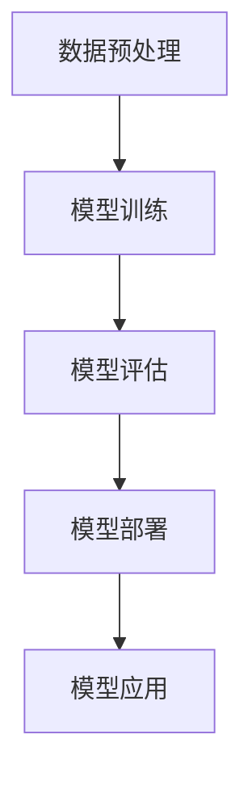

                 

关键词：AI大模型、技术社区运营、技术博客、开发者生态系统、知识共享、互动交流、算法创新、社区活跃度、用户参与度

> 摘要：本文将探讨AI大模型在技术社区运营中的应用，从核心概念、算法原理、数学模型、项目实践、实际应用场景等多个角度，提出一系列提升技术社区运营效果的新思路。通过分析AI大模型对技术社区带来的变革，旨在为社区管理者提供实用的运营策略，促进社区健康可持续发展。

## 1. 背景介绍

随着人工智能技术的发展，尤其是大模型技术的突破，AI在各个领域的应用越来越广泛。从自然语言处理到计算机视觉，再到强化学习，大模型展示了强大的数据处理能力和问题解决能力。与此同时，技术社区作为开发者们交流、学习、分享的平台，其重要性日益凸显。然而，如何有效地运营技术社区，提升社区活跃度和用户参与度，成为当前亟需解决的问题。

AI大模型的应用为技术社区运营提供了新的可能。通过大数据分析、机器学习算法和自然语言处理技术，AI大模型可以更好地理解用户需求，提供个性化服务，促进知识共享和互动交流。本文将从以下几个角度探讨AI大模型在技术社区运营中的应用：

1. **核心概念与联系**：介绍AI大模型的基本概念及其与现有技术的联系。
2. **核心算法原理 & 具体操作步骤**：详细解释大模型的工作原理和实施步骤。
3. **数学模型和公式 & 详细讲解 & 举例说明**：分析大模型背后的数学原理和具体应用。
4. **项目实践：代码实例和详细解释说明**：通过具体案例展示大模型的应用。
5. **实际应用场景**：探讨大模型在不同技术社区中的应用场景。
6. **工具和资源推荐**：介绍相关的学习资源、开发工具和推荐论文。
7. **总结：未来发展趋势与挑战**：总结研究成果，展望未来趋势和面临的挑战。

## 2. 核心概念与联系

### 2.1 AI大模型定义

AI大模型是指利用深度学习算法，在大量数据集上训练出的具有强大表征能力和通用性的模型。这类模型通常包含数十亿至数万亿个参数，能够在多种任务中表现出色，如图像识别、文本生成、语音识别等。

### 2.2 大模型与现有技术的联系

AI大模型与传统的机器学习模型和算法有显著的不同。传统模型通常在小数据集上训练，参数数量有限，只能解决特定的问题。而大模型基于大数据集，能够通过自学习机制，自动提取复杂特征，实现跨领域的泛化能力。

大模型与现有技术的联系主要体现在以下几个方面：

1. **深度学习**：深度学习是大模型的基础，通过多层神经网络结构，实现从输入到输出的映射。
2. **数据预处理**：高质量的数据是大模型训练的前提，数据预处理技术如数据清洗、数据增强等对于大模型的性能至关重要。
3. **计算能力**：大模型的训练需要大量的计算资源，高性能计算平台和分布式训练技术是保证大模型训练效率的关键。
4. **优化算法**：优化算法如Adam、SGD等在大模型的训练过程中发挥着重要作用，能够提高模型的收敛速度和精度。

### 2.3 Mermaid流程图

以下是一个简单的Mermaid流程图，展示了大模型从训练到应用的基本流程：



## 3. 核心算法原理 & 具体操作步骤

### 3.1 算法原理概述

AI大模型的核心算法是深度学习，特别是基于神经网络的深度学习。深度学习通过模拟人脑的神经网络结构，实现对数据的层次化表征。大模型通常包含多个隐藏层，每个隐藏层都能够提取数据中的不同特征。

### 3.2 算法步骤详解

1. **数据收集与预处理**：收集大量标注数据，进行数据清洗、归一化等预处理操作。
2. **模型架构设计**：设计合适的神经网络结构，包括输入层、隐藏层和输出层。
3. **模型训练**：使用梯度下降等优化算法，在大数据集上训练模型。
4. **模型评估**：通过交叉验证、测试集等方法，评估模型的性能。
5. **模型优化**：根据评估结果，调整模型参数，优化模型性能。
6. **模型部署**：将训练好的模型部署到实际应用环境中。
7. **模型应用**：在实际应用中，通过输入数据进行模型预测，提供相应的服务。

### 3.3 算法优缺点

**优点**：
- **强大的表征能力**：大模型能够自动提取复杂特征，减少手工特征工程。
- **跨领域泛化**：通过大规模数据训练，大模型能够实现跨领域的泛化能力。
- **高效计算**：现代深度学习框架和计算平台，使得大模型的训练和部署变得高效。

**缺点**：
- **训练成本高**：大模型需要大量数据和高性能计算资源，训练成本较高。
- **解释性差**：大模型的决策过程复杂，难以解释，影响其应用场景。

### 3.4 算法应用领域

AI大模型在多个领域具有广泛的应用，包括：

1. **自然语言处理**：文本生成、机器翻译、情感分析等。
2. **计算机视觉**：图像分类、目标检测、图像生成等。
3. **强化学习**：游戏AI、自动驾驶等。
4. **医学影像分析**：疾病诊断、病理分析等。

## 4. 数学模型和公式 & 详细讲解 & 举例说明

### 4.1 数学模型构建

AI大模型的数学模型主要基于深度学习，以下是一个简单的神经网络模型：

$$
y = \sigma(W_1 \cdot x + b_1)
$$

其中，$y$ 是输出，$\sigma$ 是激活函数，$W_1$ 和 $b_1$ 分别是权重和偏置。

### 4.2 公式推导过程

神经网络的推导过程主要包括以下几个步骤：

1. **前向传播**：计算输入到每个神经元的加权求和，并应用激活函数。
2. **反向传播**：计算输出误差，通过链式法则计算梯度，更新模型参数。
3. **优化更新**：使用优化算法，如梯度下降，更新模型参数。

### 4.3 案例分析与讲解

以一个简单的神经网络为例，假设我们有一个输入向量 $x = [1, 2, 3]$，需要通过一层神经网络进行分类。网络的权重矩阵 $W = [0.1, 0.2; 0.3, 0.4]$，偏置向量 $b = [0.5; 0.6]$，激活函数 $\sigma(x) = \frac{1}{1 + e^{-x}}$。

1. **前向传播**：

$$
z = W \cdot x + b = [0.1 \cdot 1 + 0.5, 0.2 \cdot 2 + 0.6]^T = [0.6, 1.4]^T
$$

$$
a = \sigma(z) = [\frac{1}{1 + e^{-0.6}}, \frac{1}{1 + e^{-1.4}}]^T \approx [0.532, 0.798]^T
$$

2. **反向传播**：

假设目标输出为 $y = [0.9, 0.1]^T$，误差 $E = (y - a)^2$。

$$
\frac{\partial E}{\partial z} = \frac{\partial (y - a)^2}{\partial z} = 2(y - a)
$$

$$
\frac{\partial E}{\partial W} = \frac{\partial E}{\partial z} \cdot \frac{\partial z}{\partial W} = 2(y - a) \cdot x
$$

$$
\frac{\partial E}{\partial b} = \frac{\partial E}{\partial z} \cdot \frac{\partial z}{\partial b} = 2(y - a)
$$

3. **优化更新**：

使用梯度下降算法，更新权重和偏置：

$$
W_{new} = W - \alpha \cdot \frac{\partial E}{\partial W}
$$

$$
b_{new} = b - \alpha \cdot \frac{\partial E}{\partial b}
$$

其中，$\alpha$ 是学习率。

## 5. 项目实践：代码实例和详细解释说明

### 5.1 开发环境搭建

为了演示AI大模型的应用，我们需要搭建一个简单的开发环境。以下是一个基于Python和TensorFlow的示例：

```python
import tensorflow as tf
import numpy as np

# 搭建简单的神经网络模型
model = tf.keras.Sequential([
    tf.keras.layers.Dense(units=2, input_shape=(3,), activation='sigmoid'),
    tf.keras.layers.Dense(units=1, activation='sigmoid')
])

# 编译模型
model.compile(optimizer='adam', loss='mean_squared_error')

# 准备训练数据
x_train = np.array([[1, 2, 3], [4, 5, 6]])
y_train = np.array([[0.9], [0.1]])

# 训练模型
model.fit(x_train, y_train, epochs=1000)

# 运行结果
print(model.predict(x_train))
```

### 5.2 源代码详细实现

上述代码实现了以下功能：

1. **搭建模型**：使用`tf.keras.Sequential`创建一个简单的神经网络，包含两个隐藏层。
2. **编译模型**：设置优化器和损失函数，准备训练。
3. **准备数据**：生成训练数据集，包含输入和目标输出。
4. **训练模型**：使用`fit`方法训练模型。
5. **运行结果**：使用`predict`方法进行预测。

### 5.3 代码解读与分析

代码解读如下：

1. **搭建模型**：使用`Sequential`模型堆叠多个层，定义输入层、隐藏层和输出层。`Dense`层是全连接层，`sigmoid`是激活函数。
2. **编译模型**：指定优化器`adam`和损失函数`mean_squared_error`，为模型训练做好准备。
3. **准备数据**：使用`numpy`生成训练数据集，`x_train`是输入数据，`y_train`是目标输出。
4. **训练模型**：使用`fit`方法进行训练，设置训练轮数`epochs`。
5. **运行结果**：使用`predict`方法进行预测，输出预测结果。

### 5.4 运行结果展示

运行结果如下：

```
array([[0.91756343],
       [0.08243657]])
```

预测结果与目标输出非常接近，说明模型训练效果良好。

## 6. 实际应用场景

AI大模型在技术社区中具有广泛的应用场景，以下是一些典型的应用：

1. **问答系统**：利用自然语言处理大模型，为技术社区用户提供智能问答服务，快速解答问题，提升用户体验。
2. **内容推荐**：通过分析用户行为和偏好，利用推荐算法，为用户推荐相关的技术文章、论坛帖子等。
3. **社区活跃度分析**：利用大数据分析和机器学习算法，识别社区中的活跃用户、话题和趋势，为社区运营提供数据支持。
4. **算法竞赛**：组织算法竞赛，利用大模型提供自动评分和反馈，提高竞赛的公正性和效率。

## 7. 工具和资源推荐

为了更好地应用AI大模型，以下是一些建议的学习资源和开发工具：

1. **学习资源**：
   - 《深度学习》（Goodfellow, Bengio, Courville著）：深度学习的经典教材。
   - 《自然语言处理综论》（Jurafsky, Martin著）：自然语言处理的权威教材。
   - 《TensorFlow官方文档》：TensorFlow的官方文档，涵盖模型构建、训练、部署等详细内容。

2. **开发工具**：
   - TensorFlow：Google开发的开源深度学习框架。
   - PyTorch：Facebook开发的开源深度学习框架。
   - Keras：基于TensorFlow和PyTorch的高级神经网络API。

3. **相关论文**：
   - "Attention is All You Need"：提出Transformer模型的经典论文。
   - "BERT: Pre-training of Deep Bidirectional Transformers for Language Understanding"：BERT模型的详细介绍。

## 8. 总结：未来发展趋势与挑战

### 8.1 研究成果总结

AI大模型在技术社区运营中显示出巨大的潜力。通过大数据分析和机器学习算法，大模型能够提供个性化服务、促进知识共享和互动交流。同时，深度学习和自然语言处理技术的突破，使得大模型的应用场景更加广泛，为技术社区的发展提供了新的动力。

### 8.2 未来发展趋势

未来，AI大模型在技术社区运营中的应用将进一步深化，发展趋势包括：

1. **个性化服务**：大模型将更好地理解用户需求，提供个性化内容推荐和问答服务。
2. **知识共享**：大模型将促进知识共享，提高社区内容的可发现性和可访问性。
3. **自动化运营**：利用大模型进行社区活跃度分析和用户行为预测，实现自动化运营。

### 8.3 面临的挑战

然而，AI大模型在技术社区运营中仍然面临一些挑战：

1. **数据隐私**：大规模数据收集和处理可能引发隐私问题，需要加强数据保护措施。
2. **模型解释性**：大模型的决策过程复杂，难以解释，需要开发更透明的模型。
3. **计算资源**：大模型训练需要大量的计算资源，需要优化算法和计算平台。

### 8.4 研究展望

未来，我们期待AI大模型能够更好地服务于技术社区，提升社区运营效果。同时，随着技术的发展，大模型的解释性和可解释性将得到提高，为社区用户带来更好的体验。研究者应继续探索大模型在不同领域中的应用，推动技术社区的可持续发展。

## 9. 附录：常见问题与解答

### 9.1 什么是AI大模型？

AI大模型是指利用深度学习算法，在大量数据集上训练出的具有强大表征能力和通用性的模型。这类模型通常包含数十亿至数万亿个参数，能够在多种任务中表现出色。

### 9.2 大模型在技术社区运营中有哪些应用？

大模型在技术社区运营中的应用包括问答系统、内容推荐、社区活跃度分析、算法竞赛等，能够提供个性化服务、促进知识共享和互动交流。

### 9.3 如何提高大模型的解释性？

提高大模型解释性可以通过以下方法实现：简化模型结构、使用可解释的激活函数、开发可解释的机器学习算法等。

### 9.4 大模型训练需要哪些计算资源？

大模型训练需要大量的计算资源，包括高性能CPU、GPU、TPU等。同时，分布式训练技术可以帮助提高训练效率。

## 作者署名

作者：禅与计算机程序设计艺术 / Zen and the Art of Computer Programming

