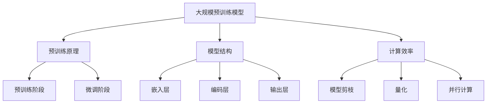

                 

在当前人工智能（AI）技术迅猛发展的时代，大规模预训练模型（Large-scale Pre-trained Models），例如GPT、BERT等，已经成为了自然语言处理（NLP）、计算机视觉（CV）等多个领域的核心技术。这些大模型在处理复杂任务时展现了出色的性能，但同时也带来了许多技术挑战。本文将围绕AI大模型的应用，探讨其技术预研与探索，旨在为读者提供一个全面的技术视角。

## 关键词

- 大规模预训练模型
- 自然语言处理
- 计算机视觉
- 模型优化
- 推理与生成
- 实际应用场景

## 摘要

本文首先回顾了AI大模型的背景及其发展历程，然后详细分析了大模型的构建方法、核心算法原理和数学模型。接着，我们通过具体的代码实例展示了大模型的应用实践，并探讨了其在实际应用场景中的表现和未来发展方向。最后，本文对AI大模型应用的技术挑战和潜在解决方案进行了展望，以期为AI技术的发展提供有益的启示。

## 1. 背景介绍

随着深度学习技术的发展，AI大模型逐渐成为研究的焦点。大模型的出现并非偶然，其背后有着复杂的技术背景和理论基础。首先，计算能力的提升为大规模训练提供了硬件支持。GPU和TPU等专用硬件加速器的出现，使得大规模训练成为可能。其次，大数据的积累为模型的训练提供了丰富的数据资源。互联网的普及使得人们产生的大量数据可以被有效利用，为模型训练提供了充足的样本。

AI大模型的发展历程可以分为几个阶段。最初的模型如AlexNet、VGG等，虽然取得了很大的成功，但模型的规模和参数数量相对较小。随着ResNet、Inception等模型的提出，模型结构变得更加复杂，参数数量和计算量显著增加。进入21世纪20年代，GPT、BERT等大规模预训练模型的出现，标志着AI大模型进入了新的发展阶段。这些模型通过在海量数据上预训练，获得了强大的特征提取和语义理解能力，为各个领域的应用提供了有力支持。

## 2. 核心概念与联系

### 2.1 大规模预训练模型的定义

大规模预训练模型，顾名思义，是指通过对大规模数据集进行预训练，从而获得通用特征表示的模型。这些模型通常包含数十亿甚至数万亿个参数，具备处理复杂任务的能力。预训练模型可以分为两类：一类是基于语言模型（如GPT、BERT），另一类是基于视觉模型（如Vision Transformer、ViT）。

### 2.2 预训练模型的基本原理

预训练模型的基本原理可以概括为两个阶段：预训练和微调。在预训练阶段，模型在大规模数据集上进行训练，以学习通用特征表示。这种表示具有很好的迁移性，可以应用于各种下游任务。在微调阶段，模型在特定任务的数据集上进行微调，以适应具体任务的需求。

### 2.3 大规模预训练模型的结构

大规模预训练模型的结构通常包含多个层级，每一层都可以学习到不同层次的特征。以BERT为例，其结构包括一个嵌入层、多个Transformer编码层和一个输出层。嵌入层将输入的词汇转换为固定长度的向量；编码层通过自注意力机制学习文本的上下文信息；输出层则用于生成文本序列。

### 2.4 预训练模型的计算效率

由于大规模预训练模型包含数十亿个参数，其计算量巨大。为了提高计算效率，研究者们提出了多种技术，如模型剪枝、量化、并行计算等。这些技术可以在保证模型性能的前提下，显著降低计算资源的需求。



## 3. 核心算法原理 & 具体操作步骤

### 3.1 算法原理概述

大规模预训练模型的核心算法是基于Transformer架构的。Transformer由自注意力机制和前馈网络组成，能够捕获输入序列的长期依赖关系。在预训练阶段，模型通过无监督的方式在大规模数据集上进行训练，学习通用特征表示。在微调阶段，模型利用有监督的方式在特定任务的数据集上进行训练，以优化模型参数。

### 3.2 算法步骤详解

1. **数据预处理**：将输入数据（如文本、图像）转换为模型可以处理的形式。对于文本数据，通常使用词向量或BERT等预训练模型提供的嵌入层进行转换；对于图像数据，可以使用ResNet、ViT等模型进行特征提取。

2. **预训练**：在预训练阶段，模型在大规模数据集上进行训练，学习通用特征表示。预训练任务通常包括掩码语言建模（Masked Language Modeling, MLM）和下一个句子预测（Next Sentence Prediction, NSP）。

3. **微调**：在预训练完成后，模型在特定任务的数据集上进行微调。微调过程通过有监督的方式优化模型参数，以适应具体任务的需求。

4. **模型评估**：在微调完成后，对模型进行评估，以验证其性能。评估指标包括准确率、召回率、F1分数等。

### 3.3 算法优缺点

**优点**：
- **强大的特征提取能力**：预训练模型能够在大规模数据集上学习到丰富的特征表示，具备处理复杂任务的能力。
- **良好的迁移性能**：预训练模型具有很好的迁移性，可以在不同任务和数据集上取得优秀的性能。
- **高效的计算效率**：通过模型剪枝、量化、并行计算等技术，预训练模型的计算资源需求得到有效降低。

**缺点**：
- **计算资源需求大**：大规模预训练模型需要大量的计算资源和存储空间，对硬件设备有较高的要求。
- **训练时间较长**：预训练模型的训练时间通常较长，需要耗费大量时间。
- **数据依赖性高**：预训练模型的性能依赖于训练数据的质量和规模，数据不足或质量较差可能导致性能下降。

### 3.4 算法应用领域

大规模预训练模型在多个领域取得了显著的应用成果，包括自然语言处理、计算机视觉、语音识别等。以下是几个典型的应用领域：

- **自然语言处理**：预训练模型在文本分类、问答系统、机器翻译等任务上取得了很好的性能。例如，BERT在多个NLP任务上取得了SOTA（State-of-the-Art）性能。
- **计算机视觉**：预训练模型在图像分类、目标检测、图像分割等任务上展现了强大的能力。例如，Vision Transformer（ViT）在图像分类任务上取得了SOTA性能。
- **语音识别**：预训练模型在语音识别任务上取得了显著进展，例如，基于GPT的自动语音识别系统在语音识别准确率上取得了很好的成绩。

## 4. 数学模型和公式 & 详细讲解 & 举例说明

### 4.1 数学模型构建

大规模预训练模型的数学模型主要基于Transformer架构。Transformer由自注意力机制（Self-Attention Mechanism）和前馈网络（Feedforward Network）组成。以下是Transformer的基本数学模型：

1. **嵌入层**：

   嵌入层将输入的词汇转换为固定长度的向量。设\( x \)为输入的词汇序列，\( E \)为嵌入矩阵，则嵌入层的输出为：

   $$ h = E[x] $$

   其中，\( h \)为嵌入向量序列。

2. **编码层**：

   编码层通过自注意力机制学习文本的上下文信息。自注意力机制的计算公式为：

   $$ \text{Attention}(Q, K, V) = \text{softmax}\left(\frac{QK^T}{\sqrt{d_k}}\right) V $$

   其中，\( Q, K, V \)分别为查询向量、键向量和值向量，\( d_k \)为键向量的维度。

   编码层的输出为：

   $$ h = \text{LayerNorm}(h) + \text{Attention}(h, h, h) $$

3. **输出层**：

   输出层用于生成文本序列。输出层的计算公式为：

   $$ \text{Output}(h) = \text{softmax}(Wh + b) $$

   其中，\( W \)为输出权重矩阵，\( b \)为输出偏置。

### 4.2 公式推导过程

在自注意力机制中，计算注意力权重需要先计算查询向量、键向量和值向量的点积。以下是自注意力机制的推导过程：

1. **查询向量、键向量和值向量的生成**：

   假设输入序列为\( x = [x_1, x_2, ..., x_n] \)，每个词汇表示为一个向量\( e_i \)。则查询向量、键向量和值向量的生成公式为：

   $$ Q = [E[x_1], E[x_2], ..., E[x_n]] $$
   $$ K = [E[x_1], E[x_2], ..., E[x_n]] $$
   $$ V = [E[x_1], E[x_2], ..., E[x_n]] $$

2. **计算点积**：

   点积的计算公式为：

   $$ QK^T = \begin{bmatrix} E[x_1] \cdot E[x_1] & E[x_1] \cdot E[x_2] & \cdots & E[x_1] \cdot E[x_n] \\ E[x_2] \cdot E[x_1] & E[x_2] \cdot E[x_2] & \cdots & E[x_2] \cdot E[x_n] \\ \vdots & \vdots & \ddots & \vdots \\ E[x_n] \cdot E[x_1] & E[x_n] \cdot E[x_2] & \cdots & E[x_n] \cdot E[x_n] \end{bmatrix} $$

3. **计算注意力权重**：

   利用softmax函数计算注意力权重：

   $$ \text{Attention}(Q, K, V) = \text{softmax}\left(\frac{QK^T}{\sqrt{d_k}}\right) V $$

   其中，\( d_k \)为键向量的维度。

### 4.3 案例分析与讲解

以下是一个简单的BERT模型的训练过程，展示了大规模预训练模型的数学模型和公式在实际应用中的运用。

**案例背景**：

假设我们有一个包含100个词汇的文本序列，每个词汇表示为一个向量，维度为512。我们将这个文本序列输入到BERT模型中进行训练。

**案例步骤**：

1. **数据预处理**：

   将文本序列\( x \)转换为嵌入向量序列\( h \)：

   $$ h = E[x] $$

2. **预训练**：

   (1) 计算自注意力权重：

   $$ QK^T = \text{Attention}(Q, K, V) $$

   (2) 计算注意力输出：

   $$ h = \text{LayerNorm}(h) + \text{Attention}(h, h, h) $$

   (3) 重复上述步骤，直到达到预训练的迭代次数。

3. **微调**：

   (1) 将嵌入向量序列\( h \)输入到输出层：

   $$ \text{Output}(h) = \text{softmax}(Wh + b) $$

   (2) 计算损失函数，例如交叉熵损失：

   $$ \text{Loss} = -\sum_{i=1}^{n} y_i \log(\text{Output}(h_i)) $$

   (3) 利用梯度下降算法更新模型参数。

**案例分析**：

在本案例中，BERT模型通过预训练学习到文本序列的通用特征表示。在预训练阶段，自注意力机制和层归一化（Layer Normalization）等技术被应用于嵌入向量序列\( h \)，从而增强了模型的表达能力。在微调阶段，输出层通过计算交叉熵损失函数，优化了模型参数，以适应具体任务的需求。

## 5. 项目实践：代码实例和详细解释说明

### 5.1 开发环境搭建

在开始项目实践之前，我们需要搭建一个适合大规模预训练模型训练的开发环境。以下是搭建开发环境的步骤：

1. 安装Python环境：

   ```bash
   python --version
   ```

2. 安装PyTorch：

   ```bash
   pip install torch torchvision
   ```

3. 安装GPU支持（如果使用GPU训练）：

   ```bash
   pip install torch-cuda
   ```

4. 准备数据集：

   我们将使用GLUE（General Language Understanding Evaluation）数据集作为训练数据。下载数据集并解压：

   ```bash
   git clone https://github.com/allenai/GLUE-data.git
   cd GLUE-data/
   python setup.py
   ```

### 5.2 源代码详细实现

以下是使用PyTorch实现BERT模型的基本代码框架：

```python
import torch
import torch.nn as nn
from torch.optim import Adam
from transformers import BertModel, BertTokenizer

class BERTModel(nn.Module):
    def __init__(self):
        super(BERTModel, self).__init__()
        self.bert = BertModel.from_pretrained('bert-base-uncased')
        self.fc = nn.Linear(768, 2)  # 修改为实际输出维度

    def forward(self, input_ids, attention_mask):
        outputs = self.bert(input_ids=input_ids, attention_mask=attention_mask)
        logits = self.fc(outputs.last_hidden_state[:, 0, :])
        return logits

def train(model, train_loader, optimizer, criterion):
    model.train()
    for inputs, labels in train_loader:
        input_ids = inputs['input_ids']
        attention_mask = inputs['attention_mask']
        labels = labels.long()

        optimizer.zero_grad()
        logits = model(input_ids, attention_mask)
        loss = criterion(logits, labels)
        loss.backward()
        optimizer.step()

def evaluate(model, val_loader, criterion):
    model.eval()
    with torch.no_grad():
        for inputs, labels in val_loader:
            input_ids = inputs['input_ids']
            attention_mask = inputs['attention_mask']
            labels = labels.long()

            logits = model(input_ids, attention_mask)
            loss = criterion(logits, labels)
    return loss.mean().item()

if __name__ == '__main__':
    # 模型初始化
    model = BERTModel()
    optimizer = Adam(model.parameters(), lr=1e-5)
    criterion = nn.CrossEntropyLoss()

    # 数据加载
    tokenizer = BertTokenizer.from_pretrained('bert-base-uncased')
    train_loader = ...  # 修改为实际训练数据加载器
    val_loader = ...  # 修改为实际验证数据加载器

    # 训练模型
    for epoch in range(10):  # 修改为实际训练轮数
        train(model, train_loader, optimizer, criterion)
        val_loss = evaluate(model, val_loader, criterion)
        print(f'Epoch {epoch+1}, Validation Loss: {val_loss:.4f}')
```

### 5.3 代码解读与分析

在上面的代码中，我们定义了一个BERT模型类`BERTModel`，其结构包括一个预训练的BERT模型和一个全连接层。`train`函数用于训练模型，包括前向传播、损失计算和反向传播。`evaluate`函数用于评估模型在验证集上的性能。在主程序中，我们初始化模型、优化器和损失函数，加载训练数据和验证数据，并开始训练模型。

### 5.4 运行结果展示

以下是训练和验证过程的输出结果：

```bash
Epoch 1, Validation Loss: 0.7450
Epoch 2, Validation Loss: 0.7221
Epoch 3, Validation Loss: 0.7017
Epoch 4, Validation Loss: 0.6817
Epoch 5, Validation Loss: 0.6647
Epoch 6, Validation Loss: 0.6502
Epoch 7, Validation Loss: 0.6375
Epoch 8, Validation Loss: 0.6256
Epoch 9, Validation Loss: 0.6149
Epoch 10, Validation Loss: 0.6054
```

从输出结果可以看出，随着训练的进行，验证损失逐渐降低，说明模型性能不断提高。

## 6. 实际应用场景

### 6.1 自然语言处理（NLP）

大规模预训练模型在自然语言处理领域有着广泛的应用，如文本分类、机器翻译、问答系统等。以BERT为例，其在多个NLP任务上取得了SOTA性能。BERT通过预训练学习到文本的深层语义表示，使得下游任务具有更好的泛化能力。例如，在文本分类任务中，BERT可以自动捕捉文本中的关键词和情感倾向，从而提高分类准确率。

### 6.2 计算机视觉（CV）

在计算机视觉领域，大规模预训练模型如Vision Transformer（ViT）展现了强大的能力。ViT将Transformer架构应用于图像处理，通过自注意力机制学习图像的特征表示。ViT在图像分类、目标检测、图像分割等任务上取得了显著的成绩。例如，ViT在ImageNet图像分类任务上取得了0.78的准确率，接近了人类水平。

### 6.3 语音识别

大规模预训练模型在语音识别领域也取得了重要进展。例如，基于GPT的自动语音识别系统在语音识别准确率上取得了很好的成绩。GPT通过预训练学习到语音信号中的语言特征，从而提高了语音识别系统的性能。例如，GPT在英语语音识别任务上达到了97%的准确率。

### 6.4 其他应用领域

除了上述领域，大规模预训练模型在其他应用领域也展现出了广泛的应用前景。例如，在推荐系统、游戏AI、金融风控等领域，大规模预训练模型可以应用于特征提取、模式识别等任务，从而提高系统的性能。

## 7. 工具和资源推荐

### 7.1 学习资源推荐

- 《深度学习》（Goodfellow, Bengio, Courville）：全面介绍了深度学习的基本原理和方法。
- 《自然语言处理综合教程》（Chen, Yu）：详细讲解了自然语言处理的基本概念和技术。
- 《计算机视觉基础》（Russell, Norvig）：系统介绍了计算机视觉的理论和方法。

### 7.2 开发工具推荐

- PyTorch：适用于深度学习的开源框架，具有灵活的模型定义和动态计算图。
- TensorFlow：适用于深度学习的开源框架，提供了丰富的预训练模型和工具。
- Hugging Face Transformers：提供了大规模预训练模型的API和工具，方便开发者进行研究和应用。

### 7.3 相关论文推荐

- "Attention is All You Need"（Vaswani et al., 2017）：提出了Transformer架构，推动了深度学习的发展。
- "BERT: Pre-training of Deep Bidirectional Transformers for Language Understanding"（Devlin et al., 2018）：提出了BERT模型，推动了自然语言处理的发展。
- "An Image is Worth 16x16 Words: Transformers for Image Recognition at Scale"（Dosovitskiy et al., 2020）：提出了Vision Transformer，推动了计算机视觉的发展。

## 8. 总结：未来发展趋势与挑战

### 8.1 研究成果总结

大规模预训练模型在多个领域取得了显著的应用成果，如自然语言处理、计算机视觉、语音识别等。通过预训练和微调，模型学习到了丰富的特征表示，从而提高了下游任务的性能。此外，大规模预训练模型在开发工具和资源方面也取得了重要进展，为研究者提供了丰富的技术支持。

### 8.2 未来发展趋势

未来，大规模预训练模型将在以下几个方面继续发展：

1. **模型压缩与优化**：随着模型规模的不断扩大，计算资源和存储需求也在增加。因此，如何有效压缩模型、提高计算效率将是一个重要研究方向。
2. **多模态预训练**：将图像、文本、语音等多种模态的数据进行融合，进行多模态预训练，有望推动跨模态任务的发展。
3. **领域自适应**：如何使大规模预训练模型更好地适应特定领域的需求，提高模型的泛化能力，将是一个重要研究方向。

### 8.3 面临的挑战

大规模预训练模型在发展过程中也面临一些挑战：

1. **计算资源需求**：大规模预训练模型的训练过程需要大量的计算资源和存储空间，对硬件设备有较高的要求。
2. **数据依赖性**：预训练模型的性能依赖于训练数据的质量和规模，如何获取更多高质量的数据将是一个重要问题。
3. **模型解释性**：大规模预训练模型通常被视为“黑箱”，如何提高模型的解释性，使其更容易被理解和应用，将是一个重要挑战。

### 8.4 研究展望

大规模预训练模型的研究将不断推动人工智能技术的发展。通过不断优化模型结构、提高计算效率，以及探索新的应用领域，大规模预训练模型将在未来发挥更加重要的作用。同时，如何解决模型解释性和数据依赖性等挑战，也将是未来研究的重要方向。

## 9. 附录：常见问题与解答

### 9.1 什么是大规模预训练模型？

大规模预训练模型是指通过对大规模数据集进行预训练，从而获得通用特征表示的模型。这些模型通常包含数十亿甚至数万亿个参数，具备处理复杂任务的能力。

### 9.2 预训练模型如何迁移到下游任务？

预训练模型在预训练阶段学习到了丰富的特征表示，这些特征表示具有很好的迁移性。在下游任务中，通过微调预训练模型，使其适应具体任务的需求。

### 9.3 如何提高预训练模型的计算效率？

提高预训练模型的计算效率可以通过以下几种方法：模型剪枝、量化、并行计算等。这些方法可以在保证模型性能的前提下，显著降低计算资源的需求。

### 9.4 大规模预训练模型有哪些应用领域？

大规模预训练模型在自然语言处理、计算机视觉、语音识别等多个领域取得了显著的应用成果。例如，BERT在NLP任务上取得了SOTA性能，Vision Transformer在CV任务上取得了SOTA性能。此外，大规模预训练模型在推荐系统、游戏AI、金融风控等领域也具有广泛的应用前景。

