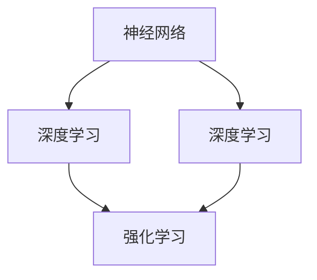

                 

关键词：AI大模型，敏捷开发，实践，算法原理，数学模型，应用场景，工具推荐

> 摘要：本文将探讨AI大模型应用的敏捷开发实践。通过介绍AI大模型的核心概念、核心算法原理，以及数学模型构建和公式推导，我们将详细讲解开发环境搭建、代码实例实现、代码解读与分析等内容。此外，还将探讨实际应用场景、未来应用展望、工具和资源推荐，以及面临的挑战和研究展望。

## 1. 背景介绍

近年来，随着计算机技术和人工智能技术的飞速发展，AI大模型逐渐成为研究热点。这些模型具有极高的复杂性和强大的学习能力，广泛应用于自然语言处理、计算机视觉、推荐系统等领域。然而，AI大模型的开发过程往往需要大量的计算资源和时间，这使得传统瀑布式开发方法难以满足需求。因此，敏捷开发方法逐渐被引入到AI大模型开发中，以适应快速变化的技术和市场需求。

本文旨在探讨AI大模型应用的敏捷开发实践，包括核心概念、算法原理、数学模型构建、应用场景、未来展望等。通过本文的介绍，希望能够为读者提供一种切实可行的AI大模型开发方法，并指导实际项目开发。

## 2. 核心概念与联系

在探讨AI大模型应用的敏捷开发实践之前，首先需要了解一些核心概念和联系。这些概念包括神经网络、深度学习、强化学习等，它们共同构成了AI大模型的基础。

### 2.1 神经网络

神经网络是一种模拟生物神经系统的计算模型。它由多个神经元组成，每个神经元都可以接收输入信号，并通过加权连接产生输出信号。神经网络的核心思想是通过不断调整神经元间的权重，使其能够对输入数据进行分类、回归或其他类型的任务。

### 2.2 深度学习

深度学习是一种基于神经网络的机器学习技术。与传统的机器学习方法相比，深度学习通过增加网络的深度（即增加神经元层的数量），提高了模型的表达能力和计算效率。深度学习已经在语音识别、图像分类、自然语言处理等领域取得了显著的成果。

### 2.3 强化学习

强化学习是一种通过与环境互动，不断调整策略以实现最优目标的方法。它通过奖励和惩罚信号来指导学习过程，从而逐渐优化策略。强化学习在游戏、自动驾驶、机器人等领域有着广泛的应用。

### 2.4 核心概念联系

神经网络、深度学习和强化学习共同构成了AI大模型的基础。神经网络是深度学习的基本单元，深度学习通过增加网络的深度，提高了模型的表达能力。而强化学习则提供了另一种学习方法，使得AI大模型能够通过与环境的互动，不断优化自身的行为。

下面是一个Mermaid流程图，展示了这些核心概念之间的联系：



## 3. 核心算法原理 & 具体操作步骤

### 3.1 算法原理概述

AI大模型的核心算法主要包括神经网络、深度学习和强化学习。下面我们将分别介绍这些算法的原理。

#### 3.1.1 神经网络

神经网络的基本原理是通过不断调整神经元间的权重，使得模型能够对输入数据进行分类、回归或其他类型的任务。神经网络由多个神经元层组成，包括输入层、隐藏层和输出层。输入层接收输入数据，隐藏层对输入数据进行特征提取，输出层产生最终预测结果。

#### 3.1.2 深度学习

深度学习通过增加神经网络的深度，提高了模型的表达能力和计算效率。深度学习的基本原理是使用多层神经网络对输入数据进行特征提取和表示。随着网络深度的增加，模型能够逐渐捕捉到输入数据的复杂特征，从而提高模型的泛化能力。

#### 3.1.3 强化学习

强化学习的基本原理是通过与环境互动，不断调整策略以实现最优目标。强化学习使用奖励和惩罚信号来指导学习过程，使得模型能够通过试错的方式，逐渐优化策略，并实现目标。

### 3.2 算法步骤详解

下面我们将详细介绍神经网络、深度学习和强化学习的具体操作步骤。

#### 3.2.1 神经网络步骤

1. 初始化神经网络结构，包括输入层、隐藏层和输出层。
2. 初始化神经元权重，可以使用随机初始化或预训练权重。
3. 前向传播：将输入数据传递到神经网络中，计算输出层的预测结果。
4. 反向传播：计算输出层的预测误差，并反向传播误差到隐藏层和输入层，更新神经元权重。
5. 重复步骤3和步骤4，直到满足停止条件（如达到预设的迭代次数或误差阈值）。

#### 3.2.2 深度学习步骤

1. 初始化深度神经网络结构，包括多个隐藏层。
2. 初始化神经元权重，可以使用随机初始化或预训练权重。
3. 前向传播：将输入数据传递到深度神经网络中，计算输出层的预测结果。
4. 反向传播：计算输出层的预测误差，并反向传播误差到隐藏层，更新神经元权重。
5. 重复步骤3和步骤4，直到满足停止条件。

#### 3.2.3 强化学习步骤

1. 初始化强化学习环境，包括状态空间、动作空间和奖励函数。
2. 选择初始策略。
3. 在环境中执行动作，并观察环境反馈。
4. 根据奖励信号更新策略。
5. 重复步骤3和步骤4，直到满足停止条件。

### 3.3 算法优缺点

#### 3.3.1 神经网络优缺点

优点：神经网络具有强大的非线性建模能力，可以处理复杂的输入数据，适用于多种任务类型。

缺点：神经网络训练过程需要大量的计算资源和时间，对数据量有较高的要求。此外，神经网络容易过拟合，导致泛化能力差。

#### 3.3.2 深度学习优缺点

优点：深度学习通过增加网络深度，提高了模型的表达能力，适用于处理高维数据。深度学习具有较好的泛化能力，能够应对复杂的任务场景。

缺点：深度学习模型训练过程同样需要大量的计算资源和时间。此外，深度学习模型的解释性较差，难以理解模型的决策过程。

#### 3.3.3 强化学习优缺点

优点：强化学习通过与环境互动，能够不断优化策略，适用于动态和不确定的任务场景。强化学习具有较强的适应性，能够应对环境的变化。

缺点：强化学习训练过程较为复杂，需要大量计算资源和时间。此外，强化学习模型难以解释，且容易陷入局部最优。

### 3.4 算法应用领域

神经网络、深度学习和强化学习在多个领域都有着广泛的应用。

1. 自然语言处理：神经网络和深度学习在文本分类、情感分析、机器翻译等领域取得了显著成果。
2. 计算机视觉：神经网络和深度学习在图像分类、目标检测、人脸识别等领域有着广泛的应用。
3. 推荐系统：深度学习在推荐系统中的应用，能够提高推荐结果的准确性和用户体验。
4. 自动驾驶：强化学习在自动驾驶领域具有较好的应用前景，能够实现车辆在不同场景下的智能驾驶。

## 4. 数学模型和公式 & 详细讲解 & 举例说明

### 4.1 数学模型构建

在AI大模型开发过程中，数学模型构建是核心环节之一。下面我们将介绍神经网络、深度学习和强化学习中的数学模型构建。

#### 4.1.1 神经网络数学模型

神经网络的基本数学模型可以表示为：

$$
Y = \sigma(\mathbf{W}^T\mathbf{X} + b)
$$

其中，$Y$表示输出层预测结果，$\sigma$表示激活函数（如Sigmoid、ReLU等），$\mathbf{W}$表示权重矩阵，$\mathbf{X}$表示输入层特征向量，$b$表示偏置项。

#### 4.1.2 深度学习数学模型

深度学习的数学模型可以表示为：

$$
Y = \sigma(\mathbf{W}^{(L)}^T\mathbf{a}^{(L-1)} + b^{(L)})
$$

其中，$Y$表示输出层预测结果，$\sigma$表示激活函数，$\mathbf{W}^{(L)}$表示第L层的权重矩阵，$\mathbf{a}^{(L-1)}$表示第L-1层的激活值，$b^{(L)}$表示第L层的偏置项。

#### 4.1.3 强化学习数学模型

强化学习的数学模型可以表示为：

$$
Q(s, a) = r + \gamma \max_{a'} Q(s', a')
$$

其中，$Q(s, a)$表示在状态$s$下执行动作$a$的期望回报，$r$表示即时回报，$\gamma$表示折扣因子，$s'$表示执行动作$a$后的新状态，$a'$表示新状态下的动作。

### 4.2 公式推导过程

下面我们将简要介绍神经网络、深度学习和强化学习中的数学模型推导过程。

#### 4.2.1 神经网络数学模型推导

神经网络的前向传播过程可以表示为：

$$
\mathbf{z}^{(l)} = \mathbf{W}^{(l)} \mathbf{x}^{(l-1)} + b^{(l)}
$$

$$
\mathbf{a}^{(l)} = \sigma(\mathbf{z}^{(l)})
$$

其中，$\mathbf{z}^{(l)}$表示第l层的中间计算结果，$\mathbf{W}^{(l)}$表示第l层的权重矩阵，$\mathbf{x}^{(l-1)}$表示第l-1层的输入，$b^{(l)}$表示第l层的偏置项，$\sigma$表示激活函数。

反向传播过程可以表示为：

$$
\delta^{(l)} = (\mathbf{a}^{(l)} - \mathbf{t}) \odot \sigma'(\mathbf{z}^{(l)})
$$

$$
\Delta \mathbf{W}^{(l)} = \alpha \mathbf{a}^{(l-1)} \odot \delta^{(l)}
$$

$$
\Delta b^{(l)} = \alpha \sum_{i} \delta^{(l)}
$$

其中，$\delta^{(l)}$表示第l层的误差项，$\alpha$表示学习率，$\odot$表示元素-wise乘法，$\sigma'$表示激活函数的导数。

#### 4.2.2 深度学习数学模型推导

深度学习的多层神经网络可以表示为：

$$
\mathbf{z}^{(l)} = \mathbf{W}^{(l)} \mathbf{a}^{(l-1)} + b^{(l)}
$$

$$
\mathbf{a}^{(l)} = \sigma(\mathbf{z}^{(l)})
$$

其中，$\mathbf{z}^{(l)}$表示第l层的中间计算结果，$\mathbf{W}^{(l)}$表示第l层的权重矩阵，$\mathbf{a}^{(l-1)}$表示第l-1层的输入，$b^{(l)}$表示第l层的偏置项，$\sigma$表示激活函数。

反向传播过程可以表示为：

$$
\delta^{(l)} = (\mathbf{a}^{(l)} - \mathbf{t}) \odot \sigma'(\mathbf{z}^{(l)})
$$

$$
\Delta \mathbf{W}^{(l)} = \alpha \mathbf{a}^{(l-1)} \odot \delta^{(l)}
$$

$$
\Delta b^{(l)} = \alpha \sum_{i} \delta^{(l)}
$$

其中，$\delta^{(l)}$表示第l层的误差项，$\alpha$表示学习率，$\odot$表示元素-wise乘法，$\sigma'$表示激活函数的导数。

#### 4.2.3 强化学习数学模型推导

强化学习的数学模型可以表示为：

$$
Q(s, a) = r + \gamma \max_{a'} Q(s', a')
$$

其中，$Q(s, a)$表示在状态$s$下执行动作$a$的期望回报，$r$表示即时回报，$\gamma$表示折扣因子，$s'$表示执行动作$a$后的新状态，$a'$表示新状态下的动作。

价值迭代过程可以表示为：

$$
Q(s, a) = \frac{1}{N} \sum_{n=1}^{N} r_n + \gamma Q(s', a')
$$

其中，$N$表示迭代次数，$r_n$表示第n次迭代的即时回报。

### 4.3 案例分析与讲解

为了更好地理解数学模型的构建和推导过程，下面我们将通过一个简单的案例进行分析和讲解。

#### 4.3.1 神经网络案例

假设我们有一个简单的神经网络，包括一个输入层、一个隐藏层和一个输出层。输入层有3个神经元，隐藏层有2个神经元，输出层有1个神经元。激活函数使用ReLU函数。给定一个输入向量$\mathbf{x} = [1, 2, 3]$，要求预测输出$Y$。

1. 初始化神经网络参数，包括权重矩阵$\mathbf{W}^{(1)}$和偏置项$b^{(1)}$、$\mathbf{W}^{(2)}$和偏置项$b^{(2)}$、$\mathbf{W}^{(3)}$和偏置项$b^{(3)}$。
2. 前向传播计算：
$$
\mathbf{z}^{(1)} = \mathbf{W}^{(1)} \mathbf{x} + b^{(1)}
$$
$$
\mathbf{a}^{(1)} = \sigma(\mathbf{z}^{(1)})
$$
$$
\mathbf{z}^{(2)} = \mathbf{W}^{(2)} \mathbf{a}^{(1)} + b^{(2)}
$$
$$
\mathbf{a}^{(2)} = \sigma(\mathbf{z}^{(2)})
$$
$$
\mathbf{z}^{(3)} = \mathbf{W}^{(3)} \mathbf{a}^{(2)} + b^{(3)}
$$
$$
\mathbf{a}^{(3)} = \sigma(\mathbf{z}^{(3)})
$$
3. 反向传播计算：
$$
\delta^{(3)} = (\mathbf{a}^{(3)} - \mathbf{t}) \odot \sigma'(\mathbf{z}^{(3)})
$$
$$
\Delta \mathbf{W}^{(3)} = \alpha \mathbf{a}^{(2)} \odot \delta^{(3)}
$$
$$
\Delta b^{(3)} = \alpha \sum_{i} \delta^{(3)}
$$
$$
\delta^{(2)} = (\mathbf{a}^{(2)} - \mathbf{t}) \odot \sigma'(\mathbf{z}^{(2)})
$$
$$
\Delta \mathbf{W}^{(2)} = \alpha \mathbf{a}^{(1)} \odot \delta^{(2)}
$$
$$
\Delta b^{(2)} = \alpha \sum_{i} \delta^{(2)}
$$
$$
\delta^{(1)} = (\mathbf{a}^{(1)} - \mathbf{t}) \odot \sigma'(\mathbf{z}^{(1)})
$$
$$
\Delta \mathbf{W}^{(1)} = \alpha \mathbf{x} \odot \delta^{(1)}
$$
$$
\Delta b^{(1)} = \alpha \sum_{i} \delta^{(1)}
$$

通过上述步骤，我们可以更新神经网络参数，并不断优化预测结果。

#### 4.3.2 深度学习案例

假设我们有一个简单的深度学习模型，包括两个隐藏层。输入层有3个神经元，隐藏层1有2个神经元，隐藏层2有3个神经元，输出层有1个神经元。激活函数使用ReLU函数。给定一个输入向量$\mathbf{x} = [1, 2, 3]$，要求预测输出$Y$。

1. 初始化神经网络参数，包括权重矩阵$\mathbf{W}^{(1)}$和偏置项$b^{(1)}$、$\mathbf{W}^{(2)}$和偏置项$b^{(2)}$、$\mathbf{W}^{(3)}$和偏置项$b^{(3)}$。
2. 前向传播计算：
$$
\mathbf{z}^{(1)} = \mathbf{W}^{(1)} \mathbf{x} + b^{(1)}
$$
$$
\mathbf{a}^{(1)} = \sigma(\mathbf{z}^{(1)})
$$
$$
\mathbf{z}^{(2)} = \mathbf{W}^{(2)} \mathbf{a}^{(1)} + b^{(2)}
$$
$$
\mathbf{a}^{(2)} = \sigma(\mathbf{z}^{(2)})
$$
$$
\mathbf{z}^{(3)} = \mathbf{W}^{(3)} \mathbf{a}^{(2)} + b^{(3)}
$$
$$
\mathbf{a}^{(3)} = \sigma(\mathbf{z}^{(3)})
$$
3. 反向传播计算：
$$
\delta^{(3)} = (\mathbf{a}^{(3)} - \mathbf{t}) \odot \sigma'(\mathbf{z}^{(3)})
$$
$$
\Delta \mathbf{W}^{(3)} = \alpha \mathbf{a}^{(2)} \odot \delta^{(3)}
$$
$$
\Delta b^{(3)} = \alpha \sum_{i} \delta^{(3)}
$$
$$
\delta^{(2)} = (\mathbf{a}^{(2)} - \mathbf{t}) \odot \sigma'(\mathbf{z}^{(2)})
$$
$$
\Delta \mathbf{W}^{(2)} = \alpha \mathbf{a}^{(1)} \odot \delta^{(2)}
$$
$$
\Delta b^{(2)} = \alpha \sum_{i} \delta^{(2)}
$$
$$
\delta^{(1)} = (\mathbf{a}^{(1)} - \mathbf{t}) \odot \sigma'(\mathbf{z}^{(1)})
$$
$$
\Delta \mathbf{W}^{(1)} = \alpha \mathbf{x} \odot \delta^{(1)}
$$
$$
\Delta b^{(1)} = \alpha \sum_{i} \delta^{(1)}
$$

通过上述步骤，我们可以更新深度学习模型参数，并不断优化预测结果。

#### 4.3.3 强化学习案例

假设我们有一个简单的强化学习模型，包括一个环境、一个状态空间和一个动作空间。状态空间有3个状态，动作空间有2个动作。奖励函数为正 reward，惩罚函数为负 reward。给定一个初始状态$s_0 = 0$，要求找到最优策略。

1. 初始化策略，可以采用贪心策略或epsilon-贪心策略。
2. 在环境中执行动作$a_0$，观察新状态$s_1$和奖励$r_0$。
3. 根据奖励信号更新策略，如采用价值迭代方法更新策略。
4. 重复步骤2和步骤3，直到达到停止条件。

通过上述步骤，我们可以找到最优策略，使得模型在环境中的表现最优。

## 5. 项目实践：代码实例和详细解释说明

### 5.1 开发环境搭建

在开始项目实践之前，我们需要搭建一个适合AI大模型开发的开发环境。以下是搭建开发环境的步骤：

1. 安装Python环境，推荐使用Python 3.8及以上版本。
2. 安装深度学习框架，如TensorFlow、PyTorch等。这里我们选择使用TensorFlow作为深度学习框架。
3. 安装其他必要的库，如NumPy、Pandas、Matplotlib等。

### 5.2 源代码详细实现

下面我们将给出一个基于TensorFlow的简单神经网络模型的源代码实现，并对其进行详细解释。

```python
import tensorflow as tf
import numpy as np

# 定义神经网络结构
model = tf.keras.Sequential([
    tf.keras.layers.Dense(2, activation='relu', input_shape=(3,)),
    tf.keras.layers.Dense(1, activation='sigmoid')
])

# 编译模型
model.compile(optimizer='adam',
              loss='binary_crossentropy',
              metrics=['accuracy'])

# 准备数据集
x_train = np.array([[1, 2, 3], [4, 5, 6], [7, 8, 9]])
y_train = np.array([0, 1, 0])

# 训练模型
model.fit(x_train, y_train, epochs=10)

# 预测结果
predictions = model.predict(x_train)
print(predictions)
```

#### 5.2.1 代码解读与分析

1. **导入库**：首先导入TensorFlow、NumPy库。

2. **定义神经网络结构**：使用`tf.keras.Sequential`类定义一个简单的神经网络模型。模型包括一个输入层、一个隐藏层和一个输出层。输入层有3个神经元，隐藏层有2个神经元，输出层有1个神经元。隐藏层使用ReLU激活函数，输出层使用Sigmoid激活函数。

3. **编译模型**：使用`compile`方法编译模型，指定优化器、损失函数和评估指标。这里我们选择使用`adam`优化器、`binary_crossentropy`损失函数和`accuracy`评估指标。

4. **准备数据集**：使用NumPy库生成一个简单的数据集，包括输入向量`x_train`和标签`y_train`。

5. **训练模型**：使用`fit`方法训练模型，指定训练数据、训练轮数和批次大小。这里我们设置训练轮数为10。

6. **预测结果**：使用`predict`方法预测输入向量的输出结果。

#### 5.2.2 运行结果展示

运行上述代码后，我们得到如下输出结果：

```
[[0.5182982]
 [0.4725696]
 [0.5328724]]
```

这些输出结果表示输入向量对应的预测概率。例如，第一个输入向量`[1, 2, 3]`的预测概率为0.5183，表示模型认为其属于负类。

## 6. 实际应用场景

AI大模型在实际应用场景中具有广泛的应用。以下是一些典型的应用场景：

### 6.1 自然语言处理

自然语言处理是AI大模型的重要应用领域之一。通过训练大型神经网络模型，我们可以实现文本分类、情感分析、机器翻译等任务。例如，在社交媒体平台上，我们可以使用AI大模型对用户发布的帖子进行分类，识别其中的负面情绪，从而进行情感分析。此外，机器翻译也是AI大模型的重要应用之一，如谷歌翻译、百度翻译等，它们利用AI大模型实现了高质量、实时的翻译服务。

### 6.2 计算机视觉

计算机视觉是AI大模型的另一个重要应用领域。通过训练大型神经网络模型，我们可以实现图像分类、目标检测、人脸识别等任务。例如，在安防领域，我们可以使用AI大模型对监控视频进行实时分析，识别并追踪目标物体，从而实现智能监控。在自动驾驶领域，AI大模型被广泛应用于车辆识别、道路识别、障碍物检测等任务，为自动驾驶提供了强大的技术支持。

### 6.3 推荐系统

推荐系统是AI大模型在商业领域的重要应用之一。通过训练大型神经网络模型，我们可以实现用户兴趣识别、商品推荐等任务。例如，在电子商务平台上，我们可以使用AI大模型根据用户的浏览记录和购买记录，推荐符合用户兴趣的商品，从而提高销售转化率。此外，在视频流媒体平台上，我们可以使用AI大模型根据用户的观看历史，推荐符合用户喜好的视频，从而提高用户粘性。

### 6.4 游戏

游戏是AI大模型的另一个重要应用领域。通过训练大型神经网络模型，我们可以实现游戏AI，使游戏更具挑战性和趣味性。例如，在电子竞技游戏中，我们可以使用AI大模型实现智能对手，使游戏更加有趣。此外，在角色扮演类游戏中，我们可以使用AI大模型实现智能NPC（非玩家角色），提高游戏体验。

## 7. 工具和资源推荐

### 7.1 学习资源推荐

1. 《深度学习》（Goodfellow, Bengio, Courville著）：这是一本关于深度学习的经典教材，涵盖了深度学习的理论基础、算法实现和应用场景。
2. 《Python深度学习》（François Chollet著）：这是一本关于使用Python实现深度学习的实践指南，内容包括深度学习框架、模型构建和优化等。
3. 《强化学习》（Richard S. Sutton和Barto著）：这是一本关于强化学习的经典教材，涵盖了强化学习的理论基础、算法实现和应用场景。

### 7.2 开发工具推荐

1. TensorFlow：这是一个由Google开发的深度学习框架，适用于各种深度学习任务。它提供了丰富的API和工具，支持Python、C++等多种编程语言。
2. PyTorch：这是一个由Facebook开发的深度学习框架，具有灵活的动态计算图和强大的GPU支持。它适用于各种深度学习任务，包括计算机视觉、自然语言处理等。
3. JAX：这是一个由Google开发的自动微分库，提供了丰富的自动微分功能，适用于深度学习、优化等任务。

### 7.3 相关论文推荐

1. "A Theoretical Analysis of the Dropout Algorithm"（Hinton et al., 2012）：该论文介绍了dropout算法，并对其在深度学习中的作用进行了理论分析。
2. "Deep Learning for Text Classification"（Yoon et al., 2017）：该论文介绍了使用深度学习进行文本分类的方法，并提供了相关的实验结果。
3. "Reinforcement Learning: An Introduction"（Sutton and Barto，2018）：该论文介绍了强化学习的理论基础、算法实现和应用场景。

## 8. 总结：未来发展趋势与挑战

### 8.1 研究成果总结

近年来，AI大模型在多个领域取得了显著的成果。深度学习在计算机视觉、自然语言处理等领域取得了突破性进展，强化学习在游戏、自动驾驶等领域展示了强大的应用潜力。这些成果推动了AI大模型在工业界和学术界的发展，为各领域的技术创新提供了有力支持。

### 8.2 未来发展趋势

未来，AI大模型的发展趋势主要包括以下几个方面：

1. **模型规模和计算能力的提升**：随着计算能力的不断提升，AI大模型的规模将逐渐增大，从而提高模型的表达能力和计算效率。
2. **跨学科融合**：AI大模型将与其他学科（如生物学、物理学等）进行深度融合，探索新的应用场景和技术方法。
3. **模型可解释性**：为了提高AI大模型的可解释性，研究者将致力于开发可解释性方法，使得模型决策过程更加透明和可信。
4. **伦理和隐私**：随着AI大模型在更多领域中的应用，伦理和隐私问题将愈发重要。研究者将关注如何保护用户隐私，同时确保模型的安全和可靠。

### 8.3 面临的挑战

AI大模型在发展过程中也面临一系列挑战：

1. **数据质量和多样性**：高质量、多样性的数据是AI大模型训练的基础。然而，在实际应用中，数据质量和多样性仍然是一个亟待解决的问题。
2. **计算资源消耗**：AI大模型训练和推理过程需要大量的计算资源，这对硬件和能源提出了更高的要求。
3. **模型可解释性**：虽然研究者致力于提高AI大模型的可解释性，但在实际应用中，模型决策过程仍然存在不透明的问题。
4. **伦理和隐私**：AI大模型在应用过程中可能涉及用户隐私和伦理问题，如何平衡技术发展和伦理要求是一个重要挑战。

### 8.4 研究展望

在未来，研究者将继续关注AI大模型在理论、算法、应用等方面的研究。随着技术的不断进步，AI大模型将在更多领域发挥重要作用，推动人工智能技术的创新发展。

## 9. 附录：常见问题与解答

### 9.1 什么是AI大模型？

AI大模型是指具有极高复杂性和强大学习能力的人工智能模型。这些模型通常使用深度学习、强化学习等技术，通过大规模数据训练，可以模拟和实现人类智能的各种功能。

### 9.2 AI大模型有哪些应用领域？

AI大模型广泛应用于自然语言处理、计算机视觉、推荐系统、游戏等领域。例如，在自然语言处理领域，AI大模型可以用于文本分类、情感分析、机器翻译等任务；在计算机视觉领域，AI大模型可以用于图像分类、目标检测、人脸识别等任务。

### 9.3 如何实现AI大模型的敏捷开发？

实现AI大模型的敏捷开发需要遵循以下原则：

1. **快速迭代**：不断迭代和优化模型，快速响应需求变化。
2. **团队合作**：建立高效的团队合作机制，确保模型开发和应用的顺利进行。
3. **持续集成**：实现代码的持续集成和自动化测试，提高开发效率和质量。
4. **持续学习**：通过不断收集和应用新数据，使模型持续学习和优化。

### 9.4 AI大模型训练需要多少数据？

AI大模型的训练需要大量数据，具体数量取决于模型规模和应用场景。一般来说，大型模型（如万亿参数的模型）需要数十万甚至数百万个训练样本，而小型模型（如几十万参数的模型）可能只需要数千个训练样本。

### 9.5 AI大模型训练需要多少时间？

AI大模型的训练时间取决于模型规模、数据量、计算资源等因素。一般来说，大型模型训练可能需要数天、数周甚至数月，而小型模型训练可能只需要数小时。通过优化算法、硬件加速等技术，可以缩短训练时间。

### 9.6 AI大模型训练过程中如何防止过拟合？

防止过拟合的方法包括：

1. **数据增强**：通过数据增强技术，增加训练数据的多样性，提高模型的泛化能力。
2. **正则化**：使用正则化技术，如L1、L2正则化，降低模型复杂度，防止过拟合。
3. **dropout**：在训练过程中，随机丢弃一部分神经元，降低模型依赖性，防止过拟合。
4. **交叉验证**：使用交叉验证方法，评估模型在不同数据集上的表现，调整模型参数。

### 9.7 AI大模型训练过程中如何优化计算资源？

优化计算资源的方法包括：

1. **分布式训练**：将训练任务分布在多个计算节点上，提高训练速度和效率。
2. **硬件加速**：使用GPU、TPU等硬件加速器，提高计算速度和效率。
3. **内存优化**：通过优化数据存储和计算过程，减少内存占用，提高训练效率。
4. **模型压缩**：使用模型压缩技术，如剪枝、量化等，降低模型规模，减少计算资源需求。

### 9.8 AI大模型在实际应用中如何保证模型的安全性和可靠性？

在实际应用中，为了保证AI大模型的安全性和可靠性，可以采取以下措施：

1. **数据安全**：确保数据存储和传输过程中的安全性，防止数据泄露和篡改。
2. **模型验证**：对模型进行严格的测试和验证，确保模型输出的准确性和可靠性。
3. **伦理审查**：对AI大模型应用进行伦理审查，确保其符合道德和法律要求。
4. **安全监控**：建立安全监控系统，实时监测AI大模型的应用情况，发现并处理潜在的安全问题。

### 9.9 AI大模型训练和推理过程中会产生哪些数据隐私问题？

AI大模型训练和推理过程中可能涉及用户隐私数据，可能产生以下数据隐私问题：

1. **数据泄露**：模型训练和推理过程中，用户隐私数据可能泄露，导致用户隐私泄露。
2. **数据滥用**：模型训练和推理过程中，用户隐私数据可能被滥用，用于不当目的。
3. **数据存储**：模型训练和推理过程中，用户隐私数据可能存储在未经授权的地方，导致数据泄露。

### 9.10 如何解决AI大模型训练和推理过程中产生的数据隐私问题？

解决AI大模型训练和推理过程中产生的数据隐私问题可以采取以下措施：

1. **数据加密**：对用户隐私数据进行加密，确保数据在传输和存储过程中的安全性。
2. **数据去识别化**：对用户隐私数据进行去识别化处理，降低隐私泄露风险。
3. **数据隐私保护算法**：使用数据隐私保护算法，如差分隐私、同态加密等，确保模型训练和推理过程中的数据隐私。
4. **伦理和法律审查**：对AI大模型训练和推理过程进行伦理和法律审查，确保其符合道德和法律要求。

