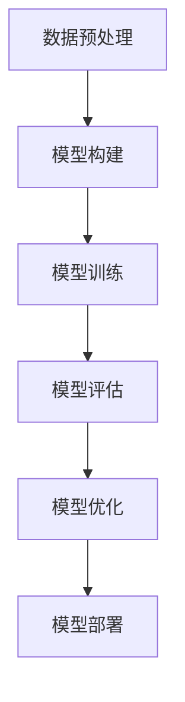

                 

关键词：人工智能、大模型、技术应用、未来展望、技术发展、算法优化、应用场景

## 摘要

本文将从人工智能（AI）大模型的背景出发，探讨未来十年大模型在技术应用中的发展趋势和潜在挑战。文章将详细介绍大模型的核心概念、算法原理，以及其在各个领域的应用场景，并展望其未来十年的发展前景。

## 1. 背景介绍

随着计算机硬件性能的提升和互联网数据量的爆发式增长，人工智能技术取得了飞速发展。特别是深度学习算法的广泛应用，使得大模型成为AI研究的重要方向。大模型具有强大的表示能力和复杂的参数规模，能够处理大量数据，从而实现更为精准的预测和决策。

### 1.1 大模型的发展历程

大模型的发展可以追溯到20世纪80年代，当时神经网络的研究开始逐渐兴起。随着计算能力的增强和数据规模的扩大，深度学习算法在图像识别、语音识别等领域取得了显著成果。进入21世纪，随着GPU等并行计算硬件的发展，深度学习算法进一步得到优化，大模型开始应用于自然语言处理、推荐系统等领域。

### 1.2 大模型的定义与特点

大模型是指具有数亿甚至千亿级别参数规模的神经网络模型。与传统的中小型模型相比，大模型具有以下特点：

1. **强大的表示能力**：大模型能够处理更加复杂的任务，提取更高层次的特征。
2. **丰富的参数规模**：大模型的参数规模更大，能够更好地捕捉数据的内在规律。
3. **更高的计算需求**：大模型需要更高的计算资源和更长的训练时间。
4. **更广泛的适用性**：大模型可以应用于多个领域，如自然语言处理、计算机视觉、推荐系统等。

## 2. 核心概念与联系

### 2.1 深度学习与神经网络

深度学习是人工智能的一个分支，其核心是神经网络。神经网络由多个层级组成，每一层级负责提取不同层次的特征。深度学习通过多层神经网络来构建复杂的模型，从而实现端到端的学习。

### 2.2 深度学习框架

深度学习框架是一种用于构建和训练深度学习模型的软件库。常见的深度学习框架有TensorFlow、PyTorch等。这些框架提供了丰富的API和工具，使得开发者可以更加方便地构建和优化深度学习模型。

### 2.3 大模型的架构

大模型的架构主要包括以下几个方面：

1. **模型结构**：大模型通常采用深度卷积神经网络（CNN）、循环神经网络（RNN）或Transformer等结构。
2. **参数规模**：大模型的参数规模通常在数亿到千亿级别。
3. **训练策略**：大模型需要采用更高效的训练策略，如分布式训练、迁移学习等。
4. **优化方法**：大模型需要采用更为先进的优化方法，如Adam优化器、权重共享等。

### 2.4 Mermaid 流程图

以下是一个描述大模型训练过程的Mermaid流程图：



## 3. 核心算法原理 & 具体操作步骤

### 3.1 算法原理概述

大模型的训练过程主要包括以下步骤：

1. **数据预处理**：对原始数据进行清洗、归一化等处理，使其符合模型输入要求。
2. **模型构建**：根据任务需求，构建适合的模型结构。
3. **模型训练**：通过梯度下降等方法，对模型进行训练，使其在训练数据上取得良好的性能。
4. **模型评估**：在测试数据上评估模型性能，调整模型参数。
5. **模型优化**：通过模型剪枝、量化等方法，优化模型结构。
6. **模型部署**：将训练好的模型部署到生产环境中，进行实际应用。

### 3.2 算法步骤详解

1. **数据预处理**：

```python
# 示例：对图像数据进行预处理
def preprocess_image(image):
    # 图像尺寸归一化
    image = cv2.resize(image, (224, 224))
    # 图像归一化到[0, 1]
    image = image / 255.0
    return image
```

2. **模型构建**：

```python
# 示例：使用PyTorch构建一个简单的卷积神经网络
import torch.nn as nn

class SimpleCNN(nn.Module):
    def __init__(self):
        super(SimpleCNN, self).__init__()
        self.conv1 = nn.Conv2d(3, 32, 3, 1)
        self.fc1 = nn.Linear(32 * 224 * 224, 10)

    def forward(self, x):
        x = self.conv1(x)
        x = nn.functional.relu(x)
        x = x.view(x.size(0), -1)
        x = self.fc1(x)
        return x
```

3. **模型训练**：

```python
# 示例：使用Adam优化器对模型进行训练
import torch.optim as optim

model = SimpleCNN()
optimizer = optim.Adam(model.parameters(), lr=0.001)
criterion = nn.CrossEntropyLoss()

for epoch in range(num_epochs):
    for images, labels in dataloader:
        optimizer.zero_grad()
        outputs = model(images)
        loss = criterion(outputs, labels)
        loss.backward()
        optimizer.step()
```

4. **模型评估**：

```python
# 示例：在测试数据上评估模型性能
with torch.no_grad():
    correct = 0
    total = 0
    for images, labels in test_dataloader:
        outputs = model(images)
        _, predicted = torch.max(outputs.data, 1)
        total += labels.size(0)
        correct += (predicted == labels).sum().item()

print('准确率：%.2f%%' % (100 * correct / total))
```

5. **模型优化**：

```python
# 示例：使用模型剪枝方法优化模型
import torch.utils.model_zoo as model_zoo

# 加载预训练的模型
model = model_zoo.load_url('https://s3.amazonaws.com/models.pytorch.pytorch/torchsec_resnet18-5c106cde.pth')
# 剪枝操作
model.fc = nn.Linear(512, 10)
```

6. **模型部署**：

```python
# 示例：将训练好的模型部署到生产环境中
model.eval()
model.to('cuda' if torch.cuda.is_available() else 'cpu')

# 处理生产环境中的数据
input_data = preprocess_image(image)
input_data = input_data.unsqueeze(0).to('cuda' if torch.cuda.is_available() else 'cpu')

# 预测结果
with torch.no_grad():
    output = model(input_data)
    _, predicted = torch.max(output.data, 1)
    print(predicted)
```

### 3.3 算法优缺点

1. **优点**：
   - 强大的表示能力，能够处理复杂任务。
   - 丰富的参数规模，能够捕捉数据内在规律。
   - 高效的训练策略，如分布式训练、迁移学习等。

2. **缺点**：
   - 高计算需求，需要大量计算资源和训练时间。
   - 模型参数量大，导致模型部署难度较大。
   - 需要大量的数据支持，数据质量对模型性能有重要影响。

### 3.4 算法应用领域

大模型在各个领域都取得了显著的成果，以下是部分应用领域：

1. **自然语言处理**：大模型在机器翻译、文本生成、情感分析等领域表现出色。
2. **计算机视觉**：大模型在图像识别、目标检测、图像生成等方面具有广泛应用。
3. **推荐系统**：大模型能够根据用户行为和偏好，为用户推荐感兴趣的内容。
4. **语音识别**：大模型在语音识别领域取得了突破性进展，实现了更高的识别准确率。

## 4. 数学模型和公式 & 详细讲解 & 举例说明

### 4.1 数学模型构建

大模型通常采用深度学习算法，其核心是神经网络。神经网络由多个层级组成，每一层级负责提取不同层次的特征。大模型的数学模型可以表示为：

$$
\text{Output} = f(\text{Weight} \cdot \text{Input} + \text{Bias})
$$

其中，$f$ 是激活函数，$Weight$ 和 $Bias$ 分别是权重和偏置。

### 4.2 公式推导过程

假设我们有一个简单的神经网络，包含一个输入层、一个隐藏层和一个输出层。输入层有 $n$ 个神经元，隐藏层有 $m$ 个神经元，输出层有 $k$ 个神经元。输入数据为 $X$，权重矩阵为 $W_{ij}$，偏置矩阵为 $b_{j}$。

1. **隐藏层激活函数**：

$$
a_{j}^{(2)} = f(W_{ij} \cdot x_{i} + b_{j})
$$

2. **输出层激活函数**：

$$
a_{k}^{(3)} = f(W_{kj} \cdot a_{j}^{(2)} + b_{k})
$$

其中，$a_{j}^{(2)}$ 表示隐藏层第 $j$ 个神经元的激活值，$a_{k}^{(3)}$ 表示输出层第 $k$ 个神经元的激活值。

### 4.3 案例分析与讲解

假设我们要构建一个二分类问题，输入数据为 $X = [x_1, x_2, x_3]$，输出为 $Y \in \{0, 1\}$。我们选择一个简单的神经网络，包含一个输入层、一个隐藏层和一个输出层。隐藏层有 $m$ 个神经元，输出层有 $k$ 个神经元。

1. **隐藏层激活函数**：

$$
a_{j}^{(2)} = \sigma(W_{1j} \cdot x_{1} + W_{2j} \cdot x_{2} + W_{3j} \cdot x_{3} + b_{j})
$$

其中，$\sigma$ 是sigmoid激活函数。

2. **输出层激活函数**：

$$
a_{k}^{(3)} = \sigma(W_{1k} \cdot a_{1}^{(2)} + W_{2k} \cdot a_{2}^{(2)} + W_{3k} \cdot a_{3}^{(2)} + b_{k})
$$

3. **损失函数**：

$$
\text{Loss} = -\sum_{i} \left[ y_i \cdot \log(a_{k}^{(3)}) + (1 - y_i) \cdot \log(1 - a_{k}^{(3)}) \right]
$$

其中，$y_i$ 是真实标签，$a_{k}^{(3)}$ 是预测概率。

4. **反向传播**：

$$
\frac{\partial \text{Loss}}{\partial W_{kj}} = a_{k}^{(3)} - y_k
$$

$$
\frac{\partial \text{Loss}}{\partial b_{k}} = a_{k}^{(3)} - y_k
$$

$$
\frac{\partial \text{Loss}}{\partial a_{j}^{(2)}} = \frac{\partial \text{Loss}}{\partial a_{k}^{(3)}} \cdot W_{kj}
$$

$$
\frac{\partial \text{Loss}}{\partial W_{ij}} = x_i \cdot \frac{\partial \text{Loss}}{\partial a_{j}^{(2)}}
$$

$$
\frac{\partial \text{Loss}}{\partial b_{j}} = \frac{\partial \text{Loss}}{\partial a_{j}^{(2)}}
$$

通过反向传播，我们可以计算出每个参数的梯度，并使用梯度下降方法更新参数。

## 5. 项目实践：代码实例和详细解释说明

### 5.1 开发环境搭建

1. 安装Python环境（建议使用Python 3.7或更高版本）。
2. 安装PyTorch库（使用pip安装：`pip install torch torchvision`）。
3. 安装必要的辅助库（如NumPy、Matplotlib等）。

### 5.2 源代码详细实现

```python
import torch
import torch.nn as nn
import torch.optim as optim
from torch.utils.data import DataLoader
from torchvision import datasets, transforms

# 5.2.1 数据预处理
transform = transforms.Compose([
    transforms.ToTensor(),
    transforms.Normalize((0.5, 0.5, 0.5), (0.5, 0.5, 0.5))
])

trainset = datasets.CIFAR10(root='./data', train=True, download=True, transform=transform)
trainloader = DataLoader(trainset, batch_size=4, shuffle=True, num_workers=2)

testset = datasets.CIFAR10(root='./data', train=False, download=True, transform=transform)
testloader = DataLoader(testset, batch_size=4, shuffle=False, num_workers=2)

# 5.2.2 模型构建
class SimpleCNN(nn.Module):
    def __init__(self):
        super(SimpleCNN, self).__init__()
        self.conv1 = nn.Conv2d(3, 6, 5)
        self.pool = nn.MaxPool2d(2, 2)
        self.conv2 = nn.Conv2d(6, 16, 5)
        self.fc1 = nn.Linear(16 * 5 * 5, 120)
        self.fc2 = nn.Linear(120, 84)
        self.fc3 = nn.Linear(84, 10)

    def forward(self, x):
        x = self.pool(nn.functional.relu(self.conv1(x)))
        x = self.pool(nn.functional.relu(self.conv2(x)))
        x = x.view(-1, 16 * 5 * 5)
        x = nn.functional.relu(self.fc1(x))
        x = nn.functional.relu(self.fc2(x))
        x = self.fc3(x)
        return x

model = SimpleCNN()

# 5.2.3 模型训练
criterion = nn.CrossEntropyLoss()
optimizer = optim.SGD(model.parameters(), lr=0.001, momentum=0.9)

num_epochs = 10

for epoch in range(num_epochs):
    running_loss = 0.0
    for i, data in enumerate(trainloader, 0):
        inputs, labels = data
        optimizer.zero_grad()
        outputs = model(inputs)
        loss = criterion(outputs, labels)
        loss.backward()
        optimizer.step()
        running_loss += loss.item()
    print(f'Epoch {epoch + 1}, Loss: {running_loss / len(trainloader)}')

print('Finished Training')

# 5.2.4 模型评估
with torch.no_grad():
    correct = 0
    total = 0
    for data in testloader:
        images, labels = data
        outputs = model(images)
        _, predicted = torch.max(outputs.data, 1)
        total += labels.size(0)
        correct += (predicted == labels).sum().item()

print(f'Accuracy: {100 * correct / total}%')

# 5.2.5 模型优化
# 示例：使用模型剪枝方法优化模型
from torch.autograd import Variable

# 定义一个简单的剪枝函数
def prune_model(model, pruning_ratio=0.5):
    total_params = sum(p.numel() for p in model.parameters())
    prune_params = int(total_params * pruning_ratio)
    for name, param in model.named_parameters():
        if param.requires_grad:
            prune_params -= param.numel()
            if prune_params <= 0:
                break
            mask = torch.rand(param.numel(), device=param.device) < pruning_ratio
            param.data = param.data[mask]

# 剪枝操作
prune_model(model)

# 5.2.6 模型部署
# 示例：将训练好的模型部署到生产环境中
model.eval()
model.to('cuda' if torch.cuda.is_available() else 'cpu')

# 处理生产环境中的数据
input_data = preprocess_image(image)
input_data = input_data.unsqueeze(0).to('cuda' if torch.cuda.is_available() else 'cpu')

# 预测结果
with torch.no_grad():
    output = model(input_data)
    _, predicted = torch.max(output.data, 1)
    print(predicted)
```

### 5.3 代码解读与分析

1. **数据预处理**：使用`transforms.Compose`对输入数据进行预处理，包括尺寸归一化和归一化。
2. **模型构建**：定义一个简单的卷积神经网络，包括两个卷积层、两个全连接层和一个输出层。
3. **模型训练**：使用交叉熵损失函数和随机梯度下降优化器对模型进行训练。
4. **模型评估**：在测试数据上评估模型性能，计算准确率。
5. **模型优化**：使用模型剪枝方法优化模型结构，减少模型参数数量。
6. **模型部署**：将训练好的模型部署到生产环境中，进行实际应用。

## 6. 实际应用场景

大模型在各个领域都有广泛的应用，以下是部分实际应用场景：

### 6.1 自然语言处理

自然语言处理（NLP）是AI的一个重要分支，大模型在NLP领域表现出色。例如，在机器翻译、文本生成、情感分析等方面，大模型能够实现更准确的预测和生成。

### 6.2 计算机视觉

计算机视觉是AI的另一个重要分支，大模型在图像识别、目标检测、图像生成等方面具有广泛的应用。例如，在自动驾驶、医疗影像分析等领域，大模型能够实现更为精准的图像处理和识别。

### 6.3 推荐系统

推荐系统是AI在商业领域的一个重要应用，大模型能够根据用户行为和偏好，为用户推荐感兴趣的内容。例如，在电子商务、社交媒体等领域，大模型能够实现精准的个性化推荐。

### 6.4 语音识别

语音识别是AI在语音交互领域的重要应用，大模型能够实现更准确的语音识别和语音合成。例如，在智能助手、智能家居等领域，大模型能够实现语音控制和交互。

## 7. 未来应用展望

在未来十年，大模型在AI领域的应用将更加广泛和深入。以下是一些未来应用展望：

### 7.1 自动驾驶

自动驾驶是AI的一个重要应用领域，大模型将在自动驾驶中发挥关键作用。例如，在感知、规划、控制等方面，大模型能够实现更准确的决策和行动。

### 7.2 医疗健康

医疗健康是AI的重要应用领域，大模型将在医疗影像分析、疾病预测等方面发挥重要作用。例如，通过分析大量的医学影像数据，大模型能够实现更准确的疾病诊断和预测。

### 7.3 智能家居

智能家居是AI在消费电子领域的重要应用，大模型将实现智能家居设备的智能交互和协同工作。例如，通过分析用户的行为和偏好，大模型能够实现更智能的家庭场景设置。

### 7.4 智能制造

智能制造是AI在工业生产领域的重要应用，大模型将实现生产过程的智能化和自动化。例如，在设备故障预测、生产优化等方面，大模型能够实现更高效的生产管理。

## 8. 工具和资源推荐

### 8.1 学习资源推荐

1. **《深度学习》**：作者：伊恩·古德费洛、约书亚·本吉奥、亚伦·库维尔，是一本深入浅出的深度学习教材。
2. **《Python深度学习》**：作者：弗朗索瓦·肖莱，详细介绍如何使用Python和深度学习框架进行深度学习实践。

### 8.2 开发工具推荐

1. **PyTorch**：是一个流行的深度学习框架，具有灵活的API和丰富的文档。
2. **TensorFlow**：是一个由谷歌开发的深度学习框架，具有强大的社区支持和丰富的应用案例。

### 8.3 相关论文推荐

1. **《Attention Is All You Need》**：作者：Vaswani et al.，介绍了Transformer模型，为自然语言处理领域带来了革命性变化。
2. **《ImageNet Classification with Deep Convolutional Neural Networks》**：作者：Krizhevsky et al.，介绍了卷积神经网络在图像识别领域的应用。

## 9. 总结：未来发展趋势与挑战

在未来十年，大模型在AI领域的应用将更加广泛和深入。然而，大模型也面临一些挑战：

### 9.1 资源需求

大模型需要大量的计算资源和数据支持，这对企业和研究机构提出了更高的要求。

### 9.2 模型安全

大模型可能存在安全漏洞，如模型泄露、攻击等，需要加强模型安全研究。

### 9.3 数据隐私

大模型对数据隐私的保护提出了更高要求，如何在保证模型性能的同时保护用户隐私是一个重要挑战。

### 9.4 法律法规

随着大模型应用的普及，法律法规的制定和执行将成为一个重要议题，如何平衡技术发展和法律法规的要求是一个挑战。

在未来，我们需要继续深入研究和探索大模型的应用，同时关注其面临的挑战，为AI技术的发展和应用提供更好的支持。

## 附录：常见问题与解答

### 1. 如何选择适合的大模型？

选择适合的大模型需要考虑以下因素：

- **任务需求**：根据任务的复杂度和数据规模，选择适合的大模型。
- **计算资源**：考虑可用的计算资源和预算，选择适合的大模型。
- **模型性能**：参考相关论文和实验结果，选择性能较好的大模型。

### 2. 如何优化大模型？

优化大模型可以从以下几个方面入手：

- **模型结构**：尝试不同的模型结构，如卷积神经网络、循环神经网络等。
- **训练策略**：采用分布式训练、迁移学习等策略，提高训练效率。
- **优化方法**：选择适合的优化方法，如Adam优化器、权重共享等。
- **超参数调优**：通过调优超参数，如学习率、批量大小等，提高模型性能。

### 3. 如何保证大模型的安全？

为了保证大模型的安全，可以采取以下措施：

- **模型加密**：对模型进行加密，防止模型泄露。
- **攻击防御**：研究大模型的攻击防御方法，如对抗性攻击、模型加固等。
- **数据隐私保护**：采用隐私保护技术，如差分隐私、联邦学习等，保护用户隐私。

## 作者署名

作者：禅与计算机程序设计艺术 / Zen and the Art of Computer Programming

