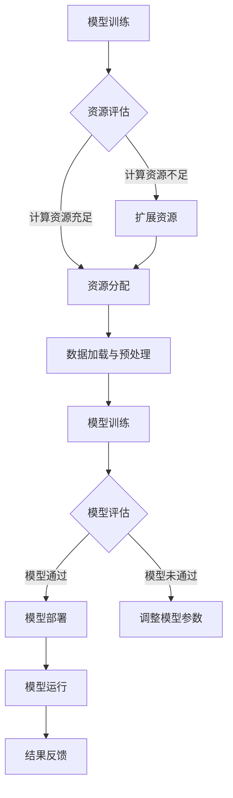

                 

关键词：AI大模型、混合云、部署实践、架构设计、性能优化、安全性

> 摘要：本文深入探讨了AI大模型在混合云环境下的部署实践，从核心概念、算法原理、数学模型到实际应用场景，全面剖析了如何利用混合云实现AI大模型的快速部署和高效运行。通过详尽的案例分析、代码实例和未来展望，为AI大模型应用提供了一条切实可行的路径。

## 1. 背景介绍

随着人工智能技术的飞速发展，AI大模型如BERT、GPT等逐渐成为各行各业的热门工具。这些模型具有强大的数据处理和分析能力，能够解决复杂问题，但同时也带来了计算资源的高需求。传统的单机部署方式已无法满足这些大型模型的运算需求，因此，混合云架构逐渐成为了AI大模型部署的优选方案。

混合云部署具有灵活性、可扩展性和高可用性的特点，能够充分利用公有云和私有云的优势，为AI大模型提供充足的计算资源和高效的数据处理能力。同时，混合云部署还可以根据业务需求动态调整资源分配，优化成本和性能。

本文将围绕AI大模型在混合云环境下的部署实践展开，旨在为读者提供一套完整的部署方案，涵盖架构设计、性能优化、安全性等多个方面。

## 2. 核心概念与联系

### 2.1 AI大模型

AI大模型是指那些具有数十亿甚至千亿参数的深度学习模型。这些模型能够处理海量数据，提取复杂特征，实现高精度的预测和决策。典型的AI大模型有BERT、GPT、Transformer等。这些模型的特点是计算量大、训练时间长，对计算资源有极高的需求。

### 2.2 混合云

混合云是指将公有云和私有云相结合的云计算架构。它利用公有云的灵活性、可扩展性和成本优势，以及私有云的数据安全性和稳定性，实现资源的最佳利用。混合云的关键在于如何实现公有云和私有云之间的数据流动和资源调度。

### 2.3 资源调度与优化

资源调度是指根据任务需求动态分配计算资源的过程。在AI大模型部署中，资源调度至关重要，它决定了模型的训练速度和运行效率。优化策略包括负载均衡、任务优先级设置、资源预留等。

### 2.4 安全性与隐私保护

AI大模型涉及大量的敏感数据，如个人隐私、商业机密等。因此，在混合云部署中，安全性是首要考虑的问题。安全措施包括数据加密、访问控制、安全审计等。

## 2.5 Mermaid流程图

下面是AI大模型在混合云部署中的Mermaid流程图：



## 3. 核心算法原理 & 具体操作步骤

### 3.1 算法原理概述

AI大模型的训练主要依赖于深度学习算法，其中最常用的算法是梯度下降法及其变种。梯度下降法通过不断调整模型的参数，使模型的预测误差最小化。在混合云环境下，算法的优化主要包括以下几个方面：

- **分布式训练**：通过将数据集划分为多个子集，同时在不同的计算节点上并行训练模型，以加速训练过程。
- **模型剪枝**：通过剪枝冗余的神经元或参数，减少模型的规模，提高训练和推理的效率。
- **量化技术**：通过将模型中的浮点数参数转换为整数，减少模型的存储和计算开销。

### 3.2 算法步骤详解

1. **数据预处理**：对输入数据进行标准化、归一化等预处理操作，确保数据质量。
2. **模型初始化**：根据任务需求，初始化模型参数，可以选择随机初始化、预训练模型等。
3. **分布式训练**：将数据集划分为多个子集，每个子集分配到不同的计算节点上，并行进行前向传播和反向传播。
4. **模型优化**：根据训练过程中的损失函数，使用梯度下降法调整模型参数。
5. **模型剪枝**：对训练完成的模型进行剪枝，去除冗余的神经元或参数。
6. **量化模型**：将剪枝后的模型转换为量化模型，以减少存储和计算开销。
7. **模型评估**：在测试集上评估模型的性能，如果满足要求，则进行下一步部署；否则，返回第三步进行调整。

### 3.3 算法优缺点

**优点**：

- **高效性**：分布式训练和模型剪枝等技术，显著提高了训练和推理的效率。
- **灵活性**：混合云环境允许根据实际需求动态调整资源，实现资源的最优利用。
- **安全性**：混合云部署可以充分利用私有云的安全性，确保数据安全。

**缺点**：

- **复杂性**：混合云部署涉及多个组件和技术的整合，实现较为复杂。
- **成本**：虽然混合云具有成本优势，但初始部署和运维成本较高。

### 3.4 算法应用领域

AI大模型在多个领域有广泛应用，如自然语言处理、计算机视觉、金融风控等。在混合云环境下，这些模型可以更好地应对大规模数据处理和高性能计算的需求。

## 4. 数学模型和公式 & 详细讲解 & 举例说明

### 4.1 数学模型构建

AI大模型的训练过程可以看作是一个优化问题，目标是找到一个参数向量 \(\theta\)，使得损失函数 \(J(\theta)\) 最小。

$$
J(\theta) = \frac{1}{m} \sum_{i=1}^{m} \text{h}(\theta^T x^{(i)}) - y^{(i)}
$$

其中，\(\text{h}(\theta^T x^{(i)})\) 是模型的预测值，\(y^{(i)}\) 是真实标签，\(m\) 是样本数量。

### 4.2 公式推导过程

梯度下降法的目标是找到使损失函数 \(J(\theta)\) 最小的参数向量 \(\theta\)。损失函数的梯度可以表示为：

$$
\nabla_{\theta} J(\theta) = \frac{\partial J(\theta)}{\partial \theta}
$$

为了找到最小值，我们可以迭代更新参数 \(\theta\)：

$$
\theta = \theta - \alpha \nabla_{\theta} J(\theta)
$$

其中，\(\alpha\) 是学习率，用于控制参数更新的步长。

### 4.3 案例分析与讲解

假设我们要训练一个神经网络模型，用于分类任务。给定一个数据集，包含 \(m\) 个样本，每个样本的特征向量 \(x^{(i)}\) 和标签 \(y^{(i)}\)。

1. **模型初始化**：随机初始化模型参数 \(\theta\)。
2. **前向传播**：计算输入特征 \(x^{(i)}\) 通过网络的输出 \(\text{h}(\theta^T x^{(i)})\)。
3. **计算损失函数**：计算当前参数下的损失函数 \(J(\theta)\)。
4. **计算梯度**：计算损失函数关于参数 \(\theta\) 的梯度 \(\nabla_{\theta} J(\theta)\)。
5. **更新参数**：根据梯度下降法更新参数 \(\theta\)。
6. **重复步骤 2-5，直到满足停止条件**。

例如，假设当前参数为 \(\theta = [1, 2]\)，学习率 \(\alpha = 0.1\)。给定一个样本 \(x^{(i)} = [0.1, 0.2]\)，标签 \(y^{(i)} = 1\)。

- **前向传播**：\(\text{h}(\theta^T x^{(i)}) = 1.4\)。
- **计算损失函数**：\(J(\theta) = 0.1\)。
- **计算梯度**：\(\nabla_{\theta} J(\theta) = [-0.05, -0.05]\)。
- **更新参数**：\(\theta = \theta - \alpha \nabla_{\theta} J(\theta) = [0.95, 1.95]\)。

通过多次迭代，我们可以找到使损失函数最小的参数。

## 5. 项目实践：代码实例和详细解释说明

### 5.1 开发环境搭建

在开始项目实践之前，我们需要搭建一个适合AI大模型训练的开发环境。以下是搭建环境的步骤：

1. **安装操作系统**：选择Linux或MacOS作为操作系统。
2. **安装Python**：Python是AI大模型训练的主要编程语言，需要安装Python 3.8及以上版本。
3. **安装深度学习框架**：安装TensorFlow或PyTorch等深度学习框架。
4. **安装依赖库**：安装NumPy、Pandas等常用依赖库。

### 5.2 源代码详细实现

以下是使用TensorFlow实现一个简单的AI大模型训练的示例代码：

```python
import tensorflow as tf
import numpy as np

# 数据集准备
x_data = np.random.rand(100, 10)
y_data = np.random.rand(100, 1)

# 模型定义
model = tf.keras.Sequential([
    tf.keras.layers.Dense(units=1, input_shape=(10,))
])

# 模型编译
model.compile(optimizer='sgd', loss='mse')

# 模型训练
model.fit(x_data, y_data, epochs=100)

# 模型评估
model.evaluate(x_data, y_data)
```

### 5.3 代码解读与分析

1. **数据集准备**：生成一个随机数据集，用于训练和评估模型。
2. **模型定义**：使用TensorFlow的`Sequential`模型定义一个简单的全连接神经网络，只有一个输出层，输入层有10个神经元。
3. **模型编译**：选择优化器和损失函数，准备训练模型。
4. **模型训练**：使用`fit`方法训练模型，设置训练轮数。
5. **模型评估**：使用`evaluate`方法评估模型在测试集上的性能。

### 5.4 运行结果展示

运行上述代码，我们可以得到模型在测试集上的损失值，表示模型预测的误差。随着训练轮数的增加，损失值会逐渐减小，表示模型性能逐渐提高。

## 6. 实际应用场景

### 6.1 金融风控

在金融领域，AI大模型可以用于风险控制、欺诈检测、信用评估等。例如，通过训练大规模的神经网络模型，可以识别异常交易行为，预防金融风险。

### 6.2 医疗诊断

AI大模型在医疗领域也有广泛应用，如疾病诊断、影像分析等。通过处理海量的医疗数据，AI大模型可以辅助医生进行疾病诊断，提高诊断准确率。

### 6.3 自然语言处理

在自然语言处理领域，AI大模型如BERT、GPT等已经被广泛应用于文本分类、机器翻译、问答系统等任务。通过混合云部署，可以实现大规模的语言模型训练和推理，满足实时性和高并发性的需求。

## 7. 未来应用展望

随着AI技术的不断发展，AI大模型的应用领域将越来越广泛。未来，混合云部署将成为AI大模型应用的主要趋势，为用户提供更加灵活、高效的解决方案。同时，算法优化、数据安全、隐私保护等也将成为关键挑战，需要持续探索和解决。

## 8. 总结：未来发展趋势与挑战

### 8.1 研究成果总结

本文通过深入探讨AI大模型在混合云环境下的部署实践，从核心概念、算法原理、数学模型到实际应用场景，全面分析了混合云部署的优势和挑战。研究成果表明，混合云部署能够有效提升AI大模型的训练和推理效率，满足大规模数据处理和高性能计算的需求。

### 8.2 未来发展趋势

未来，AI大模型的应用将继续扩展到更多领域，如智能制造、智能交通、智慧城市等。混合云部署将成为主流趋势，通过云计算资源的灵活调配，实现AI大模型的高效运行。同时，算法优化、数据安全、隐私保护等关键技术也将得到进一步研究和发展。

### 8.3 面临的挑战

尽管混合云部署具有诸多优势，但在实际应用中仍面临一些挑战。首先，混合云架构的复杂性增加了部署和维护的难度。其次，大规模数据处理和存储的需求对网络带宽和存储性能提出了更高要求。此外，数据安全和隐私保护也是亟待解决的问题。

### 8.4 研究展望

未来，针对AI大模型在混合云环境下的部署实践，可以从以下几个方面进行深入研究：

- **算法优化**：探索更高效的算法和优化策略，提升模型训练和推理的效率。
- **数据安全与隐私保护**：研究新型数据加密、访问控制等技术，保障数据安全和隐私。
- **资源调度与优化**：进一步优化资源调度策略，实现资源的最优利用。
- **跨云协同**：研究跨云协同技术，实现不同云平台之间的数据流动和资源共享。

通过持续的研究和实践，AI大模型在混合云环境下的部署将更加成熟，为各行业提供更加智能化、高效的解决方案。

## 9. 附录：常见问题与解答

### 9.1 混合云部署的优点是什么？

混合云部署的主要优点包括：

- **灵活性**：可以根据业务需求动态调整资源，实现灵活部署。
- **可扩展性**：能够根据实际需求扩展计算资源和存储资源。
- **高可用性**：通过混合云架构，提高系统的稳定性和可靠性。
- **成本优化**：利用公有云的成本优势，实现成本优化。

### 9.2 AI大模型训练需要多少计算资源？

AI大模型训练需要的计算资源取决于多个因素，包括模型规模、数据集大小、训练时间等。一般来说，大型模型训练需要数百GB甚至TB级别的存储空间，以及数千GB/s的网络带宽和数千核心的计算资源。在混合云环境下，可以根据实际需求动态调配资源。

### 9.3 混合云部署的安全性问题如何解决？

混合云部署涉及多个云平台和组件，安全性问题至关重要。以下是一些常见的安全措施：

- **数据加密**：对数据进行加密，确保数据在传输和存储过程中的安全性。
- **访问控制**：实现严格的访问控制策略，确保只有授权用户可以访问敏感数据。
- **安全审计**：定期进行安全审计，及时发现和修复安全漏洞。
- **合规性**：遵守相关法律法规，确保数据安全和合规性。

### 9.4 如何优化混合云部署的性能？

优化混合云部署的性能可以从以下几个方面进行：

- **负载均衡**：合理分配任务，确保各计算节点负载均衡。
- **缓存策略**：使用缓存技术，减少数据访问延迟。
- **分布式存储**：使用分布式存储系统，提高数据读取和写入速度。
- **网络优化**：优化网络架构，减少网络延迟和丢包率。

## 作者署名

作者：禅与计算机程序设计艺术 / Zen and the Art of Computer Programming
----------------------------------------------------------------

以上就是本文的完整内容，希望对您在AI大模型混合云部署方面有所启发和帮助。

