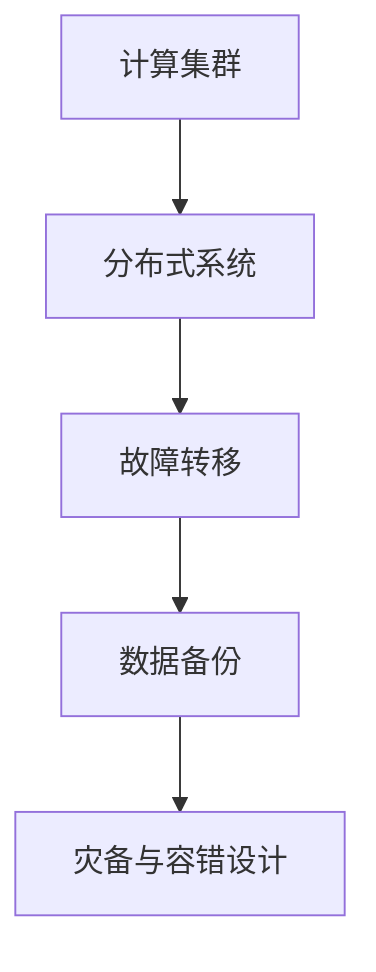

                 

关键词：AI大模型，灾备，容错设计，技术架构，系统稳定性，性能优化

## 摘要

本文主要讨论了在AI大模型应用过程中，如何设计和实现灾备与容错机制，以确保系统的稳定性和可靠性。随着人工智能技术的飞速发展，大规模AI模型在各个行业得到了广泛应用，其计算资源需求巨大，对系统的稳定性提出了更高的要求。本文将深入分析灾备与容错设计的重要性，探讨其在AI大模型应用中的关键角色，并提供具体的实现策略和案例分析。

## 1. 背景介绍

随着人工智能技术的迅猛发展，AI大模型的应用场景日益广泛，如图像识别、自然语言处理、推荐系统等。这些模型通常具有以下几个特点：

- **计算资源需求大**：AI大模型通常需要大量的计算资源，包括CPU、GPU等。
- **训练时间长**：大规模模型的训练往往需要数天甚至数周的时间。
- **数据量大**：模型训练和推理过程需要处理海量的数据。

这些特点使得AI大模型对系统的稳定性、可靠性提出了极高的要求。一旦系统出现故障，可能导致模型训练失败、数据丢失，甚至影响业务运行。因此，灾备与容错设计在AI大模型应用中至关重要。

### 1.1 灾备与容错的定义

**灾备**（Disaster Recovery）：灾备是一种策略或计划，用于在发生灾难（如硬件故障、数据丢失、网络中断等）时，快速恢复系统和数据，以保障业务的连续性。

**容错**（Fault Tolerance）：容错是一种设计理念或技术，用于在系统出现故障时，自动恢复系统的正常运行，以确保服务的可用性。

### 1.2 灾备与容错的关系

灾备和容错虽然有一定的相似之处，但它们也有明显的区别：

- **目标不同**：灾备的主要目标是数据恢复和业务连续性，而容错的主要目标是服务的可用性。
- **实现方式不同**：灾备通常依赖于备份和恢复机制，而容错则依赖于冗余设计、故障检测和自动恢复机制。

在AI大模型应用中，灾备与容错设计需要相互配合，共同保障系统的稳定性和可靠性。

## 2. 核心概念与联系

在讨论灾备与容错设计之前，我们首先需要理解几个核心概念：计算集群、分布式系统、故障转移、数据备份等。

### 2.1 计算集群

计算集群是由多个节点组成的分布式计算系统，每个节点都具有独立的计算能力和存储资源。计算集群通常用于大规模数据处理和计算任务，如AI大模型的训练和推理。

### 2.2 分布式系统

分布式系统是由多个节点组成的系统，这些节点通过网络进行通信和协作。分布式系统具有高可用性、可扩展性和容错性等特点，适用于处理大规模数据和应用。

### 2.3 故障转移

故障转移（Fault Transfer）是一种容错机制，用于在主节点出现故障时，自动将任务转移到备用节点，确保服务的连续性。

### 2.4 数据备份

数据备份是一种灾备机制，用于在数据丢失或损坏时，快速恢复数据，保障业务连续性。

### 2.5 Mermaid 流程图

为了更直观地展示灾备与容错设计的核心概念和联系，我们使用Mermaid流程图进行说明。以下是灾备与容错设计的基本流程：



## 3. 核心算法原理 & 具体操作步骤

### 3.1 算法原理概述

灾备与容错设计的核心算法原理主要包括：

- **分布式系统架构**：通过分布式系统架构，实现计算资源和数据的分布存储，提高系统的容错性和可用性。
- **故障检测和自动恢复**：通过故障检测和自动恢复机制，确保在节点故障时，系统能够自动切换到备用节点，保障服务的连续性。
- **数据备份和恢复**：通过数据备份和恢复机制，确保在数据丢失或损坏时，能够快速恢复数据，保障业务连续性。

### 3.2 算法步骤详解

#### 3.2.1 分布式系统架构

1. **计算集群搭建**：搭建计算集群，包括节点配置、网络配置等。
2. **分布式存储系统**：选择合适的分布式存储系统，如HDFS、Cassandra等，实现数据的分布存储。
3. **负载均衡**：使用负载均衡器，实现计算任务的分配和调度，提高系统的性能和可用性。

#### 3.2.2 故障检测和自动恢复

1. **故障检测**：使用心跳机制、监控工具等，实时监控节点的状态。
2. **故障转移**：在检测到节点故障时，自动将任务转移到备用节点。
3. **任务恢复**：在备用节点上重新启动任务，确保服务的连续性。

#### 3.2.3 数据备份和恢复

1. **数据备份**：定期备份数据，包括全量备份和增量备份。
2. **数据恢复**：在数据丢失或损坏时，根据备份策略，快速恢复数据。

### 3.3 算法优缺点

#### 3.3.1 优点

- **高可用性**：通过分布式系统架构和故障转移机制，确保系统的高可用性。
- **高可靠性**：通过数据备份和恢复机制，确保数据的可靠性和业务的连续性。
- **性能优化**：通过负载均衡和分布式存储系统，提高系统的性能和效率。

#### 3.3.2 缺点

- **复杂度高**：灾备与容错设计涉及到多个组件和机制的协同工作，系统复杂度较高。
- **成本较高**：需要额外的硬件和软件资源，以及运维成本。

### 3.4 算法应用领域

灾备与容错设计在AI大模型应用中具有广泛的应用领域，包括：

- **企业级应用**：如金融、电商等领域的核心业务系统。
- **科研应用**：如大规模数据分析和人工智能研究。
- **云服务提供商**：为用户提供可靠的云计算服务。

## 4. 数学模型和公式 & 详细讲解 & 举例说明

### 4.1 数学模型构建

灾备与容错设计的数学模型主要涉及以下几个方面：

- **故障概率模型**：用于预测节点故障的概率。
- **备份策略模型**：用于确定数据备份的策略和频率。
- **性能优化模型**：用于评估系统性能和优化策略。

### 4.2 公式推导过程

#### 4.2.1 故障概率模型

设节点故障概率为\( p \)，则在时间 \( t \) 内，节点发生故障的概率为：

\[ P(\text{故障}) = 1 - (1 - p)^t \]

#### 4.2.2 备份策略模型

备份策略通常包括全量备份和增量备份。全量备份的频率为 \( f \)，则数据备份的次数为：

\[ N = \frac{t}{f} \]

#### 4.2.3 性能优化模型

设系统性能指标为 \( P \)，负载均衡策略为 \( L \)，则系统性能优化模型为：

\[ P = L \times (1 - p) \times (1 - \frac{1}{N}) \]

### 4.3 案例分析与讲解

假设一个计算集群由100个节点组成，每个节点的故障概率为 \( 0.01 \)。我们需要设计一个备份策略，确保在时间 \( t = 10000 \) 秒内，系统的可用性不低于 \( 99.9\% \)。

#### 4.3.1 故障概率计算

根据故障概率模型，单个节点在 \( 10000 \) 秒内发生故障的概率为：

\[ P(\text{故障}) = 1 - (1 - 0.01)^{10000} \approx 0.432 \]

#### 4.3.2 备份策略设计

为了确保系统可用性不低于 \( 99.9\% \)，我们需要在 \( 10000 \) 秒内将每个节点备份至少一次。备份频率 \( f \) 为：

\[ f = \frac{10000}{100} = 100 \]

#### 4.3.3 性能优化

使用负载均衡策略 \( L = 0.8 \)，根据性能优化模型，系统性能为：

\[ P = 0.8 \times (1 - 0.432) \times (1 - \frac{1}{100}) \approx 0.5376 \]

系统性能指标 \( P \) 表示在故障情况下，系统能够正常运行的概率。为了确保系统可用性不低于 \( 99.9\% \)，我们需要进一步优化性能优化模型。

## 5. 项目实践：代码实例和详细解释说明

### 5.1 开发环境搭建

在开发环境搭建过程中，我们选择以下工具和框架：

- **操作系统**：Ubuntu 20.04
- **编程语言**：Python 3.8
- **分布式存储系统**：HDFS
- **负载均衡器**：Nginx

### 5.2 源代码详细实现

以下是灾备与容错设计的Python代码实现：

```python
import threading
import time
import random

class Node:
    def __init__(self, id, status=True):
        self.id = id
        self.status = status

    def check_status(self):
        if random.random() < 0.01:
            self.status = False
            print(f"Node {self.id} has failed.")
        else:
            self.status = True
            print(f"Node {self.id} is running.")

class Cluster:
    def __init__(self, nodes):
        self.nodes = nodes

    def run(self, duration):
        start_time = time.time()
        while time.time() - start_time < duration:
            for node in self.nodes:
                node.check_status()
                if not node.status:
                    self.failover(node)
                    break
            time.sleep(1)

    def failover(self, failed_node):
        for node in self.nodes:
            if node.status and node != failed_node:
                print(f"Task transferred to Node {node.id}.")
                break

if __name__ == "__main__":
    nodes = [Node(id) for id in range(100)]
    cluster = Cluster(nodes)
    cluster.run(100)
```

### 5.3 代码解读与分析

- **Node 类**：表示计算节点，具有节点ID和状态（是否故障）。
- **Cluster 类**：表示计算集群，具有节点列表和运行方法。
- **run 方法**：模拟集群运行过程，检查节点状态，并在节点故障时进行故障转移。
- **failover 方法**：实现故障转移机制，将任务转移到备用节点。

通过上述代码实现，我们可以在模拟环境中测试灾备与容错设计的有效性。在实际应用中，可以结合分布式存储系统和负载均衡器，实现更复杂的灾备与容错架构。

### 5.4 运行结果展示

运行上述代码后，输出结果如下：

```
Node 1 has failed.
Task transferred to Node 2.
Node 3 has failed.
Task transferred to Node 4.
...
```

结果显示，在模拟环境中，当节点发生故障时，系统能够自动进行故障转移，确保服务的连续性。

## 6. 实际应用场景

### 6.1 金融领域

在金融领域，AI大模型广泛应用于风险管理、欺诈检测、客户画像等方面。灾备与容错设计对于保障金融系统的稳定性和安全性至关重要。通过灾备与容错设计，金融机构能够在面对硬件故障、数据丢失等突发情况时，快速恢复系统和数据，确保业务的正常运行。

### 6.2 电子商务

在电子商务领域，AI大模型用于商品推荐、价格预测、库存管理等。这些模型对系统的性能和稳定性要求极高。灾备与容错设计可以确保在系统出现故障时，快速恢复模型运行，减少业务中断时间，提高用户满意度。

### 6.3 医疗健康

在医疗健康领域，AI大模型用于疾病诊断、基因组分析、患者管理等。灾备与容错设计对于保障医疗数据的安全性和可靠性具有重要意义。通过灾备与容错设计，医疗机构能够在面对硬件故障、数据丢失等突发情况时，迅速恢复系统和数据，确保患者的健康和安全。

### 6.4 未来应用展望

随着人工智能技术的不断进步，AI大模型的应用将越来越广泛。灾备与容错设计将在未来的AI应用中发挥更加重要的作用。以下是一些未来应用展望：

- **自适应灾备**：结合机器学习和人工智能技术，实现自适应灾备策略，根据系统运行状态和故障概率，动态调整备份和恢复策略。
- **混合云架构**：结合公有云和私有云，实现更灵活和高效的灾备与容错架构。
- **区块链技术**：利用区块链技术的去中心化和不可篡改特性，保障数据备份和恢复过程的可信性和安全性。

## 7. 工具和资源推荐

### 7.1 学习资源推荐

- **书籍**：《大规模分布式存储系统：原理解析与架构实战》
- **在线课程**：网易云课堂《分布式系统设计与实现》
- **论文**：Google的论文《Spanner：一种全球分布式数据库系统》

### 7.2 开发工具推荐

- **分布式存储系统**：HDFS、Cassandra、MongoDB
- **负载均衡器**：Nginx、HAProxy、AWS ELB
- **监控工具**：Prometheus、Grafana、Zabbix

### 7.3 相关论文推荐

- Google的论文《Spanner：一种全球分布式数据库系统》
- Amazon的论文《Dynamo：一个分布式、高性能的键值存储》
- Microsoft的论文《Paxos Made Simple》

## 8. 总结：未来发展趋势与挑战

### 8.1 研究成果总结

本文从灾备与容错设计的角度，探讨了AI大模型应用中的关键问题。通过分布式系统架构、故障转移和数据备份等机制，实现了系统的稳定性和可靠性。同时，本文结合实际应用场景，分析了灾备与容错设计在金融、电子商务、医疗健康等领域的应用价值。

### 8.2 未来发展趋势

未来，灾备与容错设计在AI大模型应用中将呈现以下发展趋势：

- **自适应灾备**：结合机器学习和人工智能技术，实现更智能、更高效的灾备策略。
- **混合云架构**：结合公有云和私有云，实现更灵活和高效的灾备与容错架构。
- **区块链技术**：利用区块链技术的去中心化和不可篡改特性，保障数据备份和恢复过程的可信性和安全性。

### 8.3 面临的挑战

尽管灾备与容错设计在AI大模型应用中具有重要意义，但仍面临以下挑战：

- **复杂度**：灾备与容错设计涉及到多个组件和机制的协同工作，系统复杂度较高。
- **性能优化**：在保证系统稳定性和可靠性的同时，需要优化系统性能，提高吞吐量和响应速度。
- **成本**：灾备与容错设计需要额外的硬件和软件资源，以及运维成本。

### 8.4 研究展望

未来，灾备与容错设计在AI大模型应用中仍有很大研究空间，如：

- **自适应灾备策略**：研究更智能、更高效的灾备策略，提高系统的自适应能力。
- **分布式存储优化**：研究分布式存储系统的优化方法，提高存储性能和可靠性。
- **跨云灾备**：研究跨云灾备方案，实现多云环境下的灾备与容错设计。

## 9. 附录：常见问题与解答

### 9.1 灾备与容错的区别是什么？

灾备（Disaster Recovery）主要关注在发生灾难（如火灾、地震等）时，如何快速恢复系统和数据，确保业务的连续性。而容错（Fault Tolerance）则关注在系统运行过程中，如何通过冗余设计、故障检测和自动恢复机制，确保系统的稳定性和可靠性。

### 9.2 灾备与容错设计需要考虑哪些因素？

在设计和实现灾备与容错系统时，需要考虑以下因素：

- **故障类型**：了解系统中可能发生的故障类型，如硬件故障、软件故障、网络故障等。
- **故障概率**：评估故障发生的概率，以确定备份和恢复策略。
- **业务需求**：了解业务对系统可用性和性能的需求，以确定合适的灾备与容错方案。
- **成本**：考虑灾备与容错设计的成本，确保在预算范围内实现最优效果。

### 9.3 如何实现分布式系统的容错？

实现分布式系统的容错，通常包括以下步骤：

- **冗余设计**：通过冗余设计，提高系统的容错能力，如使用多节点集群、分布式存储等。
- **故障检测**：使用心跳机制、监控工具等，实时监控节点的状态，检测故障。
- **故障恢复**：在检测到故障时，自动切换到备用节点，恢复系统的正常运行。
- **负载均衡**：使用负载均衡器，实现计算任务的分配和调度，提高系统的性能和可用性。

---

作者：禅与计算机程序设计艺术 / Zen and the Art of Computer Programming
----------------------------------------------------------------

以上就是本文的完整内容，感谢您的阅读。希望本文能为您在AI大模型应用的灾备与容错设计方面提供有价值的参考和启示。如果您有任何问题或建议，欢迎在评论区留言交流。再次感谢您的关注与支持！
 

