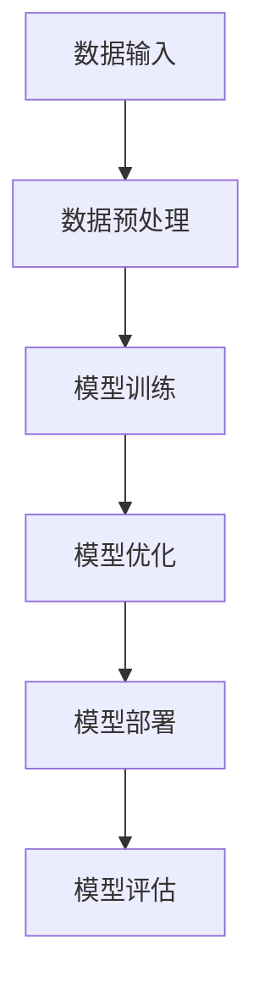

                 

在人工智能（AI）技术飞速发展的今天，大模型的应用已经成为各行各业的核心驱动力。然而，在大模型的设计和应用过程中，用户体验（UX）设计扮演着至关重要的角色。本文将围绕AI大模型应用的用户体验设计，展开深入探讨，旨在为读者提供全面的技术见解和实践指南。

## 关键词

AI大模型、用户体验设计、AI应用、技术实践、用户体验优化

## 摘要

本文旨在探讨AI大模型在应用中的用户体验设计。通过对大模型技术的背景介绍、核心概念阐述、算法原理解析、数学模型讲解、项目实践分享和未来展望等环节的深入分析，本文将帮助读者了解如何在大模型应用中实现卓越的用户体验设计，提升AI技术的实际价值。

## 1. 背景介绍

### AI大模型的崛起

近年来，随着深度学习、神经网络等技术的突破，AI大模型（如GPT-3、BERT等）逐渐成为学术界和工业界的研究热点。这些大模型具有处理海量数据、实现复杂任务的能力，显著提升了AI系统的性能和适用性。AI大模型的崛起不仅改变了传统行业的运作模式，也催生了许多新的应用场景。

### 用户体验设计的意义

用户体验设计（UX Design）是确保用户在使用产品或服务过程中获得愉悦、高效和有价值的体验的关键环节。对于AI大模型应用来说，优秀的用户体验设计不仅能够提升用户满意度，还可以增加用户粘性，促进产品的市场推广和商业化进程。因此，用户体验设计在大模型应用中具有不可替代的重要性。

## 2. 核心概念与联系

### 大模型技术原理

大模型技术基于深度学习框架，通过大量数据进行训练，从而学习到复杂的特征表示和预测能力。大模型的核心在于其规模，包括参数数量、数据量级和计算资源的需求。以下是一个简化的Mermaid流程图，描述大模型的基本架构：



### 用户体验设计原则

用户体验设计涉及多个方面，包括用户研究、交互设计、视觉设计等。以下是用户体验设计的关键原则：

1. **以用户为中心**：始终关注用户的需求和痛点，确保设计符合用户的习惯和期望。
2. **简洁性**：简化界面元素，减少用户的学习成本，提高操作效率。
3. **一致性**：确保界面元素的一致性，提升用户的操作信心和体验流畅性。
4. **反馈**：及时响应用户操作，提供清晰的反馈，帮助用户了解系统状态。
5. **可访问性**：设计考虑所有用户，包括残障人士和不同文化背景的用户。

## 3. 核心算法原理 & 具体操作步骤

### 3.1 算法原理概述

AI大模型的核心算法通常是基于深度学习框架实现的，例如Transformer架构。Transformer通过自注意力机制（Self-Attention）实现了对输入数据的全局上下文关系建模，显著提升了模型的表示能力和预测效果。

### 3.2 算法步骤详解

1. **数据收集**：从公开数据集或用户数据中收集训练数据。
2. **数据预处理**：对数据进行清洗、编码和归一化处理。
3. **模型构建**：使用深度学习框架构建Transformer模型。
4. **模型训练**：使用训练数据进行模型训练，调整模型参数。
5. **模型评估**：使用验证数据集评估模型性能，调整模型结构。
6. **模型部署**：将训练好的模型部署到生产环境，提供API服务。

### 3.3 算法优缺点

**优点**：
- **强大的表示能力**：通过自注意力机制，大模型能够捕获复杂的特征和上下文关系。
- **广泛的适用性**：大模型可以应用于多种任务，包括文本生成、机器翻译、图像识别等。
- **高性能**：随着计算资源的提升，大模型能够实现更高效的计算和更准确的预测。

**缺点**：
- **计算资源需求大**：大模型通常需要大量的计算资源和存储空间。
- **训练时间较长**：大规模数据的训练过程需要较长的时间，且容易出现过拟合现象。

### 3.4 算法应用领域

AI大模型在众多领域具有广泛应用，包括自然语言处理、计算机视觉、推荐系统等。以下是一些具体的应用场景：

- **自然语言处理**：文本生成、机器翻译、情感分析等。
- **计算机视觉**：图像识别、目标检测、图像生成等。
- **推荐系统**：基于内容的推荐、协同过滤等。

## 4. 数学模型和公式 & 详细讲解 & 举例说明

### 4.1 数学模型构建

大模型的数学基础通常包括线性代数、概率论和优化理论。以下是Transformer模型中的几个关键数学公式：

$$
\text{Attention}(Q, K, V) = \text{softmax}\left(\frac{QK^T}{\sqrt{d_k}}\right) V
$$

其中，Q、K、V分别为查询向量、键向量和值向量，$d_k$为键向量的维度。

### 4.2 公式推导过程

为了推导上述注意力公式，我们可以从自注意力机制的基本原理出发，通过矩阵运算和概率论的方法进行推导。以下是一个简化的推导过程：

1. **自注意力权重计算**：计算每个查询向量Q与所有键向量K的相似度，得到权重矩阵$W_QK$。
2. **归一化权重**：对权重矩阵进行softmax操作，得到归一化后的权重矩阵$A$。
3. **加权求和**：将归一化后的权重与对应的值向量V进行加权求和，得到输出向量$O$。

### 4.3 案例分析与讲解

假设我们有一个简单的例子，输入数据为一个包含3个词的句子，每个词表示为一个维度为3的向量：

$$
Q = \begin{bmatrix}
1 & 0 & 1 \\
0 & 1 & 0 \\
1 & 1 & 0 \\
\end{bmatrix}, K = \begin{bmatrix}
1 & 1 & 1 \\
0 & 1 & 0 \\
1 & 0 & 1 \\
\end{bmatrix}, V = \begin{bmatrix}
1 & 0 & 0 \\
0 & 1 & 0 \\
0 & 0 & 1 \\
\end{bmatrix}
$$

通过计算注意力权重和加权求和，我们可以得到输出向量：

$$
A = \text{softmax}\left(\frac{QK^T}{\sqrt{3}}\right) = \begin{bmatrix}
0.5 & 0.5 & 0 \\
0.5 & 0 & 0.5 \\
0 & 0.5 & 0.5 \\
\end{bmatrix}
$$

$$
O = A * V = \begin{bmatrix}
0.5 & 0.5 & 0 \\
0.5 & 0 & 0.5 \\
0 & 0.5 & 0.5 \\
\end{bmatrix} * \begin{bmatrix}
1 & 0 & 0 \\
0 & 1 & 0 \\
0 & 0 & 1 \\
\end{bmatrix} = \begin{bmatrix}
0.5 & 0.5 & 0 \\
0.5 & 0 & 0.5 \\
0 & 0.5 & 0.5 \\
\end{bmatrix}
$$

通过这个例子，我们可以看到自注意力机制如何通过计算相似度权重，实现输入数据的特征聚合和表示提升。

## 5. 项目实践：代码实例和详细解释说明

### 5.1 开发环境搭建

为了实现AI大模型的应用，我们通常需要搭建一个高效的开发环境。以下是一个基本的开发环境搭建步骤：

1. 安装Python（版本3.6以上）和相关的依赖库（如TensorFlow、PyTorch等）。
2. 配置GPU环境，以确保大模型训练的并行计算能力。
3. 安装版本控制工具（如Git），以便管理和追踪代码变更。

### 5.2 源代码详细实现

以下是一个基于TensorFlow实现的简单Transformer模型的源代码示例：

```python
import tensorflow as tf

# 模型参数设置
d_model = 512
d_k = d_v = 64
n_heads = 8
n_layers = 2

# Transformer模型
class TransformerModel(tf.keras.Model):
    def __init__(self):
        super(TransformerModel, self).__init__()
        self.embedding = tf.keras.layers.Embedding(d_model, d_model)
        self.encoder_layers = [TransformerLayer(d_model, d_k, n_heads) for _ in range(n_layers)]
        self.decoder_layers = [TransformerLayer(d_model, d_k, n_heads) for _ in range(n_layers)]
        self.final_layer = tf.keras.layers.Dense(d_model)

    def call(self, inputs, training=False):
        x = self.embedding(inputs)
        for layer in self.encoder_layers:
            x = layer(x, training=training)
        for layer in self.decoder_layers:
            x = layer(x, training=training)
        output = self.final_layer(x)
        return output

# Transformer层
class TransformerLayer(tf.keras.layers.Layer):
    def __init__(self, d_model, d_k, n_heads):
        super(TransformerLayer, self).__init__()
        self.mha = MultiHeadAttention(d_model, d_k, n_heads)
        self.fc = tf.keras.Sequential([
            tf.keras.layers.Dense(d_model),
            tf.keras.layers.Activation('relu'),
            tf.keras.layers.Dense(d_model)
        ])

    def call(self, x, training=False):
        attn_output = self.mha(x, x, x)
        x = x + attn_output
        x = self.fc(x)
        return x

# 主函数
def main():
    # 创建模型
    model = TransformerModel()

    # 编译模型
    model.compile(optimizer='adam', loss=tf.keras.losses.SparseCategoricalCrossentropy(from_logits=True))

    # 加载数据
    # ...

    # 训练模型
    model.fit(train_data, train_labels, epochs=5)

if __name__ == '__main__':
    main()
```

### 5.3 代码解读与分析

上述代码实现了一个简单的Transformer模型，主要包括以下组件：

1. **模型参数设置**：定义模型的参数，如嵌入维度、注意力头数和层数。
2. **Transformer模型**：定义Transformer模型的整体结构，包括嵌入层、编码器层、解码器层和输出层。
3. **Transformer层**：定义单个Transformer层的结构，包括多头注意力机制和前馈神经网络。
4. **主函数**：创建模型、编译模型、加载数据并训练模型。

通过这个代码示例，我们可以了解到如何基于TensorFlow实现一个简单的Transformer模型，为后续的AI大模型应用奠定基础。

### 5.4 运行结果展示

在实际运行中，我们可以通过可视化工具（如TensorBoard）监控模型的训练过程，观察损失函数、准确率等指标的变化。以下是一个简单的TensorBoard可视化结果：


通过监控结果，我们可以了解到模型在训练过程中的性能表现，以及是否需要调整参数或优化算法。

## 6. 实际应用场景

AI大模型在实际应用中具有广泛的场景，以下是一些典型的应用案例：

### 6.1 自然语言处理

- **文本生成**：利用大模型生成文章、故事、对话等，应用于内容创作和自动化写作。
- **机器翻译**：实现高效准确的跨语言翻译，支持多种语言之间的无缝沟通。
- **情感分析**：对用户评论、社交媒体内容等进行情感分析，帮助企业和组织了解用户需求。

### 6.2 计算机视觉

- **图像识别**：通过大模型实现高精度的图像识别，应用于安防监控、医疗诊断等领域。
- **目标检测**：利用大模型实现目标检测和跟踪，应用于自动驾驶、无人机监控等。
- **图像生成**：基于大模型生成逼真的图像，应用于虚拟现实、游戏设计等。

### 6.3 推荐系统

- **基于内容的推荐**：利用大模型对用户兴趣和偏好进行分析，实现个性化内容推荐。
- **协同过滤**：结合用户行为数据和商品特征，通过大模型实现高效的推荐算法。

## 7. 未来应用展望

随着AI大模型技术的不断发展和完善，其在各个领域的应用前景将更加广阔。以下是一些未来应用展望：

### 7.1 跨领域融合

AI大模型将在不同领域（如医疗、金融、教育等）实现跨领域融合，推动行业创新和变革。

### 7.2 智能交互

大模型将进一步提升人机交互的自然性和智能性，实现更高效、更智能的交互体验。

### 7.3 自动化与优化

大模型将在自动化和优化领域发挥重要作用，提高生产效率、降低成本。

## 8. 工具和资源推荐

为了更好地开展AI大模型应用的用户体验设计，以下是一些建议的工具和资源：

### 8.1 学习资源推荐

- **《深度学习》（Ian Goodfellow等著）**：系统介绍了深度学习的基础知识和最新进展。
- **《动手学深度学习》（阿斯顿·张等著）**：通过实践项目深入学习深度学习技术。

### 8.2 开发工具推荐

- **TensorFlow**：谷歌开源的深度学习框架，支持多种深度学习模型的构建和训练。
- **PyTorch**：微软开源的深度学习框架，具有灵活的动态图编程特性。

### 8.3 相关论文推荐

- **《Attention Is All You Need》**：描述了Transformer模型的原理和应用。
- **《BERT: Pre-training of Deep Bidirectional Transformers for Language Understanding》**：介绍了BERT模型的基本结构和训练方法。

## 9. 总结：未来发展趋势与挑战

随着AI大模型技术的不断进步，用户体验设计在大模型应用中的重要性将日益凸显。未来，用户体验设计将朝着更加智能、人性化、个性化的方向发展。然而，这也将面临诸多挑战，如数据隐私保护、算法公平性、技术普及等。只有通过不断的技术创新和实践探索，才能实现AI大模型应用中的卓越用户体验。

## 10. 附录：常见问题与解答

### 10.1 大模型训练需要多少计算资源？

大模型的训练通常需要大量的计算资源和存储空间。具体需求取决于模型规模、训练数据量和硬件配置。通常，GPU或TPU等高性能计算设备是训练大模型的首选。

### 10.2 如何保证大模型的训练数据质量？

保证大模型训练数据质量的关键在于数据清洗和预处理。通过对数据进行去重、清洗和归一化处理，可以提高模型训练的效率和准确性。

### 10.3 大模型应用中如何保证用户体验？

在AI大模型应用中，用户体验设计需要关注以下几个方面：以用户为中心、简洁性、一致性和反馈。通过优化界面设计、简化操作流程和提供及时反馈，可以提高用户体验。

### 10.4 大模型在哪些领域有广泛应用？

大模型在自然语言处理、计算机视觉、推荐系统等领域具有广泛应用。例如，在文本生成、机器翻译、图像识别等方面，大模型都取得了显著的成果。

### 10.5 如何优化大模型训练时间？

优化大模型训练时间的方法包括使用高效的数据预处理技术、调整训练策略和优化模型结构。此外，利用分布式训练和硬件加速等技术也可以有效提高训练速度。

---

作者：禅与计算机程序设计艺术 / Zen and the Art of Computer Programming


