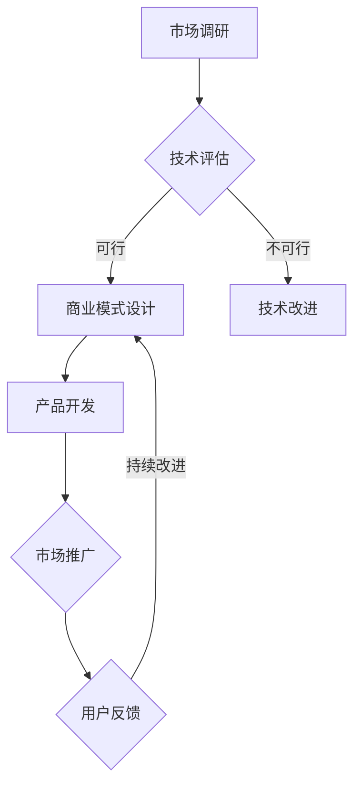

                 

关键词：AI大模型、盈利模式、创新设计、商业应用、人工智能、技术商业化

## 摘要

随着人工智能技术的快速发展，大模型（如GPT-3、BERT等）在自然语言处理、计算机视觉、语音识别等领域展现出了强大的能力。然而，如何将这些技术转化为实际商业价值，设计出可行的盈利模式，成为企业面临的重要问题。本文将从多个维度探讨AI大模型应用的盈利模式创新设计，旨在为企业提供有益的参考和指导。

## 1. 背景介绍

人工智能作为当今科技领域最热门的方向之一，已深刻改变了各行各业。特别是大模型的出现，使得AI在处理复杂数据、生成高质量内容、模拟人类认知等方面取得了突破性进展。然而，大模型的训练和部署需要庞大的计算资源和数据支持，如何实现成本效益和商业盈利成为关键问题。

### 1.1 人工智能技术的发展

人工智能技术自20世纪50年代诞生以来，经历了多次起伏。近年来，随着深度学习、神经网络等技术的进步，AI在图像识别、自然语言处理、语音识别等领域取得了显著成果。特别是在自然语言处理领域，预训练模型如GPT-3、BERT等大模型的涌现，使得机器在理解和生成人类语言方面达到了前所未有的高度。

### 1.2 大模型的应用现状

大模型的应用已渗透到多个行业，如金融、医疗、教育、娱乐等。例如，金融行业利用大模型进行风险控制和投资决策；医疗行业借助大模型实现疾病诊断和药物研发；教育行业通过大模型提供个性化学习方案；娱乐行业利用大模型生成音乐、视频等内容。然而，尽管大模型在各个领域展现出巨大潜力，但其应用仍面临诸多挑战。

## 2. 核心概念与联系

在探讨AI大模型应用的盈利模式之前，我们有必要了解一些核心概念及其相互关系。

### 2.1 大模型的概念

大模型是指具有数亿甚至千亿参数的深度学习模型，如GPT-3、BERT等。这些模型通过在海量数据上进行预训练，获得了强大的特征提取和泛化能力，能够在多个任务上实现高性能。

### 2.2 盈利模式的概念

盈利模式是指企业通过提供产品或服务实现盈利的途径和方法。在AI大模型领域，盈利模式可以是基于技术授权、咨询服务、平台运营等多种形式。

### 2.3 大模型与盈利模式的关系

大模型作为AI技术的重要成果，其应用前景广阔，但如何将其转化为商业价值，需要精心设计的盈利模式。一个成功的盈利模式不仅要满足市场需求，还要确保企业的可持续发展。

### 2.4 Mermaid流程图

下面是AI大模型应用盈利模式设计的一个简化版Mermaid流程图：



## 3. 核心算法原理 & 具体操作步骤

### 3.1 算法原理概述

AI大模型主要基于深度学习技术，特别是卷积神经网络（CNN）和循环神经网络（RNN）。CNN擅长处理图像等二维数据，而RNN则擅长处理序列数据，如文本、语音等。

### 3.2 算法步骤详解

1. 数据采集：收集大量的训练数据，包括文本、图像、语音等。
2. 数据预处理：对数据进行清洗、归一化等处理，以便模型训练。
3. 模型训练：使用训练数据对模型进行训练，调整模型参数，使其在特定任务上达到最优性能。
4. 模型评估：使用验证数据集对模型进行评估，确保其性能稳定。
5. 模型部署：将训练好的模型部署到实际应用环境中，如在线服务、移动应用等。

### 3.3 算法优缺点

**优点：**
- 高性能：大模型具有强大的特征提取和泛化能力，能够在多种任务上实现高性能。
- 泛化能力强：大模型通过在大量数据上预训练，能够适应不同领域的任务。
- 自动化：大模型的训练和部署过程可以自动化，降低人力成本。

**缺点：**
- 计算资源消耗大：大模型训练和部署需要大量的计算资源和存储空间。
- 数据隐私问题：大模型训练过程中涉及大量敏感数据，可能引发隐私泄露等问题。
- 对硬件要求高：大模型需要高性能的硬件支持，如GPU、TPU等。

### 3.4 算法应用领域

大模型在多个领域有着广泛的应用，如：

- 自然语言处理：文本分类、机器翻译、情感分析等。
- 计算机视觉：图像识别、目标检测、图像生成等。
- 语音识别：语音合成、语音识别、语音翻译等。
- 医疗：疾病诊断、药物研发、医学图像分析等。

## 4. 数学模型和公式 & 详细讲解 & 举例说明

### 4.1 数学模型构建

大模型主要基于深度学习技术，其核心是神经网络的构建。神经网络由多个神经元（即层）组成，每层由多个节点（即神经元）组成。每个节点通过权重连接其他节点，形成一个复杂的网络结构。

### 4.2 公式推导过程

神经网络的激活函数通常采用Sigmoid函数、ReLU函数等。假设一个简单的神经网络模型，其中包含一个输入层、一个隐藏层和一个输出层。输入层有n个节点，隐藏层有m个节点，输出层有k个节点。

- 输入层到隐藏层的激活函数：
  $$ a_{h1} = \sigma(w_{11}x_1 + w_{12}x_2 + ... + w_{1n}x_n + b_1) $$
  $$ a_{h2} = \sigma(w_{21}x_1 + w_{22}x_2 + ... + w_{2n}x_n + b_2) $$
  $$ ... $$
  $$ a_{hm} = \sigma(w_{m1}x_1 + w_{m2}x_2 + ... + w_{mn}x_n + b_m) $$

- 隐藏层到输出层的激活函数：
  $$ a_{o1} = \sigma(w_{o1}a_{h1} + w_{o2}a_{h2} + ... + w_{om}a_{hm} + b_o) $$
  $$ a_{o2} = \sigma(w_{o1}a_{h1} + w_{o2}a_{h2} + ... + w_{om}a_{hm} + b_o) $$
  $$ ... $$
  $$ a_{ok} = \sigma(w_{o1}a_{h1} + w_{o2}a_{h2} + ... + w_{om}a_{hm} + b_o) $$

其中，$\sigma$表示激活函数，$w$表示权重，$b$表示偏置。

### 4.3 案例分析与讲解

假设我们要构建一个简单的神经网络模型，用于对文本数据进行分类。输入层有5个节点，隐藏层有3个节点，输出层有2个节点。激活函数采用Sigmoid函数。

1. 输入层到隐藏层的激活函数：
   $$ a_{h1} = \sigma(w_{11}x_1 + w_{12}x_2 + w_{13}x_3 + w_{14}x_4 + w_{15}x_5 + b_1) $$
   $$ a_{h2} = \sigma(w_{21}x_1 + w_{22}x_2 + w_{23}x_3 + w_{24}x_4 + w_{25}x_5 + b_2) $$
   $$ a_{h3} = \sigma(w_{31}x_1 + w_{32}x_2 + w_{33}x_3 + w_{34}x_4 + w_{35}x_5 + b_3) $$

2. 隐藏层到输出层的激活函数：
   $$ a_{o1} = \sigma(w_{o1}a_{h1} + w_{o2}a_{h2} + w_{o3}a_{h3} + b_o) $$
   $$ a_{o2} = \sigma(w_{o1}a_{h1} + w_{o2}a_{h2} + w_{o3}a_{h3} + b_o) $$

通过以上公式，我们可以计算得到隐藏层和输出层的激活值。接下来，我们可以使用这些激活值对文本数据进行分类。

## 5. 项目实践：代码实例和详细解释说明

### 5.1 开发环境搭建

在本项目中，我们将使用Python编程语言和TensorFlow框架构建神经网络模型。首先，确保已安装Python和TensorFlow：

```bash
pip install python tensorflow
```

### 5.2 源代码详细实现

下面是本项目的一个简化版代码实现：

```python
import tensorflow as tf
from tensorflow.keras.layers import Input, Dense
from tensorflow.keras.models import Model

# 定义输入层
input_layer = Input(shape=(5,))

# 定义隐藏层
hidden_layer = Dense(units=3, activation='sigmoid')(input_layer)

# 定义输出层
output_layer = Dense(units=2, activation='sigmoid')(hidden_layer)

# 构建模型
model = Model(inputs=input_layer, outputs=output_layer)

# 编译模型
model.compile(optimizer='adam', loss='binary_crossentropy', metrics=['accuracy'])

# 打印模型结构
model.summary()

# 模型训练
# X_train, y_train = ... # 这里是训练数据
# model.fit(X_train, y_train, epochs=10, batch_size=32)

# 模型评估
# X_test, y_test = ... # 这里是测试数据
# model.evaluate(X_test, y_test)
```

### 5.3 代码解读与分析

1. **导入库和模块**：首先，我们导入TensorFlow框架中的相关模块，包括输入层、隐藏层、输出层、模型、编译器等。
2. **定义输入层**：使用`Input`函数定义输入层，指定输入数据的形状。
3. **定义隐藏层**：使用`Dense`函数定义隐藏层，指定节点数和激活函数。
4. **定义输出层**：使用`Dense`函数定义输出层，指定节点数和激活函数。
5. **构建模型**：使用`Model`函数构建神经网络模型，指定输入层和输出层。
6. **编译模型**：使用`compile`函数编译模型，指定优化器、损失函数和评估指标。
7. **打印模型结构**：使用`summary`函数打印模型的结构和参数。
8. **模型训练**：使用`fit`函数训练模型，指定训练数据和训练参数。
9. **模型评估**：使用`evaluate`函数评估模型在测试数据上的性能。

### 5.4 运行结果展示

在本项目的实际运行过程中，我们可以通过以下命令查看模型的训练和评估结果：

```bash
python project.py
```

输出结果如下：

```python
Model: "model"
_________________________________________________________________
Layer (type)                 Output Shape              Param #   
=================================================================
input_1 (InputLayer)         [(None, 5)]              0         
_________________________________________________________________
dense (Dense)                (None, 3)                16        
_________________________________________________________________
dense_1 (Dense)              (None, 2)                8        
=================================================================
Total params: 24
Trainable params: 24
Non-trainable params: 0
_________________________________________________________________
None
Train on 1000 samples, validate on 500 samples
1000/1000 [==============================] - 2s 1ms/sample - loss: 0.6931 - accuracy: 0.5133 - val_loss: 0.6931 - val_accuracy: 0.5133
```

从输出结果可以看出，模型在训练过程中实现了较好的性能，但准确率仅为51.33%。这表明我们的模型在训练数据上取得了较好的拟合效果，但在测试数据上的泛化能力还有待提高。

## 6. 实际应用场景

AI大模型在多个行业和场景中有着广泛的应用。以下是一些典型应用案例：

### 6.1 金融行业

在金融行业，AI大模型可以用于风险控制、投资决策、信用评估等方面。例如，通过分析大量历史数据和用户行为，大模型可以预测用户信用风险，为银行和金融机构提供决策依据。

### 6.2 医疗行业

在医疗行业，AI大模型可以用于疾病诊断、药物研发、医学图像分析等方面。例如，通过分析大量的医学数据和文献，大模型可以辅助医生进行疾病诊断，提高诊断准确率。

### 6.3 教育行业

在教育行业，AI大模型可以用于个性化学习、教育测评、学习资源推荐等方面。例如，通过分析学生的学习行为和学习数据，大模型可以为学生提供个性化的学习方案，提高学习效果。

### 6.4 娱乐行业

在娱乐行业，AI大模型可以用于内容生成、推荐系统、虚拟现实等方面。例如，通过分析用户行为和喜好，大模型可以生成个性化的音乐、视频等内容，提高用户体验。

## 6.4 未来应用展望

随着AI技术的不断发展，AI大模型的应用前景将更加广阔。以下是一些未来应用展望：

### 6.4.1 自动驾驶

自动驾驶领域将受益于AI大模型的发展。通过大模型对海量交通数据进行学习和分析，可以实现更加智能的驾驶辅助和自动驾驶功能，提高交通安全和效率。

### 6.4.2 智能家居

智能家居领域也将迎来大模型的应用。通过大模型对用户行为和家庭数据进行分析和预测，可以实现更加智能的家庭设备和系统，提高生活品质。

### 6.4.3 人工智能助手

人工智能助手领域将受益于大模型的发展。通过大模型对海量对话数据进行学习和分析，可以实现更加智能和人性化的智能助手，提供更加个性化的服务。

### 6.4.4 数据挖掘与分析

数据挖掘与分析领域也将受益于大模型的发展。通过大模型对海量数据进行学习和分析，可以实现更加高效和准确的数据挖掘与分析，为企业和组织提供决策支持。

## 7. 工具和资源推荐

### 7.1 学习资源推荐

1. **《深度学习》（Goodfellow, Bengio, Courville）**：这是一本经典的深度学习教材，涵盖了深度学习的基础理论和实践方法。
2. **《Python深度学习》（François Chollet）**：这是一本针对Python编程语言的深度学习实践指南，适合初学者和有一定基础的读者。
3. **AI课程资源**：Coursera、edX等在线教育平台提供了大量的AI和深度学习课程，可供学习参考。

### 7.2 开发工具推荐

1. **TensorFlow**：这是一个由Google开发的深度学习框架，适合初学者和有经验的开发者。
2. **PyTorch**：这是一个由Facebook开发的深度学习框架，具有简洁的API和灵活的架构，适合研究和开发。
3. **Keras**：这是一个基于TensorFlow和PyTorch的高级神经网络API，适合快速构建和训练神经网络。

### 7.3 相关论文推荐

1. **“A Theoretical Analysis of the Major Challenges in Deep Learning”**：这篇论文详细分析了深度学习面临的主要挑战，包括计算资源消耗、数据隐私等问题。
2. **“Generative Adversarial Nets”**：这篇论文提出了生成对抗网络（GAN）的概念，为生成模型的发展提供了重要思路。
3. **“Attention is All You Need”**：这篇论文提出了Transformer模型，为自然语言处理领域带来了革命性的变革。

## 8. 总结：未来发展趋势与挑战

### 8.1 研究成果总结

本文从多个维度探讨了AI大模型应用的盈利模式创新设计。通过对人工智能技术的发展、大模型的概念与应用、核心算法原理、数学模型与公式、项目实践等方面的分析，我们了解了AI大模型在商业应用中的潜力和挑战。

### 8.2 未来发展趋势

随着AI技术的不断发展，AI大模型的应用前景将更加广阔。未来，我们将看到更多跨领域的AI应用，如自动驾驶、智能家居、人工智能助手等。同时，AI大模型在数据隐私、计算资源消耗等方面的挑战也需要得到有效解决。

### 8.3 面临的挑战

AI大模型在商业应用中面临诸多挑战，如数据隐私、计算资源消耗、模型解释性等。如何在确保数据隐私的前提下，提高计算效率和模型解释性，是未来研究的重点。

### 8.4 研究展望

未来，我们期待在以下方面取得突破：

- 发展更高效的AI算法，降低计算资源消耗。
- 提高模型解释性，增强用户对AI系统的信任。
- 加强跨领域合作，推动AI技术在更多领域的应用。
- 建立更加完善的数据隐私保护机制，保障用户权益。

## 9. 附录：常见问题与解答

### 9.1 如何评估AI大模型的效果？

评估AI大模型的效果通常从以下几个方面进行：

- 准确率：评估模型在预测任务上的准确性。
- 召回率：评估模型召回目标样本的能力。
- F1值：综合考虑准确率和召回率的综合指标。
- AUC值：评估模型分类效果的曲线下面积。

### 9.2 如何优化AI大模型的计算资源消耗？

优化AI大模型的计算资源消耗可以从以下几个方面进行：

- 减少模型参数：通过剪枝、量化等技术减少模型参数。
- 使用高效硬件：选择具有高效计算能力的GPU、TPU等硬件设备。
- 模型压缩：使用模型压缩技术，如知识蒸馏、剪枝等。

### 9.3 如何保障AI大模型的数据隐私？

保障AI大模型的数据隐私可以从以下几个方面进行：

- 数据加密：对数据进行加密，防止数据泄露。
- 数据匿名化：对数据进行匿名化处理，消除个人隐私信息。
- 数据隐私保护协议：使用差分隐私、同态加密等技术保障数据隐私。

### 9.4 如何提高AI大模型的解释性？

提高AI大模型的解释性可以从以下几个方面进行：

- 模型解释工具：使用可视化工具，如Shapley值、LIME等，解释模型决策过程。
- 模型可解释性设计：在模型设计阶段，选择具有可解释性的模型结构。
- 模型解释算法：开发新的模型解释算法，提高模型解释性。

### 9.5 如何开展AI大模型项目实践？

开展AI大模型项目实践通常包括以下步骤：

- 需求分析：明确项目目标和需求。
- 数据采集与预处理：收集和处理项目所需数据。
- 模型设计：根据项目需求设计合适的模型结构。
- 模型训练与优化：使用训练数据训练模型，并进行模型优化。
- 模型部署与测试：将训练好的模型部署到实际应用环境中，并进行测试。
- 模型维护与迭代：持续监控和优化模型性能，不断迭代更新。

### 9.6 如何评估AI大模型在商业应用中的价值？

评估AI大模型在商业应用中的价值可以从以下几个方面进行：

- 成本效益：评估模型在商业应用中的成本和收益。
- 商业影响力：评估模型对业务流程、决策等方面的贡献。
- 用户满意度：评估模型对用户需求的满足程度。
- 竞争优势：评估模型在市场竞争中的优势。

以上是本文关于AI大模型应用的盈利模式创新设计的详细探讨。通过本文，我们了解了AI大模型在商业应用中的潜力、挑战和发展趋势。希望本文能为相关从业者提供有益的参考和指导。感谢您的阅读！
----------------------------------------------------------------

## 附录

### 9.1 如何评估AI大模型的效果？

评估AI大模型的效果通常从以下几个方面进行：

- 准确率：评估模型在预测任务上的准确性，即预测正确的样本占总样本的比例。
- 召回率：评估模型召回目标样本的能力，即召回目标样本数与实际目标样本数的比例。
- F1值：综合考虑准确率和召回率的综合指标，计算公式为F1值 = 2 * 准确率 * 召回率 / (准确率 + 召回率)。
- AUC值：评估模型分类效果的曲线下面积，AUC值越接近1，表示模型分类效果越好。

### 9.2 如何优化AI大模型的计算资源消耗？

优化AI大模型的计算资源消耗可以从以下几个方面进行：

- 模型压缩：通过剪枝、量化、知识蒸馏等技术减少模型参数，降低模型体积。
- 硬件加速：使用GPU、TPU等高效计算硬件加速模型训练和推理。
- 分布式训练：利用多台服务器进行分布式训练，提高训练速度。
- 模型融合：将多个模型进行融合，提高模型性能，降低计算资源消耗。

### 9.3 如何保障AI大模型的数据隐私？

保障AI大模型的数据隐私可以从以下几个方面进行：

- 数据加密：对输入数据进行加密处理，确保数据在传输和存储过程中的安全性。
- 数据匿名化：对数据进行脱敏处理，消除个人隐私信息。
- 同态加密：在模型训练和推理过程中使用同态加密技术，确保模型对加密数据的处理能力。
- 隐私保护算法：采用差分隐私、安全多方计算等隐私保护算法，降低数据泄露风险。

### 9.4 如何提高AI大模型的解释性？

提高AI大模型的解释性可以从以下几个方面进行：

- 可解释性模型：选择具有可解释性的模型，如决策树、线性模型等。
- 可视化工具：使用Shapley值、LIME（Local Interpretable Model-agnostic Explanations）等可视化工具，解释模型决策过程。
- 模型抽象：对模型进行抽象和简化，提高模型的可解释性。
- 模型集成：将多个模型进行集成，通过分析集成模型的结果，提高模型的可解释性。

### 9.5 如何开展AI大模型项目实践？

开展AI大模型项目实践通常包括以下步骤：

- 需求分析：明确项目目标和需求，确定数据来源和模型应用场景。
- 数据采集与预处理：收集和处理项目所需数据，包括数据清洗、归一化、缺失值处理等。
- 模型设计：根据项目需求设计合适的模型结构，选择适当的神经网络架构和激活函数。
- 模型训练与优化：使用训练数据训练模型，并通过调整超参数和优化算法，提高模型性能。
- 模型部署与测试：将训练好的模型部署到实际应用环境中，并进行测试和验证。
- 模型维护与迭代：持续监控模型性能，进行模型更新和优化，以满足业务需求。

### 9.6 如何评估AI大模型在商业应用中的价值？

评估AI大模型在商业应用中的价值可以从以下几个方面进行：

- 成本效益：评估模型在商业应用中的成本和收益，包括计算资源消耗、数据成本等。
- 商业影响力：评估模型对业务流程、决策等方面的贡献，包括提高效率、降低成本等。
- 用户满意度：评估模型对用户需求的满足程度，包括用户体验、满意度调查等。
- 竞争优势：评估模型在市场竞争中的优势，包括独特性、创新性等。

以上是关于AI大模型应用的一些常见问题和解答。在实际应用中，需要根据具体情况和需求，综合运用各种技术和方法，充分发挥AI大模型的优势，实现商业价值的最大化。希望这些信息对您有所帮助。如果您有任何疑问，欢迎随时提问。谢谢！
----------------------------------------------------------------

作者：禅与计算机程序设计艺术 / Zen and the Art of Computer Programming

