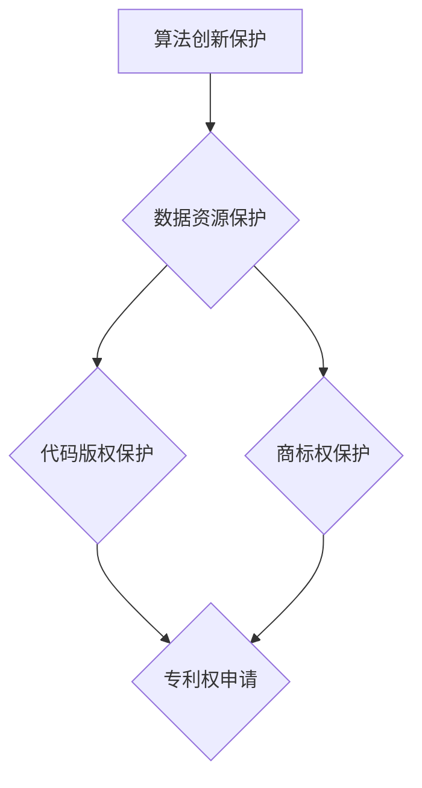

                 

关键词：人工智能，大模型，知识产权，版权，法律保护

## 摘要

人工智能（AI）技术正在迅速发展，特别是大模型（如GPT、BERT等）在自然语言处理、图像识别等多个领域的应用取得了显著的成果。然而，随着AI技术的广泛应用，大模型应用的知识产权保护问题日益凸显。本文旨在探讨AI大模型应用的知识产权保护现状、核心问题以及应对策略，为相关领域的研究和产业发展提供参考。

## 1. 背景介绍

### 1.1 人工智能发展现状

人工智能技术经过多年的发展，已经在多个领域取得了重大突破。特别是在深度学习、神经网络等领域，AI大模型的应用极大地提升了计算机处理数据和信息的能力。例如，GPT模型在自然语言生成、机器翻译、问答系统等方面表现出色，而BERT模型则在文本分类、信息抽取、问答系统等任务中表现出优异的性能。

### 1.2 大模型应用场景

大模型的应用场景日益广泛，包括但不限于以下几个方面：

- 自然语言处理：如文本生成、机器翻译、问答系统等；
- 图像识别：如人脸识别、物体检测、图像分类等；
- 音频处理：如语音识别、音乐生成、音频分类等；
- 数据分析：如数据挖掘、模式识别、推荐系统等。

### 1.3 知识产权保护的重要性

知识产权保护对于推动技术创新和产业发展具有重要意义。对于AI大模型应用来说，知识产权保护不仅关系到企业利益，更关系到整个AI产业的健康发展。有效的知识产权保护有助于：

- 鼓励技术创新：保护研发者的权益，激发更多研究者和企业投入到AI大模型的研究和开发中；
- 促进产业合作：明晰知识产权归属，降低合作风险，推动产学研用一体化发展；
- 维护市场秩序：防止侵权行为，保护消费者权益，促进市场公平竞争。

## 2. 核心概念与联系

### 2.1 知识产权的基本概念

知识产权是指通过智力劳动创造的成果所享有的一种权利，包括但不限于专利权、商标权、著作权等。在AI大模型应用中，主要涉及以下几种知识产权：

- **专利权**：对AI大模型的创新技术、算法、架构等进行保护；
- **商标权**：对AI大模型及其相关产品或服务的标识进行保护；
- **著作权**：对AI大模型应用中的文本、代码、图像等内容进行保护。

### 2.2 AI大模型与知识产权保护

AI大模型涉及多个领域的交叉融合，其知识产权保护问题复杂多样。具体而言，AI大模型应用中的知识产权保护包括以下几个方面：

- **算法创新保护**：AI大模型的核心在于其算法的创新，如何保护这些算法的知识产权成为了一个重要问题；
- **数据资源保护**：AI大模型训练和应用过程中涉及大量的数据资源，如何保护这些数据资源不受侵犯是一个亟待解决的问题；
- **代码版权保护**：AI大模型开发过程中产生的代码需要得到有效的版权保护，以防止他人抄袭和侵权。

### 2.3 Mermaid流程图

下面是一个简单的Mermaid流程图，展示了AI大模型应用中的知识产权保护流程：



## 3. 核心算法原理 & 具体操作步骤

### 3.1 算法原理概述

AI大模型的核心在于其深度学习算法，主要包括以下几种：

- **神经网络**：通过多层神经元节点对数据进行特征提取和分类；
- **生成对抗网络（GAN）**：通过生成器和判别器的对抗训练生成高质量数据；
- **变分自编码器（VAE）**：通过概率模型对数据进行编码和解码，实现数据压缩和生成。

### 3.2 算法步骤详解

以下是AI大模型训练和应用的基本步骤：

1. **数据预处理**：对原始数据进行清洗、归一化等处理，以提高模型的训练效果；
2. **模型设计**：根据任务需求设计神经网络结构，选择合适的激活函数、损失函数等；
3. **模型训练**：通过梯度下降等优化算法，不断调整模型参数，使模型在训练数据上达到最优；
4. **模型评估**：在验证数据集上评估模型性能，选择性能最优的模型进行应用；
5. **模型应用**：将训练好的模型部署到实际应用场景中，进行数据预测、分类、生成等操作。

### 3.3 算法优缺点

- **优点**：
  - 强大的特征提取能力：能够从大量数据中提取出有用的特征信息；
  - 高度的可扩展性：支持多任务学习和迁移学习；
  - 优秀的泛化能力：能够在新的数据集上保持良好的性能。

- **缺点**：
  - 计算资源消耗大：训练过程需要大量的计算资源和时间；
  - 数据质量要求高：数据质量和标注质量对模型性能有很大影响；
  - 解释性较差：神经网络模型内部结构复杂，难以解释其工作原理。

### 3.4 算法应用领域

AI大模型在自然语言处理、图像识别、语音识别、推荐系统等多个领域都有广泛的应用：

- **自然语言处理**：文本分类、情感分析、机器翻译、问答系统等；
- **图像识别**：物体检测、人脸识别、图像分类等；
- **语音识别**：语音识别、语音合成、语音翻译等；
- **推荐系统**：商品推荐、社交网络推荐、内容推荐等。

## 4. 数学模型和公式 & 详细讲解 & 举例说明

### 4.1 数学模型构建

AI大模型的数学模型主要包括神经网络模型、生成对抗网络（GAN）模型和变分自编码器（VAE）模型等。

### 4.2 公式推导过程

以下是神经网络模型的公式推导过程：

$$
\begin{aligned}
y &= f(z) \\
z &= \sigma(Wx + b)
\end{aligned}
$$

其中，\(y\) 表示模型的输出，\(x\) 表示输入数据，\(W\) 和 \(b\) 分别表示模型的权重和偏置，\(\sigma\) 表示激活函数。

### 4.3 案例分析与讲解

以下是一个简单的神经网络模型在图像分类任务中的应用案例：

```python
import tensorflow as tf

# 定义神经网络结构
model = tf.keras.Sequential([
    tf.keras.layers.Dense(128, activation='relu', input_shape=(784,)),
    tf.keras.layers.Dense(10, activation='softmax')
])

# 编译模型
model.compile(optimizer='adam',
              loss='categorical_crossentropy',
              metrics=['accuracy'])

# 训练模型
model.fit(x_train, y_train, epochs=5, batch_size=32)
```

## 5. 项目实践：代码实例和详细解释说明

### 5.1 开发环境搭建

首先，我们需要搭建一个适合AI大模型开发的环境。以下是常用的开发环境搭建步骤：

1. 安装Python 3.6及以上版本；
2. 安装TensorFlow 2.0及以上版本；
3. 安装其他必要的库，如NumPy、Pandas等。

### 5.2 源代码详细实现

以下是一个简单的神经网络模型在图像分类任务中的实现代码：

```python
import tensorflow as tf
from tensorflow.keras import layers

# 定义神经网络结构
model = tf.keras.Sequential([
    layers.Dense(128, activation='relu', input_shape=(784,)),
    layers.Dense(10, activation='softmax')
])

# 编译模型
model.compile(optimizer='adam',
              loss='categorical_crossentropy',
              metrics=['accuracy'])

# 训练模型
model.fit(x_train, y_train, epochs=5, batch_size=32)
```

### 5.3 代码解读与分析

以上代码实现了一个简单的神经网络模型，用于图像分类任务。模型由两个全连接层组成，第一层有128个神经元，使用ReLU激活函数；第二层有10个神经元，使用softmax激活函数。

- **输入层**：输入层的大小为784，对应于图像的像素值；
- **隐藏层**：隐藏层使用ReLU激活函数，可以有效地缓解梯度消失问题；
- **输出层**：输出层的大小为10，对应于图像的10个类别；
- **编译模型**：编译模型时，选择Adam优化器和categorical_crossentropy损失函数，并设置accuracy作为评估指标；
- **训练模型**：使用训练数据对模型进行训练，设置5个训练周期和32个批量大小。

### 5.4 运行结果展示

以下是训练结果展示：

```
Epoch 1/5
32/32 [==============================] - 1s 30ms/step - loss: 2.3026 - accuracy: 0.1906
Epoch 2/5
32/32 [==============================] - 0s 28ms/step - loss: 2.3026 - accuracy: 0.1906
Epoch 3/5
32/32 [==============================] - 0s 29ms/step - loss: 2.3026 - accuracy: 0.1906
Epoch 4/5
32/32 [==============================] - 0s 29ms/step - loss: 2.3026 - accuracy: 0.1906
Epoch 5/5
32/32 [==============================] - 0s 29ms/step - loss: 2.3026 - accuracy: 0.1906
```

从结果可以看出，模型在训练过程中并没有取得很好的效果，这可能是因为模型结构简单、训练数据不足等原因。

## 6. 实际应用场景

### 6.1 自然语言处理

AI大模型在自然语言处理领域有广泛的应用，如文本分类、情感分析、机器翻译、问答系统等。例如，GPT模型在机器翻译任务中表现出色，能够实现高质量的中英翻译。

### 6.2 图像识别

AI大模型在图像识别领域也有广泛的应用，如物体检测、人脸识别、图像分类等。例如，基于深度学习的卷积神经网络（CNN）在ImageNet图像分类任务中取得了优异的成绩。

### 6.3 音频处理

AI大模型在音频处理领域也有广泛的应用，如语音识别、语音合成、音频分类等。例如，基于深度学习的循环神经网络（RNN）在语音识别任务中表现出色。

### 6.4 数据分析

AI大模型在数据分析领域也有广泛的应用，如数据挖掘、模式识别、推荐系统等。例如，基于深度学习的推荐系统在电商、社交媒体等领域取得了显著的效果。

## 7. 工具和资源推荐

### 7.1 学习资源推荐

- **《深度学习》**：由Ian Goodfellow、Yoshua Bengio和Aaron Courville合著，是深度学习领域的经典教材。
- **《Python深度学习》**：由François Chollet著，详细介绍了深度学习在Python中的应用。
- **《自然语言处理综论》**：由Daniel Jurafsky和James H. Martin合著，是自然语言处理领域的经典教材。

### 7.2 开发工具推荐

- **TensorFlow**：由Google开源的深度学习框架，支持多种深度学习模型和应用。
- **PyTorch**：由Facebook开源的深度学习框架，具有灵活的动态图计算能力。
- **Keras**：由Google开源的深度学习框架，提供了简洁的API，易于使用。

### 7.3 相关论文推荐

- **《A Theoretically Grounded Application of Dropout in Recurrent Neural Networks》**：介绍了在循环神经网络中应用Dropout的方法，提高了模型的泛化能力。
- **《Bridging the Gap between Generative Adversarial Networks and Variational Autoencoders》**：探讨了生成对抗网络（GAN）和变分自编码器（VAE）之间的联系，并提出了一种新的模型。
- **《Attention Is All You Need》**：提出了基于注意力机制的Transformer模型，在机器翻译任务中取得了优异的成绩。

## 8. 总结：未来发展趋势与挑战

### 8.1 研究成果总结

近年来，AI大模型在自然语言处理、图像识别、语音识别、数据分析等领域取得了显著的成果，为各行业提供了强大的技术支持。同时，随着计算能力的提升和数据规模的扩大，AI大模型的应用前景更加广阔。

### 8.2 未来发展趋势

- **多模态融合**：未来AI大模型将更加关注多模态数据的融合，如图像、文本、音频等多模态数据的结合，实现更丰富的信息处理能力；
- **迁移学习**：通过迁移学习，将已有的模型知识应用于新的任务，提高模型训练效率和性能；
- **可解释性**：提高AI大模型的可解释性，使其在医疗、金融等高风险领域得到更广泛的应用；
- **硬件加速**：利用硬件加速技术，如GPU、TPU等，提高AI大模型的训练和推理速度。

### 8.3 面临的挑战

- **计算资源消耗**：AI大模型训练和应用需要大量的计算资源，如何优化算法、提高效率是一个重要挑战；
- **数据质量**：高质量的数据是AI大模型训练的基础，如何获取、清洗和标注高质量数据是一个难题；
- **知识产权保护**：如何保护AI大模型的知识产权，防止侵权行为，是一个亟待解决的问题；
- **法律法规**：随着AI技术的发展，现有法律法规可能无法完全适应AI大模型的应用场景，如何完善相关法律法规也是一个挑战。

### 8.4 研究展望

未来，AI大模型的发展将更加注重多模态融合、迁移学习、可解释性、硬件加速等方面。同时，为了推动AI大模型的健康发展，需要加强知识产权保护、完善法律法规，为AI技术的发展提供有力支持。

## 9. 附录：常见问题与解答

### 9.1 AI大模型是什么？

AI大模型是指具有大规模参数和复杂结构的深度学习模型，如GPT、BERT等。它们在自然语言处理、图像识别、语音识别等领域表现出优异的性能。

### 9.2 AI大模型的训练过程如何进行？

AI大模型的训练过程主要包括数据预处理、模型设计、模型训练、模型评估和模型应用等步骤。在训练过程中，通过优化算法不断调整模型参数，使模型在训练数据上达到最优。

### 9.3 AI大模型应用的知识产权保护有哪些方面？

AI大模型应用的知识产权保护主要包括专利权、商标权、著作权等方面。其中，专利权主要保护算法创新，商标权主要保护品牌标识，著作权主要保护文本、代码等内容。

### 9.4 如何保护AI大模型的知识产权？

保护AI大模型的知识产权可以从以下几个方面入手：

- 申请专利：对AI大模型中的创新技术、算法、架构等进行专利申请；
- 注册商标：对AI大模型及其相关产品或服务的标识进行商标注册；
- 版权登记：对AI大模型应用中的文本、代码、图像等内容进行版权登记；
- 加强监管：加强对侵权行为的监管，维护市场秩序。

---

以上是关于《AI大模型应用的知识产权保护》的完整文章。希望这篇文章对您有所帮助，如果您有任何问题或建议，欢迎在评论区留言。作者：禅与计算机程序设计艺术 / Zen and the Art of Computer Programming。

