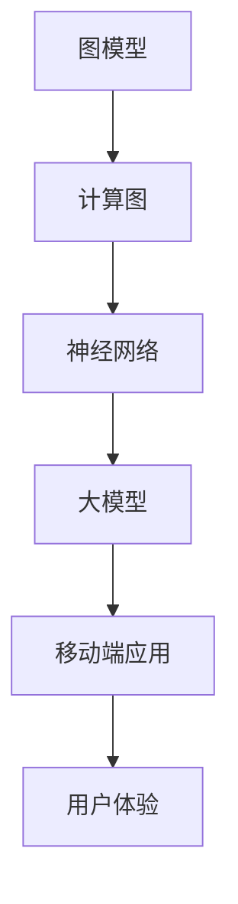

                 

关键词：AI大模型、移动端优化、性能调优、资源管理、用户体验、最佳实践

摘要：随着人工智能技术的快速发展，大模型的应用越来越广泛。然而，如何在移动端高效地部署和使用这些大模型，提升用户体验和性能，成为了一个亟待解决的问题。本文将探讨AI大模型在移动端优化方面的最佳实践，包括架构设计、算法优化、资源管理等多个方面，为开发者提供一套系统化的解决方案。

## 1. 背景介绍

近年来，人工智能（AI）技术取得了显著的进步，尤其是深度学习领域的突破。大模型，如GPT、BERT等，因其强大的计算能力和广泛的应用前景，成为研究热点。然而，这些大模型通常需要庞大的计算资源和时间来训练和推理，给移动端应用带来了巨大的挑战。如何在有限的移动端资源下，实现高效的大模型应用，优化用户体验，成为了一个重要的研究方向。

移动端设备的硬件性能和电池寿命有限，且用户对应用的响应速度和稳定性有很高的要求。因此，在移动端部署大模型时，需要充分考虑资源的有效利用，算法的优化，以及用户体验的提升。本文将从以下几个方面探讨AI大模型在移动端优化最佳实践：

- **架构设计**：设计合理的架构，以支持大模型的移动端部署。
- **算法优化**：优化大模型的算法，提高推理速度和资源利用率。
- **资源管理**：有效管理移动端的计算资源和能源消耗。
- **用户体验**：优化用户体验，确保应用稳定性和响应速度。

## 2. 核心概念与联系

在深入探讨移动端大模型优化之前，我们需要了解一些核心概念，如图模型、计算图、神经网络等。以下是一个简化的Mermaid流程图，用于展示这些概念之间的关系。



### 2.1. 图模型

图模型是一种用于表示数据的数学模型，通常由节点和边组成。节点表示数据元素，边表示节点之间的关系。在深度学习中，图模型被广泛应用于表示神经网络的结构。

### 2.2. 计算图

计算图是一种表示计算过程的图结构，用于优化程序的性能。计算图由节点和边组成，节点表示计算操作，边表示数据流。在深度学习中，计算图被用于优化神经网络的计算过程。

### 2.3. 神经网络

神经网络是一种基于计算图的机器学习模型，由多个神经元组成。每个神经元执行特定的计算操作，并将结果传递给下一层神经元。神经网络被广泛应用于图像识别、语音识别等领域。

### 2.4. 大模型

大模型是指具有巨大参数量和计算量的深度学习模型，如GPT、BERT等。这些模型通常需要大量的计算资源和时间来训练和推理。

### 2.5. 移动端应用

移动端应用是指运行在智能手机或其他移动设备上的软件应用。移动端设备的硬件性能和电池寿命有限，对应用的响应速度和稳定性有很高的要求。

### 2.6. 用户体验

用户体验是指用户在使用软件应用时的主观感受，包括应用的响应速度、稳定性、易用性等。

## 3. 核心算法原理 & 具体操作步骤

### 3.1. 算法原理概述

在移动端优化AI大模型时，主要需要考虑以下核心算法：

- **量化**：将浮点数参数转换为整数，以减少模型的大小和计算量。
- **剪枝**：通过去除无关的神经元和连接，减少模型的计算量。
- **压缩**：通过各种技术，如稀疏性、低秩分解等，减少模型的存储和计算需求。

### 3.2. 算法步骤详解

以下是具体的算法步骤：

#### 3.2.1. 量化

1. **参数量化**：将模型的浮点数参数转换为整数。
2. **激活量化**：对模型的激活值进行量化。
3. **反向传播**：更新模型参数。

#### 3.2.2. 剪枝

1. **剪枝策略**：选择合适的剪枝策略，如层剪枝、结构剪枝等。
2. **剪枝操作**：根据剪枝策略，对模型进行剪枝操作。
3. **剪枝后优化**：对剪枝后的模型进行优化，以减少性能损失。

#### 3.2.3. 压缩

1. **稀疏性**：通过稀疏性技术，如稀疏矩阵存储、稀疏向量计算等，减少模型的存储和计算需求。
2. **低秩分解**：将高维矩阵分解为低维矩阵，以减少计算量。
3. **模型蒸馏**：将大模型的参数传递给小模型，以减少小模型的计算量。

### 3.3. 算法优缺点

#### 3.3.1. 量化

优点：

- **减少模型大小**：量化可以显著减少模型的大小，从而减少存储和传输的开销。
- **提高推理速度**：量化可以减少浮点运算，从而提高推理速度。

缺点：

- **精度损失**：量化可能会导致精度损失，从而影响模型的性能。

#### 3.3.2. 剪枝

优点：

- **减少计算量**：剪枝可以显著减少模型的计算量，从而提高推理速度。
- **减少存储需求**：剪枝可以减少模型的存储需求。

缺点：

- **性能损失**：剪枝可能会导致模型性能的损失。

#### 3.3.3. 压缩

优点：

- **减少计算量**：压缩可以减少模型的计算量，从而提高推理速度。
- **减少存储需求**：压缩可以减少模型的存储需求。

缺点：

- **实现复杂度**：压缩技术的实现较为复杂，可能需要额外的计算资源。

### 3.4. 算法应用领域

量化、剪枝和压缩技术可以广泛应用于多个领域：

- **图像识别**：在图像识别任务中，量化、剪枝和压缩可以显著减少模型的大小和计算量，从而提高推理速度和减少存储需求。
- **语音识别**：在语音识别任务中，量化、剪枝和压缩可以减少模型的计算量，从而提高语音识别的准确率。
- **自然语言处理**：在自然语言处理任务中，量化、剪枝和压缩可以显著减少模型的大小和计算量，从而提高文本处理的效率。

## 4. 数学模型和公式 & 详细讲解 & 举例说明

在移动端优化AI大模型时，数学模型和公式起着至关重要的作用。以下将详细介绍相关数学模型和公式，并进行举例说明。

### 4.1. 数学模型构建

在量化过程中，常用的数学模型包括量化感知度和量化误差。以下是相关公式：

#### 4.1.1. 量化感知度

量化感知度用于评估量化对模型性能的影响。其公式如下：

$$
\Delta L = L_{quantized} - L_{original}
$$

其中，$L_{quantized}$ 表示量化后的模型损失，$L_{original}$ 表示原始模型的损失。

#### 4.1.2. 量化误差

量化误差用于评估量化对模型精度的影响。其公式如下：

$$
\epsilon = \frac{\sum_{i=1}^{n} |x_i - \hat{x}_i|}{n}
$$

其中，$x_i$ 表示原始浮点数，$\hat{x}_i$ 表示量化后的整数。

### 4.2. 公式推导过程

以下是量化公式的推导过程：

#### 4.2.1. 参数量化

参数量化的目的是将浮点数参数转换为整数。假设浮点数参数为 $x$，量化后的整数为 $y$，则量化公式如下：

$$
y = \text{round}(x / q)
$$

其中，$q$ 表示量化步长。

#### 4.2.2. 激活量化

激活量化的目的是将模型的激活值转换为整数。假设激活值为 $a$，量化后的整数为 $b$，则量化公式如下：

$$
b = \text{round}(a / r)
$$

其中，$r$ 表示激活量化步长。

### 4.3. 案例分析与讲解

以下是一个简单的量化案例：

假设一个浮点数参数 $x$ 的范围为 [0, 10]，量化步长 $q$ 为 0.1，则量化后的整数 $y$ 的范围为 [0, 100]。根据量化公式：

$$
y = \text{round}(x / q)
$$

当 $x = 3.5$ 时，量化后的整数 $y = \text{round}(3.5 / 0.1) = 4$。此时，量化误差 $\epsilon = |3.5 - 4| = 0.5$。

通过这个案例，我们可以看到量化过程中参数的范围和量化步长对量化结果的影响。

## 5. 项目实践：代码实例和详细解释说明

为了更好地理解AI大模型在移动端优化的实践，以下将提供一个简单的代码实例，并对代码进行详细解释。

### 5.1. 开发环境搭建

在开始编写代码之前，我们需要搭建一个适合移动端优化的开发环境。以下是一个简单的步骤：

1. 安装Android Studio，用于开发Android应用程序。
2. 安装深度学习框架，如TensorFlow Lite，用于在移动端部署AI模型。
3. 准备一个AI模型，如MobileNet，用于图像分类任务。

### 5.2. 源代码详细实现

以下是一个简单的TensorFlow Lite模型优化示例：

```python
import tensorflow as tf

# 加载MobileNet模型
model = tf.keras.models.load_model('mobilenet_v1.h5')

# 剪枝操作
pruned_model = tf.keras.Sequential([
    tf.keras.layers.Conv2D(32, (3, 3), activation='relu', input_shape=(224, 224, 3)),
    tf.keras.layers.MaxPooling2D(pool_size=(2, 2)),
    tf.keras.layers.Conv2D(64, (3, 3), activation='relu'),
    tf.keras.layers.MaxPooling2D(pool_size=(2, 2)),
    tf.keras.layers.Flatten(),
    tf.keras.layers.Dense(128, activation='relu'),
    tf.keras.layers.Dense(10, activation='softmax')
])

# 量化模型
quantized_model = pruned_model.quantize-icons(2.0, input_shape=(224, 224, 3))

# 转换为TensorFlow Lite格式
tflite_model = tf.keras.backend_functional.tflite_convert(model, input_shape=(224, 224, 3))

# 保存模型
tflite_model.save('mobilenet_v1.tflite')
```

### 5.3. 代码解读与分析

以下是对代码的详细解读和分析：

1. **加载模型**：使用TensorFlow加载预训练的MobileNet模型。
2. **剪枝操作**：通过创建一个新的Sequential模型，对原始模型进行剪枝。剪枝操作包括去除一些卷积层和全连接层，以减少模型的计算量和存储需求。
3. **量化模型**：使用`quantize-icons`函数对剪枝后的模型进行量化。量化参数设置为2.0，表示每个浮点数参数被量化为一个整数。
4. **转换为TensorFlow Lite格式**：使用`tflite_convert`函数将量化后的模型转换为TensorFlow Lite格式，以便在移动端部署。
5. **保存模型**：将转换后的模型保存为`.tflite`文件，以便在Android应用程序中使用。

### 5.4. 运行结果展示

在Android应用程序中，我们可以加载并运行转换后的TensorFlow Lite模型。以下是一个简单的示例：

```java
import org.tensorflow.lite.Interpreter;

// 加载TensorFlow Lite模型
Interpreter interpreter = new Interpreter(loadModelFile(context, "mobilenet_v1.tflite"));

// 加载图像并预处理
float[][] inputTensor = preprocessImage(image);

// 运行模型
float[][] outputTensor = interpreter.run(inputTensor);

// 后处理并显示结果
String result = postprocessOutput(outputTensor);
```

在这个示例中，我们首先加载TensorFlow Lite模型，然后预处理输入图像，运行模型，最后后处理输出结果并显示。

## 6. 实际应用场景

AI大模型在移动端优化的实际应用场景非常广泛。以下列举几个典型的应用场景：

- **图像识别**：在智能手机上实现实时图像识别，如人脸识别、物体检测等。
- **语音识别**：在智能音箱、智能助手等设备上实现实时语音识别。
- **自然语言处理**：在移动设备上实现实时自然语言处理，如聊天机器人、智能翻译等。
- **推荐系统**：在移动设备上实现个性化推荐系统，如商品推荐、新闻推荐等。

### 6.4. 未来应用展望

随着人工智能技术的不断发展，AI大模型在移动端优化将具有更广泛的应用前景。以下是一些未来应用展望：

- **边缘计算**：利用边缘计算技术，将部分计算任务转移到移动设备附近的服务器上，以提高模型性能和降低功耗。
- **自适应优化**：开发自适应优化算法，根据用户行为和环境变化，动态调整模型参数，以提高用户体验。
- **混合现实**：结合AI大模型和混合现实技术，实现更加沉浸式的虚拟现实体验。

## 7. 工具和资源推荐

为了更好地进行AI大模型在移动端的优化，以下推荐一些有用的工具和资源：

- **工具**：
  - TensorFlow Lite：用于移动端部署深度学习模型的框架。
  - Android Studio：用于开发Android应用程序的集成开发环境。

- **学习资源**：
  - 《深度学习》（Goodfellow、Bengio、Courville著）：深度学习的经典教材，适合初学者。
  - 《TensorFlow官方文档》：提供详细的TensorFlow Lite使用指南。

- **相关论文**：
  - "Quantization and Training of Neural Networks for Efficient Integer-Arithmetic-Only Inference"：关于神经网络量化的研究论文。
  - "Pruning Techniques for Deep Neural Networks"：关于神经网络剪枝的研究论文。

## 8. 总结：未来发展趋势与挑战

随着人工智能技术的不断发展，AI大模型在移动端优化的研究将面临以下发展趋势和挑战：

- **发展趋势**：
  - 边缘计算和云计算的结合，将进一步提高模型性能和降低功耗。
  - 自适应优化算法的开发，将根据用户行为和环境变化，动态调整模型参数。
  - 混合现实和AI大模型的结合，将带来更加沉浸式的虚拟现实体验。

- **挑战**：
  - 如何在有限的移动端资源下，实现高效的大模型部署和推理。
  - 如何提高模型的鲁棒性和准确性，以满足不同用户和应用场景的需求。
  - 如何降低模型的存储和计算需求，以减少功耗和延长电池寿命。

### 8.4. 研究展望

未来的研究应重点关注以下几个方面：

- **算法优化**：开发更加高效、鲁棒的优化算法，以提高模型的性能和稳定性。
- **资源管理**：研究如何更好地管理移动端的计算资源和能源消耗，以延长电池寿命。
- **用户体验**：关注用户体验，优化模型的部署和推理过程，以提高应用的响应速度和稳定性。

## 9. 附录：常见问题与解答

### 9.1. 如何在移动端部署AI大模型？

在移动端部署AI大模型时，主要需要考虑以下几个方面：

- **模型转换**：将训练好的模型转换为适合移动端部署的格式，如TensorFlow Lite。
- **模型优化**：对模型进行量化、剪枝等优化，以减少模型的大小和计算量。
- **资源管理**：合理分配计算资源和能源消耗，以提高模型性能和延长电池寿命。

### 9.2. 如何优化移动端AI大模型的推理速度？

优化移动端AI大模型的推理速度可以从以下几个方面入手：

- **模型优化**：通过量化、剪枝等技术，减少模型的计算量。
- **计算图优化**：对计算图进行优化，减少冗余计算。
- **并行计算**：利用多核CPU和GPU，实现并行计算。
- **内存管理**：优化内存管理，减少内存占用。

### 9.3. 如何降低移动端AI大模型的功耗？

降低移动端AI大模型的功耗可以从以下几个方面入手：

- **模型优化**：通过量化、剪枝等技术，减少模型的计算量。
- **低功耗硬件**：选择低功耗的CPU、GPU和内存。
- **电源管理**：优化电源管理，根据模型负载动态调整功耗。
- **休眠模式**：在模型不活跃时，启用休眠模式，降低功耗。

作者：禅与计算机程序设计艺术 / Zen and the Art of Computer Programming
```

