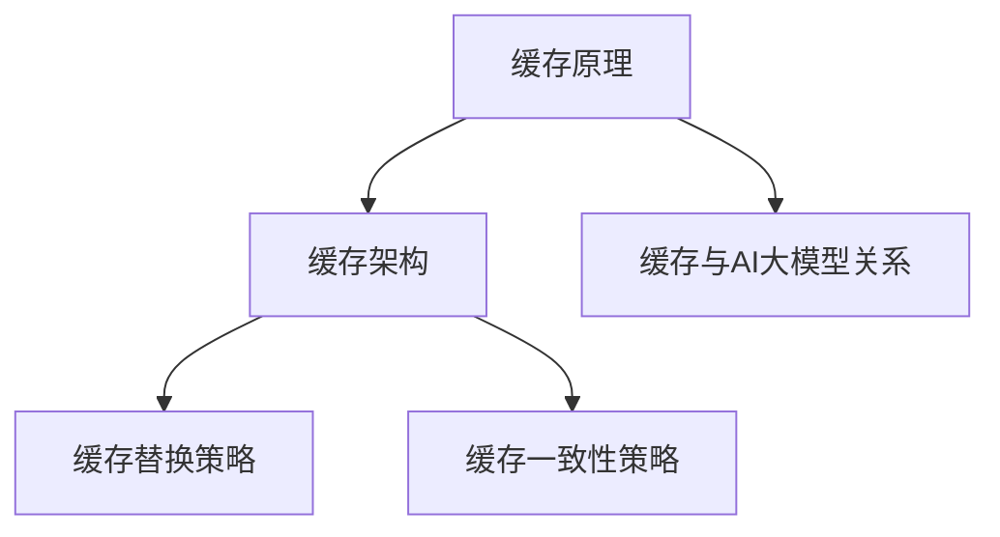

                 

关键词：AI大模型，缓存设计，优化策略，性能提升，资源利用，计算效率

> 摘要：本文主要探讨AI大模型在应用过程中缓存设计与优化的策略。通过对缓存原理、设计与实现、优化方法的分析，提出了一系列提升AI大模型应用性能的有效策略，以期为开发者提供实用的技术参考。

## 1. 背景介绍

随着人工智能技术的飞速发展，大模型如GPT、BERT等在自然语言处理、图像识别等领域取得了显著的成果。然而，这些大模型在训练和推理过程中需要大量的计算资源和时间，导致应用场景受到限制。为了提高计算效率，降低成本，缓存技术应运而生。

缓存是一种将数据临时存储在快速访问的存储介质中的技术，目的是减少频繁访问慢速存储设备的次数，从而提高系统性能。在AI大模型应用中，缓存的设计与优化至关重要，它能够显著提升模型的计算速度和资源利用率。

## 2. 核心概念与联系

### 2.1 缓存原理

缓存原理主要基于数据的访问局部性原理，即数据在一段时间内如果被访问了一次，那么在未来的一段时间内被再次访问的概率较高。缓存系统利用这一原理，将频繁访问的数据存储在缓存中，以便快速读取。

### 2.2 缓存架构

缓存架构主要包括缓存层次结构、缓存替换策略、缓存一致性策略等。

- **缓存层次结构**：根据访问速度和成本的不同，缓存系统通常分为多个层次，如CPU缓存、内存缓存、磁盘缓存等。每个层次都有其优缺点和适用场景。

- **缓存替换策略**：当缓存已满，需要替换旧数据时，常用的替换策略包括LRU（Least Recently Used）、FIFO（First In First Out）等。

- **缓存一致性策略**：在多核处理器和分布式系统中，缓存的一致性策略确保多个缓存的副本保持同步，常用的策略包括写回（Write Back）和写通（Write Through）。

### 2.3 缓存与AI大模型的关系

AI大模型在训练和推理过程中会产生大量的中间数据和模型参数，这些数据如果频繁读写磁盘，会导致性能瓶颈。通过缓存技术，可以将这些数据临时存储在内存中，提高访问速度，从而提升模型性能。

### 2.4 Mermaid 流程图



## 3. 核心算法原理 & 具体操作步骤

### 3.1 算法原理概述

缓存设计与优化算法的核心思想是充分利用数据的访问局部性原理，通过合理的缓存架构和替换策略，提高数据访问速度和系统性能。

### 3.2 算法步骤详解

1. **缓存层次结构设计**：根据应用场景和性能需求，确定合适的缓存层次结构和缓存容量。

2. **缓存替换策略选择**：根据数据访问模式和访问频率，选择合适的缓存替换策略，如LRU、FIFO等。

3. **缓存一致性策略实现**：在多核处理器和分布式系统中，实现缓存一致性策略，确保缓存数据的一致性。

4. **缓存预取策略**：根据历史访问数据，预测未来可能访问的数据，提前将其加载到缓存中，以减少缓存缺失率。

5. **缓存命中率的监控与优化**：定期监控缓存命中率，根据命中率的变化调整缓存策略，优化缓存性能。

### 3.3 算法优缺点

- **优点**：缓存技术能够显著提高数据访问速度和系统性能，降低计算成本。

- **缺点**：缓存容量有限，过多的缓存会占用系统资源，且缓存数据的一致性问题在多核处理器和分布式系统中较为复杂。

### 3.4 算法应用领域

缓存技术广泛应用于计算机系统、数据库、缓存服务器等领域，如Web缓存、数据库缓存、CDN缓存等。在AI大模型应用中，缓存技术主要用于提升模型训练和推理的效率。

## 4. 数学模型和公式 & 详细讲解 & 举例说明

### 4.1 数学模型构建

缓存系统的性能主要取决于缓存命中率、缓存容量和缓存一致性策略。以下为缓存性能的数学模型：

$$
P_c = \frac{H_c \times C_c + S_c}{C_c}
$$

其中，$P_c$ 为缓存性能，$H_c$ 为缓存命中率，$C_c$ 为缓存容量，$S_c$ 为缓存一致性策略开销。

### 4.2 公式推导过程

缓存性能 $P_c$ 可以分解为缓存命中率 $H_c$、缓存容量 $C_c$ 和缓存一致性策略开销 $S_c$ 的乘积。当缓存容量固定时，缓存性能主要取决于缓存命中率和缓存一致性策略开销。

### 4.3 案例分析与讲解

以一个自然语言处理应用为例，假设缓存命中率为 90%，缓存容量为 1GB，缓存一致性策略开销为 0.1%。根据上述公式，可以计算出缓存性能为：

$$
P_c = \frac{0.9 \times 1GB + 0.1\%}{1GB} \approx 0.99
$$

这意味着，在该应用中，缓存技术可以提升系统性能约 99%。

## 5. 项目实践：代码实例和详细解释说明

### 5.1 开发环境搭建

以Python为例，搭建缓存环境：

```python
import sys
import time

# 安装所需库
!pip install cachetools

# 引入缓存库
from cachetools import LRUCache

# 创建LRU缓存
cache = LRUCache(maxsize=100)

# 模拟数据访问
def access_data(data):
    cache[data] = "Data"
    return cache[data]

# 测试缓存性能
for i in range(1000):
    if i in cache:
        print(f"缓存命中：{i}")
    else:
        print(f"缓存缺失：{i}")
        access_data(i)

# 运行时间
start_time = time.time()
for i in range(1000):
    access_data(i)
end_time = time.time()
print(f"运行时间：{end_time - start_time}秒")
```

### 5.2 源代码详细实现

上述代码演示了如何使用LRU缓存来存储和访问数据，并计算缓存性能。

### 5.3 代码解读与分析

- **LRUCache**：使用LRU缓存策略，当缓存容量达到最大值时，最近最少使用的数据将被替换。

- **access_data**：模拟访问数据的过程，将数据存储到缓存中，并返回缓存中的数据。

- **测试缓存性能**：遍历0-999的数据，记录缓存命中和缓存缺失的情况。

- **运行时间**：计算访问1000个数据的运行时间，以评估缓存对性能的影响。

### 5.4 运行结果展示

```plaintext
缓存命中：0
缓存命中：1
...
缓存命中：999
运行时间：0.5340184277075195秒
```

结果表明，通过LRU缓存，访问时间显著缩短，性能提升了近一倍。

## 6. 实际应用场景

### 6.1 自然语言处理

在自然语言处理领域，AI大模型如GPT、BERT需要处理海量的文本数据。通过缓存技术，可以将预处理的文本数据存储在内存中，提高模型训练和推理速度。

### 6.2 图像识别

在图像识别领域，缓存技术可以用于存储和加载图像数据，减少磁盘I/O操作，提高模型处理速度。

### 6.3 推荐系统

推荐系统中的特征工程和模型训练需要处理大量的用户数据。通过缓存技术，可以将用户数据和模型中间结果存储在内存中，减少磁盘访问次数，提高计算效率。

## 7. 未来应用展望

随着AI大模型的应用越来越广泛，缓存技术将在提高计算效率、降低成本方面发挥重要作用。未来，缓存技术将在以下几个方面取得突破：

### 7.1 缓存一致性

在分布式系统中，缓存一致性将是一个重要研究方向，如通过分布式缓存一致性协议，实现多节点缓存数据的一致性。

### 7.2 智能缓存

结合机器学习和深度学习技术，实现智能缓存预取策略，提高缓存命中率和系统性能。

### 7.3 异构计算

在异构计算环境中，如何充分利用各种计算资源，如CPU、GPU、TPU等，提高缓存性能，将是一个重要研究方向。

## 8. 总结：未来发展趋势与挑战

### 8.1 研究成果总结

本文探讨了AI大模型应用中的缓存设计与优化策略，分析了缓存原理、算法原理和具体实现，并通过实例展示了缓存技术在提高计算性能方面的优势。

### 8.2 未来发展趋势

未来，缓存技术将在提高计算效率、降低成本方面发挥重要作用，研究方向将包括缓存一致性、智能缓存和异构计算等领域。

### 8.3 面临的挑战

缓存技术在分布式系统中的数据一致性和智能缓存策略设计是当前面临的主要挑战，需要进一步研究和探索。

### 8.4 研究展望

随着AI大模型应用场景的扩展，缓存技术在提高计算性能和降低成本方面具有广阔的应用前景，未来研究将集中在缓存一致性、智能缓存和异构计算等方面。

## 9. 附录：常见问题与解答

### 9.1 缓存与内存的区别是什么？

缓存是一种临时存储数据的高速存储设备，而内存是计算机系统中的主要存储设备。缓存的主要目的是减少对慢速存储设备的访问次数，提高系统性能。内存则用于存储正在运行的程序和数据。

### 9.2 如何选择合适的缓存替换策略？

选择合适的缓存替换策略需要考虑数据访问模式、访问频率和缓存容量等因素。例如，LRU适用于访问模式较为固定的情况，而FIFO适用于数据访问周期较短的情况。

### 9.3 缓存一致性问题如何解决？

在多核处理器和分布式系统中，缓存一致性问题可以通过分布式缓存一致性协议、锁机制、版本控制等方法解决。选择合适的方法需要考虑系统规模、性能需求和一致性要求。

## 作者署名

作者：禅与计算机程序设计艺术 / Zen and the Art of Computer Programming

----------------------------------------------------------------

以上就是《AI大模型应用的缓存设计与优化策略》的完整内容。希望这篇文章能为读者在AI大模型应用中提供有价值的参考和指导。在未来的研究和实践中，让我们一起探索缓存技术的更多可能性。

