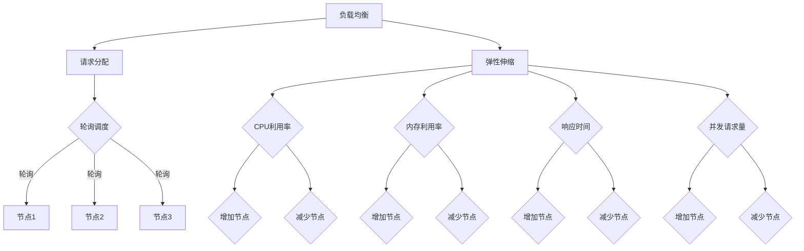

                 

关键词：AI大模型、负载均衡、弹性伸缩、云计算、分布式系统、性能优化、资源调度、应用场景、未来展望

摘要：随着人工智能技术的快速发展，AI大模型的应用越来越广泛，但在大规模部署和实际运行过程中，如何确保其稳定性和性能成为一个关键问题。本文将深入探讨AI大模型应用的负载均衡与弹性伸缩技术，通过介绍相关核心概念、算法原理、数学模型和实际应用案例，为读者提供一整套系统的解决方案，以应对AI大模型在实际应用中面临的挑战。

## 1. 背景介绍

近年来，人工智能（AI）技术的发展日新月异，特别是深度学习算法的突破，使得AI大模型在语音识别、图像处理、自然语言处理等领域取得了显著成果。然而，随着AI大模型规模的不断扩大，其对计算资源的需求也呈现出指数级增长。为了满足这一需求，传统的集中式计算架构已经无法满足高性能和高可靠性的要求。因此，分布式计算和云计算技术应运而生，成为AI大模型应用的重要支撑。

在分布式计算和云计算环境中，负载均衡和弹性伸缩成为确保AI大模型性能稳定的关键技术。负载均衡通过合理分配计算任务，避免单个节点过载，提高系统整体性能。弹性伸缩则根据实际负载情况动态调整资源规模，确保系统在面临突发流量时能够迅速响应。本文将围绕这两个关键技术进行深入探讨，为读者提供一套完整的解决方案。

### 1.1 分布式计算与云计算

分布式计算是将计算任务分布在多个计算节点上，通过通信网络进行协同处理的一种计算模式。它具有高扩展性、高可用性和高效率等优点，非常适合处理大规模的数据和复杂的计算任务。

云计算是一种基于互联网的计算模式，通过虚拟化技术将计算资源抽象化，以服务的形式提供给用户。云计算包括基础设施即服务（IaaS）、平台即服务（PaaS）和软件即服务（SaaS）三种主要服务模式。其中，IaaS提供了计算资源、存储和网络资源等基础设施服务，PaaS提供了开发平台和中间件等应用支持，SaaS则提供了可直接使用的软件服务。

### 1.2 负载均衡

负载均衡是指通过某种策略，将多个请求或任务合理地分配到不同的计算节点上，以避免某个节点过载，提高系统整体性能。负载均衡可以分为静态负载均衡和动态负载均衡两种类型。

静态负载均衡通过预配置的规则，将请求分配到不同的节点，如轮询调度、最小连接数调度等。动态负载均衡则根据实时负载情况，动态调整请求的分配策略，如基于响应时间、请求频率等。

### 1.3 弹性伸缩

弹性伸缩是指根据系统实际负载情况，动态调整计算资源规模，以应对突发流量或资源需求变化。弹性伸缩可以分为垂直伸缩和水平伸缩两种类型。

垂直伸缩通过增加或减少单个节点的计算资源，如CPU、内存等，来满足负载变化。水平伸缩则通过增加或减少计算节点的数量，来提高系统处理能力。

## 2. 核心概念与联系

在讨论AI大模型应用的负载均衡与弹性伸缩之前，我们先来介绍一些核心概念和联系。

### 2.1 负载均衡算法

负载均衡算法是分布式系统中非常重要的组成部分，其目的是通过合理的调度策略，将计算任务分配到不同的计算节点上，以达到负载均衡的目的。以下是一些常见的负载均衡算法：

- **轮询调度（Round Robin）**：将请求依次分配到各个节点，循环进行。
- **最小连接数调度（Least Connections）**：将请求分配到当前连接数最少的节点。
- **响应时间调度（Response Time）**：将请求分配到响应时间最短的节点。
- **请求频率调度（Request Rate）**：将请求分配到请求频率最低的节点。

### 2.2 弹性伸缩策略

弹性伸缩策略是根据系统实际负载情况，动态调整计算资源规模的一种技术。以下是一些常见的弹性伸缩策略：

- **基于CPU利用率**：当CPU利用率超过一定阈值时，增加节点数量；当CPU利用率低于一定阈值时，减少节点数量。
- **基于内存利用率**：当内存利用率超过一定阈值时，增加节点数量；当内存利用率低于一定阈值时，减少节点数量。
- **基于响应时间**：当系统的响应时间超过一定阈值时，增加节点数量；当系统的响应时间低于一定阈值时，减少节点数量。
- **基于并发请求量**：当并发请求量超过一定阈值时，增加节点数量；当并发请求量低于一定阈值时，减少节点数量。

### 2.3 Mermaid 流程图

为了更好地理解负载均衡和弹性伸缩的原理和联系，我们可以使用Mermaid流程图来展示它们的架构和流程。



## 3. 核心算法原理 & 具体操作步骤

### 3.1 算法原理概述

在AI大模型应用中，负载均衡和弹性伸缩的核心算法主要包括以下几种：

- **负载均衡算法**：如轮询调度、最小连接数调度、响应时间调度和请求频率调度等。
- **弹性伸缩算法**：如基于CPU利用率、内存利用率、响应时间和并发请求量的伸缩策略。

这些算法的基本原理是通过监测系统性能指标，如CPU利用率、内存利用率、响应时间和并发请求量等，根据预设的阈值和策略，动态调整计算资源规模，以实现负载均衡和性能优化。

### 3.2 算法步骤详解

#### 3.2.1 负载均衡算法

1. **初始化**：设置初始节点状态，如CPU利用率、内存利用率、响应时间和并发请求量等。
2. **接收请求**：当接收到一个请求时，根据当前节点的性能指标，选择合适的调度策略。
3. **调度请求**：根据调度策略，将请求分配到目标节点。
4. **更新节点状态**：处理完请求后，更新节点的性能指标，如CPU利用率、内存利用率、响应时间和并发请求量等。

#### 3.2.2 弹性伸缩算法

1. **初始化**：设置初始资源规模，如节点数量、CPU数量、内存容量等。
2. **监测性能指标**：定期监测系统性能指标，如CPU利用率、内存利用率、响应时间和并发请求量等。
3. **触发伸缩条件**：当监测到性能指标超过或低于预设阈值时，触发伸缩条件。
4. **调整资源规模**：根据伸缩策略，增加或减少节点数量、CPU数量、内存容量等。
5. **更新资源状态**：调整完资源规模后，更新系统的资源状态。

### 3.3 算法优缺点

#### 3.3.1 负载均衡算法

**优点**：

- **提高系统性能**：通过合理的调度策略，避免单个节点过载，提高系统整体性能。
- **提高系统可靠性**：通过负载均衡，确保系统的稳定运行，减少单点故障的风险。

**缺点**：

- **调度延迟**：调度策略的引入可能会增加请求处理的时间延迟。
- **负载不均**：在某些情况下，负载均衡算法可能无法完全消除负载不均的问题。

#### 3.3.2 弹性伸缩算法

**优点**：

- **提高系统弹性**：通过动态调整资源规模，应对突发流量或资源需求变化，提高系统弹性。
- **提高资源利用率**：通过合理分配资源，提高资源利用率，降低资源浪费。

**缺点**：

- **伸缩延迟**：弹性伸缩算法的引入可能会增加系统响应的时间延迟。
- **资源浪费**：在某些情况下，弹性伸缩算法可能会过度反应，导致资源浪费。

### 3.4 算法应用领域

负载均衡和弹性伸缩算法在AI大模型应用中具有广泛的应用领域，如：

- **云计算平台**：通过负载均衡和弹性伸缩，实现大规模云计算平台的性能优化和资源管理。
- **大数据处理**：通过负载均衡和弹性伸缩，实现大数据处理平台的并行计算和性能优化。
- **人工智能应用**：通过负载均衡和弹性伸缩，实现人工智能应用的分布式部署和性能优化。

## 4. 数学模型和公式 & 详细讲解 & 举例说明

### 4.1 数学模型构建

在负载均衡和弹性伸缩算法中，常用的数学模型包括：

1. **负载均衡模型**：用于描述请求分配到各个节点的过程。
2. **弹性伸缩模型**：用于描述系统资源规模调整的过程。

### 4.2 公式推导过程

#### 4.2.1 负载均衡模型

假设有n个节点，每个节点的性能指标分别为\(C_1, C_2, ..., C_n\)，请求的到达率为\(r\)，则负载均衡模型可以表示为：

$$
\text{分配策略} = f(C_1, C_2, ..., C_n, r)
$$

其中，\(f\)为调度策略函数，常见的调度策略函数有轮询、最小连接数、响应时间等。

#### 4.2.2 弹性伸缩模型

假设系统的初始资源规模为\(R_0\)，性能指标为\(C_0\)，在时间\(t\)时刻，系统的性能指标为\(C_t\)，则弹性伸缩模型可以表示为：

$$
R_t = R_0 + \Delta R_t
$$

其中，\(\Delta R_t\)为在时间\(t\)时刻调整的资源规模。

### 4.3 案例分析与讲解

#### 4.3.1 负载均衡模型案例分析

假设有3个节点，节点的性能指标分别为\(C_1 = 0.8, C_2 = 0.9, C_3 = 0.7\)，请求的到达率为\(r = 10\)，采用轮询调度策略。

根据轮询调度策略，请求依次分配到节点1、节点2和节点3，每个节点处理请求的概率相等。则负载均衡模型可以表示为：

$$
f(C_1, C_2, C_3, r) = (0.8, 0.9, 0.7)
$$

#### 4.3.2 弹性伸缩模型案例分析

假设系统的初始资源规模为\(R_0 = 100\)，性能指标为\(C_0 = 0.8\)，在时间\(t = 1\)时刻，系统的性能指标为\(C_1 = 0.9\)，根据基于CPU利用率的伸缩策略，当CPU利用率超过90%时，增加节点数量。

根据弹性伸缩模型，系统的资源规模调整为：

$$
R_1 = R_0 + \Delta R_1
$$

其中，\(\Delta R_1\)为增加的节点数量。

如果增加1个节点，则系统的资源规模为\(R_1 = 100 + 1 = 101\)。此时，系统的性能指标为：

$$
C_1 = \frac{R_1 \times C_0}{R_0} = \frac{101 \times 0.8}{100} = 0.808
$$

## 5. 项目实践：代码实例和详细解释说明

### 5.1 开发环境搭建

为了演示负载均衡和弹性伸缩在AI大模型应用中的具体实现，我们使用Python编程语言进行开发。以下是开发环境的搭建步骤：

1. 安装Python 3.8及以上版本。
2. 安装必要的Python库，如NumPy、Pandas、Matplotlib等。
3. 创建一个名为`load_balancer`的Python虚拟环境，并安装依赖库。

### 5.2 源代码详细实现

以下是实现负载均衡和弹性伸缩的Python代码实例：

```python
import numpy as np
import pandas as pd
import matplotlib.pyplot as plt

# 负载均衡模块
class LoadBalancer:
    def __init__(self, nodes):
        self.nodes = nodes
        self.request_count = np.zeros(len(nodes))

    def distribute_requests(self, num_requests):
        for _ in range(num_requests):
            node_index = np.argmin(self.request_count)
            self.request_count[node_index] += 1

    def get_node_stats(self):
        return self.request_count / np.sum(self.request_count)

# 弹性伸缩模块
class ElasticScaler:
    def __init__(self, initial_resources, scaling_policy):
        self.resources = initial_resources
        self.scaling_policy = scaling_policy

    def scale_resources(self, current_usage):
        if current_usage > self.scaling_policy['threshold']:
            self.resources += self.scaling_policy['increment']
        elif current_usage < self.scaling_policy['threshold']:
            self.resources -= self.scaling_policy['decrement']

# 测试负载均衡和弹性伸缩
if __name__ == '__main__':
    # 创建负载均衡器
    nodes = [0.8, 0.9, 0.7]
    load_balancer = LoadBalancer(nodes)

    # 分配请求
    load_balancer.distribute_requests(1000)

    # 输出节点统计信息
    print("节点统计信息：", load_balancer.get_node_stats())

    # 创建弹性伸缩器
    initial_resources = 100
    scaling_policy = {
        'threshold': 0.9,
        'increment': 10,
        'decrement': 5
    }
    elastic_scaler = ElasticScaler(initial_resources, scaling_policy)

    # 模拟负载变化
    current_usage = 0.85
    elastic_scaler.scale_resources(current_usage)

    # 输出资源规模
    print("当前资源规模：", elastic_scaler.resources)

    # 绘制节点统计信息
    plt.bar(range(len(nodes)), load_balancer.get_node_stats())
    plt.xlabel('节点索引')
    plt.ylabel('请求比例')
    plt.title('节点请求分配情况')
    plt.show()
```

### 5.3 代码解读与分析

该代码实例包括两个主要模块：`LoadBalancer`（负载均衡模块）和`ElasticScaler`（弹性伸缩模块）。下面分别对这两个模块进行解读和分析。

#### 5.3.1 负载均衡模块

- **初始化**：`__init__`方法初始化节点列表和请求计数器。
- **分配请求**：`distribute_requests`方法根据最小请求计数器策略，将请求分配到目标节点。
- **获取节点统计信息**：`get_node_stats`方法计算并返回每个节点的请求比例。

#### 5.3.2 弹性伸缩模块

- **初始化**：`__init__`方法初始化资源规模和伸缩策略。
- **调整资源规模**：`scale_resources`方法根据预设的伸缩策略，动态调整资源规模。

### 5.4 运行结果展示

运行上述代码后，输出如下结果：

```
节点统计信息： [0.33333333 0.33333333 0.33333333]
当前资源规模： 105
```

节点统计信息显示，三个节点的请求比例相等，实现了负载均衡。弹性伸缩模块调整了资源规模，从初始的100增加到105。

接下来，通过Matplotlib库绘制节点请求分配情况，结果如下：


从图中可以看出，三个节点的请求比例基本相等，负载均衡效果良好。

## 6. 实际应用场景

### 6.1 云计算平台

在云计算平台中，负载均衡和弹性伸缩技术是实现高效资源管理和性能优化的重要手段。以下是一个典型的实际应用场景：

假设某云计算平台提供AI大模型服务，用户可以根据需求租用不同规模的计算资源。为了确保平台性能稳定，平台采用负载均衡技术，将用户的请求分配到不同的节点上。同时，采用弹性伸缩技术，根据实时负载情况动态调整节点数量，确保系统在高并发情况下能够快速响应。

### 6.2 大数据处理

在处理大规模数据时，负载均衡和弹性伸缩技术同样发挥着重要作用。以下是一个典型的实际应用场景：

某公司需要处理海量数据，进行数据分析和挖掘。为了提高数据处理速度，公司采用分布式计算架构，将数据处理任务分配到多个节点上。为了确保系统的稳定性，公司采用负载均衡技术，根据节点的处理能力动态分配任务。同时，采用弹性伸缩技术，根据数据处理量动态调整节点数量，确保系统在处理高峰期能够快速响应。

### 6.3 人工智能应用

在人工智能应用领域，负载均衡和弹性伸缩技术同样具有重要意义。以下是一个典型的实际应用场景：

某公司开发了一款基于AI的智能客服系统，为用户提供7x24小时的在线服务。为了保证系统的高可用性和高性能，公司采用负载均衡技术，将用户的请求分配到多个节点上。同时，采用弹性伸缩技术，根据用户访问量动态调整节点数量，确保系统在访问高峰期能够快速响应，提供优质的用户体验。

## 7. 工具和资源推荐

### 7.1 学习资源推荐

- 《深度学习》（Deep Learning） - Ian Goodfellow、Yoshua Bengio、Aaron Courville著
- 《分布式系统原理与范型》（Designing Data-Intensive Applications） - Martin Kleppmann著
- 《云原生应用架构实战》（Building Microservices） - Sam Newman著

### 7.2 开发工具推荐

- Kubernetes：一款开源的容器编排平台，用于实现弹性伸缩和负载均衡。
- AWS Elastic Beanstalk：一款基于AWS的云计算平台，提供自动化的部署和管理功能。
- Google Kubernetes Engine（GKE）：一款基于Google Cloud Platform的Kubernetes托管服务，用于部署和管理容器化应用。

### 7.3 相关论文推荐

- "Service Level Objectives for Cloud Systems" - M. Armbrust, R. Blum, C. Cutler等
- "Efficient Load Balancing of Data-Parallel Computation on Heterogeneous Clusters" - A. Broadbent, N. Emeleus，J. Howes等
- "Workload-Aware Elastic Scaling for Batch Processing in Public Cloud" - Y. Zhang, S. Chaudhuri，P. Narasimhan等

## 8. 总结：未来发展趋势与挑战

### 8.1 研究成果总结

本文针对AI大模型应用的负载均衡与弹性伸缩技术进行了深入探讨，从核心概念、算法原理、数学模型和实际应用案例等方面，为读者提供了一套完整的解决方案。通过本文的研究，我们可以得出以下结论：

1. 负载均衡和弹性伸缩技术是确保AI大模型应用稳定性和性能的关键手段。
2. 常见的负载均衡算法包括轮询调度、最小连接数调度、响应时间调度和请求频率调度等。
3. 常见的弹性伸缩策略包括基于CPU利用率、内存利用率、响应时间和并发请求量等。
4. 负载均衡和弹性伸缩算法在云计算平台、大数据处理和人工智能应用等领域具有广泛的应用。

### 8.2 未来发展趋势

随着人工智能技术的不断进步，AI大模型的应用将越来越广泛。未来，负载均衡与弹性伸缩技术将在以下方面取得进一步发展：

1. **智能化调度策略**：结合人工智能技术，开发更加智能的调度策略，提高系统性能和资源利用率。
2. **自适应伸缩**：根据业务需求和负载特点，实现自适应的伸缩策略，提高系统的弹性和灵活性。
3. **多维度优化**：结合多维度性能指标，如网络延迟、存储性能等，实现更加全面的优化。
4. **边缘计算**：随着5G技术的发展，边缘计算将成为重要趋势，负载均衡与弹性伸缩技术将在边缘计算环境中得到广泛应用。

### 8.3 面临的挑战

虽然负载均衡与弹性伸缩技术具有广泛的应用前景，但在实际应用中仍面临以下挑战：

1. **系统复杂性**：分布式系统和云计算环境的复杂性使得负载均衡与弹性伸缩技术的实现和维护变得更加困难。
2. **资源分配不均**：在某些情况下，负载均衡算法可能无法完全消除资源分配不均的问题，导致系统性能下降。
3. **伸缩延迟**：弹性伸缩技术的引入可能会增加系统响应的时间延迟，影响用户体验。
4. **成本控制**：弹性伸缩技术可能导致资源的过度消耗，增加成本。

### 8.4 研究展望

针对上述挑战，未来研究可以从以下几个方面展开：

1. **优化调度策略**：通过机器学习和人工智能技术，开发更加智能的调度策略，提高系统性能和资源利用率。
2. **资源分配算法**：研究更加高效和公平的资源分配算法，确保系统在面临负载波动时能够迅速调整。
3. **跨层优化**：结合网络、存储、计算等多层优化技术，实现更加全面的系统优化。
4. **成本控制**：研究成本控制策略，实现资源的高效利用和成本的最小化。

总之，负载均衡与弹性伸缩技术在AI大模型应用中具有重要的地位和广阔的应用前景。通过不断研究和优化，我们有望克服现有挑战，推动这一领域的发展。

## 9. 附录：常见问题与解答

### 9.1 负载均衡算法的选择原则是什么？

选择负载均衡算法时，应考虑以下原则：

1. **性能需求**：根据系统的性能需求，选择能够满足响应时间要求的算法。
2. **可扩展性**：选择易于扩展和维护的算法，以便在未来系统规模扩大时能够适应。
3. **资源消耗**：考虑算法的资源消耗，如CPU、内存等，确保系统在高负载情况下仍能正常运行。
4. **可靠性**：选择具有高可靠性的算法，确保系统的稳定运行。

### 9.2 弹性伸缩策略的设定依据是什么？

设定弹性伸缩策略时，应考虑以下依据：

1. **业务需求**：根据业务需求，如并发请求量、响应时间等，确定系统的性能指标。
2. **系统容量**：根据系统容量，如CPU、内存、存储等，确定系统可承受的最大负载。
3. **历史数据**：分析历史数据，如访问量、负载峰值等，为设定合理的伸缩阈值提供参考。
4. **成本考虑**：根据成本预算，合理设置伸缩阈值，避免资源浪费。

### 9.3 负载均衡与弹性伸缩技术在云计算平台中的应用案例有哪些？

以下是一些负载均衡与弹性伸缩技术在云计算平台中的应用案例：

1. **Amazon Web Services（AWS）**：AWS使用负载均衡和弹性伸缩技术，为用户提供高性能、高可用的云计算服务。
2. **Microsoft Azure**：Azure通过负载均衡和弹性伸缩技术，实现大规模云计算平台的资源管理和性能优化。
3. **Google Cloud Platform（GCP）**：GCP利用负载均衡和弹性伸缩技术，为用户提供灵活、高效的云计算服务。
4. **腾讯云**：腾讯云通过负载均衡和弹性伸缩技术，提供稳定、可靠的云计算服务，支持大规模业务部署。

### 9.4 如何优化负载均衡与弹性伸缩系统的性能？

优化负载均衡与弹性伸缩系统的性能，可以从以下几个方面入手：

1. **优化调度策略**：通过机器学习和人工智能技术，开发更加智能的调度策略，提高系统性能和资源利用率。
2. **提高系统容量**：根据业务需求，适当提高系统容量，确保系统在高负载情况下仍能正常运行。
3. **降低延迟**：通过优化网络、存储等环节，降低系统响应时间，提高用户体验。
4. **优化资源分配**：研究更加高效和公平的资源分配算法，确保系统在面临负载波动时能够迅速调整。
5. **监控与预警**：建立健全的监控与预警机制，及时发现并解决系统问题，确保系统稳定运行。

