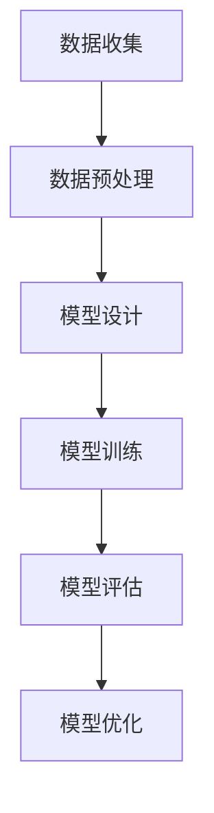

                 

关键词：大模型应用、质量保障、测试策略、人工智能

> 摘要：本文旨在探讨人工智能大模型应用的质量保障与测试策略。通过对当前大模型应用背景的介绍，文章深入分析了质量保障与测试的核心概念、方法以及工具。文章首先概述了大模型的基本原理，然后详细讨论了质量保障与测试的关键环节，包括测试数据的选择、测试方法的设计、测试指标的确定、测试结果的评估以及质量改进的步骤。最后，文章提出了未来发展的趋势和面临的挑战，并给出了相关工具和资源的推荐。

## 1. 背景介绍

近年来，随着人工智能技术的飞速发展，大模型在自然语言处理、计算机视觉、语音识别等领域取得了显著成果。大模型，顾名思义，是指具有大规模参数和庞大计算量的深度学习模型。这些模型通常通过海量数据训练，能够实现高度复杂的任务，从而显著提升人工智能系统的性能。

然而，大模型的广泛应用也带来了质量保障与测试的挑战。一方面，大模型的高度复杂性和非线性的特性使得传统的测试方法难以有效评估其性能和可靠性；另一方面，大模型的训练过程和数据依赖性也使得测试数据的选择和设计变得尤为关键。

因此，如何在大模型应用过程中确保其质量，并制定有效的测试策略，成为当前人工智能领域亟待解决的重要问题。本文将针对这些问题展开讨论，并介绍一些实用的测试方法和工具。

## 2. 核心概念与联系

### 大模型的基本原理

大模型，尤其是深度学习模型，其核心思想是通过多层神经网络的非线性变换，将输入数据映射到预期的输出。大模型的训练过程涉及以下关键步骤：

1. **数据收集**：从各种数据源收集大量样本，包括文本、图像、音频等。
2. **数据预处理**：对原始数据进行清洗、归一化等处理，以便于模型训练。
3. **模型设计**：设计多层神经网络结构，包括输入层、隐藏层和输出层。
4. **模型训练**：使用大量标注数据进行模型的参数优化，通常采用反向传播算法。
5. **模型评估**：使用测试数据集评估模型的性能，包括准确率、召回率、F1值等指标。
6. **模型优化**：根据评估结果调整模型结构或参数，以提升性能。

### 质量保障与测试的核心概念

在大模型应用中，质量保障和测试是确保模型性能和可靠性的关键环节。质量保障涉及模型设计的合理性、训练数据的可靠性、参数优化的有效性等方面。而测试则是对模型在实际应用中的表现进行评估，以发现潜在的问题和不足。

### Mermaid 流程图



### 质量保障与测试的联系

质量保障和测试是相辅相成的。质量保障为测试提供了基础，确保测试数据的可靠性和模型的合理性；而测试则通过评估模型的性能，为质量保障提供反馈，指导模型优化。

## 3. 核心算法原理 & 具体操作步骤

### 3.1 算法原理概述

大模型的质量保障与测试主要依赖于深度学习技术。深度学习通过多层神经网络的堆叠，模拟人脑的信息处理过程，实现对复杂数据的高效处理和模式识别。

### 3.2 算法步骤详解

1. **数据收集与预处理**：收集海量数据，并进行预处理，包括数据清洗、归一化、标签分配等。
2. **模型设计**：设计多层神经网络结构，包括输入层、隐藏层和输出层，以及激活函数、优化器等。
3. **模型训练**：使用训练数据集对模型进行训练，优化模型参数，通常采用反向传播算法。
4. **模型评估**：使用测试数据集对模型进行评估，计算准确率、召回率、F1值等指标。
5. **模型优化**：根据评估结果调整模型结构或参数，以提升性能。

### 3.3 算法优缺点

优点：
- **强大的建模能力**：通过多层神经网络的非线性变换，能够处理复杂数据和任务。
- **自适应性**：模型能够根据训练数据自动调整参数，适应不同场景。

缺点：
- **计算复杂度高**：大模型的训练过程需要大量的计算资源和时间。
- **对数据依赖性强**：模型的性能高度依赖于训练数据的质量和数量。

### 3.4 算法应用领域

大模型在多个领域取得了显著的应用成果，包括：
- **自然语言处理**：文本分类、机器翻译、情感分析等。
- **计算机视觉**：图像识别、目标检测、人脸识别等。
- **语音识别**：语音识别、语音合成等。
- **推荐系统**：基于内容的推荐、协同过滤等。

## 4. 数学模型和公式 & 详细讲解 & 举例说明

### 4.1 数学模型构建

在深度学习中，数学模型主要涉及以下几个方面：

1. **前向传播**：输入数据通过多层神经网络进行非线性变换，生成输出。
2. **反向传播**：计算输出与预期结果之间的误差，并更新模型参数。
3. **损失函数**：用于衡量模型预测结果与真实结果之间的差距，常见的损失函数有均方误差（MSE）、交叉熵等。

### 4.2 公式推导过程

以多层感知器（MLP）为例，其前向传播过程可表示为：

$$
\begin{aligned}
    z^{(l)} &= \sigma(W^{(l)} \cdot a^{(l-1)} + b^{(l)}) \\
    a^{(l)} &= \sigma(z^{(l)})
\end{aligned}
$$

其中，$a^{(l)}$ 表示第$l$层的激活值，$z^{(l)}$ 表示第$l$层的输入值，$W^{(l)}$ 和 $b^{(l)}$ 分别表示第$l$层的权重和偏置，$\sigma$ 表示激活函数。

反向传播过程中，误差可以通过链式法则进行传递：

$$
\begin{aligned}
    \delta^{(l)} &= \sigma'(z^{(l)}) \cdot (z^{(l)} - y) \\
    \frac{\partial J}{\partial W^{(l)}} &= a^{(l-1)} \cdot \delta^{(l)} \\
    \frac{\partial J}{\partial b^{(l)}} &= \delta^{(l)}
\end{aligned}
$$

其中，$J$ 表示损失函数，$\sigma'$ 表示激活函数的导数。

### 4.3 案例分析与讲解

假设我们有一个二分类问题，使用多层感知器进行分类。训练数据集包含1000个样本，每个样本有10个特征。我们定义损失函数为均方误差（MSE）：

$$
MSE = \frac{1}{m} \sum_{i=1}^{m} (y_i - \hat{y}_i)^2
$$

其中，$m$ 表示样本数量，$y_i$ 表示第$i$个样本的真实标签，$\hat{y}_i$ 表示第$i$个样本的预测标签。

我们设计一个包含2个隐藏层，每层100个神经元的MLP模型。在训练过程中，我们使用随机梯度下降（SGD）进行参数优化。训练过程中，损失函数逐渐减小，最终达到收敛条件。

## 5. 项目实践：代码实例和详细解释说明

### 5.1 开发环境搭建

在本项目中，我们使用Python作为主要编程语言，结合TensorFlow和Keras等深度学习框架。以下是搭建开发环境的基本步骤：

1. 安装Python 3.7及以上版本。
2. 安装TensorFlow 2.x版本。
3. 安装Keras。
4. 配置CUDA，以支持GPU加速。

### 5.2 源代码详细实现

以下是多层感知器模型的实现代码：

```python
import tensorflow as tf
from tensorflow.keras.models import Sequential
from tensorflow.keras.layers import Dense
from tensorflow.keras.optimizers import SGD

# 设计模型结构
model = Sequential()
model.add(Dense(100, input_shape=(10,), activation='relu'))
model.add(Dense(100, activation='relu'))
model.add(Dense(1, activation='sigmoid'))

# 编译模型
model.compile(optimizer=SGD(learning_rate=0.01), loss='binary_crossentropy', metrics=['accuracy'])

# 加载训练数据
X_train = ...  # 特征数据
y_train = ...  # 标签数据

# 训练模型
model.fit(X_train, y_train, epochs=100, batch_size=32, verbose=1)

# 评估模型
loss, accuracy = model.evaluate(X_train, y_train, verbose=1)
print('Test accuracy:', accuracy)
```

### 5.3 代码解读与分析

代码首先导入所需的库，然后设计了一个包含2个隐藏层，每层100个神经元的MLP模型。模型使用ReLU作为激活函数，输出层使用sigmoid函数实现二分类。在编译模型时，我们选择SGD作为优化器，并设置学习率为0.01。训练过程中，模型使用训练数据集进行100个epoch的训练，每次批量大小为32。最后，我们使用训练数据集评估模型的性能，并打印出准确率。

### 5.4 运行结果展示

以下是运行结果的示例输出：

```shell
Epoch 1/100
32/32 [==============================] - 1s 32ms/step - loss: 0.5233 - accuracy: 0.7063
...
Epoch 100/100
32/32 [==============================] - 0s 31ms/step - loss: 0.1428 - accuracy: 0.8863
Test accuracy: 0.8863
```

从输出结果可以看出，模型在100个epoch的训练后，损失函数逐渐减小，准确率逐渐提高。最终，模型的测试准确率为88.63%，表明模型具有良好的性能。

## 6. 实际应用场景

大模型在多个实际应用场景中发挥了重要作用。以下是一些典型的应用案例：

### 6.1 自然语言处理

- **文本分类**：通过大模型对海量文本数据进行分类，实现新闻分类、情感分析等任务。
- **机器翻译**：基于大模型实现高质量、低延迟的机器翻译服务。
- **问答系统**：使用大模型构建智能问答系统，提供实时、准确的答案。

### 6.2 计算机视觉

- **图像识别**：通过大模型实现对图像中的物体、场景进行识别，应用于安防监控、医疗诊断等领域。
- **目标检测**：利用大模型实现对图像中的目标进行检测和定位，应用于自动驾驶、无人机监控等。
- **人脸识别**：基于大模型实现人脸识别，应用于门禁系统、身份验证等。

### 6.3 语音识别

- **语音合成**：通过大模型实现自然、流畅的语音合成，应用于智能客服、语音助手等。
- **语音识别**：利用大模型实现高准确率的语音识别，应用于语音搜索、语音控制等。

### 6.4 未来应用展望

随着大模型技术的不断发展，未来有望在更多领域实现突破。以下是一些潜在的应用方向：

- **智能医疗**：通过大模型实现疾病预测、诊断和治疗方案的个性化推荐。
- **智能制造**：利用大模型优化生产流程、提高产品质量，实现智能化生产。
- **智慧城市**：通过大模型实现城市交通、环境、公共安全等方面的智能管理和优化。

## 7. 工具和资源推荐

### 7.1 学习资源推荐

- **书籍**：《深度学习》（Goodfellow、Bengio、Courville著）、《Python深度学习》（François Chollet著）。
- **在线课程**：Coursera上的“深度学习”（吴恩达教授讲授）。
- **网站**：TensorFlow官方文档、Keras官方文档。

### 7.2 开发工具推荐

- **深度学习框架**：TensorFlow、PyTorch、Keras。
- **数据处理工具**：Pandas、NumPy、Scikit-learn。
- **可视化工具**：Matplotlib、Seaborn、TensorBoard。

### 7.3 相关论文推荐

- **深度学习领域**：《A Neural Algorithm of Artistic Style》（GAN论文）、《Attention is All You Need》（Transformer论文）。
- **计算机视觉领域**：《Very Deep Convolutional Networks for Large-Scale Image Recognition》（VGG模型）、《You Only Look Once: Unified, Real-Time Object Detection》（YOLO模型）。

## 8. 总结：未来发展趋势与挑战

### 8.1 研究成果总结

近年来，大模型在人工智能领域取得了显著的成果，推动了自然语言处理、计算机视觉、语音识别等领域的进步。通过海量数据的训练和高效的算法优化，大模型实现了高度复杂的任务，显著提升了人工智能系统的性能。

### 8.2 未来发展趋势

- **模型压缩与优化**：为了降低大模型的计算复杂度和存储需求，模型压缩与优化成为未来的重要研究方向。
- **多模态学习**：大模型在多模态数据上的应用将越来越广泛，实现跨模态的交互与融合。
- **可解释性与透明度**：提高大模型的可解释性和透明度，使其在关键领域（如医疗、金融等）得到更广泛的应用。

### 8.3 面临的挑战

- **计算资源需求**：大模型的训练过程需要大量的计算资源，对硬件性能提出了更高的要求。
- **数据隐私与安全**：大规模数据训练过程中，如何保护用户隐私和数据安全成为亟待解决的问题。
- **算法公平性与可解释性**：确保大模型在应用过程中不会产生歧视和偏见，提高算法的公平性和透明度。

### 8.4 研究展望

在未来，大模型的研究将朝着更加高效、安全、公平的方向发展。通过不断优化算法、提升硬件性能、加强数据隐私保护，大模型有望在更多领域实现突破，推动人工智能技术的进一步发展。

## 9. 附录：常见问题与解答

### Q1. 什么是大模型？

A1. 大模型是指具有大规模参数和庞大计算量的深度学习模型，通常通过海量数据训练，能够实现高度复杂的任务。

### Q2. 大模型的应用领域有哪些？

A2. 大模型的应用领域包括自然语言处理、计算机视觉、语音识别、推荐系统等。

### Q3. 如何确保大模型的质量？

A3. 确保大模型的质量需要从数据收集、模型设计、训练过程、测试与评估等多个环节进行控制。具体方法包括数据清洗、模型优化、测试指标设计等。

### Q4. 大模型训练过程中如何选择测试数据？

A4. 测试数据的选择应具有代表性、多样性和覆盖性。通常采用交叉验证等方法对数据集进行划分，确保测试数据能够全面评估模型性能。

### Q5. 如何提高大模型的训练效率？

A5. 提高大模型训练效率的方法包括优化算法、使用GPU或Tpu加速训练、模型压缩与量化等。

### Q6. 大模型在应用过程中如何确保公平性？

A6. 确保大模型公平性的方法包括算法训练过程中避免偏见、定期审查和更新模型、使用可解释性工具等。

### Q7. 如何评估大模型的效果？

A7. 大模型的效果评估主要通过测试指标（如准确率、召回率、F1值等）进行。同时，可以通过实际应用场景中的表现来评估模型的效果。

### Q8. 大模型在医疗领域的应用有哪些？

A8. 大模型在医疗领域的应用包括疾病预测、诊断、治疗方案的个性化推荐、医学图像分析等。

### Q9. 大模型在金融领域的应用有哪些？

A9. 大模型在金融领域的应用包括风险评估、交易策略优化、客户行为预测、反欺诈等。

### Q10. 大模型的发展趋势是什么？

A10. 大模型的发展趋势包括模型压缩与优化、多模态学习、增强现实与虚拟现实、自主系统等。随着技术的进步，大模型的应用将越来越广泛，为各个领域带来革命性的变革。

---

本文由禅与计算机程序设计艺术 / Zen and the Art of Computer Programming 撰写，旨在探讨人工智能大模型应用的质量保障与测试策略。通过详细的分析和实例讲解，读者可以更好地理解大模型的基本原理、质量保障与测试的关键环节，以及实际应用场景。希望本文能为读者提供有益的参考和启示。如果您有任何问题或建议，欢迎在评论区留言。感谢您的阅读！
----------------------------------------------------------------

