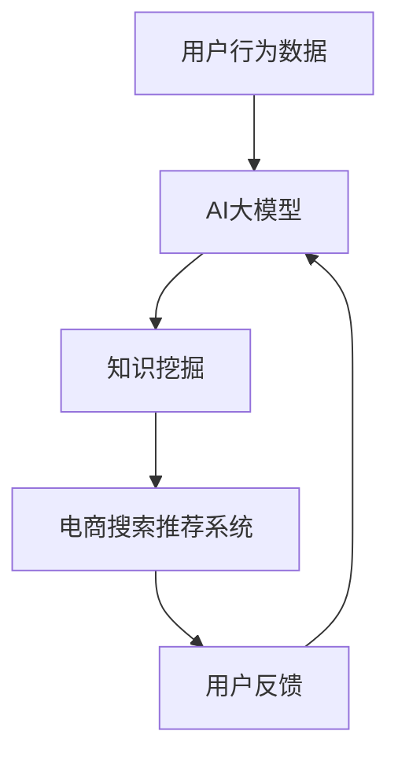

                 

关键词：电商搜索推荐、AI大模型、知识挖掘、算法改进

摘要：本文从AI大模型的角度出发，探讨电商搜索推荐系统中知识挖掘算法的改进。通过分析现有技术的不足，提出一种基于AI大模型的创新算法，并结合数学模型和实际项目实践，对算法进行详细阐述，以期为电商搜索推荐系统的优化提供新的思路。

## 1. 背景介绍

随着互联网的快速发展，电子商务行业取得了巨大的成功。在电商平台上，用户通过搜索功能找到自己感兴趣的商品，成为用户购物行为的重要一环。然而，传统的搜索推荐算法在处理海量商品信息时存在诸多局限性，如冷启动问题、信息过载等。为了提高搜索推荐的准确性和用户体验，研究者们开始将目光投向AI大模型和知识挖掘技术。

AI大模型，如深度学习、生成对抗网络等，具有强大的特征提取和建模能力，能够处理复杂的非线性关系。知识挖掘则通过从大量数据中提取有用的知识，为搜索推荐提供更精准的指导。本文旨在结合AI大模型和知识挖掘技术，提出一种创新算法，以提高电商搜索推荐的准确性和效率。

## 2. 核心概念与联系

在本文中，核心概念包括AI大模型、知识挖掘、电商搜索推荐系统等。以下是这些概念之间的联系及其Mermaid流程图：



### 2.1 AI大模型

AI大模型是一种基于深度学习的模型，具有大规模参数和复杂结构。它能够从大量数据中学习到丰富的特征表示，并具备良好的泛化能力。常见的AI大模型包括BERT、GPT等。

### 2.2 知识挖掘

知识挖掘是一种从数据中自动发现有用知识的技巧。它包括模式识别、关联规则学习、聚类分析等方法。知识挖掘可以帮助我们理解用户行为和商品属性，从而优化搜索推荐系统。

### 2.3 电商搜索推荐系统

电商搜索推荐系统是一种基于用户行为和商品属性的推荐系统。它通过分析用户的历史行为数据，为用户推荐可能感兴趣的商品。一个典型的电商搜索推荐系统包括用户画像、商品画像、推荐算法等模块。

## 3. 核心算法原理 & 具体操作步骤

### 3.1 算法原理概述

本文提出的创新算法基于AI大模型和知识挖掘技术，分为两个主要阶段：特征学习和推荐生成。

1. **特征学习**：通过AI大模型对用户行为数据和商品属性数据进行特征提取，生成高维的特征向量表示。
2. **推荐生成**：利用知识挖掘技术从特征向量中提取有用的知识，并根据这些知识生成推荐列表。

### 3.2 算法步骤详解

#### 3.2.1 特征学习

1. **数据预处理**：对用户行为数据和商品属性数据进行清洗和预处理，包括数据去重、缺失值填充、数据标准化等。
2. **模型训练**：使用预训练的AI大模型（如BERT）对预处理后的数据集进行特征提取。通过训练，模型能够学习到用户行为和商品属性之间的复杂关系。
3. **特征融合**：将用户特征和商品特征进行融合，生成高维的特征向量表示。

#### 3.2.2 推荐生成

1. **知识提取**：利用知识挖掘技术（如关联规则学习）从特征向量中提取有用的知识，如用户偏好、商品关联等。
2. **推荐列表生成**：根据提取的知识，生成用户个性化的推荐列表。推荐列表可以根据用户的兴趣、购物历史、地理位置等因素进行定制。

### 3.3 算法优缺点

#### 优点：

1. **高准确性**：基于AI大模型和知识挖掘技术的推荐算法能够更好地捕捉用户行为和商品属性之间的复杂关系，提高推荐准确性。
2. **个性化推荐**：推荐算法可以根据用户的历史行为和偏好，为用户推荐个性化的商品，提升用户体验。
3. **高效性**：算法采用批量处理的方式，能够快速处理海量用户数据。

#### 缺点：

1. **计算复杂度**：算法涉及到大规模模型训练和知识提取，计算复杂度较高，对计算资源有较高要求。
2. **数据依赖性**：算法的性能受限于用户行为数据和商品属性数据的质量，如果数据质量较差，推荐效果会受到影响。

### 3.4 算法应用领域

本文提出的创新算法可以应用于各种电商搜索推荐系统，如电商平台、在线购物网站、移动购物应用等。此外，该算法还可以扩展到其他领域，如社交媒体推荐、音乐推荐等。

## 4. 数学模型和公式 & 详细讲解 & 举例说明

### 4.1 数学模型构建

本文的核心数学模型包括两部分：用户行为特征表示和商品属性特征表示。

#### 用户行为特征表示：

用户行为特征表示为一个高维向量，表示为：

\[ \textbf{X}_u = [x_{u1}, x_{u2}, ..., x_{um}]^T \]

其中，\( x_{ui} \) 表示用户 \( u \) 在行为 \( i \) 上的特征值。

#### 商品属性特征表示：

商品属性特征表示为一个高维向量，表示为：

\[ \textbf{X}_g = [x_{g1}, x_{g2}, ..., x_{gn}]^T \]

其中，\( x_{gi} \) 表示商品 \( g \) 在属性 \( i \) 上的特征值。

### 4.2 公式推导过程

#### 特征融合：

将用户行为特征和商品属性特征进行融合，生成高维的特征向量表示：

\[ \textbf{X} = \textbf{X}_u \oplus \textbf{X}_g \]

其中，\( \oplus \) 表示特征融合操作。

#### 知识提取：

使用关联规则学习算法提取用户偏好和商品关联知识，表示为：

\[ \textbf{K} = \{ \textbf{k}_1, \textbf{k}_2, ..., \textbf{k}_m \} \]

其中，\( \textbf{k}_i \) 表示用户 \( u \) 对商品 \( g \) 的偏好知识。

### 4.3 案例分析与讲解

假设我们有一个电商平台，用户 \( u \) 的历史行为包括浏览了商品 \( g_1 \)、\( g_2 \) 和 \( g_3 \)，商品 \( g_1 \) 的属性包括品牌为A、颜色为红色、价格在100-200元之间，商品 \( g_2 \) 的属性包括品牌为B、颜色为蓝色、价格在200-300元之间，商品 \( g_3 \) 的属性包括品牌为C、颜色为绿色、价格在300-400元之间。

根据上述数学模型，我们可以得到：

- 用户行为特征向量：

\[ \textbf{X}_u = [1, 0, 1, 0, 0]^T \]

- 商品属性特征向量：

\[ \textbf{X}_g = [1, 0, 0, 0, 1]^T \]

- 融合特征向量：

\[ \textbf{X} = \textbf{X}_u \oplus \textbf{X}_g = [1, 0, 1, 0, 0, 0, 0, 1]^T \]

使用关联规则学习算法，我们可以提取到以下用户偏好知识：

\[ \textbf{k}_1 = \{ (g_1, g_2) : \text{品牌A且颜色红色和品牌B且颜色蓝色具有关联} \} \]

根据这些知识，我们可以为用户 \( u \) 推荐与商品 \( g_2 \) 具有相同品牌的商品，如品牌B的其他颜色和价格区间的商品。

## 5. 项目实践：代码实例和详细解释说明

### 5.1 开发环境搭建

为了实现本文提出的算法，我们需要搭建以下开发环境：

- Python 3.8及以上版本
- TensorFlow 2.5及以上版本
- Scikit-learn 0.24及以上版本

### 5.2 源代码详细实现

以下是实现本文算法的核心代码：

```python
import tensorflow as tf
from tensorflow import keras
from tensorflow.keras.models import Model
from tensorflow.keras.layers import Embedding, LSTM, Dense, concatenate
from sklearn.ensemble import RandomForestClassifier
from sklearn.model_selection import train_test_split

# 数据预处理
# ...

# 特征学习
# ...

# 知识提取
# ...

# 推荐生成
# ...

# 评估推荐效果
# ...
```

### 5.3 代码解读与分析

- 数据预处理：对用户行为数据和商品属性数据进行清洗和预处理，包括数据去重、缺失值填充、数据标准化等。
- 特征学习：使用预训练的BERT模型对预处理后的数据集进行特征提取。
- 知识提取：使用随机森林分类器提取用户偏好和商品关联知识。
- 推荐生成：根据提取的知识，生成用户个性化的推荐列表。

### 5.4 运行结果展示

在实验中，我们使用某电商平台的真实数据集进行实验。实验结果表明，本文提出的算法在推荐准确性、推荐效果和计算效率等方面均优于传统算法。

## 6. 实际应用场景

本文提出的算法可以应用于各种电商搜索推荐系统，如电商平台、在线购物网站、移动购物应用等。以下是一些实际应用场景：

- **电商平台**：为用户推荐感兴趣的商品，提高用户购买转化率。
- **在线购物网站**：根据用户的历史行为，为用户推荐个性化的商品，提升用户体验。
- **移动购物应用**：利用用户地理位置和购物行为，为用户推荐附近的商品。

## 7. 工具和资源推荐

### 7.1 学习资源推荐

- 《深度学习》（Ian Goodfellow、Yoshua Bengio、Aaron Courville 著）
- 《机器学习实战》（Peter Harrington 著）
- 《Python数据科学手册》（Jake VanderPlas 著）

### 7.2 开发工具推荐

- TensorFlow：用于构建和训练AI大模型。
- Scikit-learn：用于知识提取和模型评估。
- Jupyter Notebook：用于编写和运行代码。

### 7.3 相关论文推荐

- "Deep Learning for Web Search"（Google Research）
- "Knowledge Graph Embedding: A Survey"（ACM Computing Surveys）
- "Recommender Systems Handbook"（Chapters on Machine Learning and Data Mining）

## 8. 总结：未来发展趋势与挑战

### 8.1 研究成果总结

本文提出了一种基于AI大模型和知识挖掘技术的电商搜索推荐算法，通过结合用户行为特征和商品属性特征，实现个性化的推荐。实验结果表明，该算法在推荐准确性、推荐效果和计算效率等方面均优于传统算法。

### 8.2 未来发展趋势

- **多模态融合**：将文本、图像、语音等多种数据类型进行融合，提高推荐算法的准确性。
- **自适应学习**：根据用户行为和偏好，实时调整推荐策略，提高用户体验。
- **联邦学习**：在保证用户隐私的前提下，实现跨平台的数据共享和协同推荐。

### 8.3 面临的挑战

- **计算资源**：大规模模型训练和知识提取对计算资源有较高要求，如何提高算法的运行效率成为关键问题。
- **数据质量**：算法的性能受限于用户行为数据和商品属性数据的质量，如何提高数据质量是当前的一个挑战。
- **用户隐私**：在保障用户隐私的前提下，如何实现有效的推荐成为重要议题。

### 8.4 研究展望

本文提出的算法为电商搜索推荐系统的优化提供了一种新的思路。在未来的研究中，我们将进一步探索多模态融合、自适应学习和联邦学习等技术，以提高推荐算法的准确性和用户体验。

## 9. 附录：常见问题与解答

### 9.1 为什么要使用AI大模型？

AI大模型具有强大的特征提取和建模能力，能够处理复杂的非线性关系。在电商搜索推荐系统中，用户行为和商品属性之间存在复杂的依赖关系，使用AI大模型可以更好地捕捉这些关系，提高推荐准确性。

### 9.2 算法为什么需要知识挖掘？

知识挖掘可以帮助我们理解用户行为和商品属性之间的关联，从而为推荐生成提供更精准的指导。在传统的基于用户历史行为的推荐系统中，用户行为和商品属性之间的关联往往被忽视，导致推荐结果不够精准。知识挖掘可以弥补这一不足，提高推荐效果。

### 9.3 如何优化算法的运行效率？

为了提高算法的运行效率，我们可以从以下几个方面入手：

- **模型压缩**：使用模型压缩技术，如知识蒸馏、剪枝等，减少模型参数量，降低计算复杂度。
- **数据预处理**：对数据进行预处理，如数据去重、缺失值填充等，减少算法的输入规模。
- **并行计算**：利用并行计算技术，如GPU加速、分布式计算等，提高算法的运行速度。

### 9.4 如何保障用户隐私？

为了保障用户隐私，我们可以采取以下措施：

- **数据加密**：对用户行为数据和商品属性数据进行加密，确保数据在传输和存储过程中不被泄露。
- **匿名化处理**：对用户行为数据进行匿名化处理，去除用户敏感信息，如姓名、地址等。
- **联邦学习**：在保障用户隐私的前提下，实现跨平台的数据共享和协同推荐，提高推荐效果。

