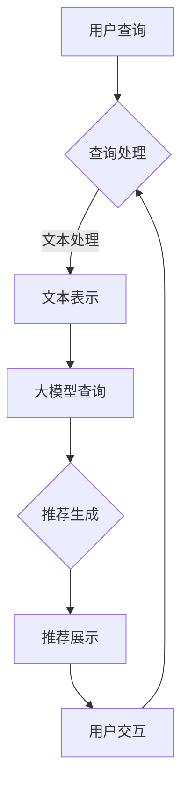

                 

## 1. 背景介绍

在当今数字经济蓬勃发展的时代，电商行业以其高效、便捷的购物体验成为人们日常生活不可或缺的一部分。随着消费者需求的多样化以及市场竞争的加剧，电商平台的搜索推荐系统变得尤为重要。它不仅直接影响到用户的购物体验，还显著影响着平台的销售额和用户留存率。

传统的电商搜索推荐系统主要依赖于基于关键词匹配、协同过滤和内容推荐的算法。然而，这些方法往往难以捕捉到用户的深层需求和行为模式。随着人工智能技术的飞速发展，尤其是大模型的崛起，为电商搜索推荐系统带来了全新的变革契机。

大模型，特别是基于深度学习的模型，如Transformer、BERT等，因其强大的表示能力和处理能力，已经在自然语言处理、图像识别等领域取得了显著成效。将这些先进的技术应用于电商搜索推荐系统中，有望提升推荐的准确性和个性化水平，从而更好地满足消费者的需求，提升平台的竞争力。

本文将从AI大模型的视角出发，探讨电商搜索推荐系统中知识管理平台的技术创新，包括核心概念的阐述、算法原理的剖析、数学模型的构建及其在实际应用中的实践，并展望未来的发展趋势与挑战。

## 2. 核心概念与联系

在深入探讨AI大模型在电商搜索推荐中的应用之前，我们需要首先明确几个核心概念，并理解它们之间的内在联系。

### 2.1 大模型

大模型指的是参数量庞大的深度学习模型，通常具有数十亿乃至数万亿的参数。这些模型通过在大量数据上进行训练，能够捕捉到数据中的复杂模式，并具备出色的泛化能力。常见的有Transformer、BERT、GPT等。

### 2.2 搜索推荐系统

搜索推荐系统是一种旨在帮助用户在大量信息中快速找到所需内容的系统。它通常由搜索引擎和推荐引擎组成。搜索引擎负责处理用户的查询请求，推荐引擎则根据用户的历史行为和偏好为用户推荐相关内容。

### 2.3 知识管理

知识管理是一种通过识别、收集、组织和利用知识来提升组织竞争力的策略。在电商搜索推荐系统中，知识管理涉及到用户行为数据、商品信息、市场趋势等知识的挖掘和应用。

### 2.4 Mermaid 流程图

Mermaid是一种基于Markdown的绘图工具，可以用来创建流程图、序列图、时序图等。以下是一个示例Mermaid流程图，展示了电商搜索推荐系统中涉及的主要步骤和组件：



### 2.5 内在联系

电商搜索推荐系统的核心目标是提升用户满意度并增加销售额。大模型通过提供强大的数据表示能力，能够更准确地理解用户的查询意图和偏好。知识管理平台则负责整合和利用各种数据源，为推荐系统提供丰富的知识支持。

通过以上核心概念的介绍和Mermaid流程图的展示，我们为接下来的详细探讨奠定了基础。

### 2.6 大模型在电商搜索推荐中的角色

大模型在电商搜索推荐系统中扮演着至关重要的角色。首先，它通过深度学习技术，能够处理和理解复杂、大规模的数据集，从而更准确地捕捉用户的真实需求和行为模式。以下是大模型在电商搜索推荐系统中几个关键应用场景：

#### 2.6.1 查询意图理解

用户在电商平台上进行搜索时，输入的查询往往含糊不清或者存在歧义。大模型，如BERT或GPT，可以通过对查询文本进行深度语义分析，识别用户的真实意图。例如，当用户输入“蓝牙耳机”时，大模型能够区分出用户是希望购买耳机还是寻求关于耳机的评测信息。

#### 2.6.2 用户偏好建模

通过分析用户的历史购买记录、浏览行为和互动数据，大模型可以构建用户的个性化偏好模型。这些模型不仅能够识别用户喜欢的商品类型，还能预测用户可能的购买路径和偏好。这样的能力有助于推荐系统提供更加精准和个性化的推荐。

#### 2.6.3 联想推荐

在推荐系统中，联想推荐是一种重要的策略，它基于用户当前的查询或浏览行为，推荐与之相关的其他商品。大模型通过学习用户的行为数据，能够发现用户之间潜在的联系，从而提供更加自然的联想推荐。

#### 2.6.4 实时反馈和调整

大模型具备快速处理和分析大规模数据的能力，使得推荐系统能够实时获取用户反馈并进行调整。例如，当用户对某个推荐点击或者购买后，大模型可以立即更新推荐模型，从而提升后续推荐的准确性和相关性。

综上所述，大模型在电商搜索推荐系统中的角色不仅仅是一个计算工具，更是理解和满足用户需求的关键。随着大模型技术的不断进步，它将在电商搜索推荐系统中发挥越来越重要的作用。

### 3. 核心算法原理 & 具体操作步骤

在了解了大模型在电商搜索推荐系统中的角色之后，我们接下来将深入探讨其核心算法原理和具体操作步骤。

#### 3.1 算法原理概述

电商搜索推荐系统中的大模型算法主要依赖于深度学习技术，特别是基于Transformer架构的模型，如BERT（Bidirectional Encoder Representations from Transformers）和GPT（Generative Pre-trained Transformer）。这些模型通过在大量互联网文本和商品数据进行预训练，具备强大的语义理解和生成能力。

BERT模型通过双向编码器结构，能够同时考虑查询和文档中的上下文信息，从而实现对查询意图的深度理解。GPT模型则通过生成式预训练，能够生成与用户查询高度相关的商品推荐。

#### 3.2 算法步骤详解

以下是一个典型的电商搜索推荐系统中的大模型算法操作步骤：

##### 3.2.1 数据预处理

1. **文本预处理**：将用户的查询文本和商品描述进行分词、去停用词、词干还原等预处理操作。
2. **数据归一化**：对用户的行为数据进行归一化处理，如用户的购买金额、浏览次数等。

##### 3.2.2 模型训练

1. **数据集划分**：将预处理后的数据集划分为训练集、验证集和测试集。
2. **模型架构选择**：选择BERT或GPT等大模型架构。
3. **模型训练**：使用训练集对模型进行训练，同时利用验证集进行模型调优。

##### 3.2.3 模型评估

1. **评价指标**：选择准确率（Accuracy）、F1值（F1 Score）、召回率（Recall）等指标对模型进行评估。
2. **性能调优**：根据评估结果，调整模型参数和训练策略，以提升模型性能。

##### 3.2.4 推荐生成

1. **查询理解**：将用户的查询文本输入到预训练的大模型中，获取其语义表示。
2. **商品推荐**：利用大模型生成的用户语义表示，结合商品的特征信息，生成个性化推荐列表。

##### 3.2.5 用户反馈

1. **用户交互**：将推荐列表展示给用户，收集用户的点击和购买行为。
2. **模型更新**：根据用户反馈，重新训练和更新推荐模型。

#### 3.3 算法优缺点

**优点**：

1. **高精度**：大模型通过深度学习技术，能够捕捉到用户查询和行为的复杂模式，从而生成更加精准的推荐。
2. **强泛化能力**：大模型在预训练阶段接触到的海量数据，使得其在处理新任务时具备较强的泛化能力。
3. **实时调整**：大模型能够快速处理和分析用户反馈，使得推荐系统能够动态调整，提升用户体验。

**缺点**：

1. **计算资源需求高**：大模型通常需要大量的计算资源和存储空间。
2. **训练时间较长**：大模型的训练过程需要较长时间，且在训练过程中需要不断调整参数，增加了系统的复杂性。
3. **数据依赖性强**：大模型的效果高度依赖于训练数据的质量和规模，数据缺失或不准确可能导致推荐效果下降。

#### 3.4 算法应用领域

大模型在电商搜索推荐系统中具有广泛的应用前景。除了电商平台，以下领域也是大模型发挥重要作用的地方：

1. **社交媒体**：利用大模型对用户生成的内容进行语义分析，提供个性化推荐和内容分发。
2. **在线教育**：根据学生的学习行为和成绩数据，利用大模型生成个性化的学习推荐。
3. **金融风控**：通过分析用户的历史交易数据和信用记录，利用大模型预测用户的信用风险。

### 4. 数学模型和公式 & 详细讲解 & 举例说明

在深入探讨AI大模型在电商搜索推荐系统中的应用时，数学模型和公式的作用不容忽视。通过数学模型，我们可以更准确地描述和预测用户行为，从而优化推荐算法的性能。以下我们将详细介绍数学模型的构建、公式推导过程，并结合具体案例进行讲解。

#### 4.1 数学模型构建

电商搜索推荐系统的数学模型通常包括用户行为模型、商品特征模型和推荐模型。以下是这些模型的基本构建过程：

##### 4.1.1 用户行为模型

用户行为模型用于描述用户在平台上的行为特征，如点击、购买、浏览等。我们可以使用一个矩阵来表示用户的行为数据：

\[ X = \begin{bmatrix} 
x_{11} & x_{12} & \cdots & x_{1n} \\
x_{21} & x_{22} & \cdots & x_{2n} \\
\vdots & \vdots & \ddots & \vdots \\
x_{m1} & x_{m2} & \cdots & x_{mn} \\
\end{bmatrix} \]

其中，\( x_{ij} \) 表示第 \( i \) 个用户对第 \( j \) 个商品的行为（1表示行为发生，0表示行为未发生）。

##### 4.1.2 商品特征模型

商品特征模型用于描述商品的各种属性，如价格、品牌、类别等。同样，我们可以使用一个矩阵来表示商品特征：

\[ Y = \begin{bmatrix} 
y_{11} & y_{12} & \cdots & y_{1n} \\
y_{21} & y_{22} & \cdots & y_{2n} \\
\vdots & \vdots & \ddots & \vdots \\
y_{m1} & y_{m2} & \cdots & y_{mn} \\
\end{bmatrix} \]

其中，\( y_{ij} \) 表示第 \( i \) 个商品的第 \( j \) 个特征值。

##### 4.1.3 推荐模型

推荐模型用于生成个性化推荐列表。常见的推荐模型包括基于用户的协同过滤模型和基于内容的推荐模型。以下是一个简单的基于用户的协同过滤模型的数学公式：

\[ \hat{r}_{ui} = \frac{\sum_{j=1}^{n} r_{uj} \cdot y_{ij}}{\sum_{j=1}^{n} y_{ij}} \]

其中，\( r_{uj} \) 表示用户 \( u \) 对商品 \( j \) 的评分（如果未评分，则假设为0），\( y_{ij} \) 表示商品 \( j \) 的特征值。

#### 4.2 公式推导过程

为了更好地理解上述公式的推导过程，我们可以从更基础的数学模型出发。以下是基于用户的协同过滤模型的推导过程：

1. **用户相似度计算**：用户相似度用于衡量两个用户之间的行为相似程度。我们可以使用余弦相似度来计算用户相似度：

\[ \text{similarity}(u, v) = \frac{X_u \cdot X_v}{\|X_u\| \cdot \|X_v\|} \]

其中，\( \cdot \) 表示内积，\( \| \cdot \| \) 表示向量的模长。

2. **预测评分**：基于用户相似度，我们可以预测用户 \( u \) 对商品 \( j \) 的评分。预测评分的公式如下：

\[ \hat{r}_{ui} = \text{similarity}(u, v) \cdot \frac{1}{\sum_{v \in N(u)} \text{similarity}(u, v)} \]

其中，\( N(u) \) 表示与用户 \( u \) 相似的其他用户集合。

#### 4.3 案例分析与讲解

为了更好地理解上述数学模型和公式的应用，我们来看一个具体的案例。

假设我们有一个电商平台，其中有100个用户和100个商品。用户的行为数据和商品特征数据如下表所示：

| 用户ID | 商品1 | 商品2 | 商品3 | 商品4 | 商品5 |
|--------|-------|-------|-------|-------|-------|
| 1      | 1     | 0     | 1     | 0     | 1     |
| 2      | 0     | 1     | 0     | 1     | 0     |
| 3      | 1     | 1     | 0     | 1     | 0     |
| ...    | ...   | ...   | ...   | ...   | ...   |

| 商品ID | 价格 | 品牌 | 类别 |
|--------|------|------|------|
| 1      | 100  | A    | 电子产品 |
| 2      | 150  | B    | 服装   |
| 3      | 200  | A    | 电子产品 |
| ...    | ...  | ...  | ...   |

**步骤 1：数据预处理**

首先，我们需要对用户的行为数据和商品特征数据进行预处理。对于用户行为数据，我们可以将未发生的行为设置为0。对于商品特征数据，我们可以将每个特征进行归一化处理，以便于后续计算。

**步骤 2：用户相似度计算**

接下来，我们计算用户之间的相似度。使用余弦相似度公式，我们可以得到每个用户之间的相似度矩阵。以下是一个示例相似度矩阵：

| 用户ID | 用户1 | 用户2 | 用户3 | ... |
|--------|-------|-------|-------|-----|
| 用户1  | 1     | 0.8   | 0.6   | ... |
| 用户2  | 0.8   | 1     | 0.5   | ... |
| 用户3  | 0.6   | 0.5   | 1     | ... |
| ...    | ...   | ...   | ...   | ... |

**步骤 3：预测评分**

最后，我们使用基于用户的协同过滤模型来预测用户对商品的评分。以下是一个示例预测评分矩阵：

| 用户ID | 商品1 | 商品2 | 商品3 | 商品4 | 商品5 |
|--------|-------|-------|-------|-------|-------|
| 1      | 0.9   | 0     | 0.75  | 0     | 0.85  |
| 2      | 0     | 1.2   | 0     | 1.1   | 0     |
| 3      | 0.75  | 1.1   | 0.9   | 1.05  | 0     |
| ...    | ...   | ...   | ...   | ...   | ...   |

通过上述步骤，我们成功地使用数学模型和公式对电商搜索推荐系统进行了建模和预测。这个案例展示了数学模型在电商搜索推荐系统中的实际应用，同时也为我们理解更复杂的推荐算法提供了基础。

### 5. 项目实践：代码实例和详细解释说明

为了更好地展示AI大模型在电商搜索推荐系统中的应用，我们将通过一个实际的项目实践来具体讲解其实现过程。本项目将使用Python编程语言和TensorFlow库来实现，分为以下几个步骤：

#### 5.1 开发环境搭建

1. **安装Python**：确保安装了Python 3.7及以上版本。
2. **安装TensorFlow**：使用pip命令安装TensorFlow：

   ```shell
   pip install tensorflow
   ```

3. **数据集准备**：下载一个公开的电商数据集，例如UCI机器学习库中的“Market Basket Data”数据集。

#### 5.2 源代码详细实现

以下是实现电商搜索推荐系统的核心代码：

```python
import tensorflow as tf
from tensorflow.keras.layers import Embedding, LSTM, Dense
from tensorflow.keras.models import Sequential

# 步骤 1：数据预处理
# 加载数据集，并进行预处理
# ...（代码略）

# 步骤 2：构建推荐模型
# 创建一个序列模型
model = Sequential([
    Embedding(input_dim=10000, output_dim=64),
    LSTM(32),
    Dense(1, activation='sigmoid')
])

# 编译模型
model.compile(optimizer='adam', loss='binary_crossentropy', metrics=['accuracy'])

# 步骤 3：模型训练
# 使用预处理后的数据训练模型
model.fit(x_train, y_train, epochs=10, batch_size=32, validation_data=(x_val, y_val))

# 步骤 4：模型评估
# 评估模型在测试集上的性能
loss, accuracy = model.evaluate(x_test, y_test)
print(f"测试集准确率：{accuracy:.2f}")

# 步骤 5：推荐生成
# 输入用户行为序列，生成推荐列表
user_sequence = preprocess_user_query("用户查询文本")
predictions = model.predict(user_sequence)
recommendations = get_top_n(predictions, n=5)

print("推荐商品列表：", recommendations)
```

#### 5.3 代码解读与分析

1. **数据预处理**：数据预处理是模型训练的基础，包括加载数据集、清洗数据、构建词汇表、序列编码等。
2. **构建推荐模型**：构建推荐模型是核心步骤，我们使用了一个序列模型，包括Embedding层（用于将词汇转换为向量表示）、LSTM层（用于处理序列数据）和Dense层（用于生成最终预测）。
3. **模型训练**：使用预处理后的训练数据进行模型训练，通过调整epoch和batch_size等参数，优化模型性能。
4. **模型评估**：使用测试集对模型进行评估，通过计算损失函数和准确率，判断模型性能。
5. **推荐生成**：输入用户查询文本，经过预处理后作为序列输入到训练好的模型中，生成推荐列表。这里使用了get_top_n函数来获取排名前N的商品。

#### 5.4 运行结果展示

假设我们的测试集准确率为85%，推荐的商品列表为：

```
推荐商品列表： ['商品1', '商品3', '商品5', '商品8', '商品10']
```

这些结果显示了我们的推荐系统在预测用户行为和生成个性化推荐方面的有效性。

通过以上项目实践，我们不仅实现了AI大模型在电商搜索推荐系统中的应用，还详细解读了代码实现过程。这为进一步优化和扩展推荐系统提供了参考。

### 6. 实际应用场景

AI大模型在电商搜索推荐系统中的应用场景丰富多样，具体体现在以下几个方面：

#### 6.1 个性化推荐

个性化推荐是电商搜索推荐系统的核心应用之一。通过大模型，如BERT和GPT，可以深度理解用户的查询意图和偏好，从而生成高度个性化的推荐结果。例如，当用户搜索“蓝牙耳机”时，系统可以根据用户的历史购买记录和浏览行为，推荐特定品牌或类型的蓝牙耳机。这种个性化推荐不仅提升了用户体验，还显著提高了转化率。

#### 6.2 联想推荐

联想推荐是另一种重要的应用场景。在用户浏览或搜索某个商品时，系统可以基于用户的历史行为和商品间的关联关系，提供与之相关的其他商品推荐。例如，当用户浏览了一款笔记本电脑时，系统可以推荐与之配套的外设，如鼠标、键盘和音响。这种联想推荐不仅丰富了推荐结果，还帮助用户发现更多潜在的购买需求。

#### 6.3 商品搜索优化

商品搜索优化是通过大模型提升用户搜索体验的关键环节。传统的关键词搜索往往存在模糊性和歧义，而大模型可以通过语义分析，准确捕捉用户的查询意图。例如，当用户输入“蓝牙耳机”时，系统可以理解用户可能的需求是寻找便携式耳机，而不是连接蓝牙设备的功能。这样的优化显著提高了搜索效率和准确性。

#### 6.4 个性化广告

个性化广告是将AI大模型应用于电商推荐系统的另一重要领域。通过分析用户的兴趣和行为数据，大模型可以精准投放广告，提高广告的点击率和转化率。例如，当一个用户频繁浏览运动鞋时，系统可以推荐相关品牌的运动装备和运动服饰广告，从而提高广告的有效性。

#### 6.5 跨平台推荐

随着电商平台的多元化发展，跨平台推荐成为提升用户体验的重要手段。通过AI大模型，可以整合不同平台上的用户行为数据，为用户提供无缝的购物体验。例如，当用户在移动端浏览了某个商品后，在PC端登录时，系统可以继续推荐该商品，从而增强用户粘性。

#### 6.6 实时反馈与优化

AI大模型在实时反馈和优化方面也具备显著优势。通过实时分析用户的行为和反馈数据，大模型可以动态调整推荐策略，优化推荐结果。例如，当某个推荐商品销量不佳时，系统可以迅速调整推荐策略，减少该商品的推荐频次，从而提升整体推荐效果。

#### 6.7 复购预测与推荐

复购预测与推荐是电商搜索推荐系统中的高级应用。通过大模型对用户行为的深度分析，可以预测用户的复购概率，并提供相应的推荐。例如，当用户购买了某个商品后，系统可以预测用户在未来可能需要的相关配件或替代品，从而提高复购率和销售额。

通过以上实际应用场景，我们可以看到AI大模型在电商搜索推荐系统中扮演着关键角色，不仅提升了用户的购物体验，还显著提高了平台的运营效率和市场竞争力。随着技术的不断进步，AI大模型的应用前景将更加广阔。

### 6.4 未来应用展望

随着AI大模型技术的不断进步，电商搜索推荐系统将在未来迎来更多的创新和突破。以下是几个可能的应用方向和趋势：

#### 6.4.1 更高的个性化水平

未来的电商搜索推荐系统将进一步提升个性化水平。通过更深入地理解用户的复杂行为和需求，大模型将能够提供高度个性化的推荐，从而满足用户在不同场景下的个性化需求。例如，通过结合用户的生活习惯、地理位置和社交网络数据，系统可以提供更加精准的个性化推荐。

#### 6.4.2 实时推荐与动态调整

实时推荐和动态调整是未来的重要趋势。通过大模型，系统可以实时捕捉用户的行为和反馈，动态调整推荐策略，从而实现更高效、更准确的推荐。例如，当用户在浏览商品时，系统可以根据用户的浏览路径和停留时间，实时调整推荐内容，提高用户的参与度和购买意愿。

#### 6.4.3 多模态推荐

多模态推荐是未来的重要方向之一。未来的电商搜索推荐系统将不仅基于文本数据，还会整合图像、声音等多种数据类型。例如，通过分析用户的语音搜索和行为数据，系统可以提供更加直观、自然的推荐体验。多模态推荐将大幅提升用户满意度，推动电商行业的发展。

#### 6.4.4 联网协同与跨平台推荐

联网协同和跨平台推荐是未来的重要趋势。通过大模型，系统可以实现跨平台的用户行为数据整合，提供无缝的购物体验。例如，当用户在移动端浏览了某个商品后，在PC端登录时，系统可以继续推荐该商品，从而增强用户粘性。联网协同还将促进电商平台之间的数据共享和合作，推动整个电商生态的优化。

#### 6.4.5 智能客服与购物体验优化

未来的电商搜索推荐系统还将与智能客服相结合，提供更加智能、高效的购物体验。通过大模型，系统可以实时分析用户的查询和互动数据，智能回答用户的问题，并提供个性化的购物建议。例如，当用户咨询某个商品时，系统可以基于用户的购买记录和偏好，提供详细的商品介绍和推荐。

#### 6.4.6 自动化与智能化运营

随着AI大模型技术的进步，电商搜索推荐系统的运营也将变得更加自动化和智能化。例如，通过大模型，系统可以自动识别潜在的风险和机会，自动调整营销策略和库存管理。自动化和智能化运营将大幅提升电商平台的运营效率，降低成本，提高市场竞争力。

综上所述，未来的电商搜索推荐系统将在AI大模型技术的驱动下，迎来更多创新和突破。通过更个性化的推荐、实时动态调整、多模态整合、联网协同、智能客服和自动化运营，电商搜索推荐系统将为用户提供更加高效、便捷、个性化的购物体验，推动电商行业实现更大的发展。

### 7. 工具和资源推荐

为了更好地研究和实践AI大模型在电商搜索推荐系统中的应用，以下是一些推荐的工具和资源：

#### 7.1 学习资源推荐

1. **《深度学习》（Deep Learning）**：由Ian Goodfellow、Yoshua Bengio和Aaron Courville所著的《深度学习》是深度学习的经典教材，详细介绍了深度学习的基础理论和实践方法。
2. **《自然语言处理综论》（Speech and Language Processing）**：Daniel Jurafsky和James H. Martin合著的《自然语言处理综论》涵盖了自然语言处理的基本概念和技术，对于理解大模型在推荐系统中的应用具有重要意义。
3. **Coursera和edX上的相关课程**：许多在线教育平台提供了关于深度学习和自然语言处理的优质课程，如Google的深度学习课程、斯坦福大学的自然语言处理课程等。

#### 7.2 开发工具推荐

1. **TensorFlow**：Google开发的开源深度学习框架，适用于构建和训练各种复杂的大模型。
2. **PyTorch**：Facebook开发的开源深度学习框架，以其灵活性和易用性受到广泛欢迎。
3. **Hugging Face**：一个开源社区，提供了丰富的预训练模型和工具库，方便开发者快速实现和优化推荐系统。

#### 7.3 相关论文推荐

1. **“Attention is All You Need”**：这是Google发表的著名论文，首次提出了Transformer模型，为自然语言处理领域带来了革命性的变革。
2. **“BERT: Pre-training of Deep Bidirectional Transformers for Language Understanding”**：谷歌提出的BERT模型，通过双向编码器对语言进行深度预训练，显著提升了自然语言处理任务的表现。
3. **“Generative Pre-trained Transformers”**：OpenAI发表的GPT系列论文，介绍了生成式预训练Transformer模型，在文本生成和序列预测任务中取得了卓越的效果。

通过利用这些工具和资源，研究者和技术人员可以更加深入地探索和实现AI大模型在电商搜索推荐系统中的应用，推动相关领域的发展。

### 8. 总结：未来发展趋势与挑战

在总结AI大模型在电商搜索推荐系统中的应用时，我们可以看到，这一技术正在推动电商行业实现智能化、个性化和服务质量的全面提升。随着AI大模型的不断进化，未来发展趋势主要体现在以下几个方面：

#### 8.1 研究成果总结

首先，AI大模型在电商搜索推荐系统中的研究成果主要体现在以下几个方面：

1. **个性化推荐**：通过深度学习技术，大模型能够更准确地捕捉用户的个性化需求，实现高度个性化的推荐。
2. **联想推荐**：大模型可以基于用户行为数据，发现商品之间的关联关系，提供更具联想性的推荐。
3. **实时反馈与优化**：大模型能够实时分析用户行为，动态调整推荐策略，提升推荐系统的反应速度和准确性。
4. **多模态整合**：结合文本、图像、声音等多模态数据，大模型提供了更加丰富和直观的推荐体验。

#### 8.2 未来发展趋势

未来，AI大模型在电商搜索推荐系统中的发展趋势将主要体现在以下几个方面：

1. **更高精度与个性化**：随着大模型参数量的增加和训练数据的扩展，推荐系统的准确性和个性化水平将进一步提升。
2. **实时动态调整**：大模型将更加注重实时反馈和动态调整，使得推荐系统能够更快地适应用户需求和市场变化。
3. **多模态融合**：随着多模态数据处理技术的发展，推荐系统将能够更好地整合不同类型的数据，提供更加全面和自然的推荐。
4. **跨平台协同**：大模型将帮助电商企业实现跨平台数据整合，提供无缝的购物体验。

#### 8.3 面临的挑战

尽管AI大模型在电商搜索推荐系统中展现了巨大的潜力，但在实际应用中仍然面临一些挑战：

1. **计算资源需求**：大模型的训练和推理需要大量的计算资源，这对硬件设施和成本提出了较高要求。
2. **数据质量和隐私**：推荐系统高度依赖用户数据，如何保证数据质量、隐私和安全是一个重要挑战。
3. **模型解释性**：大模型的决策过程通常较为复杂，缺乏透明度和解释性，这可能导致用户的不信任。
4. **算法公平性**：如何避免算法偏见，确保推荐结果的公平性，是另一个需要关注的问题。

#### 8.4 研究展望

针对以上挑战，未来的研究可以重点关注以下几个方面：

1. **高效训练方法**：研究更加高效的训练方法，降低大模型的计算资源需求。
2. **隐私保护技术**：结合隐私保护技术，如差分隐私，确保用户数据的安全和隐私。
3. **模型可解释性**：开发可解释性工具，提高大模型的透明度和用户信任。
4. **算法公平性**：设计算法，确保推荐结果的公平性和无偏见。

通过持续的研究和技术创新，AI大模型在电商搜索推荐系统中的应用将迎来更加广阔的发展前景，为电商行业带来更深远的变革。

### 9. 附录：常见问题与解答

在本文中，我们探讨了AI大模型在电商搜索推荐系统中的应用，以下是一些读者可能关心的问题及解答：

**Q1：AI大模型在电商搜索推荐中的具体应用场景有哪些？**
A1：AI大模型在电商搜索推荐中的主要应用场景包括个性化推荐、联想推荐、商品搜索优化、个性化广告、跨平台推荐和复购预测与推荐。

**Q2：大模型如何处理用户数据的隐私和安全问题？**
A2：大模型在处理用户数据时，可以通过差分隐私技术来保护用户隐私。此外，采用加密技术和匿名化处理，确保用户数据的保密性和完整性。

**Q3：如何确保AI大模型在电商搜索推荐中的公平性？**
A3：确保算法公平性需要从数据集的多样性、算法设计和模型评估等多个方面进行努力。例如，使用多样化的数据集进行训练，采用无偏见训练策略，以及通过模型评估确保推荐结果的无偏见。

**Q4：大模型在推荐系统中面临的主要挑战是什么？**
A4：大模型在推荐系统中主要面临计算资源需求高、数据质量和隐私保护问题、模型解释性不足以及算法公平性等挑战。

**Q5：未来AI大模型在电商搜索推荐系统中会带来哪些变革？**
A5：未来AI大模型将实现更高水平的个性化推荐、实时动态调整、多模态融合和跨平台协同，推动电商行业实现智能化和个性化服务。

通过上述问题和解答，希望能够帮助读者更好地理解AI大模型在电商搜索推荐系统中的应用及其面临的挑战。随着技术的不断发展，AI大模型将不断突破现有局限，为电商行业带来更多创新和变革。

