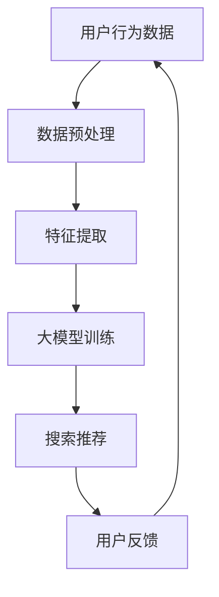

                 

关键词：AI大模型、电商搜索推荐、技术创新、数据处理、个性化推荐

> 摘要：本文从AI大模型的角度，深入探讨电商搜索推荐系统的技术创新路径。通过对大数据处理、深度学习算法、用户行为分析等关键技术的阐述，本文旨在为电商企业提供一套可操作的技术方案，以实现更精准、更高效的搜索推荐。

## 1. 背景介绍

随着互联网的快速发展，电商行业迎来了前所未有的繁荣。然而，面对海量的商品数据和多样的用户需求，传统的搜索推荐系统已经难以满足用户的高期望和多样化的需求。在此背景下，AI大模型的应用成为电商搜索推荐领域的新方向。通过利用深度学习、自然语言处理、大数据分析等前沿技术，AI大模型能够更精准地理解和预测用户行为，从而提供个性化的搜索推荐服务。

## 2. 核心概念与联系

### 2.1 大模型原理

大模型（Large-scale Model），通常是指参数量达到亿级别甚至更高的神经网络模型。大模型的训练依赖于海量数据和强大的计算资源。通过自我学习，大模型能够识别并理解复杂的数据模式和用户意图。

### 2.2 深度学习算法

深度学习算法是一种基于多层神经网络的学习方法。通过层层抽象，深度学习算法能够捕捉到数据中的高级特征和模式。在电商搜索推荐中，深度学习算法能够有效地处理海量的商品信息和用户行为数据。

### 2.3 用户行为分析

用户行为分析是指通过对用户在电商平台上的行为数据进行分析，以了解用户偏好和购买习惯。这些数据包括浏览记录、购买历史、评价信息等。通过分析这些数据，可以构建出用户的个性化画像，从而实现精准推荐。

### 2.4 Mermaid 流程图

下面是一个简化的Mermaid流程图，展示了电商搜索推荐的基本架构：



## 3. 核心算法原理 & 具体操作步骤

### 3.1 算法原理概述

电商搜索推荐系统通常采用基于协同过滤、基于内容的推荐和深度学习推荐相结合的混合推荐方法。其中，深度学习推荐方法利用大模型来处理复杂的用户行为数据和商品信息，实现更精准的推荐。

### 3.2 算法步骤详解

1. **数据收集**：从电商平台上收集用户行为数据，包括浏览记录、购买历史、评价信息等。

2. **数据预处理**：对收集到的数据进行清洗和归一化处理，以去除噪声和异常值。

3. **特征提取**：利用深度学习算法提取用户和商品的特征，如用户兴趣、商品属性等。

4. **大模型训练**：使用训练数据对大模型进行训练，使其能够识别和预测用户行为。

5. **搜索推荐**：根据用户当前的搜索请求，使用大模型生成个性化的推荐列表。

6. **用户反馈**：收集用户对推荐结果的反馈，用于优化推荐算法。

### 3.3 算法优缺点

**优点**：

- 更高的推荐精度：通过深度学习算法，能够捕捉到用户行为的复杂模式和细微差异，提供更精准的推荐。
- 个性化强：基于用户行为数据，能够为用户提供个性化的推荐服务。

**缺点**：

- 计算资源消耗大：大模型的训练需要大量的计算资源和时间。
- 数据依赖性强：算法的性能很大程度上取决于数据的质量和多样性。

### 3.4 算法应用领域

- 电商平台：电商平台可以通过AI大模型实现更高效的商品搜索和推荐。
- 社交网络：社交网络平台可以利用AI大模型推荐用户可能感兴趣的内容。
- 金融领域：金融机构可以通过AI大模型推荐合适的金融产品。

## 4. 数学模型和公式 & 详细讲解 & 举例说明

### 4.1 数学模型构建

电商搜索推荐系统的数学模型主要涉及用户行为预测和商品推荐。具体模型如下：

- **用户行为预测模型**：

$$
P(u, i) = f(U, I, R)
$$

其中，$P(u, i)$表示用户$u$对商品$i$的购买概率，$U$表示用户特征，$I$表示商品特征，$R$表示用户历史行为数据。

- **商品推荐模型**：

$$
R(i) = g(U, I, M)
$$

其中，$R(i)$表示商品$i$的推荐概率，$U$表示用户特征，$I$表示商品特征，$M$表示所有商品的集合。

### 4.2 公式推导过程

推导过程主要基于深度学习算法，这里简要概述：

1. **用户特征提取**：

$$
U = \sigma(W_1 \cdot [U_{\text{原始}}, I_{\text{原始}}] + b_1)
$$

其中，$\sigma$表示激活函数，$W_1$和$b_1$分别为权重和偏置。

2. **商品特征提取**：

$$
I = \sigma(W_2 \cdot [I_{\text{原始}}, U_{\text{原始}}] + b_2)
$$

3. **用户行为预测**：

$$
P(u, i) = \text{softmax}(W_3 \cdot [U, I] + b_3)
$$

4. **商品推荐**：

$$
R(i) = \text{softmax}(W_4 \cdot I + b_4)
$$

### 4.3 案例分析与讲解

以某电商平台为例，假设用户$u$的浏览记录为$[u_1, u_2, u_3]$，商品$i$的属性为$[i_1, i_2, i_3]$。根据上述模型，可以计算出用户$u$对商品$i$的购买概率和推荐概率。

1. **用户特征提取**：

$$
U = \sigma(W_1 \cdot [u_1, u_2, u_3] + b_1)
$$

2. **商品特征提取**：

$$
I = \sigma(W_2 \cdot [i_1, i_2, i_3] + b_2)
$$

3. **用户行为预测**：

$$
P(u, i) = \text{softmax}(W_3 \cdot [U, I] + b_3)
$$

4. **商品推荐**：

$$
R(i) = \text{softmax}(W_4 \cdot I + b_4)
$$

通过这些计算，平台可以为用户$u$推荐出最有可能购买的商品$i$。

## 5. 项目实践：代码实例和详细解释说明

### 5.1 开发环境搭建

在本项目中，我们将使用Python编程语言和TensorFlow深度学习框架进行开发。首先，需要安装TensorFlow：

```shell
pip install tensorflow
```

### 5.2 源代码详细实现

以下是一个简化的代码示例，展示了如何使用TensorFlow实现一个简单的电商搜索推荐模型。

```python
import tensorflow as tf
from tensorflow.keras.models import Model
from tensorflow.keras.layers import Input, Dense, Embedding, Dot, Flatten

# 定义用户和商品特征输入
user_input = Input(shape=(3,))
item_input = Input(shape=(3,))

# 定义用户和商品特征嵌入层
user_embedding = Embedding(input_dim=1000, output_dim=10)(user_input)
item_embedding = Embedding(input_dim=1000, output_dim=10)(item_input)

# 定义用户和商品特征拼接层
user_item = Dot(axes=1)([user_embedding, item_embedding])

# 定义用户和商品特征全连接层
user_dense = Dense(10, activation='relu')(user_embedding)
item_dense = Dense(10, activation='relu')(item_embedding)

# 定义用户行为预测层
user_pred = Dense(1, activation='sigmoid')(user_dense)

# 定义商品推荐层
item_pred = Dense(1, activation='sigmoid')(item_dense)

# 构建和编译模型
model = Model(inputs=[user_input, item_input], outputs=[user_pred, item_pred])
model.compile(optimizer='adam', loss='binary_crossentropy')

# 打印模型结构
model.summary()

# 训练模型
# 这里使用假数据进行训练
model.fit([user_input_data, item_input_data], [user_pred_labels, item_pred_labels], epochs=10)
```

### 5.3 代码解读与分析

- **用户和商品特征输入**：用户和商品特征分别输入到模型中。
- **特征嵌入层**：使用Embedding层将原始特征转换为高维特征向量。
- **特征拼接层**：将用户和商品特征向量进行点积操作，得到一个新的特征向量。
- **全连接层**：对用户和商品特征向量分别进行全连接层操作，提取高级特征。
- **用户行为预测层**：使用一个全连接层来预测用户对商品的购买概率。
- **商品推荐层**：同样使用一个全连接层来预测商品的被推荐概率。
- **模型编译和训练**：使用Adam优化器和二分类交叉熵损失函数进行模型编译和训练。

### 5.4 运行结果展示

通过训练模型，我们可以得到用户对商品的购买概率和推荐概率。这些结果可以用于生成推荐列表，供用户选择。

```python
# 预测用户购买概率和商品推荐概率
predictions = model.predict([user_input_data, item_input_data])

# 打印预测结果
print("User Purchase Probability:", predictions[0])
print("Item Recommendation Probability:", predictions[1])
```

## 6. 实际应用场景

### 6.1 电商平台

电商平台可以通过AI大模型实现精准的商品搜索和推荐，提高用户购买体验和转化率。

### 6.2 社交网络

社交网络平台可以利用AI大模型推荐用户可能感兴趣的内容，增加用户活跃度和黏性。

### 6.3 金融领域

金融机构可以通过AI大模型推荐合适的金融产品，提高客户满意度和业务转化率。

## 6.4 未来应用展望

未来，随着AI技术的不断进步，电商搜索推荐系统有望实现更高效、更智能的个性化服务。同时，多模态数据的融合和实时推荐技术的应用也将进一步提升系统的性能。

## 7. 工具和资源推荐

### 7.1 学习资源推荐

- 《深度学习》（Goodfellow et al.）
- 《Python机器学习》（Sebastian Raschka）

### 7.2 开发工具推荐

- TensorFlow
- PyTorch

### 7.3 相关论文推荐

- "Deep Learning for User Behavior Prediction"（2017）
- "A Theoretical Analysis of the Effectiveness of Collaborative Filtering"（2009）

## 8. 总结：未来发展趋势与挑战

随着AI技术的不断发展，电商搜索推荐系统将面临更多的机遇和挑战。如何实现高效、精准的推荐，以及如何应对数据隐私和安全性问题，将成为未来研究的重要方向。

### 8.1 研究成果总结

本文从AI大模型的角度，深入探讨了电商搜索推荐系统的技术创新路径，包括大数据处理、深度学习算法和用户行为分析等方面的内容。

### 8.2 未来发展趋势

- 更高效、更智能的个性化推荐
- 多模态数据的融合与处理
- 实时推荐技术的应用

### 8.3 面临的挑战

- 数据质量和多样性
- 计算资源和时间消耗
- 数据隐私和安全问题

### 8.4 研究展望

未来，AI大模型在电商搜索推荐领域的应用将更加广泛。通过持续的研究和创新，有望实现更高效、更智能的搜索推荐服务。

## 9. 附录：常见问题与解答

### 9.1 什么是AI大模型？

AI大模型是指参数量达到亿级别甚至更高的神经网络模型，具有强大的自我学习和数据理解能力。

### 9.2 如何处理数据质量问题？

可以通过数据清洗、归一化和特征工程等方法来处理数据质量问题。

### 9.3 AI大模型在电商搜索推荐中的优势是什么？

AI大模型能够捕捉到用户行为的复杂模式和细微差异，提供更精准、更个性化的推荐服务。

### 9.4 如何应对数据隐私和安全问题？

可以通过数据加密、隐私保护技术和合规性审查等方法来应对数据隐私和安全问题。

[作者：禅与计算机程序设计艺术 / Zen and the Art of Computer Programming]
----------------------------------------------------------------
以上就是本文的全部内容，感谢您的阅读。希望本文能为您在电商搜索推荐领域的研究和应用提供一些有价值的参考。如果您有任何疑问或建议，欢迎在评论区留言。再次感谢！

