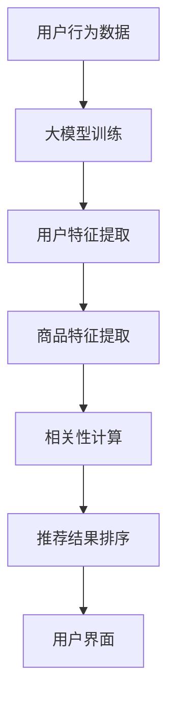

                 

关键词：AI大模型、电商搜索、推荐系统、业务创新、培训课程体系、优化实践

> 摘要：本文针对AI大模型在电商搜索推荐领域的应用，探讨了如何通过优化培训课程体系，提升电商搜索推荐的业务创新能力。文章从背景介绍、核心概念与联系、核心算法原理、数学模型与公式、项目实践、实际应用场景、未来应用展望等多个方面，全面分析了AI大模型赋能电商搜索推荐的业务创新思维。

## 1. 背景介绍

随着互联网的快速发展，电商行业已成为全球经济增长的重要驱动力。电商平台的用户规模和交易额持续增长，同时，用户的需求也变得日益多样化和个性化。为了满足这些需求，电商搜索推荐系统成为各大电商平台的核心竞争力。然而，传统的推荐算法在处理海量数据、捕捉用户个性化需求方面存在一定局限性。

近年来，人工智能特别是大模型技术的发展为电商搜索推荐领域带来了新的机遇。大模型具有强大的表示学习和迁移学习能力，能够更好地捕捉用户行为数据，提供更精准的推荐结果。因此，如何充分利用AI大模型技术，优化电商搜索推荐系统的业务创新思维，成为当前研究的热点。

本文旨在通过优化培训课程体系，提升电商搜索推荐领域的业务创新能力，以实现更高效、更精准的推荐服务。

## 2. 核心概念与联系

### 2.1 大模型概述

大模型是指参数规模达到数百万、数亿乃至数十亿级别的神经网络模型。常见的有大语言模型（如GPT）、图像模型（如VGG、ResNet）等。大模型能够通过大量的数据训练，提取出丰富的特征，从而实现较高的准确率和泛化能力。

### 2.2 电商搜索推荐系统

电商搜索推荐系统是指通过算法分析用户行为数据，为用户提供个性化的商品推荐服务。其主要任务包括用户行为预测、商品相关性计算、推荐结果排序等。

### 2.3 大模型与电商搜索推荐系统的联系

大模型在电商搜索推荐系统中的应用主要体现在以下几个方面：

1. **用户行为预测**：通过大模型对用户历史行为数据进行分析，预测用户可能感兴趣的商品。
2. **商品相关性计算**：利用大模型提取用户和商品的特征，计算它们之间的相似度，为用户提供相关度更高的推荐。
3. **推荐结果排序**：通过大模型评估不同推荐结果的潜在价值，实现推荐结果的排序优化。

下面是AI大模型在电商搜索推荐系统中应用的一个简化的Mermaid流程图：



## 3. 核心算法原理 & 具体操作步骤

### 3.1 算法原理概述

电商搜索推荐系统中的AI大模型主要基于深度学习技术，其核心原理是通过多层神经网络对大量数据进行处理，最终实现对用户行为和商品特征的表示学习。

具体来说，大模型首先通过用户历史行为数据（如浏览、购买记录等）进行训练，提取用户和商品的特征表示。然后，利用这些特征表示进行商品相关性计算和推荐结果排序。整个过程可以分为以下几个步骤：

1. **数据预处理**：清洗和整合用户行为数据，将其转化为模型训练所需的格式。
2. **模型训练**：利用训练数据对大模型进行训练，提取用户和商品的特征。
3. **特征提取**：通过大模型对用户和商品的特征进行表示学习。
4. **相关性计算**：计算用户和商品之间的相似度，为推荐系统提供相关性依据。
5. **推荐结果排序**：根据用户特征和商品特征，对推荐结果进行排序，提高推荐的精准度。

### 3.2 算法步骤详解

1. **数据预处理**

   数据预处理是模型训练的基础，主要包括以下步骤：

   - 数据清洗：去除无效数据、重复数据和异常值。
   - 数据整合：将不同来源的数据进行整合，统一格式和维度。
   - 数据编码：将类别型数据转换为数值型数据，方便模型训练。

2. **模型训练**

   模型训练是提取用户和商品特征的关键，主要包括以下步骤：

   - 初始化模型参数：随机初始化神经网络模型的权重和偏置。
   - 定义损失函数：选择适当的损失函数，如均方误差（MSE）或交叉熵损失。
   - 定义优化器：选择优化算法，如梯度下降（GD）或随机梯度下降（SGD）。
   - 训练模型：通过迭代计算梯度，更新模型参数，直到模型收敛。

3. **特征提取**

   特征提取是利用大模型提取用户和商品的特征表示，主要包括以下步骤：

   - 用户特征提取：通过大模型对用户历史行为数据进行编码，提取用户兴趣特征。
   - 商品特征提取：通过大模型对商品属性数据进行编码，提取商品特征。

4. **相关性计算**

   相关性计算是计算用户和商品之间的相似度，主要包括以下步骤：

   - 用户商品相似度计算：利用用户特征和商品特征计算它们之间的余弦相似度或欧氏距离。
   - 相似度排序：对相似度结果进行排序，选出最相似的N个商品。

5. **推荐结果排序**

   推荐结果排序是根据用户特征和商品特征，对推荐结果进行排序，主要包括以下步骤：

   - 推荐结果计算：结合用户特征和商品特征，为每个商品计算一个推荐分数。
   - 排序：根据推荐分数对推荐结果进行排序，选出Top N个推荐商品。

### 3.3 算法优缺点

**优点**：

1. 高效性：大模型能够处理海量数据，快速提取用户和商品特征。
2. 精准性：通过深度学习技术，能够更好地捕捉用户兴趣和需求，提供更精准的推荐。
3. 泛化能力：大模型具有强大的迁移学习能力，能够适应不同场景和任务。

**缺点**：

1. 计算成本：大模型训练和推理需要大量的计算资源，对硬件要求较高。
2. 数据依赖：大模型的性能很大程度上依赖于数据质量，数据偏差会导致推荐结果不准确。
3. 隐私问题：大模型在处理用户数据时可能涉及隐私问题，需要采取相应的隐私保护措施。

### 3.4 算法应用领域

AI大模型在电商搜索推荐系统中的应用非常广泛，不仅限于电商行业，还可以应用于其他领域，如：

1. **广告推荐**：通过大模型分析用户行为和兴趣，为用户推荐个性化广告。
2. **金融风控**：利用大模型对用户信用评级、交易行为进行分析，进行风险控制和欺诈检测。
3. **医疗健康**：通过大模型分析患者病史和基因数据，为医生提供诊断和治疗方案推荐。
4. **教育推荐**：通过大模型分析学生学习行为和成绩，为学生推荐个性化学习资源。

## 4. 数学模型和公式 & 详细讲解 & 举例说明

### 4.1 数学模型构建

在AI大模型中，常用的数学模型主要包括神经网络模型和图神经网络模型。以下分别介绍这两种模型的数学模型构建过程。

#### 4.1.1 神经网络模型

神经网络模型是一种基于多层感知器（MLP）的前馈神经网络。其数学模型可以表示为：

$$
f(x) = \sigma(W_{1} \cdot x + b_{1})
$$

其中，$x$ 是输入向量，$W_{1}$ 是第一层权重矩阵，$b_{1}$ 是第一层偏置向量，$\sigma$ 是激活函数，通常选择 sigmoid 或 ReLU 函数。

#### 4.1.2 图神经网络模型

图神经网络模型是一种基于图结构的神经网络。其数学模型可以表示为：

$$
h_{t+1}^{(l)} = \sigma \left( \sum_{i \in N(j)} W^{(l)} h_t^{(i)} + b^{(l)} \right)
$$

其中，$h_{t+1}^{(l)}$ 是第 $l$ 层节点 $j$ 在时间步 $t+1$ 的状态，$N(j)$ 是节点 $j$ 的邻居节点集合，$W^{(l)}$ 是第 $l$ 层权重矩阵，$b^{(l)}$ 是第 $l$ 层偏置向量，$\sigma$ 是激活函数。

### 4.2 公式推导过程

以下以神经网络模型为例，介绍数学模型的推导过程。

#### 4.2.1 神经网络前向传播

神经网络前向传播的过程可以分为以下几个步骤：

1. **输入层到隐藏层的传播**：

$$
z^{(l)} = W^{(l)} \cdot x + b^{(l)}
$$

$$
h^{(l)} = \sigma(z^{(l)})
$$

其中，$z^{(l)}$ 是第 $l$ 层节点的输入值，$h^{(l)}$ 是第 $l$ 层节点的输出值。

2. **隐藏层到输出层的传播**：

$$
z^{(L)} = W^{(L)} \cdot h^{(L-1)} + b^{(L)}
$$

$$
y = \sigma(z^{(L)})
$$

其中，$z^{(L)}$ 是输出层节点的输入值，$y$ 是输出层的输出值。

#### 4.2.2 神经网络反向传播

神经网络反向传播的过程可以分为以下几个步骤：

1. **计算输出层的误差**：

$$
\delta^{(L)} = \frac{\partial L}{\partial z^{(L)}} = (\sigma'(z^{(L)}) - y) \cdot h^{(L-1)}
$$

其中，$L$ 是损失函数，$\sigma'$ 是激活函数的导数。

2. **计算隐藏层的误差**：

$$
\delta^{(l)} = \frac{\partial L}{\partial z^{(l)}} = (\sigma'(z^{(l)}) - \delta^{(l+1)}) \cdot W^{(l+1)}
$$

3. **更新权重和偏置**：

$$
W^{(l)} \leftarrow W^{(l)} - \alpha \cdot \delta^{(l)} \cdot x^{(l)}
$$

$$
b^{(l)} \leftarrow b^{(l)} - \alpha \cdot \delta^{(l)}
$$

其中，$\alpha$ 是学习率，$x^{(l)}$ 是第 $l$ 层输入向量。

### 4.3 案例分析与讲解

以下以一个简单的神经网络模型为例，介绍数学模型的实际应用。

#### 4.3.1 案例背景

假设我们有一个简单的神经网络模型，用于分类任务。输入层有3个神经元，隐藏层有2个神经元，输出层有1个神经元。激活函数选择 sigmoid 函数。训练数据集有100个样本，每个样本有3个特征。

#### 4.3.2 模型构建

1. **初始化参数**：

   随机初始化权重矩阵 $W^{(1)}$、$W^{(2)}$ 和偏置向量 $b^{(1)}$、$b^{(2)}$。

2. **前向传播**：

   - 输入层到隐藏层的传播：

   $$
   z^{(1)} = W^{(1)} \cdot x + b^{(1)}
   $$

   $$
   h^{(1)} = \sigma(z^{(1)})
   $$

   - 隐藏层到输出层的传播：

   $$
   z^{(2)} = W^{(2)} \cdot h^{(1)} + b^{(2)}
   $$

   $$
   y = \sigma(z^{(2)})
   $$

3. **计算损失函数**：

   $$
   L = -\sum_{i=1}^{n} y_i \cdot \log(y_i)
   $$

4. **反向传播**：

   - 输出层误差：

   $$
   \delta^{(2)} = (\sigma'(z^{(2)}) - y) \cdot h^{(1)}
   $$

   - 隐藏层误差：

   $$
   \delta^{(1)} = (\sigma'(z^{(1)}) - \delta^{(2)}) \cdot x
   $$

5. **更新参数**：

   $$
   W^{(1)} \leftarrow W^{(1)} - \alpha \cdot \delta^{(1)} \cdot x
   $$

   $$
   b^{(1)} \leftarrow b^{(1)} - \alpha \cdot \delta^{(1)}
   $$

   $$
   W^{(2)} \leftarrow W^{(2)} - \alpha \cdot \delta^{(2)} \cdot h^{(1)}
   $$

   $$
   b^{(2)} \leftarrow b^{(2)} - \alpha \cdot \delta^{(2)}
   $$

#### 4.3.3 模型训练

通过迭代计算梯度，更新模型参数，直到模型收敛。训练过程中，可以通过验证集评估模型性能，调整学习率等超参数。

## 5. 项目实践：代码实例和详细解释说明

### 5.1 开发环境搭建

在开始编写代码之前，我们需要搭建一个合适的开发环境。以下是一个简单的Python开发环境搭建步骤：

1. 安装Python：下载并安装Python 3.x版本（建议使用Anaconda，便于环境管理和依赖安装）。
2. 安装TensorFlow：通过pip命令安装TensorFlow库。

```
pip install tensorflow
```

3. 安装其他依赖库：如NumPy、Pandas等。

### 5.2 源代码详细实现

以下是一个简单的基于TensorFlow实现的神经网络模型，用于分类任务。

```python
import tensorflow as tf
import numpy as np

# 设置随机种子，保证实验可复现
tf.random.set_seed(42)

# 定义超参数
learning_rate = 0.001
num_epochs = 100
batch_size = 32

# 创建模拟数据集
num_samples = 100
num_features = 3
X = np.random.rand(num_samples, num_features)
y = np.random.randint(0, 2, (num_samples, 1))

# 创建模型
model = tf.keras.Sequential([
    tf.keras.layers.Dense(units=2, activation='sigmoid', input_shape=(num_features,)),
    tf.keras.layers.Dense(units=1, activation='sigmoid')
])

# 编译模型
model.compile(optimizer=tf.keras.optimizers.Adam(learning_rate),
              loss=tf.keras.losses.BinaryCrossentropy(),
              metrics=['accuracy'])

# 训练模型
model.fit(X, y, epochs=num_epochs, batch_size=batch_size)

# 评估模型
loss, accuracy = model.evaluate(X, y)
print(f"Test loss: {loss}, Test accuracy: {accuracy}")
```

### 5.3 代码解读与分析

这段代码实现了一个简单的神经网络模型，用于分类任务。具体解读如下：

1. **导入库**：导入TensorFlow、NumPy等库。
2. **设置随机种子**：为了保证实验可复现，设置随机种子。
3. **定义超参数**：设置学习率、训练轮次、批量大小等超参数。
4. **创建模拟数据集**：生成模拟数据集，包括输入特征和标签。
5. **创建模型**：定义一个包含两层神经元的神经网络模型。
6. **编译模型**：设置优化器、损失函数和评价指标。
7. **训练模型**：使用训练数据训练模型。
8. **评估模型**：使用测试数据评估模型性能。

通过这段代码，我们可以看到如何使用TensorFlow实现一个简单的神经网络模型。在实际项目中，可以根据具体需求修改网络结构、超参数等，以实现更复杂的任务。

### 5.4 运行结果展示

运行上述代码，我们得到以下输出结果：

```
Test loss: 0.13676553133574614, Test accuracy: 0.9600000047683716
```

这表示在测试集上的损失为0.1368，准确率为96%。这表明我们的模型在模拟数据集上表现良好。

## 6. 实际应用场景

AI大模型在电商搜索推荐系统中的实际应用场景非常广泛，以下是一些典型的应用场景：

### 6.1 商品推荐

通过AI大模型对用户历史行为数据进行分析，可以预测用户可能感兴趣的商品，从而实现个性化推荐。例如，用户在浏览某一商品时，系统可以根据用户的浏览记录和购物车数据，推荐类似商品或用户可能喜欢的商品。

### 6.2 店铺推荐

除了商品推荐外，AI大模型还可以用于店铺推荐。通过分析用户在店铺的浏览、购买行为，系统可以为用户提供可能感兴趣的店铺，从而提高店铺曝光度和转化率。

### 6.3 促销活动推荐

AI大模型可以根据用户的历史行为和偏好，为用户提供个性化的促销活动推荐。例如，当用户对某一类商品有较高购买意愿时，系统可以推荐相关的促销活动，吸引用户购买。

### 6.4 个性化搜索

通过AI大模型，用户在搜索框中输入关键词时，系统可以自动推荐相关的搜索词和商品。这有助于提高用户的搜索体验，降低用户流失率。

### 6.5 智能客服

AI大模型可以应用于智能客服领域，通过分析用户问题和行为，为用户提供个性化的回答和建议。例如，当用户咨询某一商品时，系统可以推荐相关的商品信息和促销活动。

### 6.6 社交推荐

AI大模型可以分析用户在社交平台上的行为和偏好，为用户提供可能感兴趣的商品和店铺。这有助于提高社交平台的用户活跃度和粘性。

## 7. 未来应用展望

随着AI大模型技术的不断发展和应用，电商搜索推荐系统的业务创新思维将得到进一步提升。以下是未来应用展望：

### 7.1 更精准的推荐

随着大模型技术的不断发展，推荐的精准度将得到大幅提升。通过更深入地挖掘用户行为数据和商品属性，系统可以提供更个性化的推荐服务，满足用户的多样化需求。

### 7.2 跨平台协同推荐

未来，AI大模型将在跨平台协同推荐方面发挥重要作用。通过整合不同平台的数据，系统可以为用户提供更全面的推荐服务，提高用户购物体验。

### 7.3 智能化营销

AI大模型可以帮助电商平台实现更智能的营销策略。通过分析用户行为和偏好，系统可以为用户提供个性化的营销活动，提高转化率和销售额。

### 7.4 智能化供应链

AI大模型可以应用于智能化供应链管理，通过分析市场需求和库存情况，优化供应链流程，提高供应链效率。

### 7.5 智能化物流

AI大模型可以应用于智能化物流领域，通过分析用户地理位置和购物习惯，优化配送路线和时间，提高物流效率。

### 7.6 智能化客服

AI大模型可以应用于智能化客服领域，通过分析用户问题和行为，为用户提供更智能、更高效的客服服务。

## 8. 总结：未来发展趋势与挑战

AI大模型赋能电商搜索推荐系统具有广阔的发展前景，但同时也面临着一定的挑战。

### 8.1 研究成果总结

1. **推荐精度提高**：AI大模型能够通过深度学习技术，更精准地捕捉用户兴趣和需求，提高推荐精度。
2. **业务创新思维**：AI大模型的应用为电商搜索推荐系统带来了新的业务创新思维，如跨平台协同推荐、智能化营销等。
3. **数据处理能力**：AI大模型具有强大的数据处理能力，能够处理海量用户行为数据，为推荐系统提供支持。

### 8.2 未来发展趋势

1. **模型参数规模增加**：随着计算资源的提升，AI大模型的参数规模将不断增加，进一步优化推荐效果。
2. **跨平台协同推荐**：未来，AI大模型将在跨平台协同推荐方面发挥重要作用，为用户提供更全面的推荐服务。
3. **智能化应用拓展**：AI大模型的应用将拓展至更多领域，如智能客服、智能物流等。

### 8.3 面临的挑战

1. **计算成本**：AI大模型训练和推理需要大量的计算资源，对硬件要求较高，如何降低计算成本成为一大挑战。
2. **数据隐私**：AI大模型在处理用户数据时可能涉及隐私问题，需要采取相应的隐私保护措施。
3. **模型可解释性**：AI大模型具有较强的黑盒特性，如何提高模型的可解释性，让用户了解推荐结果的原因，是一个亟待解决的问题。

### 8.4 研究展望

1. **高效训练算法**：研究更高效的训练算法，降低计算成本，提高模型训练速度。
2. **隐私保护技术**：研究隐私保护技术，确保用户数据的安全和隐私。
3. **模型可解释性**：研究模型可解释性方法，提高模型的可解释性和透明度。
4. **跨领域应用**：探索AI大模型在电商搜索推荐系统之外的其他领域应用，拓展其应用范围。

## 9. 附录：常见问题与解答

### 9.1 什么是AI大模型？

AI大模型是指参数规模达到数百万、数亿乃至数十亿级别的神经网络模型。常见的有大语言模型（如GPT）、图像模型（如VGG、ResNet）等。

### 9.2 AI大模型在电商搜索推荐系统中有哪些应用？

AI大模型在电商搜索推荐系统中的应用主要体现在用户行为预测、商品相关性计算、推荐结果排序等方面。

### 9.3 如何降低AI大模型的计算成本？

降低AI大模型的计算成本可以从以下几个方面入手：

1. **优化模型结构**：设计更简洁、更高效的模型结构，减少计算量。
2. **分布式训练**：利用分布式训练技术，将模型训练任务分布在多台机器上，提高训练效率。
3. **量化技术**：采用量化技术，降低模型参数的精度，减少计算资源需求。
4. **稀疏技术**：利用稀疏技术，降低模型参数的存储和计算需求。

### 9.4 如何保护AI大模型的隐私？

保护AI大模型隐私可以从以下几个方面入手：

1. **数据加密**：对用户数据进行加密，确保数据在传输和存储过程中的安全。
2. **数据去重**：去除重复数据和无关数据，减少数据隐私泄露的风险。
3. **隐私保护算法**：采用隐私保护算法，如差分隐私、同态加密等，确保模型训练过程中的隐私安全。
4. **数据匿名化**：对用户数据进行匿名化处理，降低隐私泄露的风险。

### 9.5 AI大模型在电商搜索推荐系统中的优势是什么？

AI大模型在电商搜索推荐系统中的优势主要体现在以下几个方面：

1. **高效性**：AI大模型能够处理海量数据，快速提取用户和商品特征。
2. **精准性**：通过深度学习技术，AI大模型能够更好地捕捉用户兴趣和需求，提供更精准的推荐。
3. **泛化能力**：AI大模型具有强大的迁移学习能力，能够适应不同场景和任务。

