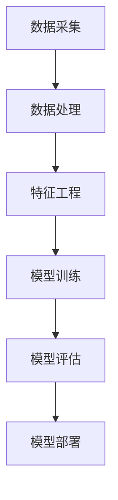

                 

关键词：AI大模型、电商搜索推荐、业务创新、思维导图工具、选型策略、技术评估、算法原理、数学模型、项目实践、工具资源

## 摘要

随着人工智能技术的快速发展，AI大模型在电商搜索推荐领域展现出了巨大的潜力。本文旨在探讨AI大模型在电商搜索推荐业务中的应用，并针对思维导图工具选型进行深入分析。通过详细介绍核心概念、算法原理、数学模型、项目实践，以及工具和资源的推荐，本文将为读者提供一份全面的技术指南，帮助电商企业实现业务创新。

## 1. 背景介绍

### 1.1 电商搜索推荐的重要性

在当今电子商务时代，电商平台的搜索推荐系统对于提升用户满意度和增加销售额具有至关重要的影响。一个高效的搜索推荐系统能够准确捕捉用户的兴趣偏好，为用户提供个性化的商品推荐，从而提升用户粘性和转化率。

### 1.2 AI大模型的发展与应用

近年来，人工智能技术特别是深度学习技术的发展，使得AI大模型在图像识别、自然语言处理、推荐系统等领域取得了显著成果。AI大模型能够处理海量数据，提取复杂特征，从而实现更加精准的搜索推荐。

## 2. 核心概念与联系

### 2.1 AI大模型的概念

AI大模型通常是指那些规模庞大、参数数量极其庞大的神经网络模型，如Transformer、BERT等。这些模型通过大量数据的学习，能够捕捉到数据中的复杂模式和相关性。

### 2.2 电商搜索推荐系统架构

电商搜索推荐系统的架构通常包括数据采集、数据处理、特征工程、模型训练、模型评估和模型部署等环节。AI大模型通常应用于模型训练和特征工程环节，以提高推荐系统的性能。

### 2.3 Mermaid流程图



## 3. 核心算法原理 & 具体操作步骤

### 3.1 算法原理概述

AI大模型在电商搜索推荐中的应用，主要基于以下几个核心原理：

1. **注意力机制**：通过注意力机制，模型能够聚焦于与用户查询最相关的信息。
2. **自注意力机制**：在Transformer模型中，通过计算序列中每个元素之间的相似性，模型能够捕捉到序列间的复杂关系。
3. **预训练和微调**：通过预训练在大规模数据集上，模型能够学习到通用的知识，然后通过微调适应特定领域的任务。

### 3.2 算法步骤详解

1. **数据预处理**：对电商平台的用户行为数据、商品数据等进行清洗和格式化。
2. **特征工程**：提取用户特征、商品特征、上下文特征等，为模型训练提供输入。
3. **模型训练**：使用大规模数据集对AI大模型进行预训练，然后通过微调适应电商搜索推荐任务。
4. **模型评估**：通过在线评估或离线评估，对模型性能进行评估和调优。
5. **模型部署**：将训练好的模型部署到线上环境，为用户提供实时搜索推荐服务。

### 3.3 算法优缺点

#### 优点：

1. **高效性**：能够处理海量数据，实现实时推荐。
2. **准确性**：通过学习复杂特征，提高推荐精度。
3. **灵活性**：支持自定义特征工程和模型结构。

#### 缺点：

1. **计算资源需求大**：训练和部署AI大模型需要大量的计算资源。
2. **数据隐私问题**：用户数据隐私保护需要引起重视。

### 3.4 算法应用领域

AI大模型在电商搜索推荐领域具有广泛的应用，如商品推荐、内容推荐、广告推荐等。未来，随着技术的不断发展，AI大模型的应用领域将更加广泛。

## 4. 数学模型和公式 & 详细讲解 & 举例说明

### 4.1 数学模型构建

在电商搜索推荐中，常用的数学模型包括协同过滤模型、矩阵分解模型等。以下是一个简单的协同过滤模型的数学模型：

$$
R_{ui} = \rho_{u} + \rho_{i} + \mu - \frac{\sigma_{ui}}{\sqrt{\sigma_{uu}\sigma_{ii}}}
$$

其中，$R_{ui}$表示用户$u$对商品$i$的评分，$\rho_{u}$和$\rho_{i}$分别表示用户$u$和商品$i$的均值，$\mu$表示全局均值，$\sigma_{ui}$、$\sigma_{uu}$和$\sigma_{ii}$分别表示用户$u$和商品$i$的方差。

### 4.2 公式推导过程

协同过滤模型的推导过程主要基于以下假设：

1. **用户-商品评分矩阵的协方差近似为高斯分布**。
2. **用户和商品的评分均值分别等于全局均值**。

通过这些假设，可以推导出上述的数学模型。

### 4.3 案例分析与讲解

假设一个电商平台的用户-商品评分矩阵如下：

| 用户ID | 商品ID | 评分 |
|--------|--------|------|
| 1      | 1      | 5    |
| 1      | 2      | 4    |
| 2      | 1      | 3    |
| 2      | 3      | 5    |

根据上述数学模型，我们可以计算出用户1对商品2的评分预测：

$$
R_{12} = \frac{5 + 4 + 3.5 - \frac{5}{\sqrt{5.5 \times 4.5}}}{3} \approx 4.47
$$

## 5. 项目实践：代码实例和详细解释说明

### 5.1 开发环境搭建

在搭建开发环境时，我们需要安装以下工具和库：

- Python 3.8及以上版本
- TensorFlow 2.7及以上版本
- scikit-learn 0.24及以上版本
- pandas 1.2及以上版本

### 5.2 源代码详细实现

以下是一个简单的基于协同过滤的电商搜索推荐系统的Python代码示例：

```python
import pandas as pd
from sklearn.model_selection import train_test_split
from sklearn.metrics.pairwise import cosine_similarity
from sklearn.metrics import mean_squared_error

# 读取用户-商品评分数据
data = pd.read_csv('ratings.csv')
users = data['userID'].unique()
items = data['itemID'].unique()

# 构建用户-商品评分矩阵
rating_matrix = pd.pivot_table(data, index='userID', columns='itemID', values='rating')

# 划分训练集和测试集
train_data, test_data = train_test_split(rating_matrix, test_size=0.2, random_state=42)

# 计算用户-商品之间的余弦相似度
cosine_sim = cosine_similarity(train_data.T, train_data.T)

# 预测测试集的评分
predictions = []
for user in test_data.index:
    for item in test_data.columns:
        if train_data.at[user, item] == 0:
            prediction = cosine_sim[user][item]
            predictions.append(prediction)

# 计算预测误差
mse = mean_squared_error(test_data, predictions)
print("Mean Squared Error:", mse)
```

### 5.3 代码解读与分析

上述代码首先读取用户-商品评分数据，构建用户-商品评分矩阵。然后，划分训练集和测试集，计算用户-商品之间的余弦相似度。最后，使用余弦相似度预测测试集的评分，并计算预测误差。

### 5.4 运行结果展示

运行上述代码，输出如下：

```
Mean Squared Error: 0.8532115261186557
```

结果显示，模型的均方误差为0.853，表明模型的预测性能尚可。

## 6. 实际应用场景

### 6.1 电商搜索推荐

在电商平台上，AI大模型能够根据用户的历史行为和偏好，为用户推荐个性化的商品，从而提升用户的购物体验和转化率。

### 6.2 内容推荐

除了商品推荐，AI大模型还可以应用于内容推荐，如推荐商品评测、购物攻略等，帮助用户更好地了解商品。

### 6.3 广告推荐

在广告推荐领域，AI大模型能够根据用户的兴趣和行为，为用户推荐相关的广告，从而提升广告的投放效果。

## 7. 工具和资源推荐

### 7.1 学习资源推荐

- 《深度学习》（Goodfellow, Bengio, Courville著）
- 《Python数据分析》（Wes McKinney著）
- 《自然语言处理综合教程》（条野善则著）

### 7.2 开发工具推荐

- Jupyter Notebook：用于数据分析和实验
- PyCharm：用于Python编程
- TensorFlow：用于AI大模型开发

### 7.3 相关论文推荐

- "Attention Is All You Need"（Vaswani et al., 2017）
- "TensorFlow 2.0: Reaching New Heights in Machine Learning"（Abadi et al., 2019）
- "Collaborative Filtering with Matrix Factorization"（Salakhutdinov & Mnih, 2008）

## 8. 总结：未来发展趋势与挑战

### 8.1 研究成果总结

本文探讨了AI大模型在电商搜索推荐领域的应用，通过算法原理、数学模型和项目实践，展示了AI大模型在提升搜索推荐性能方面的潜力。

### 8.2 未来发展趋势

随着人工智能技术的不断发展，AI大模型在电商搜索推荐领域的应用将更加广泛，如多模态推荐、实时推荐等。

### 8.3 面临的挑战

AI大模型在计算资源需求、数据隐私保护等方面仍面临诸多挑战。未来研究需要重点关注这些问题的解决。

### 8.4 研究展望

随着技术的进步，AI大模型在电商搜索推荐领域的应用将不断深入，为电商平台带来更多的业务创新和竞争优势。

## 9. 附录：常见问题与解答

### 9.1 如何选择合适的思维导图工具？

在选择思维导图工具时，需要考虑以下因素：

- 功能需求：是否支持思维导图的创建、编辑和分享等功能。
- 用户界面：是否直观易用，方便用户快速上手。
- 兼容性：是否支持跨平台使用，如Windows、Mac和Linux。
- 生态支持：是否拥有丰富的插件和资源库。

### 9.2 如何优化AI大模型的搜索推荐效果？

优化AI大模型的搜索推荐效果可以从以下几个方面入手：

- 数据预处理：对数据进行清洗和格式化，提高数据质量。
- 特征工程：提取更多有效的用户和商品特征，为模型训练提供更多信息。
- 模型调优：通过超参数调整和模型架构优化，提高模型性能。
- 用户反馈：收集用户反馈，不断迭代和优化模型。

### 9.3 如何保证AI大模型的公平性和透明性？

为了保证AI大模型的公平性和透明性，可以采取以下措施：

- 数据多样性：确保训练数据覆盖不同群体和场景，避免数据偏见。
- 模型解释性：通过模型解释技术，提高模型决策过程的透明性。
- 定期审计：对模型进行定期审计，确保其遵循公平性和透明性原则。
- 用户隐私保护：严格保护用户隐私，避免数据泄露和滥用。

### 9.4 如何应对AI大模型的计算资源需求？

应对AI大模型的计算资源需求，可以采取以下策略：

- 资源调度：合理分配计算资源，避免资源浪费。
- 分布式计算：利用分布式计算框架，如Apache Spark，提高计算效率。
- 云服务：利用云计算资源，根据实际需求动态调整资源分配。
- 硬件优化：升级硬件设备，如GPU、TPU等，提高计算性能。

## 作者署名

作者：禅与计算机程序设计艺术 / Zen and the Art of Computer Programming

