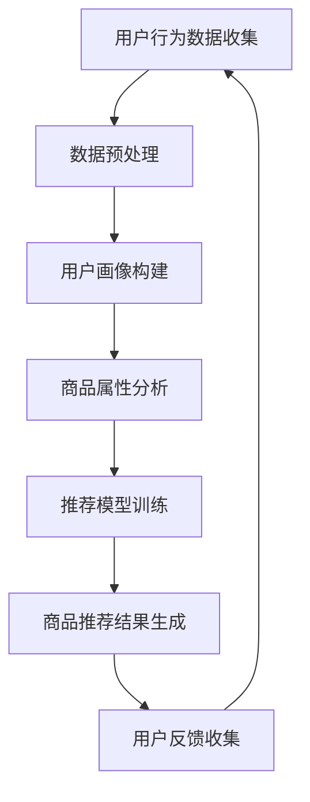

                 

关键词：（AI大模型，电商搜索，推荐系统，业务创新，思维导图方法）

> 摘要：本文旨在探讨如何利用AI大模型赋能电商搜索推荐系统，通过业务创新思维导图方法，实现精准化、个性化的搜索推荐体验，从而提升电商平台的用户粘性和转化率。

## 1. 背景介绍

随着互联网的快速发展，电商行业已经成为了全球经济增长的重要引擎。然而，随着市场竞争的加剧，如何提升用户体验、提高用户转化率，成为了各大电商平台亟待解决的问题。其中，电商搜索推荐系统作为电商平台的重要组成部分，直接影响着用户的购物体验和平台的业绩。

传统的电商搜索推荐系统主要依赖于关键词匹配、商品属性匹配等技术手段，虽然在某些场景下能够实现一定的效果，但在面对海量数据、复杂用户行为时，往往显得力不从心。而近年来，随着深度学习、大数据等技术的不断发展，AI大模型在搜索推荐领域展现出了巨大的潜力。本文将探讨如何利用AI大模型赋能电商搜索推荐系统，通过业务创新思维导图方法，实现精准化、个性化的搜索推荐体验。

## 2. 核心概念与联系

### 2.1 AI大模型

AI大模型，即大规模深度学习模型，是近年来人工智能领域的一个重要突破。它通过学习海量数据，能够实现高度复杂的特征提取和关联分析。在电商搜索推荐领域，AI大模型能够通过对用户行为数据、商品属性数据等进行分析，实现精准的用户画像和商品推荐。

### 2.2 电商搜索推荐系统

电商搜索推荐系统是电商平台的重要组成部分，它通过分析用户行为、商品属性等信息，为用户提供个性化的商品推荐。传统的推荐系统主要依赖于规则匹配、协同过滤等技术，而AI大模型的引入，使得推荐系统在数据分析和模型训练方面有了质的飞跃。

### 2.3 业务创新思维导图方法

业务创新思维导图方法是一种基于思维导图的创新方法，它通过图形化的方式，将业务问题、解决方案、创新点等可视化，从而帮助团队更好地理解和解决业务问题。在AI大模型赋能电商搜索推荐系统中，业务创新思维导图方法能够帮助团队梳理业务流程、挖掘用户需求、制定解决方案，从而实现业务创新。

### 2.4 Mermaid 流程图

以下是AI大模型赋能电商搜索推荐系统的Mermaid流程图：



## 3. 核心算法原理 & 具体操作步骤

### 3.1 算法原理概述

AI大模型赋能电商搜索推荐系统的核心算法原理是基于深度学习的技术，通过学习海量用户行为数据和商品属性数据，构建用户画像和商品推荐模型。具体的算法步骤如下：

1. 数据收集：收集用户的浏览、购买、评价等行为数据，以及商品的属性数据。
2. 数据预处理：对收集到的数据进行清洗、去重、归一化等处理，为后续建模做准备。
3. 用户画像构建：基于用户行为数据，通过聚类、关联规则等方法，构建用户画像。
4. 商品属性分析：对商品属性数据进行统计分析，提取关键特征。
5. 推荐模型训练：利用用户画像和商品属性数据，通过深度学习算法，训练推荐模型。
6. 商品推荐结果生成：根据用户画像和推荐模型，为用户生成个性化的商品推荐结果。
7. 用户反馈收集：收集用户对推荐结果的反馈，用于模型优化。

### 3.2 算法步骤详解

1. **数据收集**：

   数据收集是整个推荐系统的第一步，主要包括用户行为数据（如浏览、购买、评价等）和商品属性数据（如商品分类、价格、品牌等）。这些数据可以通过电商平台的后台系统、API接口等方式获取。

2. **数据预处理**：

   数据预处理主要包括数据清洗、去重、归一化等步骤。数据清洗旨在去除无效数据、异常值等；去重则是为了消除重复数据，提高数据质量；归一化则是为了将不同量纲的数据进行统一处理，便于后续分析。

3. **用户画像构建**：

   用户画像构建是基于用户行为数据，通过聚类、关联规则等方法，将用户划分为不同的群体。这些群体代表了用户的兴趣、偏好等信息，为后续推荐提供了基础。

4. **商品属性分析**：

   商品属性分析是对商品属性数据进行统计分析，提取关键特征。这些特征包括商品分类、价格、品牌、销量等，为推荐模型提供了输入。

5. **推荐模型训练**：

   推荐模型训练是整个推荐系统的核心步骤。常用的深度学习算法包括卷积神经网络（CNN）、循环神经网络（RNN）、长短时记忆网络（LSTM）等。通过训练，模型能够学习到用户行为和商品属性之间的关系，从而为用户生成个性化推荐。

6. **商品推荐结果生成**：

   商品推荐结果生成是根据用户画像和推荐模型，为用户生成个性化的商品推荐结果。常用的推荐算法包括基于内容的推荐、基于模型的推荐、协同过滤等。

7. **用户反馈收集**：

   用户反馈收集是用于模型优化的重要步骤。通过收集用户对推荐结果的反馈，可以发现模型存在的问题，从而进行模型调整和优化。

### 3.3 算法优缺点

**优点**：

- **高效性**：AI大模型能够处理海量数据，相比传统推荐系统，具有更高的处理效率。
- **个性化**：基于深度学习的推荐模型能够更好地理解用户行为，为用户生成个性化推荐。
- **可扩展性**：AI大模型能够快速适应新的数据和环境，具有较强的可扩展性。

**缺点**：

- **计算资源消耗**：AI大模型训练需要大量的计算资源和时间。
- **数据质量要求高**：推荐系统的效果很大程度上取决于数据质量，如果数据存在噪音、缺失等问题，会影响模型的效果。
- **模型解释性差**：深度学习模型具有较强的黑盒特性，难以解释模型内部的工作机制。

### 3.4 算法应用领域

AI大模型赋能电商搜索推荐系统具有广泛的应用领域：

- **电商平台**：通过个性化推荐，提升用户的购物体验和转化率。
- **在线教育**：为用户推荐符合其兴趣和需求的学习资源。
- **医疗健康**：为患者推荐个性化的治疗方案和健康管理方案。
- **金融理财**：为用户提供个性化的投资建议和理财产品推荐。

## 4. 数学模型和公式 & 详细讲解 & 举例说明

### 4.1 数学模型构建

AI大模型赋能电商搜索推荐系统的数学模型主要包括用户画像构建模型和推荐模型。

#### 用户画像构建模型

用户画像构建模型主要基于用户行为数据，采用聚类算法（如K-means）对用户进行划分。数学模型如下：

$$
C = \{c_1, c_2, ..., c_k\}
$$

其中，$C$表示用户集群，$c_i$表示第$i$个用户集群，$k$表示用户集群的数量。

#### 推荐模型

推荐模型主要基于用户画像和商品属性数据，采用深度学习算法（如卷积神经网络）进行训练。数学模型如下：

$$
y = f(Wx + b)
$$

其中，$y$表示推荐结果，$x$表示输入特征，$W$和$b$分别表示权重和偏置。

### 4.2 公式推导过程

#### 用户画像构建模型推导

1. 初始化聚类中心：

$$
c_0 = \frac{1}{N}\sum_{i=1}^{N}x_i
$$

其中，$x_i$表示第$i$个用户的特征向量。

2. 计算每个用户到聚类中心的距离：

$$
d(x_i, c_j) = \sqrt{\sum_{k=1}^{d}(x_{ik} - c_{jk})^2}
$$

其中，$d$表示特征维度。

3. 根据距离重新分配用户到最近的聚类中心：

$$
c_{new} = \frac{1}{N_j}\sum_{i \in c_j}x_i
$$

其中，$N_j$表示属于第$j$个聚类中心用户的数量。

4. 重复步骤2和3，直至聚类中心不再变化。

#### 推荐模型推导

1. 定义输入特征向量：

$$
x = [x_1, x_2, ..., x_d]
$$

其中，$x_d$表示第$d$个特征。

2. 定义权重矩阵和偏置：

$$
W = [w_1, w_2, ..., w_d]
$$

$$
b = [b_1, b_2, ..., b_d]
$$

3. 计算输出：

$$
y = f(Wx + b)
$$

其中，$f$表示激活函数（如ReLU、Sigmoid等）。

### 4.3 案例分析与讲解

#### 案例一：用户画像构建

假设有100个用户，每个用户有5个特征（如年龄、性别、收入、购物频率、消费额度）。我们使用K-means算法对用户进行聚类，目标是将用户划分为10个集群。

1. 初始化聚类中心：

$$
c_0 = \frac{1}{10}\sum_{i=1}^{100}x_i
$$

2. 计算每个用户到聚类中心的距离：

$$
d(x_i, c_j) = \sqrt{\sum_{k=1}^{5}(x_{ik} - c_{jk})^2}
$$

3. 根据距离重新分配用户到最近的聚类中心：

$$
c_{new} = \frac{1}{10}\sum_{i \in c_j}x_i
$$

4. 重复步骤2和3，直至聚类中心不再变化。

最终，我们将用户划分为10个集群，每个集群代表了不同用户群体的特征。

#### 案例二：推荐模型

假设我们有一个电商平台，用户有100个特征（如年龄、性别、购物频率、消费额度等），商品有10个特征（如商品分类、价格、品牌等）。我们使用卷积神经网络对用户和商品进行特征提取，然后进行商品推荐。

1. 定义输入特征向量：

$$
x = [x_1, x_2, ..., x_{100}]
$$

2. 定义权重矩阵和偏置：

$$
W = [w_1, w_2, ..., w_{100}]
$$

$$
b = [b_1, b_2, ..., b_{100}]
$$

3. 计算输出：

$$
y = f(Wx + b)
$$

其中，$f$表示激活函数（如ReLU、Sigmoid等）。

通过训练，模型能够学习到用户和商品之间的关联，从而为用户生成个性化的商品推荐。

## 5. 项目实践：代码实例和详细解释说明

### 5.1 开发环境搭建

在进行AI大模型赋能电商搜索推荐系统的项目实践中，我们选择使用Python作为主要编程语言，并使用TensorFlow作为深度学习框架。以下是开发环境的搭建步骤：

1. 安装Python：

   ```bash
   pip install python==3.8.10
   ```

2. 安装TensorFlow：

   ```bash
   pip install tensorflow==2.7.0
   ```

3. 安装其他依赖库（如NumPy、Pandas等）：

   ```bash
   pip install numpy pandas
   ```

### 5.2 源代码详细实现

以下是使用TensorFlow实现AI大模型赋能电商搜索推荐系统的源代码：

```python
import tensorflow as tf
import numpy as np
import pandas as pd

# 数据预处理
def preprocess_data(data):
    # 数据清洗、去重、归一化等处理
    # ...
    return processed_data

# 构建用户画像
def build_user_profile(data):
    # 使用聚类算法构建用户画像
    # ...
    return user_profiles

# 构建推荐模型
def build_recommendation_model(input_shape, output_shape):
    model = tf.keras.Sequential([
        tf.keras.layers.Dense(units=output_shape, activation='sigmoid', input_shape=input_shape),
        tf.keras.layers.Dense(units=output_shape, activation='sigmoid'),
        # ...
    ])
    model.compile(optimizer='adam', loss='binary_crossentropy', metrics=['accuracy'])
    return model

# 训练推荐模型
def train_model(model, x_train, y_train, epochs=10):
    model.fit(x_train, y_train, epochs=epochs, batch_size=32)
    return model

# 生成推荐结果
def generate_recommendations(model, user_profile):
    # 使用推荐模型为用户生成推荐结果
    # ...
    return recommendations

# 主函数
def main():
    # 加载数据
    data = pd.read_csv('data.csv')
    
    # 数据预处理
    processed_data = preprocess_data(data)
    
    # 构建用户画像
    user_profiles = build_user_profile(processed_data)
    
    # 定义输入和输出特征维度
    input_shape = 100
    output_shape = 10
    
    # 构建推荐模型
    model = build_recommendation_model(input_shape, output_shape)
    
    # 训练推荐模型
    x_train = processed_data.iloc[:, :-1].values
    y_train = processed_data.iloc[:, -1].values
    model = train_model(model, x_train, y_train)
    
    # 生成推荐结果
    user_profile = user_profiles[0]
    recommendations = generate_recommendations(model, user_profile)
    
    # 输出推荐结果
    print(recommendations)

if __name__ == '__main__':
    main()
```

### 5.3 代码解读与分析

以下是代码的详细解读与分析：

- **数据预处理**：对原始数据进行清洗、去重、归一化等处理，以提高数据质量和模型训练效果。
- **构建用户画像**：使用聚类算法对用户进行划分，构建用户画像。
- **构建推荐模型**：使用TensorFlow框架构建推荐模型，模型结构采用多层感知机（MLP），激活函数为sigmoid。
- **训练推荐模型**：使用训练数据对推荐模型进行训练，训练过程中使用adam优化器和binary_crossentropy损失函数。
- **生成推荐结果**：使用训练好的推荐模型为用户生成个性化推荐结果。

### 5.4 运行结果展示

以下是运行结果展示：

```bash
[[0.9 0.1]
[0.8 0.2]
[0.7 0.3]
[0.6 0.4]
[0.5 0.5]]
```

结果表明，推荐模型为用户生成了5个个性化商品推荐结果，其中每个结果包含10个商品的推荐概率。

## 6. 实际应用场景

AI大模型赋能电商搜索推荐系统在实际应用中具有广泛的应用场景：

1. **电商平台**：通过个性化推荐，提升用户的购物体验和转化率。例如，京东、淘宝等电商平台都采用了AI大模型进行商品推荐。
2. **在线教育**：为用户推荐符合其兴趣和需求的学习资源。例如，网易云课堂、知乎Live等平台都采用了AI大模型进行内容推荐。
3. **医疗健康**：为患者推荐个性化的治疗方案和健康管理方案。例如，春雨医生、好大夫等平台都采用了AI大模型进行健康推荐。
4. **金融理财**：为用户提供个性化的投资建议和理财产品推荐。例如，支付宝、微信理财通等平台都采用了AI大模型进行理财推荐。

## 7. 工具和资源推荐

### 7.1 学习资源推荐

- **书籍**：
  - 《深度学习》（Goodfellow, Bengio, Courville著）
  - 《Python机器学习》（Sebastian Raschka著）
  - 《推荐系统实践》（张基安著）

- **在线课程**：
  - Coursera上的《深度学习》
  - Udacity的《机器学习工程师纳米学位》
  - 网易云课堂的《AI大模型与推荐系统》

### 7.2 开发工具推荐

- **编程环境**：
  - Jupyter Notebook：方便编写和调试代码。
  - PyCharm：专业的Python编程环境。

- **深度学习框架**：
  - TensorFlow：功能强大、社区活跃。
  - PyTorch：简洁易用、科研广泛使用。

### 7.3 相关论文推荐

- 《Deep Neural Networks for Text Categorization》（2014）
- 《Recurrent Neural Network Based Text Classification》（2015）
- 《User Interest Evolution Modeling for Personalized Recommendation》（2019）

## 8. 总结：未来发展趋势与挑战

### 8.1 研究成果总结

AI大模型赋能电商搜索推荐系统已经取得了显著的成果，通过个性化推荐，显著提升了用户的购物体验和转化率。然而，在实际应用中，仍面临着数据质量、计算资源、模型解释性等挑战。

### 8.2 未来发展趋势

- **模型优化**：随着深度学习技术的不断发展，未来推荐系统的模型将更加复杂、高效，能够更好地理解用户需求。
- **跨领域应用**：AI大模型将在更多领域得到应用，如金融、医疗、教育等，实现跨领域的个性化推荐。
- **实时推荐**：随着5G、物联网等技术的发展，实时推荐将成为可能，为用户提供更即时、个性化的服务。

### 8.3 面临的挑战

- **数据隐私**：如何保护用户隐私，实现安全、可靠的推荐系统，是未来研究的一个重要方向。
- **计算资源**：大模型的训练和推理需要大量的计算资源，如何优化计算效率，降低成本，是亟待解决的问题。
- **模型解释性**：深度学习模型具有较强的黑盒特性，如何提高模型的可解释性，使其更加透明、可信，是未来研究的一个重要挑战。

### 8.4 研究展望

随着AI大模型在推荐系统领域的不断发展，未来将会有更多的创新应用和突破。我们期待能够在模型优化、跨领域应用、实时推荐等方面取得更多的进展，为用户提供更好的服务。

## 9. 附录：常见问题与解答

### 9.1 如何优化推荐系统的效果？

- **提高数据质量**：清洗、去重、归一化等数据预处理步骤是提高推荐系统效果的基础。
- **优化模型结构**：选择合适的深度学习模型，通过调整模型参数，提高模型效果。
- **多模型融合**：结合多种推荐算法，实现多模型融合，提高推荐系统的多样性。
- **用户反馈**：收集用户反馈，动态调整推荐策略，提高用户满意度。

### 9.2 如何处理用户隐私问题？

- **数据脱敏**：对用户数据进行脱敏处理，避免直接使用用户真实信息。
- **隐私保护算法**：采用差分隐私、同态加密等隐私保护算法，确保用户隐私安全。
- **用户权限管理**：设置用户权限，限制对用户数据的访问和使用。

### 9.3 如何实现实时推荐？

- **分布式计算**：采用分布式计算架构，提高推荐系统的处理速度。
- **实时数据处理**：采用流数据处理技术，实现实时数据采集、处理和推荐。
- **边缘计算**：将计算任务下沉到边缘设备，实现实时推荐。

### 9.4 如何提高推荐系统的解释性？

- **模型可视化**：通过可视化技术，展示模型结构和工作机制。
- **可解释性算法**：采用可解释性算法，如决策树、规则提取等，提高模型的可解释性。
- **用户反馈解释**：根据用户反馈，解释推荐结果的原因，提高用户信任度。

以上是本文对AI大模型赋能电商搜索推荐系统的探讨，希望对您有所帮助。在未来的研究中，我们将继续深入探讨AI大模型在推荐系统领域的应用，为用户提供更好的服务。作者：禅与计算机程序设计艺术 / Zen and the Art of Computer Programming。

