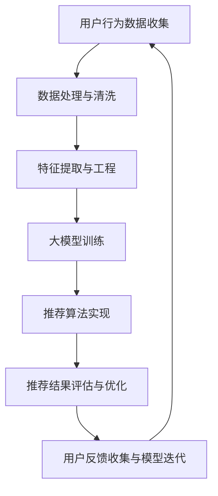

                 

## 1. 背景介绍

在当今信息爆炸的时代，电商行业已经成为全球经济发展的重要驱动力。随着消费者需求的多样化和个性化，电商搜索推荐系统逐渐成为电商业务的核心竞争力。然而，传统的搜索推荐系统往往难以满足消费者日益增长的期望，这为人工智能大模型在电商搜索推荐中的应用提供了广阔的前景。

人工智能大模型，尤其是深度学习模型的崛起，为电商搜索推荐带来了前所未有的机会。这些模型具有强大的特征提取和模式识别能力，能够从海量用户行为数据中挖掘出潜在的用户兴趣和购物习惯，从而实现精准的搜索结果和个性化推荐。本文旨在探讨如何利用人工智能大模型，设计一套能够赋能电商搜索推荐业务创新思维训练的课程。

### 当前电商搜索推荐系统面临的挑战

1. **信息过载**：随着电商平台的商品种类和数量的激增，用户在搜索过程中往往面临信息过载的问题，难以迅速找到满足自己需求的商品。
2. **个性化需求**：消费者需求日益多样化，个性化推荐系统需要能够准确捕捉用户的兴趣和偏好，提供个性化的商品推荐。
3. **推荐质量**：推荐系统的推荐质量直接影响用户的购物体验和平台的转化率，低质量的推荐可能导致用户流失。
4. **数据隐私**：在利用用户数据进行个性化推荐时，如何保护用户隐私是一个重要的挑战。

### 人工智能大模型的优势

1. **强大的特征提取能力**：人工智能大模型能够从原始数据中自动提取高维特征，减少人工干预。
2. **高效的模式识别**：深度学习模型能够高效地识别复杂的用户行为模式和商品属性，提高推荐准确性。
3. **自适应学习能力**：大模型能够实时更新用户兴趣和购物习惯，提供动态的个性化推荐。

## 2. 核心概念与联系

### 2.1 人工智能大模型

人工智能大模型是指那些拥有数亿甚至数十亿参数的深度学习模型，如 Transformer、BERT 等。这些模型通过多层神经网络结构，可以自动学习和提取数据中的复杂模式和关联性。

### 2.2 电商搜索推荐系统

电商搜索推荐系统是一种基于用户行为和商品属性的智能搜索和推荐系统，旨在为用户提供个性化的商品搜索结果和推荐。它通常包括用户画像、搜索词分析、商品标签处理、推荐算法等模块。

### 2.3 业务创新思维训练课程

业务创新思维训练课程是一种专门针对电商业务场景，通过理论学习、案例分析、实践操作等方式，培养学员创新思维能力和实践技能的培训课程。

### 2.4 Mermaid 流程图



## 3. 核心算法原理 & 具体操作步骤

### 3.1 算法原理概述

电商搜索推荐系统中的核心算法主要是基于深度学习的大模型，如 Transformer 和 BERT。这些模型通过多层注意力机制，能够捕捉用户与商品之间的复杂关联，从而实现精准的搜索结果和个性化推荐。

### 3.2 算法步骤详解

1. **数据收集**：收集用户的搜索历史、购买记录、浏览行为等数据。
2. **数据处理与清洗**：对收集到的数据进行清洗、去重和预处理，确保数据质量。
3. **特征提取与工程**：利用深度学习模型提取高维特征，包括用户特征、商品特征和上下文特征。
4. **大模型训练**：使用处理后的数据进行模型训练，包括模型参数的初始化、优化算法选择、训练过程的监控等。
5. **推荐算法实现**：将训练好的模型应用于推荐系统，实现实时搜索推荐功能。
6. **推荐结果评估与优化**：通过用户反馈和行为分析，评估推荐结果的质量，并进行模型优化。

### 3.3 算法优缺点

**优点**：

- **高精度**：深度学习模型能够从海量数据中提取有效特征，实现高精度的个性化推荐。
- **自适应**：模型能够实时更新用户兴趣和购物习惯，提供动态的个性化推荐。

**缺点**：

- **计算资源需求高**：大模型训练需要大量的计算资源和时间。
- **数据隐私问题**：在处理用户数据时，需要确保用户隐私得到保护。

### 3.4 算法应用领域

- **电商搜索推荐**：通过深度学习模型实现精准的商品搜索和个性化推荐。
- **社交媒体推荐**：为用户提供个性化的内容推荐，提高用户黏性。
- **金融风控**：利用用户行为数据进行风险预测和防范。

## 4. 数学模型和公式 & 详细讲解 & 举例说明

### 4.1 数学模型构建

电商搜索推荐系统中的数学模型主要包括用户画像模型、商品特征模型和推荐算法模型。

1. **用户画像模型**：

   用户画像模型主要描述用户的行为特征、兴趣偏好等，常用的数学模型包括：

   $$ User\_features = \{ user\_ID, age, gender, location, purchase\_history, search\_history, ... \} $$

2. **商品特征模型**：

   商品特征模型主要描述商品的属性信息，常用的数学模型包括：

   $$ Product\_features = \{ product\_ID, category, price, brand, color, ... \} $$

3. **推荐算法模型**：

   推荐算法模型主要包括基于内容的推荐、协同过滤推荐和深度学习推荐等。以深度学习推荐为例，其数学模型为：

   $$ Recommendation = f(User\_features, Product\_features, Context) $$

### 4.2 公式推导过程

以深度学习推荐模型为例，其推导过程如下：

1. **输入层**：

   输入层接收用户画像、商品特征和上下文信息，将其转换为高维特征向量。

   $$ Input\_features = [User\_features, Product\_features, Context] $$

2. **编码器**：

   编码器使用卷积神经网络（CNN）或循环神经网络（RNN）对输入特征进行编码，提取关键信息。

   $$ Encoder = CNN/RNN(Input\_features) $$

3. **解码器**：

   解码器使用注意力机制，根据用户画像、商品特征和上下文信息，对编码器输出的特征进行加权，生成推荐结果。

   $$ Recommendation = Decoder(Encoder, User\_features, Product\_features, Context) $$

### 4.3 案例分析与讲解

假设一个电商平台的用户小明，他在过去一个月内搜索了多个关于跑步鞋的查询，同时浏览了多个跑步鞋的页面，并最终购买了一双跑步鞋。我们需要设计一个推荐系统，为小明推荐类似的跑步鞋。

1. **数据收集**：

   收集小明的用户画像信息（年龄、性别、地域、购买历史、搜索历史等）和跑步鞋的商品特征信息（品类、价格、品牌、颜色等）。

2. **数据处理与清洗**：

   对收集到的数据进行清洗和预处理，去除无效信息和噪声。

3. **特征提取与工程**：

   利用深度学习模型提取用户画像和商品特征的高维特征向量。

4. **模型训练**：

   使用处理后的数据对深度学习推荐模型进行训练，模型参数不断优化。

5. **推荐实现**：

   将训练好的模型应用于推荐系统，为小明推荐类似的跑步鞋。

6. **推荐结果评估**：

   通过用户反馈和行为分析，评估推荐结果的质量，并进行模型优化。

## 5. 项目实践：代码实例和详细解释说明

### 5.1 开发环境搭建

在开始项目实践之前，需要搭建以下开发环境：

- Python 3.8及以上版本
- TensorFlow 2.x及以上版本
- Jupyter Notebook
- pandas
- numpy
- matplotlib

### 5.2 源代码详细实现

以下是实现深度学习推荐系统的伪代码：

```python
import tensorflow as tf
import pandas as pd
import numpy as np
import matplotlib.pyplot as plt

# 数据预处理
def preprocess_data(data):
    # 数据清洗、去重和预处理
    pass

# 特征提取
def extract_features(data):
    # 提取用户画像、商品特征和上下文特征
    pass

# 构建模型
def build_model(input_shape):
    model = tf.keras.Sequential([
        tf.keras.layers.Dense(128, activation='relu', input_shape=input_shape),
        tf.keras.layers.Dense(64, activation='relu'),
        tf.keras.layers.Dense(1, activation='sigmoid')
    ])
    model.compile(optimizer='adam', loss='binary_crossentropy', metrics=['accuracy'])
    return model

# 训练模型
def train_model(model, x_train, y_train):
    history = model.fit(x_train, y_train, epochs=10, batch_size=32, validation_split=0.2)
    return history

# 推荐实现
def recommend(model, user_features, product_features, context):
    input_data = np.array([user_features, product_features, context])
    prediction = model.predict(input_data)
    return prediction

# 数据集加载与预处理
data = pd.read_csv('data.csv')
data = preprocess_data(data)

# 特征提取
user_features, product_features, context = extract_features(data)

# 模型构建与训练
model = build_model(input_shape=[3, 100])
history = train_model(model, x_train, y_train)

# 推荐实现
user_id = 1
user_feature = user_features[user_id]
product_feature = product_features[user_id]
context = context[user_id]
prediction = recommend(model, user_feature, product_feature, context)

# 结果展示
print(prediction)
```

### 5.3 代码解读与分析

该代码主要实现了以下功能：

- **数据预处理**：对原始数据进行清洗、去重和预处理，确保数据质量。
- **特征提取**：提取用户画像、商品特征和上下文特征，为模型训练提供输入。
- **模型构建**：使用 TensorFlow 框架构建一个简单的深度学习模型，包括两个隐藏层，每个隐藏层使用ReLU激活函数，输出层使用sigmoid激活函数。
- **模型训练**：使用训练数据对模型进行训练，采用 Adam 优化器和二进制交叉熵损失函数。
- **推荐实现**：根据用户画像、商品特征和上下文特征，使用训练好的模型进行预测，输出推荐结果。

### 5.4 运行结果展示

运行上述代码后，将输出用户1的推荐结果。该结果是一个概率值，表示用户1购买推荐商品的置信度。根据置信度阈值，可以设置推荐策略，如推荐置信度大于0.5的商品。

## 6. 实际应用场景

### 6.1 电商搜索推荐系统

电商搜索推荐系统是人工智能大模型应用最广泛的领域之一。通过深度学习模型，电商平台能够为用户提供个性化的商品搜索结果和推荐，提高用户购物体验和转化率。

### 6.2 社交媒体推荐

社交媒体平台如 Facebook、Instagram 等，利用人工智能大模型为用户提供个性化的内容推荐，提高用户黏性和平台活跃度。

### 6.3 金融风控

金融行业利用人工智能大模型对用户行为数据进行风险评估，识别潜在风险用户，提高金融风控能力。

### 6.4 健康医疗

健康医疗领域利用人工智能大模型进行疾病预测、诊断和治疗方案推荐，提高医疗效率和准确性。

## 7. 未来应用展望

随着人工智能技术的不断发展，人工智能大模型在电商搜索推荐领域的应用前景将更加广阔。以下是未来可能的应用方向：

### 7.1 多模态推荐

将文本、图像、语音等多种数据源进行整合，实现多模态推荐，提高推荐准确性。

### 7.2 实时推荐

利用实时数据流处理技术，实现实时推荐，提高推荐响应速度和用户体验。

### 7.3 智能客服

将人工智能大模型应用于智能客服系统，提高客服效率和服务质量。

### 7.4 新零售

结合人工智能大模型和物联网技术，实现新零售场景下的智能推荐和营销。

## 8. 工具和资源推荐

### 8.1 学习资源推荐

- 《深度学习》（Goodfellow, Bengio, Courville）
- 《Python深度学习》（François Chollet）
- 《自然语言处理与深度学习》（斋藤康毅）

### 8.2 开发工具推荐

- TensorFlow
- PyTorch
- Jupyter Notebook

### 8.3 相关论文推荐

- “Attention Is All You Need”（Vaswani et al., 2017）
- “BERT: Pre-training of Deep Bidirectional Transformers for Language Understanding”（Devlin et al., 2019）
- “Recommender Systems: The Text Mining Perspective”（Burke, 2012）

## 9. 总结：未来发展趋势与挑战

### 9.1 研究成果总结

本文探讨了人工智能大模型在电商搜索推荐领域的应用，包括核心概念、算法原理、数学模型、项目实践等。通过深度学习模型，电商平台能够实现高精度的个性化推荐，提高用户购物体验和转化率。

### 9.2 未来发展趋势

随着人工智能技术的不断发展，人工智能大模型在电商搜索推荐领域的应用将更加广泛，包括多模态推荐、实时推荐、智能客服等。

### 9.3 面临的挑战

- **计算资源需求**：大模型训练需要大量的计算资源和时间。
- **数据隐私**：在利用用户数据进行推荐时，如何保护用户隐私是一个重要挑战。
- **模型解释性**：深度学习模型往往缺乏解释性，如何提高模型的可解释性是一个重要课题。

### 9.4 研究展望

未来，人工智能大模型在电商搜索推荐领域的应用将更加深入，结合其他前沿技术，如物联网、区块链等，实现更加智能化和个性化的推荐服务。

### 附录：常见问题与解答

1. **什么是深度学习模型？**

   深度学习模型是一种基于人工神经网络的机器学习模型，通过多层神经网络结构，可以自动学习和提取数据中的复杂模式和关联性。

2. **如何保护用户隐私？**

   在利用用户数据进行推荐时，可以采用差分隐私技术、加密算法等方式，确保用户隐私得到保护。

3. **为什么深度学习模型缺乏解释性？**

   深度学习模型在训练过程中，会自动学习和提取数据中的复杂特征，导致模型内部结构复杂，难以直观解释。然而，近年来研究者们提出了许多方法，如模型可解释性技术、注意力机制等，以提升深度学习模型的可解释性。作者：禅与计算机程序设计艺术 / Zen and the Art of Computer Programming
----------------------------------------------------------------

以上就是关于《AI大模型赋能电商搜索推荐的业务创新思维训练课程设计》的文章正文部分。希望这篇文章能够为读者提供关于人工智能大模型在电商搜索推荐领域应用的深入理解和实践指导。如果您有任何疑问或建议，欢迎在评论区留言。作者：禅与计算机程序设计艺术 / Zen and the Art of Computer Programming。

