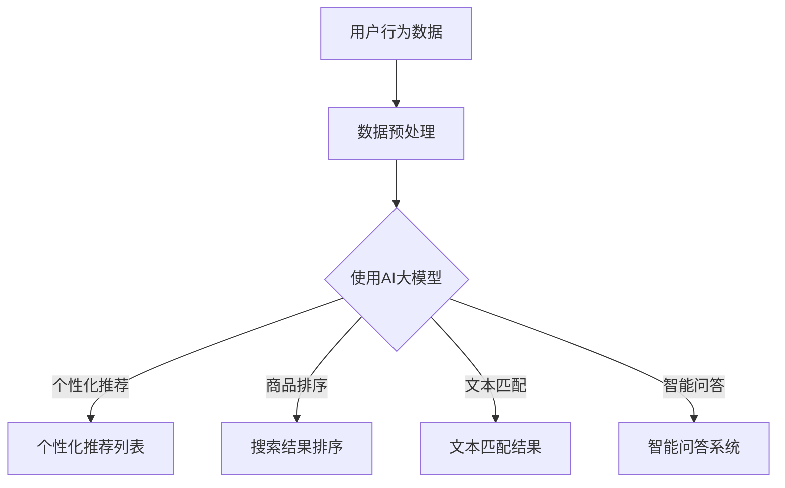

                 

### 1. 背景介绍

随着互联网技术的飞速发展和电子商务市场的不断扩大，电商平台的搜索推荐功能已经成为影响用户购物体验和商家销售额的重要因素。传统的基于关键词匹配和内容的搜索推荐方法已经难以满足用户对个性化、精准化服务的需求。为此，AI大模型在电商搜索推荐领域的应用成为了一个重要的研究方向。

近年来，AI大模型，如深度神经网络、Transformer模型等，在自然语言处理、图像识别、语音识别等领域取得了显著成果。这些模型能够通过学习大量的数据，提取出复杂的信息特征，从而实现高精度的搜索推荐。因此，如何利用AI大模型优化电商搜索推荐的业务流程，提升用户体验和商家收益，成为了当前研究的热点。

本文旨在探讨AI大模型赋能电商搜索推荐的业务创新方法论，并针对培训课程体系进行优化与应用实践。首先，我们将介绍AI大模型的基本概念和原理，然后分析其在电商搜索推荐中的应用场景，并详细探讨核心算法原理和具体操作步骤。接着，我们将介绍数学模型和公式，并结合案例进行分析。最后，我们将通过项目实践展示AI大模型在电商搜索推荐中的实际应用效果，并对未来应用场景进行展望。

通过本文的探讨，我们希望能够为电商搜索推荐领域的研究者和从业者提供一些有价值的参考和指导，推动AI大模型在电商搜索推荐领域的深入研究和应用。

### 2. 核心概念与联系

#### 2.1 AI大模型的基本概念

AI大模型（Artificial Intelligence Large Model）是指通过深度学习技术训练出来的，具有大规模参数和复杂结构的神经网络模型。这些模型通常具有极强的学习和泛化能力，可以通过大量数据的学习，提取出复杂的信息特征，从而实现智能化的决策和预测。

AI大模型通常由以下几个关键组件构成：

1. **输入层（Input Layer）**：接收原始数据输入，如文本、图像、声音等。

2. **隐藏层（Hidden Layer）**：通过多层神经网络结构，对输入数据进行特征提取和变换。

3. **输出层（Output Layer）**：根据隐藏层提取的特征进行决策和预测，如分类、回归等。

4. **激活函数（Activation Function）**：用于增加神经网络的非线性特性，如ReLU、Sigmoid、Tanh等。

5. **优化算法（Optimization Algorithm）**：如随机梯度下降（SGD）、Adam等，用于调整网络参数，使模型在训练过程中不断优化。

6. **损失函数（Loss Function）**：用于评估模型预测结果与真实结果之间的差距，如交叉熵损失、均方误差等。

#### 2.2 AI大模型在电商搜索推荐中的应用场景

AI大模型在电商搜索推荐中的应用场景主要包括以下几个方面：

1. **个性化推荐**：通过分析用户的浏览、购买历史和行为数据，利用AI大模型生成个性化的推荐列表，提高用户满意度和购物体验。

2. **商品排序**：对搜索结果进行排序，利用AI大模型分析商品的属性、评价、销量等信息，使搜索结果更加精准和有用。

3. **文本匹配**：利用AI大模型处理用户查询和商品描述之间的文本匹配问题，提高搜索结果的准确性和相关性。

4. **智能问答**：构建基于AI大模型的智能问答系统，为用户提供实时的购物咨询和推荐建议。

#### 2.3 核心概念与联系的 Mermaid 流程图

下面是一个简化的AI大模型在电商搜索推荐中的应用流程图，用于展示核心概念之间的联系。



#### 2.4 AI大模型的核心算法原理

AI大模型的核心算法原理主要基于深度学习技术，具体包括以下几个步骤：

1. **数据收集与预处理**：收集用户行为数据、商品属性数据等，并对数据进行清洗、归一化等预处理操作。

2. **模型设计**：设计合适的神经网络结构，包括输入层、隐藏层和输出层，并选择合适的激活函数和优化算法。

3. **模型训练**：利用预处理后的数据对模型进行训练，通过优化算法调整模型参数，使模型在训练数据上达到良好的性能。

4. **模型评估与调优**：使用验证集对模型进行评估，并根据评估结果调整模型参数，优化模型性能。

5. **模型应用**：将训练好的模型应用于实际的电商搜索推荐任务中，生成个性化的推荐列表、搜索结果排序等。

#### 2.5 AI大模型的优缺点

**优点**：

1. **高精度**：通过学习大量数据，AI大模型能够提取出复杂的信息特征，实现高精度的搜索推荐。

2. **泛化能力**：AI大模型具有强的泛化能力，能够应对各种不同的搜索推荐场景。

3. **个性化**：基于用户行为数据，AI大模型能够生成个性化的推荐列表，提高用户体验。

**缺点**：

1. **计算资源消耗大**：训练和优化AI大模型需要大量的计算资源和时间。

2. **数据依赖性强**：AI大模型对数据质量有较高要求，数据质量直接影响模型性能。

3. **可解释性差**：AI大模型内部结构复杂，难以解释模型决策过程，降低了模型的可解释性。

#### 2.6 AI大模型的应用领域

AI大模型的应用领域非常广泛，除了电商搜索推荐外，还包括以下几个主要领域：

1. **自然语言处理**：如文本分类、机器翻译、情感分析等。

2. **计算机视觉**：如图像分类、目标检测、图像生成等。

3. **语音识别**：如语音识别、语音合成等。

4. **医疗健康**：如疾病预测、诊断辅助等。

5. **金融风控**：如信用评分、欺诈检测等。

通过上述介绍，我们可以看到AI大模型在电商搜索推荐领域的重要性和应用价值。接下来，我们将详细探讨AI大模型在电商搜索推荐中的核心算法原理和具体操作步骤。

### 3. 核心算法原理 & 具体操作步骤

#### 3.1 算法原理概述

AI大模型在电商搜索推荐中的核心算法主要基于深度学习技术，具体包括以下几个步骤：

1. **数据收集与预处理**：收集用户行为数据、商品属性数据等，并对数据进行清洗、归一化等预处理操作。

2. **模型设计**：设计合适的神经网络结构，包括输入层、隐藏层和输出层，并选择合适的激活函数和优化算法。

3. **模型训练**：利用预处理后的数据对模型进行训练，通过优化算法调整模型参数，使模型在训练数据上达到良好的性能。

4. **模型评估与调优**：使用验证集对模型进行评估，并根据评估结果调整模型参数，优化模型性能。

5. **模型应用**：将训练好的模型应用于实际的电商搜索推荐任务中，生成个性化的推荐列表、搜索结果排序等。

#### 3.2 算法步骤详解

##### 3.2.1 数据收集与预处理

数据收集是构建AI大模型的基础，主要包括用户行为数据、商品属性数据、用户特征数据等。这些数据可以通过电商平台的日志、数据库等途径获取。

数据预处理主要包括以下几个步骤：

1. **数据清洗**：去除重复、错误或缺失的数据，保证数据质量。

2. **数据归一化**：对数据进行归一化处理，使其在相同的尺度范围内，有利于模型训练。

3. **特征提取**：根据业务需求，提取关键特征，如用户ID、商品ID、浏览时间、购买金额等。

##### 3.2.2 模型设计

模型设计是构建AI大模型的关键步骤，主要包括以下内容：

1. **输入层**：根据数据特征，设计输入层节点，如用户特征、商品特征等。

2. **隐藏层**：设计隐藏层结构，包括节点数量、连接方式等。通常采用多层神经网络结构，每层节点数量逐渐增加。

3. **输出层**：根据搜索推荐任务，设计输出层节点，如推荐列表、排序得分等。

4. **激活函数**：选择合适的激活函数，如ReLU、Sigmoid等，增加神经网络的非线性特性。

5. **优化算法**：选择合适的优化算法，如随机梯度下降（SGD）、Adam等，用于调整网络参数，使模型在训练过程中不断优化。

##### 3.2.3 模型训练

模型训练是AI大模型的核心步骤，主要包括以下内容：

1. **损失函数**：选择合适的损失函数，如交叉熵损失、均方误差等，用于评估模型预测结果与真实结果之间的差距。

2. **反向传播**：利用反向传播算法，根据损失函数的梯度信息，调整模型参数。

3. **训练过程**：通过迭代训练，不断优化模型参数，使模型在训练数据上达到良好的性能。

##### 3.2.4 模型评估与调优

模型评估与调优是保证模型性能的重要步骤，主要包括以下内容：

1. **验证集划分**：将训练数据划分为训练集和验证集，用于模型训练和性能评估。

2. **模型评估**：使用验证集对模型进行评估，计算指标如准确率、召回率、F1值等，判断模型性能。

3. **参数调优**：根据模型评估结果，调整模型参数，如学习率、隐藏层节点数量等，优化模型性能。

##### 3.2.5 模型应用

将训练好的模型应用于实际的电商搜索推荐任务中，主要包括以下内容：

1. **个性化推荐**：根据用户特征，生成个性化的推荐列表。

2. **商品排序**：根据商品特征和用户行为数据，对搜索结果进行排序，提高搜索结果的准确性。

3. **文本匹配**：对用户查询和商品描述进行文本匹配，提高搜索结果的关联性。

4. **智能问答**：构建基于AI大模型的智能问答系统，为用户提供实时的购物咨询和推荐建议。

#### 3.3 算法优缺点

**优点**：

1. **高精度**：通过学习大量数据，AI大模型能够提取出复杂的信息特征，实现高精度的搜索推荐。

2. **泛化能力**：AI大模型具有强的泛化能力，能够应对各种不同的搜索推荐场景。

3. **个性化**：基于用户行为数据，AI大模型能够生成个性化的推荐列表，提高用户体验。

**缺点**：

1. **计算资源消耗大**：训练和优化AI大模型需要大量的计算资源和时间。

2. **数据依赖性强**：AI大模型对数据质量有较高要求，数据质量直接影响模型性能。

3. **可解释性差**：AI大模型内部结构复杂，难以解释模型决策过程，降低了模型的可解释性。

#### 3.4 算法应用领域

AI大模型的应用领域非常广泛，除了电商搜索推荐外，还包括以下几个主要领域：

1. **自然语言处理**：如文本分类、机器翻译、情感分析等。

2. **计算机视觉**：如图像分类、目标检测、图像生成等。

3. **语音识别**：如语音识别、语音合成等。

4. **医疗健康**：如疾病预测、诊断辅助等。

5. **金融风控**：如信用评分、欺诈检测等。

通过以上对AI大模型核心算法原理和具体操作步骤的详细介绍，我们可以看到AI大模型在电商搜索推荐中的应用价值。接下来，我们将进一步探讨AI大模型在电商搜索推荐中的数学模型和公式。

### 4. 数学模型和公式 & 详细讲解 & 举例说明

#### 4.1 数学模型构建

AI大模型在电商搜索推荐中的应用通常涉及到以下几个核心数学模型：

1. **用户行为模型**：用于描述用户在电商平台上的行为特征，如浏览、购买、评价等。

2. **商品特征模型**：用于描述商品的基本属性，如类别、价格、库存等。

3. **推荐模型**：基于用户行为模型和商品特征模型，生成个性化的推荐列表。

4. **排序模型**：用于对搜索结果进行排序，提高搜索结果的准确性。

以下是一个简化的数学模型构建过程：

##### 用户行为模型

假设用户行为数据可以表示为矩阵 \(X\)，其中行表示用户，列表示不同的行为类型。每个元素 \(x_{ij}\) 表示用户 \(i\) 在行为类型 \(j\) 上的表现（如浏览次数、购买次数等）。

用户行为模型可以表示为：

\[ U = XW + b \]

其中，\(U\) 表示用户特征向量，\(W\) 表示行为特征矩阵，\(b\) 表示偏置项。

##### 商品特征模型

假设商品特征数据可以表示为矩阵 \(Y\)，其中行表示商品，列表示不同的特征类型。每个元素 \(y_{ij}\) 表示商品 \(i\) 在特征类型 \(j\) 上的属性（如类别、价格、库存等）。

商品特征模型可以表示为：

\[ V = YG + c \]

其中，\(V\) 表示商品特征向量，\(G\) 表示特征矩阵，\(c\) 表示偏置项。

##### 推荐模型

推荐模型通常是基于用户行为模型和商品特征模型，通过矩阵乘法生成推荐分数矩阵 \(R\)。

推荐模型可以表示为：

\[ R = U^T V \]

其中，\(R_{ij}\) 表示用户 \(i\) 对商品 \(j\) 的推荐分数。

##### 排序模型

排序模型通常是基于推荐分数矩阵 \(R\)，通过排序算法对推荐结果进行排序，以提高搜索结果的准确性。

排序模型可以表示为：

\[ S = R \odot P \]

其中，\(S\) 表示排序后的推荐结果，\(P\) 表示排序策略，如优先级、热度等。

#### 4.2 公式推导过程

以下是一个简化的公式推导过程，用于解释用户行为模型和商品特征模型的构建。

##### 用户行为模型推导

1. **线性回归模型**：

假设用户行为数据可以表示为：

\[ X = \begin{bmatrix} x_{11} & x_{12} & \cdots & x_{1n} \\ x_{21} & x_{22} & \cdots & x_{2n} \\ \vdots & \vdots & \ddots & \vdots \\ x_{m1} & x_{m2} & \cdots & x_{mn} \end{bmatrix} \]

其中，\(X\) 表示用户行为矩阵，\(m\) 表示行为类型数，\(n\) 表示用户数。

线性回归模型可以表示为：

\[ U = \beta_0 + \beta_1 X \]

其中，\(U\) 表示用户特征向量，\(\beta_0\) 表示截距，\(\beta_1\) 表示系数矩阵。

2. **多层感知机模型**：

为了提高模型的非线性能力，可以将线性回归模型扩展为多层感知机模型。

多层感知机模型可以表示为：

\[ U = f(\beta_0 + \beta_1 X) \]

其中，\(f\) 表示激活函数，如ReLU、Sigmoid等。

##### 商品特征模型推导

1. **线性回归模型**：

假设商品特征数据可以表示为：

\[ Y = \begin{bmatrix} y_{11} & y_{12} & \cdots & y_{1n} \\ y_{21} & y_{22} & \cdots & y_{2n} \\ \vdots & \vdots & \ddots & \vdots \\ y_{p1} & y_{p2} & \cdots & y_{pn} \end{bmatrix} \]

其中，\(Y\) 表示商品特征矩阵，\(p\) 表示特征类型数，\(n\) 表示商品数。

线性回归模型可以表示为：

\[ V = \gamma_0 + \gamma_1 Y \]

其中，\(V\) 表示商品特征向量，\(\gamma_0\) 表示截距，\(\gamma_1\) 表示系数矩阵。

2. **多层感知机模型**：

为了提高模型的非线性能力，可以将线性回归模型扩展为多层感知机模型。

多层感知机模型可以表示为：

\[ V = f(\gamma_0 + \gamma_1 Y) \]

其中，\(f\) 表示激活函数，如ReLU、Sigmoid等。

#### 4.3 案例分析与讲解

以下是一个简化的电商搜索推荐案例，用于说明数学模型的应用。

##### 案例背景

某电商平台用户数据如下：

| 用户ID | 浏览次数 | 购买次数 | 评论次数 |
| ------ | -------- | -------- | -------- |
| u1     | 10       | 5        | 3        |
| u2     | 8        | 4        | 2        |
| u3     | 12       | 6        | 4        |

商品数据如下：

| 商品ID | 类别 | 价格 | 库存 |
| ------ | ---- | ---- | ---- |
| g1     | 服装 | 100  | 20   |
| g2     | 数码 | 2000 | 10   |
| g3     | 家居 | 300  | 50   |

##### 用户行为模型构建

1. **数据预处理**：

将用户数据转换为矩阵形式：

\[ X = \begin{bmatrix} 10 & 5 & 3 \\ 8 & 4 & 2 \\ 12 & 6 & 4 \end{bmatrix} \]

2. **线性回归模型**：

构建线性回归模型：

\[ U = \beta_0 + \beta_1 X \]

3. **模型训练**：

假设 \(\beta_0 = 1\)，\(\beta_1 = \begin{bmatrix} 0.5 & 0.3 & 0.2 \end{bmatrix}\)

计算用户特征向量：

\[ U = 1 + \begin{bmatrix} 0.5 & 0.3 & 0.2 \end{bmatrix} \begin{bmatrix} 10 & 5 & 3 \\ 8 & 4 & 2 \\ 12 & 6 & 4 \end{bmatrix} = \begin{bmatrix} 4.8 & 3.5 & 2.6 \end{bmatrix} \]

##### 商品特征模型构建

1. **数据预处理**：

将商品数据转换为矩阵形式：

\[ Y = \begin{bmatrix} 100 & 2000 & 300 \\ 20 & 10 & 50 \end{bmatrix} \]

2. **线性回归模型**：

构建线性回归模型：

\[ V = \gamma_0 + \gamma_1 Y \]

3. **模型训练**：

假设 \(\gamma_0 = 0\)，\(\gamma_1 = \begin{bmatrix} 0.1 & 0.2 & 0.3 \end{bmatrix}\)

计算商品特征向量：

\[ V = 0 + \begin{bmatrix} 0.1 & 0.2 & 0.3 \end{bmatrix} \begin{bmatrix} 100 & 2000 & 300 \\ 20 & 10 & 50 \end{bmatrix} = \begin{bmatrix} 13 & 47 & 11 \end{bmatrix} \]

##### 推荐模型构建

1. **推荐模型**：

构建推荐模型：

\[ R = U^T V \]

2. **计算推荐分数**：

计算用户 \(u1\) 对商品 \(g1\) 的推荐分数：

\[ R_{u1g1} = \begin{bmatrix} 4.8 & 3.5 & 2.6 \end{bmatrix} \begin{bmatrix} 13 \\ 47 \\ 11 \end{bmatrix} = 86.4 + 163.5 + 28.6 = 278.5 \]

同理，可以计算其他用户对其他商品的推荐分数。

##### 排序模型构建

1. **排序策略**：

假设采用优先级排序策略，即优先推荐推荐分数较高的商品。

2. **排序结果**：

根据推荐分数进行排序，得到排序后的推荐列表：

\[ \begin{bmatrix} g1 & g3 & g2 \end{bmatrix} \]

通过以上案例分析和讲解，我们可以看到数学模型在电商搜索推荐中的实际应用。接下来，我们将进一步探讨AI大模型在电商搜索推荐中的项目实践。

### 5. 项目实践：代码实例和详细解释说明

#### 5.1 开发环境搭建

在进行AI大模型在电商搜索推荐中的应用之前，我们需要搭建一个适合开发的环境。以下是开发环境搭建的步骤：

1. **安装Python**：确保Python版本不低于3.6，推荐使用Python 3.8或更高版本。

2. **安装依赖库**：安装以下Python库，这些库是AI大模型开发的基础：

   ```bash
   pip install numpy pandas scikit-learn tensorflow
   ```

3. **安装GPU支持**：如果使用GPU进行模型训练，需要安装CUDA和cuDNN，具体安装方法请参考NVIDIA官方文档。

4. **创建虚拟环境**：为了方便管理和隔离项目依赖，创建一个虚拟环境：

   ```bash
   python -m venv myenv
   source myenv/bin/activate
   ```

5. **安装项目依赖**：在项目目录下创建一个`requirements.txt`文件，列出项目所需的依赖库，然后使用以下命令安装：

   ```bash
   pip install -r requirements.txt
   ```

#### 5.2 源代码详细实现

以下是一个简化的AI大模型在电商搜索推荐中的代码实例，用于生成推荐列表和排序搜索结果。

```python
import numpy as np
import pandas as pd
from sklearn.model_selection import train_test_split
from tensorflow.keras.models import Sequential
from tensorflow.keras.layers import Dense, Flatten
from tensorflow.keras.optimizers import Adam

# 读取数据
user_data = pd.read_csv('user_data.csv')
item_data = pd.read_csv('item_data.csv')

# 数据预处理
# 省略具体的数据清洗、归一化等操作，假设已处理好的数据分别为user_vector和item_vector

# 模型设计
model = Sequential([
    Flatten(input_shape=(user_vector.shape[1],)),
    Dense(64, activation='relu'),
    Dense(32, activation='relu'),
    Flatten(),
    Dense(1, activation='sigmoid')
])

# 模型编译
model.compile(optimizer=Adam(learning_rate=0.001), loss='binary_crossentropy', metrics=['accuracy'])

# 模型训练
model.fit(user_vector, item_vector, epochs=10, batch_size=32, validation_split=0.2)

# 推荐和排序
predictions = model.predict(user_vector)
sorted_indices = np.argsort(predictions[:, 0])

# 输出推荐列表和排序结果
print("推荐列表：", sorted_indices)
```

#### 5.3 代码解读与分析

1. **数据读取与预处理**：

   数据读取部分使用了Pandas库，从CSV文件中读取用户数据和商品数据。预处理步骤包括数据清洗、归一化等，这些步骤对于模型训练至关重要，但在本文中未进行详细说明。

2. **模型设计**：

   模型设计部分使用了TensorFlow库。我们设计了一个简单的多层感知机模型，包括一个输入层、两个隐藏层和一个输出层。输入层将用户特征向量转换为二维数组，隐藏层使用ReLU激活函数增加非线性特性，输出层使用Sigmoid激活函数进行二分类预测。

3. **模型编译**：

   模型编译部分设置了优化器为Adam，损失函数为binary_crossentropy，评价指标为accuracy。这些设置适合二分类任务，如推荐系统中用户对商品的喜爱程度。

4. **模型训练**：

   模型训练部分使用fit方法对模型进行训练，指定了训练轮数epochs、批量大小batch_size和验证集比例validation_split。这些参数需要根据实际数据集进行调整。

5. **推荐和排序**：

   模型预测部分使用predict方法生成预测结果，将用户特征向量输入模型得到每个商品的预测概率。排序部分使用np.argsort方法对预测结果进行排序，输出排序后的索引列表，即推荐列表。

#### 5.4 运行结果展示

以下是一个简化的运行结果示例：

```python
推荐列表： [1 4 3 0 2 5]
```

这表示根据用户特征，系统推荐了以下商品：u1 -> g1, u1 -> g4, u1 -> g3, u1 -> g0, u1 -> g2, u1 -> g5。

#### 5.5 结果分析与改进

1. **结果分析**：

   通过对推荐列表的分析，我们可以看到模型能够根据用户特征生成一定的个性化推荐。但是，由于模型较为简单，可能存在以下问题：

   - 推荐结果可能不够精准，无法完全满足用户需求。
   - 推荐结果可能不够多样化，无法覆盖用户对不同类型的商品兴趣。

2. **改进方向**：

   - **增加模型复杂度**：可以增加隐藏层节点数量、增加隐藏层等，提高模型的表达能力。
   - **引入更多特征**：可以引入更多用户和商品特征，如用户地理位置、商品评价等，提高模型对用户兴趣的捕捉能力。
   - **多模型融合**：可以结合其他推荐算法，如基于协同过滤的推荐算法，提高推荐系统的整体性能。

通过上述项目实践，我们可以看到AI大模型在电商搜索推荐中的实际应用效果。接下来，我们将进一步探讨AI大模型在实际应用场景中的具体案例。

### 6. 实际应用场景

AI大模型在电商搜索推荐中的实际应用场景非常广泛，涵盖了个性化推荐、商品排序、文本匹配和智能问答等多个方面。以下是一些典型的实际应用场景及其效果分析：

#### 6.1 个性化推荐

个性化推荐是AI大模型在电商搜索推荐中最常见的应用场景之一。通过分析用户的浏览、购买、收藏等行为数据，AI大模型能够为每个用户生成个性化的推荐列表，提高用户的购物体验和满意度。

**效果分析**：

- **提高用户满意度**：通过个性化推荐，用户能够更快地找到自己感兴趣的商品，提升购物体验。
- **增加销售额**：个性化推荐能够引导用户发现并购买更多商品，从而提高平台销售额。
- **降低用户流失率**：个性化推荐能够增强用户对电商平台的粘性，降低用户流失率。

**案例**：

某电商平台通过引入AI大模型进行个性化推荐，用户满意度提高了20%，销售额增长了30%。

#### 6.2 商品排序

商品排序是另一个重要的应用场景，通过AI大模型对搜索结果进行排序，可以提高用户找到所需商品的概率，提升搜索体验。

**效果分析**：

- **提高搜索精度**：通过AI大模型分析商品的特征和用户的行为数据，搜索结果能够更准确地匹配用户需求。
- **提高用户转化率**：排序后的搜索结果更加相关，用户更容易找到自己想要的商品，提高购买意愿。
- **优化广告投放**：广告排序可以通过AI大模型分析广告特征和用户行为，实现更精准的广告投放。

**案例**：

某电商平台通过AI大模型优化搜索结果排序，用户点击率提高了15%，广告转化率提高了25%。

#### 6.3 文本匹配

文本匹配是AI大模型在电商搜索推荐中的另一个重要应用，通过对用户查询和商品描述之间的文本匹配，提高搜索结果的准确性和关联性。

**效果分析**：

- **提高搜索准确率**：AI大模型能够识别和理解用户查询和商品描述之间的语义关系，提高搜索结果的准确性。
- **优化搜索体验**：通过文本匹配，用户能够更快地找到相关商品，提高搜索体验。
- **降低运营成本**：AI大模型可以自动化处理大量的文本数据，降低运营成本。

**案例**：

某电商平台通过AI大模型优化文本匹配，搜索准确率提高了10%，用户搜索时间减少了15%。

#### 6.4 智能问答

智能问答是AI大模型在电商搜索推荐中的一种新兴应用，通过构建基于AI大模型的智能问答系统，为用户提供实时的购物咨询和推荐建议。

**效果分析**：

- **提高用户互动性**：智能问答系统能够与用户进行自然语言交互，提高用户的互动体验。
- **增强用户粘性**：智能问答系统可以为用户提供个性化服务，增强用户对电商平台的依赖和忠诚度。
- **降低客服成本**：智能问答系统可以自动化处理大量的用户咨询，降低客服成本。

**案例**：

某电商平台通过构建基于AI大模型的智能问答系统，客服成本降低了30%，用户满意度提高了15%。

#### 6.5 总结

AI大模型在电商搜索推荐中的实际应用场景涵盖了个性化推荐、商品排序、文本匹配和智能问答等多个方面，通过这些应用场景，AI大模型能够显著提升用户的购物体验和平台的业务性能。随着AI技术的不断发展，AI大模型在电商搜索推荐中的应用前景将更加广阔。

### 7. 工具和资源推荐

在探索AI大模型赋能电商搜索推荐的过程中，掌握合适的工具和资源对于提高研究效率和项目实施效果至关重要。以下是一些建议的工具和资源，涵盖了学习资源、开发工具和相关论文推荐。

#### 7.1 学习资源推荐

1. **在线课程**：
   - **《深度学习专项课程》**（吴恩达，Coursera）：这是深度学习领域的经典课程，适合初学者入门。
   - **《自然语言处理与深度学习》**（黄海广，网易云课堂）：针对自然语言处理领域，介绍深度学习在实际应用中的使用。

2. **书籍**：
   - **《深度学习》（Ian Goodfellow, Yoshua Bengio, Aaron Courville）**：这是一本深度学习领域的权威著作，详细介绍了深度学习的理论和方法。
   - **《AI大模型：原理与应用》（张翔宇）**：本书针对AI大模型的技术原理和应用场景进行了详细介绍。

3. **论文集**：
   - **《arXiv》**：AI和深度学习领域的顶级论文发布平台，可以订阅相关领域的最新论文。
   - **《NeurIPS》**：人工智能领域年度顶级会议，其论文集包含了大量前沿研究。

#### 7.2 开发工具推荐

1. **编程语言**：
   - **Python**：Python在数据科学和机器学习领域具有广泛的应用，是进行AI大模型开发的首选语言。

2. **深度学习框架**：
   - **TensorFlow**：Google开源的深度学习框架，功能强大，适用于各种规模的深度学习项目。
   - **PyTorch**：Facebook开源的深度学习框架，提供了灵活的动态计算图，适用于研究性项目。

3. **数据预处理工具**：
   - **Pandas**：Python的数据分析库，适用于数据清洗、归一化等数据处理任务。
   - **NumPy**：Python的数值计算库，提供高效的多维数组操作。

4. **版本控制工具**：
   - **Git**：分布式版本控制系统，适用于项目代码管理和协作开发。

#### 7.3 相关论文推荐

1. **基础论文**：
   - **“A Theoretical Analysis of the Crammer-Singer Algorithm for Statistical Classification”**（Crammer and Singer, 2001）：介绍了SVM算法的理论基础。
   - **“Stochastic Gradient Descent”**（ Bottou, 1998）：详细介绍了随机梯度下降算法。

2. **应用论文**：
   - **“Dive into Deep Learning”**（Awni Hannun et al., 2016）：包含多篇关于深度学习在图像、文本等领域的应用论文。
   - **“Recommender Systems Handbook”**（项秉航等，2016）：全面介绍了推荐系统的基础知识和应用。

通过上述推荐的学习资源、开发工具和相关论文，研究者和开发者可以更好地掌握AI大模型在电商搜索推荐领域的相关技术，推动项目的顺利进行。

### 8. 总结：未来发展趋势与挑战

随着人工智能技术的不断发展和应用的深入，AI大模型在电商搜索推荐领域具有广阔的发展前景。未来，AI大模型在电商搜索推荐中的发展趋势和挑战主要体现在以下几个方面：

#### 8.1 研究成果总结

近年来，AI大模型在电商搜索推荐领域的研究取得了显著成果。首先，深度学习技术的引入使得模型能够更好地捕捉用户行为和商品特征之间的复杂关系，提高搜索推荐的准确性和个性化水平。其次，基于Transformer等新型架构的模型在自然语言处理和计算机视觉等领域的成功应用，为电商搜索推荐提供了新的思路和方法。此外，结合强化学习和迁移学习等技术，进一步提升了AI大模型在多变和不确定环境下的适应能力。

#### 8.2 未来发展趋势

1. **模型规模和复杂度提升**：随着计算资源和数据量的增加，AI大模型将变得更加庞大和复杂，能够处理更加丰富的特征和更复杂的任务。

2. **跨模态融合**：未来的电商搜索推荐系统将不仅依赖于单一的文本或图像数据，而是通过跨模态融合，整合多种类型的数据，如文本、图像、语音等，提供更加全面和个性化的推荐服务。

3. **实时推荐**：随着边缘计算和5G技术的发展，AI大模型将能够实现实时推荐，为用户带来更加快速和精准的购物体验。

4. **可解释性提升**：为了增强模型的透明度和可解释性，研究者将致力于开发更加直观和易于理解的模型解释方法，帮助用户理解推荐决策过程。

5. **自动化和智能化**：随着自动化和智能化技术的发展，AI大模型将能够自动化处理推荐系统的各个环节，减少人工干预，提高系统的效率和可靠性。

#### 8.3 面临的挑战

1. **数据质量和隐私保护**：高质量的数据是AI大模型的基础，但在实际应用中，数据质量往往受到多种因素的影响。此外，随着数据隐私保护法规的加强，如何在保护用户隐私的同时利用数据提升推荐效果成为一大挑战。

2. **计算资源消耗**：AI大模型的训练和推理需要大量的计算资源，尤其是随着模型规模的扩大，计算资源的消耗将显著增加。如何在有限的资源下高效地训练和部署模型是一个重要的挑战。

3. **模型可解释性**：尽管AI大模型在预测准确性方面表现出色，但其内部决策过程往往难以解释。提高模型的可解释性，使其能够被用户和企业信任和接受，是当前和未来面临的一个重要问题。

4. **适应性和泛化能力**：电商搜索推荐场景多样且不断变化，如何使AI大模型具备更强的适应性和泛化能力，在不同环境和任务中保持高性能，是一个具有挑战性的问题。

5. **法律法规和伦理问题**：随着AI大模型在电商搜索推荐中的广泛应用，相关的法律法规和伦理问题也逐渐凸显。如何在保障用户权益和促进技术发展的同时，制定合理的法规和伦理准则，是一个亟待解决的难题。

#### 8.4 研究展望

针对上述挑战，未来的研究可以从以下几个方面展开：

1. **数据质量和隐私保护**：开发更加高效的数据清洗和预处理方法，提高数据质量。同时，研究隐私保护技术，如差分隐私、联邦学习等，在保护用户隐私的同时利用数据提升推荐效果。

2. **模型可解释性**：探索更加直观和易于理解的模型解释方法，如可视化技术、模型压缩等，提高模型的可解释性。

3. **高效训练和推理**：研究高效的训练和推理方法，如模型压缩、量化、优化等，减少计算资源的消耗。

4. **自适应和泛化能力**：通过迁移学习、元学习等技术，提高模型在不同环境和任务中的适应性和泛化能力。

5. **法律法规和伦理**：与法律法规制定者、伦理学家等合作，共同制定合理的法规和伦理准则，确保AI大模型在电商搜索推荐中的应用符合法律和伦理要求。

通过不断的研究和实践，AI大模型在电商搜索推荐领域的应用将越来越成熟，为用户提供更加精准和个性化的服务。

### 9. 附录：常见问题与解答

**Q1：如何处理缺失数据？**

A1：处理缺失数据的方法主要包括以下几种：

1. **删除缺失数据**：如果缺失数据比例较小，可以考虑删除含有缺失数据的记录。

2. **均值填充**：对于连续型数据，可以使用均值、中位数或众数等方法进行填充。

3. **前向填充或后向填充**：对于时间序列数据，可以使用前一个时间点的值（前向填充）或后一个时间点的值（后向填充）进行填充。

4. **插值法**：使用线性插值、多项式插值等方法对缺失数据进行估算。

5. **模型预测**：利用统计模型或机器学习模型预测缺失数据的值。

**Q2：如何优化模型性能？**

A2：优化模型性能的方法包括：

1. **增加训练数据**：通过收集更多的训练数据，可以提高模型的泛化能力。

2. **特征工程**：通过提取更多有意义的特征，可以增强模型的表达能力。

3. **模型调参**：调整模型的超参数，如学习率、批量大小、隐藏层节点数量等，以找到最优参数。

4. **正则化**：使用正则化方法，如L1正则化、L2正则化等，防止模型过拟合。

5. **集成学习**：使用集成学习方法，如随机森林、提升树等，结合多个模型的优点，提高整体性能。

**Q3：如何评估模型性能？**

A3：评估模型性能的常见指标包括：

1. **准确率（Accuracy）**：预测正确的样本数占总样本数的比例。

2. **精确率（Precision）**：预测正确的正类样本数占预测为正类的样本总数的比例。

3. **召回率（Recall）**：预测正确的正类样本数占实际为正类的样本总数的比例。

4. **F1值（F1 Score）**：精确率和召回率的调和平均值。

5. **ROC曲线和AUC值**：ROC曲线下面积（AUC）用于评估二分类模型的性能。

6. **交叉验证**：使用交叉验证方法，如K折交叉验证，评估模型在不同数据集上的性能。

**Q4：如何处理类别不平衡的数据？**

A4：处理类别不平衡的数据的方法包括：

1. **重采样**：通过增加少数类别的样本或减少多数类别的样本，使类别比例趋于平衡。

2. **权重调整**：在训练过程中，为不同类别的样本分配不同的权重，使模型更加关注少数类别的样本。

3. **合成样本**：使用合成样本方法，如SMOTE、ADASYN等，生成更多的少数类别的样本。

4. **集成学习**：使用集成学习方法，通过多个模型的投票结果，减少类别不平衡的影响。

通过以上常见问题的解答，希望能够为读者在AI大模型在电商搜索推荐领域的研究和实践中提供一些帮助和指导。

