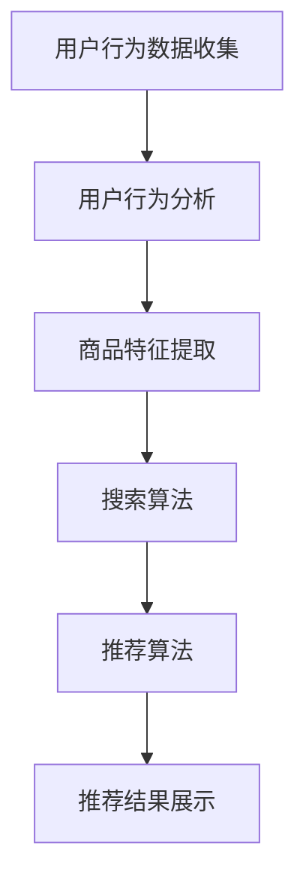

                 

关键词：AI大模型、电商搜索推荐、业务创新、项目管理方法、算法优化、数学模型、代码实例、应用场景、未来展望

> 摘要：本文详细探讨了AI大模型在电商搜索推荐领域的应用，分析了其业务创新的项目管理方法。文章首先介绍了AI大模型的基础概念，随后深入讲解了其在电商搜索推荐中的核心算法原理和数学模型。通过代码实例，本文展示了如何将理论应用于实际项目中。文章还探讨了该技术的实际应用场景和未来发展趋势，为电商行业提供了宝贵的参考。

## 1. 背景介绍

在当今的电商行业，用户体验对业务的成功至关重要。搜索引擎推荐系统作为电商平台的“门面”，直接影响着用户的购物体验和平台的转化率。随着互联网技术的飞速发展，用户需求日益多样化，传统的基于规则和传统机器学习算法的推荐系统已经难以满足用户的个性化需求。因此，AI大模型的引入成为了一种新的业务创新方式。

AI大模型，如深度学习模型，具备强大的特征提取和建模能力，能够从海量数据中自动发现潜在的用户行为模式。这使得电商搜索推荐系统在准确性和个性化方面得到了显著提升。然而，如何有效地管理和实施AI大模型的项目，确保其在实际业务中发挥最大的价值，成为了一个亟待解决的问题。

本文旨在提供一套系统化的AI大模型赋能电商搜索推荐的业务创新项目管理方法。通过深入分析算法原理、数学模型，以及实际的项目实践，本文希望能够为电商行业的技术人员提供有价值的参考。

## 2. 核心概念与联系

### 2.1 AI大模型基础概念

AI大模型，通常指的是基于深度学习技术的大型神经网络模型。这些模型能够在训练数据上学习到复杂的特征和模式，从而在未见过的数据上实现高精度的预测和分类。常见的AI大模型包括卷积神经网络（CNN）、循环神经网络（RNN）、变换器（Transformer）等。

### 2.2 电商搜索推荐系统架构

电商搜索推荐系统通常由多个模块组成，包括用户行为分析、商品特征提取、搜索算法和推荐算法。这些模块相互关联，共同构成了一个复杂的系统。AI大模型在其中主要承担用户行为分析和商品特征提取的任务，以提高推荐的准确性和个性化水平。

### 2.3 Mermaid流程图



## 3. 核心算法原理 & 具体操作步骤

### 3.1 算法原理概述

AI大模型在电商搜索推荐中的应用主要基于深度学习技术。深度学习通过多层神经网络，对输入数据进行层层提取和抽象，最终得到高层次的语义表示。这些表示能够捕捉到用户的兴趣和商品的特征，从而实现精准的推荐。

### 3.2 算法步骤详解

1. **数据收集**：从电商平台获取用户行为数据，包括搜索历史、购买记录、浏览行为等。
2. **数据处理**：对收集到的数据进行清洗和预处理，包括缺失值填充、数据归一化等。
3. **特征提取**：利用深度学习模型对处理后的数据进行分析，提取用户和商品的特征。
4. **模型训练**：使用提取的特征数据训练深度学习模型，优化模型的参数。
5. **模型评估**：通过交叉验证等方法评估模型的性能，调整模型参数。
6. **推荐生成**：使用训练好的模型生成推荐结果，展示给用户。

### 3.3 算法优缺点

**优点**：

- **高精度**：深度学习模型能够从海量数据中学习到复杂的特征，提高推荐的准确性。
- **个性化**：模型能够根据用户的兴趣和行为进行个性化推荐，提升用户体验。
- **自适应**：模型可以根据用户的反馈和新的数据实时更新，提高系统的自适应能力。

**缺点**：

- **计算资源消耗大**：深度学习模型通常需要大量的计算资源和时间进行训练。
- **数据依赖性强**：模型的性能高度依赖于数据的质量和数量，数据缺失或不准确会影响推荐效果。

### 3.4 算法应用领域

AI大模型在电商搜索推荐中的应用非常广泛，不仅限于电商平台，还可以应用于社交媒体、在线广告等领域。其强大的特征提取和建模能力，使得这些领域在推荐系统中获得了显著的提升。

## 4. 数学模型和公式 & 详细讲解 & 举例说明

### 4.1 数学模型构建

在电商搜索推荐中，常用的深度学习模型包括卷积神经网络（CNN）和变换器（Transformer）。以下分别介绍这两种模型的数学模型构建。

#### 卷积神经网络（CNN）

卷积神经网络主要由卷积层、池化层和全连接层组成。其数学模型如下：

$$
\text{输出} = \text{激活函数}(\text{权重} \cdot \text{输入} + \text{偏置})
$$

其中，输入是用户的行为数据和商品特征，权重和偏置是模型的参数，激活函数常用的有ReLU、Sigmoid等。

#### 变换器（Transformer）

变换器模型由自注意力机制和前馈神经网络组成。其数学模型如下：

$$
\text{输出} = \text{softmax}(\text{Q} \cdot \text{K}^T) \cdot \text{V}
$$

其中，Q、K、V分别为查询、键、值向量，通过自注意力机制计算得到权重，最后与V相乘得到输出。

### 4.2 公式推导过程

以卷积神经网络为例，其前向传播的公式推导如下：

1. **输入层到隐藏层**：

$$
\text{隐藏层输出} = \text{激活函数}(\text{权重} \cdot \text{输入} + \text{偏置})
$$

2. **隐藏层到输出层**：

$$
\text{输出} = \text{激活函数}(\text{权重} \cdot \text{隐藏层输出} + \text{偏置})
$$

### 4.3 案例分析与讲解

假设我们有一个简单的电商搜索推荐系统，需要根据用户的浏览记录推荐商品。输入数据是一个用户在一个月内浏览的10个商品的ID列表。我们可以使用卷积神经网络对数据进行处理，提取特征，然后进行推荐。

1. **数据预处理**：

首先，将商品ID映射为向量表示，例如使用独热编码。然后，对输入数据进行归一化处理，使其具有相似的尺度。

2. **模型构建**：

构建一个卷积神经网络模型，包括一个卷积层和一个全连接层。卷积层使用ReLU激活函数，全连接层使用softmax激活函数。

3. **模型训练**：

使用用户的历史浏览记录作为训练数据，通过反向传播算法更新模型的参数。

4. **模型评估**：

使用交叉验证方法评估模型的性能，根据准确率、召回率等指标调整模型参数。

5. **推荐生成**：

使用训练好的模型对新的用户浏览记录进行处理，生成推荐结果。

## 5. 项目实践：代码实例和详细解释说明

### 5.1 开发环境搭建

在搭建开发环境时，我们选择了Python作为主要编程语言，使用TensorFlow作为深度学习框架。具体步骤如下：

1. **安装Python**：在官方网站下载并安装Python，选择适合自己系统的版本。
2. **安装TensorFlow**：打开命令行，执行以下命令安装TensorFlow：

```bash
pip install tensorflow
```

### 5.2 源代码详细实现

以下是一个简单的卷积神经网络模型的代码实现，用于电商搜索推荐：

```python
import tensorflow as tf
from tensorflow.keras.layers import Conv1D, Flatten, Dense
from tensorflow.keras.models import Sequential

# 数据预处理
def preprocess_data(data):
    # 省略具体实现，将商品ID映射为向量表示，并进行归一化处理
    return processed_data

# 模型构建
model = Sequential([
    Conv1D(filters=64, kernel_size=3, activation='relu', input_shape=(10, 1)),
    Flatten(),
    Dense(units=10, activation='softmax')
])

# 模型编译
model.compile(optimizer='adam', loss='categorical_crossentropy', metrics=['accuracy'])

# 模型训练
model.fit(x_train, y_train, epochs=10, batch_size=32, validation_data=(x_val, y_val))

# 模型评估
model.evaluate(x_test, y_test)

# 推荐生成
def generate_recommendation(model, user_browsing_history):
    processed_history = preprocess_data(user_browsing_history)
    prediction = model.predict(processed_history)
    recommended_products = np.argmax(prediction, axis=1)
    return recommended_products
```

### 5.3 代码解读与分析

- **数据预处理**：对输入数据进行独热编码和归一化处理，使其符合模型的输入要求。
- **模型构建**：使用Sequential模型堆叠卷积层、Flatten层和全连接层，实现一个简单的卷积神经网络。
- **模型编译**：选择适当的优化器和损失函数，为模型训练做好准备。
- **模型训练**：使用训练数据训练模型，通过反向传播更新参数。
- **模型评估**：使用测试数据评估模型的性能。
- **推荐生成**：对新的用户浏览记录进行处理，生成推荐结果。

## 6. 实际应用场景

AI大模型在电商搜索推荐中的应用场景非常广泛，以下是一些实际案例：

1. **个性化推荐**：根据用户的浏览记录、购买行为和历史评价，为用户推荐符合其兴趣的商品。
2. **搜索优化**：利用深度学习模型对用户的搜索关键词进行理解，提供更准确的搜索结果。
3. **广告投放**：根据用户的兴趣和行为，为用户推荐相关的广告，提高广告的点击率。
4. **商品排序**：根据用户的兴趣和购买历史，对商品进行排序，提高用户的购买体验。

## 7. 工具和资源推荐

### 7.1 学习资源推荐

1. **《深度学习》（Ian Goodfellow, Yoshua Bengio, Aaron Courville）**：深入介绍了深度学习的基础知识和应用。
2. **《TensorFlow实战》（Ian Goodfellow, Christos Louizos, Vlad Mnih）**：详细讲解了如何使用TensorFlow实现深度学习模型。
3. **《推荐系统实践》（Trevor Hastie, Robert Tibshirani, Jerome Friedman）**：介绍了推荐系统的原理和应用。

### 7.2 开发工具推荐

1. **PyCharm**：强大的Python IDE，支持代码调试和自动化测试。
2. **Google Colab**：免费的云端编程环境，适合快速实验和演示。
3. **Kaggle**：数据科学和机器学习的竞赛平台，提供丰富的数据集和模型。

### 7.3 相关论文推荐

1. **"Attention Is All You Need"**：介绍了变换器（Transformer）模型，对后续的深度学习研究产生了重要影响。
2. **"Deep Learning for Text Data"**：详细讨论了深度学习在文本数据上的应用，包括自然语言处理和文本分类。
3. **"Recommender Systems Handbook"**：涵盖了推荐系统的各个方面，包括模型、算法和应用。

## 8. 总结：未来发展趋势与挑战

### 8.1 研究成果总结

AI大模型在电商搜索推荐领域取得了显著的研究成果，其在准确性和个性化方面具有明显优势。深度学习模型的引入，使得推荐系统在应对复杂用户行为和海量数据方面表现出色。

### 8.2 未来发展趋势

1. **多模态融合**：结合多种数据源，如文本、图像、语音等，提高推荐系统的多样性。
2. **实时推荐**：利用实时数据更新模型，提供更快速、更准确的推荐。
3. **可解释性**：研究模型的解释性，提高用户对推荐结果的信任度。

### 8.3 面临的挑战

1. **数据隐私**：在保障用户隐私的同时，提高推荐系统的准确性和个性化水平。
2. **计算资源**：随着模型规模的增大，计算资源的需求也在不断增加。
3. **模型解释性**：如何提高模型的解释性，使其更加透明和可解释。

### 8.4 研究展望

未来，AI大模型在电商搜索推荐领域的应用前景广阔。通过不断创新和优化，推荐系统将更好地满足用户的个性化需求，提升电商平台的用户体验和业务转化率。

## 9. 附录：常见问题与解答

### 9.1 如何选择合适的AI大模型？

选择合适的AI大模型需要考虑以下因素：

1. **数据量**：对于小数据集，可以选择简单的模型，如线性回归或决策树。对于大数据集，可以选择更复杂的模型，如深度学习模型。
2. **任务类型**：不同的任务类型需要不同类型的模型，如文本分类需要卷积神经网络或变换器模型，图像分类需要卷积神经网络。
3. **计算资源**：根据计算资源的限制，选择合适的模型。大型模型需要更多的计算资源和时间进行训练。

### 9.2 如何处理数据缺失问题？

处理数据缺失问题可以从以下几个方面入手：

1. **缺失值填充**：使用平均值、中值或众数等方法填充缺失值。
2. **缺失值删除**：删除含有缺失值的样本，适用于缺失值较少的情况。
3. **缺失值建模**：利用模型预测缺失值，如使用回归模型或决策树模型预测缺失值。

### 9.3 如何评估模型性能？

评估模型性能可以从以下几个方面进行：

1. **准确率**：衡量模型在预测中正确分类的样本比例。
2. **召回率**：衡量模型在预测中召回的正确分类样本比例。
3. **F1分数**：综合考虑准确率和召回率，计算模型的综合性能。
4. **ROC曲线和AUC值**：衡量模型的分类能力，ROC曲线越陡峭，AUC值越大，模型性能越好。

---

作者：禅与计算机程序设计艺术 / Zen and the Art of Computer Programming

