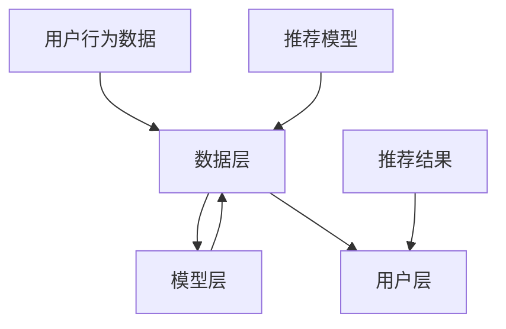

                 

关键词：人工智能，电商搜索推荐，大模型，数据价值变现，算法优化

> 摘要：本文将探讨如何利用人工智能技术，特别是大模型技术，重构电商搜索推荐系统的数据价值变现途径。通过对大模型在电商搜索推荐领域的应用进行深入分析，本文将介绍核心算法原理、具体操作步骤、数学模型与公式，以及项目实践和实际应用场景。文章最后将对未来发展趋势和挑战进行展望，并推荐相关学习资源和开发工具。

## 1. 背景介绍

随着互联网的快速发展，电商行业已经成为全球经济增长的重要引擎。电商平台的搜索推荐系统作为电商业务的核心环节，承担着为用户发现感兴趣商品的重要任务。然而，传统的搜索推荐系统面临着数据稀缺、算法单一、个性化程度不足等问题，难以满足用户日益增长的多样化需求。为了解决这些问题，人工智能技术，尤其是大模型技术，成为电商搜索推荐系统的重要发展方向。

大模型技术通过训练大规模神经网络，能够从海量数据中提取复杂特征，提高推荐系统的准确性和个性化程度。近年来，深度学习技术的飞速发展，使得大模型在图像识别、自然语言处理等领域取得了显著成果。将这些技术应用到电商搜索推荐系统中，有望实现数据价值的高效变现。

本文旨在探讨如何利用大模型技术重构电商搜索推荐系统的数据价值变现途径。通过对核心算法原理、数学模型和公式、项目实践等方面的详细分析，为电商搜索推荐系统的发展提供有益的参考。

## 2. 核心概念与联系

在深入探讨大模型在电商搜索推荐系统中的应用之前，我们首先需要了解一些核心概念，包括数据价值、变现途径、大模型以及搜索推荐系统的基本架构。

### 2.1 数据价值

数据价值是指数据对于决策、优化和创造价值的能力。在电商搜索推荐系统中，数据主要包括用户行为数据、商品数据、交易数据等。通过对这些数据进行挖掘和分析，可以发现用户的兴趣偏好，为个性化推荐提供依据。

### 2.2 变现途径

变现途径是指将数据转化为实际价值的过程。在电商搜索推荐系统中，变现途径包括增加用户粘性、提升销售额、降低推广成本等。通过提高推荐系统的准确性和个性化程度，可以增加用户满意度和购买转化率，从而实现数据价值的高效变现。

### 2.3 大模型

大模型是指具有大规模参数和计算量的神经网络模型。大模型通过训练大量数据，能够自动提取复杂特征，实现高精度的预测和分类。在电商搜索推荐系统中，大模型可以用于用户行为预测、商品推荐、广告投放等。

### 2.4 搜索推荐系统的基本架构

电商搜索推荐系统的基本架构包括数据层、模型层和用户层。数据层负责收集和存储用户行为数据、商品数据等；模型层负责构建和训练推荐模型；用户层负责向用户展示推荐结果。

### 2.5 Mermaid 流程图

以下是一个简化的电商搜索推荐系统的 Mermaid 流程图：



## 3. 核心算法原理 & 具体操作步骤

### 3.1 算法原理概述

大模型在电商搜索推荐系统中的应用主要基于深度学习技术。深度学习是一种基于多层神经网络的学习方法，能够自动提取数据中的高阶特征。在电商搜索推荐系统中，大模型通过训练用户行为数据和商品数据，构建用户行为预测模型和商品推荐模型。

### 3.2 算法步骤详解

#### 3.2.1 数据预处理

数据预处理是深度学习模型训练的重要环节。主要包括数据清洗、数据归一化和数据增强等。

- 数据清洗：去除无效、重复和错误的数据。
- 数据归一化：将不同特征的数据进行标准化处理，使其具备相同的量纲和范围。
- 数据增强：通过数据变换、旋转、缩放等方式增加数据多样性，提高模型泛化能力。

#### 3.2.2 模型构建

电商搜索推荐系统中的大模型通常采用多层感知机（MLP）、卷积神经网络（CNN）和循环神经网络（RNN）等结构。

- MLP：适用于处理结构化数据，如用户行为数据。
- CNN：适用于处理图像数据，如商品图片。
- RNN：适用于处理序列数据，如用户浏览历史。

以下是一个基于MLP的电商搜索推荐系统的模型构建示例：

```python
import tensorflow as tf
from tensorflow.keras.models import Sequential
from tensorflow.keras.layers import Dense, Flatten

model = Sequential()
model.add(Flatten(input_shape=(None, None)))
model.add(Dense(128, activation='relu'))
model.add(Dense(64, activation='relu'))
model.add(Dense(1, activation='sigmoid'))

model.compile(optimizer='adam', loss='binary_crossentropy', metrics=['accuracy'])
```

#### 3.2.3 模型训练

模型训练是电商搜索推荐系统中的核心步骤。通过大量训练数据，模型能够不断优化参数，提高预测和推荐能力。

- 数据集划分：将数据集划分为训练集、验证集和测试集。
- 训练过程：使用训练集对模型进行训练，并使用验证集进行调参。
- 评估过程：使用测试集对模型进行评估，验证模型性能。

以下是一个基于MLP的电商搜索推荐系统的模型训练示例：

```python
history = model.fit(x_train, y_train, epochs=10, batch_size=32, validation_data=(x_val, y_val))
```

#### 3.2.4 模型优化

模型优化主要包括超参数调优、模型剪枝、量化等。

- 超参数调优：通过交叉验证等方法，选择最优的超参数。
- 模型剪枝：通过剪枝算法，降低模型复杂度，提高模型性能。
- 量化：将模型权重转化为低比特位表示，减少模型存储和计算资源。

### 3.3 算法优缺点

#### 优点

- 自动提取高阶特征：大模型能够从海量数据中自动提取复杂特征，提高推荐系统准确性和个性化程度。
- 高效处理大规模数据：深度学习技术具有高效处理大规模数据的能力，能够满足电商搜索推荐系统的实时性要求。
- 灵活扩展：大模型结构灵活，可以根据需求扩展到其他领域，如广告投放、金融风控等。

#### 缺点

- 数据需求量大：大模型需要大量高质量的数据进行训练，对数据质量和数据量有较高要求。
- 计算资源消耗大：大模型训练需要大量的计算资源，对硬件设备要求较高。
- 过拟合风险：大模型容易过拟合，需要通过数据增强、正则化等方法进行预防。

### 3.4 算法应用领域

大模型在电商搜索推荐系统中的应用广泛，可以应用于以下领域：

- 用户行为预测：预测用户购买行为、浏览行为等，为个性化推荐提供依据。
- 商品推荐：根据用户兴趣和偏好，推荐相关商品，提升用户购买转化率。
- 广告投放：根据用户行为和兴趣，精准投放广告，提高广告投放效果。
- 金融风控：预测用户信用风险、欺诈行为等，为金融机构提供风险管理依据。

## 4. 数学模型和公式 & 详细讲解 & 举例说明

在电商搜索推荐系统中，大模型的核心在于构建用户行为预测模型和商品推荐模型。这些模型通常基于概率模型和优化理论，下面我们将详细介绍这些数学模型和公式的构建过程，并通过具体例子进行说明。

### 4.1 数学模型构建

#### 4.1.1 用户行为预测模型

用户行为预测模型通常采用概率模型，如贝叶斯网络、隐马尔可夫模型（HMM）等。以下是一个基于贝叶斯网络的用户行为预测模型构建示例：

$$
P(\text{购买}|\text{浏览，搜索}) = \frac{P(\text{浏览，搜索}|\text{购买})P(\text{购买})}{P(\text{浏览，搜索})}
$$

其中，$P(\text{购买}|\text{浏览，搜索})$ 表示在用户浏览和搜索特定商品的情况下购买的概率，$P(\text{浏览，搜索}|\text{购买})$ 表示在用户购买特定商品时浏览和搜索的概率，$P(\text{购买})$ 表示用户购买的概率，$P(\text{浏览，搜索})$ 表示用户浏览和搜索的概率。

#### 4.1.2 商品推荐模型

商品推荐模型通常采用优化模型，如线性回归、逻辑回归等。以下是一个基于逻辑回归的商品推荐模型构建示例：

$$
\text{logit}(\text{推荐概率}) = \beta_0 + \beta_1 \text{用户特征} + \beta_2 \text{商品特征}
$$

其中，$\text{logit}(\text{推荐概率})$ 表示商品被推荐的概率的对数，$\beta_0$ 表示截距，$\beta_1$ 和 $\beta_2$ 分别表示用户特征和商品特征的权重。

### 4.2 公式推导过程

#### 4.2.1 用户行为预测模型推导

以贝叶斯网络为例，用户行为预测模型的推导过程如下：

1. **概率分布假设**：假设用户行为是一个离散的随机变量，并且满足马尔可夫性质。
2. **条件概率公式**：根据条件概率公式，有 $P(A|B) = \frac{P(A \cap B)}{P(B)}$。
3. **贝叶斯定理**：根据贝叶斯定理，有 $P(A|B) = \frac{P(B|A)P(A)}{P(B)}$。
4. **条件概率推导**：将贝叶斯定理应用到用户行为预测中，可以得到用户行为预测模型。

#### 4.2.2 商品推荐模型推导

以逻辑回归为例，商品推荐模型的推导过程如下：

1. **线性模型假设**：假设商品推荐概率可以用线性模型表示，即 $\text{推荐概率} = \frac{1}{1 + e^{-\beta_0 - \beta_1 x_1 - \beta_2 x_2}}$。
2. **对数变换**：对推荐概率进行对数变换，得到 $\text{logit}(\text{推荐概率}) = \beta_0 + \beta_1 x_1 + \beta_2 x_2$。
3. **最小化损失函数**：通过最小化损失函数，如交叉熵损失函数，求解模型参数 $\beta_0$、$\beta_1$ 和 $\beta_2$。

### 4.3 案例分析与讲解

#### 4.3.1 用户行为预测模型案例

假设有一个电商用户，他在过去一个月内浏览了多个商品，并且搜索了其中一个商品。我们需要预测他是否会购买该商品。

根据贝叶斯网络模型，我们可以构建以下条件概率：

- $P(\text{购买}|\text{浏览，搜索})$：在用户浏览和搜索特定商品的情况下购买的概率。
- $P(\text{浏览，搜索}|\text{购买})$：在用户购买特定商品时浏览和搜索的概率。
- $P(\text{购买})$：用户购买的概率。
- $P(\text{浏览，搜索})$：用户浏览和搜索的概率。

根据历史数据，我们可以估计这些概率，然后使用贝叶斯定理进行预测。

#### 4.3.2 商品推荐模型案例

假设我们需要为用户推荐一个商品，该商品的用户特征和商品特征如下：

- 用户特征：年龄、性别、收入、购买历史等。
- 商品特征：价格、品牌、品类、销量等。

我们需要构建一个逻辑回归模型，预测用户对该商品的购买概率。

首先，我们收集用户特征和商品特征的数据，然后通过最小化交叉熵损失函数，求解模型参数。最后，使用训练好的模型预测用户对该商品的购买概率。

## 5. 项目实践：代码实例和详细解释说明

为了更好地理解大模型在电商搜索推荐系统中的应用，下面我们将通过一个实际项目来演示如何搭建和训练一个基于深度学习的推荐系统。

### 5.1 开发环境搭建

在进行项目实践之前，我们需要搭建一个合适的开发环境。以下是一个简单的开发环境搭建步骤：

1. 安装 Python（建议使用 3.7 或以上版本）。
2. 安装 TensorFlow 和 Keras 库，可以使用以下命令：
   ```bash
   pip install tensorflow
   pip install keras
   ```
3. 安装其他依赖库，如 NumPy、Pandas、Matplotlib 等。

### 5.2 源代码详细实现

以下是电商搜索推荐系统的一个简单实现，包括数据预处理、模型构建、模型训练和模型评估。

```python
import numpy as np
import pandas as pd
from tensorflow.keras.models import Sequential
from tensorflow.keras.layers import Dense, Flatten
from tensorflow.keras.optimizers import Adam
from sklearn.model_selection import train_test_split
from sklearn.preprocessing import StandardScaler

# 5.2.1 数据预处理
# 读取数据
data = pd.read_csv('ecommerce_data.csv')

# 分割特征和标签
X = data.drop('purchase', axis=1)
y = data['purchase']

# 划分训练集和测试集
X_train, X_test, y_train, y_test = train_test_split(X, y, test_size=0.2, random_state=42)

# 归一化数据
scaler = StandardScaler()
X_train = scaler.fit_transform(X_train)
X_test = scaler.transform(X_test)

# 5.2.2 模型构建
model = Sequential()
model.add(Flatten(input_shape=(X_train.shape[1],)))
model.add(Dense(128, activation='relu'))
model.add(Dense(64, activation='relu'))
model.add(Dense(1, activation='sigmoid'))

# 5.2.3 模型训练
model.compile(optimizer=Adam(learning_rate=0.001), loss='binary_crossentropy', metrics=['accuracy'])
model.fit(X_train, y_train, epochs=10, batch_size=32, validation_data=(X_test, y_test))

# 5.2.4 模型评估
loss, accuracy = model.evaluate(X_test, y_test)
print(f"Test accuracy: {accuracy:.2f}")
```

### 5.3 代码解读与分析

上述代码实现了以下功能：

- **数据预处理**：读取数据，将特征和标签分离，然后划分训练集和测试集。使用标准标

