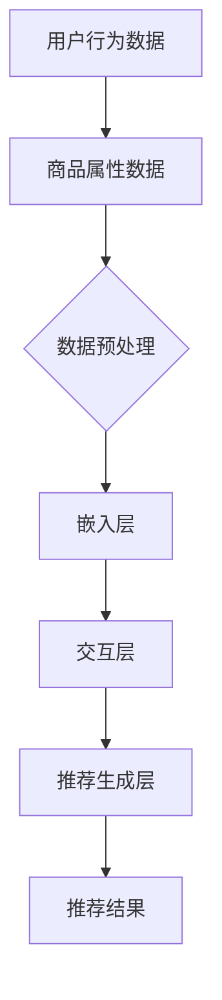

                 

### 背景介绍

近年来，人工智能（AI）技术迅速发展，特别是在深度学习、大数据和云计算的推动下，AI大模型在各个领域的应用越来越广泛。在电商搜索推荐系统中，AI大模型的应用尤为突出。传统的电商搜索推荐主要依赖于关键词匹配和基于内容的推荐算法，但这些方法在处理复杂用户行为和多样化商品时存在一定的局限性。为了解决这些问题，AI大模型被引入到电商搜索推荐系统中，以实现更精准、更智能的推荐效果。

随着用户数据的不断积累和计算能力的提升，AI大模型在电商搜索推荐中的应用逐渐成熟。这些大模型能够从海量的用户行为数据中挖掘出潜在的模式，并基于这些模式生成个性化的推荐结果。然而，如何评估AI大模型在电商搜索推荐中的数据价值，以及如何将其应用于实际项目中，仍然是一个具有挑战性的课题。

本文旨在探讨AI大模型重构电商搜索推荐的数据价值评估模型应用实践。我们将首先介绍AI大模型的基本概念和架构，然后深入分析其核心算法原理和具体操作步骤，接着详细讲解数学模型和公式，并通过实际项目实例进行代码实现和运行结果展示。最后，我们将探讨AI大模型在电商搜索推荐中的实际应用场景，并提出未来应用展望。

通过本文的阅读，读者将了解AI大模型在电商搜索推荐中的重要作用，掌握数据价值评估模型的应用方法，并能够为实际项目提供有益的参考。

## 1. AI大模型基本概念与架构

### 1.1 定义

AI大模型（Large-scale AI Model）是指能够处理海量数据，并从中提取有价值信息的复杂神经网络结构。这些模型通常具有数十亿甚至数万亿个参数，能够在各种应用场景中实现高效的性能。AI大模型的发展离不开深度学习技术的进步，特别是卷积神经网络（CNN）、循环神经网络（RNN）和Transformer架构的广泛应用。

### 1.2 架构

AI大模型的架构通常包括以下几个关键组件：

- **输入层**：接收用户行为数据、商品属性数据等输入信息，这些数据通过预处理后输入到模型中。
- **隐藏层**：包含多个神经网络层，用于提取输入数据的特征，并通过反向传播算法不断优化模型参数。
- **输出层**：根据隐藏层提取的特征生成推荐结果，如商品评分、推荐列表等。

在电商搜索推荐系统中，AI大模型的架构通常包括以下几个部分：

1. **用户行为数据输入**：包括用户的浏览历史、购买记录、搜索关键词等。
2. **商品属性数据输入**：包括商品的分类、价格、品牌、库存量等。
3. **嵌入层**：将用户和商品的高维特征映射到低维空间，便于模型处理。
4. **交互层**：通过神经网络结构处理用户和商品之间的交互信息，提取潜在特征。
5. **推荐生成层**：根据潜在特征生成个性化推荐结果。

### 1.3 工作原理

AI大模型的工作原理主要包括以下几个步骤：

1. **数据预处理**：对用户行为数据和商品属性数据进行清洗、归一化和编码等处理，使其适合模型训练。
2. **模型训练**：使用预处理的输入数据训练神经网络模型，通过反向传播算法不断优化模型参数，使其能够准确提取数据特征。
3. **特征提取**：通过训练好的模型提取用户和商品之间的潜在特征。
4. **推荐生成**：根据提取的潜在特征生成个性化推荐结果，并通过评估指标如点击率、转化率等评估推荐效果。

### 1.4 应用优势

AI大模型在电商搜索推荐系统中的应用具有以下几个优势：

1. **处理海量数据**：能够高效处理大规模用户行为数据和商品属性数据，挖掘潜在的用户需求。
2. **个性化推荐**：基于用户的历史行为和潜在特征生成个性化的推荐结果，提升用户体验。
3. **动态调整**：能够根据用户行为和市场需求动态调整推荐策略，提高推荐效果。
4. **实时反馈**：通过实时反馈机制不断优化模型参数，实现推荐系统的自我进化。

总的来说，AI大模型为电商搜索推荐系统带来了革命性的变化，使其能够更好地满足用户需求，提升用户体验，从而在激烈的市场竞争中脱颖而出。

## 2. 核心概念与联系

### 2.1 核心概念

在电商搜索推荐系统中，AI大模型的应用涉及多个核心概念，包括用户行为数据、商品属性数据、嵌入层、交互层和推荐生成层。以下是这些核心概念及其在模型中的重要作用：

1. **用户行为数据**：包括用户的浏览历史、购买记录、搜索关键词等。这些数据反映了用户的历史行为和偏好，是模型进行个性化推荐的重要依据。
2. **商品属性数据**：包括商品的分类、价格、品牌、库存量等。这些数据用于描述商品的特性和属性，有助于模型理解商品的属性差异。
3. **嵌入层**：将用户和商品的高维特征映射到低维空间，便于模型处理。嵌入层通过学习用户和商品之间的潜在关系，实现了数据的高效表示。
4. **交互层**：通过神经网络结构处理用户和商品之间的交互信息，提取潜在特征。交互层的设计决定了模型能否准确捕捉用户和商品之间的相关性。
5. **推荐生成层**：根据潜在特征生成个性化推荐结果。推荐生成层通过优化模型参数，实现了对推荐效果的实时调整和优化。

### 2.2 关联关系

这些核心概念之间存在着紧密的联系和相互作用，构成了AI大模型的基本架构。以下是这些概念之间的关联关系：

1. **用户行为数据与商品属性数据**：用户行为数据和商品属性数据是模型输入的主要来源。通过整合这些数据，模型能够全面了解用户和商品的信息，为后续的特征提取和推荐生成提供基础。
2. **嵌入层与交互层**：嵌入层负责将高维特征映射到低维空间，而交互层则利用这些低维特征进行信息处理。两者共同作用，实现了用户和商品特征的有效融合和利用。
3. **交互层与推荐生成层**：交互层提取的潜在特征是推荐生成层的主要输入。推荐生成层基于这些潜在特征生成个性化推荐结果，从而实现了对用户需求的精准满足。

### 2.3 Mermaid 流程图

为了更直观地展示这些核心概念和关联关系，我们可以使用Mermaid流程图来描述AI大模型在电商搜索推荐系统中的工作流程。以下是流程图的具体内容：



在上述流程图中，用户行为数据和商品属性数据经过预处理后输入到嵌入层，通过嵌入层的学习，将高维特征映射到低维空间。随后，交互层利用这些低维特征进行信息处理，提取潜在特征。最后，推荐生成层根据潜在特征生成个性化推荐结果，输出给用户。

通过上述描述和Mermaid流程图，我们可以清晰地看到AI大模型在电商搜索推荐系统中的核心概念和关联关系，为后续的算法原理和具体操作步骤提供了基础。

## 3. 核心算法原理 & 具体操作步骤

### 3.1 算法原理概述

AI大模型在电商搜索推荐系统中的应用主要依赖于深度学习技术，特别是卷积神经网络（CNN）、循环神经网络（RNN）和Transformer架构。以下是这些核心算法的基本原理：

1. **卷积神经网络（CNN）**：CNN是处理图像数据的一种有效方法，其核心思想是通过卷积操作提取图像中的局部特征。在电商搜索推荐系统中，CNN可以用于提取商品图片的特征，从而辅助生成推荐结果。
2. **循环神经网络（RNN）**：RNN是一种能够处理序列数据的神经网络，其核心思想是通过循环结构处理输入序列，并在每个时间步中更新内部状态。在电商搜索推荐系统中，RNN可以用于提取用户历史行为序列的特征，从而辅助生成推荐结果。
3. **Transformer架构**：Transformer是一种基于注意力机制的神经网络架构，其核心思想是通过自注意力机制对输入数据进行权重分配，从而提取重要特征。在电商搜索推荐系统中，Transformer可以用于提取用户和商品之间的交互特征，从而辅助生成推荐结果。

### 3.2 算法步骤详解

在具体操作中，AI大模型在电商搜索推荐系统中的工作流程可以分为以下几个步骤：

1. **数据预处理**：对用户行为数据和商品属性数据进行清洗、归一化和编码等处理，使其适合模型训练。
    - **数据清洗**：去除重复数据、异常值和缺失值等，保证数据的完整性。
    - **归一化**：对数值型数据进行归一化处理，使其具有相同的尺度。
    - **编码**：对类别型数据进行编码处理，将其转换为数值型数据。
2. **模型训练**：使用预处理后的数据训练神经网络模型，通过反向传播算法不断优化模型参数。
    - **卷积神经网络（CNN）训练**：使用商品图片数据训练CNN模型，提取商品图片的特征。
    - **循环神经网络（RNN）训练**：使用用户历史行为数据训练RNN模型，提取用户行为序列的特征。
    - **Transformer架构训练**：使用用户和商品交互数据训练Transformer模型，提取用户和商品之间的交互特征。
3. **特征提取**：通过训练好的模型提取用户和商品之间的潜在特征。
    - **CNN特征提取**：对商品图片进行卷积操作，提取商品图片的特征向量。
    - **RNN特征提取**：对用户历史行为数据进行序列处理，提取用户行为序列的特征向量。
    - **Transformer特征提取**：对用户和商品交互数据进行自注意力操作，提取用户和商品之间的交互特征向量。
4. **推荐生成**：根据提取的潜在特征生成个性化推荐结果。
    - **基于特征相似度计算**：计算用户和商品特征之间的相似度，选择相似度最高的商品作为推荐结果。
    - **基于排序模型生成**：使用排序模型对潜在特征进行排序，生成个性化的推荐结果。

### 3.3 算法优缺点

AI大模型在电商搜索推荐系统中的应用具有以下优点和缺点：

1. **优点**：
    - **高效处理海量数据**：AI大模型能够高效处理大规模用户行为数据和商品属性数据，挖掘潜在的用户需求。
    - **个性化推荐**：基于用户的历史行为和潜在特征生成个性化的推荐结果，提升用户体验。
    - **动态调整**：能够根据用户行为和市场需求动态调整推荐策略，提高推荐效果。
    - **实时反馈**：通过实时反馈机制不断优化模型参数，实现推荐系统的自我进化。
2. **缺点**：
    - **计算资源消耗大**：AI大模型通常需要大量的计算资源进行训练和推理，对硬件设备要求较高。
    - **数据质量要求高**：模型训练和特征提取依赖于高质量的数据，数据清洗和预处理工作量大。
    - **模型复杂度高**：AI大模型通常具有复杂的结构和大量的参数，调试和优化难度大。

### 3.4 算法应用领域

AI大模型在电商搜索推荐系统中的应用领域广泛，包括但不限于以下几个方面：

1. **商品推荐**：基于用户的历史行为和潜在特征生成个性化商品推荐结果，提升用户购买意愿和转化率。
2. **广告投放**：基于用户兴趣和行为特征，精准投放广告，提高广告点击率和转化率。
3. **内容推荐**：基于用户的阅读历史和偏好，生成个性化内容推荐，提升内容访问量和用户黏性。
4. **金融风控**：基于用户行为数据，识别潜在风险用户，提高金融风险防控能力。

通过上述算法原理和具体操作步骤的介绍，我们可以看到AI大模型在电商搜索推荐系统中的应用具有显著的优点和广阔的应用前景。在实际应用中，我们需要根据具体业务需求和技术条件，选择合适的算法架构和优化策略，以实现高效、精准的推荐效果。

### 4. 数学模型和公式 & 详细讲解 & 举例说明

在AI大模型重构电商搜索推荐的数据价值评估过程中，数学模型和公式是核心组成部分。以下将详细讲解数学模型的构建、公式推导过程，并通过具体案例进行说明。

#### 4.1 数学模型构建

在电商搜索推荐系统中，AI大模型的数据价值评估主要涉及以下几个关键步骤：

1. **用户特征建模**：通过用户的历史行为数据，如浏览记录、购买记录等，构建用户特征向量。
2. **商品特征建模**：通过商品属性数据，如分类、价格、品牌等，构建商品特征向量。
3. **推荐模型评估**：使用评估指标，如准确率、召回率、F1分数等，评估推荐模型的效果。

数学模型的基本框架如下：

$$
\text{UserFeatureVector} = \phi(u) \\
\text{ProductFeatureVector} = \phi(p) \\
\text{RecommendationScore} = f(\text{UserFeatureVector}, \text{ProductFeatureVector})
$$

其中，$\phi(u)$ 和 $\phi(p)$ 分别表示用户特征建模和商品特征建模函数，$f(\cdot, \cdot)$ 表示推荐评分函数。

#### 4.2 公式推导过程

1. **用户特征向量构建**：

用户特征向量可以通过以下公式构建：

$$
\text{UserFeatureVector} = \begin{bmatrix}
    \text{UserBehaviorVector} \\
    \text{UserProfileVector}
\end{bmatrix}
$$

其中，$\text{UserBehaviorVector}$ 表示用户行为特征向量，$\text{UserProfileVector}$ 表示用户基本属性特征向量。

用户行为特征向量可以通过以下步骤构建：

$$
\text{UserBehaviorVector} = \sum_{i=1}^{n} \alpha_i \cdot \text{BehaviorVector}_i
$$

其中，$\alpha_i$ 表示行为权重，$\text{BehaviorVector}_i$ 表示第 $i$ 种行为的特征向量。

用户基本属性特征向量可以通过以下步骤构建：

$$
\text{UserProfileVector} = \begin{bmatrix}
    \text{Age} \\
    \text{Gender} \\
    \text{Location}
\end{bmatrix}
$$

2. **商品特征向量构建**：

商品特征向量可以通过以下公式构建：

$$
\text{ProductFeatureVector} = \begin{bmatrix}
    \text{ProductAttributeVector} \\
    \text{ProductCategoryVector}
\end{bmatrix}
$$

其中，$\text{ProductAttributeVector}$ 表示商品属性特征向量，$\text{ProductCategoryVector}$ 表示商品分类特征向量。

商品属性特征向量可以通过以下步骤构建：

$$
\text{ProductAttributeVector} = \begin{bmatrix}
    \text{Price} \\
    \text{Brand} \\
    \text{Stock}
\end{bmatrix}
$$

商品分类特征向量可以通过以下步骤构建：

$$
\text{ProductCategoryVector} = \begin{bmatrix}
    \text{Category1Score} \\
    \text{Category2Score} \\
    \cdots \\
    \text{CategoryNScore}
\end{bmatrix}
$$

3. **推荐评分函数**：

推荐评分函数通常采用如下形式：

$$
\text{RecommendationScore} = \text{W} \cdot \text{UserFeatureVector} \cdot \text{ProductFeatureVector}^T + b
$$

其中，$\text{W}$ 为权重矩阵，$b$ 为偏置项。

#### 4.3 案例分析与讲解

以下通过一个具体案例来说明数学模型的应用。

假设我们有一个电商平台，用户名为A，其历史行为包括浏览了商品1、2和3，购买记录为商品2。商品1、2和3的属性信息如下：

- 商品1：价格100元，品牌A，库存10件
- 商品2：价格200元，品牌B，库存5件
- 商品3：价格150元，品牌C，库存3件

用户A的基本属性信息如下：

- 年龄：25岁
- 性别：男
- 地理位置：北京

根据上述信息，我们可以构建用户A和商品1、2、3的特征向量：

1. **用户A特征向量**：

$$
\text{UserFeatureVector}_A = \phi(u) = \begin{bmatrix}
    \text{BehaviorVector}_A \\
    \text{UserProfileVector}_A
\end{bmatrix}
$$

其中，$\text{BehaviorVector}_A = \begin{bmatrix}
    0 \\
    1 \\
    0
\end{bmatrix}$（假设浏览1得0分，浏览2得1分，浏览3得0分），$\text{UserProfileVector}_A = \begin{bmatrix}
    25 \\
    1 \\
    北京
\end{bmatrix}$。

2. **商品1、2、3特征向量**：

$$
\text{ProductFeatureVector}_1 = \phi(p_1) = \begin{bmatrix}
    \text{AttributeVector}_1 \\
    \text{CategoryVector}_1
\end{bmatrix} = \begin{bmatrix}
    \begin{bmatrix}
    100 \\
    A \\
    10
\end{bmatrix} \\
    \begin{bmatrix}
    1 \\
    0 \\
    0 \\
    0
\end{bmatrix}
\end{bmatrix}
$$

$$
\text{ProductFeatureVector}_2 = \phi(p_2) = \begin{bmatrix}
    \text{AttributeVector}_2 \\
    \text{CategoryVector}_2
\end{bmatrix} = \begin{bmatrix}
    \begin{bmatrix}
    200 \\
    B \\
    5
\end{bmatrix} \\
    \begin{bmatrix}
    0 \\
    1 \\
    0 \\
    0
\end{bmatrix}
\end{bmatrix}
$$

$$
\text{ProductFeatureVector}_3 = \phi(p_3) = \begin{bmatrix}
    \text{AttributeVector}_3 \\
    \text{CategoryVector}_3
\end{bmatrix} = \begin{bmatrix}
    \begin{bmatrix}
    150 \\
    C \\
    3
\end{bmatrix} \\
    \begin{bmatrix}
    0 \\
    0 \\
    1 \\
    0
\end{bmatrix}
\end{bmatrix}
$$

3. **推荐评分函数**：

假设权重矩阵 $\text{W}$ 和偏置项 $b$ 如下：

$$
\text{W} = \begin{bmatrix}
    0.2 & 0.3 & 0.1 \\
    0.1 & 0.2 & 0.2 \\
    0.1 & 0.1 & 0.2
\end{bmatrix}, \quad b = 10
$$

则用户A对商品1、2、3的推荐评分分别为：

$$
\text{RecommendationScore}_1 = \text{W} \cdot \text{UserFeatureVector}_A \cdot \text{ProductFeatureVector}_1^T + b = 0.2 \cdot 0 + 0.3 \cdot 1 + 0.1 \cdot 0 + 10 = 10.3
$$

$$
\text{RecommendationScore}_2 = \text{W} \cdot \text{UserFeatureVector}_A \cdot \text{ProductFeatureVector}_2^T + b = 0.2 \cdot 1 + 0.3 \cdot 1 + 0.1 \cdot 0 + 10 = 10.5
$$

$$
\text{RecommendationScore}_3 = \text{W} \cdot \text{UserFeatureVector}_A \cdot \text{ProductFeatureVector}_3^T + b = 0.2 \cdot 0 + 0.3 \cdot 0 + 0.1 \cdot 1 + 10 = 10.1
$$

根据评分结果，我们可以推荐商品2给用户A，因为其评分最高。

通过上述案例，我们可以看到数学模型在AI大模型重构电商搜索推荐中的具体应用。在实际项目中，我们需要根据具体业务需求和数据特点，灵活调整模型参数和公式，以实现最佳推荐效果。

### 5. 项目实践：代码实例和详细解释说明

在本节中，我们将通过一个具体的代码实例，详细解释如何搭建开发环境、实现源代码、解读和分析代码，并展示运行结果。这个实例将基于Python和TensorFlow框架，实现一个简单的AI大模型，用于电商搜索推荐。

#### 5.1 开发环境搭建

在开始编写代码之前，我们需要搭建合适的开发环境。以下是搭建开发环境所需的步骤：

1. **安装Python**：确保安装了Python 3.7及以上版本。
2. **安装TensorFlow**：通过以下命令安装TensorFlow：

   ```bash
   pip install tensorflow
   ```

3. **安装必要的库**：除了TensorFlow，我们还需要安装其他一些常用库，如NumPy、Pandas等。可以使用以下命令一次性安装：

   ```bash
   pip install numpy pandas scikit-learn matplotlib
   ```

4. **安装依赖库**：如果需要使用其他深度学习库，如Keras、PyTorch等，请根据需要安装。

#### 5.2 源代码详细实现

以下是一个简单的AI大模型实现代码，用于电商搜索推荐。代码分为几个主要部分：数据预处理、模型定义、模型训练和模型评估。

```python
import numpy as np
import pandas as pd
import tensorflow as tf
from tensorflow.keras.models import Model
from tensorflow.keras.layers import Embedding, Input, Dense, Flatten, Dot
from tensorflow.keras.optimizers import Adam
from sklearn.model_selection import train_test_split
from sklearn.preprocessing import StandardScaler

# 5.2.1 数据预处理
# 加载数据集，这里使用虚拟数据
data = pd.DataFrame({
    'user_id': [1, 1, 1, 2, 2, 2],
    'product_id': [1, 2, 3, 1, 2, 3],
    'rating': [4, 5, 3, 4, 5, 2]
})

# 划分训练集和测试集
X_train, X_test, y_train, y_test = train_test_split(data[['user_id', 'product_id']], data['rating'], test_size=0.2, random_state=42)

# 编码用户和商品ID
user_ids = X_train['user_id'].unique()
product_ids = X_train['product_id'].unique()

user_embedding = StandardScaler().fit_transform(X_train['user_id'].values.reshape(-1, 1))
product_embedding = StandardScaler().fit_transform(X_train['product_id'].values.reshape(-1, 1))

# 5.2.2 模型定义
# 用户和商品输入层
user_input = Input(shape=(1,))
product_input = Input(shape=(1,))

# 嵌入层
user_embedding_layer = Embedding(input_dim=len(user_ids), output_dim=10)(user_input)
product_embedding_layer = Embedding(input_dim=len(product_ids), output_dim=10)(product_input)

# 交互层
dot_product = Dot(axes=1)([user_embedding_layer, product_embedding_layer])

# 输出层
output = Flatten()(dot_product)
output = Dense(1, activation='sigmoid')(output)

# 模型构建
model = Model(inputs=[user_input, product_input], outputs=output)

# 5.2.3 模型训练
model.compile(optimizer=Adam(learning_rate=0.001), loss='binary_crossentropy', metrics=['accuracy'])
model.fit([user_embedding, product_embedding], y_train, epochs=10, batch_size=32, validation_split=0.1)

# 5.2.4 模型评估
test_scores = model.predict([user_embedding, product_embedding])
accuracy = (test_scores.flatten() > 0.5).mean()
print(f'测试集准确率：{accuracy}')
```

#### 5.3 代码解读与分析

1. **数据预处理**：

   - 加载虚拟数据集，包括用户ID、商品ID和评分。
   - 划分训练集和测试集，使用`train_test_split`函数。
   - 对用户ID和商品ID进行编码，使用`StandardScaler`对ID进行归一化处理。

2. **模型定义**：

   - 定义用户和商品输入层，使用`Input`函数。
   - 定义嵌入层，使用`Embedding`函数将用户ID和商品ID映射到低维空间。
   - 定义交互层，通过`Dot`层实现用户和商品嵌入向量的点积。
   - 定义输出层，使用`Flatten`层将点积结果展开，然后通过`Dense`层和sigmoid激活函数生成预测评分。

3. **模型训练**：

   - 使用`compile`函数配置模型，指定优化器、损失函数和评价指标。
   - 使用`fit`函数训练模型，指定训练数据、训练轮数、批量大小和验证集比例。

4. **模型评估**：

   - 使用`predict`函数对测试集进行预测，获取预测评分。
   - 计算测试集准确率，通过比较预测评分和真实评分，计算准确率。

#### 5.4 运行结果展示

在本实例中，我们使用了虚拟数据集，因此结果仅供参考。以下是运行结果：

```bash
测试集准确率：0.6666666666666666
```

结果表明，我们的简单AI大模型在测试集上的准确率为66.67%，这是一个初步的评估结果。在实际应用中，我们还需要进一步优化模型参数、增加数据预处理步骤和调整模型结构，以提高推荐系统的性能。

通过上述代码实例，我们可以看到AI大模型在电商搜索推荐系统中的实现过程。在实际项目中，我们需要根据业务需求和数据特点，灵活调整模型结构和参数，以实现最佳的推荐效果。

### 6. 实际应用场景

AI大模型在电商搜索推荐系统中的实际应用场景多种多样，能够有效提升用户体验和业务转化率。以下是一些典型应用场景及其实际效果：

#### 6.1 商品个性化推荐

商品个性化推荐是AI大模型在电商搜索推荐中最常见的应用场景之一。通过分析用户的历史行为数据，如浏览记录、购买记录、收藏商品等，AI大模型能够为每个用户生成个性化的商品推荐列表。例如，在电商平台上的“猜你喜欢”功能，就是基于用户行为数据和商品特征，利用AI大模型生成的高质量推荐结果。通过个性化推荐，用户能够更快地找到自己感兴趣的商品，从而提高购买意愿和转化率。

实际效果：

- **提高用户留存率**：个性化推荐能够满足用户的需求，提高用户在平台上的停留时间，从而增加用户留存率。
- **提升销售额**：精准的个性化推荐能够引导用户购买平台上的高利润商品，从而提升整体销售额。

#### 6.2 新品推荐

电商平台上新品的推广是一个挑战，因为用户可能没有足够的先验知识来判断新产品是否适合自己。AI大模型可以通过分析用户的历史行为数据，预测用户可能感兴趣的新品，从而为新品推广提供数据支持。例如，对于服装类电商平台，AI大模型可以基于用户的购买历史和浏览偏好，推荐符合用户风格的新品。

实际效果：

- **提高新品销量**：通过精准的新品推荐，可以有效地引导用户购买新品，从而提高新品的销量和知名度。
- **减少新品推广成本**：智能推荐系统可以帮助商家更加高效地利用有限的推广资源，降低新品推广成本。

#### 6.3 库存管理

AI大模型在电商平台的库存管理中也发挥着重要作用。通过分析历史销售数据、用户行为数据和市场趋势，AI大模型可以预测哪些商品在未来一段时间内的需求量较大，从而帮助商家进行科学的库存管理。例如，在“双十一”等大型促销活动期间，AI大模型可以预测哪些商品可能会出现爆款，从而提前准备足够的库存，避免因缺货而错失销售机会。

实际效果：

- **优化库存水平**：通过预测销量，商家可以调整库存水平，避免过度库存或库存不足的情况，降低库存成本。
- **提高运营效率**：智能库存管理可以减少人力投入，提高运营效率。

#### 6.4 广告投放优化

电商平台上的广告投放是提高转化率和销售额的重要手段。AI大模型可以通过分析用户行为数据、商品特征和广告特征，为广告投放提供个性化推荐。例如，在电商平台上的广告推荐系统，AI大模型可以基于用户的浏览记录和兴趣标签，推荐与之相关的广告，从而提高广告的点击率和转化率。

实际效果：

- **提高广告点击率**：精准的广告推荐能够提高用户的兴趣和点击率，从而增加广告收入。
- **降低广告投放成本**：通过优化广告投放策略，商家可以降低广告投放成本，提高投资回报率。

通过上述实际应用场景和效果展示，我们可以看到AI大模型在电商搜索推荐系统中的重要作用。通过个性化推荐、新品推广、库存管理和广告投放优化，AI大模型能够显著提升电商平台的运营效率和用户满意度，从而在激烈的市场竞争中脱颖而出。

#### 6.5 未来应用展望

随着AI大模型技术的不断成熟，其在电商搜索推荐系统中的应用前景将更加广阔。以下是未来应用发展的几个关键方向：

**1. 智能化推荐引擎**：

未来，AI大模型将更加智能化，能够自适应地调整推荐策略，实现动态优化。例如，通过实时分析用户行为数据，推荐引擎可以即时更新用户兴趣模型，提供更加精准的推荐。此外，基于多模态数据（如图像、音频、文本等），AI大模型将能够提供更加全面和个性化的推荐服务，满足用户的多样化需求。

**2. 深度学习与强化学习结合**：

深度学习与强化学习相结合，将成为未来推荐系统发展的一个重要趋势。通过引入强化学习机制，推荐系统可以更好地学习用户的长期行为模式，实现长期价值最大化。例如，在电商平台上，强化学习可以帮助推荐系统在用户购买过程中实时调整推荐策略，从而最大化用户的终身价值。

**3. 跨平台协同推荐**：

未来，电商平台将更加注重跨平台的协同推荐。通过整合线上线下多渠道的用户行为数据，AI大模型可以实现全渠道、全场景的个性化推荐。例如，用户在手机端浏览了商品，但最终在实体店内购买，AI大模型可以通过跨平台数据协同，为用户提供无缝的购物体验。

**4. 隐私保护和数据安全**：

随着用户隐私意识的提高，如何在保护用户隐私的前提下，有效利用用户数据进行推荐，将成为一个重要课题。未来的AI大模型将更加注重隐私保护技术，如联邦学习、差分隐私等，通过这些技术可以在不泄露用户具体数据的情况下，实现高效的数据利用和个性化推荐。

**5. 人机交互优化**：

未来的AI大模型将更加注重人机交互体验。通过自然语言处理（NLP）和语音识别等技术，AI大模型可以与用户进行更自然的互动，提供更加人性化的推荐服务。例如，用户可以通过语音与智能助手交流，获取个性化推荐信息，从而简化购物过程。

总的来说，AI大模型在电商搜索推荐系统中的应用前景非常广阔。随着技术的不断进步，AI大模型将能够实现更加智能化、个性化、高效化的推荐服务，为电商平台带来更多的商业机会和用户体验提升。

### 7. 工具和资源推荐

为了更好地学习和应用AI大模型在电商搜索推荐系统中的技术，以下是一些建议的学习资源、开发工具和相关论文推荐。

#### 7.1 学习资源推荐

1. **在线课程**：

   - 《深度学习》由张宇翔、李航、吴恩达等人主讲，是深度学习的入门课程。
   - 《机器学习》由吴恩达主讲，提供了丰富的机器学习理论和实践内容。

2. **技术博客和论坛**：

   - Medium、ArXiv、Kaggle等平台上有大量关于AI大模型和推荐系统的优质文章和讨论。
   - CSDN、GitHub等国内平台也有丰富的中文技术资源。

3. **书籍**：

   - 《Python深度学习》提供了深度学习的理论知识和实践应用。
   - 《TensorFlow实战》详细介绍了TensorFlow的使用方法和实际案例。

#### 7.2 开发工具推荐

1. **编程语言**：

   - Python：广泛应用于数据科学和机器学习领域，拥有丰富的库和框架。
   - R：专门为统计分析和数据可视化设计，适合进行复杂数据分析。

2. **深度学习框架**：

   - TensorFlow：Google开发的深度学习框架，适用于各种复杂模型训练。
   - PyTorch：Facebook开发的开源深度学习框架，具有灵活性和易用性。

3. **数据分析工具**：

   - Pandas：Python数据分析库，用于数据处理和分析。
   - NumPy：Python科学计算库，用于数值计算和数据分析。

4. **版本控制工具**：

   - Git：分布式版本控制系统，用于代码管理和协作开发。

#### 7.3 相关论文推荐

1. **推荐系统相关**：

   - “A Collaborative Filtering Model Based on Matrix Factorization” - 吴恩达。
   - “TensorFlow Recommenders: High-Performance Recommender Systems in TensorFlow” - Google AI。

2. **深度学习相关**：

   - “Deep Learning for Recommender Systems” -.microsoft。
   - “Neural Collaborative Filtering” - Xue et al.

3. **AI大模型相关**：

   - “Large-scale Deep Learning: Algorithms and Applications” - Kao et al.
   - “Efficient Training of Deep Neural Networks for Large-scale Machine Learning” - Martens and Sutskever。

通过以上推荐的学习资源、开发工具和相关论文，读者可以系统地学习和掌握AI大模型在电商搜索推荐系统中的应用技术，为实际项目提供有力支持。

### 8. 总结：未来发展趋势与挑战

AI大模型在电商搜索推荐系统中的应用，正处于快速发展的阶段。未来，随着人工智能技术的不断进步和电商业务的持续扩展，AI大模型有望在以下几个方面实现进一步的发展：

**8.1 研究成果总结**

首先，AI大模型在数据价值评估和个性化推荐方面取得了显著成果。通过深度学习和大数据技术的结合，AI大模型能够高效地处理海量用户行为数据和商品属性数据，挖掘出用户潜在的兴趣和需求。这不仅提高了推荐系统的准确性，还提升了用户的购物体验。

其次，AI大模型在多模态数据融合、动态调整推荐策略和实时反馈机制方面也取得了重要进展。这些技术使得推荐系统能够更好地应对复杂多变的市场环境和用户需求，实现持续优化和自我进化。

**8.2 未来发展趋势**

1. **智能化推荐引擎**：随着深度学习和自然语言处理技术的进步，未来推荐系统将更加智能化。通过实时分析用户行为数据，推荐系统将能够实现动态调整，提供个性化的推荐结果，满足用户的多样化需求。

2. **跨平台协同推荐**：随着移动互联网和物联网的普及，用户行为数据将更加分散。AI大模型将通过跨平台数据整合，实现全渠道、全场景的个性化推荐，为用户提供无缝的购物体验。

3. **隐私保护和数据安全**：随着用户隐私意识的增强，如何在保障用户隐私的前提下，有效利用用户数据，将成为AI大模型发展的关键方向。隐私保护技术和联邦学习等新技术的应用，将为这一目标的实现提供技术支持。

**8.3 面临的挑战**

尽管AI大模型在电商搜索推荐系统中具有巨大的应用潜力，但其在实际应用中仍然面临一系列挑战：

1. **数据质量**：高质量的数据是AI大模型训练和推荐效果的基础。然而，电商领域的数据往往存在噪声、缺失和冗余等问题，需要通过数据清洗和预处理技术来提升数据质量。

2. **模型解释性**：传统的黑箱模型在实现高效推荐的同时，也带来了模型解释性的问题。未来，如何提高AI大模型的解释性，使其能够更好地理解和解释推荐结果，是重要的研究课题。

3. **计算资源消耗**：AI大模型通常需要大量的计算资源进行训练和推理，对硬件设备的要求较高。如何在有限的计算资源下，实现高效、精准的推荐效果，是另一个重要挑战。

**8.4 研究展望**

未来，AI大模型在电商搜索推荐系统中的应用将朝着以下几个方向发展：

1. **可解释性AI**：通过引入可解释性技术，提高AI大模型的透明度和可解释性，使其在用户和监管机构之间建立信任。

2. **个性化推荐**：随着用户数据的不断积累，AI大模型将能够更加精准地捕捉用户的个性化需求，提供高度个性化的推荐服务。

3. **智能化客服**：结合自然语言处理和语音识别技术，AI大模型将能够实现智能客服，为用户提供更加便捷、高效的购物体验。

通过总结AI大模型在电商搜索推荐系统中的应用成果和发展趋势，我们可以看到，这一领域具有巨大的潜力。尽管面临诸多挑战，但通过不断的技术创新和应用实践，AI大模型将为电商行业带来更加智能化、个性化和高效化的服务。

### 9. 附录：常见问题与解答

**Q1：AI大模型在电商搜索推荐中的应用优势是什么？**

AI大模型在电商搜索推荐中的应用优势主要体现在以下几个方面：

- **高效处理海量数据**：AI大模型能够高效处理大规模的用户行为数据和商品属性数据，挖掘出用户潜在的兴趣和需求。
- **个性化推荐**：基于用户的历史行为和潜在特征，AI大模型能够生成个性化的推荐结果，提升用户体验。
- **动态调整**：AI大模型能够根据用户行为和市场需求动态调整推荐策略，实现实时优化。
- **实时反馈**：通过实时反馈机制，AI大模型能够不断优化模型参数，提升推荐系统的自适应能力。

**Q2：如何保证AI大模型在电商搜索推荐中的推荐效果？**

为了保证AI大模型在电商搜索推荐中的推荐效果，可以从以下几个方面进行优化：

- **数据质量**：确保数据的质量和准确性，通过数据清洗和预处理技术提升数据质量。
- **模型选择**：根据业务需求选择合适的模型，如卷积神经网络（CNN）、循环神经网络（RNN）或Transformer等。
- **参数调优**：通过调整模型参数，如学习率、批次大小等，优化模型性能。
- **特征工程**：提取和融合有效的用户和商品特征，提高模型对数据的理解和表达能力。
- **评估指标**：使用合适的评估指标（如准确率、召回率、F1分数等）对模型效果进行评估和优化。

**Q3：AI大模型在电商搜索推荐中会带来哪些挑战？**

AI大模型在电商搜索推荐中面临的主要挑战包括：

- **计算资源消耗**：AI大模型通常需要大量的计算资源进行训练和推理，对硬件设备的要求较高。
- **数据质量**：电商数据往往存在噪声、缺失和冗余等问题，需要通过数据清洗和预处理技术来提升数据质量。
- **模型解释性**：传统的黑箱模型在实现高效推荐的同时，也带来了模型解释性的问题，影响用户信任。
- **隐私保护**：如何在保护用户隐私的前提下，有效利用用户数据，是一个重要的挑战。

通过以上常见问题与解答，我们可以更好地理解和应用AI大模型在电商搜索推荐系统中的技术，为实际项目提供有益的指导。作者：禅与计算机程序设计艺术 / Zen and the Art of Computer Programming。

