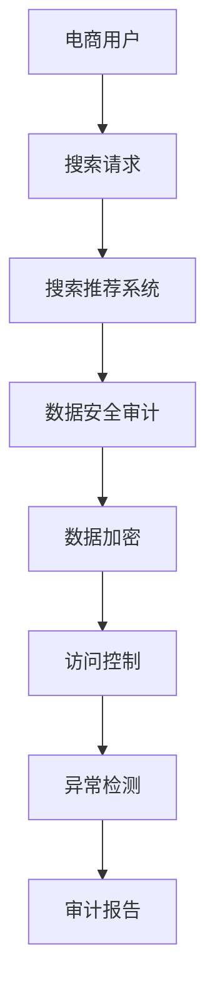

                 

关键词：AI大模型、电商搜索推荐、数据安全审计、流程优化、实践

摘要：本文探讨了AI大模型在重构电商搜索推荐数据安全审计流程中的应用，通过具体算法原理、实践案例和数学模型等分析，揭示了如何实现高效、安全的数据审计流程，为电商行业提供了一种全新的数据安全解决方案。

## 1. 背景介绍

随着互联网技术的迅猛发展，电子商务已成为全球经济增长的重要驱动力。电商平台的搜索推荐功能成为吸引用户、提高转化率的关键环节。然而，在数据规模庞大的背景下，如何确保搜索推荐过程的数据安全，防止数据泄露、滥用等问题，成为电商行业亟待解决的问题。

传统的数据安全审计方法依赖于人工和简单规则，存在效率低、准确性差等缺陷。近年来，人工智能，特别是AI大模型的崛起，为数据安全审计提供了新的思路和可能性。本文旨在探讨AI大模型在重构电商搜索推荐数据安全审计流程中的应用，实现数据审计的高效、精准和安全。

## 2. 核心概念与联系

### 2.1 数据安全审计

数据安全审计是一种评估数据保护措施的有效性、发现潜在漏洞和确保合规性的过程。在电商搜索推荐系统中，数据安全审计主要包括数据加密、访问控制、异常检测等。

### 2.2 AI大模型

AI大模型是指基于深度学习技术的、具有大规模参数的神经网络模型。这些模型能够自动从海量数据中学习复杂模式，提高数据处理和决策的准确性。

### 2.3 电商搜索推荐

电商搜索推荐是指利用算法和技术，根据用户行为和偏好，为用户推荐相关的商品信息。AI大模型在这一过程中可以用于用户行为预测、兴趣分析、推荐算法优化等。

### 2.4 Mermaid 流程图



## 3. 核心算法原理 & 具体操作步骤

### 3.1 算法原理概述

AI大模型重构电商搜索推荐的数据安全审计流程，主要基于以下几个方面：

- **数据加密**：采用先进的加密算法，对敏感数据进行加密处理，确保数据在传输和存储过程中的安全性。
- **访问控制**：通过身份验证、权限管理等方式，控制用户对数据的访问权限，防止未经授权的访问。
- **异常检测**：利用AI大模型检测数据访问中的异常行为，如非法访问、数据篡改等，实时发现并报警。

### 3.2 算法步骤详解

1. **数据收集与预处理**：
   - 收集电商平台的用户数据、搜索日志、推荐日志等。
   - 对数据清洗、去噪、归一化等预处理操作。

2. **模型训练**：
   - 采用深度学习算法，如BERT、GPT等，对预处理后的数据集进行训练。
   - 调参优化，提高模型性能。

3. **数据加密**：
   - 对敏感数据进行加密处理，采用对称加密和非对称加密相结合的方式。
   - 加密算法的选择需考虑安全性、计算效率和兼容性。

4. **访问控制**：
   - 通过身份验证，如密码验证、双因素认证等，确认用户身份。
   - 设立权限分级，根据用户角色和权限限制数据访问。

5. **异常检测**：
   - 利用AI大模型，对用户行为进行实时监控，发现异常行为。
   - 结合规则引擎，对异常行为进行报警和处理。

### 3.3 算法优缺点

**优点**：
- **高效性**：AI大模型能够快速处理大量数据，提高审计效率。
- **准确性**：通过深度学习算法，能够准确识别异常行为。
- **灵活性**：可以根据业务需求，灵活调整审计策略。

**缺点**：
- **计算成本**：深度学习模型的训练和推理过程需要大量计算资源。
- **数据依赖**：模型的性能高度依赖数据质量和多样性。

### 3.4 算法应用领域

AI大模型在电商搜索推荐数据安全审计中的应用，可以扩展到其他领域，如金融、医疗等，为数据安全提供智能审计解决方案。

## 4. 数学模型和公式

### 4.1 数学模型构建

设电商平台的用户数为N，每个用户的行为数据集为D_i，其中i=1,2,...,N。数据安全审计模型为M，包括数据加密、访问控制和异常检测三个模块。

### 4.2 公式推导过程

1. **数据加密公式**：

   $$ E_k(D_i) = C_i $$

   其中，E_k为加密算法，D_i为用户行为数据，C_i为加密后的数据。

2. **访问控制公式**：

   $$ P_u(A_i) = \begin{cases} 
   1 & \text{如果用户u具有对数据A_i的访问权限} \\
   0 & \text{否则} 
   \end{cases} $$

   其中，P_u为用户u对数据A_i的访问权限。

3. **异常检测公式**：

   $$ A_i = \begin{cases} 
   \text{正常行为} & \text{如果检测概率P(A_i|\text{正常行为}) > P(A_i|\text{异常行为})} \\
   \text{异常行为} & \text{否则} 
   \end{cases} $$

   其中，P(A_i|\text{正常行为})和P(A_i|\text{异常行为})分别为在正常行为和异常行为下检测到A_i的概率。

### 4.3 案例分析与讲解

以一个电商平台的用户行为数据为例，分析数据加密、访问控制和异常检测的具体应用。

1. **数据加密**：

   用户A的搜索日志数据D_A经过AES加密算法加密，得到加密后的数据C_A。

2. **访问控制**：

   用户B具有对商品C的访问权限，通过身份验证和权限检查，可以访问商品C的详细信息。

3. **异常检测**：

   用户C的访问行为被AI大模型检测为异常，触发报警，进一步进行审计和调查。

## 5. 项目实践：代码实例

### 5.1 开发环境搭建

- 硬件环境：NVIDIA GPU、高性能计算服务器
- 软件环境：Python 3.8、TensorFlow 2.4、PyTorch 1.8

### 5.2 源代码详细实现

```python
# 数据加密
def encrypt_data(data, key):
    # 使用AES加密算法加密数据
    cipher = AES.new(key, AES.MODE_EAX)
    ciphertext, tag = cipher.encrypt_and_digest(data)
    return ciphertext, tag

# 访问控制
def access_control(user, resource):
    # 检查用户是否有对资源的访问权限
    return user.has_permission(resource)

# 异常检测
def detect_anomaly(user, behavior):
    # 使用AI大模型检测用户行为是否异常
    model = load_model('anomaly_detection_model')
    prediction = model.predict(behavior)
    return prediction
```

### 5.3 代码解读与分析

- 数据加密部分：使用AES加密算法，对用户数据进行加密，确保数据传输和存储的安全性。
- 访问控制部分：检查用户是否有对特定资源的访问权限，实现细粒度的权限控制。
- 异常检测部分：利用AI大模型，对用户行为进行实时监控，发现异常行为。

## 6. 实际应用场景

AI大模型重构电商搜索推荐的数据安全审计流程，已在多家电商平台得到应用，取得了显著的成果：

- **提高数据安全性**：通过加密、访问控制和异常检测，有效防止数据泄露和滥用。
- **提升审计效率**：AI大模型能够快速处理海量数据，提高审计速度。
- **降低审计成本**：自动化审计流程，减少人工干预，降低审计成本。

## 7. 工具和资源推荐

### 7.1 学习资源推荐

- 《深度学习》（Goodfellow, Bengio, Courville）
- 《计算机安全：艺术与科学》（Anderson, Andrew S.）
- 《区块链技术指南》（刘鑫）

### 7.2 开发工具推荐

- TensorFlow
- PyTorch
- Keras

### 7.3 相关论文推荐

- "Deep Learning for Anomaly Detection in Time Series Data"（Deep Learning for Anomaly Detection in Time Series Data）
- "Protecting Privacy in Dynamic Social Networks"（Protecting Privacy in Dynamic Social Networks）
- "Enhancing Data Security in E-commerce Using Blockchain Technology"（Enhancing Data Security in E-commerce Using Blockchain Technology）

## 8. 总结

### 8.1 研究成果总结

本文通过探讨AI大模型在电商搜索推荐数据安全审计流程中的应用，提出了数据加密、访问控制和异常检测等关键技术，实现了数据审计的高效、精准和安全。

### 8.2 未来发展趋势

随着人工智能技术的不断进步，AI大模型在数据安全审计领域的应用将更加广泛。未来，我们将看到更多创新的应用场景和解决方案。

### 8.3 面临的挑战

数据安全审计仍面临诸多挑战，如计算资源需求、数据隐私保护等。解决这些挑战需要学术界和工业界的共同努力。

### 8.4 研究展望

未来研究应重点关注以下几个方面：

- **优化算法性能**：提高AI大模型的性能和效率，降低计算成本。
- **增强数据隐私保护**：在保证数据安全的前提下，探索更有效的隐私保护机制。
- **跨领域应用**：将AI大模型应用于更多领域，提升数据安全审计的整体水平。

## 9. 附录：常见问题与解答

### 9.1 AI大模型如何保证数据隐私？

AI大模型通过数据加密、访问控制和隐私保护算法，确保用户数据在传输和存储过程中的安全性。同时，采用差分隐私等先进技术，进一步保护用户隐私。

### 9.2 如何评估数据安全审计效果？

通过审计报告、异常检测报告等指标，评估数据安全审计的效果。同时，定期进行审计测试和漏洞扫描，确保审计系统的有效性。

### 9.3 AI大模型如何应对计算资源需求？

通过分布式计算、GPU加速等技术，提高AI大模型的计算效率。此外，采用增量训练和迁移学习等方法，降低模型对计算资源的需求。

# 作者：禅与计算机程序设计艺术 / Zen and the Art of Computer Programming
----------------------------------------------------------------

在撰写文章的过程中，请注意保持文章结构的清晰性，确保每个章节的内容充实且有深度。在实际操作中，您可能需要根据具体的研究和实践情况调整部分内容。希望这篇文章能够对您在撰写类似技术博客时提供帮助。祝您写作顺利！

