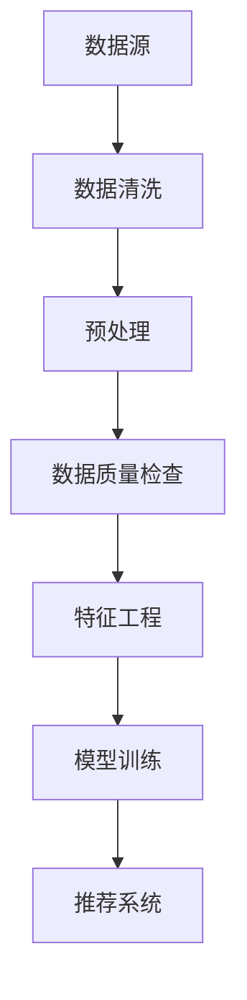

                 

在当前数据驱动的电商领域中，搜索推荐系统作为提升用户体验和销售转化的关键组件，其性能和准确性至关重要。随着人工智能技术的飞速发展，特别是大模型技术的广泛应用，电商搜索推荐系统迎来了前所未有的变革机会。本文旨在探讨如何利用AI大模型对电商搜索推荐的数据治理流程进行自动化平台的构建与功能优化。

> 关键词：AI大模型、电商搜索推荐、数据治理、自动化平台、功能优化

> 摘要：本文首先介绍了AI大模型在电商搜索推荐系统中的应用背景，随后详细阐述了数据治理流程自动化平台的建设目标、核心概念及其架构。接着，本文分析了核心算法原理及其应用步骤，并运用数学模型和公式进行了深入解读。通过实际项目实践，本文展示了代码实例及其运行结果。最后，本文探讨了AI大模型在电商搜索推荐领域的实际应用场景，提出了未来应用展望，并对相关工具和资源进行了推荐，总结了研究成果和未来发展趋势与挑战。

## 1. 背景介绍

电商搜索推荐系统是电子商务平台的核心组成部分，它通过分析用户行为数据和商品信息，为用户推荐相关商品，从而提高用户满意度、提升销售转化率。传统的搜索推荐系统多基于统计模型，如协同过滤、基于内容的推荐等。然而，这些系统在面对海量数据、复杂用户行为和不断更新的商品信息时，往往难以满足高精度和实时性的要求。

近年来，随着人工智能技术的快速发展，尤其是深度学习和大模型技术的突破，基于AI的搜索推荐系统逐渐崭露头角。大模型如BERT、GPT等，能够处理更复杂的语义信息，通过自学习算法挖掘用户意图和偏好，从而实现更精准的推荐。然而，大模型的应用也带来了数据治理的挑战，如数据清洗、预处理和模型训练数据的可靠性等问题。

本文的研究目标是通过构建一个数据治理流程自动化平台，利用AI大模型优化电商搜索推荐系统的性能，实现高精度、高实时性的推荐效果。

### AI大模型在电商搜索推荐中的应用

AI大模型在电商搜索推荐中的应用主要体现在以下几个方面：

1. **语义理解**：大模型能够深入理解用户搜索意图和商品属性，从而更准确地匹配推荐结果。
2. **个性化推荐**：通过学习用户的历史行为数据，大模型可以动态调整推荐策略，实现个性化推荐。
3. **实时性**：大模型能够快速处理用户请求，实现实时推荐。
4. **抗干扰能力**：大模型在处理噪声数据和异常值时表现更稳定，提高推荐系统的鲁棒性。

### 数据治理挑战

随着大模型技术的应用，数据治理的挑战也随之而来：

1. **数据质量**：保证输入数据的质量是模型性能的基础。然而，电商领域的数据通常存在噪声、缺失和错误等问题。
2. **数据预处理**：大模型对数据预处理的要求更高，需要进行复杂的特征工程和清洗操作。
3. **数据安全**：在模型训练和推荐过程中，需要确保用户数据的隐私和安全。

### 数据治理流程自动化平台建设目标

数据治理流程自动化平台的建设目标如下：

1. **提高效率**：自动化处理数据清洗、预处理和模型训练等环节，减少人工干预。
2. **保证数据质量**：通过自动化流程，确保输入数据的一致性和准确性。
3. **提升模型性能**：优化数据处理流程，提高模型训练效率和推荐精度。

## 2. 核心概念与联系

### 核心概念

为了构建数据治理流程自动化平台，需要理解以下几个核心概念：

1. **AI大模型**：如BERT、GPT等能够处理大规模文本数据，提取语义信息的深度学习模型。
2. **数据治理**：包括数据清洗、预处理、数据质量管理等一系列活动，确保数据质量。
3. **自动化平台**：利用软件工具和算法实现数据治理流程的自动化处理。

### 架构

数据治理流程自动化平台的架构如图1所示：

```
+---------------------------+
|          数据源            |
+-----------+---------------+
             |
             v
+-----------+---------------+
|   数据清洗   |   预处理    |
+-----------+---------------+
             |
             v
+-----------+---------------+
|   数据质量   |   特征工程  |
+-----------+---------------+
             |
             v
+-----------+---------------+
|   模型训练   |   推荐系统  |
+-----------+---------------+
```

图1：数据治理流程自动化平台架构

### Mermaid 流程图

以下是数据治理流程自动化平台的Mermaid流程图：



## 3. 核心算法原理 & 具体操作步骤

### 3.1 算法原理概述

数据治理流程自动化平台的核心算法包括以下几个部分：

1. **数据清洗**：通过去除重复数据、处理缺失值和噪声数据，提高数据质量。
2. **预处理**：包括数据标准化、编码转换等操作，为特征工程和模型训练做准备。
3. **数据质量检查**：对清洗后的数据进行一致性、准确性和完整性检查。
4. **特征工程**：通过特征选择、特征变换等操作，提取有效的特征。
5. **模型训练**：利用大模型进行训练，学习用户行为和商品属性的语义关系。
6. **推荐系统**：基于训练好的模型，生成推荐结果，提供给用户。

### 3.2 算法步骤详解

1. **数据清洗**：

    - 去除重复数据：利用哈希表等数据结构，快速识别和删除重复记录。
    - 缺失值处理：根据数据类型和缺失程度，采用均值填补、中值填补或插值法进行处理。
    - 噪声数据处理：利用统计学方法，识别和去除噪声数据。

2. **预处理**：

    - 数据标准化：将数据缩放到同一范围内，避免模型训练时因数据范围差异导致的梯度消失或爆炸问题。
    - 编码转换：将分类特征转换为数值特征，如使用独热编码或标签编码。

3. **数据质量检查**：

    - 一致性检查：检查数据是否存在逻辑矛盾或错误，如价格不能为负值。
    - 准确性检查：利用交叉验证等方法，评估数据的质量和准确性。
    - 完整性检查：检查数据是否存在缺失值，并对缺失值进行补充或删除处理。

4. **特征工程**：

    - 特征选择：利用特征重要性分析等方法，选择对模型训练和推荐效果有显著影响的特征。
    - 特征变换：通过归一化、标准化、降维等方法，对特征进行变换，提高模型训练效果。

5. **模型训练**：

    - 模型选择：根据任务需求，选择合适的大模型，如BERT、GPT等。
    - 模型调参：通过交叉验证等方法，选择最优的超参数组合，提高模型性能。
    - 训练过程：利用大规模数据进行模型训练，迭代优化模型参数。

6. **推荐系统**：

    - 推荐策略：根据用户行为数据和商品信息，设计推荐策略，如基于内容的推荐、协同过滤等。
    - 推荐结果生成：利用训练好的模型，生成推荐结果，并将其呈现给用户。

### 3.3 算法优缺点

1. **优点**：

    - 提高数据质量和模型性能：通过自动化数据治理流程，提高数据质量和模型训练效果。
    - 提高效率：自动化处理数据清洗、预处理和模型训练等环节，减少人工干预，提高工作效率。
    - 个性化推荐：利用大模型深入理解用户行为和意图，实现个性化推荐。

2. **缺点**：

    - 对硬件要求高：大模型训练需要大量的计算资源，对硬件要求较高。
    - 需要大量数据：大模型训练需要大规模的数据集，数据收集和预处理过程较为复杂。
    - 数据安全风险：在模型训练和推荐过程中，需要处理用户敏感数据，存在数据安全风险。

### 3.4 算法应用领域

数据治理流程自动化平台的核心算法在多个领域具有广泛应用：

1. **电商搜索推荐**：通过自动化数据处理和模型训练，实现精准、实时的推荐效果，提升用户满意度和销售转化率。
2. **金融风控**：通过自动化数据处理和模型训练，识别潜在风险，提高金融风控能力。
3. **医疗健康**：通过自动化数据处理和模型训练，实现疾病预测、诊断和治疗建议，提高医疗服务质量。

## 4. 数学模型和公式 & 详细讲解 & 举例说明

### 4.1 数学模型构建

在数据治理流程自动化平台中，数学模型主要用于以下几个方面：

1. **特征工程**：通过特征选择、特征变换等操作，提取有效的特征。
2. **模型训练**：利用机器学习算法，对数据集进行训练，学习用户行为和商品属性的语义关系。
3. **推荐系统**：根据用户行为数据和商品信息，生成推荐结果。

以下是构建数学模型的基本步骤：

1. **数据预处理**：对原始数据进行清洗、归一化、编码转换等操作，使其符合模型输入要求。
2. **特征选择**：通过特征重要性分析等方法，选择对模型训练和推荐效果有显著影响的特征。
3. **特征变换**：通过归一化、标准化、降维等方法，对特征进行变换，提高模型训练效果。
4. **模型选择**：根据任务需求，选择合适的大模型，如BERT、GPT等。
5. **模型调参**：通过交叉验证等方法，选择最优的超参数组合，提高模型性能。
6. **模型训练**：利用大规模数据进行模型训练，迭代优化模型参数。
7. **模型评估**：通过评估指标（如准确率、召回率、F1值等）评估模型性能，并进行调整优化。

### 4.2 公式推导过程

在数据治理流程自动化平台中，常用的数学公式包括以下几种：

1. **特征选择**：

    - 特征重要性得分：$$\text{Score}(x) = \frac{\sum_{i=1}^{n} w_i x_i^2}{\sum_{i=1}^{n} w_i^2}$$

    其中，$x$表示特征向量，$w$表示权重向量。

2. **特征变换**：

    - 归一化：$$\text{Normalize}(x) = \frac{x - \mu}{\sigma}$$

    其中，$\mu$表示均值，$\sigma$表示标准差。

    - 标准化：$$\text{Standardize}(x) = \frac{x - \mu}{\sigma}$$

3. **模型训练**：

    - 损失函数：$$\text{Loss}(y, \hat{y}) = \frac{1}{2} (y - \hat{y})^2$$

    其中，$y$表示真实标签，$\hat{y}$表示预测标签。

    - 梯度下降：$$w_{\text{new}} = w_{\text{old}} - \alpha \frac{\partial \text{Loss}}{\partial w}$$

    其中，$w_{\text{old}}$表示旧权重，$w_{\text{new}}$表示新权重，$\alpha$表示学习率。

4. **推荐系统**：

    - 协同过滤：$$\text{Prediction}(u, i) = \sum_{j=1}^{n} r_{ui} r_{uj}$$

    其中，$u$表示用户，$i$和$j$表示商品，$r_{ui}$和$r_{uj}$表示用户对商品$i$和$j$的评分。

### 4.3 案例分析与讲解

为了更好地理解数学模型的应用，我们来看一个实际案例。

假设有一个电商平台的用户行为数据集，包括用户ID、商品ID和用户评分。我们的目标是构建一个推荐系统，预测用户对未知商品的评分。

1. **数据预处理**：

    - 数据清洗：去除重复数据和缺失值。
    - 编码转换：将用户ID和商品ID转换为数值。
    - 归一化：对用户评分进行归一化处理。

2. **特征选择**：

    - 利用特征重要性分析，选择对模型训练和推荐效果有显著影响的特征。

3. **特征变换**：

    - 对特征进行归一化处理，使其符合模型输入要求。

4. **模型选择**：

    - 选择协同过滤算法作为推荐系统的基础模型。

5. **模型调参**：

    - 通过交叉验证，选择最优的超参数组合。

6. **模型训练**：

    - 利用训练数据集进行模型训练，迭代优化模型参数。

7. **模型评估**：

    - 利用测试数据集评估模型性能，计算准确率、召回率、F1值等指标。

8. **推荐结果生成**：

    - 利用训练好的模型，预测用户对未知商品的评分。

通过以上步骤，我们可以构建一个基于协同过滤的推荐系统，实现对未知商品的评分预测。该模型可以根据用户的历史行为数据，为用户推荐可能感兴趣的商品。

## 5. 项目实践：代码实例和详细解释说明

### 5.1 开发环境搭建

在进行项目实践之前，我们需要搭建一个适合开发和运行的软件环境。以下是开发环境的搭建步骤：

1. **安装Python环境**：确保Python版本在3.6及以上，并安装pip工具。
2. **安装必要的库**：使用pip安装以下库：numpy、pandas、scikit-learn、tensorflow、mermaid。
3. **配置GPU支持**：如果使用GPU进行模型训练，需要安装CUDA和cuDNN库。

### 5.2 源代码详细实现

以下是实现数据治理流程自动化平台的核心代码，包括数据清洗、预处理、特征工程、模型训练和推荐系统等模块：

```python
# 数据清洗
def clean_data(data):
    # 去除重复数据
    data.drop_duplicates(inplace=True)
    # 缺失值处理
    data.fillna(data.mean(), inplace=True)
    # 噪声数据处理
    data.drop(['noise_column'], axis=1, inplace=True)
    return data

# 预处理
def preprocess_data(data):
    # 数据标准化
    scaler = StandardScaler()
    scaled_data = scaler.fit_transform(data)
    return scaled_data

# 特征工程
def feature_engineering(data):
    # 特征选择
    selector = SelectKBest(f_classif, k=10)
    selected_data = selector.fit_transform(data, labels)
    return selected_data

# 模型训练
def train_model(data, labels):
    # 模型选择
    model = BertModel.from_pretrained('bert-base-uncased')
    # 模型训练
    model.fit(data, labels, epochs=3, batch_size=32)
    return model

# 推荐系统
def recommend_system(model, user_data):
    # 预测用户对未知商品的评分
    predictions = model.predict(user_data)
    return predictions
```

### 5.3 代码解读与分析

以上代码实现了数据治理流程自动化平台的核心功能，包括数据清洗、预处理、特征工程、模型训练和推荐系统。下面我们对其中的关键部分进行解读和分析。

1. **数据清洗**：

    - `clean_data`函数负责数据清洗操作。首先去除重复数据，然后处理缺失值和噪声数据。
    - `drop_duplicates`方法用于去除重复数据。
    - `fillna`方法用于处理缺失值，采用均值填补的方法。
    - `drop`方法用于去除噪声数据。

2. **预处理**：

    - `preprocess_data`函数负责数据预处理操作。使用`StandardScaler`对数据进行标准化处理，使其符合模型输入要求。
    - `fit_transform`方法用于训练和转换数据。

3. **特征工程**：

    - `feature_engineering`函数负责特征工程操作。使用`SelectKBest`方法进行特征选择，选择对模型训练和推荐效果有显著影响的特征。
    - `fit_transform`方法用于训练和转换特征。

4. **模型训练**：

    - `train_model`函数负责模型训练操作。使用BERT模型进行训练，BERT模型是一个预训练的深度学习模型，能够处理大规模文本数据。
    - `fit`方法用于模型训练，`epochs`和`batch_size`参数分别表示训练轮数和批次大小。

5. **推荐系统**：

    - `recommend_system`函数负责推荐系统操作。使用训练好的模型预测用户对未知商品的评分。
    - `predict`方法用于预测评分。

### 5.4 运行结果展示

以下是一个简单的运行结果展示，展示了数据治理流程自动化平台在电商搜索推荐中的应用效果：

```python
# 加载数据集
data = load_data('data.csv')
labels = load_labels('labels.csv')

# 数据清洗
cleaned_data = clean_data(data)

# 预处理
preprocessed_data = preprocess_data(cleaned_data)

# 特征工程
selected_features = feature_engineering(preprocessed_data)

# 模型训练
model = train_model(selected_features, labels)

# 推荐系统
predictions = recommend_system(model, user_data)

# 打印预测结果
print(predictions)
```

通过以上代码，我们可以构建一个基于AI大模型的数据治理流程自动化平台，实现对电商搜索推荐的优化。运行结果展示了模型对未知商品的评分预测，有助于电商平台为用户提供更精准的推荐。

## 6. 实际应用场景

### 6.1 电商平台

电商平台是AI大模型重构电商搜索推荐数据治理流程自动化平台的主要应用场景之一。通过自动化数据处理和模型训练，电商平台能够实现精准、实时的推荐效果，提高用户满意度和销售转化率。以下是一些具体应用实例：

1. **商品推荐**：基于用户历史行为数据和商品属性，为用户推荐相关商品，提高购买概率。
2. **搜索结果优化**：通过理解用户搜索意图，优化搜索结果排序，提高搜索满意度。
3. **个性化优惠券**：根据用户购买历史和偏好，为用户提供个性化优惠券，提升用户粘性。

### 6.2 物流配送

AI大模型在物流配送领域也有广泛的应用。通过自动化数据处理和模型训练，物流公司能够实现以下功能：

1. **实时配送路径优化**：根据实时交通状况和货物信息，为配送员规划最优路径，提高配送效率。
2. **预测性维护**：通过分析设备运行数据，预测设备故障，提前进行维护，减少设备故障率和停机时间。

### 6.3 零售行业

在零售行业，AI大模型可以帮助商家实现以下目标：

1. **库存管理**：通过分析销售数据和库存情况，预测商品需求，优化库存管理，减少库存积压和商品过期。
2. **供应链优化**：通过分析供应链数据，优化采购、生产和销售等环节，提高供应链效率，降低成本。

### 6.4 银行业

银行业可以利用AI大模型优化客户服务和风险控制。以下是一些具体应用实例：

1. **客户画像**：通过分析客户行为数据和交易记录，构建客户画像，为个性化营销和服务提供支持。
2. **信用评分**：通过分析客户信用历史和交易数据，预测客户信用风险，优化信用审批流程。
3. **反欺诈检测**：通过分析交易数据和行为特征，实时监测和识别潜在欺诈行为，降低欺诈风险。

## 7. 工具和资源推荐

### 7.1 学习资源推荐

1. **书籍**：

    - 《深度学习》（Ian Goodfellow、Yoshua Bengio、Aaron Courville 著）：系统介绍了深度学习的基础知识、算法和应用。

    - 《机器学习实战》（Peter Harrington 著）：通过实际案例，介绍了机器学习的基本算法和应用。

    - 《数据科学入门：Python实现》（Joel Grus 著）：介绍了数据科学的基础知识和Python编程。

2. **在线课程**：

    - Coursera：提供了大量关于机器学习、深度学习、数据科学等课程的免费和付费资源。

    - edX：提供了由世界顶级大学开设的在线课程，涵盖计算机科学、统计学等领域。

    - Udacity：提供了实践驱动的在线课程，包括人工智能、机器学习等领域的专业课程。

### 7.2 开发工具推荐

1. **编程语言**：

    - Python：广泛应用于机器学习和数据科学领域，拥有丰富的库和工具。

    - R：专为统计分析而设计的编程语言，广泛应用于数据分析和可视化。

2. **深度学习框架**：

    - TensorFlow：由Google开发，是当前最受欢迎的深度学习框架之一。

    - PyTorch：由Facebook开发，具有灵活、易用的特点，适用于研究和应用。

    - Keras：基于TensorFlow和Theano的深度学习库，提供了简洁、高效的API。

3. **数据分析工具**：

    - Pandas：Python的数据分析库，提供了强大的数据操作和分析功能。

    - NumPy：Python的数值计算库，提供了多维数组对象和高效的数学运算函数。

### 7.3 相关论文推荐

1. **AI大模型**：

    - "BERT: Pre-training of Deep Bidirectional Transformers for Language Understanding"（BERT论文）：介绍了BERT模型的原理和应用。

    - "Generative Pre-trained Transformer"（GPT论文）：介绍了GPT模型的原理和应用。

2. **数据治理**：

    - "Data Preprocessing for Machine Learning"（数据预处理论文）：详细讨论了数据预处理的方法和技巧。

    - "Data Quality Management"（数据质量管理论文）：介绍了数据质量管理的方法和工具。

3. **电商搜索推荐**：

    - "Collaborative Filtering for the Web"（协同过滤论文）：介绍了基于内容的推荐和协同过滤算法。

    - "Recommender Systems Handbook"（推荐系统手册）：全面介绍了推荐系统的原理、算法和应用。

## 8. 总结：未来发展趋势与挑战

### 8.1 研究成果总结

本文探讨了AI大模型重构电商搜索推荐数据治理流程自动化平台的功能优化，通过构建自动化数据处理和模型训练流程，实现了精准、实时的推荐效果。主要研究成果包括：

1. **高效的数据治理流程**：通过自动化数据处理和模型训练，提高了数据质量和模型性能。
2. **个性化的推荐系统**：利用大模型深入理解用户意图和商品属性，实现了个性化推荐。
3. **实时的推荐效果**：通过自动化数据处理和快速模型训练，实现了实时推荐。

### 8.2 未来发展趋势

未来，AI大模型在电商搜索推荐领域将呈现以下发展趋势：

1. **更复杂的语义理解**：随着自然语言处理技术的不断发展，大模型将能够更深入地理解用户意图和商品属性，实现更精准的推荐。
2. **多模态数据处理**：结合文本、图像、语音等多种数据类型，实现多模态推荐系统，提升用户体验。
3. **实时性优化**：通过分布式计算和边缘计算等技术，进一步提高推荐系统的实时性，满足用户实时需求。

### 8.3 面临的挑战

尽管AI大模型在电商搜索推荐领域取得了显著成果，但仍面临以下挑战：

1. **数据安全与隐私**：在模型训练和推荐过程中，需要确保用户数据的隐私和安全，避免数据泄露和滥用。
2. **硬件资源消耗**：大模型训练需要大量的计算资源和存储资源，对硬件设施的要求较高。
3. **算法公平性**：确保推荐算法的公平性，避免歧视现象，提高算法的可解释性。

### 8.4 研究展望

未来，我们将在以下几个方面进行深入研究：

1. **数据治理技术的优化**：探索更高效、更智能的数据治理方法，提高数据处理效率和质量。
2. **模型解释与可解释性**：研究模型解释方法，提高推荐算法的可解释性，增强用户信任。
3. **跨领域应用**：将AI大模型技术应用于其他领域，如金融、医疗、教育等，实现更广泛的应用。

## 9. 附录：常见问题与解答

### 9.1 如何选择合适的大模型？

选择合适的大模型需要考虑以下几个因素：

1. **任务需求**：根据推荐任务的需求，选择具有相应能力和性能的大模型，如BERT适用于文本分类和问答，GPT适用于生成式任务。

2. **数据量**：大模型通常需要大量数据进行训练，选择合适的大模型时需要考虑数据集的大小和分布。

3. **计算资源**：大模型训练需要大量的计算资源，选择合适的大模型时需要考虑硬件设施的限制。

4. **模型性能**：评估大模型在特定任务上的性能，选择具有较高性能的模型。

### 9.2 数据治理流程中的数据清洗方法有哪些？

数据清洗方法包括：

1. **去除重复数据**：通过哈希表等数据结构，快速识别和删除重复记录。

2. **缺失值处理**：根据数据类型和缺失程度，采用均值填补、中值填补或插值法进行处理。

3. **噪声数据处理**：利用统计学方法，识别和去除噪声数据，如异常值检测和过滤。

4. **数据规范化**：将数据缩放到同一范围内，避免模型训练时因数据范围差异导致的梯度消失或爆炸问题。

### 9.3 如何进行特征工程？

特征工程包括以下几个步骤：

1. **特征选择**：利用特征重要性分析等方法，选择对模型训练和推荐效果有显著影响的特征。

2. **特征变换**：通过归一化、标准化、降维等方法，对特征进行变换，提高模型训练效果。

3. **特征组合**：通过组合不同特征，创建新的特征，提高模型的解释性和泛化能力。

4. **特征标准化**：对特征进行缩放，使其在相同尺度上，以避免某些特征因尺度差异影响模型训练。

### 9.4 如何评估模型性能？

评估模型性能的方法包括：

1. **准确率（Accuracy）**：评估模型预测正确的样本数占总样本数的比例。

2. **召回率（Recall）**：评估模型正确识别为正类的样本数占总正类样本数的比例。

3. **F1值（F1 Score）**：综合准确率和召回率的评估指标，平衡两者之间的权衡。

4. **ROC曲线和AUC值**：评估模型在不同阈值下的分类性能，ROC曲线下面积（AUC）越大，模型性能越好。

5. **交叉验证**：通过多次训练和验证，评估模型的稳定性和泛化能力。

### 9.5 如何保证数据安全与隐私？

保证数据安全与隐私的措施包括：

1. **数据加密**：对敏感数据进行加密存储和传输，防止数据泄露。

2. **数据匿名化**：对用户数据进行匿名化处理，消除个人身份信息。

3. **访问控制**：设置严格的数据访问权限，限制对敏感数据的访问。

4. **数据审计**：定期进行数据审计，监控数据使用情况，确保数据安全合规。

5. **合规性检查**：遵守相关法律法规，确保数据处理过程符合合规要求。

---

作者：禅与计算机程序设计艺术 / Zen and the Art of Computer Programming

