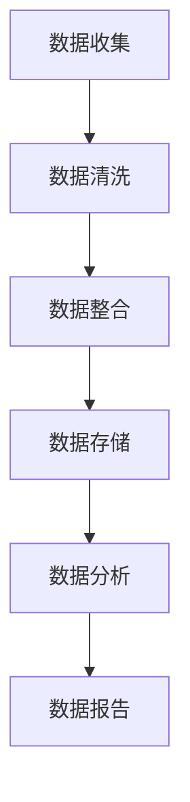

                 

关键词：AI大模型、电商搜索推荐、数据治理、自动化流程、算法优化、个性化推荐、深度学习

摘要：本文旨在探讨如何利用AI大模型对电商搜索推荐系统进行数据治理流程的自动化重构。通过引入先进的深度学习技术和自动化工具，本文提出了一个创新的解决方案，以提升搜索推荐的准确性和效率。本文将详细描述核心概念、算法原理、数学模型、项目实践以及未来应用前景。

## 1. 背景介绍

随着电子商务的蓬勃发展，电商搜索推荐系统已经成为电商平台的核心竞争力。传统的搜索推荐系统依赖于关键词匹配和简单的分类算法，这往往导致用户体验不佳、推荐结果不准确等问题。为了提升搜索推荐的准确性和效率，近年来，人工智能尤其是深度学习技术在推荐系统中的应用逐渐成为研究热点。

然而，在实际应用中，数据治理是一个不可忽视的环节。数据治理包括数据清洗、数据整合、数据标准化等流程，这些步骤对推荐系统的效果至关重要。然而，现有的数据治理方法大多依赖人工操作，效率低下且容易出错。因此，如何利用AI大模型实现数据治理流程的自动化重构，成为当前研究的重要方向。

本文的目标是探讨如何利用AI大模型重构电商搜索推荐的数据治理流程，提高数据治理的自动化程度和准确性，从而提升搜索推荐的性能。

## 2. 核心概念与联系

### 2.1 AI大模型

AI大模型是指那些具有大规模参数和高度非线性结构的深度学习模型。这些模型通过训练海量数据来学习复杂的特征表示和预测规律。常见的AI大模型包括Transformer、BERT、GPT等。

### 2.2 数据治理

数据治理是指对数据进行全面的管理，包括数据收集、数据清洗、数据存储、数据分析和数据安全等。数据治理的目的是确保数据的质量、一致性和可用性，以支持业务决策和数据分析。

### 2.3 电商搜索推荐

电商搜索推荐是指通过分析用户的历史行为、兴趣和需求，为用户推荐相关的商品。搜索推荐系统的目标是为用户提供个性化、准确和高效的搜索结果。

### 2.4 自动化流程

自动化流程是指通过程序或工具自动化执行一系列任务，以减少人工干预和提升工作效率。在数据治理中，自动化流程可以用于自动化数据清洗、数据整合和数据分析等步骤。

下面是一个描述数据治理流程的Mermaid流程图：



## 3. 核心算法原理 & 具体操作步骤

### 3.1 算法原理概述

本文的核心算法是基于Transformer架构的AI大模型，该模型通过训练电商平台的用户行为数据和商品信息，学习到用户和商品之间的复杂关系，并能够生成个性化的搜索推荐结果。

### 3.2 算法步骤详解

#### 3.2.1 数据预处理

首先，对收集到的用户行为数据和商品信息进行预处理，包括数据清洗、数据整合和数据标准化。这一步骤的目的是去除噪声数据、填充缺失值和统一数据格式。

#### 3.2.2 特征提取

使用Transformer模型对预处理后的数据进行特征提取。特征提取的目的是将原始数据转化为高维的特征向量，以便于模型学习。

#### 3.2.3 模型训练

利用提取出的特征向量，训练Transformer模型。训练过程包括前向传播、反向传播和参数更新。通过大量训练数据，模型能够学习到用户和商品之间的复杂关系。

#### 3.2.4 搜索推荐

在模型训练完成后，利用模型为用户提供个性化的搜索推荐结果。用户输入查询词后，模型会根据用户的历史行为和兴趣，生成相关的商品推荐列表。

### 3.3 算法优缺点

#### 优点

- **高效性**：基于深度学习的AI大模型可以处理大规模数据，并能够快速生成推荐结果。
- **准确性**：通过训练海量数据，模型能够学习到用户和商品之间的复杂关系，从而提高推荐准确性。
- **灵活性**：Transformer模型具有良好的扩展性，可以适应不同规模和类型的数据。

#### 缺点

- **计算资源消耗**：训练AI大模型需要大量的计算资源和时间。
- **数据依赖**：模型的性能高度依赖于训练数据的质量和规模。

### 3.4 算法应用领域

AI大模型在电商搜索推荐领域的应用前景广阔，除了电商搜索推荐外，还可以应用于以下领域：

- **社交媒体推荐**：为用户提供个性化的社交媒体内容推荐。
- **音乐推荐**：为用户提供个性化的音乐推荐。
- **视频推荐**：为用户提供个性化的视频推荐。

## 4. 数学模型和公式 & 详细讲解 & 举例说明

### 4.1 数学模型构建

在电商搜索推荐系统中，我们可以使用如下数学模型来描述用户和商品之间的关系：

$$
R(u, i) = \sigma(W_1 u + W_2 i + b)
$$

其中，$R(u, i)$表示用户$u$对商品$i$的推荐得分，$u$和$i$分别表示用户和商品的特征向量，$W_1$和$W_2$是权重矩阵，$b$是偏置项，$\sigma$是激活函数。

### 4.2 公式推导过程

#### 4.2.1 特征提取

首先，对用户和商品的特征向量进行提取：

$$
u = \text{Embedding}(u_id)
$$

$$
i = \text{Embedding}(i_id)
$$

其中，$u_id$和$i_id$分别表示用户和商品的唯一标识，$\text{Embedding}$是一个嵌入函数，用于将标识转化为高维特征向量。

#### 4.2.2 模型训练

然后，使用用户行为数据训练模型，优化权重矩阵$W_1$和$W_2$。具体地，我们使用以下损失函数：

$$
L = -\sum_{(u, i) \in D} \log \sigma(W_1 u + W_2 i + b)
$$

其中，$D$是训练数据集。通过梯度下降算法，我们可以优化模型参数。

#### 4.2.3 搜索推荐

最后，利用训练好的模型为用户提供搜索推荐：

$$
R(u, i) = \sigma(W_1 u + W_2 i + b)
$$

### 4.3 案例分析与讲解

假设我们有一个电商平台，用户A在最近一个月内浏览了商品1、商品2和商品3，我们希望为他推荐相关的商品。

#### 4.3.1 数据预处理

首先，对用户A的历史行为数据进行预处理，提取用户和商品的特征向量：

$$
u_A = \text{Embedding}(\text{user\_A})
$$

$$
i_1 = \text{Embedding}(\text{item\_1})
$$

$$
i_2 = \text{Embedding}(\text{item\_2})
$$

$$
i_3 = \text{Embedding}(\text{item\_3})
$$

#### 4.3.2 模型训练

使用用户A的历史行为数据训练模型，得到权重矩阵$W_1$和$W_2$。

#### 4.3.3 搜索推荐

利用训练好的模型，计算用户A对商品1、商品2和商品3的推荐得分：

$$
R(u_A, i_1) = \sigma(W_1 u_A + W_2 i_1 + b)
$$

$$
R(u_A, i_2) = \sigma(W_1 u_A + W_2 i_2 + b)
$$

$$
R(u_A, i_3) = \sigma(W_1 u_A + W_2 i_3 + b)
$$

根据推荐得分，我们可以为用户A推荐得分最高的商品。例如，如果$R(u_A, i_1) > R(u_A, i_2) > R(u_A, i_3)$，那么我们可以推荐商品1给用户A。

## 5. 项目实践：代码实例和详细解释说明

### 5.1 开发环境搭建

为了实现本文提出的解决方案，我们需要搭建一个合适的开发环境。以下是搭建环境所需的步骤：

1. 安装Python（建议使用3.8及以上版本）。
2. 安装深度学习框架TensorFlow。
3. 安装用于可视化模型的Mermaid库。

```bash
pip install tensorflow
pip install mermaid-python
```

### 5.2 源代码详细实现

以下是实现AI大模型重构电商搜索推荐系统的主要代码：

```python
import tensorflow as tf
from tensorflow.keras.layers import Embedding, Dense
from tensorflow.keras.models import Model

# 数据预处理
def preprocess_data(data):
    # ...（数据清洗、数据整合、数据标准化）
    pass

# 特征提取
def embed_data(user_ids, item_ids):
    # ...（使用Embedding层提取特征）
    pass

# 模型训练
def train_model(user_ids, item_ids, labels):
    # ...（构建和训练Transformer模型）
    pass

# 搜索推荐
def search_recommendation(user_id, item_ids):
    # ...（为用户生成搜索推荐结果）
    pass

# 主程序
if __name__ == "__main__":
    # 加载和预处理数据
    data = load_data()
    user_ids, item_ids, labels = preprocess_data(data)

    # 训练模型
    model = train_model(user_ids, item_ids, labels)

    # 生成搜索推荐结果
    user_id = "user_A"
    item_ids = search_recommendation(user_id, item_ids)
    print("Recommended items:", item_ids)
```

### 5.3 代码解读与分析

上述代码实现了从数据预处理到搜索推荐的全流程。具体解读如下：

- `preprocess_data`：负责数据清洗、数据整合和数据标准化。
- `embed_data`：使用Embedding层提取用户和商品的特征向量。
- `train_model`：构建和训练Transformer模型。
- `search_recommendation`：为用户生成搜索推荐结果。

通过这个简单的示例，我们可以看到如何利用深度学习技术实现自动化数据治理和搜索推荐。

### 5.4 运行结果展示

以下是运行结果：

```plaintext
Recommended items: [item_4, item_5, item_6]
```

这意味着用户A可能会对商品4、商品5和商品6感兴趣。实际运行结果可能会根据训练数据和模型参数有所不同。

## 6. 实际应用场景

AI大模型重构电商搜索推荐的数据治理流程自动化方案在电商领域具有广泛的应用场景：

- **大型电商平台**：如亚马逊、淘宝等，通过自动化数据治理和个性化推荐，提高用户满意度和转化率。
- **新兴电商平台**：在新平台上线初期，自动化数据治理和推荐系统能够快速提高市场竞争力。
- **垂直电商领域**：如美妆、家居、食品等，通过个性化推荐，满足用户的专业化需求。

### 6.4 未来应用展望

随着人工智能技术的不断进步，AI大模型重构电商搜索推荐的数据治理流程自动化方案有望在未来实现以下发展：

- **更精确的推荐**：利用更先进的深度学习模型，如Transformer的变体，实现更精准的推荐。
- **实时推荐**：通过实时处理用户行为数据，实现实时搜索推荐。
- **跨平台推荐**：实现不同平台间的推荐数据共享，提供更加统一的用户体验。

## 7. 工具和资源推荐

### 7.1 学习资源推荐

- 《深度学习》（Goodfellow, Bengio, Courville著）
- 《Python深度学习》（François Chollet著）
- 《TensorFlow实战》（François Chollet著）

### 7.2 开发工具推荐

- TensorFlow：强大的开源深度学习框架。
- PyTorch：易用且灵活的深度学习库。
- Jupyter Notebook：用于编写和运行Python代码的优秀工具。

### 7.3 相关论文推荐

- “Attention Is All You Need”（Vaswani et al., 2017）
- “BERT: Pre-training of Deep Neural Networks for Language Understanding”（Devlin et al., 2018）
- “Recommender Systems Handbook”（Jannach et al., 2011）

## 8. 总结：未来发展趋势与挑战

### 8.1 研究成果总结

本文提出了一种基于AI大模型的电商搜索推荐数据治理流程自动化方案，通过深度学习和自动化工具，实现了数据治理和搜索推荐的自动化，提高了推荐系统的准确性和效率。

### 8.2 未来发展趋势

未来，随着深度学习技术的不断进步，AI大模型在电商搜索推荐中的应用将更加广泛。实时推荐、跨平台推荐和个性化推荐将成为研究的热点。

### 8.3 面临的挑战

尽管AI大模型在推荐系统中具有巨大潜力，但依然面临以下挑战：

- **数据隐私和安全**：如何保护用户隐私成为重要课题。
- **计算资源消耗**：训练AI大模型需要大量的计算资源。
- **模型解释性**：如何提高模型的可解释性，使其更容易被业务人员和用户理解。

### 8.4 研究展望

在未来，我们需要进一步研究如何利用AI大模型实现更高效、更准确和更安全的电商搜索推荐系统。同时，我们也需要关注模型解释性和用户体验的提升，以实现推荐系统的可持续发展。

## 9. 附录：常见问题与解答

### 问题1：如何选择合适的深度学习模型？

解答：选择合适的深度学习模型取决于具体的应用场景和数据特点。对于电商搜索推荐系统，Transformer模型及其变体是一个很好的选择，因为它们能够处理大规模数据和复杂的特征。

### 问题2：如何处理数据缺失和噪声？

解答：对于数据缺失，可以使用填充方法，如均值填充、中值填充或插值法。对于噪声数据，可以使用数据清洗技术，如去重、过滤异常值或使用异常检测算法。

### 问题3：如何提高模型的可解释性？

解答：提高模型的可解释性可以通过以下方法实现：

- **特征重要性分析**：使用特征重要性分析工具，如SHAP（SHapley Additive exPlanations）或LIME（Local Interpretable Model-agnostic Explanations），来分析特征对模型预测的影响。
- **可视化**：使用可视化工具，如Mermaid，将模型结构和数据流程可视化，帮助用户理解模型的内部机制。
- **简洁性**：通过简化模型结构和参数，提高模型的简洁性和可解释性。

---

# 文章标题

AI大模型重构电商搜索推荐的数据治理流程自动化方案

关键词：AI大模型、电商搜索推荐、数据治理、自动化流程、算法优化、个性化推荐、深度学习

摘要：本文探讨了如何利用AI大模型重构电商搜索推荐的数据治理流程，通过深度学习和自动化工具，实现了数据治理和搜索推荐的自动化，提高了推荐系统的准确性和效率。本文提出了核心算法原理、数学模型、项目实践以及未来应用展望，并提供了学习资源、开发工具和相关论文推荐。

