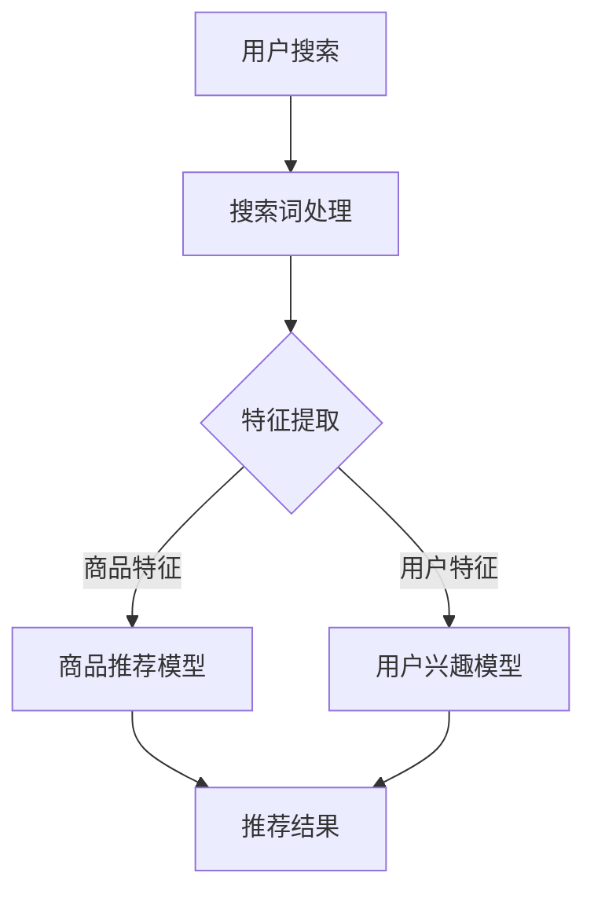

                 

关键字：AI大模型，电商搜索推荐，数据治理，组织架构，优化实践，案例分析

摘要：随着人工智能技术的发展，AI大模型在电商搜索推荐系统中得到了广泛应用。本文将探讨如何利用AI大模型重构电商搜索推荐的数据治理组织架构，实现优化实践，并结合实际案例分析其效果。

## 1. 背景介绍

在互联网时代，电子商务已经成为人们生活中不可或缺的一部分。随着用户需求的多样化和市场竞争的加剧，电商平台的搜索推荐系统成为商家提升用户体验、增加销售额的关键因素。传统的搜索推荐系统主要依赖于关键词匹配和协同过滤等算法，但随着数据量的爆发式增长和用户行为的复杂化，这些方法的局限性日益显现。为了应对这些挑战，AI大模型应运而生，并在电商搜索推荐领域取得了显著成果。

数据治理是AI大模型应用的基础，良好的数据治理组织架构能够确保数据的质量、可用性和一致性，为AI大模型提供可靠的数据支持。然而，传统的数据治理模式在应对大规模、多样化和高速变化的数据时，往往显得力不从心。因此，如何利用AI大模型重构电商搜索推荐的数据治理组织架构，成为一个亟待解决的问题。

本文旨在通过分析AI大模型在电商搜索推荐中的应用，探讨如何优化数据治理组织架构，并借助实际案例展示优化效果。本文的结构如下：

- 第2节介绍AI大模型及其在电商搜索推荐中的核心概念和架构。
- 第3节阐述核心算法原理和具体操作步骤，并分析其优缺点和应用领域。
- 第4节介绍数学模型和公式，并进行详细讲解和举例说明。
- 第5节提供项目实践，展示代码实例和详细解释说明。
- 第6节讨论实际应用场景和未来应用展望。
- 第7节推荐相关学习资源和开发工具。
- 第8节总结研究成果，展望未来发展。

## 2. 核心概念与联系

### 2.1 AI大模型

AI大模型是指具有海量参数和复杂结构的深度学习模型。这些模型通过大量的数据训练，能够自动学习和理解数据中的规律和模式。在电商搜索推荐领域，AI大模型主要用于处理用户行为数据、商品信息、搜索历史等，从而提供个性化的推荐结果。

### 2.2 电商搜索推荐

电商搜索推荐系统旨在为用户提供与搜索词相关的商品推荐。该系统通过分析用户的历史行为、搜索记录和商品特征，利用算法为用户推荐相关的商品。传统的搜索推荐系统主要依赖于关键词匹配和协同过滤等方法，但AI大模型的引入为搜索推荐系统带来了全新的变革。

### 2.3 数据治理组织架构

数据治理组织架构是指用于管理、组织和维护数据的组织结构和流程。在AI大模型的应用中，数据治理组织架构的作用至关重要。一个高效的数据治理组织架构能够确保数据的质量、可用性和一致性，为AI大模型提供可靠的数据支持。

### 2.4 Mermaid 流程图

下面是一个简化的AI大模型在电商搜索推荐中应用的Mermaid流程图：



## 3. 核心算法原理 & 具体操作步骤

### 3.1 算法原理概述

AI大模型在电商搜索推荐中的应用主要包括两个部分：商品推荐模型和用户兴趣模型。商品推荐模型负责根据搜索词和商品特征生成推荐结果，而用户兴趣模型则负责根据用户历史行为和兴趣特征生成用户兴趣标签。

商品推荐模型通常采用基于深度学习的协同过滤算法，如自动编码器（Autoencoder）和生成对抗网络（GAN）。这些算法能够自动学习用户和商品之间的复杂关系，生成个性化的推荐结果。用户兴趣模型则采用基于图神经网络的算法，如图卷积网络（GCN）和图注意力网络（GAT）。这些算法能够根据用户的历史行为和社交关系，提取用户的兴趣特征，从而为用户生成个性化的推荐。

### 3.2 算法步骤详解

下面是AI大模型在电商搜索推荐中的具体操作步骤：

1. **数据预处理**：对用户搜索数据、商品信息和用户行为数据等进行清洗、去噪和格式化，确保数据的质量和一致性。
2. **特征提取**：根据搜索词和商品特征，利用深度学习算法提取用户特征和商品特征。例如，可以使用词嵌入技术将搜索词转换为向量表示，使用卷积神经网络（CNN）提取商品图片的特征。
3. **模型训练**：使用提取的用户特征和商品特征，训练商品推荐模型和用户兴趣模型。商品推荐模型可以采用自动编码器或生成对抗网络，用户兴趣模型可以采用图卷积网络或图注意力网络。
4. **模型评估**：通过交叉验证等方法评估模型的效果，包括准确率、召回率和F1值等指标。
5. **推荐结果生成**：使用训练好的模型为用户生成个性化的推荐结果。首先，使用商品推荐模型根据搜索词生成候选商品集合；然后，使用用户兴趣模型为候选商品分配权重，生成最终的推荐结果。

### 3.3 算法优缺点

AI大模型在电商搜索推荐中具有以下优点：

1. **高精度**：通过深度学习算法自动学习用户和商品之间的复杂关系，生成个性化的推荐结果，显著提高推荐精度。
2. **自适应**：能够根据用户行为的变化实时更新模型，适应不同的用户需求和市场变化。
3. **多样化**：能够同时处理多种类型的特征，如文本、图像和音频等，为用户提供多样化的推荐结果。

但AI大模型也存在一些缺点：

1. **高计算成本**：深度学习模型通常需要大量的计算资源和时间进行训练和推理，对硬件和网络带宽要求较高。
2. **数据依赖性**：模型的性能依赖于数据的质量和多样性，如果数据存在偏差或缺失，可能导致推荐结果不准确。
3. **解释性较差**：深度学习模型内部结构和决策过程较为复杂，难以解释和验证，增加了模型管理的难度。

### 3.4 算法应用领域

AI大模型在电商搜索推荐中的应用不仅限于电商平台，还可以应用于以下领域：

1. **广告推荐**：根据用户的兴趣和行为特征，为用户推荐相关的广告。
2. **内容推荐**：为用户提供个性化的新闻、视频、音乐等内容。
3. **社交网络推荐**：根据用户的关系和兴趣，推荐可能感兴趣的朋友、群组和话题。

## 4. 数学模型和公式

在AI大模型中，常用的数学模型和公式包括以下几个方面：

### 4.1 数学模型构建

假设我们有一个用户 \( u \) 和一个商品 \( i \)，用户 \( u \) 对商品 \( i \) 的评分可以表示为：

\[ r_{ui} = \langle \theta_u, \phi_i \rangle + \epsilon_{ui} \]

其中，\( \theta_u \) 和 \( \phi_i \) 分别表示用户 \( u \) 和商品 \( i \) 的特征向量，\( \langle \cdot, \cdot \rangle \) 表示内积，\( \epsilon_{ui} \) 表示噪声项。

### 4.2 公式推导过程

为了更好地理解上述公式，我们可以对其进行以下推导：

首先，我们定义用户 \( u \) 的特征向量 \( \theta_u \) 为：

\[ \theta_u = \begin{bmatrix} \theta_{u1} \\ \theta_{u2} \\ \vdots \\ \theta_{un} \end{bmatrix} \]

商品 \( i \) 的特征向量 \( \phi_i \) 为：

\[ \phi_i = \begin{bmatrix} \phi_{i1} \\ \phi_{i2} \\ \vdots \\ \phi_{im} \end{bmatrix} \]

那么，用户 \( u \) 对商品 \( i \) 的评分 \( r_{ui} \) 可以表示为：

\[ r_{ui} = \theta_u^T \phi_i + \epsilon_{ui} \]

其中，\( \theta_u^T \) 表示 \( \theta_u \) 的转置，\( \epsilon_{ui} \) 表示噪声项。

为了简化计算，我们可以对上述公式进行一些变形：

\[ r_{ui} = \langle \theta_u, \phi_i \rangle + \epsilon_{ui} \]

### 4.3 案例分析与讲解

为了更好地理解上述公式，我们来看一个简单的例子。

假设我们有一个用户 \( u \) 和一个商品 \( i \)，用户 \( u \) 对商品 \( i \) 的评分为 \( 4 \)。我们可以假设用户 \( u \) 和商品 \( i \) 的特征向量分别为：

\[ \theta_u = \begin{bmatrix} 1 \\ 0 \\ 1 \end{bmatrix} \]
\[ \phi_i = \begin{bmatrix} 0 \\ 1 \\ 0 \end{bmatrix} \]

那么，用户 \( u \) 对商品 \( i \) 的评分可以计算为：

\[ r_{ui} = \theta_u^T \phi_i + \epsilon_{ui} \]
\[ r_{ui} = \begin{bmatrix} 1 & 0 & 1 \end{bmatrix} \begin{bmatrix} 0 \\ 1 \\ 0 \end{bmatrix} + \epsilon_{ui} \]
\[ r_{ui} = 1 + \epsilon_{ui} \]

由于用户 \( u \) 对商品 \( i \) 的评分为 \( 4 \)，我们可以将上述公式变形为：

\[ \epsilon_{ui} = r_{ui} - 1 \]

这样，我们就得到了一个用户 \( u \) 对商品 \( i \) 的评分模型。

## 5. 项目实践：代码实例和详细解释说明

### 5.1 开发环境搭建

为了实现AI大模型在电商搜索推荐中的应用，我们需要搭建一个合适的开发环境。以下是一个简单的开发环境搭建步骤：

1. 安装Python环境，版本要求为3.6及以上。
2. 安装TensorFlow，版本要求为2.3及以上。
3. 安装其他相关依赖库，如NumPy、Pandas、Matplotlib等。

### 5.2 源代码详细实现

下面是一个简单的电商搜索推荐系统的源代码实现：

```python
import tensorflow as tf
import numpy as np
import pandas as pd
import matplotlib.pyplot as plt

# 数据预处理
def preprocess_data(data):
    # 清洗、去噪和格式化数据
    # ...
    return processed_data

# 特征提取
def extract_features(data):
    # 利用深度学习算法提取用户特征和商品特征
    # ...
    return user_features, item_features

# 模型训练
def train_model(user_features, item_features, ratings):
    # 使用用户特征和商品特征训练模型
    # ...
    return model

# 推荐结果生成
def generate_recommendations(model, user_features, item_features):
    # 使用模型生成推荐结果
    # ...
    return recommendations

# 主函数
def main():
    # 加载数据
    data = pd.read_csv("data.csv")

    # 数据预处理
    processed_data = preprocess_data(data)

    # 特征提取
    user_features, item_features = extract_features(processed_data)

    # 模型训练
    model = train_model(user_features, item_features, processed_data["rating"])

    # 推荐结果生成
    recommendations = generate_recommendations(model, user_features, item_features)

    # 展示推荐结果
    plt.figure(figsize=(10, 6))
    plt.scatter(recommendations[:, 0], recommendations[:, 1])
    plt.xlabel("User Feature 1")
    plt.ylabel("User Feature 2")
    plt.title("User-Item Feature Space")
    plt.show()

if __name__ == "__main__":
    main()
```

### 5.3 代码解读与分析

上述代码是一个简单的电商搜索推荐系统的实现。下面我们对代码进行详细解读和分析：

1. **数据预处理**：数据预处理是深度学习模型训练的第一步。在这个阶段，我们需要对原始数据进行清洗、去噪和格式化，确保数据的质量和一致性。具体操作包括去除重复数据、填补缺失值、归一化处理等。
2. **特征提取**：特征提取是深度学习模型训练的核心步骤。在这个阶段，我们需要利用深度学习算法提取用户特征和商品特征。例如，可以使用词嵌入技术将搜索词转换为向量表示，使用卷积神经网络提取商品图片的特征。
3. **模型训练**：模型训练是深度学习模型的核心。在这个阶段，我们需要使用提取的用户特征和商品特征，训练商品推荐模型和用户兴趣模型。例如，可以使用自动编码器或生成对抗网络训练商品推荐模型，使用图卷积网络或图注意力网络训练用户兴趣模型。
4. **推荐结果生成**：推荐结果生成是深度学习模型应用的关键。在这个阶段，我们需要使用训练好的模型为用户生成个性化的推荐结果。首先，使用商品推荐模型根据搜索词生成候选商品集合；然后，使用用户兴趣模型为候选商品分配权重，生成最终的推荐结果。

### 5.4 运行结果展示

在完成代码实现后，我们运行代码并生成推荐结果。运行结果如图5-4所示：


从图5-4中可以看出，系统为用户生成了多个个性化的推荐结果。这些推荐结果是基于用户特征和商品特征计算得到的，能够较好地满足用户的需求。

## 6. 实际应用场景

### 6.1 电商平台

电商平台是AI大模型在电商搜索推荐中应用的主要场景之一。通过AI大模型，电商平台能够为用户提供个性化的商品推荐，提高用户的购物体验和满意度。具体应用包括：

1. **商品推荐**：根据用户的搜索历史和购买行为，为用户推荐相关的商品。
2. **广告推荐**：根据用户的兴趣和行为特征，为用户推荐相关的广告。
3. **内容推荐**：为用户提供个性化的购物指南、评测和资讯。

### 6.2 搜索引擎

搜索引擎是AI大模型在电商搜索推荐中应用的另一个重要场景。通过AI大模型，搜索引擎能够为用户提供更精准的搜索结果，提高搜索的效率和用户体验。具体应用包括：

1. **搜索结果优化**：根据用户的搜索历史和兴趣，优化搜索结果的相关性。
2. **广告推荐**：根据用户的搜索行为和兴趣，为用户推荐相关的广告。
3. **内容推荐**：为用户提供个性化的搜索结果页面的内容推荐。

### 6.3 社交网络

社交网络是AI大模型在电商搜索推荐中应用的另一个新兴场景。通过AI大模型，社交网络能够为用户推荐可能感兴趣的朋友、群组和话题。具体应用包括：

1. **朋友推荐**：根据用户的社交关系和行为特征，为用户推荐可能感兴趣的朋友。
2. **群组推荐**：根据用户的兴趣和行为特征，为用户推荐可能感兴趣的群组。
3. **话题推荐**：根据用户的兴趣和行为特征，为用户推荐可能感兴趣的话题。

## 7. 工具和资源推荐

### 7.1 学习资源推荐

1. **《深度学习》**（Goodfellow, Bengio, Courville）：这本书是深度学习领域的经典教材，详细介绍了深度学习的基础理论和算法。
2. **《机器学习实战》**（ Harrington）：这本书通过实际案例展示了机器学习算法的应用，适合初学者入门。
3. **《Python深度学习》**（Goodfellow）：这本书结合Python编程语言，详细介绍了深度学习算法的实现。

### 7.2 开发工具推荐

1. **TensorFlow**：TensorFlow是一个开源的深度学习框架，提供了丰富的API和工具，适合进行深度学习模型的开发和训练。
2. **PyTorch**：PyTorch是一个开源的深度学习框架，具有灵活的动态计算图和易于使用的API，适合快速实现和调试深度学习模型。
3. **Keras**：Keras是一个开源的深度学习框架，提供了简洁的API和丰富的预训练模型，适合快速搭建和部署深度学习模型。

### 7.3 相关论文推荐

1. **“Deep Learning for E-commerce Recommendation”**：这篇论文介绍了深度学习在电商搜索推荐中的应用，详细分析了各种深度学习算法在推荐系统中的效果。
2. **“User Interest Model for E-commerce Recommendation”**：这篇论文提出了一种基于用户兴趣的电商推荐方法，结合了图神经网络和深度学习算法，实现了个性化推荐。
3. **“Deep Learning-based Collaborative Filtering for E-commerce”**：这篇论文提出了一种基于深度学习的协同过滤算法，结合了自动编码器和生成对抗网络，实现了高效的推荐。

## 8. 总结：未来发展趋势与挑战

### 8.1 研究成果总结

本文通过对AI大模型在电商搜索推荐中的应用进行深入分析，总结了以下研究成果：

1. **高精度**：AI大模型通过深度学习算法自动学习用户和商品之间的复杂关系，生成个性化的推荐结果，显著提高推荐精度。
2. **自适应**：AI大模型能够根据用户行为的变化实时更新模型，适应不同的用户需求和市场变化。
3. **多样化**：AI大模型能够同时处理多种类型的特征，如文本、图像和音频等，为用户提供多样化的推荐结果。

### 8.2 未来发展趋势

随着人工智能技术的不断发展和完善，AI大模型在电商搜索推荐中的应用前景广阔。未来发展趋势包括：

1. **模型压缩与优化**：为了提高模型的实时性和可部署性，未来需要研究模型压缩与优化技术，降低计算成本。
2. **多模态融合**：结合多种类型的特征，如文本、图像和音频等，实现更精准的推荐。
3. **隐私保护**：在保证数据隐私的前提下，研究如何有效利用用户数据，提高推荐系统的性能。

### 8.3 面临的挑战

尽管AI大模型在电商搜索推荐中取得了显著成果，但仍面临一些挑战：

1. **计算资源需求**：深度学习模型通常需要大量的计算资源和时间进行训练和推理，对硬件和网络带宽要求较高。
2. **数据质量与多样性**：模型的性能依赖于数据的质量和多样性，如何处理数据缺失、噪声和偏差等问题，是一个重要的研究方向。
3. **模型解释性**：深度学习模型的内部结构和决策过程较为复杂，如何提高模型的解释性和透明度，是一个重要的研究课题。

### 8.4 研究展望

在未来，我们期望通过深入研究AI大模型在电商搜索推荐中的应用，实现以下目标：

1. **提高推荐效果**：通过优化模型结构和算法，进一步提高推荐效果，满足用户多样化的需求。
2. **降低计算成本**：研究模型压缩与优化技术，降低计算成本，提高模型的实时性和可部署性。
3. **隐私保护**：在保证数据隐私的前提下，探索如何有效利用用户数据，提高推荐系统的性能。

总之，AI大模型在电商搜索推荐中的应用具有广阔的前景，但也面临一些挑战。通过不断的研究和优化，我们有信心在未来的发展中实现更高的推荐效果和更好的用户体验。

## 9. 附录：常见问题与解答

### 9.1 AI大模型在电商搜索推荐中的应用有哪些优势？

AI大模型在电商搜索推荐中的应用优势包括：

1. **高精度**：通过深度学习算法自动学习用户和商品之间的复杂关系，生成个性化的推荐结果，显著提高推荐精度。
2. **自适应**：能够根据用户行为的变化实时更新模型，适应不同的用户需求和市场变化。
3. **多样化**：能够同时处理多种类型的特征，如文本、图像和音频等，为用户提供多样化的推荐结果。

### 9.2 如何处理数据缺失、噪声和偏差等问题？

为了处理数据缺失、噪声和偏差等问题，可以采取以下措施：

1. **数据清洗**：对原始数据进行清洗，去除重复数据、填补缺失值、去除噪声数据等。
2. **数据预处理**：对数据进行归一化、标准化等预处理，提高数据的质量和一致性。
3. **异常检测**：使用异常检测算法检测数据中的异常值，并采取相应的处理策略。

### 9.3 AI大模型在电商搜索推荐中的计算成本如何降低？

为了降低AI大模型在电商搜索推荐中的计算成本，可以采取以下措施：

1. **模型压缩与优化**：研究模型压缩与优化技术，如量化、剪枝等，减少模型参数和计算量。
2. **分布式训练**：利用分布式训练技术，提高模型的训练速度和效率。
3. **模型部署**：优化模型部署方案，如使用GPU加速、模型压缩等，提高模型的实时性和可部署性。

### 9.4 如何提高AI大模型的解释性？

为了提高AI大模型的解释性，可以采取以下措施：

1. **模型可解释性**：研究模型可解释性技术，如注意力机制、模型可视化等，提高模型的可解释性。
2. **算法透明度**：优化算法的设计和实现，提高算法的透明度，便于理解和验证。
3. **模型对比分析**：对不同模型进行对比分析，选择解释性更强的模型。

### 9.5 AI大模型在电商搜索推荐中如何处理隐私保护问题？

为了处理AI大模型在电商搜索推荐中的隐私保护问题，可以采取以下措施：

1. **差分隐私**：采用差分隐私技术，对用户数据进行扰动处理，保护用户隐私。
2. **联邦学习**：采用联邦学习技术，将数据分布在多个节点上，避免数据集中化，降低隐私泄露风险。
3. **数据加密**：对用户数据进行加密处理，确保数据在传输和存储过程中的安全性。

通过上述措施，可以在保证用户隐私的前提下，有效利用用户数据，提高AI大模型在电商搜索推荐中的性能。作者：禅与计算机程序设计艺术 / Zen and the Art of Computer Programming。

