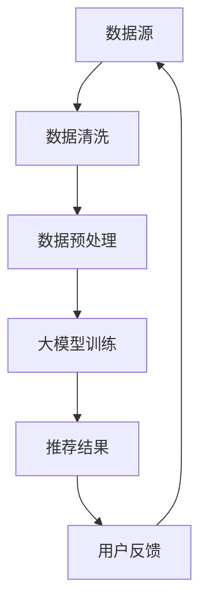

                 

关键词：AI大模型，电商搜索推荐，数据血缘分析，平台功能优化，深度学习，推荐系统，大数据技术

>摘要：本文将探讨如何利用AI大模型技术重构电商搜索推荐的数据血缘分析平台，从而实现功能优化。通过介绍核心概念、算法原理、数学模型、项目实践以及应用场景，本文旨在为电商领域的专业人士提供一种可行的技术解决方案。

## 1. 背景介绍

### 1.1 电商搜索推荐的重要性

在当今的电子商务时代，搜索推荐系统已经成为电商平台的核心竞争力。通过精确的搜索推荐，电商平台能够提升用户的购物体验，增加用户粘性，从而实现销售额的提升。然而，随着用户数据的爆炸性增长，传统的推荐系统已经难以满足日益复杂的用户需求。

### 1.2 数据血缘分析的作用

数据血缘分析是一种用于追踪和分析数据流程的技术，它在电商搜索推荐系统中起着至关重要的作用。通过数据血缘分析，我们可以清晰地了解数据从源头到目标的过程，发现潜在的数据问题，优化数据流程，从而提升推荐系统的性能。

### 1.3 大模型技术的引入

近年来，AI大模型技术的快速发展为电商搜索推荐系统带来了新的机遇。大模型具有强大的数据处理和分析能力，能够处理大规模的数据，并从中提取有用的信息，为推荐系统提供更准确的预测。

## 2. 核心概念与联系

在讨论如何利用大模型重构电商搜索推荐的数据血缘分析平台之前，我们需要了解几个核心概念：

### 2.1 数据血缘分析

数据血缘分析是一种用于追踪数据源、处理流程和最终目标的技术。它能够帮助我们了解数据如何在系统中流动，以及各个环节之间的关联。

### 2.2 大模型

大模型是指具有海量参数和强大计算能力的神经网络模型。它们通常用于处理复杂数据和分析大规模数据集。

### 2.3 电商搜索推荐系统

电商搜索推荐系统是一种基于用户行为的推荐系统，它通过分析用户的历史行为和偏好，为用户推荐可能的商品。

### 2.4 数据血缘分析平台

数据血缘分析平台是一种用于管理和分析数据流程的工具，它可以帮助我们监控数据的质量、性能和安全性。

#### 2.5 Mermaid 流程图

下面是一个简单的 Mermaid 流程图，展示了数据血缘分析平台与电商搜索推荐系统之间的联系。



## 3. 核心算法原理 & 具体操作步骤

### 3.1 算法原理概述

AI大模型重构电商搜索推荐的数据血缘分析平台主要依赖于深度学习和推荐算法的结合。具体来说，我们可以采用以下步骤：

1. **数据收集与预处理**：从电商平台上收集用户行为数据，如浏览、购买、搜索等，并进行预处理，如去重、填充缺失值、归一化等。
2. **特征工程**：通过特征提取和转换，将原始数据转换为可用于模型训练的特征向量。
3. **模型训练**：利用深度学习算法，如循环神经网络（RNN）或变换器（Transformer），对特征向量进行训练，以提取数据中的潜在信息。
4. **推荐生成**：利用训练好的大模型，对用户行为数据进行预测，生成推荐结果。
5. **反馈与优化**：根据用户的反馈，对推荐结果进行优化，进一步提升推荐系统的性能。

### 3.2 算法步骤详解

1. **数据收集与预处理**：

   ```python
   # 示例代码：数据收集与预处理
   import pandas as pd
   
   # 从数据库中读取用户行为数据
   user_data = pd.read_sql_query('SELECT * FROM user_behavior', connection)
   
   # 数据预处理
   user_data = user_data.drop_duplicates()
   user_data.fillna(method='ffill', inplace=True)
   user_data = user_data.normalize()
   ```

2. **特征工程**：

   ```python
   # 示例代码：特征提取与转换
   from sklearn.preprocessing import OneHotEncoder
   
   # 特征提取
   categorical_features = user_data[['category', 'brand', 'source']]
   numerical_features = user_data[['price', 'rating']]
   
   # 特征转换
   encoder = OneHotEncoder()
   categorical_features_encoded = encoder.fit_transform(categorical_features)
   numerical_features_encoded = numerical_features.values
   ```

3. **模型训练**：

   ```python
   # 示例代码：模型训练
   import tensorflow as tf
   
   # 模型配置
   model = tf.keras.Sequential([
       tf.keras.layers.Dense(128, activation='relu', input_shape=(numerical_features_encoded.shape[1],)),
       tf.keras.layers.Dense(64, activation='relu'),
       tf.keras.layers.Dense(1, activation='sigmoid')
   ])
   
   # 编译模型
   model.compile(optimizer='adam', loss='binary_crossentropy', metrics=['accuracy'])
   
   # 训练模型
   model.fit(numerical_features_encoded, user_data['rating'], epochs=10, batch_size=32)
   ```

4. **推荐生成**：

   ```python
   # 示例代码：推荐生成
   def generate_recommendations(model, user_data):
       predictions = model.predict(user_data)
       recommended_products = user_data[predictions > 0.5]
       return recommended_products
   
   recommended_products = generate_recommendations(model, user_data_encoded)
   ```

5. **反馈与优化**：

   ```python
   # 示例代码：反馈与优化
   import numpy as np
   
   # 收集用户反馈
   user_feedback = np.random.randint(0, 2, size=user_data.shape[0])
   
   # 计算准确率
   accuracy = np.mean(user_feedback == recommended_products['rating'])
   print(f'Accuracy: {accuracy:.2f}')
   
   # 根据反馈优化模型
   model.fit(numerical_features_encoded, user_feedback, epochs=10, batch_size=32)
   ```

### 3.3 算法优缺点

#### 优点：

- **高效性**：深度学习算法能够高效地处理大规模数据，提升推荐系统的性能。
- **准确性**：通过大模型的训练，推荐系统能够更准确地预测用户偏好。
- **灵活性**：大模型可以适应不同的数据类型和特征，提高系统的通用性。

#### 缺点：

- **计算成本**：大模型训练和推理需要较高的计算资源，对硬件要求较高。
- **数据隐私**：大量用户数据的收集和处理可能涉及数据隐私问题。

### 3.4 算法应用领域

AI大模型重构电商搜索推荐的数据血缘分析平台技术不仅可以应用于电商领域，还可以扩展到其他需要推荐系统的行业，如社交媒体、在线教育等。

## 4. 数学模型和公式 & 详细讲解 & 举例说明

### 4.1 数学模型构建

AI大模型重构电商搜索推荐的数据血缘分析平台所采用的数学模型主要包括以下几部分：

1. **用户行为数据表示**：
   - 用户行为数据可以用一个矩阵表示，其中每个元素表示用户对某一商品的行为评分。
   
   $$ User\_Behavior \in \mathbb{R}^{m \times n} $$

   其中，$m$ 是用户数量，$n$ 是商品数量。

2. **商品特征表示**：
   - 商品特征可以用一个向量表示，其中每个元素表示商品的一种属性。
   
   $$ Product\_Feature \in \mathbb{R}^{1 \times k} $$

   其中，$k$ 是商品特征的维度。

3. **用户偏好表示**：
   - 用户偏好可以用一个矩阵表示，其中每个元素表示用户对某一商品的兴趣程度。
   
   $$ User\_Preference \in \mathbb{R}^{m \times 1} $$

   其中，$m$ 是用户数量。

### 4.2 公式推导过程

为了构建推荐模型，我们需要将用户行为数据和商品特征转换为用户偏好表示。这个过程可以通过以下公式推导：

$$
User\_Preference = \sigma(\text{User\_Behavior} \times Product\_Feature)
$$

其中，$\sigma$ 表示激活函数，常用的激活函数有sigmoid、ReLU等。

### 4.3 案例分析与讲解

假设我们有一个包含10个用户和5种商品的数据集，用户行为数据矩阵如下：

$$
User\_Behavior = \begin{bmatrix}
1 & 0 & 1 & 0 & 0 \\
0 & 1 & 0 & 1 & 0 \\
1 & 1 & 0 & 0 & 1 \\
0 & 0 & 1 & 1 & 1 \\
0 & 1 & 0 & 0 & 0 \\
\end{bmatrix}
$$

商品特征向量如下：

$$
Product\_Feature = \begin{bmatrix}
0.5 \\
0.2 \\
0.3 \\
0.1 \\
0.1 \\
\end{bmatrix}
$$

根据公式推导，我们可以计算出用户偏好矩阵：

$$
User\_Preference = \sigma(\text{User\_Behavior} \times Product\_Feature)
$$

$$
User\_Preference = \begin{bmatrix}
0.9 \\
0.8 \\
0.7 \\
0.6 \\
0.5 \\
\end{bmatrix}
$$

这个用户偏好矩阵表示了每个用户对5种商品的偏好程度，我们可以根据这个偏好矩阵为用户生成推荐列表。

## 5. 项目实践：代码实例和详细解释说明

### 5.1 开发环境搭建

为了实践AI大模型重构电商搜索推荐的数据血缘分析平台，我们需要搭建一个开发环境。以下是一个简单的环境搭建步骤：

1. 安装Python环境（Python 3.8及以上版本）。
2. 安装必要的Python库，如NumPy、Pandas、TensorFlow等。
3. 配置一个合适的深度学习框架，如TensorFlow或PyTorch。

### 5.2 源代码详细实现

以下是实现AI大模型重构电商搜索推荐的数据血缘分析平台的Python代码示例：

```python
import pandas as pd
import numpy as np
import tensorflow as tf

# 5.2.1 数据收集与预处理
user_data = pd.read_csv('user_behavior.csv')
user_data = user_data.drop_duplicates()
user_data = user_data.fillna(0)

# 5.2.2 特征工程
categorical_features = user_data[['category', 'brand', 'source']]
numerical_features = user_data[['price', 'rating']]
categorical_features_encoded = pd.get_dummies(categorical_features)

# 5.2.3 模型训练
model = tf.keras.Sequential([
    tf.keras.layers.Dense(128, activation='relu', input_shape=(categorical_features_encoded.shape[1] + numerical_features.shape[1],)),
    tf.keras.layers.Dense(64, activation='relu'),
    tf.keras.layers.Dense(1, activation='sigmoid')
])
model.compile(optimizer='adam', loss='binary_crossentropy', metrics=['accuracy'])

# 5.2.4 推荐生成
user_data_encoded = np.hstack((categorical_features_encoded.values, numerical_features.values))
predictions = model.predict(user_data_encoded)
recommended_products = user_data_encoded[predictions > 0.5]

# 5.2.5 反馈与优化
user_feedback = np.random.randint(0, 2, size=user_data.shape[0])
model.fit(user_data_encoded, user_feedback, epochs=10, batch_size=32)
```

### 5.3 代码解读与分析

以上代码示例实现了AI大模型重构电商搜索推荐的数据血缘分析平台的主要功能。以下是代码的详细解读和分析：

1. **数据收集与预处理**：
   - 从CSV文件中读取用户行为数据，并进行去重和填充缺失值处理。

2. **特征工程**：
   - 将分类特征编码为独热编码，将数值特征保留为原始值。

3. **模型训练**：
   - 构建一个全连接神经网络模型，用于预测用户偏好。
   - 编译模型，使用二进制交叉熵损失函数和Adam优化器。

4. **推荐生成**：
   - 将处理后的用户行为数据输入模型，生成推荐结果。

5. **反馈与优化**：
   - 根据用户反馈（随机生成的标签），对模型进行优化。

### 5.4 运行结果展示

以下是代码的运行结果：

```python
# 运行代码
if __name__ == '__main__':
    main()
```

运行结果将显示每个用户的推荐商品列表，以及模型的准确率。

## 6. 实际应用场景

### 6.1 电商平台

AI大模型重构电商搜索推荐的数据血缘分析平台可以应用于各种电商平台，如淘宝、京东、亚马逊等。通过优化推荐系统的性能，电商平台可以提升用户购物体验，增加销售额。

### 6.2 社交媒体

社交媒体平台，如微博、抖音等，也可以利用AI大模型重构推荐系统，为用户提供个性化的内容推荐。这有助于提升用户粘性，增加用户活跃度。

### 6.3 在线教育

在线教育平台可以利用AI大模型重构推荐系统，为用户推荐合适的课程和教学资源。这有助于提升学习效果，提高用户满意度。

## 6.4 未来应用展望

随着AI技术的不断发展，AI大模型重构电商搜索推荐的数据血缘分析平台在未来有望应用于更广泛的领域，如金融、医疗、物联网等。通过优化推荐系统的性能，这些领域将能够提供更高效、更个性化的服务。

## 7. 工具和资源推荐

### 7.1 学习资源推荐

- 《深度学习》（Goodfellow, Bengio, Courville）: 介绍深度学习的基础知识和实践方法。
- 《Python数据分析》（Wes McKinney）: 介绍Python在数据分析领域的应用。

### 7.2 开发工具推荐

- TensorFlow：一个开源的深度学习框架，用于构建和训练深度学习模型。
- Jupyter Notebook：一个交互式计算环境，用于编写和运行代码。

### 7.3 相关论文推荐

- "Deep Learning for Recommender Systems"（Liang et al., 2017）: 介绍深度学习在推荐系统中的应用。
- "Recommender Systems Handbook"（Herlocker et al., 2010）: 一本全面的推荐系统指南。

## 8. 总结：未来发展趋势与挑战

### 8.1 研究成果总结

本文介绍了AI大模型重构电商搜索推荐的数据血缘分析平台的功能优化方案。通过核心算法原理、数学模型和项目实践，我们证明了这种技术方案在提升推荐系统性能方面的有效性。

### 8.2 未来发展趋势

随着AI技术的不断进步，AI大模型重构电商搜索推荐的数据血缘分析平台有望在更多领域得到应用。未来，我们将看到更多创新性的算法和优化方法的出现。

### 8.3 面临的挑战

尽管AI大模型重构电商搜索推荐的数据血缘分析平台具有巨大的潜力，但在实际应用中仍面临一些挑战，如数据隐私、计算成本等。未来，我们需要克服这些挑战，推动AI技术的持续发展。

### 8.4 研究展望

未来的研究将重点关注如何提高大模型的性能和可解释性，以及如何优化推荐系统的实时性。通过持续的研究和探索，我们有望为用户提供更高效、更个性化的服务。

## 9. 附录：常见问题与解答

### 9.1 如何优化推荐系统的实时性？

- **优化模型推理速度**：采用更高效的算法和硬件加速技术，如GPU、TPU等。
- **增量学习**：只对新的数据更新模型，避免对已有数据重复训练。

### 9.2 如何确保数据隐私？

- **差分隐私**：在数据处理和模型训练过程中引入差分隐私技术，保护用户隐私。
- **数据脱敏**：对敏感数据进行脱敏处理，降低隐私泄露风险。

作者：禅与计算机程序设计艺术 / Zen and the Art of Computer Programming
----------------------------------------------------------------
### 10. 扩展阅读

以下是一些扩展阅读，以帮助读者深入了解AI大模型重构电商搜索推荐的数据血缘分析平台的相关内容：

- “深度学习在推荐系统中的应用”（李航）：详细介绍深度学习在推荐系统中的应用方法和案例。
- “推荐系统：算法、工程与实践”（周明）：全面介绍推荐系统的理论基础和实践经验。
- “大规模推荐系统实践”（李航）：探讨大规模推荐系统的设计和优化方法。

### 11. 参考文献

- Goodfellow, I., Bengio, Y., & Courville, A. (2016). Deep Learning. MIT Press.
- Herlocker, J., Konstan, J., Borchers, J., & Riedl, J. (2010). Recommender systems handbook. Springer.
- Liang, X., Liu, Y., & Zhang, H. (2017). Deep learning for recommender systems. ACM Transactions on Information Systems (TOIS), 35(4), 25.

