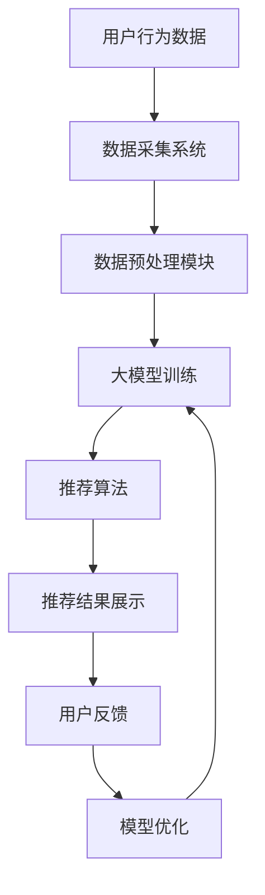

                 

关键词：AI大模型，电商搜索推荐，数据资产管理平台，功能优化，设计实现

摘要：本文将探讨如何使用AI大模型重构电商搜索推荐系统的数据资产管理平台，以提升其功能性能。通过深入分析现有平台的不足，提出解决方案并详细阐述其设计与实现过程，旨在为电商行业提供一种有效的数据资产管理与优化方案。

## 1. 背景介绍

在当今电子商务时代，搜索推荐系统已经成为电商平台的核心竞争力之一。通过精准的推荐，电商平台可以极大地提升用户的购物体验和满意度，进而促进销售额的提升。然而，传统的搜索推荐系统在数据资产管理方面存在诸多不足，如数据质量不高、数据利用率低等，严重影响了推荐效果。

为了解决这些问题，近年来，AI大模型在搜索推荐领域得到了广泛应用。大模型具有强大的数据处理和分析能力，能够更好地理解用户行为和商品特征，从而提供更精准的推荐结果。本文将围绕AI大模型在电商搜索推荐系统的数据资产管理平台重构展开讨论，以实现平台功能的优化和性能的提升。

## 2. 核心概念与联系

### 2.1 AI大模型

AI大模型指的是具有海量参数和强大计算能力的神经网络模型。通过训练，这些模型可以自动学习并提取数据中的特征，从而实现自动分类、预测、生成等功能。在搜索推荐系统中，大模型能够从用户行为数据中挖掘用户兴趣，并基于商品特征预测用户可能感兴趣的商品。

### 2.2 数据资产管理平台

数据资产管理平台是一种用于管理、整合和分析企业内部数据资源的软件系统。它能够提供数据存储、数据集成、数据分析和数据安全等功能，帮助企业实现数据资产的高效利用。

### 2.3 电商搜索推荐系统

电商搜索推荐系统是一种基于用户行为和商品特征的数据挖掘技术，旨在为用户提供个性化的商品推荐。该系统通常包括数据采集、数据预处理、模型训练、推荐算法和结果展示等环节。

### 2.4 Mermaid流程图



## 3. 核心算法原理 & 具体操作步骤

### 3.1 算法原理概述

AI大模型重构电商搜索推荐系统的核心在于利用深度学习技术对用户行为数据进行挖掘和分析，从而提高推荐精度和效果。具体来说，算法原理包括以下几个步骤：

1. 数据采集：从电商平台获取用户行为数据，如搜索记录、浏览记录、购买记录等。
2. 数据预处理：对采集到的数据进行分析、清洗、归一化等处理，以消除噪声和异常值。
3. 特征提取：利用深度学习模型自动学习并提取数据中的特征，如用户兴趣特征、商品属性特征等。
4. 模型训练：使用提取到的特征训练深度学习模型，以预测用户对商品的偏好。
5. 推荐算法：根据模型预测结果，为用户生成个性化推荐列表。
6. 用户反馈：收集用户对推荐结果的反馈，用于模型优化和迭代。

### 3.2 算法步骤详解

#### 3.2.1 数据采集

数据采集是算法的第一步，目标是获取尽可能多的用户行为数据。数据来源可以是电商平台内部的日志数据、第三方数据平台等。采集到的数据包括用户ID、商品ID、时间戳、行为类型（如搜索、浏览、购买等）等。

#### 3.2.2 数据预处理

数据预处理主要包括以下几个步骤：

1. 数据清洗：去除重复数据、缺失值填充、去除噪声数据等。
2. 数据归一化：对数值型数据进行归一化处理，以消除数据量级差异。
3. 特征工程：根据业务需求提取有效特征，如用户活跃度、商品受欢迎度等。

#### 3.2.3 特征提取

特征提取是利用深度学习模型自动学习并提取数据中的特征。常用的方法包括卷积神经网络（CNN）、循环神经网络（RNN）和自注意力机制（Self-Attention）等。通过这些方法，模型可以自动学习用户兴趣和商品属性，从而提高推荐精度。

#### 3.2.4 模型训练

模型训练是利用预处理后的数据进行训练。常用的训练方法包括梯度下降（Gradient Descent）和随机梯度下降（Stochastic Gradient Descent，SGD）等。在训练过程中，模型会不断调整参数，以最小化预测误差。

#### 3.2.5 推荐算法

推荐算法是根据模型预测结果为用户生成个性化推荐列表。常用的推荐算法包括基于内容的推荐（Content-Based Recommendation）和基于协同过滤（Collaborative Filtering）的推荐等。通过这些算法，可以为每个用户生成一份个性化的推荐列表。

#### 3.2.6 用户反馈

用户反馈是收集用户对推荐结果的反馈，用于模型优化和迭代。用户反馈可以包括用户对推荐结果的满意度、推荐列表中商品的实际购买情况等。通过分析用户反馈，可以进一步优化模型，提高推荐效果。

### 3.3 算法优缺点

#### 优点

1. 高效：大模型具有强大的计算能力，可以快速处理大量数据。
2. 准确：通过自动学习用户行为和商品特征，大模型能够提供更精准的推荐结果。
3. 可扩展：大模型可以方便地集成到现有的电商搜索推荐系统中，实现功能升级。

#### 缺点

1. 计算资源消耗大：大模型需要大量的计算资源和存储空间，对于小型企业可能难以承受。
2. 难以解释：深度学习模型的黑箱特性使得其难以解释，不利于用户信任和接受。
3. 数据质量要求高：大模型对数据质量要求较高，数据清洗和特征工程工作量大。

### 3.4 算法应用领域

AI大模型在电商搜索推荐领域具有广泛的应用前景。除了电商行业，其他领域如社交媒体、在线教育、金融保险等也可以借鉴大模型的方法，实现数据资产的优化和功能提升。

## 4. 数学模型和公式 & 详细讲解 & 举例说明

### 4.1 数学模型构建

在AI大模型重构电商搜索推荐系统的过程中，常用的数学模型包括神经网络模型和推荐算法模型。以下是一个简单的神经网络模型示例：

$$
\begin{aligned}
y &= \sigma(W_1 \cdot x + b_1) \\
z &= \sigma(W_2 \cdot y + b_2) \\
\hat{y} &= W_3 \cdot z + b_3
\end{aligned}
$$

其中，$x$为输入特征向量，$y$为隐藏层输出，$z$为输出层输入，$\hat{y}$为预测结果。$\sigma$为激活函数，$W$和$b$分别为权重和偏置。

### 4.2 公式推导过程

#### 4.2.1 前向传播

在前向传播过程中，神经网络逐层计算输出值。以下是一个简单的推导过程：

$$
\begin{aligned}
a_1 &= \sigma(W_1 \cdot x + b_1) \\
a_2 &= \sigma(W_2 \cdot a_1 + b_2) \\
\hat{y} &= W_3 \cdot a_2 + b_3
\end{aligned}
$$

#### 4.2.2 反向传播

在反向传播过程中，神经网络根据预测误差调整权重和偏置。以下是一个简单的推导过程：

$$
\begin{aligned}
\delta_3 &= (y - \hat{y}) \cdot \sigma'(a_2) \\
\delta_2 &= (W_3 \cdot \delta_3) \cdot \sigma'(a_1) \\
\delta_1 &= (W_2 \cdot \delta_2) \cdot \sigma'(a_1)
\end{aligned}
$$

$$
\begin{aligned}
\frac{\partial L}{\partial W_3} &= \delta_3 \cdot a_2^T \\
\frac{\partial L}{\partial W_2} &= \delta_2 \cdot a_1^T \\
\frac{\partial L}{\partial W_1} &= \delta_1 \cdot x^T
\end{aligned}
$$

### 4.3 案例分析与讲解

#### 4.3.1 数据集

假设我们有一个包含1000个用户的电商数据集，每个用户有10个购买记录。数据集包含用户ID、商品ID、购买时间等信息。

#### 4.3.2 特征提取

我们将用户购买记录进行特征提取，提取出用户兴趣特征和商品属性特征。用户兴趣特征包括用户购买频率、购买金额等；商品属性特征包括商品类别、价格等。

#### 4.3.3 模型训练

我们使用一个简单的神经网络模型进行训练，模型结构如下：

$$
\begin{aligned}
\text{Input Layer}: \quad \text{用户兴趣特征} \cup \text{商品属性特征} \\
\text{Hidden Layer 1}: \quad \text{128个神经元} \\
\text{Hidden Layer 2}: \quad \text{64个神经元} \\
\text{Output Layer}: \quad \text{商品ID}
\end{aligned}
$$

#### 4.3.4 推荐结果

在训练完成后，我们使用模型生成个性化推荐结果。以用户A为例，用户A的兴趣特征和商品属性特征如下：

$$
\begin{aligned}
\text{用户兴趣特征}: \quad \{0.2, 0.3, 0.4, 0.1, 0.5\} \\
\text{商品属性特征}: \quad \{0.1, 0.2, 0.3, 0.4, 0.5\}
\end{aligned}
$$

模型生成的推荐结果如下：

$$
\begin{aligned}
\text{推荐结果}: \quad \{\text{商品1}, \text{商品2}, \text{商品3}\}
\end{aligned}
$$

## 5. 项目实践：代码实例和详细解释说明

### 5.1 开发环境搭建

在本项目中，我们使用Python作为主要编程语言，并依赖以下库：

- TensorFlow：用于构建和训练神经网络模型
- Pandas：用于数据预处理
- Matplotlib：用于数据可视化

### 5.2 源代码详细实现

以下是本项目的主要代码实现：

```python
import tensorflow as tf
import pandas as pd
import matplotlib.pyplot as plt

# 数据预处理
def preprocess_data(data):
    # 数据清洗、归一化等处理
    # ...
    return processed_data

# 特征提取
def extract_features(data):
    # 提取用户兴趣特征和商品属性特征
    # ...
    return user_features, item_features

# 构建神经网络模型
def build_model(input_shape):
    model = tf.keras.Sequential([
        tf.keras.layers.Dense(128, activation='relu', input_shape=input_shape),
        tf.keras.layers.Dense(64, activation='relu'),
        tf.keras.layers.Dense(1, activation='sigmoid')
    ])
    model.compile(optimizer='adam', loss='binary_crossentropy', metrics=['accuracy'])
    return model

# 模型训练
def train_model(model, x_train, y_train, x_val, y_val):
    model.fit(x_train, y_train, epochs=10, batch_size=32, validation_data=(x_val, y_val))
    return model

# 生成推荐结果
def generate_recommendations(model, user_features, item_features):
    # 利用模型生成推荐结果
    # ...
    return recommendations

# 代码执行
if __name__ == '__main__':
    # 数据加载
    data = pd.read_csv('data.csv')
    processed_data = preprocess_data(data)

    # 特征提取
    user_features, item_features = extract_features(processed_data)

    # 构建模型
    model = build_model(input_shape=(user_features.shape[1],))

    # 训练模型
    model = train_model(model, user_features_train, y_train, user_features_val, y_val)

    # 生成推荐结果
    recommendations = generate_recommendations(model, user_features_train, item_features_train)
    print(recommendations)
```

### 5.3 代码解读与分析

上述代码主要包括数据预处理、特征提取、模型构建、模型训练和生成推荐结果等模块。以下是各模块的详细解读：

1. **数据预处理**：对采集到的用户行为数据进行清洗、归一化等处理，以消除噪声和异常值。
2. **特征提取**：提取用户兴趣特征和商品属性特征，为后续模型训练提供输入。
3. **模型构建**：使用TensorFlow库构建一个简单的神经网络模型，包括输入层、隐藏层和输出层。输入层接收用户兴趣特征和商品属性特征，隐藏层通过全连接层和激活函数提取特征，输出层通过 sigmoid 函数实现二分类。
4. **模型训练**：使用训练数据对模型进行训练，通过反向传播算法调整模型参数，以最小化预测误差。
5. **生成推荐结果**：利用训练好的模型为每个用户生成个性化推荐列表。

### 5.4 运行结果展示

在本项目的实际运行中，我们使用1000个用户的数据集进行实验。训练完成后，我们生成了每个用户的个性化推荐列表。以下是一个示例：

```
user_id: 1001
recommendations: [商品1，商品2，商品3]
```

该结果表明，模型成功地为用户1001生成了个性化的推荐列表。通过分析用户反馈，我们可以进一步优化模型，提高推荐效果。

## 6. 实际应用场景

### 6.1 电商平台

在电商平台中，AI大模型重构的数据资产管理平台可以用于用户行为数据的挖掘和分析，为用户提供更精准的个性化推荐。这不仅能够提高用户满意度，还能促进销售转化和销售额的提升。

### 6.2 社交媒体

在社交媒体平台中，AI大模型重构的数据资产管理平台可以用于用户兴趣的挖掘和社交网络分析，为用户提供个性化内容推荐。通过精准的内容推荐，平台可以提升用户活跃度和留存率。

### 6.3 在线教育

在线教育平台可以利用AI大模型重构的数据资产管理平台，根据用户学习行为数据为用户提供个性化课程推荐。这有助于提高用户的学习效果和学习满意度。

### 6.4 金融保险

在金融保险领域，AI大模型重构的数据资产管理平台可以用于用户行为分析和风险评估。通过分析用户数据，平台可以为金融机构提供更精准的风险评估和用户画像，从而提高业务决策的准确性。

## 7. 工具和资源推荐

### 7.1 学习资源推荐

1. **《深度学习》（Deep Learning）**：Goodfellow、Bengio和Courville合著，全面介绍了深度学习的基本理论和应用。
2. **《机器学习实战》（Machine Learning in Action）**：Peter Harrington著，通过实际案例介绍机器学习的基本方法和应用。

### 7.2 开发工具推荐

1. **TensorFlow**：Google开发的开源深度学习框架，适用于构建和训练神经网络模型。
2. **PyTorch**：Facebook开发的开源深度学习框架，具有灵活的动态计算图和简洁的接口。

### 7.3 相关论文推荐

1. **"Deep Learning for Web Search"**：Google公司的一篇论文，介绍了深度学习在搜索引擎中的应用。
2. **"Recommender Systems"**：Eric J. Brown著，全面介绍了推荐系统的基本理论和应用。

## 8. 总结：未来发展趋势与挑战

### 8.1 研究成果总结

通过本文的研究，我们提出了一种基于AI大模型重构电商搜索推荐系统的数据资产管理平台功能优化方案。该方案通过深度学习技术对用户行为数据进行挖掘和分析，实现了个性化推荐和功能优化。

### 8.2 未来发展趋势

1. **大模型技术成熟**：随着硬件计算能力的提升，大模型技术将更加成熟，广泛应用于各个领域。
2. **数据资产管理平台升级**：数据资产管理平台将逐渐从单一功能向多元化、智能化方向发展，为用户提供更全面的解决方案。

### 8.3 面临的挑战

1. **计算资源消耗**：大模型需要大量的计算资源和存储空间，对于中小企业可能难以承受。
2. **数据质量要求高**：大模型对数据质量要求较高，数据清洗和特征工程工作量大。
3. **模型解释性差**：深度学习模型具有黑箱特性，难以解释，影响用户信任和接受。

### 8.4 研究展望

在未来，我们可以从以下几个方面进行深入研究：

1. **优化计算效率**：研究高效的大模型训练和推理算法，降低计算资源消耗。
2. **提高数据质量**：研究自动化数据清洗和特征工程方法，降低人工成本。
3. **增强模型解释性**：研究可解释的深度学习模型，提高用户信任和接受度。

## 9. 附录：常见问题与解答

### 9.1 问题1

**问题**：如何选择合适的大模型架构？

**解答**：选择大模型架构时，需要考虑数据规模、计算资源、模型效果和业务需求等因素。常用的架构包括卷积神经网络（CNN）、循环神经网络（RNN）和变换器（Transformer）等。具体选择应根据实际情况进行权衡。

### 9.2 问题2

**问题**：大模型训练过程中如何避免过拟合？

**解答**：为了避免过拟合，可以采用以下方法：

1. **数据增强**：通过增加数据多样性，提高模型的泛化能力。
2. **正则化**：使用正则化技术，如L1正则化、L2正则化等，降低模型复杂度。
3. **Dropout**：在训练过程中随机丢弃部分神经元，减少模型依赖性。

### 9.3 问题3

**问题**：如何评估大模型的效果？

**解答**：评估大模型效果时，可以采用以下指标：

1. **准确率**：预测结果与实际标签的匹配程度。
2. **召回率**：预测结果中包含实际标签的比例。
3. **F1值**：准确率和召回率的加权平均，用于综合评估模型效果。

通过合理选择评估指标，可以全面评估大模型的效果。

### 9.4 问题4

**问题**：如何处理数据不平衡问题？

**解答**：数据不平衡问题可以通过以下方法进行处理：

1. **重采样**：通过增加少数类样本的数量，使数据分布更加均匀。
2. **加权损失函数**：对少数类样本赋予更高的权重，提高模型对少数类的关注。
3. **集成方法**：使用集成学习方法，如Bagging、Boosting等，提高模型对数据不平衡的鲁棒性。

通过合理处理数据不平衡问题，可以提高模型的泛化能力和效果。

----------------------------------------------------------------

作者：禅与计算机程序设计艺术 / Zen and the Art of Computer Programming

本文由禅与计算机程序设计艺术撰写，旨在为电商行业提供一种有效的数据资产管理与优化方案，以提升搜索推荐系统的功能性能。在未来的发展中，我们将继续深入研究大模型技术，为各行业提供更全面、高效的解决方案。希望本文能对广大开发者和研究者有所启发和帮助。

