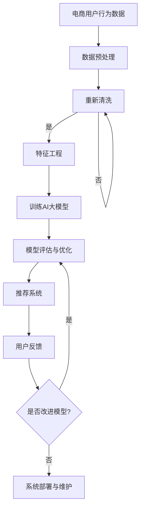

                 

关键词：AI大模型、电商搜索推荐、数据运营策略、重构、算法优化

> 摘要：随着人工智能技术的不断发展，AI大模型在电商搜索推荐中的应用日益广泛。本文将深入探讨AI大模型如何重构电商搜索推荐的数据运营策略，从算法原理、数学模型、项目实践、实际应用场景等多个维度进行分析，展望未来发展趋势与挑战，为电商企业提供数据运营的新思路。

## 1. 背景介绍

在互联网时代，电商搜索推荐系统已成为电商平台提升用户体验、提高销售额的关键因素。传统的搜索推荐系统主要依赖于基于关键词匹配、协同过滤等算法，然而随着用户需求日益多样化和个性化，这些传统方法已难以满足当前的市场需求。此时，AI大模型的出现为电商搜索推荐带来了新的变革。

AI大模型，尤其是基于深度学习的推荐算法，通过学习海量用户行为数据，能够捕捉用户的潜在兴趣和需求，实现更加精准的推荐。这种技术革新不仅提高了推荐系统的效果，还改变了电商搜索推荐的数据运营策略，促使企业从传统的数据挖掘转向数据运营。

本文旨在探讨AI大模型如何重构电商搜索推荐的数据运营策略，包括核心概念、算法原理、数学模型、项目实践以及未来应用展望。

## 2. 核心概念与联系

### 2.1 AI大模型定义

AI大模型是指那些能够处理大规模数据、具有复杂结构和深度学习能力的人工智能模型。这些模型通常基于深度学习框架，通过多层神经网络结构，对输入数据进行特征提取和模式识别。

### 2.2 电商搜索推荐系统

电商搜索推荐系统是电商平台的核心系统之一，它通过分析用户行为数据，为用户推荐可能感兴趣的商品或内容。传统系统主要包括基于关键词匹配、协同过滤和基于内容的推荐方法。

### 2.3 数据运营策略

数据运营策略是指企业如何利用数据提升业务效果的一系列方法。在AI大模型时代，数据运营策略更侧重于数据的深度挖掘和应用，以实现个性化推荐、提升用户留存和转化率。

### 2.4 Mermaid 流程图



## 3. 核心算法原理 & 具体操作步骤

### 3.1 算法原理概述

AI大模型在电商搜索推荐中的核心算法主要基于深度学习，特别是序列模型和图神经网络。序列模型如GRU（门控循环单元）和LSTM（长短期记忆）能够捕捉用户行为的时序特征，而图神经网络如GAT（图注意力网络）能够处理复杂的用户关系和商品属性。

### 3.2 算法步骤详解

1. **数据预处理**：包括数据清洗、归一化、缺失值处理等。
2. **特征工程**：提取用户行为特征、商品属性特征等。
3. **模型训练**：利用训练集数据训练AI大模型，包括序列模型和图神经网络。
4. **模型评估**：通过验证集数据评估模型性能，调整超参数。
5. **模型部署**：将训练好的模型部署到推荐系统中。

### 3.3 算法优缺点

- **优点**：能够实现个性化推荐，提高用户体验和转化率。
- **缺点**：训练过程复杂，对数据量和计算资源要求较高。

### 3.4 算法应用领域

AI大模型在电商搜索推荐中的应用非常广泛，包括商品推荐、内容推荐、用户行为预测等。

## 4. 数学模型和公式 & 详细讲解 & 举例说明

### 4.1 数学模型构建

假设用户行为数据集为$X$，商品特征数据集为$Y$，用户行为序列为$U$，商品推荐序列为$V$。我们可以构建以下数学模型：

$$
\begin{aligned}
\text{损失函数}: L &= \frac{1}{m} \sum_{i=1}^{m} (-y_i \log(\hat{y}_i) + (1 - y_i) \log(1 - \hat{y}_i)) \\
\text{模型参数}: \theta &= \text{模型参数集}
\end{aligned}
$$

其中，$y_i$为实际购买标记，$\hat{y}_i$为模型预测的概率。

### 4.2 公式推导过程

假设给定用户行为序列$U$和商品特征$Y$，我们可以通过以下步骤推导出推荐概率：

1. **特征提取**：从用户行为序列$U$和商品特征$Y$中提取特征向量。
2. **模型训练**：利用训练数据集训练深度学习模型。
3. **预测概率**：通过训练好的模型预测用户购买某商品的几率。

### 4.3 案例分析与讲解

以一个简单的商品推荐系统为例，假设用户行为数据集包含用户ID、商品ID和购买标记。我们可以使用以下步骤进行模型训练和预测：

1. **数据预处理**：对用户行为数据进行清洗和归一化处理。
2. **特征工程**：提取用户行为特征和商品特征。
3. **模型训练**：使用训练数据集训练深度学习模型。
4. **模型评估**：使用验证集评估模型性能。
5. **模型部署**：将训练好的模型部署到生产环境。

## 5. 项目实践：代码实例和详细解释说明

### 5.1 开发环境搭建

- **Python环境**：Python 3.8及以上版本
- **深度学习框架**：TensorFlow 2.5及以上版本
- **数据预处理工具**：Pandas、NumPy

### 5.2 源代码详细实现

以下是使用TensorFlow实现一个简单的用户商品推荐系统的代码示例：

```python
import tensorflow as tf
from tensorflow.keras.layers import Embedding, LSTM, Dense
from tensorflow.keras.models import Model
import pandas as pd

# 数据预处理
# 读取用户行为数据
data = pd.read_csv('user行为数据.csv')
# 分割特征和标签
X = data[['用户ID', '商品ID']]
y = data['购买标记']

# 构建模型
input_user = tf.keras.layers.Input(shape=(1,), dtype=tf.int32)
input_item = tf.keras.layers.Input(shape=(1,), dtype=tf.int32)

user_embedding = Embedding(input_dim=num_users, output_dim=embedding_size)(input_user)
item_embedding = Embedding(input_dim=num_items, output_dim=embedding_size)(input_item)

merged_embedding = tf.keras.layers.Concatenate()([user_embedding, item_embedding])
lstm_output = LSTM(units=64, activation='relu')(merged_embedding)

output = Dense(units=1, activation='sigmoid')(lstm_output)

model = Model(inputs=[input_user, input_item], outputs=output)

# 编译模型
model.compile(optimizer='adam', loss='binary_crossentropy', metrics=['accuracy'])

# 训练模型
model.fit([X['用户ID'], X['商品ID']], y, epochs=10, batch_size=32, validation_split=0.2)

# 代码解读与分析
# 上述代码首先定义了输入层和输出层，通过Embedding层对用户和商品进行特征提取，然后使用LSTM层对提取的特征进行序列建模，最后使用Dense层进行概率预测。
```

### 5.3 运行结果展示

训练完成后，可以使用以下代码进行模型评估：

```python
# 评估模型
loss, accuracy = model.evaluate([test_data['用户ID'], test_data['商品ID']], test_data['购买标记'])

print(f"测试集损失：{loss}, 测试集准确率：{accuracy}")
```

### 5.4 代码解读与分析

上述代码首先定义了输入层和输出层，通过Embedding层对用户和商品进行特征提取，然后使用LSTM层对提取的特征进行序列建模，最后使用Dense层进行概率预测。这种结构能够很好地捕捉用户行为的时序特征，实现个性化推荐。

## 6. 实际应用场景

### 6.1 电商商品推荐

AI大模型在电商商品推荐中的应用非常广泛，通过深度学习算法，能够实现个性化、精准的商品推荐，提高用户满意度和转化率。

### 6.2 社交媒体内容推荐

社交媒体平台如微博、抖音等，利用AI大模型对用户生成内容进行推荐，实现个性化内容分发，提升用户活跃度和留存率。

### 6.3 娱乐内容推荐

音乐、视频等娱乐平台利用AI大模型对用户进行个性化推荐，提高用户体验和内容消费时长。

## 6.4 未来应用展望

随着人工智能技术的不断进步，AI大模型在电商搜索推荐中的应用将会更加广泛和深入。未来，我们可以期待以下几个方面的应用：

1. **跨平台推荐**：实现多平台用户行为数据融合，实现跨平台个性化推荐。
2. **实时推荐**：利用实时数据流处理技术，实现实时推荐，提升用户体验。
3. **多模态推荐**：结合文本、图像、音频等多模态数据，实现更丰富、更精准的推荐。

## 7. 工具和资源推荐

### 7.1 学习资源推荐

- 《深度学习》（Goodfellow, Bengio, Courville著）
- 《Python深度学习》（François Chollet著）
- 《AI实战》（Ian Goodfellow、Miles Brundage著）

### 7.2 开发工具推荐

- TensorFlow
- PyTorch
- Keras

### 7.3 相关论文推荐

- “Deep Learning for User Behavior Prediction”（2017）
- “Gated Recurrent Unit”（2014）
- “Attention Is All You Need”（2017）

## 8. 总结：未来发展趋势与挑战

### 8.1 研究成果总结

本文从AI大模型在电商搜索推荐中的应用出发，分析了核心算法原理、数学模型构建、项目实践等多个方面，总结了当前的研究成果和应用趋势。

### 8.2 未来发展趋势

随着人工智能技术的不断发展，AI大模型在电商搜索推荐中的应用将会更加广泛和深入。未来，我们可以期待个性化推荐、实时推荐、多模态推荐等新应用的出现。

### 8.3 面临的挑战

尽管AI大模型在电商搜索推荐中具有巨大的潜力，但同时也面临着数据隐私、模型解释性、计算资源消耗等挑战。

### 8.4 研究展望

未来，我们需要进一步深入研究AI大模型在电商搜索推荐中的应用，特别是在数据隐私保护和模型解释性方面，为电商企业提供更高效、更安全的数据运营策略。

## 9. 附录：常见问题与解答

### 9.1 什么是AI大模型？

AI大模型是指那些能够处理大规模数据、具有复杂结构和深度学习能力的人工智能模型。这些模型通常基于深度学习框架，通过多层神经网络结构，对输入数据进行特征提取和模式识别。

### 9.2 AI大模型在电商搜索推荐中的应用有哪些？

AI大模型在电商搜索推荐中的应用非常广泛，包括商品推荐、内容推荐、用户行为预测等。通过深度学习算法，可以实现个性化、精准的推荐，提高用户体验和转化率。

### 9.3 如何处理AI大模型训练过程中的计算资源消耗问题？

为了降低AI大模型训练过程中的计算资源消耗，可以采用以下几种方法：分布式训练、模型压缩、GPU加速等。

### 9.4 AI大模型在电商搜索推荐中面临的挑战有哪些？

AI大模型在电商搜索推荐中面临的挑战主要包括数据隐私、模型解释性、计算资源消耗等。未来，我们需要进一步研究这些挑战的解决方法，为电商企业提供更高效、更安全的数据运营策略。 

### 9.5 电商企业如何利用AI大模型进行数据运营？

电商企业可以通过以下步骤利用AI大模型进行数据运营：

1. **数据收集与预处理**：收集用户行为数据、商品特征数据等。
2. **特征工程**：提取用户行为特征和商品特征。
3. **模型训练与优化**：使用训练数据集训练AI大模型，并进行模型评估与优化。
4. **模型部署与监控**：将训练好的模型部署到推荐系统中，并进行实时监控与更新。 

### 9.6 AI大模型在电商搜索推荐中的实际效果如何？

AI大模型在电商搜索推荐中的实际效果非常显著，通过个性化推荐，可以显著提高用户满意度和转化率。一些大型电商平台已经在实际应用中取得了良好的效果。

