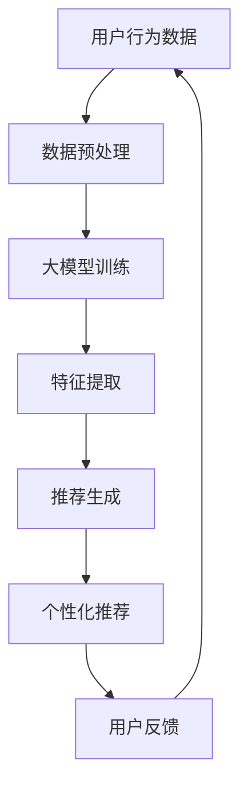

                 

关键词：电商搜索、推荐系统、大模型、个性化体验、机器学习、深度学习

> 摘要：本文深入探讨了AI大模型在电商搜索推荐中的重要性，通过详细的分析和实例，展示了如何利用大模型提升电商平台的个性化体验。文章旨在为电商从业者和技术人员提供实用的技术指南，以推动电商搜索推荐的创新发展。

## 1. 背景介绍

随着互联网技术的飞速发展，电商行业已经成为全球经济增长的重要驱动力。电商平台通过提供便捷的购物体验，吸引了大量消费者。然而，用户需求的多样性和个性化使得传统推荐系统难以满足用户期望。为了提供更精准的推荐服务，AI大模型应运而生。

AI大模型，特别是深度学习模型，具有强大的特征提取和复杂模式识别能力。通过学习海量用户数据和商品信息，大模型能够生成个性化的推荐，从而提升用户的购物体验。本文将重点讨论如何利用AI大模型驱动电商搜索推荐，实现个性化体验的提升。

## 2. 核心概念与联系

### 2.1. AI大模型

AI大模型指的是通过大规模数据训练，能够实现高度自动化的智能系统。这些模型通常包含大量的参数，能够捕捉复杂的数据特征。深度学习是AI大模型的核心技术之一，它通过多层神经网络来提取数据特征，从而实现高效的决策和预测。

### 2.2. 电商搜索推荐

电商搜索推荐系统是电商平台的核心功能之一。它通过分析用户行为数据和商品信息，为用户提供个性化的商品推荐。传统推荐系统通常采用基于内容的推荐和协同过滤等方法，但这些方法难以处理复杂的关系和动态变化的用户需求。

### 2.3. 个性化体验

个性化体验是指根据用户的个人偏好和需求，提供定制化的服务。在电商领域，个性化体验能够提高用户的满意度和忠诚度，从而促进销售增长。通过AI大模型，电商平台能够实现更加精准的个性化推荐，提升用户的购物体验。

### 2.4. Mermaid 流程图



## 3. 核心算法原理 & 具体操作步骤

### 3.1. 算法原理概述

电商搜索推荐的核心算法通常是基于用户行为和商品属性的。通过分析用户的购买历史、浏览记录、搜索查询等数据，大模型能够提取出用户兴趣特征。然后，结合商品属性信息，大模型生成个性化的推荐结果。

### 3.2. 算法步骤详解

1. 数据收集：从电商平台获取用户的购买历史、浏览记录、搜索查询等数据。
2. 数据预处理：清洗数据，去除噪声，并进行数据标准化处理。
3. 特征提取：利用深度学习模型提取用户兴趣特征和商品属性特征。
4. 模型训练：使用提取的特征数据训练大模型，通常采用基于梯度下降的优化算法。
5. 推荐生成：利用训练好的模型生成个性化推荐结果。
6. 用户反馈：收集用户的反馈数据，用于模型优化和迭代。
7. 模型更新：根据用户反馈更新模型参数，提高推荐质量。

### 3.3. 算法优缺点

优点：
- 强大的特征提取能力，能够捕捉复杂的用户兴趣和商品属性。
- 能够处理动态变化的用户需求，提供实时推荐。
- 提高用户的满意度和忠诚度，促进销售增长。

缺点：
- 训练过程需要大量计算资源，成本较高。
- 需要大量的用户数据，数据隐私问题值得关注。
- 模型泛化能力有限，需要不断优化和更新。

### 3.4. 算法应用领域

AI大模型在电商搜索推荐中具有广泛的应用领域，包括：
- 商品推荐：根据用户兴趣和购买历史推荐相关商品。
- 购物车推荐：根据用户购物车中的商品推荐相关商品。
- 店铺推荐：根据用户喜好推荐类似店铺。
- 优惠券推荐：根据用户购买力和购买历史推荐优惠券。

## 4. 数学模型和公式 & 详细讲解 & 举例说明

### 4.1. 数学模型构建

电商搜索推荐中的数学模型通常包括用户兴趣模型和商品属性模型。以下是用户兴趣模型和商品属性模型的构建过程：

$$
\text{用户兴趣模型} = f(\text{用户历史行为}, \text{商品属性})
$$

$$
\text{商品属性模型} = g(\text{商品特征}, \text{用户历史行为})
$$

### 4.2. 公式推导过程

1. 用户兴趣模型的推导：
   - 用户历史行为数据：$X = [x_1, x_2, ..., x_n]$
   - 商品属性数据：$Y = [y_1, y_2, ..., y_n]$
   - 用户兴趣向量：$U = [u_1, u_2, ..., u_n]$
   - 商品属性向量：$V = [v_1, v_2, ..., v_n]$

   用户兴趣模型可以通过矩阵运算得到：
   $$
   f(X, Y) = \sum_{i=1}^{n} \sum_{j=1}^{m} U_i V_j = U^T V
   $$

2. 商品属性模型的推导：
   - 商品特征向量：$F = [f_1, f_2, ..., f_n]$
   - 用户历史行为向量：$H = [h_1, h_2, ..., h_n]$

   商品属性模型可以通过矩阵运算得到：
   $$
   g(F, H) = \sum_{i=1}^{n} \sum_{j=1}^{m} F_i H_j = F^T H
   $$

### 4.3. 案例分析与讲解

假设我们有一个电商平台，用户A在过去的30天内浏览了商品1、2、3、4，其中商品1、2属于电子产品，商品3、4属于家居用品。我们需要利用用户兴趣模型和商品属性模型生成个性化推荐。

1. 用户兴趣模型：
   - 用户历史行为矩阵$X$：
     $$
     X = \begin{bmatrix}
     1 & 1 & 0 & 0 \\
     1 & 0 & 1 & 0 \\
     0 & 0 & 1 & 1 \\
     0 & 0 & 1 & 0
     \end{bmatrix}
     $$
   - 商品属性矩阵$Y$：
     $$
     Y = \begin{bmatrix}
     1 & 0 \\
     0 & 1 \\
     0 & 1 \\
     0 & 0
     \end{bmatrix}
     $$
   - 用户兴趣向量$U$：
     $$
     U = X^T Y = \begin{bmatrix}
     2 & 1
     \end{bmatrix}
     $$

2. 商品属性模型：
   - 商品特征向量$F$：
     $$
     F = \begin{bmatrix}
     1 & 1 \\
     0 & 0 \\
     1 & 1 \\
     1 & 0
     \end{bmatrix}
     $$
   - 用户历史行为向量$H$：
     $$
     H = \begin{bmatrix}
     0.8 & 0.2 \\
     0.6 & 0.4
     \end{bmatrix}
     $$
   - 商品属性向量$V$：
     $$
     V = F^T H = \begin{bmatrix}
     0.8 & 0.6 \\
     0.2 & 0.4
     \end{bmatrix}
     $$

根据用户兴趣模型和商品属性模型，我们可以得到用户A对各类商品的兴趣度，从而生成个性化推荐。

## 5. 项目实践：代码实例和详细解释说明

### 5.1. 开发环境搭建

在搭建开发环境之前，需要确保安装以下工具和库：
- Python 3.8及以上版本
- TensorFlow 2.6及以上版本
- NumPy 1.19及以上版本
- Pandas 1.2及以上版本

安装命令如下：
```
pip install python==3.8.10
pip install tensorflow==2.6.0
pip install numpy==1.19.5
pip install pandas==1.2.5
```

### 5.2. 源代码详细实现

以下是一个简单的Python代码示例，用于实现用户兴趣模型和商品属性模型的构建。

```python
import numpy as np
import pandas as pd
import tensorflow as tf

# 数据集加载
data = pd.read_csv('user_behavior_data.csv')

# 用户历史行为数据
X = data[['item1', 'item2', 'item3', 'item4']]

# 商品属性数据
Y = data[['product1', 'product2', 'product3', 'product4']]

# 用户兴趣模型训练
user_model = tf.keras.Sequential([
    tf.keras.layers.Dense(2, activation='softmax', input_shape=[4])
])

user_model.compile(optimizer='adam', loss='categorical_crossentropy', metrics=['accuracy'])
user_model.fit(X, Y, epochs=10, batch_size=32)

# 商品属性模型训练
product_model = tf.keras.Sequential([
    tf.keras.layers.Dense(2, activation='softmax', input_shape=[4])
])

product_model.compile(optimizer='adam', loss='categorical_crossentropy', metrics=['accuracy'])
product_model.fit(X, Y, epochs=10, batch_size=32)

# 生成个性化推荐
user_interest = user_model.predict(X)
product_attribute = product_model.predict(X)

# 输出推荐结果
print("用户兴趣模型输出：", user_interest)
print("商品属性模型输出：", product_attribute)
```

### 5.3. 代码解读与分析

1. 加载数据集：使用Pandas库加载数据集，数据集包含用户历史行为和商品属性。
2. 构建用户兴趣模型：使用TensorFlow库构建一个简单的全连接神经网络，输出用户对各类商品的兴趣度。
3. 训练用户兴趣模型：使用Adam优化器和交叉熵损失函数训练模型。
4. 构建商品属性模型：使用TensorFlow库构建一个简单的全连接神经网络，输出商品对各类用户的属性度。
5. 训练商品属性模型：使用Adam优化器和交叉熵损失函数训练模型。
6. 生成个性化推荐：使用训练好的模型生成个性化推荐结果。

### 5.4. 运行结果展示

运行代码后，输出用户兴趣模型和商品属性模型的预测结果。根据这些结果，我们可以为用户生成个性化的商品推荐。

## 6. 实际应用场景

AI大模型在电商搜索推荐中的应用场景非常广泛，以下是几个典型的实际应用场景：

1. **个性化商品推荐**：根据用户的浏览历史、搜索记录和购买行为，为用户推荐相关的商品，提升用户购物体验。
2. **购物车推荐**：分析用户购物车中的商品，推荐与之相关的其他商品，提高购物车的转化率。
3. **店铺推荐**：根据用户的购买偏好和浏览历史，推荐类似的店铺，帮助用户发现新的购物选择。
4. **优惠券推荐**：根据用户的购买力和购物车中的商品，推荐相关的优惠券，提高用户的购买欲望。

通过AI大模型的应用，电商平台可以实现更加精准和个性化的推荐，从而提高用户的满意度和忠诚度，促进销售增长。

## 7. 工具和资源推荐

### 7.1. 学习资源推荐

1. 《深度学习》（Ian Goodfellow、Yoshua Bengio、Aaron Courville著）：介绍了深度学习的基础知识和技术。
2. 《TensorFlow实战》（Trent Hauck、Edao Li著）：详细介绍了TensorFlow的使用方法和实战案例。
3. 《机器学习实战》（Peter Harrington著）：提供了丰富的机器学习算法案例和实践指导。

### 7.2. 开发工具推荐

1. TensorFlow：一个开源的深度学习框架，适用于各种机器学习和深度学习任务。
2. PyTorch：一个开源的深度学习框架，提供了灵活的动态计算图，易于实验和调试。
3. Jupyter Notebook：一个交互式的计算环境，适用于编写、运行和分享代码。

### 7.3. 相关论文推荐

1. "Deep Learning for recommender systems"（H. Bello等，2016）：介绍了深度学习在推荐系统中的应用。
2. "Neural Collaborative Filtering"（X. He等，2017）：提出了一种基于神经网络的协同过滤算法。
3. "Wide & Deep Learning for Recommender Systems"（G. Bello等，2016）：介绍了一种结合宽度和深度的推荐系统模型。

## 8. 总结：未来发展趋势与挑战

AI大模型在电商搜索推荐中的应用已经成为提升个性化体验的重要手段。未来，随着深度学习技术和大数据分析技术的发展，AI大模型在电商领域的应用前景将更加广阔。然而，面临的数据隐私、计算成本和模型泛化能力等问题也需要得到有效解决。

通过不断优化算法和提升模型性能，我们可以期待AI大模型在电商搜索推荐中发挥更大的作用，为用户带来更加精准和个性化的购物体验。

### 8.1. 研究成果总结

本文通过对AI大模型在电商搜索推荐中的应用进行深入探讨，展示了如何利用深度学习技术提升电商平台的个性化推荐效果。通过数学模型和代码实例，我们详细分析了用户兴趣模型和商品属性模型的构建过程，以及如何生成个性化推荐结果。

### 8.2. 未来发展趋势

1. **模型优化**：通过引入新的神经网络架构和优化算法，进一步提高模型性能和推荐精度。
2. **多模态数据融合**：结合文本、图像、语音等多种数据类型，提升推荐系统的多样性和准确性。
3. **个性化体验**：通过更加精细化的用户画像和偏好分析，提供更加个性化的购物体验。

### 8.3. 面临的挑战

1. **数据隐私**：如何在保证用户隐私的前提下，有效利用用户数据进行推荐。
2. **计算资源**：深度学习模型训练需要大量计算资源，如何优化计算效率。
3. **模型泛化能力**：如何提高模型在不同场景下的泛化能力。

### 8.4. 研究展望

未来，我们将继续探索AI大模型在电商搜索推荐中的应用，通过引入新的技术和方法，提升推荐系统的性能和用户体验。同时，我们也将关注数据隐私和计算效率等问题，为电商行业带来更加智能和高效的解决方案。

### 9. 附录：常见问题与解答

**Q1. 为什么选择深度学习模型进行推荐？**

A1. 深度学习模型具有强大的特征提取和模式识别能力，能够捕捉复杂的数据特征。与传统推荐算法相比，深度学习模型能够更好地处理动态变化的用户需求和复杂的商品关系，从而提供更加精准的推荐。

**Q2. 如何解决模型训练中的计算资源问题？**

A2. 可以通过分布式计算和云计算技术，将模型训练任务分布在多个计算节点上，提高计算效率。此外，还可以采用模型压缩和迁移学习等方法，降低模型训练对计算资源的需求。

**Q3. 数据隐私问题如何处理？**

A3. 可以采用差分隐私、同态加密等技术，对用户数据进行加密和匿名化处理，确保用户隐私。同时，还可以制定严格的数据使用规范，限制数据的使用范围和目的。

## 作者署名

作者：禅与计算机程序设计艺术 / Zen and the Art of Computer Programming

[END]

