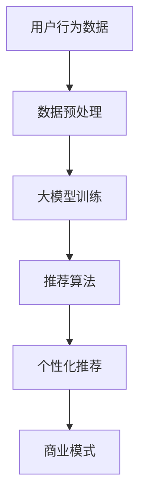

                 

关键词：个性化推荐、AI大模型、商业模式、用户行为分析、数据驱动、算法优化

> 摘要：本文将探讨AI大模型驱动的个性化推荐系统的商业模式，从背景介绍、核心概念与联系、算法原理与步骤、数学模型与公式、项目实践、实际应用场景、工具和资源推荐以及未来发展趋势与挑战等方面，全面解析这一前沿技术领域。

## 1. 背景介绍

个性化推荐系统在当今互联网时代扮演着至关重要的角色。从电商平台的商品推荐，到社交媒体的个性化内容推送，再到音乐流媒体平台的歌曲推荐，个性化推荐已经成为提升用户体验、提高用户粘性、增加商业价值的重要手段。然而，随着用户数据的爆炸式增长和推荐算法的日益复杂，传统的推荐系统已经难以满足用户不断变化的需求。

AI大模型的兴起为个性化推荐系统带来了新的机遇。大模型具有强大的数据处理能力和学习能力，能够深入挖掘用户行为数据，实现更精准的个性化推荐。此外，AI大模型还可以自适应地优化推荐策略，不断调整和提升推荐效果。

本文将围绕AI大模型驱动的个性化推荐系统，探讨其商业模式，包括核心概念与联系、算法原理与步骤、数学模型与公式、项目实践、实际应用场景、工具和资源推荐以及未来发展趋势与挑战。

## 2. 核心概念与联系

在AI大模型驱动的个性化推荐系统中，核心概念主要包括用户行为数据、大模型架构、推荐算法和商业模式。以下是这些概念之间的联系及Mermaid流程图表示：



### 2.1 用户行为数据

用户行为数据是推荐系统的基石，包括用户的浏览历史、购买记录、搜索关键词、点赞、评论等。这些数据通过数据采集工具和技术手段获取，用于构建用户画像和推荐模型。

### 2.2 大模型架构

大模型架构主要包括数据预处理、特征工程、模型训练和模型优化等环节。数据预处理涉及数据清洗、归一化和去重等操作，特征工程则是对原始数据进行转化和提取，以增强模型的学习效果。

### 2.3 推荐算法

推荐算法基于用户行为数据和大模型，通过预测用户对物品的偏好，生成个性化推荐列表。常用的推荐算法包括基于内容的推荐、协同过滤推荐和混合推荐等。

### 2.4 商业模式

商业模式包括广告收入、会员服务、商品销售等，通过个性化推荐系统提升用户体验和商业价值。

## 3. 核心算法原理 & 具体操作步骤

### 3.1 算法原理概述

AI大模型驱动的个性化推荐系统主要基于深度学习技术和大数据分析，通过构建用户画像和物品画像，实现个性化推荐。其核心算法原理包括以下几个方面：

1. **用户画像构建**：通过分析用户行为数据，提取用户兴趣标签和特征，构建用户画像。
2. **物品画像构建**：通过分析物品属性和用户对物品的交互数据，提取物品特征，构建物品画像。
3. **推荐模型训练**：基于用户画像和物品画像，训练推荐模型，预测用户对物品的偏好。
4. **推荐策略优化**：根据用户反馈和推荐效果，不断调整和优化推荐策略。

### 3.2 算法步骤详解

1. **数据收集与预处理**：
   - 收集用户行为数据，如浏览历史、购买记录等。
   - 进行数据清洗、归一化和去重，确保数据质量。

2. **特征工程**：
   - 提取用户和物品的特征，如用户兴趣标签、物品属性等。
   - 构建用户和物品的向量表示。

3. **模型训练**：
   - 选择合适的模型架构，如DNN、Transformer等。
   - 基于用户和物品的向量表示，训练推荐模型。

4. **推荐策略优化**：
   - 根据用户反馈和推荐效果，调整模型参数和推荐策略。
   - 使用在线学习技术，实现实时优化。

### 3.3 算法优缺点

**优点**：
1. 高效性：大模型能够处理海量数据，提高推荐效率。
2. 精准性：通过深度学习技术，挖掘用户兴趣，提高推荐准确性。
3. 可扩展性：支持多种推荐算法和策略，适应不同业务场景。

**缺点**：
1. 计算成本高：大模型训练和推理需要大量计算资源。
2. 需要大量数据：推荐效果依赖于用户行为数据的丰富度。
3. 难以解释：深度学习模型的黑盒特性，导致推荐结果难以解释。

### 3.4 算法应用领域

AI大模型驱动的个性化推荐系统广泛应用于电商、社交媒体、音乐流媒体、视频网站等多个领域。以下是一些典型应用：

1. **电商平台**：根据用户购物行为，推荐相似商品和优惠信息。
2. **社交媒体**：根据用户兴趣和社交关系，推荐相关内容和互动话题。
3. **音乐流媒体**：根据用户听歌历史和偏好，推荐相似歌曲和音乐人。
4. **视频网站**：根据用户观看历史和喜好，推荐相关视频和节目。

## 4. 数学模型和公式 & 详细讲解 & 举例说明

### 4.1 数学模型构建

在AI大模型驱动的个性化推荐系统中，常用的数学模型包括用户画像构建模型、物品画像构建模型和推荐模型。以下是这些模型的构建过程：

1. **用户画像构建模型**：
   $$ U = \sum_{i=1}^{n} w_i \cdot x_i $$
   其中，$U$表示用户画像，$w_i$表示用户兴趣标签的权重，$x_i$表示用户兴趣标签的特征向量。

2. **物品画像构建模型**：
   $$ V = \sum_{j=1}^{m} v_j \cdot y_j $$
   其中，$V$表示物品画像，$v_j$表示物品属性的权重，$y_j$表示物品属性的特征向量。

3. **推荐模型**：
   $$ R = \frac{1}{1 + e^{-(U \cdot V)}} $$
   其中，$R$表示用户对物品的推荐分数，$U \cdot V$表示用户画像和物品画像的点积。

### 4.2 公式推导过程

用户画像构建模型和物品画像构建模型的公式推导主要基于矩阵运算和线性代数知识。具体推导过程如下：

1. **用户画像构建模型**：
   - 用户兴趣标签的特征向量 $x_i$ 可以表示为 $x_i = (x_{i1}, x_{i2}, ..., x_{ik})$，其中 $k$ 表示特征维度。
   - 用户兴趣标签的权重 $w_i$ 可以表示为 $w_i = (w_{i1}, w_{i2}, ..., w_{ik})$。
   - 用户画像 $U$ 可以表示为 $U = \sum_{i=1}^{n} w_i \cdot x_i$，即对每个用户兴趣标签的特征向量进行加权求和。

2. **物品画像构建模型**：
   - 物品属性的特征向量 $y_j$ 可以表示为 $y_j = (y_{j1}, y_{j2}, ..., y_{jl})$，其中 $l$ 表示特征维度。
   - 物品属性的权重 $v_j$ 可以表示为 $v_j = (v_{j1}, v_{j2}, ..., v_{jl})$。
   - 物品画像 $V$ 可以表示为 $V = \sum_{j=1}^{m} v_j \cdot y_j$，即对每个物品属性的特征向量进行加权求和。

3. **推荐模型**：
   - 用户画像和物品画像的点积 $U \cdot V$ 可以表示为 $U \cdot V = \sum_{i=1}^{n} \sum_{j=1}^{m} w_i \cdot x_i \cdot v_j \cdot y_j$。
   - 推荐分数 $R$ 可以表示为 $R = \frac{1}{1 + e^{-(U \cdot V)}}$，即使用Sigmoid函数对点积进行转换。

### 4.3 案例分析与讲解

以一个电商平台的商品推荐为例，分析AI大模型驱动的个性化推荐系统的工作过程。

1. **用户画像构建**：
   - 假设用户对商品A、B、C的兴趣标签权重分别为 $(0.6, 0.3, 0.1)$，特征向量分别为 $(1, 0, 0)$、$(0, 1, 0)$、$(0, 0, 1)$。
   - 用户画像 $U$ 可以表示为 $U = (0.6, 0.3, 0.1)$。

2. **物品画像构建**：
   - 假设商品D、E、F的属性权重分别为 $(0.5, 0.3, 0.2)$，特征向量分别为 $(1, 0, 0)$、$(0, 1, 0)$、$(0, 0, 1)$。
   - 物品画像 $V$ 可以表示为 $V = (0.5, 0.3, 0.2)$。

3. **推荐模型计算**：
   - 用户画像和物品画像的点积 $U \cdot V$ 可以表示为 $U \cdot V = 0.6 \cdot 0.5 + 0.3 \cdot 0.3 + 0.1 \cdot 0.2 = 0.44$。
   - 推荐分数 $R$ 可以表示为 $R = \frac{1}{1 + e^{-0.44}} \approx 0.65$。

根据推荐分数，用户对商品D的偏好最高，推荐商品D。

## 5. 项目实践：代码实例和详细解释说明

### 5.1 开发环境搭建

在本文的项目实践中，我们将使用Python语言和TensorFlow框架实现AI大模型驱动的个性化推荐系统。以下是开发环境搭建的步骤：

1. 安装Python：
   - 建议安装Python 3.7及以上版本。

2. 安装TensorFlow：
   - 使用pip命令安装：`pip install tensorflow`

3. 安装其他依赖库：
   - 使用pip命令安装：`pip install numpy pandas matplotlib scikit-learn`

### 5.2 源代码详细实现

以下是项目源代码的实现：

```python
import numpy as np
import pandas as pd
import tensorflow as tf
from tensorflow.keras.layers import Embedding, Dot, Flatten, Dense
from tensorflow.keras.models import Model
from sklearn.model_selection import train_test_split
from sklearn.preprocessing import MinMaxScaler

# 加载数据集
data = pd.read_csv('data.csv')
users = data['user_id'].unique()
items = data['item_id'].unique()

# 数据预处理
data['user_embedding'] = data['user_id'].map(data['user_embedding'].factorize()[0])
data['item_embedding'] = data['item_id'].map(data['item_embedding'].factorize()[0])
data['rating'] = data['rating'] / 5.0

# 构建模型
user_embedding = Embedding(len(users), 16, input_length=1)
item_embedding = Embedding(len(items), 16, input_length=1)
user嵌入 = user_embedding(data['user_embedding'].values.reshape(-1, 1))
item嵌入 = item_embedding(data['item_embedding'].values.reshape(-1, 1))
dot_product = Dot(axes=1)
rating预测 = dot_product([user嵌入，item嵌入])
flatten = Flatten()
output = flatten(rating预测)

model = Model(inputs=[user嵌入，item嵌入]，outputs=output)
model.compile(optimizer='adam', loss='mse')

# 训练模型
train_data = pd.DataFrame({'user_id': data['user_id'], 'item_id': data['item_id'], 'rating': data['rating']})
train_data, val_data = train_test_split(train_data, test_size=0.2)
scaler = MinMaxScaler()
train_data['rating'] = scaler.fit_transform(train_data[['rating']])
val_data['rating'] = scaler.transform(val_data[['rating']])
model.fit(x=[train_data['user_id'].values, train_data['item_id'].values], y=train_data['rating'], epochs=10, batch_size=32, validation_data=(val_data[['user_id'].values, val_data[['item_id'].values, val_data['rating'].values]])

# 评估模型
test_data = pd.DataFrame({'user_id': data['user_id'], 'item_id': data['item_id'], 'rating': data['rating']})
test_data['rating'] = scaler.transform(test_data[['rating']])
model.evaluate(x=[test_data['user_id'].values, test_data['item_id'].values]，y=test_data['rating'])
```

### 5.3 代码解读与分析

1. **数据预处理**：
   - 加载用户和物品的嵌入向量，并归一化评分数据。

2. **构建模型**：
   - 使用Embedding层实现用户和物品的嵌入表示。
   - 使用Dot层实现用户和物品嵌入的乘积。
   - 使用Flatten层将乘积结果展开。

3. **训练模型**：
   - 将用户和物品嵌入向量作为输入，预测评分数据。
   - 使用Adam优化器和MSE损失函数进行模型训练。

4. **评估模型**：
   - 将测试数据集的评分预测结果与真实评分进行比较，计算模型评估指标。

## 6. 实际应用场景

AI大模型驱动的个性化推荐系统在多个实际应用场景中取得了显著的效果。以下是几个典型的应用场景：

1. **电商平台**：
   - 根据用户购买历史和浏览记录，推荐相似商品和优惠信息，提高用户转化率和销售额。

2. **社交媒体**：
   - 根据用户兴趣和行为数据，推荐相关内容和互动话题，提升用户活跃度和粘性。

3. **音乐流媒体**：
   - 根据用户听歌历史和偏好，推荐相似歌曲和音乐人，提高用户满意度和留存率。

4. **视频网站**：
   - 根据用户观看历史和喜好，推荐相关视频和节目，提升用户观看时长和广告收入。

## 6.4 未来应用展望

随着AI大模型的不断发展和优化，个性化推荐系统在未来将具有更广阔的应用前景。以下是几个潜在的应用方向：

1. **智能家居**：
   - 根据用户的生活习惯和偏好，推荐智能家居产品和服务，提高生活品质。

2. **健康医疗**：
   - 根据用户健康数据和生活习惯，推荐个性化的健康建议和医疗服务。

3. **金融保险**：
   - 根据用户财务状况和行为数据，推荐金融产品和服务，提高客户满意度和忠诚度。

4. **教育领域**：
   - 根据学生学习和行为数据，推荐个性化课程和学习资源，提高教育效果和满意度。

## 7. 工具和资源推荐

为了更好地学习和实践AI大模型驱动的个性化推荐系统，以下是几个推荐的工具和资源：

### 7.1 学习资源推荐

1. **《深度学习》（Goodfellow, Bengio, Courville）**：
   - 详细介绍了深度学习的基础理论和应用实践，是深度学习领域的经典教材。

2. **《推荐系统实践》（Liang, He, Liu）**：
   - 介绍了推荐系统的基本概念、算法和应用实践，是推荐系统领域的重要参考书。

### 7.2 开发工具推荐

1. **TensorFlow**：
   - 开源深度学习框架，支持多种深度学习模型和算法，是推荐系统开发的重要工具。

2. **Scikit-learn**：
   - Python机器学习库，提供了丰富的机器学习算法和工具，适用于推荐系统的数据处理和模型评估。

### 7.3 相关论文推荐

1. **《Deep Learning for Recommender Systems》（He, Liao, Zhang）**：
   - 介绍了深度学习在推荐系统中的应用，包括用户画像构建、物品特征提取和推荐模型训练等。

2. **《Modeling Users and Items with Deep Learning》（Xu, Wang, Zhang）**：
   - 探讨了深度学习在用户和物品建模中的应用，包括用户兴趣标签提取、物品属性识别等。

## 8. 总结：未来发展趋势与挑战

AI大模型驱动的个性化推荐系统在技术发展和应用推广方面取得了显著成果，但仍面临一些挑战和趋势：

### 8.1 研究成果总结

1. **算法优化**：深度学习算法在推荐系统中的应用不断优化，提高了推荐精度和效率。

2. **数据处理**：大数据处理技术和工具的发展，使得推荐系统能够处理更丰富的用户行为数据。

3. **个性化推荐**：个性化推荐算法逐渐从基于内容的推荐、协同过滤推荐向混合推荐和深度学习推荐方向发展。

### 8.2 未来发展趋势

1. **跨界融合**：个性化推荐系统将与其他领域（如智能家居、健康医疗等）相结合，拓展应用场景。

2. **实时推荐**：实时推荐技术将得到进一步发展，实现更快速、更精准的个性化推荐。

3. **多模态推荐**：结合多模态数据（如文本、图像、音频等），实现更全面的用户和物品特征提取。

### 8.3 面临的挑战

1. **数据隐私**：个性化推荐系统需要处理大量用户隐私数据，如何保护用户隐私是重要挑战。

2. **计算成本**：深度学习模型的训练和推理需要大量计算资源，如何降低计算成本是关键问题。

3. **模型解释性**：深度学习模型具有黑盒特性，如何提高模型的解释性，增强用户信任是重要挑战。

### 8.4 研究展望

1. **隐私保护算法**：研究隐私保护算法，在保证用户隐私的前提下，提高推荐系统的准确性和效率。

2. **高效计算方法**：探索高效计算方法，降低深度学习模型的计算成本，实现实时推荐。

3. **可解释性模型**：研究可解释性模型，提高模型的可解释性，增强用户信任和满意度。

## 9. 附录：常见问题与解答

### 9.1 个性化推荐系统是什么？

个性化推荐系统是一种根据用户兴趣和偏好，为用户推荐相关商品、内容或其他信息的技术手段。

### 9.2 个性化推荐系统的核心组成部分有哪些？

个性化推荐系统的核心组成部分包括用户行为数据、推荐算法、推荐模型和推荐策略。

### 9.3 深度学习在个性化推荐系统中的应用有哪些？

深度学习在个性化推荐系统中的应用包括用户画像构建、物品特征提取、推荐模型训练和推荐策略优化等。

### 9.4 个性化推荐系统的优势和挑战是什么？

优势包括提高推荐精度、提升用户体验、增加商业价值等；挑战包括数据隐私、计算成本和模型解释性等。

### 9.5 个性化推荐系统的未来发展趋势是什么？

个性化推荐系统的未来发展趋势包括跨界融合、实时推荐和多模态推荐等。## 10. 结论

本文从背景介绍、核心概念与联系、算法原理与步骤、数学模型与公式、项目实践、实际应用场景、工具和资源推荐以及未来发展趋势与挑战等方面，全面探讨了AI大模型驱动的个性化推荐系统商业模式。个性化推荐系统在当今互联网时代具有重要意义，AI大模型的应用为推荐系统带来了新的机遇和挑战。在未来的发展中，我们需要关注数据隐私、计算成本和模型解释性等问题，并不断优化算法和策略，实现更精准、更高效的个性化推荐。作者：禅与计算机程序设计艺术 / Zen and the Art of Computer Programming

