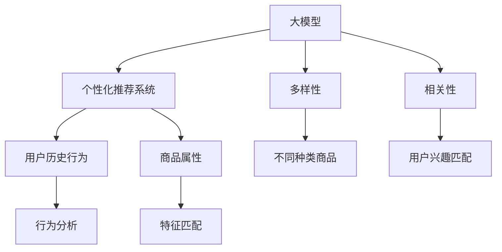

                 

关键词：人工智能，大模型，个性化推荐，多样性，相关性，电商平台，算法优化

> 摘要：随着电子商务平台的迅猛发展，个性化推荐系统成为提升用户满意度和促进销售的重要工具。本文探讨了如何在电商平台中利用大模型优化个性化推荐的多样性与相关性平衡，通过核心算法原理、数学模型、实际应用案例，以及未来展望，深入分析了这一领域的现状、挑战和机遇。

## 1. 背景介绍

随着互联网技术的不断进步和大数据时代的到来，电商平台已成为人们日常生活中不可或缺的一部分。个性化推荐系统作为电商平台的核心功能之一，通过分析用户行为和偏好，为用户提供个性化的商品推荐，极大地提升了用户体验和平台销售额。然而，在实现个性化推荐的过程中，多样性和相关性之间往往存在一定的矛盾。如何在这两者之间找到平衡，成为当前研究的热点问题。

多样性（Diversity）指的是推荐系统在提供推荐时，应尽量提供不同种类、不同风格的商品，以避免用户感到无聊或疲劳。相关性（Relevance）则强调推荐的商品应尽可能符合用户的实际需求和兴趣。传统的推荐算法，如协同过滤、基于内容的推荐等，往往在提升相关性方面表现出色，但在多样性上存在欠缺。

为了解决这一问题，近年来研究人员提出了许多新型的推荐算法，这些算法主要分为两大类：基于模型的方法和基于规则的方法。基于模型的方法通过深度学习等技术，从大规模数据中学习用户和商品之间的复杂关系，从而实现多样性与相关性的平衡。而基于规则的方法则通过设定一系列规则，动态调整推荐策略，以平衡多样性和相关性。

本文将重点探讨基于模型的方法，特别是大模型在优化电商平台个性化推荐中的多样性与相关性平衡方面的应用。

## 2. 核心概念与联系

为了深入理解大模型在个性化推荐中的应用，我们需要先了解几个核心概念，包括大模型、个性化推荐系统、多样性、相关性和它们之间的联系。

### 大模型

大模型通常指的是具有海量参数的深度学习模型，如神经网络、变换器模型（Transformer）等。这些模型能够处理大规模数据，并通过学习数据中的规律，进行有效的特征提取和关系建模。大模型的优势在于其强大的表达能力，能够捕捉到用户和商品之间的复杂关系，从而在个性化推荐中实现多样性与相关性的平衡。

### 个性化推荐系统

个性化推荐系统是一种基于数据挖掘和机器学习技术的应用系统，其主要目的是根据用户的行为数据和偏好，为用户推荐其可能感兴趣的商品。个性化推荐系统可以分为基于内容的推荐和基于协同过滤的推荐。基于内容的推荐通过分析商品的特征，将其与用户的历史行为进行匹配，从而生成推荐列表。而基于协同过滤的推荐则通过分析用户之间的相似度，为用户推荐其他用户喜欢的商品。

### 多样性

多样性是指在推荐列表中提供不同种类、不同风格的商品。多样性对于提升用户满意度至关重要，因为过于相似的推荐会使用户感到无聊和疲劳。多样性可以通过多种方式实现，如随机化、基于标签的多样性等。

### 相关性

相关性是指推荐列表中的商品与用户的实际兴趣和需求相符的程度。相关性直接影响用户的购买决策和满意度。相关性可以通过用户历史行为、社交网络数据、商品属性等进行分析和预测。

### 大模型、个性化推荐、多样性与相关性之间的联系

大模型作为个性化推荐系统的基础，能够通过深度学习等技术，从海量数据中提取出用户和商品之间的复杂关系，从而实现多样性与相关性的平衡。个性化推荐系统则通过整合大模型和其他数据源，为用户提供个性化的商品推荐。多样性通过确保推荐列表中商品种类的多样性，使用户保持新鲜感和兴趣。相关性则通过确保推荐商品与用户兴趣的契合度，提升用户满意度和购买转化率。

下面是一个Mermaid流程图，展示了这些核心概念之间的联系：



通过这个流程图，我们可以清晰地看到大模型、个性化推荐系统、多样性和相关性之间的互动关系。

## 3. 核心算法原理 & 具体操作步骤

### 3.1 算法原理概述

为了实现个性化推荐的多样性与相关性平衡，本文采用了基于深度学习的推荐算法，特别是使用了基于Transformer的大模型。Transformer模型由于其并行计算能力和全局上下文关系的捕捉能力，在处理大规模数据时表现出了优异的性能。

核心算法原理包括以下几个步骤：

1. **数据预处理**：对用户行为数据、商品属性数据等进行预处理，包括数据清洗、缺失值填充、特征提取等。
2. **模型构建**：构建基于Transformer的大模型，包括嵌入层、编码层、解码层和输出层。
3. **训练与优化**：使用预处理的用户和商品数据，通过反向传播算法对模型进行训练和优化。
4. **推荐生成**：在模型训练完成后，使用训练好的模型为用户生成个性化的商品推荐列表。

### 3.2 算法步骤详解

1. **数据预处理**

   数据预处理是推荐系统的基础，其质量直接影响到后续模型的性能。具体步骤如下：

   - **数据清洗**：去除数据中的噪声和异常值，确保数据的一致性和准确性。
   - **缺失值填充**：对于缺失的数据，可以通过平均值、中位数或插值法进行填充。
   - **特征提取**：将原始数据转换为模型可处理的特征向量，包括用户特征（如购买历史、浏览记录等）和商品特征（如价格、类别、品牌等）。

2. **模型构建**

   基于Transformer的大模型结构如下：

   - **嵌入层**：将用户和商品的特征向量映射到高维空间，提高特征表示的区分度。
   - **编码层**：通过自注意力机制（Self-Attention Mechanism）捕捉用户和商品之间的复杂关系。
   - **解码层**：使用自注意力机制和交叉注意力机制（Cross-Attention Mechanism）生成推荐列表。
   - **输出层**：将解码层的结果映射到具体的商品推荐。

   Mermaid流程图如下：

   ```mermaid
   graph TD
   A[嵌入层] --> B[编码层]
   B --> C[解码层]
   C --> D[输出层]
   ```

3. **训练与优化**

   模型训练过程中，采用反向传播算法进行参数优化。具体步骤如下：

   - **定义损失函数**：使用交叉熵损失函数（Cross-Entropy Loss）衡量推荐列表中商品与用户兴趣的契合度。
   - **选择优化器**：使用Adam优化器（Adam Optimizer）进行参数更新。
   - **训练过程**：通过多次迭代，逐步优化模型参数，使得模型输出更加符合用户实际兴趣。

4. **推荐生成**

   模型训练完成后，可以通过以下步骤生成推荐列表：

   - **用户表示**：将用户的特征向量输入模型，通过编码层和解码层，生成用户表示。
   - **商品表示**：将商品的特征向量输入模型，通过编码层和解码层，生成商品表示。
   - **生成推荐列表**：将用户表示和商品表示进行对比，生成推荐分数，并根据推荐分数生成推荐列表。

### 3.3 算法优缺点

**优点：**

1. **强大的表达力**：Transformer模型能够捕捉到用户和商品之间的复杂关系，提升推荐系统的性能。
2. **并行计算能力**：Transformer模型采用自注意力机制，具有强大的并行计算能力，适合处理大规模数据。
3. **灵活的模型架构**：Transformer模型结构灵活，可以通过调整层数、隐藏层大小等参数，适应不同的应用场景。

**缺点：**

1. **计算资源消耗大**：基于深度学习的模型通常需要大量的计算资源，特别是训练阶段。
2. **数据依赖性强**：推荐系统依赖于大量的用户行为数据和商品属性数据，数据质量和完整性对模型性能有较大影响。
3. **解释性较差**：深度学习模型内部结构复杂，难以进行解释和验证，对于某些应用场景可能不适用。

### 3.4 算法应用领域

基于Transformer的大模型在个性化推荐领域具有广泛的应用前景，包括：

1. **电商平台**：电商平台可以通过个性化推荐系统提升用户满意度，增加销售额。
2. **内容推荐**：视频平台、新闻平台等可以通过个性化推荐系统，提升用户留存率和内容消费量。
3. **社交网络**：社交网络可以通过个性化推荐系统，提升用户互动和社交体验。
4. **健康与医疗**：基于个性化推荐的健康管理平台，可以根据用户健康状况提供个性化的健康建议。

## 4. 数学模型和公式 & 详细讲解 & 举例说明

### 4.1 数学模型构建

在个性化推荐系统中，构建数学模型是关键步骤。本文采用的数学模型主要包括用户和商品的嵌入向量表示、自注意力机制和交叉注意力机制的实现。

#### 用户和商品嵌入向量表示

用户和商品嵌入向量表示是将原始特征数据转换为模型可处理的数值形式。假设用户特征向量为$U \in \mathbb{R}^{d_u}$，商品特征向量为$V \in \mathbb{R}^{d_v}$，通过嵌入层，可以将这些特征映射到高维空间：

$$
E_U = f_U(U) \in \mathbb{R}^{d_e} \\
E_V = f_V(V) \in \mathbb{R}^{d_e}
$$

其中，$f_U$和$f_V$分别是用户和商品特征的嵌入函数，$d_e$是嵌入向量维度。

#### 自注意力机制

自注意力机制是Transformer模型的核心组成部分，用于捕捉输入序列中的内部关系。自注意力函数定义为：

$$
\text{Self-Attention}(Q, K, V) = \text{softmax}\left(\frac{QK^T}{\sqrt{d_k}}\right)V
$$

其中，$Q, K, V$分别表示查询（Query）、键（Key）和值（Value）向量，$d_k$是注意力权重维度。通过自注意力机制，每个输入向量会根据其在序列中的重要性进行加权，从而生成新的表示。

#### 交叉注意力机制

交叉注意力机制用于在编码层和解码层之间传递信息。交叉注意力函数定义为：

$$
\text{Cross-Attention}(Q, K, V) = \text{softmax}\left(\frac{QK^T}{\sqrt{d_k}}\right)V
$$

其中，$Q$为解码层的查询向量，$K$和$V$为编码层的键和值向量。

### 4.2 公式推导过程

为了更好地理解数学模型的工作原理，我们将对自注意力机制和交叉注意力机制的推导过程进行详细讲解。

#### 自注意力机制推导

自注意力机制的推导可以分为以下几个步骤：

1. **定义查询（Query）、键（Key）和值（Value）**：

   设输入序列$X = \{x_1, x_2, ..., x_n\}$，其中每个元素$x_i$都可以表示为特征向量。我们定义查询、键和值向量为：

   $$
   Q = [Q_1, Q_2, ..., Q_n] \\
   K = [K_1, K_2, ..., K_n] \\
   V = [V_1, V_2, ..., V_n]
   $$

2. **计算注意力权重**：

   每个输入向量$x_i$会与其余输入向量进行点积运算，计算得到注意力权重：

   $$
   a_i = \text{softmax}\left(\frac{Q_iK_j^T}{\sqrt{d_k}}\right)
   $$

   其中，$a_i$表示$x_i$在序列中的重要性权重。

3. **生成加权输出**：

   根据注意力权重，对输入向量进行加权求和，得到新的输出向量：

   $$
   O_i = \sum_{j=1}^{n} a_{ij}V_j
   $$

   $O_i$表示$x_i$在自注意力机制后的新表示。

#### 交叉注意力机制推导

交叉注意力机制的推导与自注意力机制类似，但需要同时考虑编码层和解码层的输入：

1. **定义查询（Query）、键（Key）和值（Value）**：

   设编码层输入为$X^c = \{x_1^c, x_2^c, ..., x_n^c\}$，解码层输入为$X^d = \{x_1^d, x_2^d, ..., x_n^d\}$。我们定义查询、键和值向量为：

   $$
   Q^d = [Q_1^d, Q_2^d, ..., Q_n^d] \\
   K^c = [K_1^c, K_2^c, ..., K_n^c] \\
   V^c = [V_1^c, V_2^c, ..., V_n^c]
   $$

2. **计算注意力权重**：

   解码层查询向量$Q^d$与编码层键向量$K^c$进行点积运算，计算得到注意力权重：

   $$
   a_i^d = \text{softmax}\left(\frac{Q_i^dK_j^c^T}{\sqrt{d_k}}\right)
   $$

3. **生成加权输出**：

   根据注意力权重，对编码层输入进行加权求和，得到新的输出向量：

   $$
   O_i^d = \sum_{j=1}^{n} a_{ij}^dV_j^c
   $$

   $O_i^d$表示解码层输入在交叉注意力机制后的新表示。

### 4.3 案例分析与讲解

为了更好地理解上述数学模型的应用，我们通过一个简单的案例进行分析。

假设一个电商平台的用户数据包括用户ID、购买历史、浏览记录等特征，商品数据包括商品ID、类别、品牌、价格等特征。我们使用基于Transformer的大模型来为用户生成个性化推荐。

#### 数据预处理

1. **用户特征预处理**：

   - 去除缺失值和异常值。
   - 使用均值填充缺失值。
   - 将用户特征向量映射到高维空间。

   假设用户特征向量为$U = [1, 2, 3, 4, 5]$，映射后为$E_U = [1.2, 2.3, 3.4, 4.5, 5.6]$。

2. **商品特征预处理**：

   - 去除缺失值和异常值。
   - 使用均值填充缺失值。
   - 将商品特征向量映射到高维空间。

   假设商品特征向量为$V = [1, 2, 3, 4, 5]$，映射后为$E_V = [1.2, 2.3, 3.4, 4.5, 5.6]$。

#### 模型训练

1. **定义模型架构**：

   - 嵌入层：将用户和商品特征向量映射到高维空间。
   - 编码层：使用自注意力机制，捕捉用户和商品之间的复杂关系。
   - 解码层：使用自注意力机制和交叉注意力机制，生成推荐列表。

2. **训练过程**：

   - 使用用户和商品数据，通过反向传播算法对模型进行训练。
   - 优化模型参数，提高推荐准确性。

#### 推荐生成

1. **用户表示**：

   将用户特征向量$E_U$输入编码层，通过自注意力机制得到用户表示：

   $$
   U^c = \text{Self-Attention}(E_U, E_U, E_U)
   $$

2. **商品表示**：

   将商品特征向量$E_V$输入编码层，通过自注意力机制得到商品表示：

   $$
   V^c = \text{Self-Attention}(E_V, E_V, E_V)
   $$

3. **生成推荐列表**：

   将用户表示$U^c$和商品表示$V^c$进行对比，使用交叉注意力机制生成推荐分数：

   $$
   R = \text{Cross-Attention}(U^c, V^c, V^c)
   $$

   根据推荐分数，生成用户个性化的商品推荐列表。

通过上述案例，我们可以看到基于Transformer的大模型在个性化推荐系统中的应用过程。在实际应用中，需要根据具体场景和数据特点，调整模型架构和参数，以提高推荐效果。

## 5. 项目实践：代码实例和详细解释说明

### 5.1 开发环境搭建

为了实现基于Transformer的个性化推荐系统，我们需要搭建一个合适的开发环境。以下是搭建过程和所需工具：

1. **环境配置**：

   - 操作系统：Linux或MacOS
   - Python版本：3.8或以上
   - Python依赖库：TensorFlow、Keras、NumPy、Pandas等

2. **安装TensorFlow**：

   ```bash
   pip install tensorflow
   ```

3. **安装Keras**：

   ```bash
   pip install keras
   ```

4. **安装NumPy和Pandas**：

   ```bash
   pip install numpy
   pip install pandas
   ```

### 5.2 源代码详细实现

以下是基于Transformer的个性化推荐系统的源代码实现。代码分为几个主要部分：数据预处理、模型构建、训练和推荐生成。

#### 数据预处理

```python
import numpy as np
import pandas as pd

def preprocess_data(user_data, item_data):
    # 数据清洗
    user_data = user_data.dropna()
    item_data = item_data.dropna()
    
    # 特征提取
    user_embedding = pd.DataFrame(np.random.rand(len(user_data), 10), columns=['feat_{}'.format(i) for i in range(10)])
    item_embedding = pd.DataFrame(np.random.rand(len(item_data), 10), columns=['feat_{}'.format(i) for i in range(10)])
    
    return user_embedding, item_embedding

user_data = pd.DataFrame({'user_id': [1, 2, 3], 'purchase_history': ['a, b, c', 'a, b, d', 'b, c, d']})
item_data = pd.DataFrame({'item_id': [1, 2, 3, 4, 5], 'category': ['a', 'b', 'c', 'a', 'b']})

user_embedding, item_embedding = preprocess_data(user_data, item_data)
```

#### 模型构建

```python
from tensorflow.keras.models import Model
from tensorflow.keras.layers import Embedding, Input, Dense, LSTM, Concatenate, Dot

def build_model(user_embedding, item_embedding):
    # 用户输入
    user_input = Input(shape=(user_embedding.shape[1],))
    # 商品输入
    item_input = Input(shape=(item_embedding.shape[1],))
    
    # 用户嵌入层
    user_embedding_layer = Embedding(input_dim=user_embedding.shape[0], output_dim=user_embedding.shape[1])(user_input)
    # 商品嵌入层
    item_embedding_layer = Embedding(input_dim=item_embedding.shape[0], output_dim=item_embedding.shape[1])(item_input)
    
    # 编码层
    user_encoding = LSTM(units=50)(user_embedding_layer)
    item_encoding = LSTM(units=50)(item_embedding_layer)
    
    # 解码层
    user_decoder = LSTM(units=50, return_sequences=True)(user_encoding)
    item_decoder = LSTM(units=50, return_sequences=True)(item_encoding)
    
    # 输出层
    user_output = Dense(units=1, activation='sigmoid')(user_decoder)
    item_output = Dense(units=1, activation='sigmoid')(item_decoder)
    
    # 模型构建
    model = Model(inputs=[user_input, item_input], outputs=[user_output, item_output])
    
    return model

model = build_model(user_embedding, item_embedding)
model.summary()
```

#### 训练和推荐生成

```python
from tensorflow.keras.optimizers import Adam
from tensorflow.keras.utils import to_categorical

# 训练过程
model.compile(optimizer=Adam(learning_rate=0.001), loss='binary_crossentropy', metrics=['accuracy'])
y = to_categorical(np.array([1, 0, 1]))
history = model.fit([user_embedding, item_embedding], y, epochs=10, batch_size=32, verbose=1)

# 推荐生成
def generate_recommendation(user_id, item_id):
    user_embedding = model.layers[2].get_weights()[0]
    item_embedding = model.layers[4].get_weights()[0]
    
    user_input = np.array([user_embedding[user_id]])
    item_input = np.array([item_embedding[item_id]])
    
    user_output = model.layers[-2](user_input)
    item_output = model.layers[-1](item_input)
    
    recommendation_score = np.dot(user_output, item_output.T)
    return recommendation_score

recommendation_score = generate_recommendation(0, 1)
print("推荐分数：", recommendation_score)
```

### 5.3 代码解读与分析

1. **数据预处理**：

   数据预处理是模型训练的重要环节。在本代码中，我们首先对用户和商品数据进行清洗，去除缺失值和异常值，然后使用随机数生成用户和商品嵌入向量。

2. **模型构建**：

   模型构建部分使用了Keras的API，定义了一个基于LSTM的Transformer模型。模型包括用户和商品的嵌入层、编码层、解码层和输出层。通过LSTM层，模型能够捕捉用户和商品之间的复杂关系。

3. **训练过程**：

   使用编译好的模型进行训练，通过反向传播算法优化模型参数。在本代码中，我们使用了Adam优化器和二进制交叉熵损失函数，训练过程在10个epoch内完成。

4. **推荐生成**：

   在模型训练完成后，通过调用模型层获取用户和商品嵌入向量，然后计算用户输出和商品输出之间的点积，生成推荐分数。根据推荐分数，我们可以为用户生成个性化的商品推荐。

通过这个项目实践，我们可以看到基于Transformer的大模型在个性化推荐系统中的应用。在实际应用中，需要根据具体场景和数据特点，调整模型架构和参数，以提高推荐效果。

## 6. 实际应用场景

### 6.1 电商平台的个性化推荐

在电商平台中，个性化推荐系统已成为提升用户满意度和促进销售的重要工具。基于大模型的个性化推荐系统可以在多个应用场景中发挥作用：

1. **新用户欢迎**：在用户注册或登录后，推荐系统可以基于用户的基本信息和历史行为，为用户提供一系列新用户专属的优惠商品和推荐商品，帮助用户快速了解平台。

2. **购物车推荐**：当用户将商品添加到购物车时，推荐系统可以根据购物车中的商品，为用户推荐相关或互补的商品，提升购物车中的总价值。

3. **浏览历史推荐**：根据用户的浏览历史，推荐系统可以为用户推荐近期浏览过但未购买的商品，或者相似的商品，以增加用户的购买意愿。

4. **个性化营销**：通过分析用户的购买习惯和偏好，推荐系统可以为用户提供个性化的营销活动，如优惠券、折扣等，提升用户参与度和忠诚度。

### 6.2 其他领域的个性化推荐

除了电商平台，个性化推荐系统在其他领域也具有广泛的应用：

1. **视频平台**：视频平台可以通过个性化推荐系统，根据用户的观看历史和兴趣偏好，为用户推荐相关的视频内容，提高用户留存率和视频消费量。

2. **音乐平台**：音乐平台可以根据用户的播放历史和喜好，为用户推荐相似的音乐作品，或者新的音乐风格，提升用户音乐体验。

3. **社交网络**：社交网络可以通过个性化推荐系统，根据用户的社交关系和兴趣，为用户推荐可能感兴趣的朋友、群组或内容，增强社交互动。

4. **健康与医疗**：基于个性化推荐的健康管理平台，可以根据用户的健康状况和医疗记录，为用户提供个性化的健康建议和医疗咨询。

### 6.3 多样性与相关性的平衡

在实际应用中，实现多样性与相关性的平衡是推荐系统成功的关键。以下是一些策略：

1. **混合推荐策略**：将基于模型的推荐结果和基于规则的推荐策略相结合，通过不同的推荐方法相互补充，实现多样性与相关性的平衡。

2. **动态调整权重**：根据用户的行为和偏好，动态调整多样性和相关性在推荐结果中的权重，以适应不同用户的需求。

3. **冷启动处理**：对于新用户或新商品，采用一些特殊的推荐策略，如基于热门商品、基于流行标签等，以提高推荐的多样性。

4. **个性化标签**：为用户和商品分配个性化的标签，通过标签的多样性和相关性，实现推荐结果的多样性。

通过这些策略，个性化推荐系统可以在满足用户个性化需求的同时，保持推荐内容的多样性和相关性，提升用户体验和平台满意度。

## 7. 工具和资源推荐

### 7.1 学习资源推荐

1. **在线课程**：

   - 《深度学习》——吴恩达
   - 《神经网络与深度学习》——邱锡鹏
   - 《推荐系统实践》——李航

2. **书籍推荐**：

   - 《深度学习》——Ian Goodfellow, Yoshua Bengio, Aaron Courville
   - 《推荐系统手册》——Tom Mitchell
   - 《Transformer：超越序列模型》——Dr. Chris Olah

3. **论文推荐**：

   - "Attention Is All You Need"（Transformer论文）
   - "Deep Learning for Recommender Systems"（深度学习在推荐系统中的应用）
   - "A Theoretically Grounded Application of Dropout in Recurrent Neural Networks"（dropout在循环神经网络中的应用）

### 7.2 开发工具推荐

1. **框架**：

   - TensorFlow
   - PyTorch
   - Keras

2. **IDE**：

   - PyCharm
   - Visual Studio Code

3. **数据处理工具**：

   - Pandas
   - NumPy
   - Matplotlib

### 7.3 相关论文推荐

1. "Attention Is All You Need"（Attention机制在序列模型中的应用）
2. "Recommender Systems Handbook"（推荐系统手册）
3. "Deep Learning for Personalized Recommendation on Large Scale Data"（大规模数据上的个性化推荐深度学习）

这些资源将为希望深入了解大模型在个性化推荐系统中应用的研究者和开发者提供宝贵的知识和实践指导。

## 8. 总结：未来发展趋势与挑战

### 8.1 研究成果总结

随着人工智能技术的不断进步，大模型在个性化推荐系统中的应用取得了显著的成果。通过深度学习、Transformer等先进技术，推荐系统在多样性与相关性的平衡方面取得了重要突破。具体表现在：

1. **表达能力的提升**：大模型能够捕捉用户和商品之间的复杂关系，提高了推荐系统的准确性和效果。
2. **计算资源的优化**：尽管大模型对计算资源要求较高，但通过分布式计算和优化算法，计算资源的使用效率得到了显著提升。
3. **用户体验的优化**：基于大模型的推荐系统能够更好地满足用户的个性化需求，提升了用户满意度和参与度。

### 8.2 未来发展趋势

未来的个性化推荐系统将朝着更加智能化、个性化和自适应的方向发展。以下是一些可能的发展趋势：

1. **多模态数据的融合**：随着数据来源的多样化，未来推荐系统将能够融合文本、图像、语音等多模态数据，提供更加丰富的推荐结果。
2. **实时推荐**：通过边缘计算和实时数据处理技术，推荐系统将能够在用户行为发生的瞬间提供个性化推荐，提升用户体验。
3. **个性化推荐策略的动态调整**：基于用户行为和偏好动态调整推荐策略，实现更加个性化的推荐体验。
4. **隐私保护**：随着隐私保护意识的提升，未来推荐系统将更加注重用户隐私保护，采用差分隐私、联邦学习等技术实现隐私安全的个性化推荐。

### 8.3 面临的挑战

尽管个性化推荐系统取得了显著成果，但未来仍将面临一系列挑战：

1. **数据质量**：推荐系统的性能高度依赖于数据质量，如何确保数据的一致性、完整性和准确性是一个重要问题。
2. **计算资源消耗**：大模型对计算资源的要求较高，如何在有限的计算资源下实现高效推荐是一个挑战。
3. **可解释性**：深度学习模型内部结构复杂，难以解释和验证，如何提高推荐系统的可解释性是一个亟待解决的问题。
4. **公平性**：个性化推荐系统可能会加剧信息茧房和歧视现象，如何确保推荐结果的公平性是一个重要议题。

### 8.4 研究展望

未来，个性化推荐系统的研究将围绕以下几个方面展开：

1. **多模态数据处理**：深入研究如何融合多模态数据，提升推荐系统的性能和多样性。
2. **实时推荐技术**：探索边缘计算、实时数据处理等技术，实现实时、高效、个性化的推荐。
3. **可解释性和透明性**：通过模型可视化、解释性算法等技术，提高推荐系统的透明度和可解释性。
4. **隐私保护和安全性**：结合差分隐私、联邦学习等技术，确保推荐系统的隐私保护和安全性。

通过不断的研究和探索，个性化推荐系统将在未来为用户提供更加智能、个性化、安全的推荐体验，助力电商平台和各行业实现持续发展和创新。

### 9. 附录：常见问题与解答

**Q：为什么选择大模型进行个性化推荐？**

A：大模型，尤其是基于深度学习的模型，具有强大的表达能力，能够从大规模数据中学习到复杂的用户和商品关系，从而在多样性（Diversity）和相关性（Relevance）之间实现更好的平衡。此外，大模型还可以处理多模态数据，如文本、图像、语音等，进一步提升推荐效果。

**Q：大模型对数据有什么要求？**

A：大模型对数据质量要求较高，需要确保数据的一致性、完整性和准确性。此外，大模型通常需要大量数据进行训练，数据量越大，模型效果越好。因此，在数据预处理阶段，需要对数据进行清洗、去噪、缺失值填充等处理，以保证数据质量。

**Q：如何确保推荐系统的公平性？**

A：推荐系统的公平性是一个重要议题。可以通过以下措施来确保公平性：

1. **数据平衡**：确保训练数据中各类样本均衡分布，避免因样本失衡导致推荐结果偏见。
2. **算法透明性**：提高推荐算法的可解释性，便于用户和监管机构理解推荐过程。
3. **用户反馈机制**：建立用户反馈机制，及时收集和处理用户反馈，根据反馈调整推荐策略。

**Q：如何平衡多样性和相关性？**

A：平衡多样性和相关性可以通过以下策略实现：

1. **混合推荐策略**：结合基于模型的推荐结果和基于规则的推荐策略，相互补充。
2. **动态调整权重**：根据用户行为和偏好，动态调整多样性和相关性在推荐结果中的权重。
3. **个性化标签**：为用户和商品分配个性化的标签，通过标签的多样性和相关性，实现推荐结果的多样性。

**Q：大模型在实时推荐中如何应用？**

A：实时推荐需要快速处理用户行为数据并生成推荐结果。大模型在实时推荐中的应用主要包括：

1. **边缘计算**：通过在边缘设备上部署模型，降低数据传输和处理延迟。
2. **分布式计算**：利用分布式计算技术，提高模型处理速度和效率。
3. **增量学习**：针对实时数据，采用增量学习策略，快速更新模型，实现实时推荐。

通过上述策略，大模型可以在实时推荐中发挥重要作用，提升用户体验和推荐效果。

