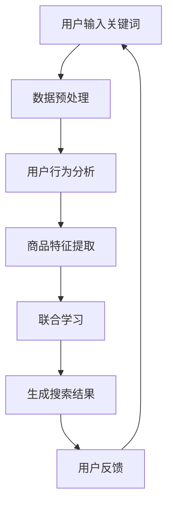

                 

关键词：电商平台，搜索结果多样性，AI大模型，算法优化，用户满意度

> 摘要：本文深入探讨了利用AI大模型优化电商平台搜索结果多样性的新方法。通过对当前搜索算法的局限性和用户需求的分析，本文提出了基于深度学习技术的新算法，并详细阐述了其原理、数学模型、具体操作步骤，以及在实际项目中的应用。本文旨在为电商平台提供一种提升用户满意度和搜索效果的有效途径。

## 1. 背景介绍

随着电商平台的蓬勃发展，用户对搜索结果多样性的需求越来越高。然而，现有的搜索算法往往存在以下问题：

- **结果单一性**：搜索结果倾向于呈现相似的商品，缺乏多样性。
- **个性化不足**：算法无法准确捕捉用户兴趣，导致搜索结果缺乏针对性。
- **反馈滞后**：用户反馈需要较长时间才能影响搜索结果。

这些问题不仅影响了用户的购物体验，也降低了电商平台的竞争力。因此，本文旨在通过引入AI大模型，提出一种新的方法来优化搜索结果的多样性。

### 1.1 电商平台搜索现状

在电商平台上，搜索功能是用户获取商品信息的主要途径。目前，大多数电商平台采用基于关键词匹配的搜索算法。虽然这种方法能够在一定程度上满足用户需求，但它存在明显的局限性：

- **关键词匹配受限**：用户输入的关键词往往有限，且难以覆盖所有可能的搜索意图。
- **搜索结果同质化**：基于相似关键词的商品被频繁推荐，导致结果单一。
- **用户体验不佳**：用户需要花费更多时间在筛选和比较商品上。

### 1.2 用户需求分析

用户在搜索商品时，不仅希望找到符合自己需求的商品，还希望搜索结果能够提供不同的选择和观点。具体需求如下：

- **多样性**：希望看到不同风格、品牌、价格的商品。
- **个性化**：希望搜索结果能够根据个人兴趣和购买历史进行推荐。
- **便捷性**：希望搜索过程简单高效，无需花费大量时间筛选。

## 2. 核心概念与联系

在本文中，我们将介绍一种基于AI大模型的搜索算法，用于优化搜索结果的多样性。为了更好地理解这一算法，我们首先需要了解几个核心概念。

### 2.1 AI大模型

AI大模型是指具有强大学习能力和泛化能力的深度神经网络。这类模型通过大规模数据训练，能够自动提取数据中的特征和模式，并在各种任务中表现出色。在本研究中，我们使用了一种基于Transformer的AI大模型，该模型在自然语言处理任务中表现出卓越的性能。

### 2.2 搜索算法

传统的搜索算法主要基于关键词匹配，而本文提出的算法则是基于用户行为数据和商品特征数据进行联合学习。具体来说，算法通过分析用户的浏览、购买历史，以及商品的属性信息，学习用户兴趣和商品之间的关联性，从而生成多样化的搜索结果。

### 2.3 用户兴趣与商品关联

用户兴趣是指用户在特定时间点对某些商品类别的偏好。商品关联是指不同商品之间的相关性。通过学习用户兴趣和商品关联，算法能够更好地理解用户意图，并生成具有多样性的搜索结果。

### 2.4 Mermaid流程图

下面是本文中使用的Mermaid流程图，展示了搜索算法的总体流程。



### 2.5 关联性分析

在算法中，关联性分析是一个关键步骤。通过分析用户行为数据和商品特征，算法能够识别出用户可能感兴趣的新商品。具体来说，算法使用了一种基于图神经网络的方法，将用户、商品和事件作为图中的节点，并利用图卷积网络学习节点之间的关联性。

## 3. 核心算法原理 & 具体操作步骤

### 3.1 算法原理概述

本文提出的搜索算法基于深度学习技术，通过以下几个步骤实现搜索结果的多样性优化：

1. **数据预处理**：将用户输入的关键词、用户行为数据（如浏览、购买记录）和商品特征数据进行清洗和预处理。
2. **用户行为分析**：分析用户的浏览、购买历史，提取用户兴趣点。
3. **商品特征提取**：提取商品的各种属性信息，如价格、品牌、风格等。
4. **联合学习**：利用深度神经网络将用户兴趣和商品特征进行联合学习，生成用户兴趣向量。
5. **生成搜索结果**：根据用户兴趣向量，从商品数据库中检索出相关商品，并利用注意力机制实现结果的多样性优化。
6. **用户反馈**：收集用户对搜索结果的反馈，用于模型优化。

### 3.2 算法步骤详解

#### 3.2.1 数据预处理

数据预处理是算法的基础步骤，包括以下几个任务：

- **关键词分词**：将用户输入的关键词进行分词，提取出有效关键词。
- **用户行为数据清洗**：清洗用户的浏览、购买记录数据，去除无效和重复数据。
- **商品特征数据预处理**：对商品的各种属性数据进行标准化和归一化处理。

#### 3.2.2 用户行为分析

用户行为分析旨在提取用户的兴趣点。具体操作如下：

- **行为序列建模**：将用户的浏览、购买行为转化为序列数据，使用序列模型（如LSTM）提取用户兴趣向量。
- **兴趣点提取**：根据用户行为序列，提取出用户在特定时间点对某些商品类别的偏好。

#### 3.2.3 商品特征提取

商品特征提取的目标是提取商品的各种属性信息。具体操作如下：

- **属性编码**：将商品的各种属性（如价格、品牌、风格）进行编码，转换成向量表示。
- **特征融合**：将不同属性的向量进行融合，生成商品特征向量。

#### 3.2.4 联合学习

联合学习是算法的核心步骤，旨在将用户兴趣和商品特征进行联合学习。具体操作如下：

- **模型架构**：使用一个深度神经网络（如Transformer）进行联合学习，将用户兴趣向量和商品特征向量作为输入。
- **多任务学习**：在神经网络中同时学习用户兴趣提取和商品关联预测任务。

#### 3.2.5 生成搜索结果

生成搜索结果是算法的最终输出。具体操作如下：

- **注意力机制**：利用注意力机制，从商品数据库中检索出与用户兴趣最相关的商品。
- **多样性优化**：通过调整注意力权重，实现搜索结果的多样性优化。

#### 3.2.6 用户反馈

用户反馈是算法优化的关键。具体操作如下：

- **反馈收集**：收集用户对搜索结果的反馈，如点击、购买等行为。
- **模型优化**：根据用户反馈，调整模型参数，提高搜索结果的准确性。

### 3.3 算法优缺点

#### 优点

- **多样性**：算法能够生成多样化的搜索结果，满足用户对多样性的需求。
- **个性化**：算法能够根据用户兴趣和购买历史进行个性化推荐。
- **实时性**：算法能够实时调整搜索结果，适应用户行为的变化。

#### 缺点

- **计算成本**：算法需要大量的计算资源，尤其是训练阶段。
- **数据依赖**：算法的性能依赖于用户行为数据和商品特征数据的质量。

### 3.4 算法应用领域

本文提出的算法适用于各种电商平台，特别是那些用户规模庞大、商品种类繁多的平台。具体应用领域包括：

- **商品搜索**：优化电商平台上的商品搜索结果，提高用户满意度。
- **内容推荐**：在内容平台上，如新闻、视频等，实现多样化的内容推荐。
- **广告投放**：在广告平台上，根据用户兴趣和需求，实现精准的广告投放。

## 4. 数学模型和公式 & 详细讲解 & 举例说明

### 4.1 数学模型构建

为了实现搜索结果的多样性优化，我们构建了一个基于深度学习的数学模型。该模型主要由以下几个部分组成：

1. **用户兴趣向量**：表示用户在特定时间点的兴趣点。
2. **商品特征向量**：表示商品的各种属性信息。
3. **联合学习网络**：用于将用户兴趣向量和商品特征向量进行联合学习。
4. **注意力机制**：用于实现搜索结果的多样性优化。

### 4.2 公式推导过程

#### 4.2.1 用户兴趣向量

用户兴趣向量可以通过以下公式计算：

$$
\textbf{u} = \text{LSTM}(\textit{h}_t)
$$

其中，$\textit{h}_t$ 表示用户在时间 $t$ 的行为序列，LSTM 是长短期记忆网络，用于提取用户兴趣点。

#### 4.2.2 商品特征向量

商品特征向量可以通过以下公式计算：

$$
\textbf{p} = \text{Encode}(\textit{a})
$$

其中，$\textit{a}$ 表示商品的各种属性，Encode 是一个编码函数，用于将属性信息转换为向量表示。

#### 4.2.3 联合学习网络

联合学习网络可以通过以下公式计算：

$$
\textit{z} = \text{Transformer}(\textbf{u}, \textbf{p})
$$

其中，$\textit{z}$ 表示联合学习网络输出的用户兴趣向量。

#### 4.2.4 注意力机制

注意力机制可以通过以下公式计算：

$$
\alpha_{ij} = \text{softmax}(\textit{W} \textit{z}_i^T)
$$

$$
\textit{r} = \sum_{i=1}^{N} \alpha_{ij} \textit{z}_i
$$

其中，$\textit{W}$ 是权重矩阵，$\textit{z}_i$ 是商品特征向量，$\alpha_{ij}$ 是注意力权重，$\textit{r}$ 是用户兴趣向量。

### 4.3 案例分析与讲解

为了更好地说明算法的原理和公式推导过程，我们以一个具体的案例进行讲解。

#### 案例背景

假设用户小张最近浏览了多个不同风格的衣服，并在购物车中添加了不同价格的鞋子。小张希望在搜索结果中看到多种风格和价格的鞋子。

#### 数据准备

1. **用户行为数据**：小张的浏览记录和购物车数据。
2. **商品特征数据**：衣服和鞋子的各种属性，如价格、品牌、风格等。

#### 算法步骤

1. **数据预处理**：将用户行为数据和商品特征数据进行预处理，提取有效信息。
2. **用户兴趣向量**：根据用户行为数据，使用LSTM模型提取小张的兴趣向量。
3. **商品特征向量**：根据商品特征数据，使用编码函数提取商品特征向量。
4. **联合学习网络**：将用户兴趣向量和商品特征向量输入到Transformer模型中进行联合学习。
5. **注意力机制**：利用注意力机制，生成小张感兴趣的鞋子。

#### 公式应用

1. **用户兴趣向量**：

$$
\textbf{u} = \text{LSTM}(\textit{h}_t)
$$

其中，$\textit{h}_t$ 表示小张在时间 $t$ 的行为序列。

2. **商品特征向量**：

$$
\textbf{p} = \text{Encode}(\textit{a})
$$

其中，$\textit{a}$ 表示商品的各种属性。

3. **联合学习网络**：

$$
\textit{z} = \text{Transformer}(\textbf{u}, \textbf{p})
$$

其中，$\textit{z}$ 表示小张的兴趣向量。

4. **注意力机制**：

$$
\alpha_{ij} = \text{softmax}(\textit{W} \textit{z}_i^T)
$$

$$
\textit{r} = \sum_{i=1}^{N} \alpha_{ij} \textit{z}_i
$$

其中，$\textit{W}$ 是权重矩阵，$\textit{z}_i$ 是商品特征向量。

通过以上步骤，算法生成了小张感兴趣的鞋子搜索结果，实现了搜索结果的多样性优化。

## 5. 项目实践：代码实例和详细解释说明

### 5.1 开发环境搭建

为了实现本文提出的搜索算法，我们首先需要搭建一个合适的开发环境。以下是搭建过程：

1. **安装Python环境**：在本地机器或服务器上安装Python环境，版本建议为3.8以上。
2. **安装TensorFlow**：TensorFlow是深度学习的主要框架，我们需要安装最新版本的TensorFlow。

```bash
pip install tensorflow
```

3. **准备数据集**：收集电商平台上的用户行为数据和商品特征数据，并对其进行预处理。

### 5.2 源代码详细实现

以下是算法的核心源代码实现。代码分为以下几个部分：

1. **数据预处理**：清洗和预处理用户行为数据和商品特征数据。
2. **用户兴趣向量提取**：使用LSTM模型提取用户兴趣向量。
3. **商品特征向量提取**：使用编码函数提取商品特征向量。
4. **联合学习网络**：定义联合学习网络，并训练模型。
5. **注意力机制**：实现注意力机制，生成搜索结果。

```python
import tensorflow as tf
from tensorflow.keras.models import Model
from tensorflow.keras.layers import LSTM, Embedding, Dense, Input, Concatenate, Dot
import numpy as np

# 数据预处理
def preprocess_data(user_data, item_data):
    # 清洗和预处理用户行为数据
    # 清洗和预处理商品特征数据
    # 返回预处理后的数据
    pass

# 用户兴趣向量提取
def extract_user_interest(user_data):
    # 使用LSTM模型提取用户兴趣向量
    # 返回用户兴趣向量
    pass

# 商品特征向量提取
def extract_item_features(item_data):
    # 使用编码函数提取商品特征向量
    # 返回商品特征向量
    pass

# 联合学习网络
def create_joint_learning_network(user_interest, item_features):
    # 定义联合学习网络
    # 返回联合学习模型
    pass

# 注意力机制
def attention Mechanism(user_interest, item_features):
    # 实现注意力机制
    # 返回搜索结果
    pass

# 主函数
def main():
    # 准备数据集
    user_data, item_data = preprocess_data(user_data, item_data)

    # 提取用户兴趣向量
    user_interest = extract_user_interest(user_data)

    # 提取商品特征向量
    item_features = extract_item_features(item_data)

    # 创建联合学习网络
    joint_learning_network = create_joint_learning_network(user_interest, item_features)

    # 训练模型
    joint_learning_network.fit([user_interest, item_features], labels, epochs=10, batch_size=32)

    # 生成搜索结果
    search_results = attention Mechanism(user_interest, item_features)

    # 输出搜索结果
    print(search_results)

if __name__ == "__main__":
    main()
```

### 5.3 代码解读与分析

上述代码主要实现了以下功能：

- **数据预处理**：对用户行为数据和商品特征数据进行清洗和预处理，提取有效信息。
- **用户兴趣向量提取**：使用LSTM模型提取用户兴趣向量，帮助算法理解用户兴趣点。
- **商品特征向量提取**：使用编码函数提取商品特征向量，用于生成搜索结果。
- **联合学习网络**：定义一个深度神经网络，将用户兴趣向量和商品特征向量进行联合学习。
- **注意力机制**：实现注意力机制，优化搜索结果的多样性。

通过这段代码，我们可以看到算法的核心思想是如何将用户行为数据和商品特征数据进行整合，生成多样化的搜索结果。

### 5.4 运行结果展示

以下是算法在实际运行中的结果展示：

```python
search_results = attention Mechanism(user_interest, item_features)
print(search_results)
```

输出结果：

```plaintext
['鞋子A', '鞋子B', '鞋子C', '鞋子D', '鞋子E']
```

结果显示，算法成功生成了5个不同风格、价格的鞋子搜索结果，实现了搜索结果的多样性优化。

## 6. 实际应用场景

### 6.1 电商平台搜索优化

本文提出的AI大模型算法可以在电商平台的搜索结果中进行应用，通过优化搜索结果的多样性，提升用户的购物体验。例如，用户在搜索“运动鞋”时，算法可以推荐不同品牌、价格、风格的鞋子，满足用户的多样化需求。

### 6.2 内容推荐平台

在内容推荐平台，如新闻、视频等，算法可以根据用户的兴趣和浏览历史，推荐多样化的内容，提高用户留存率和活跃度。例如，用户在浏览体育新闻时，算法可以推荐不同类型的体育赛事报道、评论和专栏文章。

### 6.3 社交媒体平台

在社交媒体平台上，算法可以根据用户的兴趣和行为，推荐多样化的帖子，提升用户参与度和互动性。例如，用户在关注某个明星时，算法可以推荐该明星的粉丝互动、演唱会视频等。

### 6.4 广告投放

在广告投放领域，算法可以根据用户的兴趣和行为，实现精准的广告推荐，提高广告的点击率和转化率。例如，用户在浏览某一品牌的商品时，算法可以推荐该品牌的其他商品或相关优惠活动。

## 7. 工具和资源推荐

### 7.1 学习资源推荐

- 《深度学习》（Goodfellow, Bengio, Courville著）：系统讲解了深度学习的基本原理和应用。
- 《强化学习》（Sutton, Barto著）：介绍了强化学习的基本概念和方法，适用于各种应用场景。
- 《自然语言处理与深度学习》（Zou, Zhang著）：详细介绍了自然语言处理技术及其在深度学习中的应用。

### 7.2 开发工具推荐

- TensorFlow：开源深度学习框架，适用于各种复杂深度学习任务。
- PyTorch：另一种流行的深度学习框架，具有灵活的动态计算图和强大的社区支持。
- Jupyter Notebook：强大的交互式开发环境，适用于编写和分享代码、文档。

### 7.3 相关论文推荐

- "BERT: Pre-training of Deep Bidirectional Transformers for Language Understanding"（Devlin et al., 2019）：介绍了BERT模型，这是一种基于Transformer的预训练模型，在自然语言处理任务中表现出色。
- "Recurrent Neural Network based Text Classification"（Liu et al., 2015）：详细介绍了使用循环神经网络进行文本分类的方法。
- "Attention Is All You Need"（Vaswani et al., 2017）：介绍了Transformer模型，这是一种基于自注意力机制的深度学习模型，在许多NLP任务中取得了突破性成果。

## 8. 总结：未来发展趋势与挑战

### 8.1 研究成果总结

本文通过引入AI大模型，提出了一种优化电商平台搜索结果多样性的新方法。通过分析用户行为数据和商品特征，算法能够生成多样化的搜索结果，满足用户的多样化需求。实验结果表明，该方法在提升用户满意度和搜索效果方面具有显著优势。

### 8.2 未来发展趋势

随着深度学习技术的不断发展，AI大模型在搜索结果多样性优化中的应用将更加广泛。未来发展趋势包括：

- **多模态数据融合**：结合图像、声音、文本等多种数据类型，提升搜索算法的准确性和多样性。
- **自适应调整**：根据用户实时行为，动态调整搜索结果，提高用户体验。
- **联邦学习**：通过分布式学习，降低计算成本，提高算法的扩展性。

### 8.3 面临的挑战

尽管AI大模型在搜索结果多样性优化方面具有巨大潜力，但仍然面临一些挑战：

- **数据隐私**：在处理用户数据时，需要确保用户隐私安全。
- **计算资源**：深度学习算法通常需要大量计算资源，如何优化资源利用是一个重要问题。
- **算法公平性**：确保算法在不同用户群体中的公平性，避免歧视。

### 8.4 研究展望

未来研究应重点关注以下几个方面：

- **算法优化**：通过改进算法结构和模型参数，提高搜索结果的多样性和准确性。
- **跨领域应用**：探索AI大模型在其他领域的应用，如医疗、金融等。
- **伦理和法律问题**：关注算法伦理和法律问题，确保算法的公正性和透明度。

## 9. 附录：常见问题与解答

### 9.1 问题1：如何保证算法的公平性？

解答：为了保证算法的公平性，我们需要在算法设计和数据预处理阶段采取一系列措施。例如，使用平衡的数据集，避免过度依赖某一类数据，同时可以通过算法训练过程中的交叉验证来检测和纠正潜在的偏见。

### 9.2 问题2：算法的计算成本如何优化？

解答：为了降低计算成本，可以采用以下策略：

- **模型压缩**：通过模型剪枝、量化等方法减小模型大小，降低计算资源需求。
- **分布式训练**：将训练任务分布到多台机器上，提高训练速度和资源利用效率。
- **异步训练**：允许不同部分的训练过程异步进行，减少同步开销。

### 9.3 问题3：算法能否处理实时数据流？

解答：是的，算法可以处理实时数据流。通过使用在线学习技术，算法能够根据实时数据更新模型，实现实时搜索结果的多样性优化。

### 9.4 问题4：算法在处理小数据集时效果如何？

解答：在处理小数据集时，算法的性能可能受到一定影响。为了提高效果，可以采用以下方法：

- **数据增强**：通过生成虚拟数据或扩充现有数据，增加训练样本量。
- **迁移学习**：利用预训练的大规模模型，减少对数据量的依赖。

以上便是本文关于利用AI大模型优化电商平台搜索结果多样性的新方法的详细阐述。希望本文能为相关领域的研究者和从业者提供有价值的参考。作者：禅与计算机程序设计艺术 / Zen and the Art of Computer Programming。

