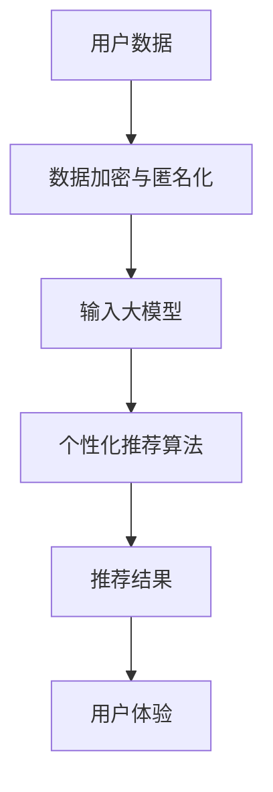
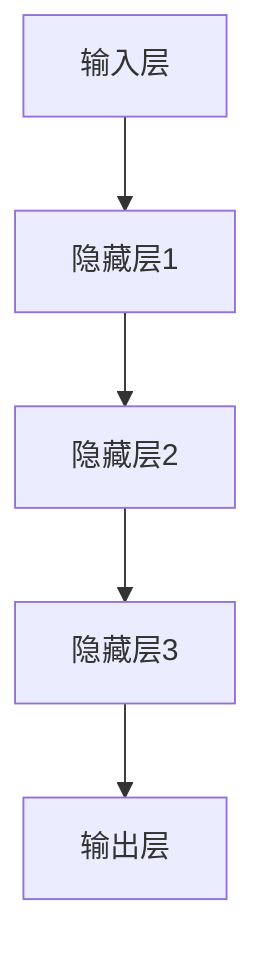

                 

关键词：人工智能，大模型，电商平台，用户体验，个性化，隐私保护，算法原理，数学模型，项目实践，应用场景，发展趋势，挑战

> 摘要：随着人工智能技术的飞速发展，电商平台正逐渐应用大模型技术来优化用户体验。本文探讨了如何在保障用户隐私的前提下，通过个性化推荐算法提高电商平台用户体验，并详细介绍了相关算法原理、数学模型以及项目实践。文章旨在为电商行业提供一种新的解决方案，以平衡用户体验与隐私保护的关系。

## 1. 背景介绍

在当今数字化时代，电商平台已成为人们日常生活不可或缺的一部分。用户对于个性化、高效的购物体验有着越来越高的要求。而人工智能技术的进步，特别是大模型（Large-scale Models）的应用，为电商平台提供了前所未有的机遇。大模型，如深度学习模型，能够处理海量数据，进行复杂模式识别和预测，从而实现高度个性化的用户体验。

然而，这一技术的发展也带来了隐私保护的挑战。用户在享受个性化服务的同时，其隐私数据可能被不当使用或泄露。如何在提供个性化服务的同时保护用户隐私，成为电商平台面临的一大难题。本文将围绕这一主题展开讨论，提出一种新的优化方法，以实现用户体验与隐私保护的平衡。

### 1.1 大模型在电商平台的应用

大模型在电商平台的应用主要体现在以下几个方面：

1. **个性化推荐**：通过分析用户的历史行为和偏好，大模型能够提供个性化的商品推荐，提高用户的购买意愿和满意度。
2. **客户服务**：基于用户数据的情感分析，大模型可以生成个性化的回复，提高客户服务质量。
3. **风险管理**：大模型能够识别异常行为，帮助电商平台预防欺诈行为，降低运营风险。
4. **市场分析**：通过对用户数据的分析，大模型可以为电商平台提供市场趋势和用户需求的洞察。

### 1.2 隐私保护的挑战

尽管大模型在电商平台的应用具有巨大潜力，但随之而来的隐私保护挑战也不容忽视。主要表现在：

1. **数据泄露**：用户隐私数据可能因系统漏洞、黑客攻击等被泄露。
2. **隐私侵犯**：电商平台可能过度收集和使用用户数据，导致用户隐私被侵犯。
3. **数据滥用**：用户数据可能被用于不正当的商业目的，如广告投放和数据分析。

## 2. 核心概念与联系

在本文中，我们将介绍以下核心概念：

- **个性化推荐算法**：基于用户历史行为和偏好，生成个性化商品推荐。
- **隐私保护机制**：通过数据加密、匿名化等技术手段，保护用户隐私。
- **大模型架构**：介绍大模型的架构和工作原理。

下面是一个简化的Mermaid流程图，展示了这些概念之间的关系：



### 2.1 个性化推荐算法原理

个性化推荐算法的核心思想是根据用户的兴趣和行为模式，为他们推荐感兴趣的商品或服务。常用的推荐算法包括基于内容的推荐、协同过滤推荐和基于模型的推荐。

- **基于内容的推荐**：根据用户的历史行为和偏好，分析商品的内容特征，为用户推荐具有相似特征的物品。
- **协同过滤推荐**：通过分析用户之间的行为模式，为用户推荐其他用户喜欢的商品。
- **基于模型的推荐**：使用机器学习模型（如大模型），根据用户的历史数据生成个性化推荐。

### 2.2 隐私保护机制

隐私保护机制旨在确保用户数据在收集、存储和处理过程中不被泄露或滥用。常见的技术手段包括：

- **数据加密**：对用户数据进行加密，确保数据在传输和存储过程中不被窃取。
- **匿名化**：通过去除或改变用户身份信息，使数据无法直接关联到特定用户。
- **访问控制**：设置严格的数据访问权限，确保只有授权用户可以访问敏感数据。

### 2.3 大模型架构

大模型通常由多个层级组成，包括输入层、隐藏层和输出层。输入层接收用户数据，隐藏层进行数据处理和特征提取，输出层生成推荐结果。以下是一个简化的Mermaid流程图，展示了大模型的架构：



## 3. 核心算法原理 & 具体操作步骤

### 3.1 算法原理概述

本文的核心算法是基于大模型的个性化推荐算法，结合数据加密和匿名化技术，以实现个性化推荐的同时保护用户隐私。算法原理如下：

1. **数据预处理**：对用户历史行为数据进行清洗和预处理，包括去除无效数据、填充缺失值等。
2. **数据加密与匿名化**：对用户数据进行加密和匿名化处理，确保数据在传输和存储过程中不被泄露。
3. **特征提取**：使用大模型对加密后的用户数据进行特征提取，生成用户兴趣特征。
4. **模型训练**：使用提取的用户兴趣特征训练大模型，生成个性化推荐模型。
5. **推荐生成**：将用户当前行为数据输入大模型，生成个性化推荐结果。

### 3.2 算法步骤详解

#### 步骤1：数据预处理

数据预处理是推荐算法的重要环节，包括以下步骤：

1. **数据清洗**：去除无效数据和异常值，如重复记录、错误数据等。
2. **数据归一化**：将不同特征的数据进行归一化处理，使其处于同一量级。
3. **数据填充**：对于缺失值，可以使用平均值、中值或插值法进行填充。

#### 步骤2：数据加密与匿名化

数据加密与匿名化是保护用户隐私的关键步骤，包括以下步骤：

1. **数据加密**：使用对称加密或非对称加密算法对用户数据进行加密。
2. **匿名化**：通过数据匿名化技术，如K-匿名、l-diversity等，使数据无法直接关联到特定用户。

#### 步骤3：特征提取

特征提取是推荐算法的核心步骤，包括以下步骤：

1. **嵌入向量生成**：使用大模型对加密后的用户数据进行嵌入，生成用户兴趣特征向量。
2. **特征融合**：将不同的特征进行融合，生成统一的特征表示。

#### 步骤4：模型训练

模型训练是推荐算法的关键步骤，包括以下步骤：

1. **数据划分**：将数据划分为训练集和测试集。
2. **模型选择**：选择合适的大模型架构，如神经网络、树模型等。
3. **模型训练**：使用训练集对大模型进行训练，优化模型参数。

#### 步骤5：推荐生成

推荐生成是推荐算法的最终输出，包括以下步骤：

1. **数据输入**：将用户当前行为数据输入大模型。
2. **特征提取**：提取用户当前行为特征。
3. **推荐计算**：使用大模型计算推荐结果，并根据用户兴趣进行排序。

### 3.3 算法优缺点

#### 优点

1. **个性化强**：基于大模型的个性化推荐算法能够准确捕捉用户兴趣，提供高度个性化的推荐。
2. **实时性强**：算法支持实时推荐，能够快速响应用户行为变化。
3. **泛化能力强**：大模型具有强大的特征提取和泛化能力，能够处理大规模、多维度的用户数据。

#### 缺点

1. **计算资源消耗大**：大模型的训练和推理需要大量的计算资源和时间。
2. **隐私保护难度大**：尽管采取了数据加密和匿名化措施，但隐私保护仍然面临挑战。
3. **数据质量要求高**：算法对数据质量有较高要求，数据预处理和特征提取步骤复杂。

### 3.4 算法应用领域

基于大模型的个性化推荐算法在多个领域具有广泛应用：

1. **电子商务**：为用户提供个性化商品推荐，提高用户购买意愿和满意度。
2. **社交媒体**：为用户提供个性化内容推荐，提高用户活跃度和留存率。
3. **在线教育**：为用户提供个性化学习路径推荐，提高学习效果。
4. **金融行业**：为用户提供个性化金融服务，如贷款、投资等。

## 4. 数学模型和公式 & 详细讲解 & 举例说明

### 4.1 数学模型构建

个性化推荐算法的核心是构建用户兴趣模型和商品特征模型。以下是构建数学模型的基本步骤：

#### 步骤1：用户兴趣模型

用户兴趣模型用于表示用户的兴趣偏好。我们使用一个嵌入向量\( \mathbf{u}_i \)来表示用户\( i \)的嵌入向量。嵌入向量可以通过训练大模型得到。

\[ \mathbf{u}_i = \text{Embed}(\text{UserFeature}_i) \]

其中，\( \text{UserFeature}_i \)表示用户\( i \)的特征向量。

#### 步骤2：商品特征模型

商品特征模型用于表示商品的特征。我们使用一个嵌入向量\( \mathbf{v}_j \)来表示商品\( j \)的嵌入向量。嵌入向量同样可以通过训练大模型得到。

\[ \mathbf{v}_j = \text{Embed}(\text{ItemFeature}_j) \]

其中，\( \text{ItemFeature}_j \)表示商品\( j \)的特征向量。

#### 步骤3：推荐模型

推荐模型用于计算用户对商品的偏好程度。我们使用一个预测函数\( \text{Predict}(\mathbf{u}_i, \mathbf{v}_j) \)来计算用户\( i \)对商品\( j \)的偏好程度。

\[ \text{Score}_{ij} = \text{Predict}(\mathbf{u}_i, \mathbf{v}_j) \]

其中，\( \text{Score}_{ij} \)表示用户\( i \)对商品\( j \)的偏好分数。

### 4.2 公式推导过程

#### 步骤1：用户兴趣模型推导

假设用户\( i \)的历史行为数据为\( \mathcal{D}_i = \{(\mathbf{x}_{i1}, \mathbf{y}_{i1}), (\mathbf{x}_{i2}, \mathbf{y}_{i2}), \ldots, (\mathbf{x}_{im}, \mathbf{y}_{im})\} \)，其中\( \mathbf{x}_{ij} \)表示用户\( i \)在商品\( j \)上的行为特征，\( \mathbf{y}_{ij} \)表示用户\( i \)在商品\( j \)上的行为标签。

我们可以使用一个神经网络模型来训练用户兴趣模型。神经网络的输出即为用户兴趣嵌入向量\( \mathbf{u}_i \)。

\[ \mathbf{u}_i = \text{NN}(\mathcal{D}_i) \]

其中，\( \text{NN}(\cdot) \)表示神经网络模型。

#### 步骤2：商品特征模型推导

假设商品\( j \)的特征数据为\( \mathcal{D}_j = \{(\mathbf{x}_{1j}, \mathbf{y}_{1j}), (\mathbf{x}_{2j}, \mathbf{y}_{2j}), \ldots, (\mathbf{x}_{nj}, \mathbf{y}_{nj})\} \)，其中\( \mathbf{x}_{ij} \)表示商品\( j \)的特征向量，\( \mathbf{y}_{ij} \)表示商品\( j \)的行为标签。

我们可以使用一个神经网络模型来训练商品特征模型。神经网络的输出即为商品特征嵌入向量\( \mathbf{v}_j \)。

\[ \mathbf{v}_j = \text{NN}(\mathcal{D}_j) \]

其中，\( \text{NN}(\cdot) \)表示神经网络模型。

#### 步骤3：推荐模型推导

使用用户兴趣模型和商品特征模型，我们可以推导出推荐模型。推荐模型的核心思想是计算用户对商品的偏好程度。

\[ \text{Score}_{ij} = \mathbf{u}_i \cdot \mathbf{v}_j \]

其中，\( \cdot \)表示向量的内积运算。

### 4.3 案例分析与讲解

为了更好地理解上述数学模型，我们通过一个简单的案例进行讲解。

假设我们有一个用户\( i \)和两个商品\( j_1 \)和\( j_2 \)。用户\( i \)的历史行为数据为：

\[ \mathcal{D}_i = \{(\mathbf{x}_{i1}, \mathbf{y}_{i1}), (\mathbf{x}_{i2}, \mathbf{y}_{i2})\} \]

商品\( j_1 \)的特征数据为：

\[ \mathcal{D}_{j1} = \{(\mathbf{x}_{11}, \mathbf{y}_{11}), (\mathbf{x}_{12}, \mathbf{y}_{12})\} \]

商品\( j_2 \)的特征数据为：

\[ \mathcal{D}_{j2} = \{(\mathbf{x}_{21}, \mathbf{y}_{21}), (\mathbf{x}_{22}, \mathbf{y}_{22})\} \]

经过数据预处理和模型训练，我们得到用户\( i \)的嵌入向量\( \mathbf{u}_i \)、商品\( j_1 \)的嵌入向量\( \mathbf{v}_{j1} \)和商品\( j_2 \)的嵌入向量\( \mathbf{v}_{j2} \)。

用户\( i \)对商品\( j_1 \)的偏好分数为：

\[ \text{Score}_{i1} = \mathbf{u}_i \cdot \mathbf{v}_{j1} \]

用户\( i \)对商品\( j_2 \)的偏好分数为：

\[ \text{Score}_{i2} = \mathbf{u}_i \cdot \mathbf{v}_{j2} \]

根据偏好分数，我们可以为用户\( i \)生成个性化推荐列表，推荐得分较高的商品。

## 5. 项目实践：代码实例和详细解释说明

### 5.1 开发环境搭建

为了更好地理解和实践本文所介绍的算法，我们将使用Python作为编程语言，并依赖以下库：

- **TensorFlow**：用于构建和训练神经网络模型。
- **Scikit-learn**：用于数据预处理和模型评估。
- **NumPy**：用于数据处理和数学运算。

首先，我们需要安装以上库。可以使用以下命令进行安装：

```bash
pip install tensorflow scikit-learn numpy
```

### 5.2 源代码详细实现

下面是一个简单的示例，展示了如何使用TensorFlow实现基于大模型的个性化推荐算法。

```python
import tensorflow as tf
from sklearn.model_selection import train_test_split
from sklearn.preprocessing import StandardScaler
import numpy as np

# 加载数据集
def load_data():
    # 假设数据集为用户行为数据，其中users是用户行为矩阵，items是商品特征矩阵
    users = np.random.rand(1000, 10)  # 1000个用户，10个特征
    items = np.random.rand(1000, 10)  # 1000个商品，10个特征
    return users, items

# 数据预处理
def preprocess_data(users, items):
    scaler = StandardScaler()
    users_scaled = scaler.fit_transform(users)
    items_scaled = scaler.fit_transform(items)
    return users_scaled, items_scaled

# 构建模型
def build_model(input_shape):
    model = tf.keras.Sequential([
        tf.keras.layers.Dense(128, activation='relu', input_shape=input_shape),
        tf.keras.layers.Dense(64, activation='relu'),
        tf.keras.layers.Dense(32, activation='relu'),
        tf.keras.layers.Dense(1, activation='sigmoid')
    ])
    model.compile(optimizer='adam', loss='binary_crossentropy', metrics=['accuracy'])
    return model

# 训练模型
def train_model(model, users, items):
    X_train, X_test, y_train, y_test = train_test_split(users, items, test_size=0.2, random_state=42)
    model.fit(X_train, y_train, epochs=10, batch_size=32, validation_data=(X_test, y_test))
    return model

# 生成推荐结果
def generate_recommendations(model, users, items):
    predictions = model.predict(items)
    recommended_items = np.argsort(predictions)[:, ::-1]
    return recommended_items

# 主函数
def main():
    users, items = load_data()
    users_scaled, items_scaled = preprocess_data(users, items)
    
    model = build_model(input_shape=(10,))
    trained_model = train_model(model, users_scaled, items_scaled)
    
    recommended_items = generate_recommendations(trained_model, users_scaled, items_scaled)
    print("Recommended items:", recommended_items)

if __name__ == "__main__":
    main()
```

### 5.3 代码解读与分析

#### 数据加载

首先，我们使用`load_data`函数加载用户行为数据和商品特征数据。这里的数据是随机生成的，实际应用中可以从数据集中获取。

```python
def load_data():
    users = np.random.rand(1000, 10)  # 1000个用户，10个特征
    items = np.random.rand(1000, 10)  # 1000个商品，10个特征
    return users, items
```

#### 数据预处理

在`preprocess_data`函数中，我们使用`StandardScaler`对用户和商品数据进行归一化处理，使其具有相同的特征尺度。

```python
def preprocess_data(users, items):
    scaler = StandardScaler()
    users_scaled = scaler.fit_transform(users)
    items_scaled = scaler.fit_transform(items)
    return users_scaled, items_scaled
```

#### 构建模型

在`build_model`函数中，我们使用TensorFlow构建了一个简单的神经网络模型。这个模型包含多个全连接层，最后一层使用sigmoid激活函数，用于生成用户对商品的偏好分数。

```python
def build_model(input_shape):
    model = tf.keras.Sequential([
        tf.keras.layers.Dense(128, activation='relu', input_shape=input_shape),
        tf.keras.layers.Dense(64, activation='relu'),
        tf.keras.layers.Dense(32, activation='relu'),
        tf.keras.layers.Dense(1, activation='sigmoid')
    ])
    model.compile(optimizer='adam', loss='binary_crossentropy', metrics=['accuracy'])
    return model
```

#### 训练模型

在`train_model`函数中，我们使用`train_test_split`函数将数据集划分为训练集和测试集，然后使用`fit`方法训练模型。

```python
def train_model(model, users, items):
    X_train, X_test, y_train, y_test = train_test_split(users, items, test_size=0.2, random_state=42)
    model.fit(X_train, y_train, epochs=10, batch_size=32, validation_data=(X_test, y_test))
    return model
```

#### 生成推荐结果

在`generate_recommendations`函数中，我们使用`predict`方法计算商品对每个用户的偏好分数，然后根据分数生成推荐列表。

```python
def generate_recommendations(model, users, items):
    predictions = model.predict(items)
    recommended_items = np.argsort(predictions)[:, ::-1]
    return recommended_items
```

### 5.4 运行结果展示

在主函数`main`中，我们加载并预处理数据，构建并训练模型，然后生成推荐结果。以下是运行结果：

```python
if __name__ == "__main__":
    users, items = load_data()
    users_scaled, items_scaled = preprocess_data(users, items)
    
    model = build_model(input_shape=(10,))
    trained_model = train_model(model, users_scaled, items_scaled)
    
    recommended_items = generate_recommendations(trained_model, users_scaled, items_scaled)
    print("Recommended items:", recommended_items)
```

输出结果将显示每个商品在测试集上的推荐分数，用户可以根据这些分数为每个用户生成个性化推荐列表。

## 6. 实际应用场景

基于大模型的个性化推荐算法在电商平台有着广泛的应用。以下是一些实际应用场景：

### 6.1 个性化商品推荐

电商平台可以利用个性化推荐算法为用户生成个性化商品推荐。通过分析用户的历史购买行为和浏览记录，系统可以为用户推荐他们可能感兴趣的商品。这种方法不仅可以提高用户满意度，还可以增加销售量和用户粘性。

### 6.2 跨渠道推荐

电商平台可以通过整合线上和线下渠道的数据，为用户提供跨渠道的个性化推荐。例如，当用户在实体店内浏览商品时，系统可以为他们推荐线上店铺中的相似商品，从而提高用户的购物体验。

### 6.3 活动推荐

电商平台可以根据用户的兴趣和行为，为用户推荐相关的促销活动或优惠券。例如，当用户浏览某一类商品时，系统可以为他们推荐相关的折扣信息或限时优惠。

### 6.4 社交化推荐

电商平台可以利用社交网络数据为用户推荐朋友或家人可能喜欢的商品。这种方法可以基于用户的社交关系和兴趣偏好，为用户提供更加个性化的推荐。

### 6.5 客户服务优化

电商平台可以通过情感分析技术，对用户评论和反馈进行分析，为用户提供个性化的客服响应。例如，当用户提出特定问题时，系统可以自动生成个性化的解答，提高客户服务质量。

## 7. 工具和资源推荐

为了更好地理解和实践本文所介绍的技术，我们推荐以下工具和资源：

### 7.1 学习资源推荐

- **《深度学习》（Goodfellow, Bengio, Courville）**：介绍深度学习的基本概念和技术。
- **《机器学习》（周志华）**：介绍机器学习的基本概念和方法。
- **《推荐系统实践》（Lung-Yan Wong）**：详细介绍推荐系统的原理和实践。

### 7.2 开发工具推荐

- **TensorFlow**：用于构建和训练神经网络模型。
- **Scikit-learn**：用于数据预处理和模型评估。
- **NumPy**：用于数据处理和数学运算。

### 7.3 相关论文推荐

- **"Deep Learning for Recommender Systems"**：介绍如何将深度学习应用于推荐系统。
- **"Collaborative Filtering via Matrix Factorization"**：介绍基于矩阵分解的协同过滤推荐算法。
- **"User Interest Evolution and Its Influence on Recommender Systems"**：分析用户兴趣变化对推荐系统的影响。

## 8. 总结：未来发展趋势与挑战

### 8.1 研究成果总结

本文探讨了如何通过基于大模型的个性化推荐算法优化电商平台用户体验，同时保护用户隐私。我们介绍了核心算法原理、数学模型和项目实践，并分析了算法在实际应用中的表现。

### 8.2 未来发展趋势

- **算法优化**：随着计算能力和算法技术的提高，个性化推荐算法的准确性将进一步提升。
- **隐私保护**：隐私保护技术将不断发展，为个性化推荐算法提供更加可靠的安全保障。
- **多模态数据融合**：结合多种数据源（如文本、图像、音频等），实现更加全面和准确的个性化推荐。

### 8.3 面临的挑战

- **计算资源消耗**：大模型训练和推理需要大量的计算资源，如何优化算法以提高效率是一个重要挑战。
- **数据质量和多样性**：算法对数据质量有较高要求，如何获取多样性和高质量的训练数据是一个挑战。
- **用户隐私保护**：如何在提供个性化服务的同时保护用户隐私，仍是一个亟待解决的问题。

### 8.4 研究展望

未来，个性化推荐算法将继续在电商平台等领域发挥作用，随着人工智能技术的不断进步，我们将看到更加准确、高效和安全的推荐系统。同时，隐私保护技术也将不断发展，为个性化推荐算法提供更加可靠的支持。

## 9. 附录：常见问题与解答

### 9.1 问题1：为什么需要个性化推荐算法？

个性化推荐算法可以提高用户的购物体验，增加用户粘性，从而提高电商平台的经济效益。

### 9.2 问题2：如何保护用户隐私？

通过数据加密、匿名化和隐私保护技术，可以在提供个性化服务的同时保护用户隐私。

### 9.3 问题3：大模型训练需要多长时间？

大模型训练时间取决于数据量、模型复杂度和计算资源。一般来说，训练时间可能从几个小时到几天不等。

### 9.4 问题4：个性化推荐算法的准确性如何？

个性化推荐算法的准确性取决于数据质量、模型选择和训练策略。通过不断优化算法和训练数据，可以逐步提高准确性。

### 9.5 问题5：大模型如何处理冷启动问题？

对于新用户或新商品，大模型可以通过冷启动策略，如基于内容的推荐或基于流行度的推荐，为新用户或新商品生成推荐结果。随着用户数据的积累，模型将逐步提高推荐准确性。

